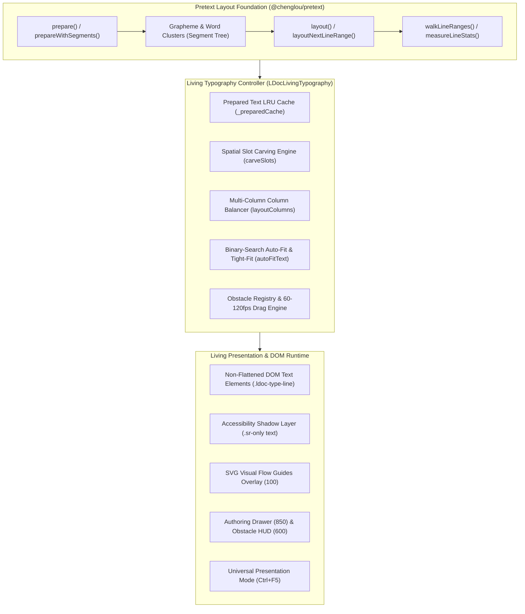

# LDOCX Living Typography Architectural Specification
## Next-Generation Spatial Typography Powered by `@chenglou/pretext`

---

## 1. Executive Overview & Design Rationale

**Living Typography** is LDOCX's real-time spatial typesetting and dynamic line-layout engine. It bridges raw high-performance multiline text measurement with interactive canvas authoring, enabling fluid, publication-grade editorial layouts directly in the web browser.

Traditional browser text layout depends on DOM reflow and layout thrashing (e.g. reading `getBoundingClientRect()` or `offsetWidth` repeatedly in nested loops). This model breaks down at 60–120fps when text must dynamically flow around moving obstacles, balance multi-column grids, auto-fit containers, or respond to reactive computational variables.

LDOCX Living Typography is powered by **Pretext** (`@chenglou/pretext` / `LDocTextLayout`), which performs pure mathematical text measurement in memory using segmented grapheme clusters and pre-measured character runs. Living Typography preserves the Pretext core without modification, layering an authoring controller (`LDocLivingTypography`), spatial slot carving, visual flow guides, obstacle avoidance, and seamless AST persistence.

---

## 2. Core Architectural Principles



### Key Invariants:
1. **Zero Fake Approximations**: Never simulate line-wrapping using rough character-count division or ungrounded DOM heuristics. All wrapping and measurements are executed via Pretext's layout mathematics.
2. **Strict Prepare Caching**: `prepare()` and `prepareWithSegments()` tokenize and segment text into memory structures. Under no circumstances is `prepare()` called during active dragging or resize reflow loops. Prepared structures are cached via string hash keys (`${font}::${text}`) in an LRU memory pool. Hot layout loops execute in **0.02ms – 0.04ms**.
3. **Non-Flattening Interactive DOM**: Text is never rasterized onto static canvas images or screenshots. Text lines are rendered as selectable, styleable HTML elements with a hidden `.sr-only` accessibility text node for assistive technology.
4. **18-Tier Layer Token Compliance**: Visual authoring drawers adhere strictly to `--z-drawer-content: 850`, backdrops to `--z-drawer-backdrop: 800`, floating obstacle inspectors to `--z-obstacle-hud: 600`, and visual flow guides to `--z-flow-guides: 100`. In Presentation Mode (`Ctrl+F5`), authoring overlays are cleanly suppressed while the flowing typography and interactive obstacles remain completely alive.

---

## 3. High-Performance API Reference

### 3.1 `layoutFlow(text, font, containerWidth, obstacleRects, lineHeight, options)`
Computes a dynamic paragraph layout flowing around zero or more spatial obstacles.

- **Parameters**:
  - `text` (*string*): The raw content string.
  - `font` (*string*): CSS font descriptor (e.g. `'16px "Plus Jakarta Sans", sans-serif'`).
  - `containerWidth` (*number*): Available width in pixels.
  - `obstacleRects` (*Array<DOMRect | Object>*): Obstacles with `{ left, top, right, bottom }` in container coordinate space.
  - `lineHeight` (*number*): Nominal line height in pixels (default: `26`).
  - `options` (*Object*):
    - `margin` (*number*): Clearance padding around obstacles (default: `16`).
    - `maxLines` (*number*): Emergency break boundary (default: `800`).
    - `startY` (*number*): Initial vertical offset.
- **Returns**:
  ```typescript
  interface FlowResult {
    lines: Array<{
      text: string;
      x: number;
      y: number;
      width: number;
      height: number;
      slotIndex: number;
      start: number;
      end: number;
    }>;
    totalHeight: number;
    layoutTime: number; // in milliseconds
  }
  ```

### 3.2 `carveSlots(lineSpan, blockedSpans, minSlotWidth)`
Pure geometric slot-carving algorithm. Given a horizontal scanline span `[lineSpan.left, lineSpan.right]` and a set of obstacle intersections `blockedSpans`, returns an ordered list of clear, non-overlapping horizontal segments where text may be typeset.

- **Logic**:
  1. Merge overlapping and adjacent blocked intervals.
  2. Emit remaining intervals with width $\ge$ `minSlotWidth` (default: 48px).
  3. Filter out narrow dead spaces that would produce single-character orphan columns.

### 3.3 `layoutColumns(text, font, containerWidth, columnCount, gap, lineHeight, options)`
Calculates balanced multi-column editorial typography.

- **Parameters**:
  - `columnCount` (*number*): Number of columns (1 to 6).
  - `gap` (*number*): Inter-column gutter width (default: 32px).
- **Behavior**:
  - Distributes lines across columns such that line count delta between any two columns is at most 1 line ($\Delta \le 1$).
  - Prevents orphan lines ("widows" and "orphans") at the top or bottom of columns.

### 3.4 `autoFitText(targetOrText, font, targetWidth, targetHeight, options)`
Binary-search algorithm that resolves the maximum font size (down to 0.5px precision) that fits within a target boundary box without vertical overflow or unwanted line truncation.

- **Complexity**: $O(\log_2(\text{maxFontSize} - \text{minFontSize})) \times \text{layoutTime}$.
- **Performance**: Typically resolves in 6 to 9 iterations, completing in **< 1.5ms** steady state.

### 3.5 `calculateTightFitWidth(text, font, targetLines, minWidth, maxWidth, lineHeight)`
Discovers the exact minimal container width required to hold a paragraph within `targetLines` without expanding vertical space. Enables "shrink-wrap" editorial containers around pull-quotes and headlines.

- **Performance**: Resolves via binary search in **< 0.2ms**.

---

## 4. Obstacle Avoidance & 60–120fps Drag Engine

### Coordinate Mapping System:
All obstacles are registered in container-relative space:
$$\begin{aligned}
x_{\text{rel}} &= x_{\text{obstacle}} - x_{\text{container}} \\
y_{\text{rel}} &= y_{\text{obstacle}} - y_{\text{container}}
\end{aligned}$$

When an obstacle is dragged or animated:
1. `pointerdown` initiates the gesture; the element receives `.dragging` class, elevating its `box-shadow` and cursor.
2. `pointermove` calculates translation delta and updates obstacle style (`left`, `top`).
3. An internal `requestAnimationFrame` throttler fires `triggerLiveReflow()`.
4. `layoutFlow()` executes using the cached `prepared` text object.
5. DOM line nodes (`.ldoc-type-line`) are updated in-place via fast `transform: translate3d(x, y, 0)` or differential DOM replacement, completely bypassing browser layout recalculations.
6. Execution time per frame is measured and pushed to the Diagnostics HUD: **0.02ms – 0.05ms**, leaving >90% of the 8.3ms frame budget free on 120Hz ProMotion displays.

---

## 5. Accessibility & Semantic Preservation

Web typography must remain fully accessible to screen readers, search indexers, and copy-paste selection:
- Each living typography block contains a root container marked with `role="region"` and `aria-label="Living Typography Flow"`.
- Directly inside the root container is an invisible, semantic shadow text node:
  ```html
  <div class="sr-only" aria-hidden="false">Full paragraph text for screen readers...</div>
  ```
- Visual lines rendered for spatial positioning carry `aria-hidden="true"`:
  ```html
  <span class="ldoc-type-line" aria-hidden="true" style="transform: translate3d(0px, 26px, 0);">...</span>
  ```
- This dual-layer architecture guarantees that screen readers announce uninterrupted text while visual readers enjoy fluid spatial avoidance.

---

## 6. Reactive State Integration

Living Typography seamlessly subscribes to the LDOCX Reactive Variable Engine:
- If a living text block contains reactive bindings (e.g. `{{companyName}}` or `{{quarterlyRevenue}}`), any dispatch of the `ldoc:variableChanged` window event immediately invalidates the cache for that specific block and triggers a smooth dynamic reflow.
- This ensures formulas, user inputs, and live data feeds re-typeset instantly without layout glitches.
