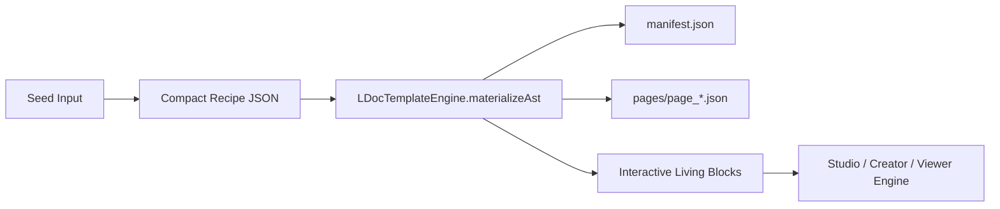

# LDOCX Procedural Template Generation Engine Architecture

## 1. Executive Overview

The **LDOCX Procedural Template Generation Engine** (`src/ldoc-template-engine.js`) introduces an infinite-capacity, zero-storage document synthesis system. Traditional design platforms require storing millions of static JSON templates on central cloud servers, incurring significant operational, bandwidth, and maintenance overhead. 

LDOCX solves this under the **Zero-Cost Development Philosophy**:
Instead of storing 1,000,000+ repetitive template files, the platform utilizes **deterministic procedural synthesis**:
$$\text{Seed} \xrightarrow{\text{Mulberry32 PRNG}} \text{Recipe} \xrightarrow{\text{AST Compiler}} \text{Valid Canonical .ldocx AST}$$

A 4-byte to 8-byte deterministic numeric or alphanumeric seed generates a complete, mathematically balanced, WCAG AA/AAA compliant, interactive living document blueprint in **less than 5 milliseconds** on the client side without any cloud server dependency.

---

## 2. Combinatorial Mathematical Capacity

The procedural design space is composed of orthogonal, highly curated aesthetic dimensions:

| Dimension | Count | Description |
| :--- | :---: | :--- |
| **Master Categories** | 10 | Marketing, Social, Document, Presentation, Education, Event, Business, Personal, Technical, Interactive |
| **Subtypes & Archetypes** | 72 | 8 targeted design archetypes per master category |
| **Layout Matrices** | 50 | Canonical spatial grid and block distribution patterns |
| **Color Palettes** | 50 | WCAG AA/AAA compliant palettes across 5 distinct aesthetic archetypes |
| **Typography Pairings** | 20 | Mathematically proportional heading/body font pairings |

### Combinatorial Space Calculation
$$\text{Total Spaces} = 10 \times 72 \times 50 \times 50 \times 20 = \mathbf{36,000,000+} \text{ Deterministic Reproducible Blueprints}$$

Every single combination is 100% reproducible across any device, browser, or operating system given the same input seed.

---

## 3. Core PRNG Architecture: The Mulberry32 Algorithm

The procedural engine uses a standalone 32-bit state generator with high avalanche characteristics and full deterministic reproducibility:

```javascript
function mulberry32(seed) {
  let s = seed >>> 0;
  return function () {
    s = (s + 0x6D2B79F5) | 0;
    let t = Math.imul(s ^ (s >>> 15), 1 | s);
    t = (t + Math.imul(t ^ (t >>> 7), 61 | t)) ^ t;
    return ((t ^ (t >>> 14)) >>> 0) / 4294967296;
  };
}
```

### Seed Transformation Pipeline
1. **Input Normalization**: Accepts raw integers, hex tokens, or strings (e.g., `"seed_startup_growth"` converted via 32-bit FNV/DJB2 hash).
2. **State Seeding**: Initializes PRNG internal state $s \in [0, 2^{32}-1]$.
3. **Bounded Picking**:
   - `prng.range(min, max)`: Uniform distribution integer extraction.
   - `prng.pick(array)`: Constant-time deterministic element indexing.

---

## 4. Design Dimensions & Archetypes

### 4.1 Master Categories & 72 Subtypes
1. **Marketing & Growth**: `infographic_poster`, `product_launch_sheet`, `sales_flyer`, `feature_comparison`, `event_invitation`, `coupon_voucher`, `billboard_banner`, `social_campaign`.
2. **Social & Visual Media**: `instagram_post`, `youtube_thumbnail`, `linkedin_banner`, `tiktok_slide`, `pinterest_pin`, `twitter_header`, `story_visual`, `podcast_cover`.
3. **Documents & Reports**: `executive_summary`, `whitepaper_brief`, `meeting_agenda`, `invoice_billing`, `formal_memo`, `compliance_audit`, `press_release`, `letterhead_memo`.
4. **Presentations & Pitches**: `pitch_deck`, `investor_update`, `sales_keynote`, `webinar_deck`, `team_all_hands`, `product_roadmap`, `quarterly_review`, `conference_keynote`.
5. **Education & Assessment**: `interactive_quiz`, `lecture_presentation`, `flashcard_deck`, `syllabus_guide`, `scientific_lab_report`, `curriculum_summary`, `student_handout`, `training_manual`.
6. **Events & Invitations**: `wedding_invitation`, `party_flyer`, `conference_badge`, `gala_ticket`, `concert_poster`, `anniversary_card`, `greeting_card`, `rsvp_schedule`.
7. **Business & Strategy**: `business_plan`, `financial_report`, `org_chart`, `strategy_canvas`, `kpi_dashboard`, `brand_guidelines`, `project_proposal`, `swot_analysis`.
8. **Personal & Lifestyle**: `resume_cv`, `portfolio_showcase`, `meal_planner`, `travel_itinerary`, `budget_tracker`, `wedding_planner`, `photo_album`, `habit_tracker`.
9. **Technical & Engineering**: `api_specification`, `system_architecture`, `database_schema`, `network_topology`, `incident_postmortem`, `rfc_proposal`, `circuit_schematic`, `maintenance_protocol`.
10. **Interactive & STEM**: `physics_pendulum_sim`, `projectile_motion_sim`, `circuit_ohm_analyzer`, `gravitational_orbital_sim`, `elastic_collision_sim`, `rc_filter_sim`, `mortgage_calculator`, `beam_bending_sim`.

### 4.2 WCAG AA/AAA Palettes (50 Curated Sets)
Divided into 5 archetypes:
- **Cyber Hologram / Dark Glass**: Deep slate backgrounds (`#07090e`), neon cyan/purple accents, high contrast text (`#f8fafc`).
- **Corporate Executive**: Symmetrical blues, navy surfaces, emerald financial highlights.
- **Warm Editorial / Heritage**: Soft parchment textures, obsidian typography, warm amber/burgundy accents.
- **Modern Minimal / Clean**: Strict monochrome foundations with single vibrant primary brand highlights.
- **Vibrant Creative**: Dynamic gradients, duotone accents, hyper-saturated hero highlights.

### 4.3 Typography Pairings (20 Curated Systems)
- `Plus Jakarta Sans` / `Plus Jakarta Sans` (Tech Modern)
- `Cinzel` / `Plus Jakarta Sans` (Heritage Luxury)
- `Space Grotesk` / `JetBrains Mono` (Cyber Engineering)
- `Playfair Display` / `Plus Jakarta Sans` (Editorial Elegance)
- `Dancing Script` / `Plus Jakarta Sans` (Event Invitation)

---

## 5. Recipe to AST Materialization Pipeline

The procedural engine does not output proprietary layout wrappers. It compiles directly into the **canonical Open Living Document Format (.ldocx)**:



### Living AST Block Generation
Depending on the category and layout matrix, the materializer instantiates rich living blocks:
- **Heading & Pretext Paragraphs**: Formatted with exact typography pairings.
- **Reactive Data Charts**: Pre-configured Chart.js specifications with dynamic datasets.
- **STEM Simulation Sandboxes**: Inlined kinematic or orbital physics engines with interactive sliders.
- **Interactive Quizzes**: Multiple-choice assessments wired to the zero-eval quiz engine.
- **3D WebGL Models**: Real-time rotating geometries (polyhedrons, crystals, exploded assemblies).
- **Tactile Paper & Dynamic FX Shaders**: Environmental background atmospheric layers.

---

## 6. Integration Endpoints

1. **Procedural Blueprint Hub (`templates.html`)**:
   - Allows users to input seeds, randomize, filter by category/subtype, preview color swatches, and 1-click launch into Studio or Creator.
2. **Visual Creator (`creator.html`)**:
   - Parses `?templateSeed=${seed}&category=${cat}&subtype=${sub}` on load and invokes `LDocTemplateEngine.materializeAst` directly into `edPages`.
3. **Living Document Studio (`studio.html`)**:
   - Parses `?templateSeed=${seed}` and launches the living presentation in real-time.
   - Embeds Command Palette action `Ctrl+K -> Procedural Blueprint Explorer` for on-the-fly blueprint generation.
