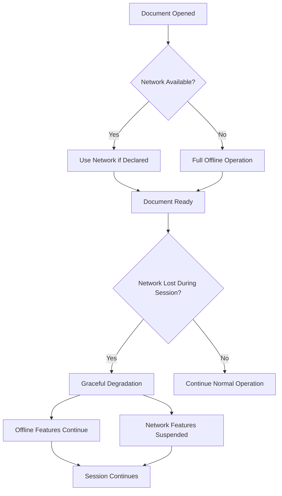
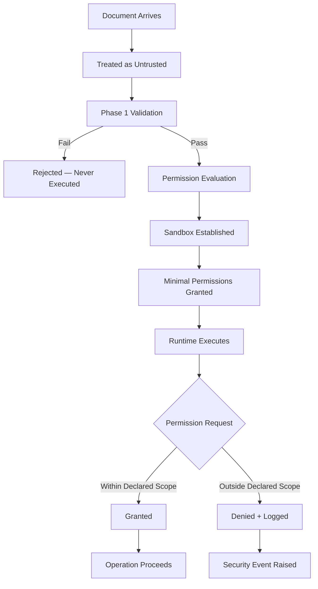
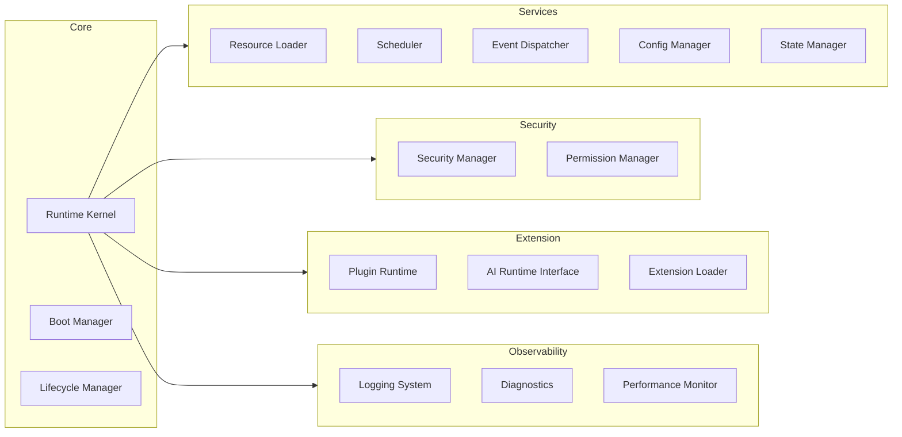

# Phase 2 — Module 01: Runtime Philosophy
# LDFX Runtime Foundation Specification

**Specification Version:** 2.0.0
**Status:** Canonical — Approved
**Phase:** 2 — Runtime Foundation
**Section:** 1 of 17
**Depends On:** Phase 1 (Modules 01–12)

---

## 1. Runtime Philosophy

---

### 1.1 Why LDFX Needs a Runtime

A static file format defines structure.
A runtime defines behavior.

Phase 1 established the LDFX file format — the rules for how bytes are arranged,
how metadata is stored, how assets are named, and how integrity is verified.
That is necessary but not sufficient.

A `.ldfx` document is not a passive container of data. It is a **living document** —
it can execute scripts, render dynamic content, load AI models, synchronize with
the cloud, host plugins, respond to user interaction, and adapt to the reader's
context. None of that is possible without a runtime.

The LDFX Runtime is the execution environment that:

- Opens and validates a `.ldfx` file using the Phase 1 specification
- Parses and interprets the document's content model
- Manages all resources the document requires during its lifetime
- Enforces the security and permission model
- Provides a stable API surface for renderers, editors, plugins, and AI engines
- Handles the full lifecycle from cold boot to graceful shutdown

Without the runtime, a `.ldfx` file is a validated archive.
With the runtime, it becomes a living, interactive, intelligent document.

---

### 1.2 Runtime Goals

The LDFX Runtime is designed to achieve the following primary goals:

| # | Goal | Description |
|---|---|---|
| G-01 | Correctness | Every document that passes Phase 1 validation must open and run correctly |
| G-02 | Security | No document may exceed its declared permissions or escape its sandbox |
| G-03 | Performance | Cold boot to ready state in under 500ms for standard documents |
| G-04 | Portability | Identical behavior on Windows, Linux, macOS, and WASM targets |
| G-05 | Reliability | Runtime must never crash due to a malformed or malicious document |
| G-06 | Extensibility | New capabilities must be addable without breaking existing documents |
| G-07 | Observability | Every runtime operation must be traceable in developer and diagnostic mode |
| G-08 | Determinism | Given the same document and inputs, the runtime must produce the same outputs |
| G-09 | Offline-first | All core runtime operations must function without network access |
| G-10 | Backward Compatibility | Runtime v2.x must open all documents created for runtime v1.x |

---

### 1.3 Runtime Principles

The following principles govern every architectural decision in the LDFX Runtime.
They are ordered by priority. When two principles conflict, the higher-ranked
principle takes precedence.

#### Principle 1 — Security First

Security is not a feature. It is a constraint that applies to every component,
every interface, and every decision. No performance optimization, convenience
feature, or extensibility mechanism may weaken the security model.

Every document is treated as untrusted input until it passes the full validation
pipeline. Every plugin is treated as untrusted code until it is granted explicit
permissions. Every network request is denied unless explicitly permitted.

#### Principle 2 — Offline First

The runtime must be fully functional without any network connection. Network
access is an optional capability, not a requirement. Documents that declare
`requires_network: false` must open, render, and execute completely offline.

This principle exists because:
- Documents must be readable in air-gapped environments
- Network failures must not cause document failures
- Privacy requires that no data leaves the device without explicit user consent

#### Principle 3 — Deterministic Execution

Given the same document bytes, the same runtime version, and the same inputs,
the runtime must produce identical outputs on every platform. This enables:
- Reproducible testing
- Verifiable document rendering
- Reliable hash-based integrity checking
- Predictable plugin behavior

Non-determinism is only permitted in explicitly declared areas: timestamps,
random number generation for UI effects, and network-sourced data.

#### Principle 4 — Modular Architecture

Every runtime component is independently replaceable. No component may have
a hard dependency on the internal implementation of another component. All
inter-component communication happens through defined interfaces.

This enables:
- Independent testing of each component
- Platform-specific implementations of low-level components
- Future replacement of components without breaking the system

#### Principle 5 — Fail Safe

When the runtime encounters an error it cannot recover from, it must fail in a
controlled, predictable, and safe manner. It must never:
- Expose raw memory contents
- Execute untrusted code outside the sandbox
- Leave resources in an inconsistent state
- Silently ignore security violations

Every failure mode is defined. Every error has a recovery path or a clean
shutdown path.

#### Principle 6 — Portability

The runtime core must be written in platform-agnostic Rust. Platform-specific
behavior is isolated to the Platform Adapter layer. The same runtime binary
must run on Windows 10+, Linux (kernel 5.4+), macOS 12+, and WASM targets
without behavioral differences.

#### Principle 7 — Minimal Surface Area

The runtime exposes the minimum API surface necessary to support its consumers
(renderer, editor, plugins, AI engine). Every public interface is a commitment.
Interfaces are added deliberately and removed only through a formal deprecation
process.

#### Principle 8 — Explicit Over Implicit

No runtime behavior is implicit. Every capability a document uses must be
declared in its manifest. Every permission a plugin requires must be declared
and granted. Every resource a document loads must be tracked. Nothing happens
silently.

---

### 1.4 Offline-First Philosophy

The offline-first philosophy is a foundational constraint, not an afterthought.

**Rules:**

1. The runtime boots entirely from the `.ldfx` file. No external resource is
   required to reach Ready state unless `requires_network: true` is declared.

2. If `requires_network: false` (the default), the runtime must never make
   any outbound network call during normal operation.

3. If network connectivity is lost during a session, the runtime must continue
   operating with all offline-capable features. Network-dependent features are
   suspended, not crashed.

4. All caching strategies are designed to maximize offline availability.
   Resources fetched during an online session are cached for offline use
   according to the document's declared cache policy.

5. Sync operations (cloud sync, collaboration) are always asynchronous and
   non-blocking. Their failure never blocks document operation.

---

### 1.5 Security-First Philosophy

The security model is built on the principle of **zero implicit trust**.

**Rules:**

1. Every document is untrusted until it passes the full 14-stage validation pipeline.
2. A document that fails any fatal validation stage is never executed.
3. Permissions are evaluated at boot time. A document cannot acquire permissions
   it did not declare in its manifest.
4. All plugin and script execution happens inside a WASM sandbox with no direct
   access to the host system.
5. Every security event is logged. Security logs cannot be disabled by the document.
6. The runtime's own memory is isolated from plugin memory.
7. Resource limits (CPU, memory, network bandwidth) are enforced per plugin and
   per document.

---

### 1.6 Modular Architecture Philosophy

The runtime is composed of independently deployable modules. Each module owns
a single responsibility and communicates with other modules only through
defined interfaces.

No module may import from another module's internal implementation.
All cross-module calls go through the module's public interface.

---

### 1.7 Deterministic Execution

Determinism is a first-class requirement. The runtime guarantees:

| Operation | Deterministic? | Notes |
|---|---|---|
| Document parsing | ✅ Yes | Same bytes → same parse result |
| Validation pipeline | ✅ Yes | Same document → same validation result |
| Asset loading from file | ✅ Yes | Content-addressed, hash-verified |
| Page layout calculation | ✅ Yes | Same layout spec → same layout |
| Plugin execution | ✅ Yes | WASM is deterministic by design |
| Timestamp generation | ❌ No | Wall clock — explicitly non-deterministic |
| Random number generation | ❌ No | Explicitly non-deterministic, seeded separately |
| Network responses | ❌ No | External — explicitly non-deterministic |
| User input | ❌ No | External — explicitly non-deterministic |

Non-deterministic operations are isolated, declared, and never allowed to
affect the document's structural integrity or security state.

---

### 1.8 Portability

The runtime targets four execution environments:

| Platform | Target | Notes |
|---|---|---|
| Windows 10+ | `x86_64-pc-windows-msvc` | Primary desktop target |
| Linux (kernel 5.4+) | `x86_64-unknown-linux-gnu` | Primary server/desktop target |
| macOS 12+ | `aarch64-apple-darwin`, `x86_64-apple-darwin` | Universal binary |
| Web (WASM) | `wasm32-unknown-unknown` | Browser and edge runtime |

**Portability rules:**

1. The runtime core contains zero platform-specific code.
2. All platform-specific behavior is isolated in the Platform Adapter layer.
3. The Platform Adapter exposes a single interface. The runtime core calls
   only that interface — never the OS directly.
4. WASM builds exclude the Platform Adapter and replace it with a
   JavaScript bridge layer.
5. All file paths within the runtime are handled as abstract paths.
   Platform-specific path separators are resolved only at the Platform Adapter.

---

### 1.9 Scalability

The runtime is designed to scale across a wide range of document complexity:

| Document Class | Pages | Assets | Plugins | AI Models | Target Boot Time |
|---|---|---|---|---|---|
| Minimal | 1–10 | 0–5 | 0 | 0 | < 100ms |
| Standard | 10–100 | 5–50 | 0–2 | 0 | < 500ms |
| Rich | 100–500 | 50–200 | 2–5 | 0–1 | < 1500ms |
| Complex | 500–2000 | 200–1000 | 5–10 | 1–3 | < 5000ms |
| Extreme | 2000+ | 1000+ | 10+ | 3+ | < 15000ms |

Scalability is achieved through:
- Lazy loading — only the entry page and its direct dependencies are loaded at boot
- Streaming — large assets are streamed, not fully buffered
- Background loading — non-critical resources load after Ready state
- Pagination — page content is loaded on demand, not all at once
- Resource pooling — shared resources (fonts, themes) are loaded once

---

### 1.10 Long-Term Compatibility

The runtime is designed to remain compatible across years of evolution.

#### 1.10.1 Backward Compatibility

A runtime at version `N.x.x` must be able to open any document created for
runtime version `1.x.x` through `N.x.x`.

Rules:
- The MAJOR version in the binary header must match the runtime MAJOR version
- MINOR version differences are handled gracefully (warn, not fail)
- Deprecated features are supported for a minimum of two major versions
- No field in any JSON schema may be removed without a deprecation cycle

#### 1.10.2 Forward Compatibility

A runtime at version `N.x.x` encountering a document created for version
`N+1.x.x` must:
- Open the document if the MAJOR version matches
- Warn about unknown fields (never fail on unknown fields)
- Apply the `unknown_feature_policy` declared in the manifest
- Disable features it does not understand rather than crashing

| Policy Value | Runtime Behavior |
|---|---|
| `warn` | Log a warning, continue with known features |
| `error` | Refuse to open the document |
| `ignore` | Silently skip unknown features |
| `safe_mode` | Open in safe mode with all unknown features disabled |

---

### 1.11 Performance Objectives

| Metric | Target | Measurement Method |
|---|---|---|
| Cold boot (minimal doc) | < 100ms | Time from file open to Ready state |
| Cold boot (standard doc) | < 500ms | Time from file open to Ready state |
| Memory baseline | < 32MB | RSS at Ready state, minimal document |
| Memory per page | < 2MB | Additional RSS per loaded page |
| Asset load (1MB image) | < 50ms | Time from request to available |
| Plugin load | < 200ms | Time from discovery to ready |
| Event dispatch latency | < 1ms | Time from emit to first listener |
| Shutdown (clean) | < 200ms | Time from close signal to process exit |
| Validation pipeline | < 50ms | Time for full 14-stage validation |

These are targets, not guarantees. Documents that exceed resource limits
receive warnings. Documents that severely exceed limits may be opened in
a degraded mode with a user notification.

---

### 1.12 Reliability Objectives

| Metric | Target |
|---|---|
| Runtime crash rate | 0 crashes due to document content |
| Security violation containment | 100% — no violation escapes the sandbox |
| Data loss on crash | 0 — all writes are atomic |
| Recovery from plugin crash | 100% — plugin crash never crashes runtime |
| Recovery from corrupted asset | 100% — corrupted asset shows error, document continues |
| Graceful degradation on missing feature | 100% — unknown features are skipped, not crashed |

---

### 1.13 Summary

The LDFX Runtime is the execution layer that transforms a validated `.ldfx`
archive into a living, interactive document. Its design is governed by eight
principles — security first, offline first, determinism, modularity, fail-safe
behavior, portability, minimal surface area, and explicit over implicit.

Every architectural decision in the sections that follow is traceable back to
one or more of these principles. When a future decision conflicts with these
principles, the principles win.

---

**Next:** Module 02 — Layered Architecture
