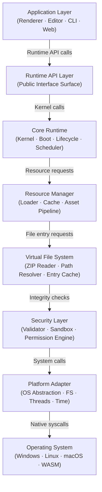
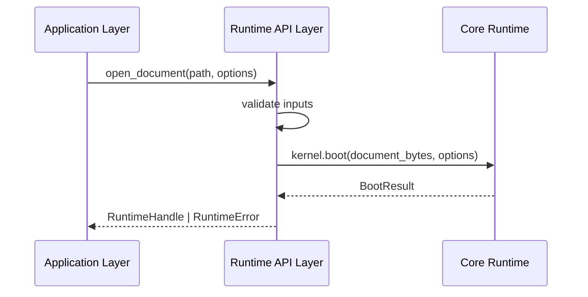
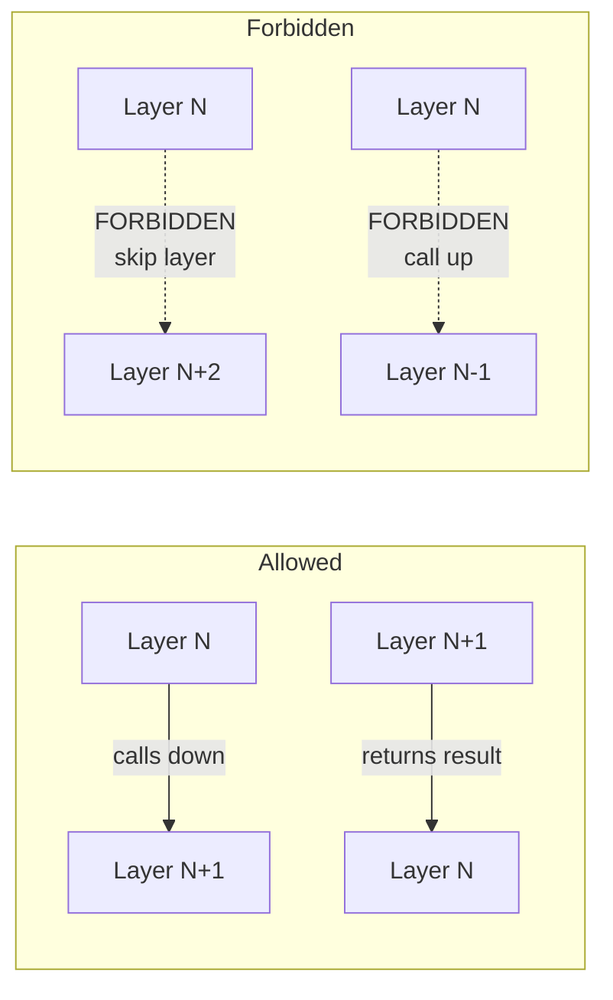
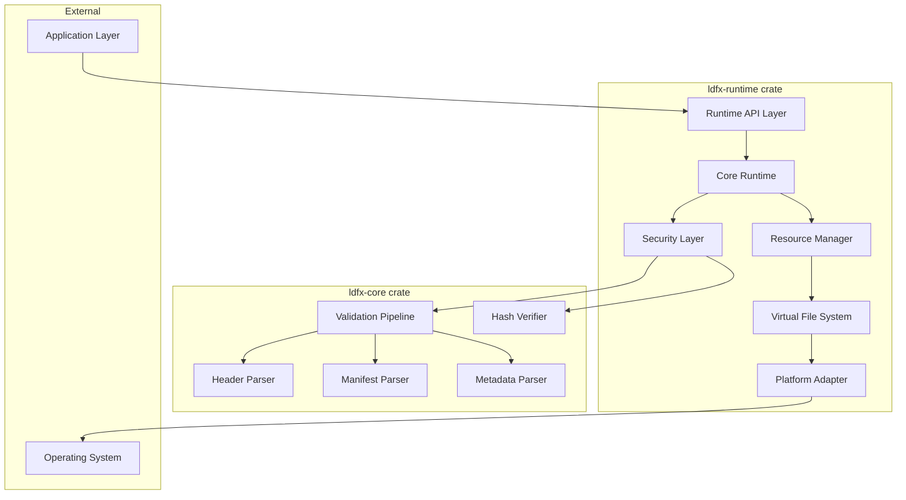
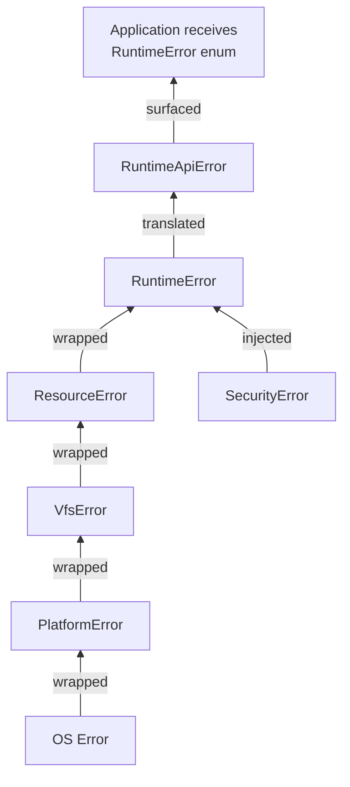
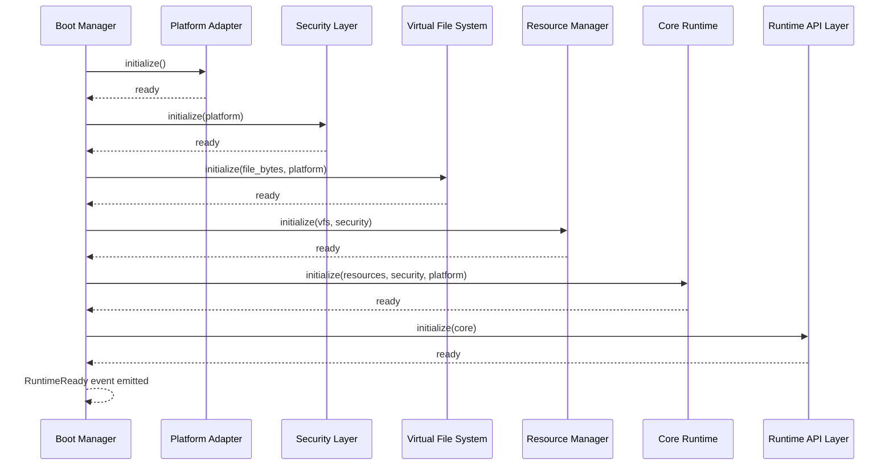
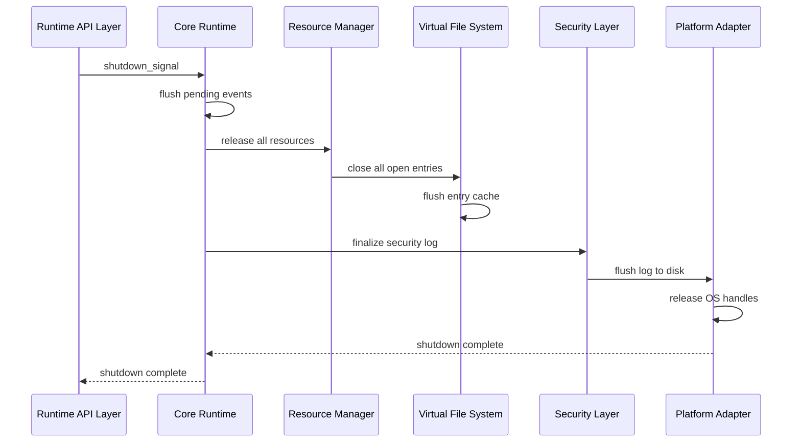

# Phase 2 — Module 02: Runtime Layered Architecture
# LDFX Runtime Foundation Specification

**Specification Version:** 2.0.0
**Status:** Canonical — Approved
**Phase:** 2 — Runtime Foundation
**Section:** 2 of 17
**Depends On:** Module 01 — Runtime Philosophy

---

## 2. Runtime Layered Architecture

---

### 2.1 Overview

The LDFX Runtime is organized as a strict layered architecture. Each layer
communicates only with the layer directly below it. No layer may bypass an
intermediate layer to call a lower layer directly. This constraint enforces
separation of concerns, enables independent testing, and isolates
platform-specific code at the bottom of the stack.

---

### 2.2 Layer Definitions

#### Layer 1 — Application Layer

**Position:** Top of stack — external consumers of the runtime.

**Description:**
The Application Layer contains all software that uses the LDFX Runtime but
is not part of it. This includes the Tauri-based Reader, the Tauri-based
Editor, the CLI tool, the web runtime, and any third-party application that
embeds the runtime.

**Responsibilities:**
- Invoke the Runtime API to open, render, and close documents
- Receive events from the Runtime API layer
- Present document content to the user
- Forward user input to the Runtime API layer
- Handle application-level UI state (window management, menus, etc.)

**Boundaries:**
- Must never call into Core Runtime, Resource Manager, or lower layers directly
- Must never read from the ZIP container directly
- Must never bypass the permission system

**Ownership:** External — not part of `ldfx-runtime` crate

---

#### Layer 2 — Runtime API Layer

**Position:** Public interface of the runtime.

**Description:**
The Runtime API Layer is the only surface the Application Layer touches.
It is a stable, versioned, documented API. All breaking changes to this
layer require a MAJOR version bump.

**Responsibilities:**
- Expose `RuntimeHandle` — the single entry point for all runtime operations
- Accept document open/close/pause/resume commands
- Emit typed events to registered application listeners
- Enforce API-level rate limiting and input validation
- Translate application requests into Core Runtime operations
- Return structured results — never raw internal types

**Boundaries:**
- Accepts only validated, typed inputs
- Returns only public-facing types — never internal structs
- All errors are translated to `RuntimeError` public enum before surfacing

**Ownership:** `ldfx-runtime/src/api/`

**Communication:**

---

#### Layer 3 — Core Runtime

**Position:** Central execution engine.

**Description:**
The Core Runtime is the brain of the LDFX Runtime. It owns the Runtime
Kernel, Boot Manager, Lifecycle Manager, Scheduler, Event Dispatcher,
State Manager, and Configuration Manager. It coordinates all other layers
but never performs I/O or security checks directly — it delegates those
to the layers below.

**Responsibilities:**
- Manage the full document lifecycle (boot → ready → running → shutdown)
- Coordinate the boot sequence across all subsystems
- Own and manage the Runtime Context object
- Schedule tasks and manage concurrency
- Dispatch events to registered listeners
- Manage configuration loading and precedence resolution
- Coordinate graceful shutdown and resource cleanup

**Boundaries:**
- Does not perform file I/O directly — delegates to Resource Manager
- Does not perform security checks directly — delegates to Security Layer
- Does not call OS APIs directly — delegates to Platform Adapter

**Ownership:** `ldfx-runtime/src/core/`

---

#### Layer 4 — Resource Manager

**Position:** Asset and resource pipeline.

**Description:**
The Resource Manager handles all resource loading, caching, and lifecycle
management. It knows how to load pages, assets, plugins, scripts, and
configuration from the Virtual File System. It maintains an in-memory
cache and manages lazy loading strategies.

**Responsibilities:**
- Load document entries on demand from the Virtual File System
- Maintain a tiered cache (hot cache → warm cache → cold storage)
- Implement lazy loading — only load what is needed, when it is needed
- Track resource reference counts and release unused resources
- Enforce per-resource size limits
- Report loading progress to the Core Runtime

**Boundaries:**
- Requests entries by path from the Virtual File System only
- Does not parse document content — returns raw bytes to Core Runtime
- Does not perform security validation — that is the Security Layer's job

**Ownership:** `ldfx-runtime/src/resources/`

---

#### Layer 5 — Virtual File System

**Position:** Abstraction over the ZIP container.

**Description:**
The Virtual File System (VFS) presents the contents of the `.ldfx` ZIP
archive as a virtual directory tree. It hides the ZIP implementation
details from all layers above. It handles the 64-byte header offset,
entry enumeration, and raw byte extraction.

**Responsibilities:**
- Open the ZIP archive at byte offset 64 (per Phase 1 Module 03)
- Enumerate all entries in the archive
- Read named entries as raw bytes on demand
- Resolve virtual paths to ZIP entry names
- Detect and reject path traversal attempts
- Cache frequently accessed entries (manifest, index files)
- Support streaming reads for large entries

**Boundaries:**
- Returns raw bytes only — no parsing
- Does not perform integrity checks — that is the Security Layer's job
- Does not enforce permissions — that is the Security Layer's job

**Ownership:** `ldfx-runtime/src/vfs/`

---

#### Layer 6 — Security Layer

**Position:** Cross-cutting security enforcement.

**Description:**
The Security Layer is unique in that it is not purely sequential — it is
also a cross-cutting concern that intercepts calls between layers. Every
byte that leaves the VFS passes through the Security Layer before reaching
the Resource Manager. Every plugin call passes through the Security Layer
before reaching the Plugin Runtime.

**Responsibilities:**
- Run the Phase 1 14-stage validation pipeline at boot time
- Verify SHA-256 hashes of all loaded entries against `security/hashes.json`
- Validate digital signatures if the document is signed
- Enforce the permission model — deny any operation not in the granted set
- Maintain the WASM sandbox boundary for plugins and scripts
- Log all security events (grants, denials, violations)
- Detect and respond to integrity violations at runtime

**Boundaries:**
- Intercepts VFS reads before they reach the Resource Manager
- Intercepts plugin calls before they reach the host runtime
- Never modifies document content — read-only enforcement role
- Security logs are write-only from the document's perspective

**Ownership:** `ldfx-runtime/src/security/`

---

#### Layer 7 — Platform Adapter

**Position:** OS abstraction layer — bottom of the runtime stack.

**Description:**
The Platform Adapter isolates all platform-specific behavior. The runtime
core never calls the OS directly. Every OS interaction — file system access,
thread creation, time queries, network sockets, process management — goes
through the Platform Adapter interface.

**Responsibilities:**
- Provide a uniform file system interface across all platforms
- Provide thread and async task primitives
- Provide wall clock and monotonic clock access
- Provide network socket access (when permitted)
- Provide process and environment information
- Provide platform-specific path handling
- On WASM: bridge to JavaScript APIs for all of the above

**Boundaries:**
- Exposes a single trait-based interface — `PlatformAdapter`
- All implementations (Windows, Linux, macOS, WASM) are behind this trait
- No layer above Layer 7 may use platform-specific types directly

**Ownership:** `ldfx-runtime/src/platform/`

---

#### Layer 8 — Operating System

**Position:** Below the runtime stack — not owned by LDFX.

**Description:**
The actual operating system or host environment. On desktop platforms this
is the native OS kernel. On WASM this is the browser or edge runtime host.

**Ownership:** External — not part of `ldfx-runtime`

---

### 2.3 Layer Communication Rules

| Rule | Description |
|---|---|
| Downward only | A layer may only call the layer directly below it |
| No skip | A layer may never skip an intermediate layer |
| No upward calls | A layer may never call a layer above it directly |
| Events are upward | The event system is the only upward communication mechanism |
| Security intercepts | The Security Layer may intercept any downward call as a cross-cut |

---

### 2.4 Layer Ownership and Dependencies

**Key dependency rule:** `ldfx-runtime` depends on `ldfx-core` as a library.
`ldfx-core` has zero knowledge of `ldfx-runtime`. This is a strict one-way
dependency.

---

### 2.5 Layer Failure Propagation

When a layer encounters an unrecoverable error, it propagates the error
upward through the stack. Each layer translates the error into its own
error type before passing it up.

No raw internal error type is ever exposed to the Application Layer.
All errors are translated to the public `RuntimeError` enum at the API layer.

---

### 2.6 Layer Initialization Order

Layers are initialized bottom-up and shut down top-down.

---

### 2.7 Layer Shutdown Order

Shutdown is the reverse of initialization — top-down.

---

### 2.8 Summary

The LDFX Runtime uses an 8-layer architecture with strict downward-only
communication. The Security Layer is a cross-cutting concern that intercepts
calls at multiple points. The Platform Adapter isolates all OS-specific
behavior. The `ldfx-core` crate from Phase 1 is consumed by the Security
Layer for validation and integrity checking. No layer may bypass another.
Errors propagate upward through typed wrappers. Initialization is bottom-up;
shutdown is top-down.

---

**Next:** Module 03 — Runtime Components
