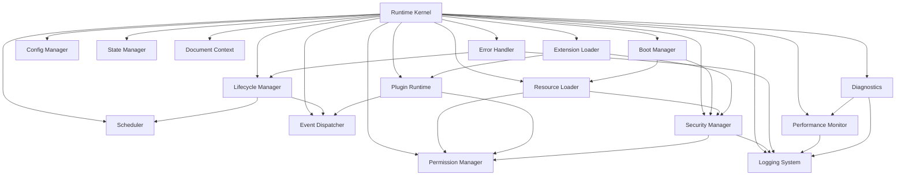

# Phase 2 — Module 03: Runtime Components
# LDFX Runtime Foundation Specification

**Specification Version:** 2.0.0
**Status:** Canonical — Approved
**Phase:** 2 — Runtime Foundation
**Section:** 3 of 17
**Depends On:** Module 01, Module 02

---

## 3. Runtime Components

---

### 3.1 Component Overview

```mermaid
graph TD
    subgraph Core
        K[Runtime Kernel]
        B[Boot Manager]
        L[Lifecycle Manager]
        S[Scheduler]
        ED[Event Dispatcher]
        CM[Config Manager]
        SM[State Manager]
    end
    subgraph Document
        DC[Document Context]
        RL[Resource Loader]
        EL[Extension Loader]
    end
    subgraph Security
        SEC[Security Manager]
        PM[Permission Manager]
    end
    subgraph Extension
        PR[Plugin Runtime]
        AIR[AI Runtime Interface]
    end
    subgraph Observability
        LOG[Logging System]
        EH[Error Handler]
        PERF[Performance Monitor]
        DIAG[Diagnostics]
        DEV[Developer Runtime]
    end

    K --> B
    K --> L
    K --> S
    K --> ED
    K --> CM
    K --> SM
    K --> DC
    K --> RL
    K --> EL
    K --> SEC
    K --> PM
    K --> PR
    K --> AIR
    K --> LOG
    K --> EH
    K --> PERF
    K --> DIAG
    K --> DEV
```



---

### 3.2 Runtime Kernel

**Purpose:**
The Runtime Kernel is the central coordinator of the entire runtime. It owns
all other components and is the single point of authority for runtime state.
It does not implement any feature itself — it delegates to specialized
components and ensures they operate in the correct order and within their
defined boundaries.

**Responsibilities:**
- Own and initialize all runtime components
- Coordinate the boot sequence via the Boot Manager
- Manage the Runtime Context object lifetime
- Route requests from the Runtime API Layer to the correct component
- Enforce component initialization order
- Coordinate graceful shutdown across all components
- Maintain the master runtime state

**Inputs:**
- Document bytes (raw `.ldfx` file content)
- Runtime options (from the Application Layer)
- Platform Adapter reference

**Outputs:**
- `RuntimeHandle` — returned to the Application Layer on successful boot
- `RuntimeError` — returned on boot failure
- Runtime events — emitted to the Event Dispatcher

**Internal Workflow:**
```
1. Receive open_document(bytes, options) from Runtime API
2. Instantiate Platform Adapter
3. Instantiate Security Layer
4. Instantiate Virtual File System with bytes
5. Run Phase 1 validation pipeline via Security Layer
6. If validation fails → emit RuntimeBootFailed, return error
7. Instantiate Resource Manager
8. Instantiate Boot Manager
9. Execute boot sequence (see Module 04)
10. On boot success → create RuntimeContext
11. Instantiate all remaining components with context
12. Emit RuntimeReady
13. Return RuntimeHandle to API Layer
```

**Dependencies:** All components — the Kernel owns them all.

**Failure Modes:**
- Validation failure → clean rejection, no resources allocated
- Component initialization failure → partial shutdown of already-initialized components
- Out of memory → RuntimeError::OutOfMemory, clean shutdown

**Recovery:** The Kernel has no self-recovery. On fatal failure it performs
a clean shutdown and returns an error to the Application Layer.

**Future Extensibility:** The Kernel's component registry is designed to
accept new components without modification to the Kernel itself.

---

### 3.3 Document Context

**Purpose:**
The Document Context is the single authoritative object that holds all
runtime state for an open document. It is created by the Kernel after
successful boot and lives until the document is closed. Every component
that needs document state reads it from the Context.

**Responsibilities:**
- Hold parsed manifest, metadata, and configuration
- Track loaded assets, pages, and plugins
- Maintain the security context and permission grants
- Hold session state and temporary storage references
- Provide read access to all document information
- Enforce immutability of structural fields after boot

**Contents:**

| Field | Type | Mutable After Boot | Description |
|---|---|---|---|
| document_id | UUID | No | From manifest |
| title | String | No | From manifest |
| spec_version | SemVer | No | From manifest |
| runtime_version | SemVer | No | Current runtime version |
| manifest | Manifest | No | Full parsed manifest |
| metadata | Metadata | No | Full parsed metadata |
| feature_flags | u16 | No | From binary header |
| loaded_pages | HashMap | Yes | Pages loaded into memory |
| loaded_assets | HashMap | Yes | Assets loaded into memory |
| plugin_registry | PluginRegistry | Yes | Registered plugins |
| permission_grants | PermissionSet | No | Granted at boot, immutable |
| security_context | SecurityContext | No | Established at boot |
| session_id | UUID | No | Generated at boot |
| config | ResolvedConfig | Yes | Resolved configuration |
| temp_storage | TempStore | Yes | Session-scoped temp data |
| developer_flags | DevFlags | No | Set at boot from options |
| language | LanguageTag | Yes | Current display language |
| theme | ThemeId | Yes | Current theme |

**Ownership:** Owned by the Runtime Kernel. Shared via `Arc<RwLock<DocumentContext>>`.

**Lifetime:** Created at end of boot sequence. Dropped on document close.

**Synchronization:** Read-heavy. Structural fields (manifest, metadata,
permissions) are read-only after boot. Mutable fields use fine-grained
locks per field group to minimize contention.

---

### 3.4 Boot Manager

**Purpose:**
The Boot Manager owns and executes the complete boot sequence. It is
responsible for taking a raw `.ldfx` byte stream from cold state to
a fully initialized Runtime Context. See Module 04 for the full boot
sequence specification.

**Responsibilities:**
- Execute all boot phases in the correct order
- Enforce boot timeouts per phase
- Handle boot errors with appropriate fallback strategies
- Support cold boot, warm boot, recovery boot, and safe mode
- Emit boot progress events
- Measure and report boot performance metrics

**Inputs:**
- Raw document bytes
- Boot options (mode, timeout overrides, safe mode flag)
- Platform Adapter reference

**Outputs:**
- `BootResult::Success(DocumentContext)` on success
- `BootResult::Failure(BootError)` on failure
- Boot progress events (emitted during execution)

**Failure Modes:**
- Phase timeout → BootError::PhaseTimeout(phase_id)
- Validation failure → BootError::ValidationFailed(report)
- Missing required entry → BootError::MissingEntry(path)
- Version mismatch → BootError::VersionMismatch(expected, found)

**Recovery:** On failure, the Boot Manager ensures all partially
allocated resources are released before returning the error.

---

### 3.5 Lifecycle Manager

**Purpose:**
The Lifecycle Manager owns the document's state machine after boot.
It manages all transitions between runtime states (Ready, Running,
Paused, Background, Closing, etc.) and enforces valid transition rules.
See Module 05 for the full lifecycle specification.

**Responsibilities:**
- Maintain the current lifecycle state
- Validate and execute state transitions
- Emit lifecycle events on every transition
- Enforce transition timeouts
- Coordinate with the Scheduler on pause/resume
- Coordinate with the Resource Manager on background/foreground transitions
- Handle forced shutdown (e.g., OS kill signal)

**Inputs:**
- Transition requests from the Runtime API Layer
- OS lifecycle signals via Platform Adapter (suspend, resume, low memory)
- Internal timeout signals from the Scheduler

**Outputs:**
- Updated lifecycle state
- Lifecycle events (emitted to Event Dispatcher)
- Transition results (success or rejection with reason)

**Failure Modes:**
- Invalid transition → rejected with `LifecycleError::InvalidTransition`
- Transition timeout → forced transition to `Closing` state
- Component failure during transition → `LifecycleError::ComponentFailure`

---

### 3.6 Resource Loader

**Purpose:**
The Resource Loader is responsible for loading all document resources
(pages, assets, plugins, scripts, configuration) from the Virtual File
System on demand. It implements lazy loading, caching, and streaming
strategies.

**Responsibilities:**
- Load document entries by path from the VFS
- Parse raw bytes into typed structures (PageContent, AssetEntry, etc.)
- Maintain a tiered in-memory cache
- Implement lazy loading — defer loading until first access
- Stream large assets rather than buffering them entirely
- Track resource reference counts
- Release unreferenced resources under memory pressure
- Report loading progress and errors

**Cache Tiers:**

| Tier | Contents | Eviction Policy | Max Size |
|---|---|---|---|
| Hot | manifest, current page, active assets | Never evicted | 16MB |
| Warm | recently accessed pages and assets | LRU | 64MB |
| Cold | all other loaded entries | LRU + time | 256MB |

**Inputs:**
- Resource path (virtual path within the document)
- Resource type hint (page, asset, plugin, config)
- Priority (immediate, background, prefetch)

**Outputs:**
- Loaded resource (typed) or `ResourceError`
- Loading progress events

**Failure Modes:**
- Entry not found → `ResourceError::NotFound(path)`
- Hash mismatch → `ResourceError::IntegrityFailure(path)`
- Parse failure → `ResourceError::ParseFailure(path, reason)`
- Size limit exceeded → `ResourceError::TooLarge(path, size)`

---

### 3.7 Scheduler

**Purpose:**
The Scheduler manages all asynchronous and deferred work within the
runtime. It ensures that background tasks (prefetching, plugin execution,
AI inference, sync) do not starve foreground tasks (rendering, user input).

**Responsibilities:**
- Maintain a priority queue of pending tasks
- Assign tasks to worker threads from the thread pool
- Enforce per-task CPU time limits
- Cancel tasks when the document transitions to background or closing
- Report task completion and failure to the Event Dispatcher
- Implement backpressure when the queue is full

**Task Priority Levels:**

| Priority | Description | Examples |
|---|---|---|
| Critical | Must complete before Ready state | Boot tasks, validation |
| High | User-visible, latency-sensitive | Page render, asset load |
| Normal | Background, non-urgent | Prefetch, index build |
| Low | Idle-time work | Analytics, telemetry flush |
| Deferred | Only when system is idle | Cache cleanup, log rotation |

**Thread Pool:**
- Minimum threads: 2
- Maximum threads: min(logical_cpus, 8)
- Thread stack size: 2MB per thread
- Idle thread timeout: 30 seconds

**Failure Modes:**
- Task panic → caught, logged, task marked failed, thread recycled
- Queue full → backpressure applied, caller receives `SchedulerError::QueueFull`
- Thread pool exhausted → tasks queued until a thread is available

---

### 3.8 Event Dispatcher

**Purpose:**
The Event Dispatcher is the runtime's internal message bus. It decouples
components from each other by allowing them to emit and subscribe to typed
events without direct references to each other.

**Responsibilities:**
- Maintain a registry of event listeners per event type
- Dispatch events synchronously (for critical events) or asynchronously
- Enforce event priority ordering
- Support event cancellation for cancellable events
- Log all events in developer mode
- Enforce security — documents cannot subscribe to security events

**Event Delivery Modes:**

| Mode | Description | Use Case |
|---|---|---|
| Synchronous | Delivered inline, blocks emitter | Critical lifecycle events |
| Asynchronous | Queued, delivered on next tick | Resource loading, plugin events |
| Broadcast | Delivered to all listeners | Runtime state changes |
| Targeted | Delivered to specific listener | Response to a request |

**Failure Modes:**
- Listener panic → caught, listener removed, error logged
- Event queue overflow → oldest low-priority events dropped, warning logged

---

### 3.9 Configuration Manager

**Purpose:**
The Configuration Manager resolves the final runtime configuration by
merging configuration sources in priority order. See Module 07 for the
full configuration hierarchy specification.

**Responsibilities:**
- Load configuration from all sources (system, viewer, document, user, session)
- Resolve conflicts using the defined precedence rules
- Validate all configuration values against their schemas
- Provide typed access to configuration values
- Support runtime configuration updates (for mutable config keys)
- Emit configuration change events

**Inputs:**
- System default configuration (compiled into runtime)
- Viewer configuration file (from Platform Adapter)
- Document configuration (from manifest and metadata)
- User preferences (from Platform Adapter storage)
- Session overrides (from Runtime API options)

**Outputs:**
- `ResolvedConfig` — the merged, validated configuration object
- Configuration change events

**Failure Modes:**
- Invalid configuration value → use default, emit warning
- Missing required configuration → use default, emit warning
- Configuration file corrupt → use defaults entirely, emit error

---

### 3.10 State Manager

**Purpose:**
The State Manager maintains all mutable document state that is not part
of the document's structural content. This includes UI state, scroll
positions, annotation drafts, form input state, and session-scoped data.

**Responsibilities:**
- Store and retrieve session state by key
- Persist state to temporary storage for warm boot recovery
- Clear state on document close
- Enforce state size limits
- Provide atomic read-modify-write operations

**State Scopes:**

| Scope | Lifetime | Persisted | Description |
|---|---|---|---|
| Session | Until document close | No | In-memory only |
| Warm | Until process exit | Yes (temp) | Survives warm boot |
| Persistent | Until user clears | Yes (storage) | User preferences |

**Failure Modes:**
- Storage write failure → state kept in memory, warning logged
- State size limit exceeded → oldest entries evicted, warning logged

---

### 3.11 Extension Loader

**Purpose:**
The Extension Loader discovers, validates, and loads all plugins and
extensions declared in the document's manifest. It works with the
Plugin Runtime to initialize each plugin in its WASM sandbox.

**Responsibilities:**
- Read the plugin index from `plugins/index.json`
- Verify plugin checksums against declared values
- Load plugin WASM binaries from the VFS
- Pass validated WASM binaries to the Plugin Runtime for instantiation
- Handle optional vs required plugin failures
- Report plugin load status to the Runtime Kernel

**Failure Modes:**
- Required plugin missing → `ExtensionError::RequiredPluginMissing(id)`
- Checksum mismatch → `ExtensionError::ChecksumMismatch(id)`
- WASM validation failure → `ExtensionError::InvalidWasm(id, reason)`
- Optional plugin failure → logged as warning, document continues

---

### 3.12 Logging System

**Purpose:**
The Logging System provides structured, leveled logging for all runtime
components. It is the single output channel for all runtime diagnostic
information.

**Responsibilities:**
- Accept log entries from all components
- Route entries to configured sinks (console, file, memory ring buffer)
- Enforce log level filtering per component
- Redact sensitive information (paths, UUIDs in production mode)
- Provide a ring buffer for crash report inclusion
- Never block the calling component (async write)

**Log Levels:**

| Level | Description | Default (Production) | Default (Dev) |
|---|---|---|---|
| Error | Unrecoverable failures | Enabled | Enabled |
| Warn | Recoverable issues | Enabled | Enabled |
| Info | Significant events | Enabled | Enabled |
| Debug | Detailed component state | Disabled | Enabled |
| Trace | Per-operation detail | Disabled | Enabled |

**Failure Modes:**
- Log sink failure → silently drop log entry (logging must never crash runtime)

---

### 3.13 Error Handler

**Purpose:**
The Error Handler is the centralized error processing component. It
receives errors from all components, classifies them, decides on recovery
strategy, and routes them to the appropriate response path.

**Responsibilities:**
- Classify errors by severity (fatal, recoverable, warning)
- Execute recovery strategies for recoverable errors
- Escalate fatal errors to the Lifecycle Manager for shutdown
- Emit error events to the Event Dispatcher
- Log all errors via the Logging System
- Aggregate error statistics for the Performance Monitor

**Error Classification:**

| Class | Description | Response |
|---|---|---|
| Fatal | Runtime cannot continue | Initiate clean shutdown |
| Recoverable | Operation failed, runtime continues | Retry or fallback |
| Warning | Unexpected but non-blocking | Log and continue |
| Security | Permission or integrity violation | Log, deny, alert |

---

### 3.14 Security Manager

**Purpose:**
The Security Manager is the runtime enforcement point for all security
policies. It works with the Phase 1 Security Layer to verify integrity
and with the Permission Manager to enforce access control.

**Responsibilities:**
- Execute the Phase 1 14-stage validation pipeline at boot
- Verify SHA-256 hashes of all loaded entries at load time
- Validate digital signatures if the document is signed
- Maintain the security event log
- Detect and respond to runtime integrity violations
- Enforce memory isolation between the runtime and plugins
- Report security status to the Runtime Context

**Failure Modes:**
- Hash mismatch at load time → `SecurityError::IntegrityViolation(path)`
- Signature invalid → `SecurityError::InvalidSignature`
- Permission violation → `SecurityError::PermissionDenied(operation, permission)`

All security failures are fatal by default. The Security Manager never
silently ignores a security violation.

---

### 3.15 Permission Manager

**Purpose:**
The Permission Manager enforces the permission model declared in the
document manifest. It is the single authority for all permission checks.

**Responsibilities:**
- Load declared permissions from the manifest at boot
- Evaluate permission requests from plugins and scripts
- Enforce the principle of least privilege
- Log all permission grants and denials
- Support user-interactive permission prompts (via Runtime API)
- Maintain the granted permission set in the Runtime Context

**Permission Evaluation Flow:**
```
Request arrives
    → Is permission declared in manifest? No → Deny immediately
    → Is permission in granted set? Yes → Allow
    → Is permission user-grantable? No → Deny
    → Prompt user via Runtime API
    → User grants → Add to session grants → Allow
    → User denies → Deny, log
```

---

### 3.16 Performance Monitor

**Purpose:**
The Performance Monitor collects, aggregates, and reports runtime
performance metrics. It provides data for the Diagnostics component
and for developer tooling.

**Responsibilities:**
- Measure boot time per phase
- Track memory usage (RSS, heap, per-component)
- Track CPU usage per task
- Measure asset load times
- Track event dispatch latency
- Detect performance regressions against defined targets
- Emit performance warnings when targets are exceeded

---

### 3.17 Diagnostics

**Purpose:**
The Diagnostics component provides a comprehensive view of runtime
health for developer tools, crash reporters, and support workflows.

**Responsibilities:**
- Aggregate data from all components into a health report
- Generate crash reports on fatal errors
- Provide a runtime inspector interface in developer mode
- Export diagnostic snapshots on demand
- Monitor component health via periodic heartbeats

---

### 3.18 Developer Runtime

**Purpose:**
The Developer Runtime is an optional overlay that activates when the
runtime is launched in developer mode. It provides enhanced logging,
inspection, hot reload, and debugging capabilities.

**Responsibilities:**
- Enable verbose logging across all components
- Expose a developer API for runtime inspection
- Support hot reload of document content without full reboot
- Provide a performance profiler
- Expose the Runtime Context for inspection
- Enable breakpoints in plugin execution

**Activation:** Developer mode is activated by passing `DevFlags::enabled`
in the boot options. It is never active in production builds unless
explicitly enabled.

---

### 3.19 Plugin Runtime

**Purpose:**
The Plugin Runtime manages the execution of all WASM-based plugins
within their sandboxed environments.

**Responsibilities:**
- Instantiate WASM modules from validated binaries
- Provide the WASM host interface (WASI subset + LDFX plugin API)
- Enforce per-plugin memory limits (default: 64MB per plugin)
- Enforce per-plugin CPU time limits
- Isolate plugin memory from runtime memory
- Handle plugin panics without crashing the runtime
- Provide inter-plugin communication via the Event Dispatcher only

**Failure Modes:**
- Plugin panic → caught at WASM boundary, plugin marked failed
- Memory limit exceeded → plugin terminated, `PluginError::MemoryLimit(id)`
- CPU limit exceeded → plugin terminated, `PluginError::CpuLimit(id)`
- Required plugin failure → escalated to Error Handler as fatal

---

### 3.20 Future AI Runtime Interface

**Purpose:**
The AI Runtime Interface is a reserved component slot for Phase 2's
AI Engine. It defines the interface contract that the AI Engine must
implement, without specifying the implementation.

**Interface Contract:**
- Accept AI block node types from the page content model
- Execute inference against embedded or referenced GGUF models
- Return structured results to the page renderer
- Respect the `execute_ai` permission
- Enforce inference time limits
- Support streaming inference results

**Status:** Interface defined. Implementation deferred to AI Engine phase.

---

### 3.21 Component Dependency Summary



---

**Next:** Module 04 — Boot Sequence
