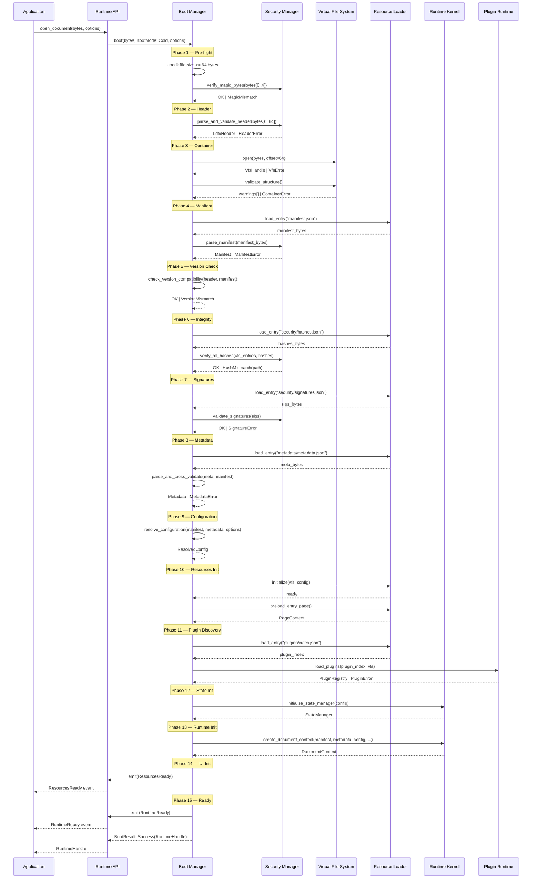
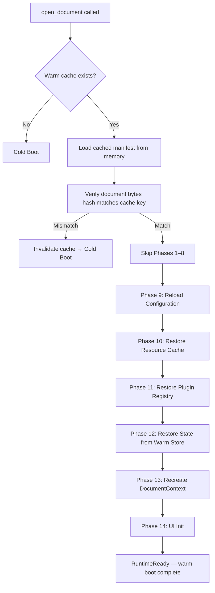
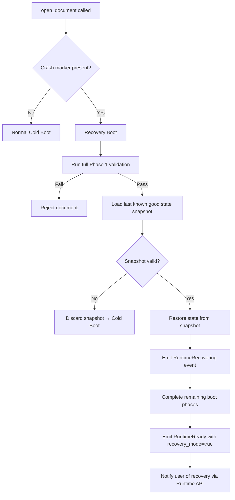
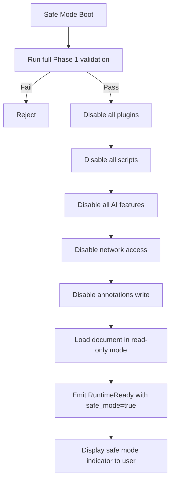
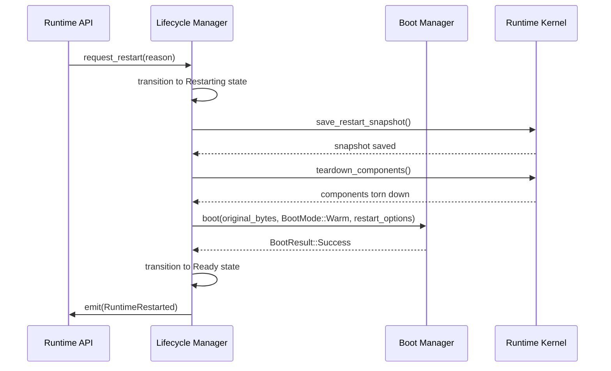
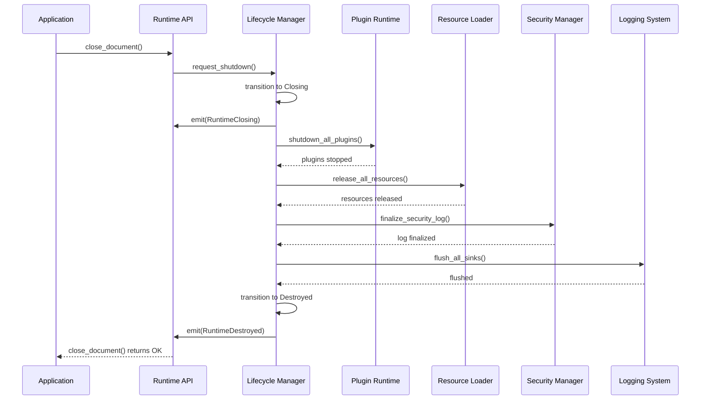
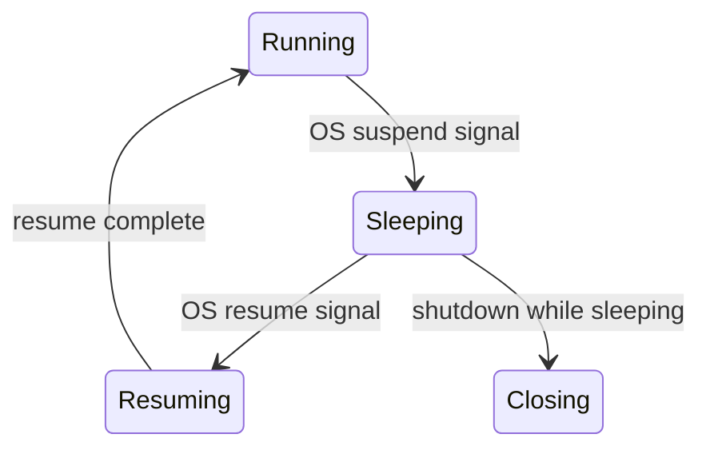

# Phase 2 — Module 04: Runtime Boot Sequence
# LDFX Runtime Foundation Specification

**Specification Version:** 2.0.0
**Status:** Canonical — Approved
**Phase:** 2 — Runtime Foundation
**Section:** 4 of 17
**Depends On:** Module 01, Module 02, Module 03

---

## 4. Runtime Boot Sequence

---

### 4.1 Overview

The boot sequence is the ordered set of operations that transforms a raw
`.ldfx` byte stream into a fully initialized, ready-to-use runtime. It is
owned by the Boot Manager and executed under the supervision of the Runtime
Kernel.

Every step in the boot sequence is:
- Ordered — steps execute in the defined sequence, never in parallel unless stated
- Timed — every step has a maximum allowed duration
- Recoverable — every failure has a defined response
- Observable — every step emits a progress event

---

### 4.2 Cold Boot Sequence

A cold boot is the standard boot path — opening a document for the first time
with no cached state.



---

### 4.3 Boot Phase Definitions

| Phase | Name | Timeout | Fatal On Failure | Description |
|---|---|---|---|---|
| 1 | Pre-flight | 10ms | Yes | File size check, byte availability |
| 2 | Header | 20ms | Yes | Magic bytes, CRC32, version |
| 3 | Container | 50ms | Yes | ZIP structure, required folders |
| 4 | Manifest | 50ms | Yes | Parse and validate manifest.json |
| 5 | Version Check | 5ms | Yes | Runtime vs document version |
| 6 | Integrity | 200ms | Yes | SHA-256 hash verification |
| 7 | Signatures | 100ms | No (warn if unsigned) | Digital signature validation |
| 8 | Metadata | 50ms | Yes | Parse metadata, cross-validate |
| 9 | Configuration | 20ms | No (use defaults) | Resolve config hierarchy |
| 10 | Resources Init | 300ms | Yes | Preload entry page and hot assets |
| 11 | Plugin Discovery | 200ms | Conditional | Required plugins fatal, optional warn |
| 12 | State Init | 20ms | Yes | Initialize state manager |
| 13 | Runtime Init | 50ms | Yes | Create DocumentContext |
| 14 | UI Init | 100ms | No | Signal renderer to prepare |
| 15 | Ready | — | — | Emit RuntimeReady |

**Total cold boot budget:** 500ms for standard documents (≤100 pages, ≤50 assets)

---

### 4.4 Warm Boot Sequence

A warm boot occurs when a document is reopened after being previously opened
in the same session. Cached state from the previous session is reused.



**Warm boot target:** < 100ms for standard documents.

**Cache invalidation rules:**
- Document bytes hash changed → full cold boot
- Runtime version changed → full cold boot
- Security policy changed → full cold boot
- Warm cache age > 30 minutes → full cold boot

---

### 4.5 Recovery Boot Sequence

A recovery boot is triggered when a previous session ended abnormally
(crash, forced kill, power loss). The runtime attempts to restore the
document to a usable state using the last known good state.



**Recovery state includes:**
- Last scroll position per page
- Form input state
- Annotation drafts
- Active plugin state snapshots

---

### 4.6 Safe Mode Boot

Safe mode is a restricted boot that disables all optional features.
It is triggered when:
- The user explicitly requests safe mode
- A previous boot failed due to a plugin or script error
- The Security Manager detects a suspicious document



**Safe mode restrictions:**

| Feature | Safe Mode |
|---|---|
| Page rendering | ✅ Enabled |
| Asset display | ✅ Enabled |
| Plugins | ❌ Disabled |
| Scripts | ❌ Disabled |
| AI features | ❌ Disabled |
| Network access | ❌ Disabled |
| Annotations (write) | ❌ Disabled |
| Cloud sync | ❌ Disabled |
| Forms (submit) | ❌ Disabled |

---

### 4.7 Restart Sequence

A restart re-executes the boot sequence for the currently open document
without closing the application. Used after configuration changes or
plugin updates.



---

### 4.8 Shutdown Sequence



**Shutdown budget:** < 200ms for clean shutdown.

**Forced shutdown:** If clean shutdown exceeds 500ms, the runtime
performs a forced shutdown — releasing all OS handles and exiting
without waiting for component acknowledgment.

---

### 4.9 Sleep and Resume

Sleep is triggered by OS power management or application backgrounding.



**On Sleep:**
1. Pause the Scheduler (no new tasks)
2. Flush the Logging System
3. Snapshot mutable state to warm store
4. Release non-essential memory (warm and cold cache)
5. Emit `RuntimeSleeping`

**On Resume:**
1. Emit `RuntimeResuming`
2. Restore warm cache
3. Resume the Scheduler
4. Re-verify document integrity (hash check on manifest)
5. Emit `RuntimeReady`

---

### 4.10 Boot Error Handling

Every boot phase failure has a defined response:

| Error | Phase | Response | User Visible |
|---|---|---|---|
| File too small | 1 | Reject, return error | "Not a valid LDFX file" |
| Magic mismatch | 2 | Reject, return error | "Not a valid LDFX file" |
| CRC32 mismatch | 2 | Reject, return error | "File is corrupted" |
| Version mismatch (major) | 5 | Reject, return error | "Incompatible document version" |
| Hash mismatch | 6 | Reject, return error | "File integrity check failed" |
| Invalid signature | 7 | Warn or reject (per policy) | "Signature invalid" |
| Metadata mismatch | 8 | Reject, return error | "Document metadata is inconsistent" |
| Config invalid | 9 | Use defaults, warn | None (silent fallback) |
| Entry page missing | 10 | Reject, return error | "Document entry page not found" |
| Required plugin missing | 11 | Reject, return error | "Required plugin not available" |
| Optional plugin missing | 11 | Warn, continue | "Plugin X not available" |
| State init failure | 12 | Reject, return error | "Runtime initialization failed" |

---

### 4.11 Boot Timeout Handling

If any boot phase exceeds its timeout:

```
1. Log timeout event with phase ID and elapsed time
2. If phase is fatal → abort boot, return BootError::PhaseTimeout(phase)
3. If phase is non-fatal → skip phase, log warning, continue
4. If total boot time exceeds 15 seconds → abort regardless of phase
```

---

### 4.12 Boot Progress Events

The Boot Manager emits the following events during the boot sequence.
Applications may use these to display a loading indicator.

| Event | Phase | Payload |
|---|---|---|
| `BootStarted` | 1 | `{ mode, document_size }` |
| `HeaderVerified` | 2 | `{ spec_version, feature_flags }` |
| `ContainerOpened` | 3 | `{ entry_count }` |
| `ManifestLoaded` | 4 | `{ document_id, title, page_count }` |
| `VersionVerified` | 5 | `{ spec_version }` |
| `IntegrityVerified` | 6 | `{ hash_count }` |
| `SignatureVerified` | 7 | `{ signed, signer_id }` |
| `MetadataLoaded` | 8 | `{ author_count, revision }` |
| `ConfigurationResolved` | 9 | `{ source_count }` |
| `ResourcesLoading` | 10 | `{ asset_count, page_count }` |
| `ResourcesReady` | 10 | `{ loaded_count }` |
| `PluginsReady` | 11 | `{ plugin_count }` |
| `RuntimeReady` | 15 | `{ boot_mode, elapsed_ms }` |

---

**Next:** Module 05 — Runtime Lifecycle
