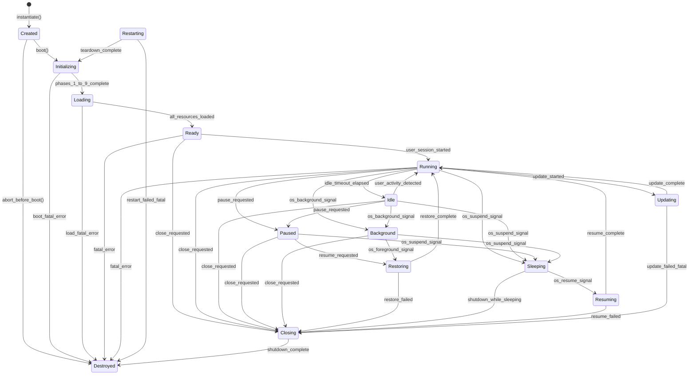
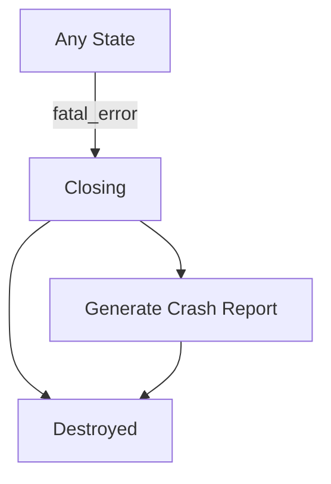
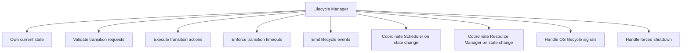

# Phase 2 — Module 05: Runtime Lifecycle
# LDFX Runtime Foundation Specification

**Specification Version:** 2.0.0
**Status:** Canonical — Approved
**Phase:** 2 — Runtime Foundation
**Section:** 5 of 17
**Depends On:** Module 01, Module 02, Module 03, Module 04

---

## 5. Runtime Lifecycle

---

### 5.1 Overview

The Runtime Lifecycle defines every state a document runtime can be in,
every valid transition between states, and every invalid transition that
must be rejected. The Lifecycle Manager owns this state machine and is
the single authority for all state transitions.

No component may change the runtime state directly. All state changes
go through the Lifecycle Manager.

---

### 5.2 Lifecycle States

| State | Description |
|---|---|
| `Created` | Runtime object instantiated, boot not yet started |
| `Initializing` | Boot sequence in progress (Phases 1–9) |
| `Loading` | Resources and plugins loading (Phases 10–13) |
| `Ready` | Boot complete, document available, no active user session |
| `Running` | Active user session, document fully interactive |
| `Idle` | Running but no user interaction for > idle_timeout |
| `Paused` | Explicitly paused by application (e.g., window minimized) |
| `Background` | Application moved to background (mobile/OS signal) |
| `Restoring` | Returning from Background or Paused state |
| `Sleeping` | OS suspend signal received |
| `Resuming` | Returning from Sleep state |
| `Restarting` | Restart requested, tearing down before re-boot |
| `Updating` | Document content being updated (live edit, sync) |
| `Closing` | Shutdown sequence in progress |
| `Destroyed` | All resources released, runtime object invalid |

---

### 5.3 Lifecycle State Machine

---

### 5.4 Allowed Transitions Table

| From | To | Trigger | Notes |
|---|---|---|---|
| Created | Initializing | `boot()` called | Normal boot start |
| Created | Destroyed | `abort()` called | Pre-boot abort |
| Initializing | Loading | Phases 1–9 complete | Normal progression |
| Initializing | Destroyed | Fatal boot error | No recovery |
| Loading | Ready | All resources loaded | Normal progression |
| Loading | Destroyed | Fatal load error | No recovery |
| Ready | Running | User session started | First interaction |
| Ready | Closing | Close requested | Normal close |
| Running | Idle | Idle timeout elapsed | Configurable timeout |
| Running | Paused | App pause request | Window minimize etc. |
| Running | Background | OS background signal | Mobile/OS |
| Running | Sleeping | OS suspend signal | Power management |
| Running | Updating | Update started | Live edit or sync |
| Running | Closing | Close requested | Normal close |
| Idle | Running | User activity | Any input event |
| Idle | Paused | App pause request | |
| Idle | Background | OS background signal | |
| Idle | Sleeping | OS suspend signal | |
| Idle | Closing | Close requested | |
| Paused | Restoring | Resume requested | |
| Paused | Sleeping | OS suspend signal | |
| Paused | Closing | Close requested | |
| Background | Restoring | OS foreground signal | |
| Background | Sleeping | OS suspend signal | |
| Background | Closing | Close requested | |
| Restoring | Running | Restore complete | |
| Restoring | Closing | Restore failed | Unrecoverable |
| Sleeping | Resuming | OS resume signal | |
| Sleeping | Closing | Shutdown while sleeping | |
| Resuming | Running | Resume complete | |
| Resuming | Closing | Resume failed | Unrecoverable |
| Updating | Running | Update complete | |
| Updating | Closing | Fatal update error | |
| Restarting | Initializing | Teardown complete | Re-enters boot |
| Restarting | Destroyed | Restart failed | |
| Closing | Destroyed | Shutdown complete | Terminal state |

---

### 5.5 Invalid Transitions

The following transitions are explicitly forbidden. The Lifecycle Manager
must reject them with `LifecycleError::InvalidTransition`.

| From | To (Forbidden) | Reason |
|---|---|---|
| Destroyed | Any | Terminal state — cannot be reused |
| Closing | Any except Destroyed | Shutdown is irreversible |
| Initializing | Running | Must pass through Loading and Ready |
| Loading | Running | Must pass through Ready |
| Created | Running | Must boot first |
| Sleeping | Running | Must pass through Resuming |
| Background | Running | Must pass through Restoring |
| Paused | Running | Must pass through Restoring |

---

### 5.6 Transition Timeouts

Every transition has a maximum allowed duration. If the transition
does not complete within the timeout, the Lifecycle Manager forces
a transition to `Closing`.

| Transition | Timeout | On Timeout |
|---|---|---|
| Created → Initializing | 10ms | Force Destroyed |
| Initializing → Loading | 500ms | Force Destroyed |
| Loading → Ready | 1000ms | Force Destroyed |
| Running → Paused | 100ms | Force Paused |
| Running → Background | 200ms | Force Background |
| Running → Sleeping | 500ms | Force Sleeping |
| Restoring → Running | 500ms | Force Closing |
| Resuming → Running | 1000ms | Force Closing |
| Updating → Running | 5000ms | Force Closing |
| Closing → Destroyed | 500ms | Force Destroyed |

---

### 5.7 Lifecycle Events

Every state transition emits a corresponding event via the Event Dispatcher.

| Event | Emitted On | Payload |
|---|---|---|
| `RuntimeCreated` | Created | `{ session_id }` |
| `RuntimeInitializing` | Initializing | `{ boot_mode }` |
| `RuntimeLoading` | Loading | `{ resource_count }` |
| `RuntimeReady` | Ready | `{ elapsed_ms, boot_mode }` |
| `RuntimeRunning` | Running | `{ session_id }` |
| `RuntimeIdle` | Idle | `{ idle_duration_ms }` |
| `RuntimePaused` | Paused | `{ reason }` |
| `RuntimeBackground` | Background | `{ reason }` |
| `RuntimeRestoring` | Restoring | `{ from_state }` |
| `RuntimeSleeping` | Sleeping | `{}` |
| `RuntimeResuming` | Resuming | `{}` |
| `RuntimeUpdating` | Updating | `{ update_type }` |
| `RuntimeRestarting` | Restarting | `{ reason }` |
| `RuntimeClosing` | Closing | `{ reason }` |
| `RuntimeDestroyed` | Destroyed | `{ session_id, uptime_ms }` |

---

### 5.8 Idle State Behavior

The runtime transitions to `Idle` after a configurable period of no
user interaction. In Idle state:

- The Scheduler reduces thread pool to minimum (2 threads)
- Background tasks continue at Low priority only
- Memory pressure triggers cache eviction (warm → cold)
- Plugin CPU limits are reduced to 10% of normal
- The Performance Monitor continues collecting metrics

**Idle timeout:** Configurable via `config.runtime.idle_timeout_ms`.
Default: 60,000ms (60 seconds).

**Idle exit:** Any user input event (mouse, keyboard, touch, scroll)
immediately transitions back to `Running`.

---

### 5.9 Background State Behavior

Background state is triggered by OS signals (app moved to background
on mobile, or window hidden on desktop). In Background state:

- All rendering is suspended
- The Scheduler pauses High and Normal priority tasks
- Only Low and Deferred priority tasks continue
- Network sync operations continue if permitted
- Memory is aggressively reclaimed (cold cache cleared)
- Plugin execution is suspended

**Background memory budget:** 16MB RSS target (down from normal 32MB+).

---

### 5.10 Failure Handling

#### Fatal Failures

A fatal failure in any state (except Closing and Destroyed) triggers
an immediate transition to `Closing`, bypassing all intermediate states.

#### Recoverable Failures

A recoverable failure does not change the lifecycle state. The Error
Handler attempts recovery and emits a warning event. If recovery fails
after the configured number of retries, the failure is escalated to fatal.

| Failure | Recovery Strategy | Max Retries |
|---|---|---|
| Asset load failure | Retry with exponential backoff | 3 |
| Plugin crash | Restart plugin in new sandbox | 2 |
| State write failure | Retry with different storage path | 1 |
| Network timeout | Retry with backoff | 3 |
| Config load failure | Use defaults | 1 |

---

### 5.11 Lifecycle Manager Responsibilities Summary

---

**Next:** Module 06 — Runtime Context
