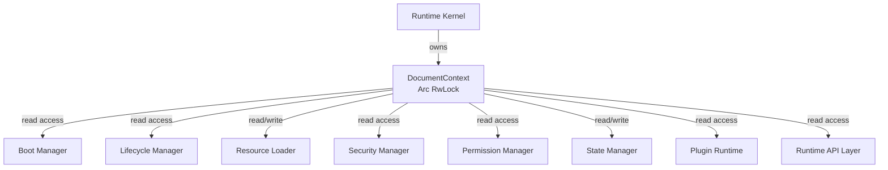
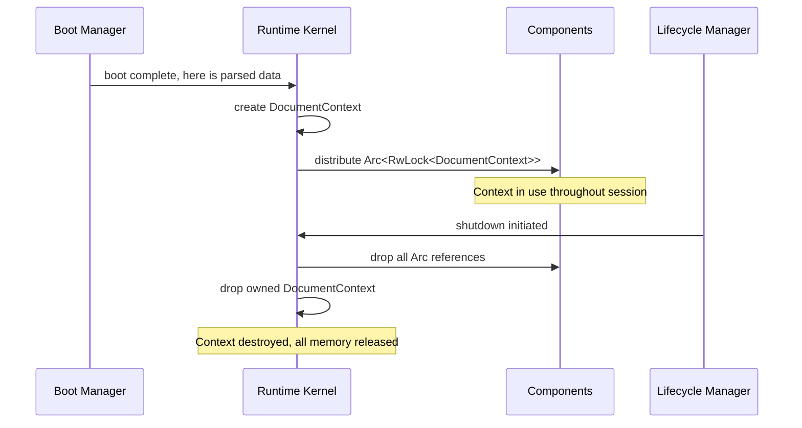
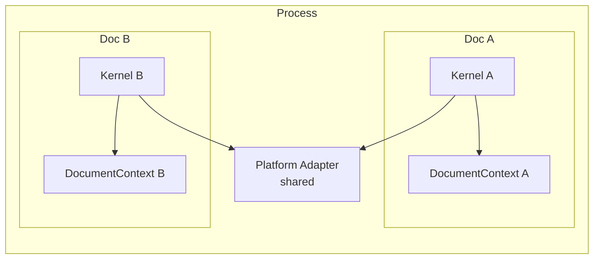

# Phase 2 — Module 06: Runtime Context
# LDFX Runtime Foundation Specification

**Specification Version:** 2.0.0
**Status:** Canonical — Approved
**Phase:** 2 — Runtime Foundation
**Section:** 6 of 17
**Depends On:** Module 01–05

---

## 6. Runtime Context

---

### 6.1 Overview

The Runtime Context is the single authoritative object that holds all
state for an open document session. It is created at the end of the
boot sequence and lives until the document is closed. Every runtime
component that needs document state reads it from the Context.

The Context is not a global singleton. Each open document has its own
independent Context. Multiple documents may be open simultaneously,
each with a fully isolated Context.

---

### 6.2 Context Object Diagram

```mermaid
graph TD
    CTX[DocumentContext]

    CTX --> DOC[Document Info]
    CTX --> MAN[Manifest]
    CTX --> META[Metadata]
    CTX --> RTV[Runtime Version]
    CTX --> FEAT[Feature Flags]
    CTX --> PAGES[Loaded Pages]
    CTX --> ASSETS[Loaded Assets]
    CTX --> PLUGINS[Plugin Registry]
    CTX --> THEME[Theme]
    CTX --> LANG[Language]
    CTX --> PERMS[Permission Grants]
    CTX --> SEC[Security Context]
    CTX --> SESS[Session]
    CTX --> TEMP[Temporary Storage]
    CTX --> CFG[Configuration]
    CTX --> DEV[Developer Flags]

    DOC --> D1[document_id: UUID]
    DOC --> D2[title: String]
    DOC --> D3[spec_version: SemVer]
    DOC --> D4[created_at: DateTime]
    DOC --> D5[modified_at: DateTime]
    DOC --> D6[document_type: String]
    DOC --> D7[language: BCP47]
    DOC --> D8[page_count: u32]
    DOC --> D9[entry_page: String]
```

---

### 6.3 Full Context Field Specification

#### 6.3.1 Document Info

| Field | Type | Mutable | Source | Description |
|---|---|---|---|---|
| `document_id` | UUID | No | manifest | Unique document identifier |
| `title` | String | No | manifest | Document title |
| `subtitle` | Option\<String\> | No | manifest | Document subtitle |
| `spec_version` | SemVer | No | manifest | LDFX spec version |
| `document_type` | String | No | manifest | document, template, etc. |
| `language` | BCP47 | No | manifest | Primary language |
| `direction` | String | No | manifest | ltr or rtl |
| `page_count` | u32 | No | manifest | Total page count |
| `entry_page` | String | No | manifest | Entry page path |
| `created_at` | DateTime | No | manifest | Creation timestamp |
| `modified_at` | DateTime | No | manifest | Last modification timestamp |

#### 6.3.2 Runtime Version

| Field | Type | Mutable | Source | Description |
|---|---|---|---|---|
| `runtime_version` | SemVer | No | compiled | Current runtime version |
| `runtime_build` | String | No | compiled | Build identifier |
| `platform` | String | No | platform | windows/linux/macos/wasm |
| `boot_mode` | BootMode | No | boot | cold/warm/recovery/safe |
| `booted_at` | DateTime | No | boot | Boot completion timestamp |

#### 6.3.3 Feature Flags

| Field | Type | Mutable | Source | Description |
|---|---|---|---|---|
| `feature_flags` | u16 | No | header | Raw feature flags bitmask |
| `has_scripts` | bool | No | manifest | Scripts enabled |
| `has_ai` | bool | No | manifest | AI features enabled |
| `has_plugins` | bool | No | manifest | Plugins enabled |
| `has_encryption` | bool | No | manifest | Encryption enabled |
| `has_annotations` | bool | No | manifest | Annotations enabled |
| `has_collaboration` | bool | No | manifest | Collaboration enabled |
| `has_cloud_sync` | bool | No | manifest | Cloud sync enabled |
| `readonly` | bool | No | manifest | Document is read-only |

#### 6.3.4 Loaded Pages

| Field | Type | Mutable | Description |
|---|---|---|---|
| `page_index` | PageIndex | No | Full page index from pages/index.json |
| `loaded_pages` | HashMap\<String, PageContent\> | Yes | Pages currently in memory |
| `loaded_layouts` | HashMap\<String, PageLayout\> | Yes | Layouts currently in memory |
| `current_page_id` | Option\<String\> | Yes | Currently displayed page |

#### 6.3.5 Loaded Assets

| Field | Type | Mutable | Description |
|---|---|---|---|
| `asset_index` | AssetIndex | No | Full asset index |
| `loaded_assets` | HashMap\<String, AssetData\> | Yes | Assets currently in memory |
| `asset_cache_size` | usize | Yes | Current cache size in bytes |

#### 6.3.6 Plugin Registry

| Field | Type | Mutable | Description |
|---|---|---|---|
| `plugin_index` | PluginIndex | No | Full plugin index |
| `active_plugins` | HashMap\<String, PluginHandle\> | Yes | Running plugin instances |
| `failed_plugins` | Vec\<String\> | Yes | Plugin IDs that failed to load |

#### 6.3.7 Theme and Language

| Field | Type | Mutable | Description |
|---|---|---|---|
| `active_theme` | ThemeId | Yes | Current theme identifier |
| `active_language` | BCP47 | Yes | Current display language |
| `available_locales` | Vec\<BCP47\> | No | Locales declared in manifest |
| `text_direction` | Direction | Yes | Current text direction |

#### 6.3.8 Permission Grants

| Field | Type | Mutable | Description |
|---|---|---|---|
| `declared_permissions` | Vec\<Permission\> | No | Permissions declared in manifest |
| `granted_permissions` | PermissionSet | No | Permissions granted at boot |
| `session_grants` | PermissionSet | Yes | User-granted during session |
| `denied_permissions` | PermissionSet | Yes | Explicitly denied by user |

#### 6.3.9 Security Context

| Field | Type | Mutable | Description |
|---|---|---|---|
| `trust_level` | TrustLevel | No | untrusted/low/medium/high/system |
| `signed` | bool | No | Document has valid signature |
| `signer_id` | Option\<String\> | No | Signer identifier if signed |
| `hash_algorithm` | String | No | sha256 |
| `integrity_verified` | bool | No | All hashes verified at boot |
| `security_events` | Vec\<SecurityEvent\> | Yes | Security events this session |

#### 6.3.10 Session

| Field | Type | Mutable | Description |
|---|---|---|---|
| `session_id` | UUID | No | Generated at boot |
| `session_started_at` | DateTime | No | Boot completion time |
| `user_id` | Option\<String\> | No | Authenticated user if any |
| `interaction_count` | u64 | Yes | Total user interactions |
| `last_interaction_at` | Option\<DateTime\> | Yes | Last user interaction time |

#### 6.3.11 Temporary Storage

| Field | Type | Mutable | Description |
|---|---|---|---|
| `temp_store` | TempStore | Yes | Session-scoped key-value store |
| `warm_store` | WarmStore | Yes | Persisted across warm boots |
| `scroll_positions` | HashMap\<String, f64\> | Yes | Per-page scroll position |
| `form_state` | HashMap\<String, Value\> | Yes | Form input state |
| `annotation_drafts` | Vec\<AnnotationDraft\> | Yes | Unsaved annotation drafts |

#### 6.3.12 Configuration

| Field | Type | Mutable | Description |
|---|---|---|---|
| `config` | ResolvedConfig | Yes | Fully resolved configuration |
| `config_sources` | Vec\<ConfigSource\> | No | Sources used in resolution |

#### 6.3.13 Developer Flags

| Field | Type | Mutable | Description |
|---|---|---|---|
| `dev_mode` | bool | No | Developer mode active |
| `verbose_logging` | bool | No | Verbose logging active |
| `hot_reload` | bool | No | Hot reload enabled |
| `profiling` | bool | No | Performance profiling active |
| `inspector` | bool | No | Runtime inspector active |

---

### 6.4 Context Ownership

**Ownership rules:**
- The Runtime Kernel is the sole owner of the `DocumentContext`
- All other components receive a reference-counted clone (`Arc`)
- Structural fields (manifest, metadata, permissions) are read-only after boot
- Mutable fields use `RwLock` with fine-grained locking per field group
- No component may hold a write lock for more than 10ms

---

### 6.5 Context Lifetime

**Lifetime rules:**
- Context is created exactly once per document session
- Context is destroyed exactly once — on document close
- No component may store a raw pointer to the Context
- All access is through `Arc<RwLock<DocumentContext>>`
- On shutdown, the Kernel drops its owned copy last

---

### 6.6 Context Synchronization

The Context uses a two-tier locking strategy:

**Tier 1 — Structural fields (read-only after boot):**
No locking required after boot. These fields are set once during boot
and never modified. They are accessed via shared references.

**Tier 2 — Mutable fields (runtime state):**
Each mutable field group has its own `RwLock`. This minimizes contention
by allowing concurrent reads of different field groups.

| Field Group | Lock Type | Contention Level |
|---|---|---|
| loaded_pages | RwLock | Medium |
| loaded_assets | RwLock | High |
| active_plugins | RwLock | Low |
| session_grants | RwLock | Low |
| security_events | Mutex | Low |
| temp_store | RwLock | Medium |
| scroll_positions | RwLock | High |
| form_state | RwLock | Medium |
| config | RwLock | Low |

**Deadlock prevention rules:**
1. Never acquire two locks simultaneously
2. If two locks must be acquired, always acquire in alphabetical field order
3. Never hold a lock while calling into another component
4. Lock hold time must not exceed 10ms

---

### 6.7 Context Isolation Between Documents

When multiple documents are open simultaneously, each has a completely
independent Context. There is no shared state between Contexts.

**Isolation rules:**
- No Context field is shared between documents
- Plugin instances are not shared between documents
- Asset caches are not shared between documents
- The Platform Adapter is shared but is stateless from the runtime's perspective

---

**Next:** Module 07 — Runtime Configuration
