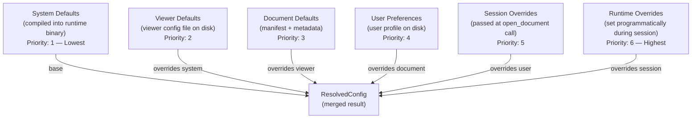
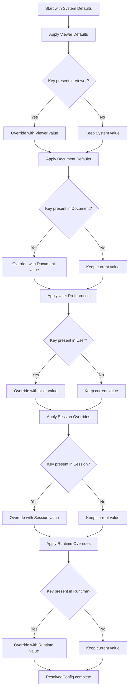
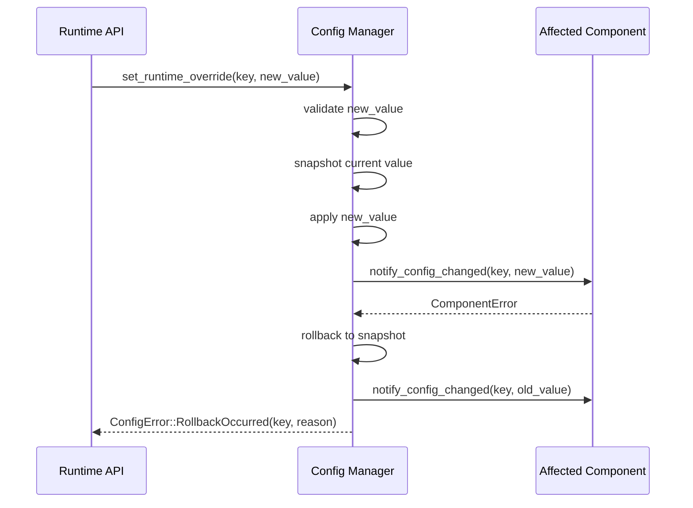

# Phase 2 — Module 07: Runtime Configuration
# LDFX Runtime Foundation Specification

**Specification Version:** 2.0.0
**Status:** Canonical — Approved
**Phase:** 2 — Runtime Foundation
**Section:** 7 of 17
**Depends On:** Module 01–06

---

## 7. Runtime Configuration

---

### 7.1 Overview

The LDFX Runtime uses a layered configuration system. Configuration values
come from multiple sources and are merged in a defined priority order.
Higher-priority sources override lower-priority sources for the same key.
The Configuration Manager resolves all sources into a single
`ResolvedConfig` object at boot time.

---

### 7.2 Configuration Hierarchy



---

### 7.3 Configuration Sources

#### 7.3.1 System Defaults

- **Source:** Compiled into the runtime binary as constants
- **Format:** Rust constants / default trait implementations
- **Mutability:** Immutable — cannot be changed without recompiling
- **Purpose:** Guarantee that every configuration key always has a valid value
- **Failure behavior:** Cannot fail — always present

#### 7.3.2 Viewer Defaults

- **Source:** `ldfx-viewer.toml` in the viewer application directory
- **Format:** TOML
- **Mutability:** Changed by the viewer application developer
- **Purpose:** Allow viewer applications to set their own defaults
  (e.g., a corporate viewer with specific font or theme defaults)
- **Failure behavior:** If missing or invalid → use System Defaults, log warning

#### 7.3.3 Document Defaults

- **Source:** `manifest.json` and `metadata/metadata.json` inside the `.ldfx` file
- **Format:** JSON (already parsed by boot sequence)
- **Mutability:** Immutable — set by the document author
- **Purpose:** Allow documents to declare their preferred runtime behavior
  (e.g., preferred language, theme, offline mode)
- **Failure behavior:** If invalid → use Viewer Defaults for that key, log warning

**Document-configurable keys:**

| Key | Source | Description |
|---|---|---|
| `preferred_language` | manifest | Preferred display language |
| `preferred_theme` | manifest | Preferred theme identifier |
| `offline_capable` | manifest | Whether offline mode is supported |
| `requires_network` | manifest | Whether network is required |
| `requires_gpu` | manifest | Whether GPU rendering is required |
| `unknown_feature_policy` | manifest | warn / error / ignore / safe_mode |
| `minimum_runtime_version` | manifest | Minimum runtime version required |
| `target_platforms` | manifest | Supported platforms |

#### 7.3.4 User Preferences

- **Source:** User profile storage (platform-specific path via Platform Adapter)
- **Format:** JSON
- **Mutability:** Changed by the user through the viewer UI
- **Purpose:** Allow users to personalize their reading experience
- **Failure behavior:** If missing → use Document Defaults, log info

**User-configurable keys:**

| Key | Description | Default |
|---|---|---|
| `theme` | UI theme | system |
| `font_size_scale` | Font size multiplier | 1.0 |
| `language` | Display language override | document default |
| `text_direction` | Text direction override | document default |
| `idle_timeout_ms` | Idle timeout | 60000 |
| `cache_size_mb` | Max cache size | 256 |
| `enable_animations` | UI animations | true |
| `enable_telemetry` | Anonymous telemetry | false |
| `accessibility_mode` | High contrast / large text | false |

#### 7.3.5 Session Overrides

- **Source:** `RuntimeOptions` struct passed to `open_document()`
- **Format:** Rust struct
- **Mutability:** Set once at document open, immutable during session
- **Purpose:** Allow the application to override configuration for a specific
  document open (e.g., open in safe mode, force a specific language)
- **Failure behavior:** Invalid values are rejected at the API layer before boot

**Session-overridable keys:**

| Key | Description |
|---|---|
| `boot_mode` | cold / warm / recovery / safe |
| `language_override` | Force a specific language |
| `theme_override` | Force a specific theme |
| `dev_mode` | Enable developer mode |
| `verbose_logging` | Enable verbose logging |
| `disable_plugins` | Disable all plugins |
| `disable_scripts` | Disable all scripts |
| `disable_ai` | Disable AI features |
| `disable_network` | Force offline mode |
| `timeout_overrides` | Per-phase boot timeout overrides |

#### 7.3.6 Runtime Overrides

- **Source:** Set programmatically via the Runtime API during an active session
- **Format:** Typed API calls
- **Mutability:** Can be changed at any time during a Running session
- **Purpose:** Allow the application to respond to runtime events
  (e.g., user changes theme, user changes language)
- **Failure behavior:** Invalid values are rejected, current value retained

**Runtime-overridable keys:**

| Key | Description | Requires Restart |
|---|---|---|
| `active_theme` | Change theme | No |
| `active_language` | Change language | No |
| `font_size_scale` | Change font scale | No |
| `enable_animations` | Toggle animations | No |
| `accessibility_mode` | Toggle accessibility | No |
| `cache_size_mb` | Adjust cache size | No |
| `idle_timeout_ms` | Adjust idle timeout | No |

---

### 7.4 Configuration Precedence Resolution



---

### 7.5 Configuration Validation

Every configuration value is validated against its schema before being
accepted into the resolved configuration.

| Validation Rule | On Failure |
|---|---|
| Type mismatch (e.g., string where number expected) | Use default, log warning |
| Value out of range (e.g., font_size_scale < 0.1) | Clamp to range, log warning |
| Unknown key | Ignore, log info |
| Required key missing | Use default, log warning |
| Conflicting values (e.g., requires_network + disable_network) | Higher priority wins, log warning |

---

### 7.6 Configuration Rollback

If a runtime configuration change causes a component failure, the
Configuration Manager rolls back to the previous value.



---

### 7.7 Configuration Profiles

Configuration profiles allow a set of configuration values to be
saved and restored as a named group.

| Profile | Description |
|---|---|
| `default` | System defaults — always available |
| `reading` | Optimized for reading (large font, high contrast) |
| `presentation` | Optimized for presenting (full screen, no UI chrome) |
| `developer` | Developer mode with verbose logging and inspector |
| `accessibility` | Maximum accessibility settings |
| `offline` | Force offline mode, disable all network features |

Profiles are stored in user preferences. Custom profiles may be created
by the user. A profile is applied by setting all its keys as User Preferences.

---

### 7.8 Feature Flags in Configuration

Feature flags from the binary header and manifest are exposed as
read-only configuration keys. They cannot be overridden by any
configuration source.

| Config Key | Source | Overridable |
|---|---|---|
| `features.has_scripts` | manifest | No |
| `features.has_ai` | manifest | No |
| `features.has_plugins` | manifest | No |
| `features.has_encryption` | manifest | No |
| `features.has_annotations` | manifest | No |
| `features.has_collaboration` | manifest | No |
| `features.has_cloud_sync` | manifest | No |
| `features.readonly` | manifest | No |

Session overrides may *disable* features (e.g., `disable_plugins: true`)
but may never *enable* features that are not declared in the manifest.

---

### 7.9 ResolvedConfig Structure

The `ResolvedConfig` is the final merged configuration object stored
in the Document Context. It is a typed struct — not a raw key-value map.

```
ResolvedConfig {
    runtime: RuntimeConfig {
        idle_timeout_ms: u64,
        cache_size_mb: u32,
        thread_pool_size: u8,
        boot_timeout_ms: u64,
    },
    display: DisplayConfig {
        theme: ThemeId,
        language: BCP47,
        font_size_scale: f32,
        text_direction: Direction,
        enable_animations: bool,
        accessibility_mode: bool,
    },
    features: FeatureConfig {
        plugins_enabled: bool,
        scripts_enabled: bool,
        ai_enabled: bool,
        network_enabled: bool,
        annotations_enabled: bool,
        cloud_sync_enabled: bool,
    },
    security: SecurityConfig {
        unknown_feature_policy: UnknownFeaturePolicy,
        trust_level: TrustLevel,
        require_signature: bool,
    },
    developer: DeveloperConfig {
        dev_mode: bool,
        verbose_logging: bool,
        hot_reload: bool,
        profiling: bool,
        inspector: bool,
    },
    telemetry: TelemetryConfig {
        enabled: bool,
        endpoint: Option<Url>,
    },
}
```

---

**Next:** Module 08 — Runtime Services
