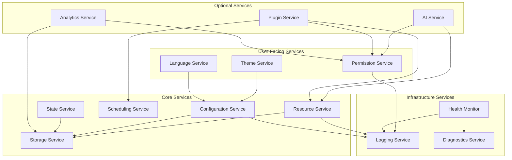

# Phase 2 — Module 08: Runtime Services
# LDFX Runtime Foundation Specification

**Specification Version:** 2.0.0
**Status:** Canonical — Approved
**Phase:** 2 — Runtime Foundation
**Section:** 8 of 17
**Depends On:** Module 01–07

---

## 8. Runtime Services

---

### 8.1 Overview

Runtime Services are internal subsystems that provide shared capabilities
to all runtime components. Each service has a single responsibility, a
defined interface, and a defined lifecycle. Services are initialized during
the boot sequence and shut down during the shutdown sequence.

Services communicate with each other only through the Event Dispatcher
or through direct interface calls — never through shared mutable state.

---

### 8.2 Service Interaction Diagram

---

### 8.3 Resource Service

**Purpose:** Central access point for all document resources.

**Responsibilities:**
- Load pages, assets, plugins, and scripts on demand
- Maintain the tiered resource cache
- Implement lazy loading and prefetching strategies
- Track resource reference counts
- Enforce per-resource size limits
- Emit resource lifecycle events

**Interface:**

| Method | Input | Output | Description |
|---|---|---|---|
| `load_page(id)` | Page ID | `PageContent` | Load a page's content |
| `load_layout(id)` | Page ID | `PageLayout` | Load a page's layout |
| `load_asset(id)` | Asset ID | `AssetData` | Load an asset |
| `prefetch_page(id)` | Page ID | `()` | Background prefetch |
| `release_page(id)` | Page ID | `()` | Release from cache |
| `release_asset(id)` | Asset ID | `()` | Release from cache |
| `cache_stats()` | `()` | `CacheStats` | Current cache statistics |

**Dependencies:** Virtual File System, Security Manager, Logging Service

**Failure Modes:**
- Entry not found → `ResourceError::NotFound`
- Hash mismatch → `ResourceError::IntegrityFailure`
- Cache full → evict LRU entries, retry

---

### 8.4 Configuration Service

**Purpose:** Provide typed, validated access to the resolved configuration.

**Responsibilities:**
- Expose the `ResolvedConfig` to all components
- Accept runtime configuration overrides
- Validate override values before applying
- Emit `ConfigChanged` events on successful changes
- Roll back failed changes

**Interface:**

| Method | Input | Output | Description |
|---|---|---|---|
| `get<T>(key)` | Config key | `T` | Get typed config value |
| `set(key, value)` | Key + value | `Result` | Set runtime override |
| `reset(key)` | Config key | `()` | Reset to resolved default |
| `snapshot()` | `()` | `ConfigSnapshot` | Full config snapshot |
| `apply_profile(name)` | Profile name | `Result` | Apply a named profile |

**Dependencies:** Storage Service (for user preferences), Logging Service

---

### 8.5 Storage Service

**Purpose:** Provide persistent and session-scoped storage for runtime data.

**Responsibilities:**
- Provide key-value storage scoped to session, warm, or persistent lifetime
- Ensure atomic writes (no partial writes)
- Enforce storage size limits per scope
- Provide storage for user preferences, warm boot state, and session state
- Handle storage migration between runtime versions

**Storage Scopes:**

| Scope | Lifetime | Location | Max Size |
|---|---|---|---|
| Session | Until document close | Memory only | 16MB |
| Warm | Until process exit | Temp directory | 64MB |
| Persistent | Until user clears | User data directory | 256MB |

**Interface:**

| Method | Input | Output | Description |
|---|---|---|---|
| `read(scope, key)` | Scope + key | `Option<Bytes>` | Read a value |
| `write(scope, key, value)` | Scope + key + value | `Result` | Write a value |
| `delete(scope, key)` | Scope + key | `Result` | Delete a value |
| `clear(scope)` | Scope | `Result` | Clear all values in scope |
| `size(scope)` | Scope | `usize` | Current storage size |

**Dependencies:** Platform Adapter (for file system access), Logging Service

**Failure Modes:**
- Write failure → `StorageError::WriteFailed`
- Size limit exceeded → `StorageError::QuotaExceeded`
- Corruption detected → `StorageError::Corrupted`, clear and rebuild

---

### 8.6 Theme Service

**Purpose:** Manage the active theme and provide theme data to the renderer.

**Responsibilities:**
- Load the active theme from the document or user preferences
- Provide theme tokens (colors, fonts, spacing) to the renderer
- Handle theme switching at runtime
- Support system theme detection (light/dark)
- Validate theme data

**Interface:**

| Method | Input | Output | Description |
|---|---|---|---|
| `active_theme()` | `()` | `ThemeData` | Get current theme |
| `set_theme(id)` | Theme ID | `Result` | Switch theme |
| `available_themes()` | `()` | `Vec<ThemeId>` | List available themes |
| `system_theme()` | `()` | `SystemTheme` | Detect system light/dark |

**Dependencies:** Configuration Service, Resource Service, Logging Service

---

### 8.7 Language Service

**Purpose:** Manage localization and provide translated strings.

**Responsibilities:**
- Load locale data for the active language
- Provide translated strings for runtime UI elements
- Handle language switching at runtime
- Support RTL/LTR direction switching
- Fall back to the document's primary language if a locale is unavailable

**Interface:**

| Method | Input | Output | Description |
|---|---|---|---|
| `active_language()` | `()` | `BCP47` | Current language tag |
| `set_language(tag)` | BCP47 tag | `Result` | Switch language |
| `translate(key)` | String key | `String` | Get translated string |
| `direction()` | `()` | `Direction` | Current text direction |
| `available_locales()` | `()` | `Vec<BCP47>` | Available locales |

**Dependencies:** Configuration Service, Resource Service

---

### 8.8 Analytics Service

**Purpose:** Collect anonymous usage analytics if the user has consented.

**Responsibilities:**
- Track document open/close events
- Track page navigation events
- Track feature usage (plugins, AI, annotations)
- Batch and flush analytics to the configured endpoint
- Respect the user's telemetry consent setting
- Never collect PII (no document content, no user identifiers)

**Privacy rules:**
- Analytics are disabled by default (`enable_telemetry: false`)
- No analytics are collected if `enable_telemetry: false`
- No document content is ever included in analytics
- All analytics are anonymized before transmission
- Analytics are never transmitted without explicit user consent

**Interface:**

| Method | Input | Output | Description |
|---|---|---|---|
| `track(event)` | AnalyticsEvent | `()` | Record an event |
| `flush()` | `()` | `Result` | Flush pending events |
| `is_enabled()` | `()` | `bool` | Check consent status |

**Dependencies:** Permission Service, Storage Service, Platform Adapter (network)

---

### 8.9 Permission Service

**Purpose:** Single authority for all permission checks and grants.

**Responsibilities:**
- Evaluate permission requests against the granted permission set
- Handle user-interactive permission prompts
- Log all permission decisions
- Maintain the session grant set
- Enforce the principle of least privilege

**Interface:**

| Method | Input | Output | Description |
|---|---|---|---|
| `check(permission)` | Permission | `bool` | Check if permission is granted |
| `require(permission)` | Permission | `Result` | Assert permission or error |
| `request(permission)` | Permission | `Future<PermissionResult>` | Request user grant |
| `revoke(permission)` | Permission | `()` | Revoke a session grant |
| `granted_set()` | `()` | `PermissionSet` | All currently granted permissions |

**Dependencies:** Document Context (permission grants), Logging Service

---

### 8.10 Logging Service

**Purpose:** Structured, leveled logging for all runtime components.

**Responsibilities:**
- Accept log entries from all components
- Route entries to configured sinks
- Filter by log level per component
- Maintain a ring buffer for crash reports
- Never block the calling component

**Log Sinks:**

| Sink | When Active | Description |
|---|---|---|
| Console | Dev mode | Colored output to stdout |
| File | When configured | Rotating log file |
| Ring Buffer | Always | Last 1000 entries in memory |
| Remote | When configured + consent | Structured log shipping |

**Interface:**

| Method | Input | Output | Description |
|---|---|---|---|
| `error(component, msg, ctx)` | Log data | `()` | Log error |
| `warn(component, msg, ctx)` | Log data | `()` | Log warning |
| `info(component, msg, ctx)` | Log data | `()` | Log info |
| `debug(component, msg, ctx)` | Log data | `()` | Log debug (dev only) |
| `trace(component, msg, ctx)` | Log data | `()` | Log trace (dev only) |
| `ring_buffer()` | `()` | `Vec<LogEntry>` | Get recent entries |
| `flush()` | `()` | `Result` | Flush all sinks |

---

### 8.11 Diagnostics Service

**Purpose:** Aggregate runtime health data and generate diagnostic reports.

**Responsibilities:**
- Collect health data from all components via periodic heartbeats
- Generate crash reports on fatal errors
- Provide a runtime inspector interface in developer mode
- Export diagnostic snapshots on demand
- Detect component health degradation

**Interface:**

| Method | Input | Output | Description |
|---|---|---|---|
| `health_report()` | `()` | `HealthReport` | Current health status |
| `crash_report(error)` | RuntimeError | `CrashReport` | Generate crash report |
| `snapshot()` | `()` | `DiagnosticSnapshot` | Full diagnostic snapshot |
| `component_status(id)` | Component ID | `ComponentStatus` | Single component health |

**Dependencies:** Logging Service, Performance Monitor, all components

---

### 8.12 AI Service

**Purpose:** Interface to the AI Engine for AI-powered document features.

**Status:** Interface defined. Implementation deferred to AI Engine phase.

**Responsibilities:**
- Accept AI block node types from the page content model
- Route inference requests to the AI Engine
- Return structured results to the renderer
- Enforce the `execute_ai` permission
- Enforce inference time limits
- Support streaming inference results

**Interface:**

| Method | Input | Output | Description |
|---|---|---|---|
| `infer(block, context)` | AI block node | `Future<AiResult>` | Run inference |
| `is_available()` | `()` | `bool` | Check if AI engine is ready |
| `models()` | `()` | `Vec<ModelInfo>` | List available models |
| `cancel(request_id)` | Request ID | `()` | Cancel pending inference |

**Dependencies:** Permission Service (`execute_ai`), Resource Service, Scheduler

---

### 8.13 Plugin Service

**Purpose:** Manage the lifecycle of all plugins within the runtime.

**Responsibilities:**
- Initialize plugins via the Plugin Runtime
- Route plugin API calls through the permission system
- Handle plugin crashes without crashing the runtime
- Provide inter-plugin communication via the Event Dispatcher
- Enforce per-plugin resource limits

**Interface:**

| Method | Input | Output | Description |
|---|---|---|---|
| `call(plugin_id, method, args)` | Plugin ID + call | `Future<PluginResult>` | Call a plugin method |
| `status(plugin_id)` | Plugin ID | `PluginStatus` | Get plugin status |
| `restart(plugin_id)` | Plugin ID | `Result` | Restart a failed plugin |
| `list()` | `()` | `Vec<PluginInfo>` | List all plugins |

**Dependencies:** Permission Service, Resource Service, Scheduler, Logging Service

---

### 8.14 State Service

**Purpose:** Manage all mutable session state.

**Responsibilities:**
- Store and retrieve session state by key and scope
- Persist warm state for recovery boot
- Enforce state size limits
- Provide atomic read-modify-write operations

**Interface:**

| Method | Input | Output | Description |
|---|---|---|---|
| `get(scope, key)` | Scope + key | `Option<Value>` | Read state |
| `set(scope, key, value)` | Scope + key + value | `Result` | Write state |
| `delete(scope, key)` | Scope + key | `Result` | Delete state |
| `snapshot()` | `()` | `StateSnapshot` | Full state snapshot |
| `restore(snapshot)` | StateSnapshot | `Result` | Restore from snapshot |

**Dependencies:** Storage Service, Logging Service

---

### 8.15 Scheduling Service

**Purpose:** Manage all asynchronous and deferred work.

**Responsibilities:**
- Accept tasks with priority levels
- Assign tasks to the thread pool
- Enforce per-task CPU time limits
- Cancel tasks on lifecycle state changes
- Report task completion and failure

**Interface:**

| Method | Input | Output | Description |
|---|---|---|---|
| `spawn(task, priority)` | Task + priority | `TaskHandle` | Schedule a task |
| `cancel(handle)` | TaskHandle | `()` | Cancel a task |
| `await(handle)` | TaskHandle | `Future<TaskResult>` | Wait for completion |
| `queue_depth()` | `()` | `usize` | Current queue depth |
| `active_count()` | `()` | `usize` | Active task count |

**Dependencies:** Platform Adapter (threads), Logging Service

---

### 8.16 Health Monitor

**Purpose:** Continuously monitor the health of all runtime components.

**Responsibilities:**
- Send periodic heartbeat requests to all components
- Detect components that stop responding
- Escalate unresponsive components to the Error Handler
- Track component uptime and failure counts
- Provide health status to the Diagnostics Service

**Heartbeat interval:** 5 seconds (configurable)
**Unresponsive threshold:** 3 missed heartbeats → component marked unhealthy

**Interface:**

| Method | Input | Output | Description |
|---|---|---|---|
| `register(component_id)` | Component ID | `()` | Register for monitoring |
| `heartbeat(component_id)` | Component ID | `()` | Report component alive |
| `status()` | `()` | `SystemHealth` | Overall health status |

**Dependencies:** Logging Service, Diagnostics Service, Error Handler

---

**Next:** Module 09 — Runtime Events
