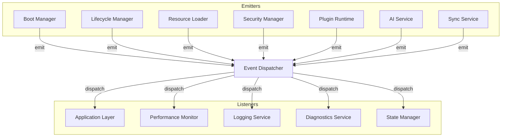
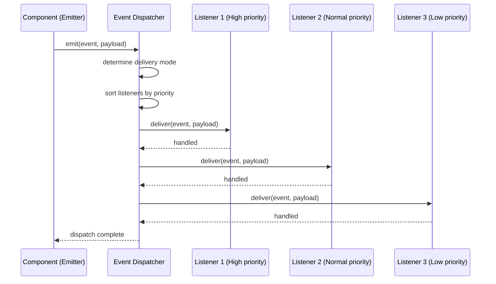

# Phase 2 — Module 09: Runtime Events
# LDFX Runtime Foundation Specification

**Specification Version:** 2.0.0
**Status:** Canonical — Approved
**Phase:** 2 — Runtime Foundation
**Section:** 9 of 17
**Depends On:** Module 01–08

---

## 9. Runtime Events

---

### 9.1 Overview

The LDFX Runtime uses a typed event system as the primary mechanism for
decoupled communication between components and between the runtime and
the Application Layer. Events flow in one direction — from the runtime
outward to listeners. Components do not call each other directly for
notifications; they emit events and let interested parties respond.

---

### 9.2 Event System Architecture



---

### 9.3 Event Delivery Modes

| Mode | Description | Blocking | Use Case |
|---|---|---|---|
| Synchronous | Delivered inline, emitter waits | Yes | Critical lifecycle events |
| Asynchronous | Queued, delivered on next tick | No | Resource events, plugin events |
| Broadcast | Delivered to all registered listeners | No | State changes |
| Targeted | Delivered to a specific listener ID | No | Request-response patterns |

---

### 9.4 Event Priority Levels

| Priority | Value | Description | Examples |
|---|---|---|---|
| Critical | 0 | Must be delivered immediately | SecurityViolation, FatalError |
| High | 1 | Delivered before next render frame | RuntimeReady, PageLoaded |
| Normal | 2 | Standard delivery | ResourceLoaded, PluginReady |
| Low | 3 | Delivered when queue is not busy | Analytics, Telemetry |
| Deferred | 4 | Delivered only when system is idle | Diagnostics, Cleanup |

---

### 9.5 Complete Event Catalog

#### 9.5.1 Runtime Lifecycle Events

| Event | Priority | Cancellable | Description |
|---|---|---|---|
| `RuntimeCreated` | High | No | Runtime object instantiated |
| `RuntimeInitializing` | High | No | Boot sequence started |
| `RuntimeLoading` | Normal | No | Resources loading |
| `RuntimeReady` | Critical | No | Boot complete, document available |
| `RuntimeRunning` | High | No | Active user session started |
| `RuntimeIdle` | Low | No | Idle timeout elapsed |
| `RuntimePaused` | High | No | Runtime paused |
| `RuntimeBackground` | High | No | Runtime moved to background |
| `RuntimeRestoring` | High | No | Restoring from paused/background |
| `RuntimeSleeping` | High | No | OS suspend signal received |
| `RuntimeResuming` | High | No | OS resume signal received |
| `RuntimeUpdating` | Normal | No | Document update in progress |
| `RuntimeRestarting` | High | No | Restart sequence started |
| `RuntimeClosing` | Critical | No | Shutdown sequence started |
| `RuntimeDestroyed` | Critical | No | All resources released |

**Payload — RuntimeReady:**
```
{
    session_id: UUID,
    document_id: UUID,
    boot_mode: "cold" | "warm" | "recovery" | "safe",
    elapsed_ms: u64,
    page_count: u32,
    plugin_count: u32,
    warnings: Vec<String>
}
```

**Payload — RuntimeDestroyed:**
```
{
    session_id: UUID,
    document_id: UUID,
    uptime_ms: u64,
    clean_shutdown: bool
}
```

---

#### 9.5.2 Boot Progress Events

| Event | Priority | Description |
|---|---|---|
| `BootStarted` | Normal | Boot sequence initiated |
| `HeaderVerified` | Normal | Binary header validated |
| `ContainerOpened` | Normal | ZIP container opened |
| `ManifestLoaded` | Normal | manifest.json parsed |
| `VersionVerified` | Normal | Version compatibility confirmed |
| `IntegrityVerified` | Normal | All hashes verified |
| `SignatureVerified` | Normal | Signatures validated |
| `MetadataLoaded` | Normal | metadata.json parsed |
| `ConfigurationResolved` | Normal | Config hierarchy resolved |
| `ResourcesLoading` | Normal | Resource loading started |
| `ResourcesReady` | High | Entry page and hot assets loaded |
| `PluginsDiscovered` | Normal | Plugin index loaded |
| `PluginsReady` | Normal | All plugins initialized |
| `BootFailed` | Critical | Boot sequence failed |

**Payload — BootFailed:**
```
{
    phase: u8,
    phase_name: String,
    error_code: String,
    error_message: String,
    elapsed_ms: u64,
    recoverable: bool
}
```

---

#### 9.5.3 Resource Events

| Event | Priority | Description |
|---|---|---|
| `PageLoadStarted` | Normal | Page load initiated |
| `PageLoaded` | High | Page content available |
| `PageLoadFailed` | High | Page load failed |
| `PageReleased` | Low | Page evicted from cache |
| `AssetLoadStarted` | Normal | Asset load initiated |
| `AssetLoaded` | Normal | Asset available |
| `AssetLoadFailed` | Normal | Asset load failed |
| `AssetReleased` | Low | Asset evicted from cache |
| `CachePressure` | Normal | Cache approaching size limit |
| `CacheEvicted` | Low | Entries evicted from cache |

**Payload — PageLoaded:**
```
{
    page_id: String,
    page_path: String,
    page_number: u32,
    load_time_ms: u64,
    from_cache: bool
}
```

---

#### 9.5.4 Security Events

| Event | Priority | Cancellable | Description |
|---|---|---|---|
| `IntegrityVerified` | High | No | All hashes passed |
| `IntegrityViolation` | Critical | No | Hash mismatch detected |
| `SignatureValid` | High | No | Signature verified |
| `SignatureInvalid` | Critical | No | Signature verification failed |
| `PermissionGranted` | Normal | No | Permission granted |
| `PermissionDenied` | High | No | Permission denied |
| `PermissionRequested` | High | Yes | User permission prompt needed |
| `SecurityViolation` | Critical | No | Security policy violated |
| `SandboxViolation` | Critical | No | Plugin escaped sandbox |

**Security event rules:**
- Security events are always logged, regardless of log level settings
- Security events cannot be suppressed by the document
- `SecurityViolation` and `SandboxViolation` always trigger shutdown

**Payload — PermissionDenied:**
```
{
    permission: String,
    requester: String,
    requester_type: "plugin" | "script" | "runtime",
    reason: String
}
```

---

#### 9.5.5 Plugin Events

| Event | Priority | Description |
|---|---|---|
| `PluginLoading` | Normal | Plugin load started |
| `PluginReady` | Normal | Plugin initialized |
| `PluginFailed` | High | Plugin failed to load |
| `PluginCrashed` | High | Plugin crashed during execution |
| `PluginRestarted` | Normal | Plugin restarted after crash |
| `PluginTerminated` | Normal | Plugin shut down |
| `PluginMessage` | Normal | Plugin emitted a message |

**Payload — PluginCrashed:**
```
{
    plugin_id: String,
    plugin_version: String,
    crash_reason: String,
    restart_attempted: bool,
    required: bool
}
```

---

#### 9.5.6 Configuration Events

| Event | Priority | Description |
|---|---|---|
| `ConfigChanged` | Normal | A configuration value changed |
| `ConfigRollback` | Normal | A config change was rolled back |
| `ProfileApplied` | Normal | A configuration profile was applied |
| `ThemeChanged` | Normal | Active theme changed |
| `LanguageChanged` | Normal | Active language changed |

---

#### 9.5.7 State Events

| Event | Priority | Description |
|---|---|---|
| `StateChanged` | Low | Session state value changed |
| `StatePersisted` | Low | State written to warm store |
| `StateRestored` | Normal | State restored from warm store |
| `ScrollPositionChanged` | Low | Page scroll position changed |
| `FormStateChanged` | Low | Form input state changed |

---

#### 9.5.8 Performance Events

| Event | Priority | Description |
|---|---|---|
| `BootTimeSlow` | Normal | Boot exceeded target time |
| `MemoryPressure` | High | Memory usage approaching limit |
| `MemoryCritical` | Critical | Memory usage at limit |
| `CpuThrottled` | Normal | CPU usage throttled |
| `AssetLoadSlow` | Low | Asset load exceeded target time |
| `PluginCpuLimit` | Normal | Plugin approaching CPU limit |

---

### 9.6 Event Propagation



---

### 9.7 Event Cancellation

Some events are cancellable. A listener may cancel a cancellable event
to prevent it from being delivered to lower-priority listeners and to
prevent the default action.

**Cancellable events:** Only events marked `Cancellable: Yes` in the catalog.

**Cancellation rules:**
- Only the Application Layer may cancel events
- Internal runtime components may not cancel events
- Cancellation is only effective before the event reaches the runtime's
  default handler
- Security events are never cancellable

**Example — PermissionRequested cancellation:**
```
Application receives PermissionRequested event
    → Application decides to auto-deny (parental controls)
    → Application calls event.cancel(PermissionResult::Denied)
    → Event Dispatcher stops propagation
    → Permission Manager receives Denied result
    → PermissionDenied event emitted
```

---

### 9.8 Event Security

| Rule | Description |
|---|---|
| Documents cannot subscribe to security events | Security events are runtime-internal only |
| Plugins cannot emit lifecycle events | Only the runtime kernel may emit lifecycle events |
| Event payloads are immutable | Listeners cannot modify event payloads |
| Event source is always verified | Every event carries its emitter component ID |
| Security events are always logged | Cannot be suppressed |

---

### 9.9 Event Logging

In developer mode, every event is logged with:
- Timestamp (monotonic clock)
- Event type
- Emitter component ID
- Payload (redacted in production)
- Delivery mode
- Listener count
- Dispatch duration

In production mode, only Critical and High priority events are logged.

---

**Next:** Module 10 — Runtime State Machine
