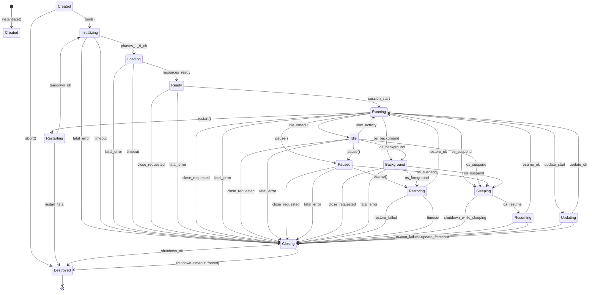
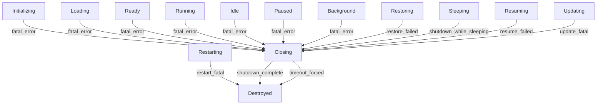
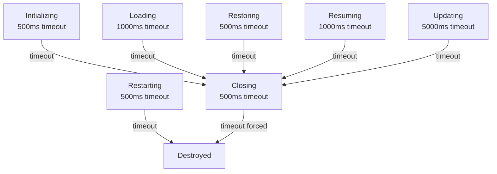

# Phase 2 — Module 10: Runtime State Machine
# LDFX Runtime Foundation Specification

**Specification Version:** 2.0.0
**Status:** Canonical — Approved
**Phase:** 2 — Runtime Foundation
**Section:** 10 of 17
**Depends On:** Module 01–09

---

## 10. Runtime State Machine

---

### 10.1 Overview

The Runtime State Machine is the formal definition of every state the
LDFX Runtime can occupy, every valid transition between states, every
failure transition, and every recovery transition. It is the authoritative
reference for the Lifecycle Manager implementation.

The state machine is deterministic. Given the current state and a trigger,
there is exactly one valid next state. All other transitions are rejected.

---

### 10.2 Complete State Machine Diagram

---

### 10.3 State Descriptions

#### `Created`
The runtime object has been instantiated. No resources have been allocated.
No file has been opened. The boot sequence has not started.

**Entry action:** Allocate runtime object, initialize logging.
**Exit action:** Begin boot sequence.
**Valid duration:** < 10ms before boot() is called.

---

#### `Initializing`
The boot sequence is executing Phases 1–9 (pre-flight through configuration
resolution). The document is being validated and parsed. No user-visible
content is available yet.

**Entry action:** Emit `RuntimeInitializing`. Start boot phase timer.
**Exit action (success):** Emit `ManifestLoaded`, `IntegrityVerified`.
**Exit action (failure):** Emit `BootFailed`. Begin shutdown.
**Valid duration:** Up to 500ms (standard document).

---

#### `Loading`
Boot Phases 10–14 are executing. Resources are being loaded, plugins are
being initialized, and the Document Context is being created.

**Entry action:** Emit `ResourcesLoading`.
**Exit action (success):** Emit `ResourcesReady`, `PluginsReady`.
**Exit action (failure):** Emit `BootFailed`. Begin shutdown.
**Valid duration:** Up to 1000ms (standard document).

---

#### `Ready`
Boot is complete. The document is fully initialized and available.
No active user session has started yet. The renderer may begin
displaying content.

**Entry action:** Emit `RuntimeReady`. Record boot completion time.
**Exit action:** Emit `RuntimeRunning` or `RuntimeClosing`.
**Valid duration:** Indefinite (waiting for first user interaction).

---

#### `Running`
An active user session is in progress. The document is fully interactive.
All features are available according to the document's declared capabilities
and the user's granted permissions.

**Entry action:** Emit `RuntimeRunning`. Start idle timer.
**Exit action:** Emit appropriate transition event.
**Valid duration:** Indefinite.

---

#### `Idle`
The runtime is running but no user interaction has occurred for longer
than `idle_timeout_ms`. Resources are conserved. The document remains
fully loaded and interactive — it will respond immediately to any input.

**Entry action:** Emit `RuntimeIdle`. Reduce scheduler thread pool.
**Exit action:** Emit `RuntimeRunning` on any user input.
**Valid duration:** Indefinite (until user input or explicit pause).

---

#### `Paused`
The runtime has been explicitly paused by the application. Rendering
is suspended. The Scheduler is paused. All state is preserved in memory.

**Entry action:** Emit `RuntimePaused`. Suspend scheduler. Suspend renderer.
**Exit action:** Emit `RuntimeRestoring`.
**Valid duration:** Indefinite.

---

#### `Background`
The application has been moved to the background by the OS. Similar to
Paused but triggered by an OS signal rather than an application request.
Memory is aggressively reclaimed.

**Entry action:** Emit `RuntimeBackground`. Suspend renderer. Reclaim memory.
**Exit action:** Emit `RuntimeRestoring`.
**Valid duration:** Indefinite (OS-controlled).

---

#### `Restoring`
The runtime is returning from Paused or Background state. State is being
restored and the renderer is being reactivated.

**Entry action:** Emit `RuntimeRestoring`. Restore warm cache.
**Exit action (success):** Emit `RuntimeRunning`.
**Exit action (failure):** Begin shutdown.
**Valid duration:** Up to 500ms.

---

#### `Sleeping`
The OS has issued a suspend signal (laptop lid close, system sleep).
All non-essential operations are stopped. State is persisted to warm store.

**Entry action:** Emit `RuntimeSleeping`. Persist state. Release non-essential memory.
**Exit action:** Emit `RuntimeResuming`.
**Valid duration:** Indefinite (OS-controlled).

---

#### `Resuming`
The OS has issued a resume signal. The runtime is restoring from sleep.
Integrity is re-verified before returning to Running.

**Entry action:** Emit `RuntimeResuming`. Re-verify manifest hash.
**Exit action (success):** Emit `RuntimeRunning`.
**Exit action (failure):** Begin shutdown.
**Valid duration:** Up to 1000ms.

---

#### `Updating`
A document update is in progress (live edit sync, content update from
collaboration). The document is partially available during this state.

**Entry action:** Emit `RuntimeUpdating`. Pause affected page rendering.
**Exit action (success):** Emit `RuntimeRunning`.
**Exit action (failure):** Begin shutdown if update is fatal.
**Valid duration:** Up to 5000ms.

---

#### `Restarting`
A restart has been requested. The runtime is tearing down all components
before re-executing the boot sequence with the same document bytes.

**Entry action:** Emit `RuntimeRestarting`. Save restart snapshot.
**Exit action (success):** Re-enter `Initializing`.
**Exit action (failure):** Transition to `Destroyed`.
**Valid duration:** Up to 500ms for teardown.

---

#### `Closing`
The shutdown sequence is in progress. Plugins are being stopped, resources
are being released, and logs are being flushed.

**Entry action:** Emit `RuntimeClosing`. Begin ordered shutdown.
**Exit action:** Emit `RuntimeDestroyed`.
**Valid duration:** Up to 500ms (forced after timeout).

---

#### `Destroyed`
Terminal state. All resources have been released. The runtime object is
invalid and must not be used. The session is over.

**Entry action:** Emit `RuntimeDestroyed`. Release all memory.
**Exit action:** None — terminal state.

---

### 10.4 Failure Transitions

Every state has a failure path. Failure transitions always lead to `Closing`
(except `Created` and `Restarting` which go directly to `Destroyed`).

---

### 10.5 Recovery Transitions

Some failures are recoverable without entering `Closing`.

| State | Failure | Recovery Action | Recovery Transition |
|---|---|---|---|
| Running | Plugin crash | Restart plugin | Stay in Running |
| Running | Asset load failure | Show error placeholder | Stay in Running |
| Running | Network timeout | Retry with backoff | Stay in Running |
| Running | Config change failure | Rollback config | Stay in Running |
| Updating | Non-fatal update error | Partial update, warn | Running |
| Resuming | Integrity warning | Warn user, continue | Running |

---

### 10.6 Timeout Transitions

If a state does not complete its expected action within its timeout,
the Lifecycle Manager forces a transition.

---

### 10.7 State Machine Invariants

The following invariants must hold at all times:

| Invariant | Description |
|---|---|
| Single state | The runtime is in exactly one state at any time |
| No re-entry | A state may not transition to itself |
| Terminal is final | `Destroyed` has no outgoing transitions |
| Closing is one-way | Once in `Closing`, only `Destroyed` is reachable |
| Events always emitted | Every transition emits its corresponding event |
| Timeouts always enforced | No state may exceed its timeout without a forced transition |
| Failure always handled | Every state has a defined failure path |

---

**Next:** Module 11 — Runtime Performance
