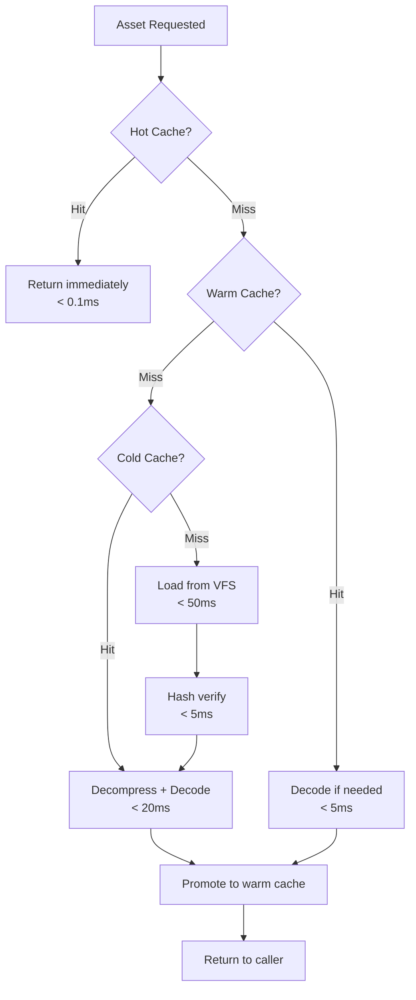
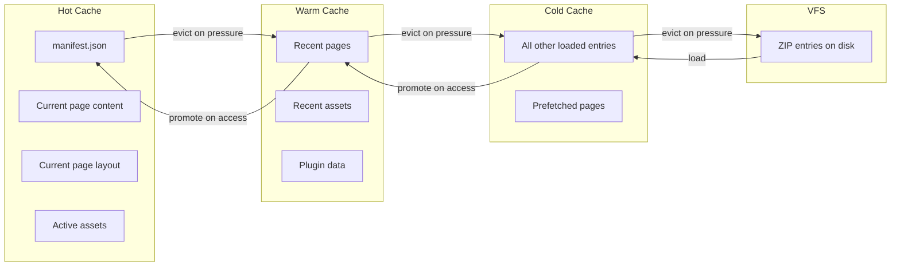
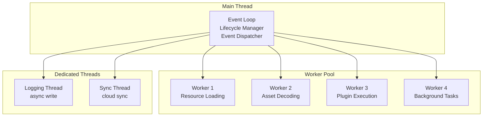

# Phase 2 — Module 11: Runtime Performance
# LDFX Runtime Foundation Specification

**Specification Version:** 2.0.0
**Status:** Canonical — Approved
**Phase:** 2 — Runtime Foundation
**Section:** 11 of 17
**Depends On:** Module 01–10

---

## 11. Runtime Performance

---

### 11.1 Performance Goals

Performance is a first-class requirement. The runtime must be fast enough
that users never perceive it as the bottleneck. Every performance target
is measurable, testable, and enforced by the Performance Monitor.

---

### 11.2 Boot Performance Targets

| Document Class | Pages | Assets | Plugins | Cold Boot Target | Warm Boot Target |
|---|---|---|---|---|---|
| Minimal | 1–10 | 0–5 | 0 | < 100ms | < 50ms |
| Standard | 10–100 | 5–50 | 0–2 | < 500ms | < 100ms |
| Rich | 100–500 | 50–200 | 2–5 | < 1500ms | < 300ms |
| Complex | 500–2000 | 200–1000 | 5–10 | < 5000ms | < 1000ms |
| Extreme | 2000+ | 1000+ | 10+ | < 15000ms | < 3000ms |

**Measurement:** Time from `open_document()` call to `RuntimeReady` event.

---

### 11.3 Memory Targets

| Metric | Target | Notes |
|---|---|---|
| Baseline RSS (minimal doc) | < 32MB | At Ready state |
| Baseline RSS (standard doc) | < 64MB | At Ready state |
| Per loaded page | < 2MB | Additional RSS |
| Per loaded image asset (1MP) | < 4MB | Decoded in memory |
| Per plugin instance | < 64MB | WASM sandbox limit |
| Background state RSS | < 16MB | After memory reclaim |
| Memory growth per hour | < 1MB | No memory leaks |

**Measurement:** RSS (Resident Set Size) reported by Platform Adapter.

---

### 11.4 CPU Targets

| Operation | CPU Target | Notes |
|---|---|---|
| Idle state CPU | < 0.1% | No background work |
| Page render (first) | < 16ms | 60fps budget |
| Page render (cached) | < 4ms | From cache |
| Asset decode (1MB image) | < 20ms | On load thread |
| Plugin execution (per tick) | < 5ms | Per plugin |
| Event dispatch | < 1ms | Per event |
| Hash verification (1MB) | < 5ms | SHA-256 |

---

### 11.5 Asset Loading Performance

**Asset load time targets:**

| Asset Size | From Hot Cache | From Warm Cache | From VFS |
|---|---|---|---|
| < 100KB | < 0.1ms | < 2ms | < 10ms |
| 100KB–1MB | < 0.1ms | < 5ms | < 30ms |
| 1MB–10MB | < 0.1ms | < 20ms | < 100ms |
| > 10MB | Streaming | Streaming | Streaming |

---

### 11.6 Caching Strategy

The runtime uses a three-tier cache with automatic promotion and eviction.

**Cache size limits:**

| Tier | Default Size | Configurable | Eviction Policy |
|---|---|---|---|
| Hot | 16MB | No | Never (pinned) |
| Warm | 64MB | Yes (user pref) | LRU |
| Cold | 256MB | Yes (user pref) | LRU + TTL (30min) |

**Cache key:** Virtual path within the document (e.g., `pages/page_001/content.json`)

**Cache invalidation:**
- Document bytes hash changed → full cache invalidation
- Runtime version changed → full cache invalidation
- Entry hash mismatch → single entry invalidation

---

### 11.7 Lazy Loading

The runtime loads only what is needed, when it is needed.

**Boot time — loaded eagerly:**
- `manifest.json`
- `metadata/metadata.json`
- `security/hashes.json`
- `security/signatures.json`
- `pages/index.json`
- Entry page `content.json` and `layout.json`
- Assets referenced by the entry page

**Boot time — loaded lazily (on first access):**
- All other pages
- All other assets
- Plugin WASM binaries (loaded when plugin is first called)
- AI model data (loaded when first AI block is rendered)

**Prefetching strategy:**
- After entry page is rendered, prefetch the next 2 pages in background
- After a page is rendered, prefetch assets referenced by adjacent pages
- Prefetch priority: Low (never blocks foreground work)

---

### 11.8 Thread Usage

**Thread pool configuration:**

| Setting | Value | Notes |
|---|---|---|
| Min worker threads | 2 | Always available |
| Max worker threads | min(logical_cpus, 8) | Capped to avoid thrashing |
| Thread stack size | 2MB | Per worker thread |
| Idle thread timeout | 30s | Threads exit if idle |
| Main thread stack | 8MB | Event loop |
| Logging thread | 1 dedicated | Never blocks callers |

---

### 11.9 Scheduling and Optimization

**Task scheduling rules:**
1. Critical tasks (boot phases) run on the main thread
2. Resource loading runs on worker threads
3. Asset decoding runs on worker threads
4. Plugin execution runs on dedicated worker threads (one per plugin)
5. Background prefetch runs at Low priority — yields to any higher priority task
6. Logging writes are always asynchronous — never block the caller

**Optimization strategies:**

| Strategy | Description | Applied To |
|---|---|---|
| Zero-copy reads | Return references to cached bytes, not copies | Hot cache reads |
| Streaming decompression | Decompress ZIP entries in chunks | Large assets |
| Parallel hash verification | Verify multiple entries concurrently | Boot Phase 6 |
| Deferred JSON parsing | Parse page content only when page is first rendered | All pages |
| Font subsetting | Load only the glyphs used in the document | Font assets |
| Image lazy decode | Decode images only when they enter the viewport | Image assets |

---

### 11.10 Performance Metrics Collection

The Performance Monitor collects the following metrics continuously:

| Metric | Collection Method | Retention |
|---|---|---|
| Boot time per phase | Monotonic clock timestamps | Session |
| Memory RSS | Platform Adapter poll (1s interval) | Session |
| Cache hit rate | Counter per tier | Session |
| Asset load times | Per-load timing | Last 1000 loads |
| Event dispatch latency | Per-event timing | Last 1000 events |
| Plugin CPU time | Per-tick timing | Per plugin, session |
| Page render time | Per-render timing | Last 100 renders |
| Thread pool utilization | Sampled (100ms interval) | Session |

---

### 11.11 Performance Profiling

In developer mode, the runtime exposes a performance profiler:

- **Flame graph:** CPU time breakdown by component and function
- **Memory timeline:** RSS over time with allocation events
- **Cache timeline:** Cache hit/miss rate over time
- **Event timeline:** All events with timestamps and dispatch times
- **Boot waterfall:** Per-phase boot timing breakdown

Profiling data is exported as JSON for use with external tools.

---

### 11.12 Performance Warnings

The Performance Monitor emits warnings when targets are exceeded:

| Condition | Warning Event | Threshold |
|---|---|---|
| Cold boot too slow | `BootTimeSlow` | > 2x target for document class |
| Memory too high | `MemoryPressure` | > 80% of platform memory |
| Memory critical | `MemoryCritical` | > 95% of platform memory |
| Cache miss rate high | `CacheMissRateHigh` | > 50% miss rate sustained |
| Plugin CPU high | `PluginCpuLimit` | > 80% of plugin CPU budget |
| Event queue deep | `EventQueueDeep` | > 1000 pending events |

---

**Next:** Module 12 — Runtime Security
