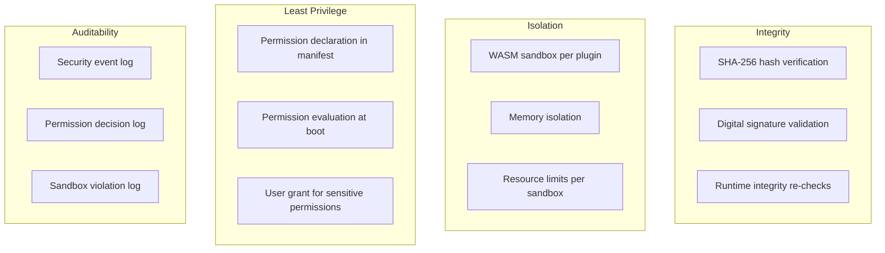
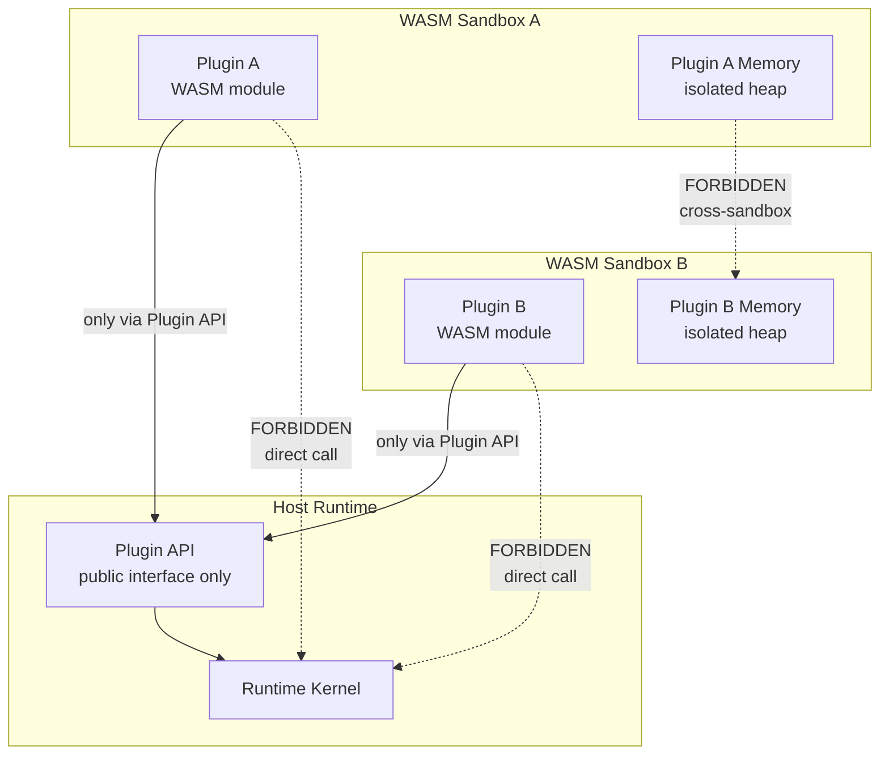
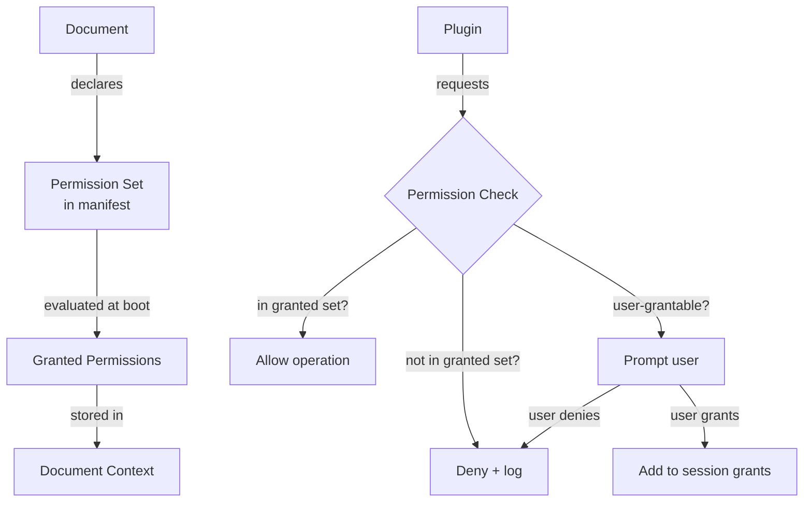
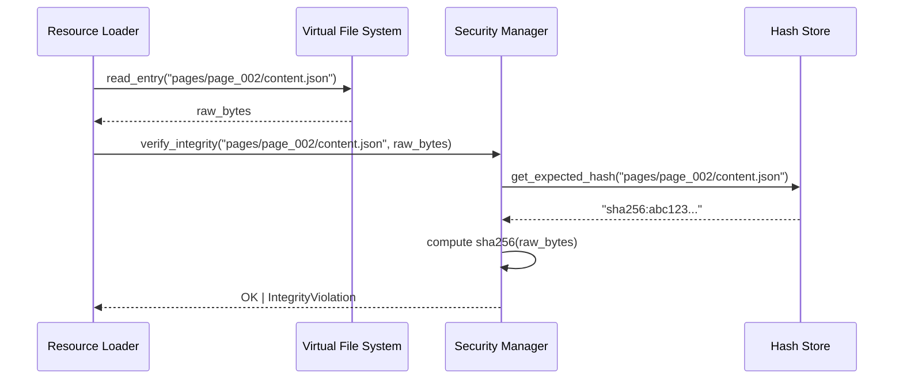

# Phase 2 — Module 12: Runtime Security
# LDFX Runtime Foundation Specification

**Specification Version:** 2.0.0
**Status:** Canonical — Approved
**Phase:** 2 — Runtime Foundation
**Section:** 12 of 17
**Depends On:** Module 01–11, Phase 1 Module 09

---

## 12. Runtime Security

---

### 12.1 Security Model Overview

The LDFX Runtime security model is built on four pillars:

1. **Integrity** — Every byte of document content is verified before use
2. **Isolation** — Plugins and scripts execute in sandboxes with no host access
3. **Least Privilege** — Every operation requires an explicitly declared permission
4. **Auditability** — Every security decision is logged and traceable



---

### 12.2 Runtime Isolation

The runtime itself is isolated from the document's executable content
(plugins, scripts, AI models). No plugin or script may call into the
runtime's internal implementation directly.



**Isolation rules:**
- Each plugin runs in its own WASM instance with its own linear memory
- Plugin memory is not accessible from the host runtime
- Plugin memory is not accessible from other plugins
- The host runtime's memory is not accessible from any plugin
- All plugin-to-runtime communication goes through the typed Plugin API

---

### 12.3 Sandbox Model

Every plugin and script executes inside a WASM sandbox with the following
constraints:

| Resource | Limit | Enforcement |
|---|---|---|
| Memory | 64MB per plugin | WASM memory limit |
| CPU time per tick | 5ms | Scheduler interrupt |
| Total CPU time | Configurable per plugin | Scheduler accounting |
| Stack depth | 1024 frames | WASM stack limit |
| File system access | None (unless `filesystem_read` granted) | Plugin API gate |
| Network access | None (unless `network_read`/`network_write` granted) | Plugin API gate |
| Host function calls | Only declared Plugin API functions | WASM import table |
| Spawning threads | Forbidden | WASM single-threaded |
| Spawning processes | Forbidden | No OS access |

**WASM validation:** Every WASM binary is validated by the WASM validator
before instantiation. Invalid WASM is rejected — never executed.

---

### 12.4 Permission Boundaries



**Permission categories:**

| Category | Permissions | Default |
|---|---|---|
| Document | `read_all_pages`, `write_annotations`, `read_annotations` | Granted |
| Network | `network_read`, `network_write` | Denied |
| File System | `filesystem_read`, `filesystem_write` | Denied |
| AI | `execute_ai` | Denied |
| Clipboard | `clipboard_read`, `clipboard_write` | Denied |
| Sensors | `camera`, `microphone`, `geolocation` | Denied |
| System | `notifications` | Denied |

**Permission escalation is forbidden.** A document cannot acquire permissions
at runtime that it did not declare in its manifest. The manifest is immutable
after boot.

---

### 12.5 Integrity Verification

Integrity verification happens at two points:

**At boot (Phase 6):**
- All entries in `security/hashes.json` are verified
- Any hash mismatch is a fatal boot error
- The document is rejected — never executed

**At load time (runtime):**
- Every entry loaded from the VFS is re-verified against its hash
- This catches tampering that occurs after the file is opened
- Hash mismatch at load time → `SecurityError::IntegrityViolation`
- The affected entry is rejected — a safe error placeholder is shown



---

### 12.6 Memory Safety

The runtime is written in Rust, which provides memory safety guarantees
at compile time:

| Guarantee | Mechanism |
|---|---|
| No buffer overflows | Rust bounds checking |
| No use-after-free | Rust ownership system |
| No null pointer dereferences | Rust Option type |
| No data races | Rust borrow checker |
| No uninitialized memory | Rust initialization rules |

**Additional runtime memory safety:**
- All allocations are tracked by the Performance Monitor
- Memory limits are enforced per component
- Plugin memory is completely isolated (WASM linear memory)
- Stack overflows in plugins are caught at the WASM boundary

---

### 12.7 Code Validation

Before any executable content is run:

| Content Type | Validation | On Failure |
|---|---|---|
| Plugin WASM | Full WASM binary validation | Reject plugin |
| Script WASM | Full WASM binary validation | Reject script |
| AI model (GGUF) | Header validation + checksum | Reject model |
| SVG assets | Script tag detection | Reject SVG |
| JSON content | Schema validation | Reject entry |

**SVG security:** SVG files are scanned for `<script>` tags and
`javascript:` URLs before being passed to the renderer. Any SVG
containing executable content is rejected.

---

### 12.8 Plugin Isolation

Each plugin is isolated from:
- The host runtime memory
- Other plugins' memory
- The document's raw bytes
- The file system (unless `filesystem_read` is granted)
- The network (unless `network_read`/`network_write` is granted)

**Plugin communication rules:**
- Plugins may not call each other directly
- Plugins communicate only through the Event Dispatcher
- The Event Dispatcher filters plugin events — plugins cannot emit lifecycle events
- Plugin-to-plugin messages are routed through the Plugin API

---

### 12.9 Resource Isolation

Resource limits are enforced per plugin and per document:

| Resource | Per Plugin Limit | Per Document Limit |
|---|---|---|
| Memory | 64MB | 512MB total |
| CPU time (per tick) | 5ms | N/A |
| Network bandwidth | 1MB/s | 10MB/s |
| Storage writes | 1MB/session | 10MB/session |
| Event emissions | 100/second | 1000/second |

Exceeding a limit results in:
- Warning event emitted
- Operation throttled or denied
- If limit severely exceeded → plugin terminated

---

### 12.10 Attack Surface Analysis

| Attack Vector | Mitigation |
|---|---|
| Malformed ZIP archive | Phase 1 validation rejects before execution |
| Corrupted binary header | CRC32 check rejects before ZIP parsing |
| Hash mismatch (tampered content) | SHA-256 verification at boot and load time |
| Invalid signature | Signature validation at boot |
| Path traversal in ZIP entries | Path traversal detection in VFS |
| Malicious WASM plugin | WASM validation before instantiation |
| Plugin memory escape | WASM linear memory isolation |
| Permission escalation | Permissions fixed at boot from manifest |
| SVG script injection | SVG script tag scanning |
| Zip bomb (decompression bomb) | Per-entry size limits enforced before decompression |
| Malicious manifest | Schema validation + UUID validation |
| Cross-document data leak | Fully isolated DocumentContext per document |

---

### 12.11 Threat Model

**Trusted:**
- The runtime binary itself
- The operating system
- The Platform Adapter

**Untrusted (treated as hostile input):**
- The `.ldfx` file bytes
- All document content (manifest, metadata, pages, assets)
- All plugin WASM binaries
- All script WASM binaries
- All network responses

**Threat actors:**
1. **Malicious document author** — attempts to escape sandbox, escalate permissions,
   or exfiltrate user data via a crafted `.ldfx` file
2. **Compromised document** — a legitimate document that has been tampered with
   after creation (detected by hash verification)
3. **Malicious plugin** — a plugin that attempts to exceed its declared permissions
   or escape its WASM sandbox
4. **Network attacker** — attempts to intercept or modify network responses
   (mitigated by requiring HTTPS and certificate validation)

---

### 12.12 Security Event Log

All security events are written to a dedicated security log that:
- Cannot be disabled by the document
- Cannot be read by plugins or scripts
- Is flushed to disk before shutdown
- Is included in crash reports
- Is retained for the session duration

**Security log entry format:**
```
{
    timestamp: ISO8601,
    event_type: String,
    severity: "info" | "warning" | "violation",
    component: String,
    document_id: UUID,
    session_id: UUID,
    details: { ... }
}
```

---

**Next:** Module 13 — Runtime Diagnostics
