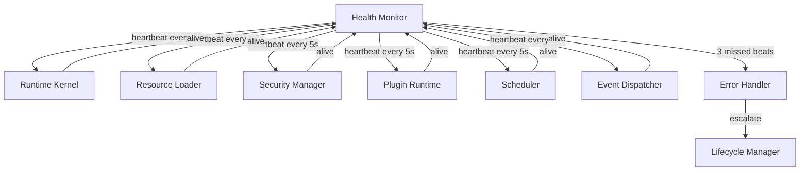

# Phase 2 — Module 13: Runtime Diagnostics
# LDFX Runtime Foundation Specification

**Specification Version:** 2.0.0
**Status:** Canonical — Approved
**Phase:** 2 — Runtime Foundation
**Section:** 13 of 17
**Depends On:** Module 01–12

---

## 13. Runtime Diagnostics

---

### 13.1 Overview

The Diagnostics subsystem provides comprehensive visibility into runtime
health, performance, and behavior. It serves three audiences:

| Audience | Mode | Purpose |
|---|---|---|
| End users | Production | Crash reports, error messages |
| Developers | Developer mode | Full inspection, profiling, hot reload |
| Support teams | Diagnostic export | Snapshot for issue investigation |

---

### 13.2 Health Monitor

The Health Monitor continuously tracks the health of every runtime component.

**Health states per component:**

| State | Description |
|---|---|
| `Healthy` | Responding to heartbeats, within performance targets |
| `Degraded` | Responding but exceeding performance targets |
| `Unresponsive` | Missed 1–2 heartbeats |
| `Failed` | Missed 3+ heartbeats — escalated to Error Handler |

**System health is the worst health state of any component.**

---

### 13.3 Crash Reports

When a fatal error occurs, the runtime generates a crash report before
shutting down.

**Crash report contents:**

| Section | Contents |
|---|---|
| Header | Timestamp, runtime version, platform, document ID (hashed) |
| Error | Error type, error message, component, stack trace |
| State | Current lifecycle state, boot mode, uptime |
| Performance | Memory RSS, CPU usage, cache stats at time of crash |
| Recent Events | Last 50 events from the event ring buffer |
| Security Log | Last 20 security events |
| Component Health | Health status of all components at time of crash |
| Configuration | Active configuration (sensitive values redacted) |

**Privacy rules for crash reports:**
- Document content is never included
- Document title is hashed (not included in plain text)
- User data is never included
- File paths are anonymized
- Crash reports are stored locally — never transmitted without user consent

**Crash report format:** JSON, stored in platform temp directory.

---

### 13.4 Error Reporting

Errors are classified and reported differently based on their severity
and the active mode:

| Error Class | Production | Developer Mode | User Visible |
|---|---|---|---|
| Fatal | Crash report + shutdown | Full stack trace | "Document could not be opened" |
| Security violation | Security log + shutdown | Full details | "Security error" |
| Recoverable | Warning log | Full details | Optional warning indicator |
| Plugin failure | Plugin log | Full details | "Plugin X failed" |
| Asset failure | Warning log | Full details | Error placeholder in UI |
| Config failure | Warning log | Full details | None (silent fallback) |

---

### 13.5 Telemetry

Telemetry is disabled by default and requires explicit user consent.

**When enabled, telemetry collects:**
- Document open/close events (no document content)
- Feature usage flags (which features were active)
- Boot time (milliseconds, no document details)
- Crash occurrence (no crash details, just a count)
- Platform and runtime version

**Telemetry never collects:**
- Document content
- Document title or metadata
- User identity
- File paths
- Plugin names or versions
- Any PII

**Telemetry transmission:**
- Batched and sent at document close
- Requires `enable_telemetry: true` in user preferences
- Requires `network_write` permission to be available
- Uses HTTPS only
- Endpoint is configurable by the viewer application

---

### 13.6 Debug Mode

Debug mode is activated by passing `DevFlags { verbose_logging: true }`
in boot options. It enables:

- All log levels (Debug and Trace)
- Per-event logging with full payloads
- Per-operation timing
- Cache hit/miss logging
- Permission decision logging
- Plugin call logging

Debug mode has a performance cost. It is never active in production builds
unless explicitly enabled.

---

### 13.7 Developer Mode

Developer mode is a superset of debug mode. It additionally enables:

- **Runtime Inspector** — live view of the Document Context
- **Hot Reload** — reload document content without full reboot
- **Performance Profiler** — flame graph and memory timeline
- **Event Timeline** — all events with timestamps
- **Plugin Debugger** — step through plugin execution
- **State Inspector** — live view of all session state
- **Network Inspector** — all network requests and responses

Developer mode is activated by passing `DevFlags { dev_mode: true }`.

---

### 13.8 Production Mode

In production mode (the default):

- Only Error, Warn, and Info log levels are active
- No stack traces are exposed to the Application Layer
- No internal types are exposed in error messages
- Crash reports are stored locally, not transmitted
- The Runtime Inspector is not available
- Performance profiling is not available

---

### 13.9 Performance Statistics

The Diagnostics Service exposes the following statistics at any time:

```mermaid
graph TD
    DS[Diagnostics Service]
    DS --> BS[Boot Statistics]
    DS --> MS[Memory Statistics]
    DS --> CS[Cache Statistics]
    DS --> ES[Event Statistics]
    DS --> PS[Plugin Statistics]
    DS --> TS[Thread Statistics]

    BS --> B1[Total boot time ms]
    BS --> B2[Per-phase boot times]
    BS --> B3[Boot mode]

    MS --> M1[Current RSS MB]
    MS --> M2[Peak RSS MB]
    MS --> M3[Per-component allocation]

    CS --> C1[Hot cache size]
    CS --> C2[Warm cache size]
    CS --> C3[Hit rate per tier]
    CS --> C4[Eviction count]

    ES --> E1[Events emitted total]
    ES --> E2[Events per second]
    ES --> E3[Average dispatch latency]

    PS --> P1[Active plugin count]
    PS --> P2[Per-plugin CPU time]
    PS --> P3[Per-plugin memory]

    TS --> T1[Active thread count]
    TS --> T2[Queue depth]
    TS --> T3[Task completion rate]
```

---

### 13.10 Runtime Inspector

The Runtime Inspector is available in developer mode. It provides a
live, read-only view of the entire Document Context and runtime state.

**Inspector sections:**

| Section | Contents |
|---|---|
| Document | document_id, title, spec_version, page_count |
| Boot | boot_mode, boot_time_ms, per-phase times |
| Lifecycle | current_state, state_history, uptime |
| Resources | loaded_pages, loaded_assets, cache stats |
| Plugins | active_plugins, plugin_status, plugin_metrics |
| Permissions | granted_set, denied_set, session_grants |
| Security | trust_level, signed, integrity_verified |
| Configuration | full ResolvedConfig |
| State | full session state |
| Events | last 100 events with payloads |
| Performance | all performance metrics |
| Health | all component health states |

The Inspector is exposed via the Runtime API as a read-only interface.
It cannot modify runtime state.

---

### 13.11 Diagnostic Snapshot Export

A diagnostic snapshot captures the complete runtime state at a point in time.
It is used for issue investigation and support workflows.

**Snapshot format:** JSON
**Snapshot contents:** All Inspector sections + security log + recent log entries
**Privacy:** Same rules as crash reports — no document content, no PII
**Export trigger:** On demand via Runtime API, or automatically on fatal error

---

**Next:** Module 14 — Runtime Interfaces
