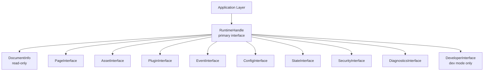

# Phase 2 — Module 14: Runtime Interfaces
# LDFX Runtime Foundation Specification

**Specification Version:** 2.0.0
**Status:** Canonical — Approved
**Phase:** 2 — Runtime Foundation
**Section:** 14 of 17
**Depends On:** Module 01–13

---

## 14. Runtime Interfaces

---

### 14.1 Overview

This module defines every public interface exposed by the LDFX Runtime.
No implementation is specified here — only the interface contract.
All interfaces are defined as Rust traits. Every interface is versioned.
Breaking changes require a MAJOR version bump.

---

### 14.2 Interface Dependency Graph



---

### 14.3 RuntimeHandle

The primary interface. The single entry point for all runtime operations.
Returned by `open_document()` on successful boot.

| Method | Input | Output | Ownership | Description |
|---|---|---|---|---|
| `document_info()` | `()` | `&DocumentInfo` | Borrowed | Get document information |
| `pages()` | `()` | `&dyn PageInterface` | Borrowed | Access page operations |
| `assets()` | `()` | `&dyn AssetInterface` | Borrowed | Access asset operations |
| `plugins()` | `()` | `&dyn PluginInterface` | Borrowed | Access plugin operations |
| `events()` | `()` | `&dyn EventInterface` | Borrowed | Access event system |
| `config()` | `()` | `&dyn ConfigInterface` | Borrowed | Access configuration |
| `state()` | `()` | `&dyn StateInterface` | Borrowed | Access session state |
| `security()` | `()` | `&dyn SecurityInterface` | Borrowed | Access security info |
| `diagnostics()` | `()` | `&dyn DiagnosticsInterface` | Borrowed | Access diagnostics |
| `developer()` | `()` | `Option<&dyn DeveloperInterface>` | Borrowed | Dev mode only |
| `lifecycle_state()` | `()` | `LifecycleState` | Copied | Current lifecycle state |
| `pause()` | `()` | `Result<(), RuntimeError>` | `()` | Pause the runtime |
| `resume()` | `()` | `Result<(), RuntimeError>` | `()` | Resume the runtime |
| `restart()` | `RestartOptions` | `Result<(), RuntimeError>` | `()` | Restart the runtime |
| `close()` | `()` | `Result<(), RuntimeError>` | Consumes | Close and destroy |

**Dependencies:** All sub-interfaces
**Ownership:** Returned to Application Layer. Dropping closes the document.

---

### 14.4 DocumentInfo

Read-only view of document identity and structure. Immutable after boot.

| Field | Type | Description |
|---|---|---|
| `document_id` | `&str` | UUID v4 |
| `title` | `&str` | Document title |
| `subtitle` | `Option<&str>` | Document subtitle |
| `spec_version` | `&str` | LDFX spec version |
| `runtime_version` | `&str` | Current runtime version |
| `document_type` | `&str` | document / template / etc. |
| `language` | `&str` | BCP47 language tag |
| `direction` | `Direction` | ltr / rtl |
| `page_count` | `u32` | Total page count |
| `entry_page` | `&str` | Entry page path |
| `created_at` | `&str` | ISO8601 timestamp |
| `modified_at` | `&str` | ISO8601 timestamp |
| `feature_flags` | `u16` | Raw feature flags |
| `boot_mode` | `BootMode` | cold / warm / recovery / safe |
| `session_id` | `&str` | UUID v4 |

---

### 14.5 PageInterface

| Method | Input | Output | Description |
|---|---|---|---|
| `index()` | `()` | `&PageIndex` | Full page index |
| `load(page_id)` | `&str` | `Future<Result<PageContent, ResourceError>>` | Load page content |
| `layout(page_id)` | `&str` | `Future<Result<PageLayout, ResourceError>>` | Load page layout |
| `prefetch(page_id)` | `&str` | `()` | Background prefetch |
| `release(page_id)` | `&str` | `()` | Release from cache |
| `is_loaded(page_id)` | `&str` | `bool` | Check if in cache |
| `current_page()` | `()` | `Option<&str>` | Currently active page ID |
| `set_current(page_id)` | `&str` | `Result<(), RuntimeError>` | Set active page |

**Dependencies:** Resource Service, Security Manager
**Ownership:** Borrowed from RuntimeHandle

---

### 14.6 AssetInterface

| Method | Input | Output | Description |
|---|---|---|---|
| `index()` | `()` | `&AssetIndex` | Full asset index |
| `load(asset_id)` | `&str` | `Future<Result<AssetData, ResourceError>>` | Load asset |
| `load_by_path(path)` | `&str` | `Future<Result<AssetData, ResourceError>>` | Load by path |
| `release(asset_id)` | `&str` | `()` | Release from cache |
| `is_loaded(asset_id)` | `&str` | `bool` | Check if in cache |
| `cache_stats()` | `()` | `CacheStats` | Cache statistics |

**Dependencies:** Resource Service, Security Manager
**Ownership:** Borrowed from RuntimeHandle

---

### 14.7 PluginInterface

| Method | Input | Output | Description |
|---|---|---|---|
| `list()` | `()` | `Vec<PluginInfo>` | All plugins |
| `status(plugin_id)` | `&str` | `PluginStatus` | Plugin health |
| `call(plugin_id, method, args)` | IDs + args | `Future<Result<Value, PluginError>>` | Call plugin method |
| `restart(plugin_id)` | `&str` | `Result<(), PluginError>` | Restart failed plugin |
| `is_available(plugin_id)` | `&str` | `bool` | Check if plugin is ready |

**Dependencies:** Plugin Service, Permission Manager
**Ownership:** Borrowed from RuntimeHandle

---

### 14.8 EventInterface

| Method | Input | Output | Description |
|---|---|---|---|
| `subscribe(event_type, handler)` | Type + handler | `SubscriptionHandle` | Register listener |
| `unsubscribe(handle)` | SubscriptionHandle | `()` | Remove listener |
| `subscribe_all(handler)` | Handler | `SubscriptionHandle` | Listen to all events |
| `recent_events()` | `()` | `Vec<RuntimeEvent>` | Last 100 events |

**Dependencies:** Event Dispatcher
**Ownership:** Borrowed from RuntimeHandle

**Handler signature:**
```
Fn(RuntimeEvent) -> EventResponse
```

**EventResponse:**
```
enum EventResponse {
    Continue,
    Cancel,  // only for cancellable events
}
```

---

### 14.9 ConfigInterface

| Method | Input | Output | Description |
|---|---|---|---|
| `get<T>(key)` | Config key | `T` | Get typed value |
| `set(key, value)` | Key + value | `Result<(), ConfigError>` | Set runtime override |
| `reset(key)` | Config key | `()` | Reset to resolved default |
| `snapshot()` | `()` | `ConfigSnapshot` | Full config snapshot |
| `apply_profile(name)` | Profile name | `Result<(), ConfigError>` | Apply profile |
| `available_profiles()` | `()` | `Vec<String>` | List profiles |

**Dependencies:** Configuration Service
**Ownership:** Borrowed from RuntimeHandle

---

### 14.10 StateInterface

| Method | Input | Output | Description |
|---|---|---|---|
| `get(key)` | `&str` | `Option<Value>` | Read session state |
| `set(key, value)` | Key + value | `Result<(), StateError>` | Write session state |
| `delete(key)` | `&str` | `()` | Delete session state |
| `scroll_position(page_id)` | `&str` | `Option<f64>` | Get scroll position |
| `set_scroll(page_id, pos)` | Page ID + f64 | `()` | Set scroll position |
| `form_state(form_id)` | `&str` | `Option<Value>` | Get form state |
| `set_form_state(form_id, state)` | ID + value | `()` | Set form state |

**Dependencies:** State Service
**Ownership:** Borrowed from RuntimeHandle

---

### 14.11 SecurityInterface

Read-only security information. No security decisions can be made
through this interface — it is informational only.

| Method | Input | Output | Description |
|---|---|---|---|
| `trust_level()` | `()` | `TrustLevel` | Document trust level |
| `is_signed()` | `()` | `bool` | Document has valid signature |
| `signer_id()` | `()` | `Option<&str>` | Signer identifier |
| `integrity_verified()` | `()` | `bool` | All hashes verified |
| `granted_permissions()` | `()` | `&PermissionSet` | All granted permissions |
| `has_permission(p)` | Permission | `bool` | Check specific permission |
| `security_events()` | `()` | `Vec<SecurityEvent>` | Security events this session |

**Dependencies:** Security Manager, Permission Manager
**Ownership:** Borrowed from RuntimeHandle

---

### 14.12 DiagnosticsInterface

| Method | Input | Output | Description |
|---|---|---|---|
| `health_report()` | `()` | `HealthReport` | System health |
| `performance_stats()` | `()` | `PerformanceStats` | All performance metrics |
| `cache_stats()` | `()` | `CacheStats` | Cache statistics |
| `export_snapshot()` | `()` | `DiagnosticSnapshot` | Full diagnostic snapshot |
| `component_status(id)` | Component ID | `ComponentStatus` | Single component health |

**Dependencies:** Diagnostics Service, Performance Monitor, Health Monitor
**Ownership:** Borrowed from RuntimeHandle

---

### 14.13 DeveloperInterface

Available only when `dev_mode: true` in boot options.

| Method | Input | Output | Description |
|---|---|---|---|
| `context_snapshot()` | `()` | `ContextSnapshot` | Full Document Context |
| `hot_reload(entry)` | Entry path + bytes | `Result<(), RuntimeError>` | Reload a document entry |
| `profiler_start()` | `()` | `()` | Start performance profiler |
| `profiler_stop()` | `()` | `ProfilerReport` | Stop and get report |
| `event_log()` | `()` | `Vec<EventLogEntry>` | Full event log |
| `set_log_level(component, level)` | IDs + level | `()` | Override log level |
| `force_gc()` | `()` | `()` | Force cache eviction |
| `simulate_event(event)` | RuntimeEvent | `()` | Inject a test event |

**Dependencies:** All components (read-only access)
**Ownership:** Borrowed from RuntimeHandle. Returns None in production mode.

---

### 14.14 Platform Adapter Interface

The interface that all platform implementations must satisfy.
Not exposed to the Application Layer — internal only.

| Method | Input | Output | Description |
|---|---|---|---|
| `read_file(path)` | Path | `Result<Vec<u8>, IoError>` | Read file bytes |
| `write_file(path, bytes)` | Path + bytes | `Result<(), IoError>` | Write file bytes |
| `delete_file(path)` | Path | `Result<(), IoError>` | Delete file |
| `temp_dir()` | `()` | `Path` | Platform temp directory |
| `user_data_dir()` | `()` | `Path` | User data directory |
| `now_utc()` | `()` | `DateTime` | Current UTC time |
| `monotonic_now()` | `()` | `Duration` | Monotonic clock |
| `spawn_thread(f)` | Closure | `ThreadHandle` | Spawn OS thread |
| `logical_cpu_count()` | `()` | `u8` | Logical CPU count |
| `available_memory()` | `()` | `u64` | Available system memory |
| `platform_name()` | `()` | `&str` | windows/linux/macos/wasm |

**Dependencies:** Operating System
**Ownership:** Owned by Runtime Kernel

---

### 14.15 open_document — Top-Level Entry Point

The single function that creates a runtime and begins the boot sequence.

| Parameter | Type | Required | Description |
|---|---|---|---|
| `bytes` | `Vec<u8>` | Yes | Raw `.ldfx` file bytes |
| `options` | `RuntimeOptions` | No | Boot options and overrides |

**Returns:** `Result<RuntimeHandle, RuntimeError>`

**RuntimeOptions fields:**

| Field | Type | Default | Description |
|---|---|---|---|
| `boot_mode` | `BootMode` | `Cold` | Boot mode |
| `dev_flags` | `DevFlags` | disabled | Developer mode flags |
| `session_overrides` | `SessionOverrides` | empty | Config overrides |
| `event_handler` | `Option<EventHandler>` | None | Pre-boot event handler |
| `timeout_overrides` | `HashMap<u8, Duration>` | empty | Per-phase timeout overrides |

---

**Next:** Module 15 — Runtime Folder Ownership
