# Phase 2 — Module 15: Runtime Folder Ownership
# LDFX Runtime Foundation Specification

**Specification Version:** 2.0.0
**Status:** Canonical — Approved
**Phase:** 2 — Runtime Foundation
**Section:** 15 of 17
**Depends On:** Module 01–14

---

## 15. Runtime Folder Ownership

---

### 15.1 Overview

This module maps every runtime component to its source folder within the
`ldfx-runtime` crate. Every folder has a single owner. No folder is shared
between components. Cross-component calls go through public interfaces only.

---

### 15.2 Runtime Folder Architecture Diagram

```mermaid
graph TD
    ROOT[ldfx-runtime/]

    ROOT --> SRC[src/]
    ROOT --> TESTS[tests/]
    ROOT --> BENCHES[benches/]
    ROOT --> CARGO[Cargo.toml]

    SRC --> API[api/\nRuntime API Layer]
    SRC --> CORE[core/\nRuntime Kernel + Boot + Lifecycle]
    SRC --> RESOURCES[resources/\nResource Manager + Cache]
    SRC --> VFS[vfs/\nVirtual File System]
    SRC --> SECURITY[security/\nSecurity Manager + Permissions]
    SRC --> PLATFORM[platform/\nPlatform Adapter]
    SRC --> EVENTS[events/\nEvent Dispatcher]
    SRC --> CONFIG[config/\nConfiguration Manager]
    SRC --> STATE[state/\nState Manager]
    SRC --> SERVICES[services/\nAll Runtime Services]
    SRC --> PLUGINS[plugins/\nPlugin Runtime]
    SRC --> STORAGE[storage/\nStorage Service]
    SRC --> LOGGING[logging/\nLogging System]
    SRC --> DIAGNOSTICS[diagnostics/\nDiagnostics + Health Monitor]
    SRC --> TYPES[types/\nShared public types]
    SRC --> ERROR[error.rs\nRuntimeError enum]
    SRC --> LIB[lib.rs\nCrate root]
```



---

### 15.3 Folder Definitions

#### `src/lib.rs`
**Owner:** Crate root
**Contents:** Re-exports all public types and the `open_document` function.
**Rules:** No logic here — only re-exports and the top-level entry point.

---

#### `src/error.rs`
**Owner:** Crate-wide
**Contents:** `RuntimeError` public enum. All error variants that can be
returned to the Application Layer.
**Rules:** No internal error types here — only the public-facing enum.

---

#### `src/types/`
**Owner:** Crate-wide shared types
**Contents:** All public types shared between multiple modules.

| File | Contents |
|---|---|
| `mod.rs` | Re-exports |
| `lifecycle.rs` | `LifecycleState`, `BootMode`, `TransitionTrigger` |
| `document.rs` | `DocumentInfo`, `FeatureFlags`, `TrustLevel` |
| `permissions.rs` | `Permission`, `PermissionSet`, `PermissionResult` |
| `events.rs` | `RuntimeEvent`, `EventPayload`, `EventPriority` |
| `config.rs` | `ResolvedConfig`, `ConfigSnapshot`, `ConfigSource` |
| `resources.rs` | `AssetData`, `CacheStats`, `ResourceError` |
| `diagnostics.rs` | `HealthReport`, `PerformanceStats`, `ComponentStatus` |

**Rules:** No logic here — only type definitions and trait implementations.

---

#### `src/api/`
**Owner:** Runtime API Layer
**Contents:** The public `RuntimeHandle` and all sub-interfaces.

| File | Contents |
|---|---|
| `mod.rs` | Re-exports |
| `handle.rs` | `RuntimeHandle` struct |
| `page_interface.rs` | `PageInterface` trait |
| `asset_interface.rs` | `AssetInterface` trait |
| `plugin_interface.rs` | `PluginInterface` trait |
| `event_interface.rs` | `EventInterface` trait |
| `config_interface.rs` | `ConfigInterface` trait |
| `state_interface.rs` | `StateInterface` trait |
| `security_interface.rs` | `SecurityInterface` trait |
| `diagnostics_interface.rs` | `DiagnosticsInterface` trait |
| `developer_interface.rs` | `DeveloperInterface` trait |
| `options.rs` | `RuntimeOptions`, `SessionOverrides`, `DevFlags` |

**Rules:** No business logic. Delegates all calls to `core/`.

---

#### `src/core/`
**Owner:** Runtime Kernel
**Contents:** The central coordinator and all core subsystems.

| File | Contents |
|---|---|
| `mod.rs` | Re-exports |
| `kernel.rs` | `RuntimeKernel` — owns all components |
| `boot.rs` | `BootManager` — boot sequence execution |
| `lifecycle.rs` | `LifecycleManager` — state machine |
| `scheduler.rs` | `Scheduler` — task queue and thread pool |
| `context.rs` | `DocumentContext` — the context object |

**Rules:** The Kernel owns all other components. No component outside
`core/` may hold a mutable reference to the Kernel.

---

#### `src/resources/`
**Owner:** Resource Manager
**Contents:** All resource loading, caching, and pipeline logic.

| File | Contents |
|---|---|
| `mod.rs` | Re-exports |
| `loader.rs` | `ResourceLoader` — main loading logic |
| `cache.rs` | `ResourceCache` — three-tier cache |
| `pipeline.rs` | `ResourcePipeline` — load → verify → decode |
| `prefetch.rs` | `Prefetcher` — background prefetch logic |

**Rules:** Never parses document content — returns raw bytes or typed
structs via `ldfx-core` parsers. Never calls Security directly — goes
through the pipeline which calls Security.

---

#### `src/vfs/`
**Owner:** Virtual File System
**Contents:** ZIP container abstraction.

| File | Contents |
|---|---|
| `mod.rs` | Re-exports |
| `reader.rs` | `VfsReader` — wraps `ldfx-core` LdfxZipReader |
| `path.rs` | `VfsPath` — virtual path type |
| `entry.rs` | `VfsEntry` — entry metadata |
| `cache.rs` | `EntryCache` — frequently accessed entry cache |

**Rules:** Returns raw bytes only. No parsing. No security checks.
Delegates to `ldfx-core::container::LdfxZipReader`.

---

#### `src/security/`
**Owner:** Security Manager
**Contents:** All runtime security enforcement.

| File | Contents |
|---|---|
| `mod.rs` | Re-exports |
| `manager.rs` | `SecurityManager` — central security coordinator |
| `permissions.rs` | `PermissionManager` — permission evaluation |
| `integrity.rs` | `IntegrityChecker` — hash verification at load time |
| `sandbox.rs` | `SandboxPolicy` — WASM sandbox configuration |
| `log.rs` | `SecurityLog` — security event log |

**Rules:** Uses `ldfx-core::security` for hash verification and
`ldfx-core::validation` for the boot-time validation pipeline.
Never modifies document content.

---

#### `src/platform/`
**Owner:** Platform Adapter
**Contents:** OS abstraction layer.

| File | Contents |
|---|---|
| `mod.rs` | `PlatformAdapter` trait definition |
| `windows.rs` | Windows implementation |
| `linux.rs` | Linux implementation |
| `macos.rs` | macOS implementation |
| `wasm.rs` | WASM/browser implementation |

**Rules:** The trait is defined in `mod.rs`. Each platform file implements
the trait. No platform file may be imported directly — only the trait.
Platform selection is done via Cargo feature flags.

---

#### `src/events/`
**Owner:** Event Dispatcher
**Contents:** Event system implementation.

| File | Contents |
|---|---|
| `mod.rs` | Re-exports |
| `dispatcher.rs` | `EventDispatcher` — listener registry and dispatch |
| `queue.rs` | `EventQueue` — async event queue |
| `subscription.rs` | `SubscriptionHandle` — listener handle |
| `filter.rs` | `EventFilter` — security filtering for plugin events |

**Rules:** The Dispatcher never calls into components directly.
Components subscribe to events and receive them via callbacks.

---

#### `src/config/`
**Owner:** Configuration Manager
**Contents:** Configuration hierarchy resolution.

| File | Contents |
|---|---|
| `mod.rs` | Re-exports |
| `manager.rs` | `ConfigManager` — resolution and override logic |
| `sources.rs` | `ConfigSource` — all source loaders |
| `resolver.rs` | `ConfigResolver` — merge and precedence logic |
| `validator.rs` | `ConfigValidator` — value validation |
| `profiles.rs` | `ProfileManager` — named profile management |

---

#### `src/state/`
**Owner:** State Manager
**Contents:** Session and persistent state management.

| File | Contents |
|---|---|
| `mod.rs` | Re-exports |
| `manager.rs` | `StateManager` — state operations |
| `session.rs` | `SessionStore` — in-memory session state |
| `warm.rs` | `WarmStore` — warm boot persistence |
| `snapshot.rs` | `StateSnapshot` — snapshot creation and restore |

---

#### `src/services/`
**Owner:** All runtime services
**Contents:** Service implementations.

| File | Contents |
|---|---|
| `mod.rs` | Re-exports |
| `theme.rs` | `ThemeService` |
| `language.rs` | `LanguageService` |
| `analytics.rs` | `AnalyticsService` |
| `health.rs` | `HealthMonitor` |
| `ai.rs` | `AiService` interface stub |

---

#### `src/plugins/`
**Owner:** Plugin Runtime
**Contents:** WASM plugin execution environment.

| File | Contents |
|---|---|
| `mod.rs` | Re-exports |
| `runtime.rs` | `PluginRuntime` — WASM instantiation and execution |
| `sandbox.rs` | `PluginSandbox` — per-plugin WASM instance |
| `api.rs` | `PluginApi` — host functions exposed to plugins |
| `loader.rs` | `ExtensionLoader` — plugin discovery and loading |
| `registry.rs` | `PluginRegistry` — active plugin tracking |

---

#### `src/storage/`
**Owner:** Storage Service
**Contents:** Persistent and session storage.

| File | Contents |
|---|---|
| `mod.rs` | Re-exports |
| `service.rs` | `StorageService` — main storage interface |
| `session.rs` | `SessionStorage` — in-memory |
| `warm.rs` | `WarmStorage` — temp directory |
| `persistent.rs` | `PersistentStorage` — user data directory |

---

#### `src/logging/`
**Owner:** Logging System
**Contents:** Structured logging infrastructure.

| File | Contents |
|---|---|
| `mod.rs` | Re-exports |
| `logger.rs` | `Logger` — main logging interface |
| `sinks.rs` | `LogSink` trait + implementations |
| `ring_buffer.rs` | `LogRingBuffer` — in-memory ring buffer |
| `filter.rs` | `LogFilter` — level and component filtering |

---

#### `src/diagnostics/`
**Owner:** Diagnostics Service
**Contents:** Health monitoring and diagnostic reporting.

| File | Contents |
|---|---|
| `mod.rs` | Re-exports |
| `service.rs` | `DiagnosticsService` — main diagnostics interface |
| `health.rs` | `HealthMonitor` — component heartbeat tracking |
| `crash.rs` | `CrashReporter` — crash report generation |
| `inspector.rs` | `RuntimeInspector` — developer mode inspector |
| `snapshot.rs` | `SnapshotExporter` — diagnostic snapshot export |
| `performance.rs` | `PerformanceMonitor` — metrics collection |

---

### 15.4 Cargo.toml Dependencies

```toml
[package]
name = "ldfx-runtime"
version = "2.0.0"
edition = "2021"

[dependencies]
ldfx-core = { path = "../ldfx-core", version = "1.0.0" }
serde = { version = "1", features = ["derive"] }
serde_json = "1"
tokio = { version = "1", features = ["full"] }
uuid = { version = "1", features = ["v4"] }
chrono = { version = "0.4", features = ["serde"] }
thiserror = "1"
wasmtime = "15"
tracing = "0.1"
parking_lot = "0.12"

[features]
default = ["platform-native"]
platform-native = []
platform-wasm = []
developer = []
```

---

### 15.5 Folder Ownership Summary

| Folder | Owner Component | Layer | Depends On |
|---|---|---|---|
| `src/api/` | Runtime API Layer | Layer 2 | `core/`, `types/` |
| `src/core/` | Runtime Kernel | Layer 3 | All layers below |
| `src/resources/` | Resource Manager | Layer 4 | `vfs/`, `security/` |
| `src/vfs/` | Virtual File System | Layer 5 | `platform/`, `ldfx-core` |
| `src/security/` | Security Manager | Layer 6 | `ldfx-core`, `logging/` |
| `src/platform/` | Platform Adapter | Layer 7 | OS only |
| `src/events/` | Event Dispatcher | Layer 3 | `types/` |
| `src/config/` | Configuration Manager | Layer 3 | `storage/`, `logging/` |
| `src/state/` | State Manager | Layer 3 | `storage/` |
| `src/services/` | Runtime Services | Layer 3 | Various |
| `src/plugins/` | Plugin Runtime | Layer 3 | `security/`, `events/` |
| `src/storage/` | Storage Service | Layer 3 | `platform/` |
| `src/logging/` | Logging System | Layer 3 | `platform/` |
| `src/diagnostics/` | Diagnostics Service | Layer 3 | `logging/`, `core/` |
| `src/types/` | Shared types | All layers | None |
| `src/error.rs` | Public error type | Layer 2 | None |

---

**Next:** Module 16 — Risks
