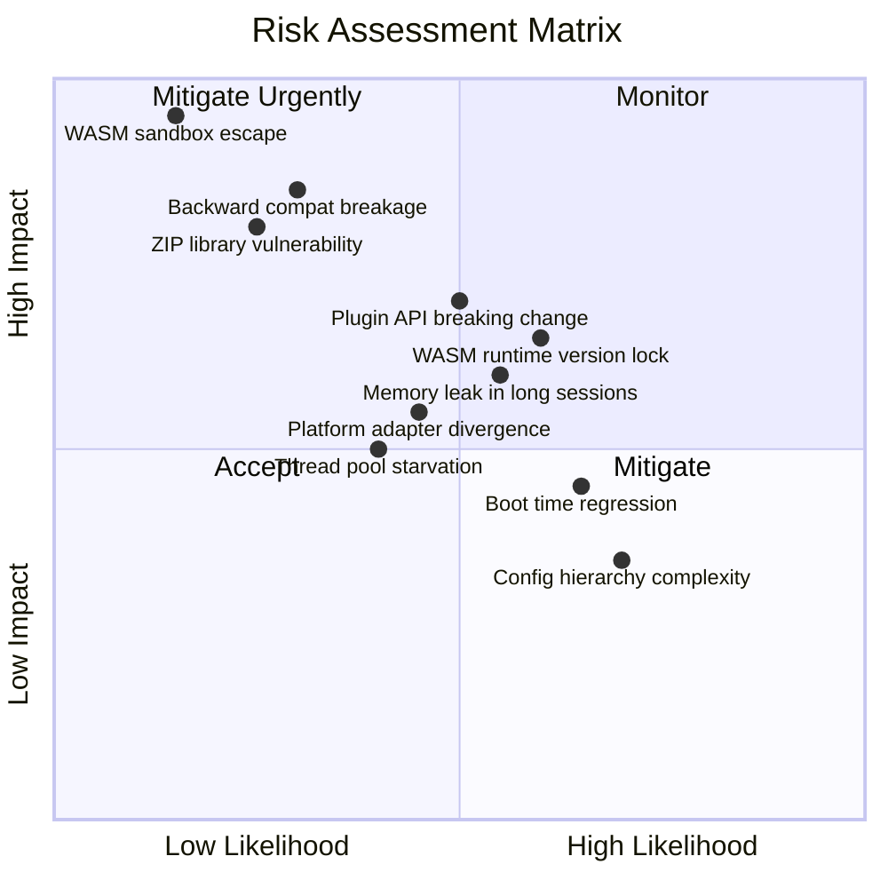

# Phase 2 — Module 16: Risks
# LDFX Runtime Foundation Specification

**Specification Version:** 2.0.0
**Status:** Canonical — Approved
**Phase:** 2 — Runtime Foundation
**Section:** 16 of 17
**Depends On:** Module 01–15

---

## 16. Risks

---

### 16.1 Risk Assessment Matrix

---

### 16.2 Architectural Risks

#### RISK-A-01 — Layered Architecture Rigidity

| Field | Detail |
|---|---|
| Description | The strict layered architecture (no layer skipping) may introduce latency in hot paths that require data from multiple layers |
| Impact | Performance degradation in high-frequency operations (e.g., per-frame asset access) |
| Likelihood | Medium |
| Mitigation | Introduce a read-only fast path for hot cache access that bypasses intermediate layers. Document the fast path as an explicit exception to the layer rule. |

---

#### RISK-A-02 — Plugin API Stability

| Field | Detail |
|---|---|
| Description | The Plugin API is a public contract. Any breaking change requires a MAJOR version bump and breaks all existing plugins |
| Impact | High — breaks the plugin ecosystem |
| Likelihood | Medium — APIs are hard to get right on the first attempt |
| Mitigation | Design the Plugin API conservatively. Start with a minimal surface. Use versioned API namespaces (`api/v1/`, `api/v2/`). Maintain old API versions for at least two major runtime versions. |

---

#### RISK-A-03 — Document Context Lock Contention

| Field | Detail |
|---|---|
| Description | The `DocumentContext` uses `Arc<RwLock<...>>` for mutable fields. Under high concurrency (many plugins + active rendering), lock contention may cause latency spikes |
| Impact | Medium — UI jank, slow plugin responses |
| Likelihood | Medium |
| Mitigation | Use fine-grained per-field-group locks. Profile lock contention in benchmarks. Consider lock-free data structures for the highest-contention fields (scroll positions, asset cache). |

---

#### RISK-A-04 — Event Queue Overflow

| Field | Detail |
|---|---|
| Description | Under extreme load (many plugins emitting events simultaneously), the event queue may overflow, causing event loss |
| Impact | Medium — missed events, inconsistent state |
| Likelihood | Low |
| Mitigation | Implement per-emitter rate limiting. Drop Deferred and Low priority events first. Emit `EventQueueDeep` warning before overflow. Never drop Critical or High priority events. |

---

### 16.3 Security Risks

#### RISK-S-01 — WASM Sandbox Escape

| Field | Detail |
|---|---|
| Description | A vulnerability in the WASM runtime (wasmtime) could allow a malicious plugin to escape its sandbox and access host memory |
| Impact | Critical — full host compromise |
| Likelihood | Low (wasmtime has a strong security track record) |
| Mitigation | Pin wasmtime to audited versions. Monitor wasmtime CVEs. Run plugins in a separate OS process (future hardening). Apply OS-level sandboxing (seccomp on Linux, AppContainer on Windows) around the plugin process. |

---

#### RISK-S-02 — ZIP Library Vulnerability

| Field | Detail |
|---|---|
| Description | A vulnerability in the `zip` crate could allow a malicious `.ldfx` file to exploit the ZIP parser before validation completes |
| Impact | High — pre-validation code execution |
| Likelihood | Low-Medium |
| Mitigation | Pin the `zip` crate to audited versions. Monitor crate CVEs. Apply size limits before decompression (zip bomb protection). Consider switching to a more security-focused ZIP library. |

---

#### RISK-S-03 — Permission Escalation via Manifest Tampering

| Field | Detail |
|---|---|
| Description | If an attacker can modify the manifest after the hash file is generated, they could escalate permissions |
| Impact | High — unauthorized permission grants |
| Likelihood | Low (hash verification catches this) |
| Mitigation | Hash verification at boot (Phase 6) and at load time catches any manifest tampering. The manifest hash is verified before the manifest is parsed. This risk is fully mitigated by the existing design. |

---

#### RISK-S-04 — Side-Channel Attacks via Timing

| Field | Detail |
|---|---|
| Description | Timing differences in hash comparison could leak information about the expected hash value |
| Impact | Low — hash oracle attack |
| Likelihood | Low |
| Mitigation | Use constant-time comparison for all hash and signature verification operations. |

---

### 16.4 Performance Risks

#### RISK-P-01 — Boot Time Regression

| Field | Detail |
|---|---|
| Description | As the runtime grows in complexity, boot time may regress beyond the defined targets |
| Impact | Medium — poor user experience |
| Likelihood | High — complexity tends to grow |
| Mitigation | Enforce boot time targets in CI benchmarks. Any PR that regresses boot time by > 10% is blocked. Maintain a boot time budget per phase. |

---

#### RISK-P-02 — Memory Leak in Long Sessions

| Field | Detail |
|---|---|
| Description | Long-running sessions (hours) may accumulate memory through subtle leaks in the cache, event system, or plugin runtime |
| Impact | Medium — eventual OOM, document close |
| Likelihood | Medium |
| Mitigation | Run memory leak tests with long-session simulations. Use Rust's ownership system to prevent most leaks. Implement periodic cache audits. Monitor RSS growth rate — alert if > 1MB/hour. |

---

#### RISK-P-03 — Thread Pool Starvation

| Field | Detail |
|---|---|
| Description | A misbehaving plugin or a burst of high-priority tasks could starve the thread pool, blocking resource loading |
| Impact | Medium — UI freeze, slow page loads |
| Likelihood | Medium |
| Mitigation | Enforce per-plugin CPU time limits. Reserve at least 2 threads for Critical and High priority tasks. Implement backpressure on the task queue. |

---

### 16.5 Compatibility Risks

#### RISK-C-01 — Backward Compatibility Breakage

| Field | Detail |
|---|---|
| Description | A runtime change could break documents created for an earlier runtime version |
| Impact | High — existing documents stop working |
| Likelihood | Low-Medium |
| Mitigation | Maintain a compatibility test suite with documents from every released runtime version. Any PR that fails a compatibility test is blocked. Follow the deprecation process strictly. |

---

#### RISK-C-02 — WASM Runtime Version Lock

| Field | Detail |
|---|---|
| Description | Pinning to a specific wasmtime version creates a dependency that may become outdated or unsupported |
| Impact | Medium — security vulnerabilities in old wasmtime |
| Likelihood | High — wasmtime releases frequently |
| Mitigation | Establish a wasmtime upgrade policy (upgrade within 90 days of a new release). Maintain a compatibility test suite for plugin WASM binaries across wasmtime versions. |

---

#### RISK-C-03 — Platform Adapter Divergence

| Field | Detail |
|---|---|
| Description | Platform-specific implementations of the Platform Adapter may diverge in behavior, causing platform-specific bugs |
| Impact | Medium — inconsistent behavior across platforms |
| Likelihood | Medium |
| Mitigation | Maintain a comprehensive Platform Adapter conformance test suite. Run all tests on all platforms in CI. Document all platform-specific behaviors explicitly. |

---

### 16.6 Future Scalability Risks

#### RISK-F-01 — Configuration Hierarchy Complexity

| Field | Detail |
|---|---|
| Description | As more configuration sources and keys are added, the resolution logic may become difficult to reason about and debug |
| Impact | Low-Medium — configuration bugs are hard to diagnose |
| Likelihood | High — configuration tends to grow |
| Mitigation | Maintain a configuration audit tool that shows the resolved value and its source for every key. Write comprehensive tests for every precedence combination. |

---

#### RISK-F-02 — Event System Scalability

| Field | Detail |
|---|---|
| Description | As the number of event types and listeners grows, the Event Dispatcher may become a bottleneck |
| Impact | Medium — increased event dispatch latency |
| Likelihood | Medium |
| Mitigation | Benchmark event dispatch with 100+ listeners. Use a hash map for O(1) listener lookup by event type. Consider sharding the event queue by priority level. |

---

#### RISK-F-03 — AI Runtime Interface Coupling

| Field | Detail |
|---|---|
| Description | The AI Runtime Interface is defined now but implemented later. If the AI Engine's requirements differ significantly from the interface, a breaking change may be needed |
| Impact | Medium — interface redesign |
| Likelihood | Medium |
| Mitigation | Keep the AI Runtime Interface minimal. Design it around the content model (AI block node types) rather than specific AI capabilities. Use a capability discovery pattern so the AI Engine can declare what it supports. |

---

### 16.7 Risk Summary

| Risk ID | Category | Impact | Likelihood | Priority |
|---|---|---|---|---|
| RISK-S-01 | Security | Critical | Low | P1 — Monitor |
| RISK-C-01 | Compatibility | High | Low-Medium | P1 — Mitigate |
| RISK-S-02 | Security | High | Low-Medium | P1 — Mitigate |
| RISK-A-02 | Architecture | High | Medium | P2 — Mitigate |
| RISK-P-01 | Performance | Medium | High | P2 — Mitigate |
| RISK-C-02 | Compatibility | Medium | High | P2 — Mitigate |
| RISK-F-01 | Scalability | Medium | High | P2 — Mitigate |
| RISK-P-02 | Performance | Medium | Medium | P2 — Monitor |
| RISK-A-03 | Architecture | Medium | Medium | P3 — Monitor |
| RISK-P-03 | Performance | Medium | Medium | P3 — Monitor |
| RISK-C-03 | Compatibility | Medium | Medium | P3 — Monitor |
| RISK-A-01 | Architecture | Medium | Medium | P3 — Monitor |
| RISK-F-02 | Scalability | Medium | Medium | P3 — Monitor |
| RISK-A-04 | Architecture | Medium | Low | P4 — Accept |
| RISK-S-03 | Security | High | Low | P4 — Accept (mitigated) |
| RISK-S-04 | Security | Low | Low | P4 — Accept |
| RISK-F-03 | Scalability | Medium | Medium | P3 — Monitor |

---

**Next:** Module 17 — Acceptance Criteria
