# Phase 2 — Module 01: Runtime Philosophy
# LDFX Runtime Foundation Specification

**Specification Version:** 2.0.0
**Status:** Canonical — Approved
**Phase:** 2 — Runtime Foundation
**Section:** 1 of 17
**Depends On:** Phase 1 (Modules 01–12)

---

## 1. Runtime Philosophy

---

### 1.1 Why LDFX Needs a Runtime

A static file format defines structure.
A runtime defines behavior.

Phase 1 established the LDFX file format — the rules for how bytes are arranged,
how metadata is stored, how assets are named, and how integrity is verified.
That is necessary but not sufficient.

A `.ldfx` document is not a passive container of data. It is a **living document** —
it can execute scripts, render dynamic content, load AI models, synchronize with
the cloud, host plugins, respond to user interaction, and adapt to the reader's
context. None of that is possible without a runtime.

The LDFX Runtime is the execution environment that:

- Opens and validates a `.ldfx` file using the Phase 1 specification
- Parses and interprets the document's content model
- Manages all resources the document requires during its lifetime
- Enforces the security and permission model
- Provides a stable API surface for renderers, editors, plugins, and AI engines
- Handles the full lifecycle from cold boot to graceful shutdown

Without the runtime, a `.ldfx` file is a validated archive.
With the runtime, it becomes a living, interactive, intelligent document.

---

### 1.2 Runtime Goals

The LDFX Runtime is designed to achieve the following primary goals:

| # | Goal | Description |
|---|---|---|
| G-01 | Correctness | Every document that passes Phase 1 validation must open and run correctly |
| G-02 | Security | No document may exceed its declared permissions or escape its sandbox |
| G-03 | Performance | Cold boot to ready state in under 500ms for standard documents |
| G-04 | Portability | Identical behavior on Windows, Linux, macOS, and WASM targets |
| G-05 | Reliability | Runtime must never crash due to a malformed or malicious document |
| G-06 | Extensibility | New capabilities must be addable without breaking existing documents |
| G-07 | Observability | Every runtime operation must be traceable in developer and diagnostic mode |
| G-08 | Determinism | Given the same document and inputs, the runtime must produce the same outputs |
| G-09 | Offline-first | All core runtime operations must function without network access |
| G-10 | Backward Compatibility | Runtime v2.x must open all documents created for runtime v1.x |

---

### 1.3 Runtime Principles

The following principles govern every architectural decision in the LDFX Runtime.
They are ordered by priority. When two principles conflict, the higher-ranked
principle takes precedence.

#### Principle 1 — Security First

Security is not a feature. It is a constraint that applies to every component,
every interface, and every decision. No performance optimization, convenience
feature, or extensibility mechanism may weaken the security model.

Every document is treated as untrusted input until it passes the full validation
pipeline. Every plugin is treated as untrusted code until it is granted explicit
permissions. Every network request is denied unless explicitly permitted.

#### Principle 2 — Offline First

The runtime must be fully functional without any network connection. Network
access is an optional capability, not a requirement. Documents that declare
`requires_network: false` must open, render, and execute completely offline.

This principle exists because:
- Documents must be readable in air-gapped environments
- Network failures must not cause document failures
- Privacy requires that no data leaves the device without explicit user consent

#### Principle 3 — Deterministic Execution

Given the same document bytes, the same runtime version, and the same inputs,
the runtime must produce identical outputs on every platform. This enables:
- Reproducible testing
- Verifiable document rendering
- Reliable hash-based integrity checking
- Predictable plugin behavior

Non-determinism is only permitted in explicitly declared areas: timestamps,
random number generation for UI effects, and network-sourced data.

#### Principle 4 — Modular Architecture

Every runtime component is independently replaceable. No component may have
a hard dependency on the internal implementation of another component. All
inter-component communication happens through defined interfaces.

This enables:
- Independent testing of each component
- Platform-specific implementations of low-level components
- Future replacement of components without breaking the system

#### Principle 5 — Fail Safe

When the runtime encounters an error it cannot recover from, it must fail in a
controlled, predictable, and safe manner. It must never:
- Expose raw memory contents
- Execute untrusted code outside the sandbox
- Leave resources in an inconsistent state
- Silently ignore security violations

Every failure mode is defined. Every error has a recovery path or a clean
shutdown path.

#### Principle 6 — Portability

The runtime core must be written in platform-agnostic Rust. Platform-specific
behavior is isolated to the Platform Adapter layer. The same runtime binary
must run on Windows 10+, Linux (kernel 5.4+), macOS 12+, and WASM targets
without behavioral differences.

#### Principle 7 — Minimal Surface Area

The runtime exposes the minimum API surface necessary to support its consumers
(renderer, editor, plugins, AI engine). Every public interface is a commitment.
Interfaces are added deliberately and removed only through a formal deprecation
process.

#### Principle 8 — Explicit Over Implicit

No runtime behavior is implicit. Every capability a document uses must be
declared in its manifest. Every permission a plugin requires must be declared
and granted. Every resource a document loads must be tracked. Nothing happens
silently.

---

### 1.4 Offline-First Philosophy

The offline-first philosophy is a foundational constraint, not an afterthought.

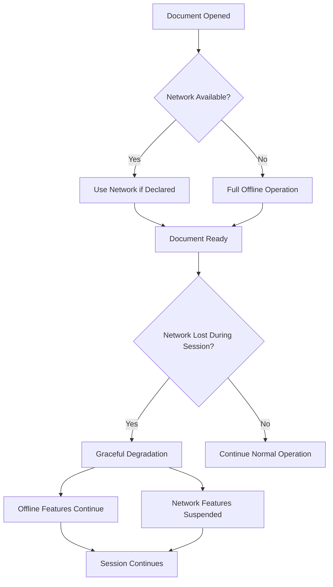

**Rules:**

1. The runtime boots entirely from the `.ldfx` file. No external resource is
   required to reach Ready state unless `requires_network: true` is declared.

2. If `requires_network: false` (the default), the runtime must never make
   any outbound network call during normal operation.

3. If network connectivity is lost during a session, the runtime must continue
   operating with all offline-capable features. Network-dependent features are
   suspended, not crashed.

4. All caching strategies are designed to maximize offline availability.
   Resources fetched during an online session are cached for offline use
   according to the document's declared cache policy.

5. Sync operations (cloud sync, collaboration) are always asynchronous and
   non-blocking. Their failure never blocks document operation.

---

### 1.5 Security-First Philosophy

The security model is built on the principle of **zero implicit trust**.

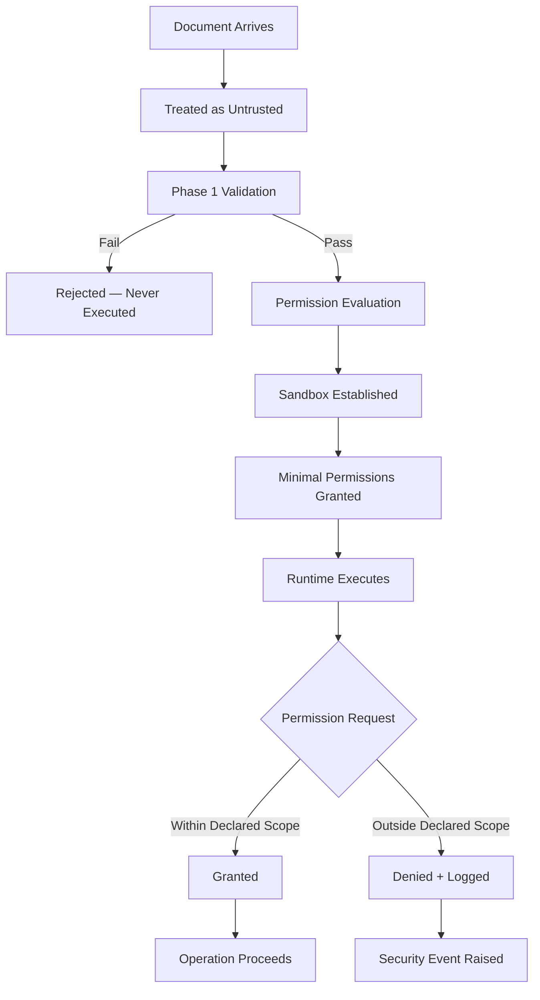

**Rules:**

1. Every document is untrusted until it passes the full 14-stage validation pipeline.
2. A document that fails any fatal validation stage is never executed.
3. Permissions are evaluated at boot time. A document cannot acquire permissions
   it did not declare in its manifest.
4. All plugin and script execution happens inside a WASM sandbox with no direct
   access to the host system.
5. Every security event is logged. Security logs cannot be disabled by the document.
6. The runtime's own memory is isolated from plugin memory.
7. Resource limits (CPU, memory, network bandwidth) are enforced per plugin and
   per document.

---

### 1.6 Modular Architecture Philosophy

The runtime is composed of independently deployable modules. Each module owns
a single responsibility and communicates with other modules only through
defined interfaces.

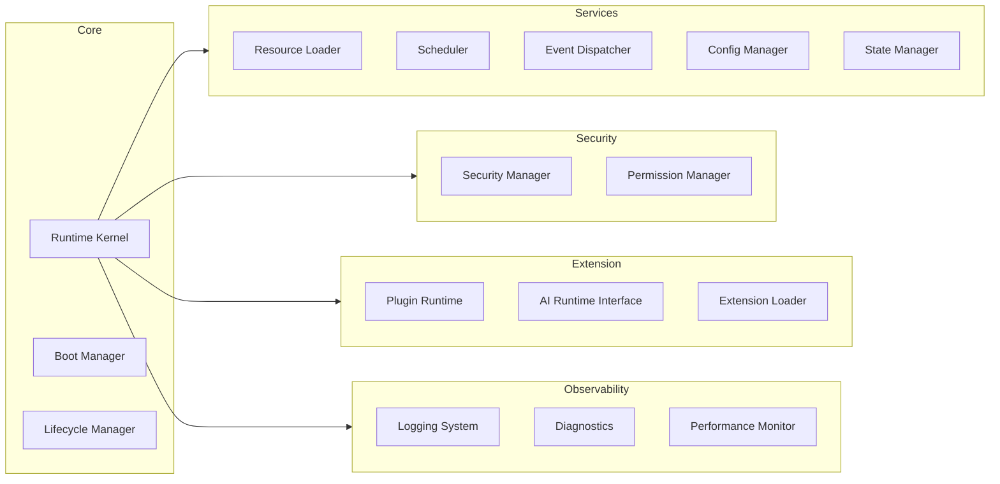

No module may import from another module's internal implementation.
All cross-module calls go through the module's public interface.

---

### 1.7 Deterministic Execution

Determinism is a first-class requirement. The runtime guarantees:

| Operation | Deterministic? | Notes |
|---|---|---|
| Document parsing | ✅ Yes | Same bytes → same parse result |
| Validation pipeline | ✅ Yes | Same document → same validation result |
| Asset loading from file | ✅ Yes | Content-addressed, hash-verified |
| Page layout calculation | ✅ Yes | Same layout spec → same layout |
| Plugin execution | ✅ Yes | WASM is deterministic by design |
| Timestamp generation | ❌ No | Wall clock — explicitly non-deterministic |
| Random number generation | ❌ No | Explicitly non-deterministic, seeded separately |
| Network responses | ❌ No | External — explicitly non-deterministic |
| User input | ❌ No | External — explicitly non-deterministic |

Non-deterministic operations are isolated, declared, and never allowed to
affect the document's structural integrity or security state.

---

### 1.8 Portability

The runtime targets four execution environments:

| Platform | Target | Notes |
|---|---|---|
| Windows 10+ | `x86_64-pc-windows-msvc` | Primary desktop target |
| Linux (kernel 5.4+) | `x86_64-unknown-linux-gnu` | Primary server/desktop target |
| macOS 12+ | `aarch64-apple-darwin`, `x86_64-apple-darwin` | Universal binary |
| Web (WASM) | `wasm32-unknown-unknown` | Browser and edge runtime |

**Portability rules:**

1. The runtime core contains zero platform-specific code.
2. All platform-specific behavior is isolated in the Platform Adapter layer.
3. The Platform Adapter exposes a single interface. The runtime core calls
   only that interface — never the OS directly.
4. WASM builds exclude the Platform Adapter and replace it with a
   JavaScript bridge layer.
5. All file paths within the runtime are handled as abstract paths.
   Platform-specific path separators are resolved only at the Platform Adapter.

---

### 1.9 Scalability

The runtime is designed to scale across a wide range of document complexity:

| Document Class | Pages | Assets | Plugins | AI Models | Target Boot Time |
|---|---|---|---|---|---|
| Minimal | 1–10 | 0–5 | 0 | 0 | < 100ms |
| Standard | 10–100 | 5–50 | 0–2 | 0 | < 500ms |
| Rich | 100–500 | 50–200 | 2–5 | 0–1 | < 1500ms |
| Complex | 500–2000 | 200–1000 | 5–10 | 1–3 | < 5000ms |
| Extreme | 2000+ | 1000+ | 10+ | 3+ | < 15000ms |

Scalability is achieved through:
- Lazy loading — only the entry page and its direct dependencies are loaded at boot
- Streaming — large assets are streamed, not fully buffered
- Background loading — non-critical resources load after Ready state
- Pagination — page content is loaded on demand, not all at once
- Resource pooling — shared resources (fonts, themes) are loaded once

---

### 1.10 Long-Term Compatibility

The runtime is designed to remain compatible across years of evolution.

#### 1.10.1 Backward Compatibility

A runtime at version `N.x.x` must be able to open any document created for
runtime version `1.x.x` through `N.x.x`.

Rules:
- The MAJOR version in the binary header must match the runtime MAJOR version
- MINOR version differences are handled gracefully (warn, not fail)
- Deprecated features are supported for a minimum of two major versions
- No field in any JSON schema may be removed without a deprecation cycle

#### 1.10.2 Forward Compatibility

A runtime at version `N.x.x` encountering a document created for version
`N+1.x.x` must:
- Open the document if the MAJOR version matches
- Warn about unknown fields (never fail on unknown fields)
- Apply the `unknown_feature_policy` declared in the manifest
- Disable features it does not understand rather than crashing

| Policy Value | Runtime Behavior |
|---|---|
| `warn` | Log a warning, continue with known features |
| `error` | Refuse to open the document |
| `ignore` | Silently skip unknown features |
| `safe_mode` | Open in safe mode with all unknown features disabled |

---

### 1.11 Performance Objectives

| Metric | Target | Measurement Method |
|---|---|---|
| Cold boot (minimal doc) | < 100ms | Time from file open to Ready state |
| Cold boot (standard doc) | < 500ms | Time from file open to Ready state |
| Memory baseline | < 32MB | RSS at Ready state, minimal document |
| Memory per page | < 2MB | Additional RSS per loaded page |
| Asset load (1MB image) | < 50ms | Time from request to available |
| Plugin load | < 200ms | Time from discovery to ready |
| Event dispatch latency | < 1ms | Time from emit to first listener |
| Shutdown (clean) | < 200ms | Time from close signal to process exit |
| Validation pipeline | < 50ms | Time for full 14-stage validation |

These are targets, not guarantees. Documents that exceed resource limits
receive warnings. Documents that severely exceed limits may be opened in
a degraded mode with a user notification.

---

### 1.12 Reliability Objectives

| Metric | Target |
|---|---|
| Runtime crash rate | 0 crashes due to document content |
| Security violation containment | 100% — no violation escapes the sandbox |
| Data loss on crash | 0 — all writes are atomic |
| Recovery from plugin crash | 100% — plugin crash never crashes runtime |
| Recovery from corrupted asset | 100% — corrupted asset shows error, document continues |
| Graceful degradation on missing feature | 100% — unknown features are skipped, not crashed |

---

### 1.13 Summary

The LDFX Runtime is the execution layer that transforms a validated `.ldfx`
archive into a living, interactive document. Its design is governed by eight
principles — security first, offline first, determinism, modularity, fail-safe
behavior, portability, minimal surface area, and explicit over implicit.

Every architectural decision in the sections that follow is traceable back to
one or more of these principles. When a future decision conflicts with these
principles, the principles win.

---

**Next:** Module 02 — Layered Architecture
# Phase 2 — Module 02: Runtime Layered Architecture
# LDFX Runtime Foundation Specification

**Specification Version:** 2.0.0
**Status:** Canonical — Approved
**Phase:** 2 — Runtime Foundation
**Section:** 2 of 17
**Depends On:** Module 01 — Runtime Philosophy

---

## 2. Runtime Layered Architecture

---

### 2.1 Overview

The LDFX Runtime is organized as a strict layered architecture. Each layer
communicates only with the layer directly below it. No layer may bypass an
intermediate layer to call a lower layer directly. This constraint enforces
separation of concerns, enables independent testing, and isolates
platform-specific code at the bottom of the stack.

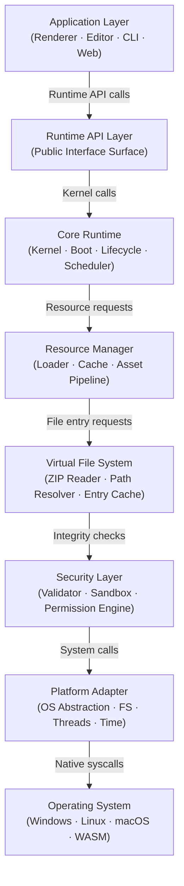

---

### 2.2 Layer Definitions

#### Layer 1 — Application Layer

**Position:** Top of stack — external consumers of the runtime.

**Description:**
The Application Layer contains all software that uses the LDFX Runtime but
is not part of it. This includes the Tauri-based Reader, the Tauri-based
Editor, the CLI tool, the web runtime, and any third-party application that
embeds the runtime.

**Responsibilities:**
- Invoke the Runtime API to open, render, and close documents
- Receive events from the Runtime API layer
- Present document content to the user
- Forward user input to the Runtime API layer
- Handle application-level UI state (window management, menus, etc.)

**Boundaries:**
- Must never call into Core Runtime, Resource Manager, or lower layers directly
- Must never read from the ZIP container directly
- Must never bypass the permission system

**Ownership:** External — not part of `ldfx-runtime` crate

---

#### Layer 2 — Runtime API Layer

**Position:** Public interface of the runtime.

**Description:**
The Runtime API Layer is the only surface the Application Layer touches.
It is a stable, versioned, documented API. All breaking changes to this
layer require a MAJOR version bump.

**Responsibilities:**
- Expose `RuntimeHandle` — the single entry point for all runtime operations
- Accept document open/close/pause/resume commands
- Emit typed events to registered application listeners
- Enforce API-level rate limiting and input validation
- Translate application requests into Core Runtime operations
- Return structured results — never raw internal types

**Boundaries:**
- Accepts only validated, typed inputs
- Returns only public-facing types — never internal structs
- All errors are translated to `RuntimeError` public enum before surfacing

**Ownership:** `ldfx-runtime/src/api/`

**Communication:**
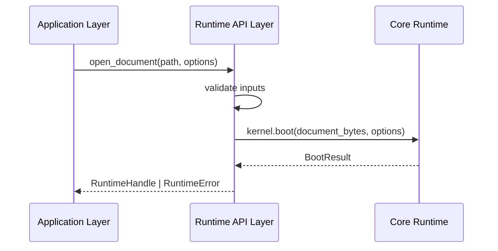

---

#### Layer 3 — Core Runtime

**Position:** Central execution engine.

**Description:**
The Core Runtime is the brain of the LDFX Runtime. It owns the Runtime
Kernel, Boot Manager, Lifecycle Manager, Scheduler, Event Dispatcher,
State Manager, and Configuration Manager. It coordinates all other layers
but never performs I/O or security checks directly — it delegates those
to the layers below.

**Responsibilities:**
- Manage the full document lifecycle (boot → ready → running → shutdown)
- Coordinate the boot sequence across all subsystems
- Own and manage the Runtime Context object
- Schedule tasks and manage concurrency
- Dispatch events to registered listeners
- Manage configuration loading and precedence resolution
- Coordinate graceful shutdown and resource cleanup

**Boundaries:**
- Does not perform file I/O directly — delegates to Resource Manager
- Does not perform security checks directly — delegates to Security Layer
- Does not call OS APIs directly — delegates to Platform Adapter

**Ownership:** `ldfx-runtime/src/core/`

---

#### Layer 4 — Resource Manager

**Position:** Asset and resource pipeline.

**Description:**
The Resource Manager handles all resource loading, caching, and lifecycle
management. It knows how to load pages, assets, plugins, scripts, and
configuration from the Virtual File System. It maintains an in-memory
cache and manages lazy loading strategies.

**Responsibilities:**
- Load document entries on demand from the Virtual File System
- Maintain a tiered cache (hot cache → warm cache → cold storage)
- Implement lazy loading — only load what is needed, when it is needed
- Track resource reference counts and release unused resources
- Enforce per-resource size limits
- Report loading progress to the Core Runtime

**Boundaries:**
- Requests entries by path from the Virtual File System only
- Does not parse document content — returns raw bytes to Core Runtime
- Does not perform security validation — that is the Security Layer's job

**Ownership:** `ldfx-runtime/src/resources/`

---

#### Layer 5 — Virtual File System

**Position:** Abstraction over the ZIP container.

**Description:**
The Virtual File System (VFS) presents the contents of the `.ldfx` ZIP
archive as a virtual directory tree. It hides the ZIP implementation
details from all layers above. It handles the 64-byte header offset,
entry enumeration, and raw byte extraction.

**Responsibilities:**
- Open the ZIP archive at byte offset 64 (per Phase 1 Module 03)
- Enumerate all entries in the archive
- Read named entries as raw bytes on demand
- Resolve virtual paths to ZIP entry names
- Detect and reject path traversal attempts
- Cache frequently accessed entries (manifest, index files)
- Support streaming reads for large entries

**Boundaries:**
- Returns raw bytes only — no parsing
- Does not perform integrity checks — that is the Security Layer's job
- Does not enforce permissions — that is the Security Layer's job

**Ownership:** `ldfx-runtime/src/vfs/`

---

#### Layer 6 — Security Layer

**Position:** Cross-cutting security enforcement.

**Description:**
The Security Layer is unique in that it is not purely sequential — it is
also a cross-cutting concern that intercepts calls between layers. Every
byte that leaves the VFS passes through the Security Layer before reaching
the Resource Manager. Every plugin call passes through the Security Layer
before reaching the Plugin Runtime.

**Responsibilities:**
- Run the Phase 1 14-stage validation pipeline at boot time
- Verify SHA-256 hashes of all loaded entries against `security/hashes.json`
- Validate digital signatures if the document is signed
- Enforce the permission model — deny any operation not in the granted set
- Maintain the WASM sandbox boundary for plugins and scripts
- Log all security events (grants, denials, violations)
- Detect and respond to integrity violations at runtime

**Boundaries:**
- Intercepts VFS reads before they reach the Resource Manager
- Intercepts plugin calls before they reach the host runtime
- Never modifies document content — read-only enforcement role
- Security logs are write-only from the document's perspective

**Ownership:** `ldfx-runtime/src/security/`

---

#### Layer 7 — Platform Adapter

**Position:** OS abstraction layer — bottom of the runtime stack.

**Description:**
The Platform Adapter isolates all platform-specific behavior. The runtime
core never calls the OS directly. Every OS interaction — file system access,
thread creation, time queries, network sockets, process management — goes
through the Platform Adapter interface.

**Responsibilities:**
- Provide a uniform file system interface across all platforms
- Provide thread and async task primitives
- Provide wall clock and monotonic clock access
- Provide network socket access (when permitted)
- Provide process and environment information
- Provide platform-specific path handling
- On WASM: bridge to JavaScript APIs for all of the above

**Boundaries:**
- Exposes a single trait-based interface — `PlatformAdapter`
- All implementations (Windows, Linux, macOS, WASM) are behind this trait
- No layer above Layer 7 may use platform-specific types directly

**Ownership:** `ldfx-runtime/src/platform/`

---

#### Layer 8 — Operating System

**Position:** Below the runtime stack — not owned by LDFX.

**Description:**
The actual operating system or host environment. On desktop platforms this
is the native OS kernel. On WASM this is the browser or edge runtime host.

**Ownership:** External — not part of `ldfx-runtime`

---

### 2.3 Layer Communication Rules

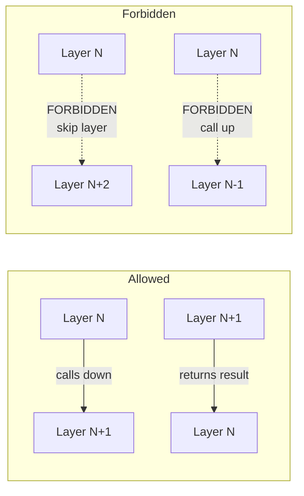

| Rule | Description |
|---|---|
| Downward only | A layer may only call the layer directly below it |
| No skip | A layer may never skip an intermediate layer |
| No upward calls | A layer may never call a layer above it directly |
| Events are upward | The event system is the only upward communication mechanism |
| Security intercepts | The Security Layer may intercept any downward call as a cross-cut |

---

### 2.4 Layer Ownership and Dependencies

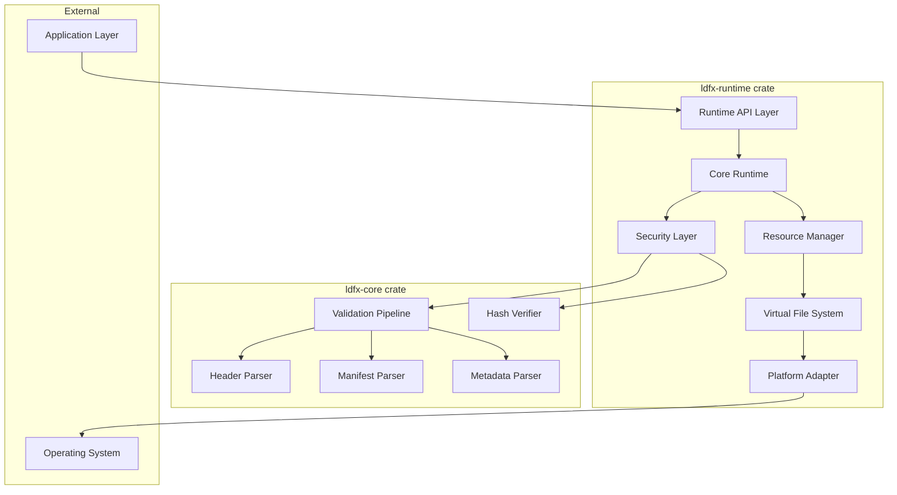

**Key dependency rule:** `ldfx-runtime` depends on `ldfx-core` as a library.
`ldfx-core` has zero knowledge of `ldfx-runtime`. This is a strict one-way
dependency.

---

### 2.5 Layer Failure Propagation

When a layer encounters an unrecoverable error, it propagates the error
upward through the stack. Each layer translates the error into its own
error type before passing it up.

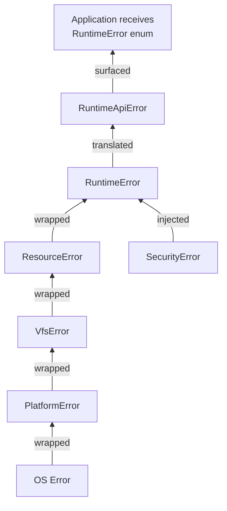

No raw internal error type is ever exposed to the Application Layer.
All errors are translated to the public `RuntimeError` enum at the API layer.

---

### 2.6 Layer Initialization Order

Layers are initialized bottom-up and shut down top-down.

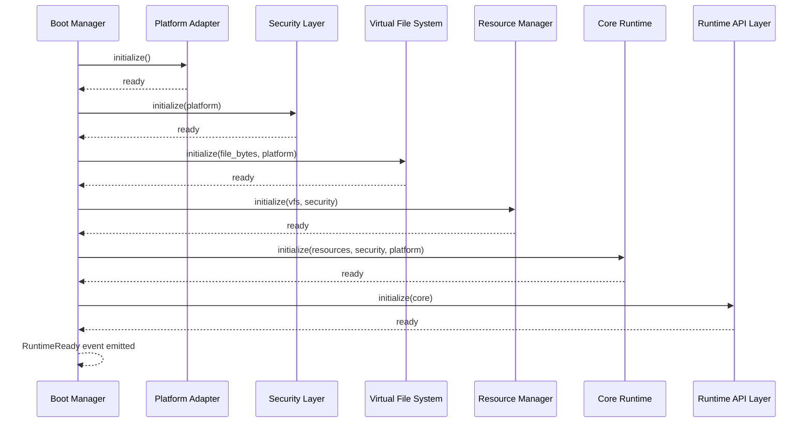

---

### 2.7 Layer Shutdown Order

Shutdown is the reverse of initialization — top-down.

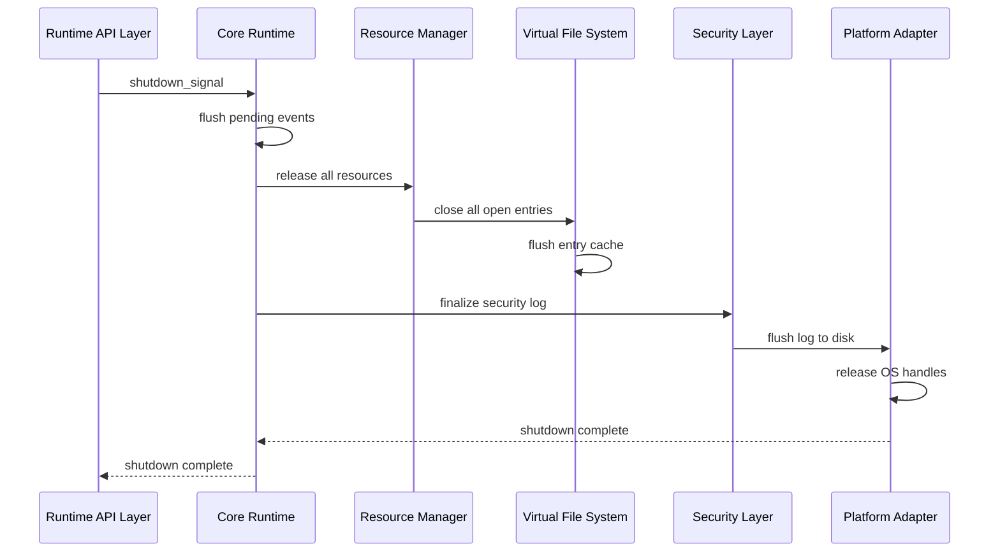

---

### 2.8 Summary

The LDFX Runtime uses an 8-layer architecture with strict downward-only
communication. The Security Layer is a cross-cutting concern that intercepts
calls at multiple points. The Platform Adapter isolates all OS-specific
behavior. The `ldfx-core` crate from Phase 1 is consumed by the Security
Layer for validation and integrity checking. No layer may bypass another.
Errors propagate upward through typed wrappers. Initialization is bottom-up;
shutdown is top-down.

---

**Next:** Module 03 — Runtime Components
# Phase 2 — Module 03: Runtime Components
# LDFX Runtime Foundation Specification

**Specification Version:** 2.0.0
**Status:** Canonical — Approved
**Phase:** 2 — Runtime Foundation
**Section:** 3 of 17
**Depends On:** Module 01, Module 02

---

## 3. Runtime Components

---

### 3.1 Component Overview

```mermaid
graph TD
    subgraph Core
        K[Runtime Kernel]
        B[Boot Manager]
        L[Lifecycle Manager]
        S[Scheduler]
        ED[Event Dispatcher]
        CM[Config Manager]
        SM[State Manager]
    end
    subgraph Document
        DC[Document Context]
        RL[Resource Loader]
        EL[Extension Loader]
    end
    subgraph Security
        SEC[Security Manager]
        PM[Permission Manager]
    end
    subgraph Extension
        PR[Plugin Runtime]
        AIR[AI Runtime Interface]
    end
    subgraph Observability
        LOG[Logging System]
        EH[Error Handler]
        PERF[Performance Monitor]
        DIAG[Diagnostics]
        DEV[Developer Runtime]
    end

    K --> B
    K --> L
    K --> S
    K --> ED
    K --> CM
    K --> SM
    K --> DC
    K --> RL
    K --> EL
    K --> SEC
    K --> PM
    K --> PR
    K --> AIR
    K --> LOG
    K --> EH
    K --> PERF
    K --> DIAG
    K --> DEV
```

---

### 3.2 Runtime Kernel

**Purpose:**
The Runtime Kernel is the central coordinator of the entire runtime. It owns
all other components and is the single point of authority for runtime state.
It does not implement any feature itself — it delegates to specialized
components and ensures they operate in the correct order and within their
defined boundaries.

**Responsibilities:**
- Own and initialize all runtime components
- Coordinate the boot sequence via the Boot Manager
- Manage the Runtime Context object lifetime
- Route requests from the Runtime API Layer to the correct component
- Enforce component initialization order
- Coordinate graceful shutdown across all components
- Maintain the master runtime state

**Inputs:**
- Document bytes (raw `.ldfx` file content)
- Runtime options (from the Application Layer)
- Platform Adapter reference

**Outputs:**
- `RuntimeHandle` — returned to the Application Layer on successful boot
- `RuntimeError` — returned on boot failure
- Runtime events — emitted to the Event Dispatcher

**Internal Workflow:**
```
1. Receive open_document(bytes, options) from Runtime API
2. Instantiate Platform Adapter
3. Instantiate Security Layer
4. Instantiate Virtual File System with bytes
5. Run Phase 1 validation pipeline via Security Layer
6. If validation fails → emit RuntimeBootFailed, return error
7. Instantiate Resource Manager
8. Instantiate Boot Manager
9. Execute boot sequence (see Module 04)
10. On boot success → create RuntimeContext
11. Instantiate all remaining components with context
12. Emit RuntimeReady
13. Return RuntimeHandle to API Layer
```

**Dependencies:** All components — the Kernel owns them all.

**Failure Modes:**
- Validation failure → clean rejection, no resources allocated
- Component initialization failure → partial shutdown of already-initialized components
- Out of memory → RuntimeError::OutOfMemory, clean shutdown

**Recovery:** The Kernel has no self-recovery. On fatal failure it performs
a clean shutdown and returns an error to the Application Layer.

**Future Extensibility:** The Kernel's component registry is designed to
accept new components without modification to the Kernel itself.

---

### 3.3 Document Context

**Purpose:**
The Document Context is the single authoritative object that holds all
runtime state for an open document. It is created by the Kernel after
successful boot and lives until the document is closed. Every component
that needs document state reads it from the Context.

**Responsibilities:**
- Hold parsed manifest, metadata, and configuration
- Track loaded assets, pages, and plugins
- Maintain the security context and permission grants
- Hold session state and temporary storage references
- Provide read access to all document information
- Enforce immutability of structural fields after boot

**Contents:**

| Field | Type | Mutable After Boot | Description |
|---|---|---|---|
| document_id | UUID | No | From manifest |
| title | String | No | From manifest |
| spec_version | SemVer | No | From manifest |
| runtime_version | SemVer | No | Current runtime version |
| manifest | Manifest | No | Full parsed manifest |
| metadata | Metadata | No | Full parsed metadata |
| feature_flags | u16 | No | From binary header |
| loaded_pages | HashMap | Yes | Pages loaded into memory |
| loaded_assets | HashMap | Yes | Assets loaded into memory |
| plugin_registry | PluginRegistry | Yes | Registered plugins |
| permission_grants | PermissionSet | No | Granted at boot, immutable |
| security_context | SecurityContext | No | Established at boot |
| session_id | UUID | No | Generated at boot |
| config | ResolvedConfig | Yes | Resolved configuration |
| temp_storage | TempStore | Yes | Session-scoped temp data |
| developer_flags | DevFlags | No | Set at boot from options |
| language | LanguageTag | Yes | Current display language |
| theme | ThemeId | Yes | Current theme |

**Ownership:** Owned by the Runtime Kernel. Shared via `Arc<RwLock<DocumentContext>>`.

**Lifetime:** Created at end of boot sequence. Dropped on document close.

**Synchronization:** Read-heavy. Structural fields (manifest, metadata,
permissions) are read-only after boot. Mutable fields use fine-grained
locks per field group to minimize contention.

---

### 3.4 Boot Manager

**Purpose:**
The Boot Manager owns and executes the complete boot sequence. It is
responsible for taking a raw `.ldfx` byte stream from cold state to
a fully initialized Runtime Context. See Module 04 for the full boot
sequence specification.

**Responsibilities:**
- Execute all boot phases in the correct order
- Enforce boot timeouts per phase
- Handle boot errors with appropriate fallback strategies
- Support cold boot, warm boot, recovery boot, and safe mode
- Emit boot progress events
- Measure and report boot performance metrics

**Inputs:**
- Raw document bytes
- Boot options (mode, timeout overrides, safe mode flag)
- Platform Adapter reference

**Outputs:**
- `BootResult::Success(DocumentContext)` on success
- `BootResult::Failure(BootError)` on failure
- Boot progress events (emitted during execution)

**Failure Modes:**
- Phase timeout → BootError::PhaseTimeout(phase_id)
- Validation failure → BootError::ValidationFailed(report)
- Missing required entry → BootError::MissingEntry(path)
- Version mismatch → BootError::VersionMismatch(expected, found)

**Recovery:** On failure, the Boot Manager ensures all partially
allocated resources are released before returning the error.

---

### 3.5 Lifecycle Manager

**Purpose:**
The Lifecycle Manager owns the document's state machine after boot.
It manages all transitions between runtime states (Ready, Running,
Paused, Background, Closing, etc.) and enforces valid transition rules.
See Module 05 for the full lifecycle specification.

**Responsibilities:**
- Maintain the current lifecycle state
- Validate and execute state transitions
- Emit lifecycle events on every transition
- Enforce transition timeouts
- Coordinate with the Scheduler on pause/resume
- Coordinate with the Resource Manager on background/foreground transitions
- Handle forced shutdown (e.g., OS kill signal)

**Inputs:**
- Transition requests from the Runtime API Layer
- OS lifecycle signals via Platform Adapter (suspend, resume, low memory)
- Internal timeout signals from the Scheduler

**Outputs:**
- Updated lifecycle state
- Lifecycle events (emitted to Event Dispatcher)
- Transition results (success or rejection with reason)

**Failure Modes:**
- Invalid transition → rejected with `LifecycleError::InvalidTransition`
- Transition timeout → forced transition to `Closing` state
- Component failure during transition → `LifecycleError::ComponentFailure`

---

### 3.6 Resource Loader

**Purpose:**
The Resource Loader is responsible for loading all document resources
(pages, assets, plugins, scripts, configuration) from the Virtual File
System on demand. It implements lazy loading, caching, and streaming
strategies.

**Responsibilities:**
- Load document entries by path from the VFS
- Parse raw bytes into typed structures (PageContent, AssetEntry, etc.)
- Maintain a tiered in-memory cache
- Implement lazy loading — defer loading until first access
- Stream large assets rather than buffering them entirely
- Track resource reference counts
- Release unreferenced resources under memory pressure
- Report loading progress and errors

**Cache Tiers:**

| Tier | Contents | Eviction Policy | Max Size |
|---|---|---|---|
| Hot | manifest, current page, active assets | Never evicted | 16MB |
| Warm | recently accessed pages and assets | LRU | 64MB |
| Cold | all other loaded entries | LRU + time | 256MB |

**Inputs:**
- Resource path (virtual path within the document)
- Resource type hint (page, asset, plugin, config)
- Priority (immediate, background, prefetch)

**Outputs:**
- Loaded resource (typed) or `ResourceError`
- Loading progress events

**Failure Modes:**
- Entry not found → `ResourceError::NotFound(path)`
- Hash mismatch → `ResourceError::IntegrityFailure(path)`
- Parse failure → `ResourceError::ParseFailure(path, reason)`
- Size limit exceeded → `ResourceError::TooLarge(path, size)`

---

### 3.7 Scheduler

**Purpose:**
The Scheduler manages all asynchronous and deferred work within the
runtime. It ensures that background tasks (prefetching, plugin execution,
AI inference, sync) do not starve foreground tasks (rendering, user input).

**Responsibilities:**
- Maintain a priority queue of pending tasks
- Assign tasks to worker threads from the thread pool
- Enforce per-task CPU time limits
- Cancel tasks when the document transitions to background or closing
- Report task completion and failure to the Event Dispatcher
- Implement backpressure when the queue is full

**Task Priority Levels:**

| Priority | Description | Examples |
|---|---|---|
| Critical | Must complete before Ready state | Boot tasks, validation |
| High | User-visible, latency-sensitive | Page render, asset load |
| Normal | Background, non-urgent | Prefetch, index build |
| Low | Idle-time work | Analytics, telemetry flush |
| Deferred | Only when system is idle | Cache cleanup, log rotation |

**Thread Pool:**
- Minimum threads: 2
- Maximum threads: min(logical_cpus, 8)
- Thread stack size: 2MB per thread
- Idle thread timeout: 30 seconds

**Failure Modes:**
- Task panic → caught, logged, task marked failed, thread recycled
- Queue full → backpressure applied, caller receives `SchedulerError::QueueFull`
- Thread pool exhausted → tasks queued until a thread is available

---

### 3.8 Event Dispatcher

**Purpose:**
The Event Dispatcher is the runtime's internal message bus. It decouples
components from each other by allowing them to emit and subscribe to typed
events without direct references to each other.

**Responsibilities:**
- Maintain a registry of event listeners per event type
- Dispatch events synchronously (for critical events) or asynchronously
- Enforce event priority ordering
- Support event cancellation for cancellable events
- Log all events in developer mode
- Enforce security — documents cannot subscribe to security events

**Event Delivery Modes:**

| Mode | Description | Use Case |
|---|---|---|
| Synchronous | Delivered inline, blocks emitter | Critical lifecycle events |
| Asynchronous | Queued, delivered on next tick | Resource loading, plugin events |
| Broadcast | Delivered to all listeners | Runtime state changes |
| Targeted | Delivered to specific listener | Response to a request |

**Failure Modes:**
- Listener panic → caught, listener removed, error logged
- Event queue overflow → oldest low-priority events dropped, warning logged

---

### 3.9 Configuration Manager

**Purpose:**
The Configuration Manager resolves the final runtime configuration by
merging configuration sources in priority order. See Module 07 for the
full configuration hierarchy specification.

**Responsibilities:**
- Load configuration from all sources (system, viewer, document, user, session)
- Resolve conflicts using the defined precedence rules
- Validate all configuration values against their schemas
- Provide typed access to configuration values
- Support runtime configuration updates (for mutable config keys)
- Emit configuration change events

**Inputs:**
- System default configuration (compiled into runtime)
- Viewer configuration file (from Platform Adapter)
- Document configuration (from manifest and metadata)
- User preferences (from Platform Adapter storage)
- Session overrides (from Runtime API options)

**Outputs:**
- `ResolvedConfig` — the merged, validated configuration object
- Configuration change events

**Failure Modes:**
- Invalid configuration value → use default, emit warning
- Missing required configuration → use default, emit warning
- Configuration file corrupt → use defaults entirely, emit error

---

### 3.10 State Manager

**Purpose:**
The State Manager maintains all mutable document state that is not part
of the document's structural content. This includes UI state, scroll
positions, annotation drafts, form input state, and session-scoped data.

**Responsibilities:**
- Store and retrieve session state by key
- Persist state to temporary storage for warm boot recovery
- Clear state on document close
- Enforce state size limits
- Provide atomic read-modify-write operations

**State Scopes:**

| Scope | Lifetime | Persisted | Description |
|---|---|---|---|
| Session | Until document close | No | In-memory only |
| Warm | Until process exit | Yes (temp) | Survives warm boot |
| Persistent | Until user clears | Yes (storage) | User preferences |

**Failure Modes:**
- Storage write failure → state kept in memory, warning logged
- State size limit exceeded → oldest entries evicted, warning logged

---

### 3.11 Extension Loader

**Purpose:**
The Extension Loader discovers, validates, and loads all plugins and
extensions declared in the document's manifest. It works with the
Plugin Runtime to initialize each plugin in its WASM sandbox.

**Responsibilities:**
- Read the plugin index from `plugins/index.json`
- Verify plugin checksums against declared values
- Load plugin WASM binaries from the VFS
- Pass validated WASM binaries to the Plugin Runtime for instantiation
- Handle optional vs required plugin failures
- Report plugin load status to the Runtime Kernel

**Failure Modes:**
- Required plugin missing → `ExtensionError::RequiredPluginMissing(id)`
- Checksum mismatch → `ExtensionError::ChecksumMismatch(id)`
- WASM validation failure → `ExtensionError::InvalidWasm(id, reason)`
- Optional plugin failure → logged as warning, document continues

---

### 3.12 Logging System

**Purpose:**
The Logging System provides structured, leveled logging for all runtime
components. It is the single output channel for all runtime diagnostic
information.

**Responsibilities:**
- Accept log entries from all components
- Route entries to configured sinks (console, file, memory ring buffer)
- Enforce log level filtering per component
- Redact sensitive information (paths, UUIDs in production mode)
- Provide a ring buffer for crash report inclusion
- Never block the calling component (async write)

**Log Levels:**

| Level | Description | Default (Production) | Default (Dev) |
|---|---|---|---|
| Error | Unrecoverable failures | Enabled | Enabled |
| Warn | Recoverable issues | Enabled | Enabled |
| Info | Significant events | Enabled | Enabled |
| Debug | Detailed component state | Disabled | Enabled |
| Trace | Per-operation detail | Disabled | Enabled |

**Failure Modes:**
- Log sink failure → silently drop log entry (logging must never crash runtime)

---

### 3.13 Error Handler

**Purpose:**
The Error Handler is the centralized error processing component. It
receives errors from all components, classifies them, decides on recovery
strategy, and routes them to the appropriate response path.

**Responsibilities:**
- Classify errors by severity (fatal, recoverable, warning)
- Execute recovery strategies for recoverable errors
- Escalate fatal errors to the Lifecycle Manager for shutdown
- Emit error events to the Event Dispatcher
- Log all errors via the Logging System
- Aggregate error statistics for the Performance Monitor

**Error Classification:**

| Class | Description | Response |
|---|---|---|
| Fatal | Runtime cannot continue | Initiate clean shutdown |
| Recoverable | Operation failed, runtime continues | Retry or fallback |
| Warning | Unexpected but non-blocking | Log and continue |
| Security | Permission or integrity violation | Log, deny, alert |

---

### 3.14 Security Manager

**Purpose:**
The Security Manager is the runtime enforcement point for all security
policies. It works with the Phase 1 Security Layer to verify integrity
and with the Permission Manager to enforce access control.

**Responsibilities:**
- Execute the Phase 1 14-stage validation pipeline at boot
- Verify SHA-256 hashes of all loaded entries at load time
- Validate digital signatures if the document is signed
- Maintain the security event log
- Detect and respond to runtime integrity violations
- Enforce memory isolation between the runtime and plugins
- Report security status to the Runtime Context

**Failure Modes:**
- Hash mismatch at load time → `SecurityError::IntegrityViolation(path)`
- Signature invalid → `SecurityError::InvalidSignature`
- Permission violation → `SecurityError::PermissionDenied(operation, permission)`

All security failures are fatal by default. The Security Manager never
silently ignores a security violation.

---

### 3.15 Permission Manager

**Purpose:**
The Permission Manager enforces the permission model declared in the
document manifest. It is the single authority for all permission checks.

**Responsibilities:**
- Load declared permissions from the manifest at boot
- Evaluate permission requests from plugins and scripts
- Enforce the principle of least privilege
- Log all permission grants and denials
- Support user-interactive permission prompts (via Runtime API)
- Maintain the granted permission set in the Runtime Context

**Permission Evaluation Flow:**
```
Request arrives
    → Is permission declared in manifest? No → Deny immediately
    → Is permission in granted set? Yes → Allow
    → Is permission user-grantable? No → Deny
    → Prompt user via Runtime API
    → User grants → Add to session grants → Allow
    → User denies → Deny, log
```

---

### 3.16 Performance Monitor

**Purpose:**
The Performance Monitor collects, aggregates, and reports runtime
performance metrics. It provides data for the Diagnostics component
and for developer tooling.

**Responsibilities:**
- Measure boot time per phase
- Track memory usage (RSS, heap, per-component)
- Track CPU usage per task
- Measure asset load times
- Track event dispatch latency
- Detect performance regressions against defined targets
- Emit performance warnings when targets are exceeded

---

### 3.17 Diagnostics

**Purpose:**
The Diagnostics component provides a comprehensive view of runtime
health for developer tools, crash reporters, and support workflows.

**Responsibilities:**
- Aggregate data from all components into a health report
- Generate crash reports on fatal errors
- Provide a runtime inspector interface in developer mode
- Export diagnostic snapshots on demand
- Monitor component health via periodic heartbeats

---

### 3.18 Developer Runtime

**Purpose:**
The Developer Runtime is an optional overlay that activates when the
runtime is launched in developer mode. It provides enhanced logging,
inspection, hot reload, and debugging capabilities.

**Responsibilities:**
- Enable verbose logging across all components
- Expose a developer API for runtime inspection
- Support hot reload of document content without full reboot
- Provide a performance profiler
- Expose the Runtime Context for inspection
- Enable breakpoints in plugin execution

**Activation:** Developer mode is activated by passing `DevFlags::enabled`
in the boot options. It is never active in production builds unless
explicitly enabled.

---

### 3.19 Plugin Runtime

**Purpose:**
The Plugin Runtime manages the execution of all WASM-based plugins
within their sandboxed environments.

**Responsibilities:**
- Instantiate WASM modules from validated binaries
- Provide the WASM host interface (WASI subset + LDFX plugin API)
- Enforce per-plugin memory limits (default: 64MB per plugin)
- Enforce per-plugin CPU time limits
- Isolate plugin memory from runtime memory
- Handle plugin panics without crashing the runtime
- Provide inter-plugin communication via the Event Dispatcher only

**Failure Modes:**
- Plugin panic → caught at WASM boundary, plugin marked failed
- Memory limit exceeded → plugin terminated, `PluginError::MemoryLimit(id)`
- CPU limit exceeded → plugin terminated, `PluginError::CpuLimit(id)`
- Required plugin failure → escalated to Error Handler as fatal

---

### 3.20 Future AI Runtime Interface

**Purpose:**
The AI Runtime Interface is a reserved component slot for Phase 2's
AI Engine. It defines the interface contract that the AI Engine must
implement, without specifying the implementation.

**Interface Contract:**
- Accept AI block node types from the page content model
- Execute inference against embedded or referenced GGUF models
- Return structured results to the page renderer
- Respect the `execute_ai` permission
- Enforce inference time limits
- Support streaming inference results

**Status:** Interface defined. Implementation deferred to AI Engine phase.

---

### 3.21 Component Dependency Summary

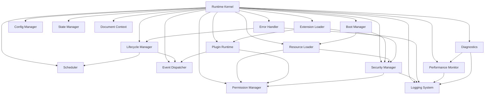

---

**Next:** Module 04 — Boot Sequence
# Phase 2 — Module 04: Runtime Boot Sequence
# LDFX Runtime Foundation Specification

**Specification Version:** 2.0.0
**Status:** Canonical — Approved
**Phase:** 2 — Runtime Foundation
**Section:** 4 of 17
**Depends On:** Module 01, Module 02, Module 03

---

## 4. Runtime Boot Sequence

---

### 4.1 Overview

The boot sequence is the ordered set of operations that transforms a raw
`.ldfx` byte stream into a fully initialized, ready-to-use runtime. It is
owned by the Boot Manager and executed under the supervision of the Runtime
Kernel.

Every step in the boot sequence is:
- Ordered — steps execute in the defined sequence, never in parallel unless stated
- Timed — every step has a maximum allowed duration
- Recoverable — every failure has a defined response
- Observable — every step emits a progress event

---

### 4.2 Cold Boot Sequence

A cold boot is the standard boot path — opening a document for the first time
with no cached state.

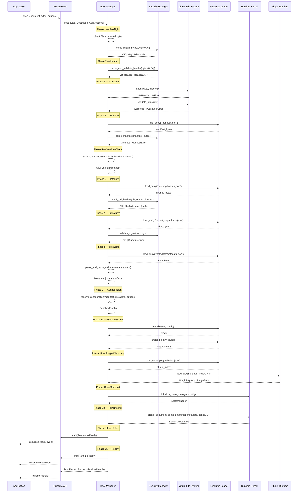

---

### 4.3 Boot Phase Definitions

| Phase | Name | Timeout | Fatal On Failure | Description |
|---|---|---|---|---|
| 1 | Pre-flight | 10ms | Yes | File size check, byte availability |
| 2 | Header | 20ms | Yes | Magic bytes, CRC32, version |
| 3 | Container | 50ms | Yes | ZIP structure, required folders |
| 4 | Manifest | 50ms | Yes | Parse and validate manifest.json |
| 5 | Version Check | 5ms | Yes | Runtime vs document version |
| 6 | Integrity | 200ms | Yes | SHA-256 hash verification |
| 7 | Signatures | 100ms | No (warn if unsigned) | Digital signature validation |
| 8 | Metadata | 50ms | Yes | Parse metadata, cross-validate |
| 9 | Configuration | 20ms | No (use defaults) | Resolve config hierarchy |
| 10 | Resources Init | 300ms | Yes | Preload entry page and hot assets |
| 11 | Plugin Discovery | 200ms | Conditional | Required plugins fatal, optional warn |
| 12 | State Init | 20ms | Yes | Initialize state manager |
| 13 | Runtime Init | 50ms | Yes | Create DocumentContext |
| 14 | UI Init | 100ms | No | Signal renderer to prepare |
| 15 | Ready | — | — | Emit RuntimeReady |

**Total cold boot budget:** 500ms for standard documents (≤100 pages, ≤50 assets)

---

### 4.4 Warm Boot Sequence

A warm boot occurs when a document is reopened after being previously opened
in the same session. Cached state from the previous session is reused.

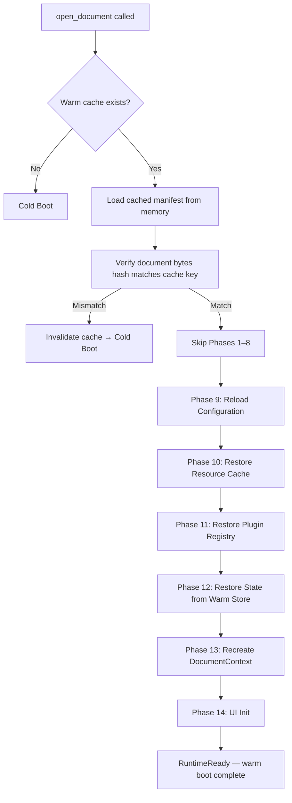

**Warm boot target:** < 100ms for standard documents.

**Cache invalidation rules:**
- Document bytes hash changed → full cold boot
- Runtime version changed → full cold boot
- Security policy changed → full cold boot
- Warm cache age > 30 minutes → full cold boot

---

### 4.5 Recovery Boot Sequence

A recovery boot is triggered when a previous session ended abnormally
(crash, forced kill, power loss). The runtime attempts to restore the
document to a usable state using the last known good state.

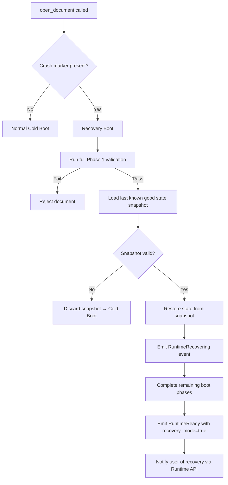

**Recovery state includes:**
- Last scroll position per page
- Form input state
- Annotation drafts
- Active plugin state snapshots

---

### 4.6 Safe Mode Boot

Safe mode is a restricted boot that disables all optional features.
It is triggered when:
- The user explicitly requests safe mode
- A previous boot failed due to a plugin or script error
- The Security Manager detects a suspicious document

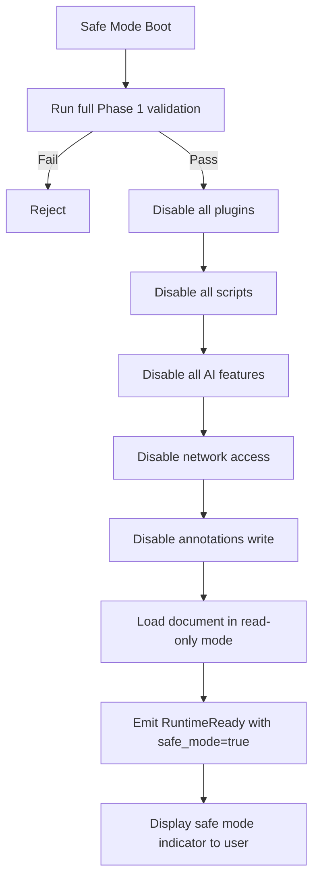

**Safe mode restrictions:**

| Feature | Safe Mode |
|---|---|
| Page rendering | ✅ Enabled |
| Asset display | ✅ Enabled |
| Plugins | ❌ Disabled |
| Scripts | ❌ Disabled |
| AI features | ❌ Disabled |
| Network access | ❌ Disabled |
| Annotations (write) | ❌ Disabled |
| Cloud sync | ❌ Disabled |
| Forms (submit) | ❌ Disabled |

---

### 4.7 Restart Sequence

A restart re-executes the boot sequence for the currently open document
without closing the application. Used after configuration changes or
plugin updates.

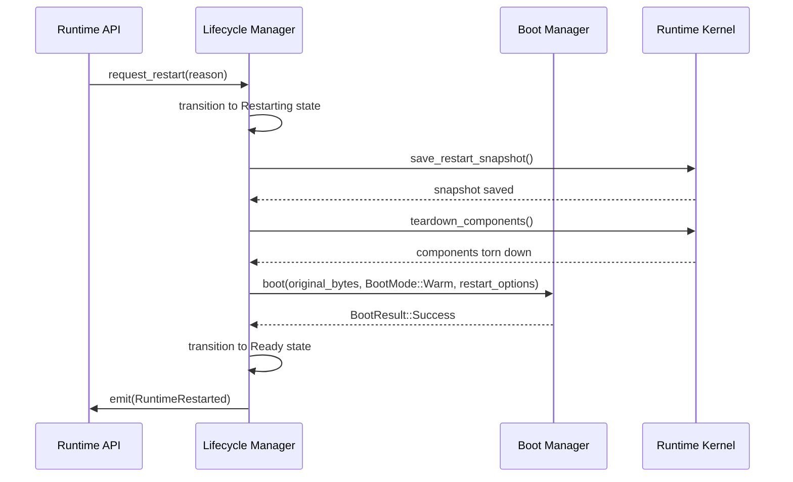

---

### 4.8 Shutdown Sequence

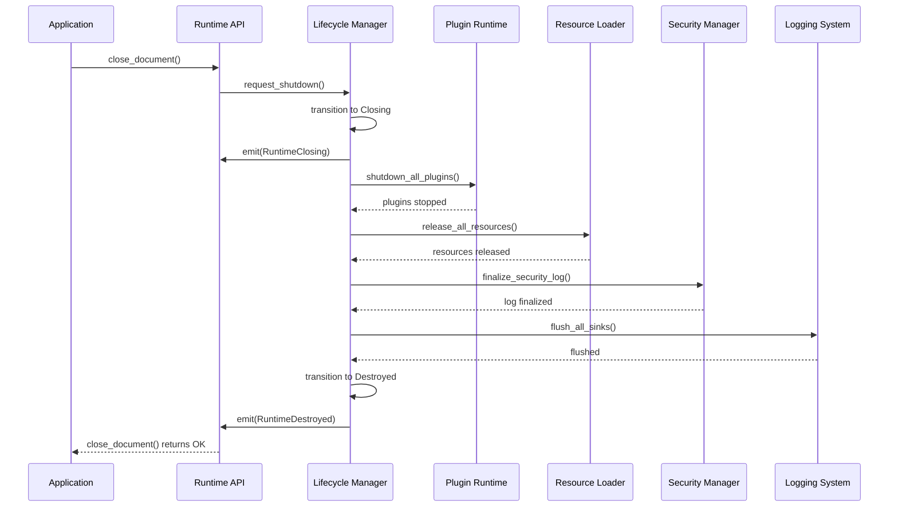

**Shutdown budget:** < 200ms for clean shutdown.

**Forced shutdown:** If clean shutdown exceeds 500ms, the runtime
performs a forced shutdown — releasing all OS handles and exiting
without waiting for component acknowledgment.

---

### 4.9 Sleep and Resume

Sleep is triggered by OS power management or application backgrounding.

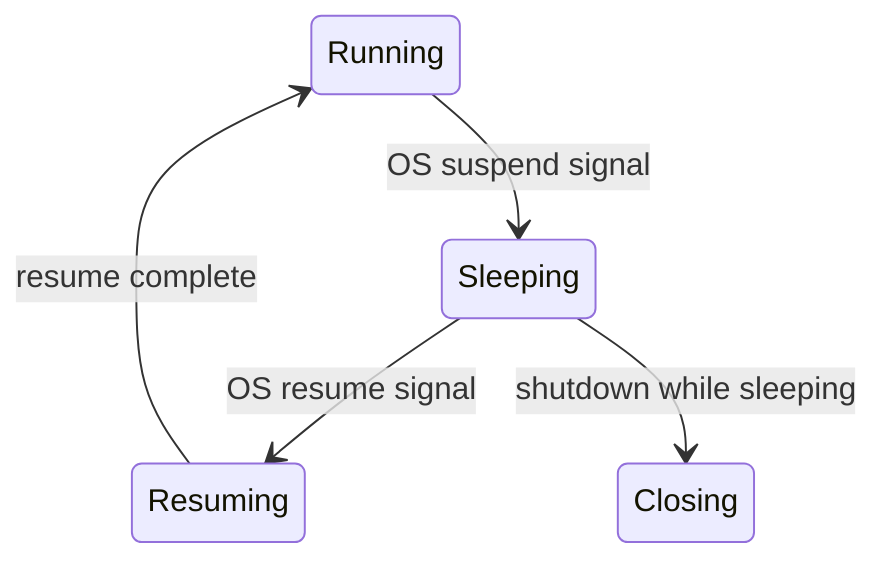

**On Sleep:**
1. Pause the Scheduler (no new tasks)
2. Flush the Logging System
3. Snapshot mutable state to warm store
4. Release non-essential memory (warm and cold cache)
5. Emit `RuntimeSleeping`

**On Resume:**
1. Emit `RuntimeResuming`
2. Restore warm cache
3. Resume the Scheduler
4. Re-verify document integrity (hash check on manifest)
5. Emit `RuntimeReady`

---

### 4.10 Boot Error Handling

Every boot phase failure has a defined response:

| Error | Phase | Response | User Visible |
|---|---|---|---|
| File too small | 1 | Reject, return error | "Not a valid LDFX file" |
| Magic mismatch | 2 | Reject, return error | "Not a valid LDFX file" |
| CRC32 mismatch | 2 | Reject, return error | "File is corrupted" |
| Version mismatch (major) | 5 | Reject, return error | "Incompatible document version" |
| Hash mismatch | 6 | Reject, return error | "File integrity check failed" |
| Invalid signature | 7 | Warn or reject (per policy) | "Signature invalid" |
| Metadata mismatch | 8 | Reject, return error | "Document metadata is inconsistent" |
| Config invalid | 9 | Use defaults, warn | None (silent fallback) |
| Entry page missing | 10 | Reject, return error | "Document entry page not found" |
| Required plugin missing | 11 | Reject, return error | "Required plugin not available" |
| Optional plugin missing | 11 | Warn, continue | "Plugin X not available" |
| State init failure | 12 | Reject, return error | "Runtime initialization failed" |

---

### 4.11 Boot Timeout Handling

If any boot phase exceeds its timeout:

```
1. Log timeout event with phase ID and elapsed time
2. If phase is fatal → abort boot, return BootError::PhaseTimeout(phase)
3. If phase is non-fatal → skip phase, log warning, continue
4. If total boot time exceeds 15 seconds → abort regardless of phase
```

---

### 4.12 Boot Progress Events

The Boot Manager emits the following events during the boot sequence.
Applications may use these to display a loading indicator.

| Event | Phase | Payload |
|---|---|---|
| `BootStarted` | 1 | `{ mode, document_size }` |
| `HeaderVerified` | 2 | `{ spec_version, feature_flags }` |
| `ContainerOpened` | 3 | `{ entry_count }` |
| `ManifestLoaded` | 4 | `{ document_id, title, page_count }` |
| `VersionVerified` | 5 | `{ spec_version }` |
| `IntegrityVerified` | 6 | `{ hash_count }` |
| `SignatureVerified` | 7 | `{ signed, signer_id }` |
| `MetadataLoaded` | 8 | `{ author_count, revision }` |
| `ConfigurationResolved` | 9 | `{ source_count }` |
| `ResourcesLoading` | 10 | `{ asset_count, page_count }` |
| `ResourcesReady` | 10 | `{ loaded_count }` |
| `PluginsReady` | 11 | `{ plugin_count }` |
| `RuntimeReady` | 15 | `{ boot_mode, elapsed_ms }` |

---

**Next:** Module 05 — Runtime Lifecycle
# Phase 2 — Module 05: Runtime Lifecycle
# LDFX Runtime Foundation Specification

**Specification Version:** 2.0.0
**Status:** Canonical — Approved
**Phase:** 2 — Runtime Foundation
**Section:** 5 of 17
**Depends On:** Module 01, Module 02, Module 03, Module 04

---

## 5. Runtime Lifecycle

---

### 5.1 Overview

The Runtime Lifecycle defines every state a document runtime can be in,
every valid transition between states, and every invalid transition that
must be rejected. The Lifecycle Manager owns this state machine and is
the single authority for all state transitions.

No component may change the runtime state directly. All state changes
go through the Lifecycle Manager.

---

### 5.2 Lifecycle States

| State | Description |
|---|---|
| `Created` | Runtime object instantiated, boot not yet started |
| `Initializing` | Boot sequence in progress (Phases 1–9) |
| `Loading` | Resources and plugins loading (Phases 10–13) |
| `Ready` | Boot complete, document available, no active user session |
| `Running` | Active user session, document fully interactive |
| `Idle` | Running but no user interaction for > idle_timeout |
| `Paused` | Explicitly paused by application (e.g., window minimized) |
| `Background` | Application moved to background (mobile/OS signal) |
| `Restoring` | Returning from Background or Paused state |
| `Sleeping` | OS suspend signal received |
| `Resuming` | Returning from Sleep state |
| `Restarting` | Restart requested, tearing down before re-boot |
| `Updating` | Document content being updated (live edit, sync) |
| `Closing` | Shutdown sequence in progress |
| `Destroyed` | All resources released, runtime object invalid |

---

### 5.3 Lifecycle State Machine

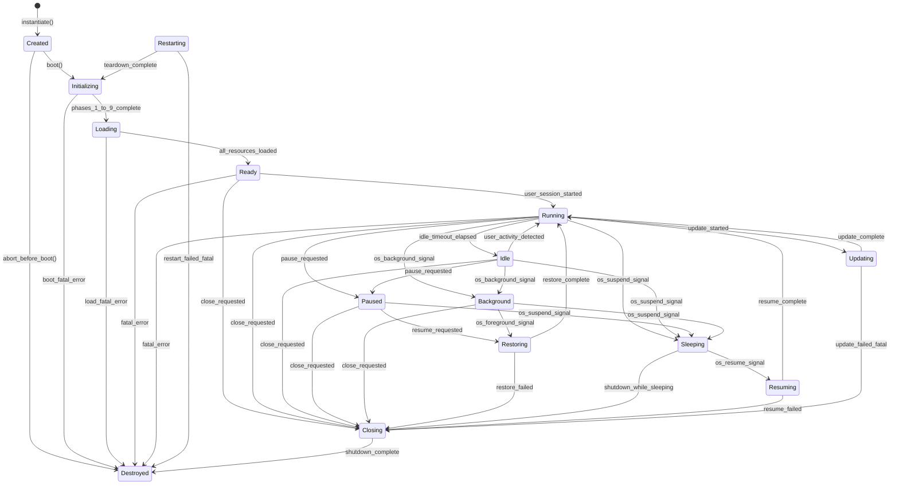

---

### 5.4 Allowed Transitions Table

| From | To | Trigger | Notes |
|---|---|---|---|
| Created | Initializing | `boot()` called | Normal boot start |
| Created | Destroyed | `abort()` called | Pre-boot abort |
| Initializing | Loading | Phases 1–9 complete | Normal progression |
| Initializing | Destroyed | Fatal boot error | No recovery |
| Loading | Ready | All resources loaded | Normal progression |
| Loading | Destroyed | Fatal load error | No recovery |
| Ready | Running | User session started | First interaction |
| Ready | Closing | Close requested | Normal close |
| Running | Idle | Idle timeout elapsed | Configurable timeout |
| Running | Paused | App pause request | Window minimize etc. |
| Running | Background | OS background signal | Mobile/OS |
| Running | Sleeping | OS suspend signal | Power management |
| Running | Updating | Update started | Live edit or sync |
| Running | Closing | Close requested | Normal close |
| Idle | Running | User activity | Any input event |
| Idle | Paused | App pause request | |
| Idle | Background | OS background signal | |
| Idle | Sleeping | OS suspend signal | |
| Idle | Closing | Close requested | |
| Paused | Restoring | Resume requested | |
| Paused | Sleeping | OS suspend signal | |
| Paused | Closing | Close requested | |
| Background | Restoring | OS foreground signal | |
| Background | Sleeping | OS suspend signal | |
| Background | Closing | Close requested | |
| Restoring | Running | Restore complete | |
| Restoring | Closing | Restore failed | Unrecoverable |
| Sleeping | Resuming | OS resume signal | |
| Sleeping | Closing | Shutdown while sleeping | |
| Resuming | Running | Resume complete | |
| Resuming | Closing | Resume failed | Unrecoverable |
| Updating | Running | Update complete | |
| Updating | Closing | Fatal update error | |
| Restarting | Initializing | Teardown complete | Re-enters boot |
| Restarting | Destroyed | Restart failed | |
| Closing | Destroyed | Shutdown complete | Terminal state |

---

### 5.5 Invalid Transitions

The following transitions are explicitly forbidden. The Lifecycle Manager
must reject them with `LifecycleError::InvalidTransition`.

| From | To (Forbidden) | Reason |
|---|---|---|
| Destroyed | Any | Terminal state — cannot be reused |
| Closing | Any except Destroyed | Shutdown is irreversible |
| Initializing | Running | Must pass through Loading and Ready |
| Loading | Running | Must pass through Ready |
| Created | Running | Must boot first |
| Sleeping | Running | Must pass through Resuming |
| Background | Running | Must pass through Restoring |
| Paused | Running | Must pass through Restoring |

---

### 5.6 Transition Timeouts

Every transition has a maximum allowed duration. If the transition
does not complete within the timeout, the Lifecycle Manager forces
a transition to `Closing`.

| Transition | Timeout | On Timeout |
|---|---|---|
| Created → Initializing | 10ms | Force Destroyed |
| Initializing → Loading | 500ms | Force Destroyed |
| Loading → Ready | 1000ms | Force Destroyed |
| Running → Paused | 100ms | Force Paused |
| Running → Background | 200ms | Force Background |
| Running → Sleeping | 500ms | Force Sleeping |
| Restoring → Running | 500ms | Force Closing |
| Resuming → Running | 1000ms | Force Closing |
| Updating → Running | 5000ms | Force Closing |
| Closing → Destroyed | 500ms | Force Destroyed |

---

### 5.7 Lifecycle Events

Every state transition emits a corresponding event via the Event Dispatcher.

| Event | Emitted On | Payload |
|---|---|---|
| `RuntimeCreated` | Created | `{ session_id }` |
| `RuntimeInitializing` | Initializing | `{ boot_mode }` |
| `RuntimeLoading` | Loading | `{ resource_count }` |
| `RuntimeReady` | Ready | `{ elapsed_ms, boot_mode }` |
| `RuntimeRunning` | Running | `{ session_id }` |
| `RuntimeIdle` | Idle | `{ idle_duration_ms }` |
| `RuntimePaused` | Paused | `{ reason }` |
| `RuntimeBackground` | Background | `{ reason }` |
| `RuntimeRestoring` | Restoring | `{ from_state }` |
| `RuntimeSleeping` | Sleeping | `{}` |
| `RuntimeResuming` | Resuming | `{}` |
| `RuntimeUpdating` | Updating | `{ update_type }` |
| `RuntimeRestarting` | Restarting | `{ reason }` |
| `RuntimeClosing` | Closing | `{ reason }` |
| `RuntimeDestroyed` | Destroyed | `{ session_id, uptime_ms }` |

---

### 5.8 Idle State Behavior

The runtime transitions to `Idle` after a configurable period of no
user interaction. In Idle state:

- The Scheduler reduces thread pool to minimum (2 threads)
- Background tasks continue at Low priority only
- Memory pressure triggers cache eviction (warm → cold)
- Plugin CPU limits are reduced to 10% of normal
- The Performance Monitor continues collecting metrics

**Idle timeout:** Configurable via `config.runtime.idle_timeout_ms`.
Default: 60,000ms (60 seconds).

**Idle exit:** Any user input event (mouse, keyboard, touch, scroll)
immediately transitions back to `Running`.

---

### 5.9 Background State Behavior

Background state is triggered by OS signals (app moved to background
on mobile, or window hidden on desktop). In Background state:

- All rendering is suspended
- The Scheduler pauses High and Normal priority tasks
- Only Low and Deferred priority tasks continue
- Network sync operations continue if permitted
- Memory is aggressively reclaimed (cold cache cleared)
- Plugin execution is suspended

**Background memory budget:** 16MB RSS target (down from normal 32MB+).

---

### 5.10 Failure Handling

#### Fatal Failures

A fatal failure in any state (except Closing and Destroyed) triggers
an immediate transition to `Closing`, bypassing all intermediate states.

```mermaid
flowchart TD
    ANY[Any State] -->|fatal_error| CLOSING[Closing]
    CLOSING --> DESTROYED[Destroyed]
    CLOSING --> CRASH_REPORT[Generate Crash Report]
    CRASH_REPORT --> DESTROYED
```

#### Recoverable Failures

A recoverable failure does not change the lifecycle state. The Error
Handler attempts recovery and emits a warning event. If recovery fails
after the configured number of retries, the failure is escalated to fatal.

| Failure | Recovery Strategy | Max Retries |
|---|---|---|
| Asset load failure | Retry with exponential backoff | 3 |
| Plugin crash | Restart plugin in new sandbox | 2 |
| State write failure | Retry with different storage path | 1 |
| Network timeout | Retry with backoff | 3 |
| Config load failure | Use defaults | 1 |

---

### 5.11 Lifecycle Manager Responsibilities Summary

```mermaid
graph TD
    LM[Lifecycle Manager]
    LM --> A[Own current state]
    LM --> B[Validate transition requests]
    LM --> C[Execute transition actions]
    LM --> D[Enforce transition timeouts]
    LM --> E[Emit lifecycle events]
    LM --> F[Coordinate Scheduler on state change]
    LM --> G[Coordinate Resource Manager on state change]
    LM --> H[Handle OS lifecycle signals]
    LM --> I[Handle forced shutdown]
```

---

**Next:** Module 06 — Runtime Context
# Phase 2 — Module 06: Runtime Context
# LDFX Runtime Foundation Specification

**Specification Version:** 2.0.0
**Status:** Canonical — Approved
**Phase:** 2 — Runtime Foundation
**Section:** 6 of 17
**Depends On:** Module 01–05

---

## 6. Runtime Context

---

### 6.1 Overview

The Runtime Context is the single authoritative object that holds all
state for an open document session. It is created at the end of the
boot sequence and lives until the document is closed. Every runtime
component that needs document state reads it from the Context.

The Context is not a global singleton. Each open document has its own
independent Context. Multiple documents may be open simultaneously,
each with a fully isolated Context.

---

### 6.2 Context Object Diagram

```mermaid
graph TD
    CTX[DocumentContext]

    CTX --> DOC[Document Info]
    CTX --> MAN[Manifest]
    CTX --> META[Metadata]
    CTX --> RTV[Runtime Version]
    CTX --> FEAT[Feature Flags]
    CTX --> PAGES[Loaded Pages]
    CTX --> ASSETS[Loaded Assets]
    CTX --> PLUGINS[Plugin Registry]
    CTX --> THEME[Theme]
    CTX --> LANG[Language]
    CTX --> PERMS[Permission Grants]
    CTX --> SEC[Security Context]
    CTX --> SESS[Session]
    CTX --> TEMP[Temporary Storage]
    CTX --> CFG[Configuration]
    CTX --> DEV[Developer Flags]

    DOC --> D1[document_id: UUID]
    DOC --> D2[title: String]
    DOC --> D3[spec_version: SemVer]
    DOC --> D4[created_at: DateTime]
    DOC --> D5[modified_at: DateTime]
    DOC --> D6[document_type: String]
    DOC --> D7[language: BCP47]
    DOC --> D8[page_count: u32]
    DOC --> D9[entry_page: String]
```

---

### 6.3 Full Context Field Specification

#### 6.3.1 Document Info

| Field | Type | Mutable | Source | Description |
|---|---|---|---|---|
| `document_id` | UUID | No | manifest | Unique document identifier |
| `title` | String | No | manifest | Document title |
| `subtitle` | Option\<String\> | No | manifest | Document subtitle |
| `spec_version` | SemVer | No | manifest | LDFX spec version |
| `document_type` | String | No | manifest | document, template, etc. |
| `language` | BCP47 | No | manifest | Primary language |
| `direction` | String | No | manifest | ltr or rtl |
| `page_count` | u32 | No | manifest | Total page count |
| `entry_page` | String | No | manifest | Entry page path |
| `created_at` | DateTime | No | manifest | Creation timestamp |
| `modified_at` | DateTime | No | manifest | Last modification timestamp |

#### 6.3.2 Runtime Version

| Field | Type | Mutable | Source | Description |
|---|---|---|---|---|
| `runtime_version` | SemVer | No | compiled | Current runtime version |
| `runtime_build` | String | No | compiled | Build identifier |
| `platform` | String | No | platform | windows/linux/macos/wasm |
| `boot_mode` | BootMode | No | boot | cold/warm/recovery/safe |
| `booted_at` | DateTime | No | boot | Boot completion timestamp |

#### 6.3.3 Feature Flags

| Field | Type | Mutable | Source | Description |
|---|---|---|---|---|
| `feature_flags` | u16 | No | header | Raw feature flags bitmask |
| `has_scripts` | bool | No | manifest | Scripts enabled |
| `has_ai` | bool | No | manifest | AI features enabled |
| `has_plugins` | bool | No | manifest | Plugins enabled |
| `has_encryption` | bool | No | manifest | Encryption enabled |
| `has_annotations` | bool | No | manifest | Annotations enabled |
| `has_collaboration` | bool | No | manifest | Collaboration enabled |
| `has_cloud_sync` | bool | No | manifest | Cloud sync enabled |
| `readonly` | bool | No | manifest | Document is read-only |

#### 6.3.4 Loaded Pages

| Field | Type | Mutable | Description |
|---|---|---|---|
| `page_index` | PageIndex | No | Full page index from pages/index.json |
| `loaded_pages` | HashMap\<String, PageContent\> | Yes | Pages currently in memory |
| `loaded_layouts` | HashMap\<String, PageLayout\> | Yes | Layouts currently in memory |
| `current_page_id` | Option\<String\> | Yes | Currently displayed page |

#### 6.3.5 Loaded Assets

| Field | Type | Mutable | Description |
|---|---|---|---|
| `asset_index` | AssetIndex | No | Full asset index |
| `loaded_assets` | HashMap\<String, AssetData\> | Yes | Assets currently in memory |
| `asset_cache_size` | usize | Yes | Current cache size in bytes |

#### 6.3.6 Plugin Registry

| Field | Type | Mutable | Description |
|---|---|---|---|
| `plugin_index` | PluginIndex | No | Full plugin index |
| `active_plugins` | HashMap\<String, PluginHandle\> | Yes | Running plugin instances |
| `failed_plugins` | Vec\<String\> | Yes | Plugin IDs that failed to load |

#### 6.3.7 Theme and Language

| Field | Type | Mutable | Description |
|---|---|---|---|
| `active_theme` | ThemeId | Yes | Current theme identifier |
| `active_language` | BCP47 | Yes | Current display language |
| `available_locales` | Vec\<BCP47\> | No | Locales declared in manifest |
| `text_direction` | Direction | Yes | Current text direction |

#### 6.3.8 Permission Grants

| Field | Type | Mutable | Description |
|---|---|---|---|
| `declared_permissions` | Vec\<Permission\> | No | Permissions declared in manifest |
| `granted_permissions` | PermissionSet | No | Permissions granted at boot |
| `session_grants` | PermissionSet | Yes | User-granted during session |
| `denied_permissions` | PermissionSet | Yes | Explicitly denied by user |

#### 6.3.9 Security Context

| Field | Type | Mutable | Description |
|---|---|---|---|
| `trust_level` | TrustLevel | No | untrusted/low/medium/high/system |
| `signed` | bool | No | Document has valid signature |
| `signer_id` | Option\<String\> | No | Signer identifier if signed |
| `hash_algorithm` | String | No | sha256 |
| `integrity_verified` | bool | No | All hashes verified at boot |
| `security_events` | Vec\<SecurityEvent\> | Yes | Security events this session |

#### 6.3.10 Session

| Field | Type | Mutable | Description |
|---|---|---|---|
| `session_id` | UUID | No | Generated at boot |
| `session_started_at` | DateTime | No | Boot completion time |
| `user_id` | Option\<String\> | No | Authenticated user if any |
| `interaction_count` | u64 | Yes | Total user interactions |
| `last_interaction_at` | Option\<DateTime\> | Yes | Last user interaction time |

#### 6.3.11 Temporary Storage

| Field | Type | Mutable | Description |
|---|---|---|---|
| `temp_store` | TempStore | Yes | Session-scoped key-value store |
| `warm_store` | WarmStore | Yes | Persisted across warm boots |
| `scroll_positions` | HashMap\<String, f64\> | Yes | Per-page scroll position |
| `form_state` | HashMap\<String, Value\> | Yes | Form input state |
| `annotation_drafts` | Vec\<AnnotationDraft\> | Yes | Unsaved annotation drafts |

#### 6.3.12 Configuration

| Field | Type | Mutable | Description |
|---|---|---|---|
| `config` | ResolvedConfig | Yes | Fully resolved configuration |
| `config_sources` | Vec\<ConfigSource\> | No | Sources used in resolution |

#### 6.3.13 Developer Flags

| Field | Type | Mutable | Description |
|---|---|---|---|
| `dev_mode` | bool | No | Developer mode active |
| `verbose_logging` | bool | No | Verbose logging active |
| `hot_reload` | bool | No | Hot reload enabled |
| `profiling` | bool | No | Performance profiling active |
| `inspector` | bool | No | Runtime inspector active |

---

### 6.4 Context Ownership

```mermaid
graph TD
    KERN[Runtime Kernel]
    KERN -->|owns| CTX[DocumentContext\nArc RwLock]
    CTX -->|read access| BOOT[Boot Manager]
    CTX -->|read access| LC[Lifecycle Manager]
    CTX -->|read/write| RL[Resource Loader]
    CTX -->|read access| SEC[Security Manager]
    CTX -->|read access| PM[Permission Manager]
    CTX -->|read/write| SM[State Manager]
    CTX -->|read access| PR[Plugin Runtime]
    CTX -->|read access| API[Runtime API Layer]
```

**Ownership rules:**
- The Runtime Kernel is the sole owner of the `DocumentContext`
- All other components receive a reference-counted clone (`Arc`)
- Structural fields (manifest, metadata, permissions) are read-only after boot
- Mutable fields use `RwLock` with fine-grained locking per field group
- No component may hold a write lock for more than 10ms

---

### 6.5 Context Lifetime

```mermaid
sequenceDiagram
    participant Boot as Boot Manager
    participant Kern as Runtime Kernel
    participant Comp as Components
    participant LC as Lifecycle Manager

    Boot->>Kern: boot complete, here is parsed data
    Kern->>Kern: create DocumentContext
    Kern->>Comp: distribute Arc<RwLock<DocumentContext>>
    Note over Comp: Context in use throughout session
    LC->>Kern: shutdown initiated
    Kern->>Comp: drop all Arc references
    Kern->>Kern: drop owned DocumentContext
    Note over Kern: Context destroyed, all memory released
```

**Lifetime rules:**
- Context is created exactly once per document session
- Context is destroyed exactly once — on document close
- No component may store a raw pointer to the Context
- All access is through `Arc<RwLock<DocumentContext>>`
- On shutdown, the Kernel drops its owned copy last

---

### 6.6 Context Synchronization

The Context uses a two-tier locking strategy:

**Tier 1 — Structural fields (read-only after boot):**
No locking required after boot. These fields are set once during boot
and never modified. They are accessed via shared references.

**Tier 2 — Mutable fields (runtime state):**
Each mutable field group has its own `RwLock`. This minimizes contention
by allowing concurrent reads of different field groups.

| Field Group | Lock Type | Contention Level |
|---|---|---|
| loaded_pages | RwLock | Medium |
| loaded_assets | RwLock | High |
| active_plugins | RwLock | Low |
| session_grants | RwLock | Low |
| security_events | Mutex | Low |
| temp_store | RwLock | Medium |
| scroll_positions | RwLock | High |
| form_state | RwLock | Medium |
| config | RwLock | Low |

**Deadlock prevention rules:**
1. Never acquire two locks simultaneously
2. If two locks must be acquired, always acquire in alphabetical field order
3. Never hold a lock while calling into another component
4. Lock hold time must not exceed 10ms

---

### 6.7 Context Isolation Between Documents

When multiple documents are open simultaneously, each has a completely
independent Context. There is no shared state between Contexts.

```mermaid
graph LR
    subgraph Process
        subgraph Doc A
            CTX_A[DocumentContext A]
            KERN_A[Kernel A]
        end
        subgraph Doc B
            CTX_B[DocumentContext B]
            KERN_B[Kernel B]
        end
        PLAT[Platform Adapter\nshared]
    end

    KERN_A --> CTX_A
    KERN_B --> CTX_B
    KERN_A --> PLAT
    KERN_B --> PLAT
```

**Isolation rules:**
- No Context field is shared between documents
- Plugin instances are not shared between documents
- Asset caches are not shared between documents
- The Platform Adapter is shared but is stateless from the runtime's perspective

---

**Next:** Module 07 — Runtime Configuration
# Phase 2 — Module 07: Runtime Configuration
# LDFX Runtime Foundation Specification

**Specification Version:** 2.0.0
**Status:** Canonical — Approved
**Phase:** 2 — Runtime Foundation
**Section:** 7 of 17
**Depends On:** Module 01–06

---

## 7. Runtime Configuration

---

### 7.1 Overview

The LDFX Runtime uses a layered configuration system. Configuration values
come from multiple sources and are merged in a defined priority order.
Higher-priority sources override lower-priority sources for the same key.
The Configuration Manager resolves all sources into a single
`ResolvedConfig` object at boot time.

---

### 7.2 Configuration Hierarchy

```mermaid
graph TD
    A["System Defaults\n(compiled into runtime binary)\nPriority: 1 — Lowest"]
    B["Viewer Defaults\n(viewer config file on disk)\nPriority: 2"]
    C["Document Defaults\n(manifest + metadata)\nPriority: 3"]
    D["User Preferences\n(user profile on disk)\nPriority: 4"]
    E["Session Overrides\n(passed at open_document call)\nPriority: 5"]
    F["Runtime Overrides\n(set programmatically during session)\nPriority: 6 — Highest"]
    G["ResolvedConfig\n(merged result)"]

    A -->|base| G
    B -->|overrides system| G
    C -->|overrides viewer| G
    D -->|overrides document| G
    E -->|overrides user| G
    F -->|overrides session| G
```

---

### 7.3 Configuration Sources

#### 7.3.1 System Defaults

- **Source:** Compiled into the runtime binary as constants
- **Format:** Rust constants / default trait implementations
- **Mutability:** Immutable — cannot be changed without recompiling
- **Purpose:** Guarantee that every configuration key always has a valid value
- **Failure behavior:** Cannot fail — always present

#### 7.3.2 Viewer Defaults

- **Source:** `ldfx-viewer.toml` in the viewer application directory
- **Format:** TOML
- **Mutability:** Changed by the viewer application developer
- **Purpose:** Allow viewer applications to set their own defaults
  (e.g., a corporate viewer with specific font or theme defaults)
- **Failure behavior:** If missing or invalid → use System Defaults, log warning

#### 7.3.3 Document Defaults

- **Source:** `manifest.json` and `metadata/metadata.json` inside the `.ldfx` file
- **Format:** JSON (already parsed by boot sequence)
- **Mutability:** Immutable — set by the document author
- **Purpose:** Allow documents to declare their preferred runtime behavior
  (e.g., preferred language, theme, offline mode)
- **Failure behavior:** If invalid → use Viewer Defaults for that key, log warning

**Document-configurable keys:**

| Key | Source | Description |
|---|---|---|
| `preferred_language` | manifest | Preferred display language |
| `preferred_theme` | manifest | Preferred theme identifier |
| `offline_capable` | manifest | Whether offline mode is supported |
| `requires_network` | manifest | Whether network is required |
| `requires_gpu` | manifest | Whether GPU rendering is required |
| `unknown_feature_policy` | manifest | warn / error / ignore / safe_mode |
| `minimum_runtime_version` | manifest | Minimum runtime version required |
| `target_platforms` | manifest | Supported platforms |

#### 7.3.4 User Preferences

- **Source:** User profile storage (platform-specific path via Platform Adapter)
- **Format:** JSON
- **Mutability:** Changed by the user through the viewer UI
- **Purpose:** Allow users to personalize their reading experience
- **Failure behavior:** If missing → use Document Defaults, log info

**User-configurable keys:**

| Key | Description | Default |
|---|---|---|
| `theme` | UI theme | system |
| `font_size_scale` | Font size multiplier | 1.0 |
| `language` | Display language override | document default |
| `text_direction` | Text direction override | document default |
| `idle_timeout_ms` | Idle timeout | 60000 |
| `cache_size_mb` | Max cache size | 256 |
| `enable_animations` | UI animations | true |
| `enable_telemetry` | Anonymous telemetry | false |
| `accessibility_mode` | High contrast / large text | false |

#### 7.3.5 Session Overrides

- **Source:** `RuntimeOptions` struct passed to `open_document()`
- **Format:** Rust struct
- **Mutability:** Set once at document open, immutable during session
- **Purpose:** Allow the application to override configuration for a specific
  document open (e.g., open in safe mode, force a specific language)
- **Failure behavior:** Invalid values are rejected at the API layer before boot

**Session-overridable keys:**

| Key | Description |
|---|---|
| `boot_mode` | cold / warm / recovery / safe |
| `language_override` | Force a specific language |
| `theme_override` | Force a specific theme |
| `dev_mode` | Enable developer mode |
| `verbose_logging` | Enable verbose logging |
| `disable_plugins` | Disable all plugins |
| `disable_scripts` | Disable all scripts |
| `disable_ai` | Disable AI features |
| `disable_network` | Force offline mode |
| `timeout_overrides` | Per-phase boot timeout overrides |

#### 7.3.6 Runtime Overrides

- **Source:** Set programmatically via the Runtime API during an active session
- **Format:** Typed API calls
- **Mutability:** Can be changed at any time during a Running session
- **Purpose:** Allow the application to respond to runtime events
  (e.g., user changes theme, user changes language)
- **Failure behavior:** Invalid values are rejected, current value retained

**Runtime-overridable keys:**

| Key | Description | Requires Restart |
|---|---|---|
| `active_theme` | Change theme | No |
| `active_language` | Change language | No |
| `font_size_scale` | Change font scale | No |
| `enable_animations` | Toggle animations | No |
| `accessibility_mode` | Toggle accessibility | No |
| `cache_size_mb` | Adjust cache size | No |
| `idle_timeout_ms` | Adjust idle timeout | No |

---

### 7.4 Configuration Precedence Resolution

```mermaid
flowchart TD
    A[Start with System Defaults] --> B[Apply Viewer Defaults]
    B --> C{Key present in Viewer?}
    C -->|Yes| D[Override with Viewer value]
    C -->|No| E[Keep System value]
    D --> F[Apply Document Defaults]
    E --> F
    F --> G{Key present in Document?}
    G -->|Yes| H[Override with Document value]
    G -->|No| I[Keep current value]
    H --> J[Apply User Preferences]
    I --> J
    J --> K{Key present in User?}
    K -->|Yes| L[Override with User value]
    K -->|No| M[Keep current value]
    L --> N[Apply Session Overrides]
    M --> N
    N --> O{Key present in Session?}
    O -->|Yes| P[Override with Session value]
    O -->|No| Q[Keep current value]
    P --> R[Apply Runtime Overrides]
    Q --> R
    R --> S{Key present in Runtime?}
    S -->|Yes| T[Override with Runtime value]
    S -->|No| U[Keep current value]
    T --> V[ResolvedConfig complete]
    U --> V
```

---

### 7.5 Configuration Validation

Every configuration value is validated against its schema before being
accepted into the resolved configuration.

| Validation Rule | On Failure |
|---|---|
| Type mismatch (e.g., string where number expected) | Use default, log warning |
| Value out of range (e.g., font_size_scale < 0.1) | Clamp to range, log warning |
| Unknown key | Ignore, log info |
| Required key missing | Use default, log warning |
| Conflicting values (e.g., requires_network + disable_network) | Higher priority wins, log warning |

---

### 7.6 Configuration Rollback

If a runtime configuration change causes a component failure, the
Configuration Manager rolls back to the previous value.

```mermaid
sequenceDiagram
    participant API as Runtime API
    participant CM as Config Manager
    participant Comp as Affected Component

    API->>CM: set_runtime_override(key, new_value)
    CM->>CM: validate new_value
    CM->>CM: snapshot current value
    CM->>CM: apply new_value
    CM->>Comp: notify_config_changed(key, new_value)
    Comp-->>CM: ComponentError
    CM->>CM: rollback to snapshot
    CM->>Comp: notify_config_changed(key, old_value)
    CM-->>API: ConfigError::RollbackOccurred(key, reason)
```

---

### 7.7 Configuration Profiles

Configuration profiles allow a set of configuration values to be
saved and restored as a named group.

| Profile | Description |
|---|---|
| `default` | System defaults — always available |
| `reading` | Optimized for reading (large font, high contrast) |
| `presentation` | Optimized for presenting (full screen, no UI chrome) |
| `developer` | Developer mode with verbose logging and inspector |
| `accessibility` | Maximum accessibility settings |
| `offline` | Force offline mode, disable all network features |

Profiles are stored in user preferences. Custom profiles may be created
by the user. A profile is applied by setting all its keys as User Preferences.

---

### 7.8 Feature Flags in Configuration

Feature flags from the binary header and manifest are exposed as
read-only configuration keys. They cannot be overridden by any
configuration source.

| Config Key | Source | Overridable |
|---|---|---|
| `features.has_scripts` | manifest | No |
| `features.has_ai` | manifest | No |
| `features.has_plugins` | manifest | No |
| `features.has_encryption` | manifest | No |
| `features.has_annotations` | manifest | No |
| `features.has_collaboration` | manifest | No |
| `features.has_cloud_sync` | manifest | No |
| `features.readonly` | manifest | No |

Session overrides may *disable* features (e.g., `disable_plugins: true`)
but may never *enable* features that are not declared in the manifest.

---

### 7.9 ResolvedConfig Structure

The `ResolvedConfig` is the final merged configuration object stored
in the Document Context. It is a typed struct — not a raw key-value map.

```
ResolvedConfig {
    runtime: RuntimeConfig {
        idle_timeout_ms: u64,
        cache_size_mb: u32,
        thread_pool_size: u8,
        boot_timeout_ms: u64,
    },
    display: DisplayConfig {
        theme: ThemeId,
        language: BCP47,
        font_size_scale: f32,
        text_direction: Direction,
        enable_animations: bool,
        accessibility_mode: bool,
    },
    features: FeatureConfig {
        plugins_enabled: bool,
        scripts_enabled: bool,
        ai_enabled: bool,
        network_enabled: bool,
        annotations_enabled: bool,
        cloud_sync_enabled: bool,
    },
    security: SecurityConfig {
        unknown_feature_policy: UnknownFeaturePolicy,
        trust_level: TrustLevel,
        require_signature: bool,
    },
    developer: DeveloperConfig {
        dev_mode: bool,
        verbose_logging: bool,
        hot_reload: bool,
        profiling: bool,
        inspector: bool,
    },
    telemetry: TelemetryConfig {
        enabled: bool,
        endpoint: Option<Url>,
    },
}
```

---

**Next:** Module 08 — Runtime Services
# Phase 2 — Module 08: Runtime Services
# LDFX Runtime Foundation Specification

**Specification Version:** 2.0.0
**Status:** Canonical — Approved
**Phase:** 2 — Runtime Foundation
**Section:** 8 of 17
**Depends On:** Module 01–07

---

## 8. Runtime Services

---

### 8.1 Overview

Runtime Services are internal subsystems that provide shared capabilities
to all runtime components. Each service has a single responsibility, a
defined interface, and a defined lifecycle. Services are initialized during
the boot sequence and shut down during the shutdown sequence.

Services communicate with each other only through the Event Dispatcher
or through direct interface calls — never through shared mutable state.

---

### 8.2 Service Interaction Diagram

```mermaid
graph TD
    subgraph Core Services
        RS[Resource Service]
        CS[Configuration Service]
        SS[Storage Service]
        SCS[Scheduling Service]
        STS[State Service]
    end
    subgraph User-Facing Services
        TS[Theme Service]
        LS[Language Service]
        PS[Permission Service]
    end
    subgraph Infrastructure Services
        LGS[Logging Service]
        DS[Diagnostics Service]
        HMS[Health Monitor]
    end
    subgraph Optional Services
        AIS[AI Service]
        PLS[Plugin Service]
        ANS[Analytics Service]
    end

    RS --> SS
    RS --> LGS
    CS --> SS
    CS --> LGS
    STS --> SS
    TS --> CS
    LS --> CS
    PS --> LGS
    AIS --> RS
    AIS --> PS
    PLS --> RS
    PLS --> PS
    PLS --> SCS
    HMS --> LGS
    HMS --> DS
    ANS --> SS
    ANS --> PS
```

---

### 8.3 Resource Service

**Purpose:** Central access point for all document resources.

**Responsibilities:**
- Load pages, assets, plugins, and scripts on demand
- Maintain the tiered resource cache
- Implement lazy loading and prefetching strategies
- Track resource reference counts
- Enforce per-resource size limits
- Emit resource lifecycle events

**Interface:**

| Method | Input | Output | Description |
|---|---|---|---|
| `load_page(id)` | Page ID | `PageContent` | Load a page's content |
| `load_layout(id)` | Page ID | `PageLayout` | Load a page's layout |
| `load_asset(id)` | Asset ID | `AssetData` | Load an asset |
| `prefetch_page(id)` | Page ID | `()` | Background prefetch |
| `release_page(id)` | Page ID | `()` | Release from cache |
| `release_asset(id)` | Asset ID | `()` | Release from cache |
| `cache_stats()` | `()` | `CacheStats` | Current cache statistics |

**Dependencies:** Virtual File System, Security Manager, Logging Service

**Failure Modes:**
- Entry not found → `ResourceError::NotFound`
- Hash mismatch → `ResourceError::IntegrityFailure`
- Cache full → evict LRU entries, retry

---

### 8.4 Configuration Service

**Purpose:** Provide typed, validated access to the resolved configuration.

**Responsibilities:**
- Expose the `ResolvedConfig` to all components
- Accept runtime configuration overrides
- Validate override values before applying
- Emit `ConfigChanged` events on successful changes
- Roll back failed changes

**Interface:**

| Method | Input | Output | Description |
|---|---|---|---|
| `get<T>(key)` | Config key | `T` | Get typed config value |
| `set(key, value)` | Key + value | `Result` | Set runtime override |
| `reset(key)` | Config key | `()` | Reset to resolved default |
| `snapshot()` | `()` | `ConfigSnapshot` | Full config snapshot |
| `apply_profile(name)` | Profile name | `Result` | Apply a named profile |

**Dependencies:** Storage Service (for user preferences), Logging Service

---

### 8.5 Storage Service

**Purpose:** Provide persistent and session-scoped storage for runtime data.

**Responsibilities:**
- Provide key-value storage scoped to session, warm, or persistent lifetime
- Ensure atomic writes (no partial writes)
- Enforce storage size limits per scope
- Provide storage for user preferences, warm boot state, and session state
- Handle storage migration between runtime versions

**Storage Scopes:**

| Scope | Lifetime | Location | Max Size |
|---|---|---|---|
| Session | Until document close | Memory only | 16MB |
| Warm | Until process exit | Temp directory | 64MB |
| Persistent | Until user clears | User data directory | 256MB |

**Interface:**

| Method | Input | Output | Description |
|---|---|---|---|
| `read(scope, key)` | Scope + key | `Option<Bytes>` | Read a value |
| `write(scope, key, value)` | Scope + key + value | `Result` | Write a value |
| `delete(scope, key)` | Scope + key | `Result` | Delete a value |
| `clear(scope)` | Scope | `Result` | Clear all values in scope |
| `size(scope)` | Scope | `usize` | Current storage size |

**Dependencies:** Platform Adapter (for file system access), Logging Service

**Failure Modes:**
- Write failure → `StorageError::WriteFailed`
- Size limit exceeded → `StorageError::QuotaExceeded`
- Corruption detected → `StorageError::Corrupted`, clear and rebuild

---

### 8.6 Theme Service

**Purpose:** Manage the active theme and provide theme data to the renderer.

**Responsibilities:**
- Load the active theme from the document or user preferences
- Provide theme tokens (colors, fonts, spacing) to the renderer
- Handle theme switching at runtime
- Support system theme detection (light/dark)
- Validate theme data

**Interface:**

| Method | Input | Output | Description |
|---|---|---|---|
| `active_theme()` | `()` | `ThemeData` | Get current theme |
| `set_theme(id)` | Theme ID | `Result` | Switch theme |
| `available_themes()` | `()` | `Vec<ThemeId>` | List available themes |
| `system_theme()` | `()` | `SystemTheme` | Detect system light/dark |

**Dependencies:** Configuration Service, Resource Service, Logging Service

---

### 8.7 Language Service

**Purpose:** Manage localization and provide translated strings.

**Responsibilities:**
- Load locale data for the active language
- Provide translated strings for runtime UI elements
- Handle language switching at runtime
- Support RTL/LTR direction switching
- Fall back to the document's primary language if a locale is unavailable

**Interface:**

| Method | Input | Output | Description |
|---|---|---|---|
| `active_language()` | `()` | `BCP47` | Current language tag |
| `set_language(tag)` | BCP47 tag | `Result` | Switch language |
| `translate(key)` | String key | `String` | Get translated string |
| `direction()` | `()` | `Direction` | Current text direction |
| `available_locales()` | `()` | `Vec<BCP47>` | Available locales |

**Dependencies:** Configuration Service, Resource Service

---

### 8.8 Analytics Service

**Purpose:** Collect anonymous usage analytics if the user has consented.

**Responsibilities:**
- Track document open/close events
- Track page navigation events
- Track feature usage (plugins, AI, annotations)
- Batch and flush analytics to the configured endpoint
- Respect the user's telemetry consent setting
- Never collect PII (no document content, no user identifiers)

**Privacy rules:**
- Analytics are disabled by default (`enable_telemetry: false`)
- No analytics are collected if `enable_telemetry: false`
- No document content is ever included in analytics
- All analytics are anonymized before transmission
- Analytics are never transmitted without explicit user consent

**Interface:**

| Method | Input | Output | Description |
|---|---|---|---|
| `track(event)` | AnalyticsEvent | `()` | Record an event |
| `flush()` | `()` | `Result` | Flush pending events |
| `is_enabled()` | `()` | `bool` | Check consent status |

**Dependencies:** Permission Service, Storage Service, Platform Adapter (network)

---

### 8.9 Permission Service

**Purpose:** Single authority for all permission checks and grants.

**Responsibilities:**
- Evaluate permission requests against the granted permission set
- Handle user-interactive permission prompts
- Log all permission decisions
- Maintain the session grant set
- Enforce the principle of least privilege

**Interface:**

| Method | Input | Output | Description |
|---|---|---|---|
| `check(permission)` | Permission | `bool` | Check if permission is granted |
| `require(permission)` | Permission | `Result` | Assert permission or error |
| `request(permission)` | Permission | `Future<PermissionResult>` | Request user grant |
| `revoke(permission)` | Permission | `()` | Revoke a session grant |
| `granted_set()` | `()` | `PermissionSet` | All currently granted permissions |

**Dependencies:** Document Context (permission grants), Logging Service

---

### 8.10 Logging Service

**Purpose:** Structured, leveled logging for all runtime components.

**Responsibilities:**
- Accept log entries from all components
- Route entries to configured sinks
- Filter by log level per component
- Maintain a ring buffer for crash reports
- Never block the calling component

**Log Sinks:**

| Sink | When Active | Description |
|---|---|---|
| Console | Dev mode | Colored output to stdout |
| File | When configured | Rotating log file |
| Ring Buffer | Always | Last 1000 entries in memory |
| Remote | When configured + consent | Structured log shipping |

**Interface:**

| Method | Input | Output | Description |
|---|---|---|---|
| `error(component, msg, ctx)` | Log data | `()` | Log error |
| `warn(component, msg, ctx)` | Log data | `()` | Log warning |
| `info(component, msg, ctx)` | Log data | `()` | Log info |
| `debug(component, msg, ctx)` | Log data | `()` | Log debug (dev only) |
| `trace(component, msg, ctx)` | Log data | `()` | Log trace (dev only) |
| `ring_buffer()` | `()` | `Vec<LogEntry>` | Get recent entries |
| `flush()` | `()` | `Result` | Flush all sinks |

---

### 8.11 Diagnostics Service

**Purpose:** Aggregate runtime health data and generate diagnostic reports.

**Responsibilities:**
- Collect health data from all components via periodic heartbeats
- Generate crash reports on fatal errors
- Provide a runtime inspector interface in developer mode
- Export diagnostic snapshots on demand
- Detect component health degradation

**Interface:**

| Method | Input | Output | Description |
|---|---|---|---|
| `health_report()` | `()` | `HealthReport` | Current health status |
| `crash_report(error)` | RuntimeError | `CrashReport` | Generate crash report |
| `snapshot()` | `()` | `DiagnosticSnapshot` | Full diagnostic snapshot |
| `component_status(id)` | Component ID | `ComponentStatus` | Single component health |

**Dependencies:** Logging Service, Performance Monitor, all components

---

### 8.12 AI Service

**Purpose:** Interface to the AI Engine for AI-powered document features.

**Status:** Interface defined. Implementation deferred to AI Engine phase.

**Responsibilities:**
- Accept AI block node types from the page content model
- Route inference requests to the AI Engine
- Return structured results to the renderer
- Enforce the `execute_ai` permission
- Enforce inference time limits
- Support streaming inference results

**Interface:**

| Method | Input | Output | Description |
|---|---|---|---|
| `infer(block, context)` | AI block node | `Future<AiResult>` | Run inference |
| `is_available()` | `()` | `bool` | Check if AI engine is ready |
| `models()` | `()` | `Vec<ModelInfo>` | List available models |
| `cancel(request_id)` | Request ID | `()` | Cancel pending inference |

**Dependencies:** Permission Service (`execute_ai`), Resource Service, Scheduler

---

### 8.13 Plugin Service

**Purpose:** Manage the lifecycle of all plugins within the runtime.

**Responsibilities:**
- Initialize plugins via the Plugin Runtime
- Route plugin API calls through the permission system
- Handle plugin crashes without crashing the runtime
- Provide inter-plugin communication via the Event Dispatcher
- Enforce per-plugin resource limits

**Interface:**

| Method | Input | Output | Description |
|---|---|---|---|
| `call(plugin_id, method, args)` | Plugin ID + call | `Future<PluginResult>` | Call a plugin method |
| `status(plugin_id)` | Plugin ID | `PluginStatus` | Get plugin status |
| `restart(plugin_id)` | Plugin ID | `Result` | Restart a failed plugin |
| `list()` | `()` | `Vec<PluginInfo>` | List all plugins |

**Dependencies:** Permission Service, Resource Service, Scheduler, Logging Service

---

### 8.14 State Service

**Purpose:** Manage all mutable session state.

**Responsibilities:**
- Store and retrieve session state by key and scope
- Persist warm state for recovery boot
- Enforce state size limits
- Provide atomic read-modify-write operations

**Interface:**

| Method | Input | Output | Description |
|---|---|---|---|
| `get(scope, key)` | Scope + key | `Option<Value>` | Read state |
| `set(scope, key, value)` | Scope + key + value | `Result` | Write state |
| `delete(scope, key)` | Scope + key | `Result` | Delete state |
| `snapshot()` | `()` | `StateSnapshot` | Full state snapshot |
| `restore(snapshot)` | StateSnapshot | `Result` | Restore from snapshot |

**Dependencies:** Storage Service, Logging Service

---

### 8.15 Scheduling Service

**Purpose:** Manage all asynchronous and deferred work.

**Responsibilities:**
- Accept tasks with priority levels
- Assign tasks to the thread pool
- Enforce per-task CPU time limits
- Cancel tasks on lifecycle state changes
- Report task completion and failure

**Interface:**

| Method | Input | Output | Description |
|---|---|---|---|
| `spawn(task, priority)` | Task + priority | `TaskHandle` | Schedule a task |
| `cancel(handle)` | TaskHandle | `()` | Cancel a task |
| `await(handle)` | TaskHandle | `Future<TaskResult>` | Wait for completion |
| `queue_depth()` | `()` | `usize` | Current queue depth |
| `active_count()` | `()` | `usize` | Active task count |

**Dependencies:** Platform Adapter (threads), Logging Service

---

### 8.16 Health Monitor

**Purpose:** Continuously monitor the health of all runtime components.

**Responsibilities:**
- Send periodic heartbeat requests to all components
- Detect components that stop responding
- Escalate unresponsive components to the Error Handler
- Track component uptime and failure counts
- Provide health status to the Diagnostics Service

**Heartbeat interval:** 5 seconds (configurable)
**Unresponsive threshold:** 3 missed heartbeats → component marked unhealthy

**Interface:**

| Method | Input | Output | Description |
|---|---|---|---|
| `register(component_id)` | Component ID | `()` | Register for monitoring |
| `heartbeat(component_id)` | Component ID | `()` | Report component alive |
| `status()` | `()` | `SystemHealth` | Overall health status |

**Dependencies:** Logging Service, Diagnostics Service, Error Handler

---

**Next:** Module 09 — Runtime Events
# Phase 2 — Module 09: Runtime Events
# LDFX Runtime Foundation Specification

**Specification Version:** 2.0.0
**Status:** Canonical — Approved
**Phase:** 2 — Runtime Foundation
**Section:** 9 of 17
**Depends On:** Module 01–08

---

## 9. Runtime Events

---

### 9.1 Overview

The LDFX Runtime uses a typed event system as the primary mechanism for
decoupled communication between components and between the runtime and
the Application Layer. Events flow in one direction — from the runtime
outward to listeners. Components do not call each other directly for
notifications; they emit events and let interested parties respond.

---

### 9.2 Event System Architecture

```mermaid
graph TD
    subgraph Emitters
        BOOT[Boot Manager]
        LC[Lifecycle Manager]
        RL[Resource Loader]
        SEC[Security Manager]
        PLUG[Plugin Runtime]
        AI[AI Service]
        SYNC[Sync Service]
    end

    ED[Event Dispatcher]

    subgraph Listeners
        APP[Application Layer]
        PERF[Performance Monitor]
        LOG[Logging Service]
        DIAG[Diagnostics Service]
        SM[State Manager]
    end

    BOOT -->|emit| ED
    LC -->|emit| ED
    RL -->|emit| ED
    SEC -->|emit| ED
    PLUG -->|emit| ED
    AI -->|emit| ED
    SYNC -->|emit| ED

    ED -->|dispatch| APP
    ED -->|dispatch| PERF
    ED -->|dispatch| LOG
    ED -->|dispatch| DIAG
    ED -->|dispatch| SM
```

---

### 9.3 Event Delivery Modes

| Mode | Description | Blocking | Use Case |
|---|---|---|---|
| Synchronous | Delivered inline, emitter waits | Yes | Critical lifecycle events |
| Asynchronous | Queued, delivered on next tick | No | Resource events, plugin events |
| Broadcast | Delivered to all registered listeners | No | State changes |
| Targeted | Delivered to a specific listener ID | No | Request-response patterns |

---

### 9.4 Event Priority Levels

| Priority | Value | Description | Examples |
|---|---|---|---|
| Critical | 0 | Must be delivered immediately | SecurityViolation, FatalError |
| High | 1 | Delivered before next render frame | RuntimeReady, PageLoaded |
| Normal | 2 | Standard delivery | ResourceLoaded, PluginReady |
| Low | 3 | Delivered when queue is not busy | Analytics, Telemetry |
| Deferred | 4 | Delivered only when system is idle | Diagnostics, Cleanup |

---

### 9.5 Complete Event Catalog

#### 9.5.1 Runtime Lifecycle Events

| Event | Priority | Cancellable | Description |
|---|---|---|---|
| `RuntimeCreated` | High | No | Runtime object instantiated |
| `RuntimeInitializing` | High | No | Boot sequence started |
| `RuntimeLoading` | Normal | No | Resources loading |
| `RuntimeReady` | Critical | No | Boot complete, document available |
| `RuntimeRunning` | High | No | Active user session started |
| `RuntimeIdle` | Low | No | Idle timeout elapsed |
| `RuntimePaused` | High | No | Runtime paused |
| `RuntimeBackground` | High | No | Runtime moved to background |
| `RuntimeRestoring` | High | No | Restoring from paused/background |
| `RuntimeSleeping` | High | No | OS suspend signal received |
| `RuntimeResuming` | High | No | OS resume signal received |
| `RuntimeUpdating` | Normal | No | Document update in progress |
| `RuntimeRestarting` | High | No | Restart sequence started |
| `RuntimeClosing` | Critical | No | Shutdown sequence started |
| `RuntimeDestroyed` | Critical | No | All resources released |

**Payload — RuntimeReady:**
```
{
    session_id: UUID,
    document_id: UUID,
    boot_mode: "cold" | "warm" | "recovery" | "safe",
    elapsed_ms: u64,
    page_count: u32,
    plugin_count: u32,
    warnings: Vec<String>
}
```

**Payload — RuntimeDestroyed:**
```
{
    session_id: UUID,
    document_id: UUID,
    uptime_ms: u64,
    clean_shutdown: bool
}
```

---

#### 9.5.2 Boot Progress Events

| Event | Priority | Description |
|---|---|---|
| `BootStarted` | Normal | Boot sequence initiated |
| `HeaderVerified` | Normal | Binary header validated |
| `ContainerOpened` | Normal | ZIP container opened |
| `ManifestLoaded` | Normal | manifest.json parsed |
| `VersionVerified` | Normal | Version compatibility confirmed |
| `IntegrityVerified` | Normal | All hashes verified |
| `SignatureVerified` | Normal | Signatures validated |
| `MetadataLoaded` | Normal | metadata.json parsed |
| `ConfigurationResolved` | Normal | Config hierarchy resolved |
| `ResourcesLoading` | Normal | Resource loading started |
| `ResourcesReady` | High | Entry page and hot assets loaded |
| `PluginsDiscovered` | Normal | Plugin index loaded |
| `PluginsReady` | Normal | All plugins initialized |
| `BootFailed` | Critical | Boot sequence failed |

**Payload — BootFailed:**
```
{
    phase: u8,
    phase_name: String,
    error_code: String,
    error_message: String,
    elapsed_ms: u64,
    recoverable: bool
}
```

---

#### 9.5.3 Resource Events

| Event | Priority | Description |
|---|---|---|
| `PageLoadStarted` | Normal | Page load initiated |
| `PageLoaded` | High | Page content available |
| `PageLoadFailed` | High | Page load failed |
| `PageReleased` | Low | Page evicted from cache |
| `AssetLoadStarted` | Normal | Asset load initiated |
| `AssetLoaded` | Normal | Asset available |
| `AssetLoadFailed` | Normal | Asset load failed |
| `AssetReleased` | Low | Asset evicted from cache |
| `CachePressure` | Normal | Cache approaching size limit |
| `CacheEvicted` | Low | Entries evicted from cache |

**Payload — PageLoaded:**
```
{
    page_id: String,
    page_path: String,
    page_number: u32,
    load_time_ms: u64,
    from_cache: bool
}
```

---

#### 9.5.4 Security Events

| Event | Priority | Cancellable | Description |
|---|---|---|---|
| `IntegrityVerified` | High | No | All hashes passed |
| `IntegrityViolation` | Critical | No | Hash mismatch detected |
| `SignatureValid` | High | No | Signature verified |
| `SignatureInvalid` | Critical | No | Signature verification failed |
| `PermissionGranted` | Normal | No | Permission granted |
| `PermissionDenied` | High | No | Permission denied |
| `PermissionRequested` | High | Yes | User permission prompt needed |
| `SecurityViolation` | Critical | No | Security policy violated |
| `SandboxViolation` | Critical | No | Plugin escaped sandbox |

**Security event rules:**
- Security events are always logged, regardless of log level settings
- Security events cannot be suppressed by the document
- `SecurityViolation` and `SandboxViolation` always trigger shutdown

**Payload — PermissionDenied:**
```
{
    permission: String,
    requester: String,
    requester_type: "plugin" | "script" | "runtime",
    reason: String
}
```

---

#### 9.5.5 Plugin Events

| Event | Priority | Description |
|---|---|---|
| `PluginLoading` | Normal | Plugin load started |
| `PluginReady` | Normal | Plugin initialized |
| `PluginFailed` | High | Plugin failed to load |
| `PluginCrashed` | High | Plugin crashed during execution |
| `PluginRestarted` | Normal | Plugin restarted after crash |
| `PluginTerminated` | Normal | Plugin shut down |
| `PluginMessage` | Normal | Plugin emitted a message |

**Payload — PluginCrashed:**
```
{
    plugin_id: String,
    plugin_version: String,
    crash_reason: String,
    restart_attempted: bool,
    required: bool
}
```

---

#### 9.5.6 Configuration Events

| Event | Priority | Description |
|---|---|---|
| `ConfigChanged` | Normal | A configuration value changed |
| `ConfigRollback` | Normal | A config change was rolled back |
| `ProfileApplied` | Normal | A configuration profile was applied |
| `ThemeChanged` | Normal | Active theme changed |
| `LanguageChanged` | Normal | Active language changed |

---

#### 9.5.7 State Events

| Event | Priority | Description |
|---|---|---|
| `StateChanged` | Low | Session state value changed |
| `StatePersisted` | Low | State written to warm store |
| `StateRestored` | Normal | State restored from warm store |
| `ScrollPositionChanged` | Low | Page scroll position changed |
| `FormStateChanged` | Low | Form input state changed |

---

#### 9.5.8 Performance Events

| Event | Priority | Description |
|---|---|---|
| `BootTimeSlow` | Normal | Boot exceeded target time |
| `MemoryPressure` | High | Memory usage approaching limit |
| `MemoryCritical` | Critical | Memory usage at limit |
| `CpuThrottled` | Normal | CPU usage throttled |
| `AssetLoadSlow` | Low | Asset load exceeded target time |
| `PluginCpuLimit` | Normal | Plugin approaching CPU limit |

---

### 9.6 Event Propagation

```mermaid
sequenceDiagram
    participant Emitter as Component (Emitter)
    participant ED as Event Dispatcher
    participant L1 as Listener 1 (High priority)
    participant L2 as Listener 2 (Normal priority)
    participant L3 as Listener 3 (Low priority)

    Emitter->>ED: emit(event, payload)
    ED->>ED: determine delivery mode
    ED->>ED: sort listeners by priority
    ED->>L1: deliver(event, payload)
    L1-->>ED: handled
    ED->>L2: deliver(event, payload)
    L2-->>ED: handled
    ED->>L3: deliver(event, payload)
    L3-->>ED: handled
    ED-->>Emitter: dispatch complete
```

---

### 9.7 Event Cancellation

Some events are cancellable. A listener may cancel a cancellable event
to prevent it from being delivered to lower-priority listeners and to
prevent the default action.

**Cancellable events:** Only events marked `Cancellable: Yes` in the catalog.

**Cancellation rules:**
- Only the Application Layer may cancel events
- Internal runtime components may not cancel events
- Cancellation is only effective before the event reaches the runtime's
  default handler
- Security events are never cancellable

**Example — PermissionRequested cancellation:**
```
Application receives PermissionRequested event
    → Application decides to auto-deny (parental controls)
    → Application calls event.cancel(PermissionResult::Denied)
    → Event Dispatcher stops propagation
    → Permission Manager receives Denied result
    → PermissionDenied event emitted
```

---

### 9.8 Event Security

| Rule | Description |
|---|---|
| Documents cannot subscribe to security events | Security events are runtime-internal only |
| Plugins cannot emit lifecycle events | Only the runtime kernel may emit lifecycle events |
| Event payloads are immutable | Listeners cannot modify event payloads |
| Event source is always verified | Every event carries its emitter component ID |
| Security events are always logged | Cannot be suppressed |

---

### 9.9 Event Logging

In developer mode, every event is logged with:
- Timestamp (monotonic clock)
- Event type
- Emitter component ID
- Payload (redacted in production)
- Delivery mode
- Listener count
- Dispatch duration

In production mode, only Critical and High priority events are logged.

---

**Next:** Module 10 — Runtime State Machine
# Phase 2 — Module 10: Runtime State Machine
# LDFX Runtime Foundation Specification

**Specification Version:** 2.0.0
**Status:** Canonical — Approved
**Phase:** 2 — Runtime Foundation
**Section:** 10 of 17
**Depends On:** Module 01–09

---

## 10. Runtime State Machine

---

### 10.1 Overview

The Runtime State Machine is the formal definition of every state the
LDFX Runtime can occupy, every valid transition between states, every
failure transition, and every recovery transition. It is the authoritative
reference for the Lifecycle Manager implementation.

The state machine is deterministic. Given the current state and a trigger,
there is exactly one valid next state. All other transitions are rejected.

---

### 10.2 Complete State Machine Diagram

```mermaid
stateDiagram-v2
    direction TB

    [*] --> Created : instantiate()

    state "Created" as CR
    state "Initializing" as IN
    state "Loading" as LD
    state "Ready" as RD
    state "Running" as RN
    state "Idle" as ID
    state "Paused" as PA
    state "Background" as BG
    state "Restoring" as RS
    state "Sleeping" as SL
    state "Resuming" as RM
    state "Updating" as UP
    state "Restarting" as RT
    state "Closing" as CL
    state "Destroyed" as DS

    CR --> IN : boot()
    CR --> DS : abort()

    IN --> LD : phases_1_9_ok
    IN --> CL : fatal_error
    IN --> CL : timeout

    LD --> RD : resources_ready
    LD --> CL : fatal_error
    LD --> CL : timeout

    RD --> RN : session_start
    RD --> CL : close_requested
    RD --> CL : fatal_error

    RN --> ID : idle_timeout
    RN --> PA : pause()
    RN --> BG : os_background
    RN --> SL : os_suspend
    RN --> UP : update_start
    RN --> RT : restart()
    RN --> CL : close_requested
    RN --> CL : fatal_error

    ID --> RN : user_activity
    ID --> PA : pause()
    ID --> BG : os_background
    ID --> SL : os_suspend
    ID --> CL : close_requested
    ID --> CL : fatal_error

    PA --> RS : resume()
    PA --> SL : os_suspend
    PA --> CL : close_requested
    PA --> CL : fatal_error

    BG --> RS : os_foreground
    BG --> SL : os_suspend
    BG --> CL : close_requested
    BG --> CL : fatal_error

    RS --> RN : restore_ok
    RS --> CL : restore_failed
    RS --> CL : timeout

    SL --> RM : os_resume
    SL --> CL : shutdown_while_sleeping

    RM --> RN : resume_ok
    RM --> CL : resume_failed
    RM --> CL : timeout

    UP --> RN : update_ok
    UP --> CL : update_fatal
    UP --> CL : timeout

    RT --> IN : teardown_ok
    RT --> DS : restart_fatal

    CL --> DS : shutdown_ok
    CL --> DS : shutdown_timeout [forced]

    DS --> [*]
```

---

### 10.3 State Descriptions

#### `Created`
The runtime object has been instantiated. No resources have been allocated.
No file has been opened. The boot sequence has not started.

**Entry action:** Allocate runtime object, initialize logging.
**Exit action:** Begin boot sequence.
**Valid duration:** < 10ms before boot() is called.

---

#### `Initializing`
The boot sequence is executing Phases 1–9 (pre-flight through configuration
resolution). The document is being validated and parsed. No user-visible
content is available yet.

**Entry action:** Emit `RuntimeInitializing`. Start boot phase timer.
**Exit action (success):** Emit `ManifestLoaded`, `IntegrityVerified`.
**Exit action (failure):** Emit `BootFailed`. Begin shutdown.
**Valid duration:** Up to 500ms (standard document).

---

#### `Loading`
Boot Phases 10–14 are executing. Resources are being loaded, plugins are
being initialized, and the Document Context is being created.

**Entry action:** Emit `ResourcesLoading`.
**Exit action (success):** Emit `ResourcesReady`, `PluginsReady`.
**Exit action (failure):** Emit `BootFailed`. Begin shutdown.
**Valid duration:** Up to 1000ms (standard document).

---

#### `Ready`
Boot is complete. The document is fully initialized and available.
No active user session has started yet. The renderer may begin
displaying content.

**Entry action:** Emit `RuntimeReady`. Record boot completion time.
**Exit action:** Emit `RuntimeRunning` or `RuntimeClosing`.
**Valid duration:** Indefinite (waiting for first user interaction).

---

#### `Running`
An active user session is in progress. The document is fully interactive.
All features are available according to the document's declared capabilities
and the user's granted permissions.

**Entry action:** Emit `RuntimeRunning`. Start idle timer.
**Exit action:** Emit appropriate transition event.
**Valid duration:** Indefinite.

---

#### `Idle`
The runtime is running but no user interaction has occurred for longer
than `idle_timeout_ms`. Resources are conserved. The document remains
fully loaded and interactive — it will respond immediately to any input.

**Entry action:** Emit `RuntimeIdle`. Reduce scheduler thread pool.
**Exit action:** Emit `RuntimeRunning` on any user input.
**Valid duration:** Indefinite (until user input or explicit pause).

---

#### `Paused`
The runtime has been explicitly paused by the application. Rendering
is suspended. The Scheduler is paused. All state is preserved in memory.

**Entry action:** Emit `RuntimePaused`. Suspend scheduler. Suspend renderer.
**Exit action:** Emit `RuntimeRestoring`.
**Valid duration:** Indefinite.

---

#### `Background`
The application has been moved to the background by the OS. Similar to
Paused but triggered by an OS signal rather than an application request.
Memory is aggressively reclaimed.

**Entry action:** Emit `RuntimeBackground`. Suspend renderer. Reclaim memory.
**Exit action:** Emit `RuntimeRestoring`.
**Valid duration:** Indefinite (OS-controlled).

---

#### `Restoring`
The runtime is returning from Paused or Background state. State is being
restored and the renderer is being reactivated.

**Entry action:** Emit `RuntimeRestoring`. Restore warm cache.
**Exit action (success):** Emit `RuntimeRunning`.
**Exit action (failure):** Begin shutdown.
**Valid duration:** Up to 500ms.

---

#### `Sleeping`
The OS has issued a suspend signal (laptop lid close, system sleep).
All non-essential operations are stopped. State is persisted to warm store.

**Entry action:** Emit `RuntimeSleeping`. Persist state. Release non-essential memory.
**Exit action:** Emit `RuntimeResuming`.
**Valid duration:** Indefinite (OS-controlled).

---

#### `Resuming`
The OS has issued a resume signal. The runtime is restoring from sleep.
Integrity is re-verified before returning to Running.

**Entry action:** Emit `RuntimeResuming`. Re-verify manifest hash.
**Exit action (success):** Emit `RuntimeRunning`.
**Exit action (failure):** Begin shutdown.
**Valid duration:** Up to 1000ms.

---

#### `Updating`
A document update is in progress (live edit sync, content update from
collaboration). The document is partially available during this state.

**Entry action:** Emit `RuntimeUpdating`. Pause affected page rendering.
**Exit action (success):** Emit `RuntimeRunning`.
**Exit action (failure):** Begin shutdown if update is fatal.
**Valid duration:** Up to 5000ms.

---

#### `Restarting`
A restart has been requested. The runtime is tearing down all components
before re-executing the boot sequence with the same document bytes.

**Entry action:** Emit `RuntimeRestarting`. Save restart snapshot.
**Exit action (success):** Re-enter `Initializing`.
**Exit action (failure):** Transition to `Destroyed`.
**Valid duration:** Up to 500ms for teardown.

---

#### `Closing`
The shutdown sequence is in progress. Plugins are being stopped, resources
are being released, and logs are being flushed.

**Entry action:** Emit `RuntimeClosing`. Begin ordered shutdown.
**Exit action:** Emit `RuntimeDestroyed`.
**Valid duration:** Up to 500ms (forced after timeout).

---

#### `Destroyed`
Terminal state. All resources have been released. The runtime object is
invalid and must not be used. The session is over.

**Entry action:** Emit `RuntimeDestroyed`. Release all memory.
**Exit action:** None — terminal state.

---

### 10.4 Failure Transitions

Every state has a failure path. Failure transitions always lead to `Closing`
(except `Created` and `Restarting` which go directly to `Destroyed`).

```mermaid
graph TD
    IN[Initializing] -->|fatal_error| CL[Closing]
    LD[Loading] -->|fatal_error| CL
    RD[Ready] -->|fatal_error| CL
    RN[Running] -->|fatal_error| CL
    ID[Idle] -->|fatal_error| CL
    PA[Paused] -->|fatal_error| CL
    BG[Background] -->|fatal_error| CL
    RS[Restoring] -->|restore_failed| CL
    SL[Sleeping] -->|shutdown_while_sleeping| CL
    RM[Resuming] -->|resume_failed| CL
    UP[Updating] -->|update_fatal| CL
    RT[Restarting] -->|restart_fatal| DS[Destroyed]
    CL -->|shutdown_complete| DS
    CL -->|timeout_forced| DS
```

---

### 10.5 Recovery Transitions

Some failures are recoverable without entering `Closing`.

| State | Failure | Recovery Action | Recovery Transition |
|---|---|---|---|
| Running | Plugin crash | Restart plugin | Stay in Running |
| Running | Asset load failure | Show error placeholder | Stay in Running |
| Running | Network timeout | Retry with backoff | Stay in Running |
| Running | Config change failure | Rollback config | Stay in Running |
| Updating | Non-fatal update error | Partial update, warn | Running |
| Resuming | Integrity warning | Warn user, continue | Running |

---

### 10.6 Timeout Transitions

If a state does not complete its expected action within its timeout,
the Lifecycle Manager forces a transition.

```mermaid
graph TD
    IN[Initializing\n500ms timeout] -->|timeout| CL[Closing]
    LD[Loading\n1000ms timeout] -->|timeout| CL
    RS[Restoring\n500ms timeout] -->|timeout| CL
    RM[Resuming\n1000ms timeout] -->|timeout| CL
    UP[Updating\n5000ms timeout] -->|timeout| CL
    RT[Restarting\n500ms timeout] -->|timeout| DS[Destroyed]
    CL[Closing\n500ms timeout] -->|timeout forced| DS
```

---

### 10.7 State Machine Invariants

The following invariants must hold at all times:

| Invariant | Description |
|---|---|
| Single state | The runtime is in exactly one state at any time |
| No re-entry | A state may not transition to itself |
| Terminal is final | `Destroyed` has no outgoing transitions |
| Closing is one-way | Once in `Closing`, only `Destroyed` is reachable |
| Events always emitted | Every transition emits its corresponding event |
| Timeouts always enforced | No state may exceed its timeout without a forced transition |
| Failure always handled | Every state has a defined failure path |

---

**Next:** Module 11 — Runtime Performance
# Phase 2 — Module 11: Runtime Performance
# LDFX Runtime Foundation Specification

**Specification Version:** 2.0.0
**Status:** Canonical — Approved
**Phase:** 2 — Runtime Foundation
**Section:** 11 of 17
**Depends On:** Module 01–10

---

## 11. Runtime Performance

---

### 11.1 Performance Goals

Performance is a first-class requirement. The runtime must be fast enough
that users never perceive it as the bottleneck. Every performance target
is measurable, testable, and enforced by the Performance Monitor.

---

### 11.2 Boot Performance Targets

| Document Class | Pages | Assets | Plugins | Cold Boot Target | Warm Boot Target |
|---|---|---|---|---|---|
| Minimal | 1–10 | 0–5 | 0 | < 100ms | < 50ms |
| Standard | 10–100 | 5–50 | 0–2 | < 500ms | < 100ms |
| Rich | 100–500 | 50–200 | 2–5 | < 1500ms | < 300ms |
| Complex | 500–2000 | 200–1000 | 5–10 | < 5000ms | < 1000ms |
| Extreme | 2000+ | 1000+ | 10+ | < 15000ms | < 3000ms |

**Measurement:** Time from `open_document()` call to `RuntimeReady` event.

---

### 11.3 Memory Targets

| Metric | Target | Notes |
|---|---|---|
| Baseline RSS (minimal doc) | < 32MB | At Ready state |
| Baseline RSS (standard doc) | < 64MB | At Ready state |
| Per loaded page | < 2MB | Additional RSS |
| Per loaded image asset (1MP) | < 4MB | Decoded in memory |
| Per plugin instance | < 64MB | WASM sandbox limit |
| Background state RSS | < 16MB | After memory reclaim |
| Memory growth per hour | < 1MB | No memory leaks |

**Measurement:** RSS (Resident Set Size) reported by Platform Adapter.

---

### 11.4 CPU Targets

| Operation | CPU Target | Notes |
|---|---|---|
| Idle state CPU | < 0.1% | No background work |
| Page render (first) | < 16ms | 60fps budget |
| Page render (cached) | < 4ms | From cache |
| Asset decode (1MB image) | < 20ms | On load thread |
| Plugin execution (per tick) | < 5ms | Per plugin |
| Event dispatch | < 1ms | Per event |
| Hash verification (1MB) | < 5ms | SHA-256 |

---

### 11.5 Asset Loading Performance

```mermaid
graph TD
    REQ[Asset Requested] --> HC{Hot Cache?}
    HC -->|Hit| RETURN[Return immediately\n< 0.1ms]
    HC -->|Miss| WC{Warm Cache?}
    WC -->|Hit| DECODE[Decode if needed\n< 5ms]
    WC -->|Miss| CC{Cold Cache?}
    CC -->|Hit| DECOMPRESS[Decompress + Decode\n< 20ms]
    CC -->|Miss| VFS[Load from VFS\n< 50ms]
    VFS --> VERIFY[Hash verify\n< 5ms]
    VERIFY --> DECOMPRESS
    DECOMPRESS --> PROMOTE[Promote to warm cache]
    DECODE --> PROMOTE
    PROMOTE --> RETURN2[Return to caller]
```

**Asset load time targets:**

| Asset Size | From Hot Cache | From Warm Cache | From VFS |
|---|---|---|---|
| < 100KB | < 0.1ms | < 2ms | < 10ms |
| 100KB–1MB | < 0.1ms | < 5ms | < 30ms |
| 1MB–10MB | < 0.1ms | < 20ms | < 100ms |
| > 10MB | Streaming | Streaming | Streaming |

---

### 11.6 Caching Strategy

The runtime uses a three-tier cache with automatic promotion and eviction.

```mermaid
graph LR
    subgraph Hot Cache
        H1[manifest.json]
        H2[Current page content]
        H3[Current page layout]
        H4[Active assets]
    end
    subgraph Warm Cache
        W1[Recent pages]
        W2[Recent assets]
        W3[Plugin data]
    end
    subgraph Cold Cache
        C1[All other loaded entries]
        C2[Prefetched pages]
    end
    subgraph VFS
        V1[ZIP entries on disk]
    end

    V1 -->|load| C1
    C1 -->|promote on access| W1
    W1 -->|promote on access| H1
    H1 -->|evict on pressure| W1
    W1 -->|evict on pressure| C1
    C1 -->|evict on pressure| V1
```

**Cache size limits:**

| Tier | Default Size | Configurable | Eviction Policy |
|---|---|---|---|
| Hot | 16MB | No | Never (pinned) |
| Warm | 64MB | Yes (user pref) | LRU |
| Cold | 256MB | Yes (user pref) | LRU + TTL (30min) |

**Cache key:** Virtual path within the document (e.g., `pages/page_001/content.json`)

**Cache invalidation:**
- Document bytes hash changed → full cache invalidation
- Runtime version changed → full cache invalidation
- Entry hash mismatch → single entry invalidation

---

### 11.7 Lazy Loading

The runtime loads only what is needed, when it is needed.

**Boot time — loaded eagerly:**
- `manifest.json`
- `metadata/metadata.json`
- `security/hashes.json`
- `security/signatures.json`
- `pages/index.json`
- Entry page `content.json` and `layout.json`
- Assets referenced by the entry page

**Boot time — loaded lazily (on first access):**
- All other pages
- All other assets
- Plugin WASM binaries (loaded when plugin is first called)
- AI model data (loaded when first AI block is rendered)

**Prefetching strategy:**
- After entry page is rendered, prefetch the next 2 pages in background
- After a page is rendered, prefetch assets referenced by adjacent pages
- Prefetch priority: Low (never blocks foreground work)

---

### 11.8 Thread Usage

```mermaid
graph TD
    subgraph Main Thread
        MT[Event Loop\nLifecycle Manager\nEvent Dispatcher]
    end
    subgraph Worker Pool
        W1[Worker 1\nResource Loading]
        W2[Worker 2\nAsset Decoding]
        W3[Worker 3\nPlugin Execution]
        W4[Worker 4\nBackground Tasks]
    end
    subgraph Dedicated Threads
        DT1[Logging Thread\nasync write]
        DT2[Sync Thread\ncloud sync]
    end

    MT --> W1
    MT --> W2
    MT --> W3
    MT --> W4
    MT --> DT1
    MT --> DT2
```

**Thread pool configuration:**

| Setting | Value | Notes |
|---|---|---|
| Min worker threads | 2 | Always available |
| Max worker threads | min(logical_cpus, 8) | Capped to avoid thrashing |
| Thread stack size | 2MB | Per worker thread |
| Idle thread timeout | 30s | Threads exit if idle |
| Main thread stack | 8MB | Event loop |
| Logging thread | 1 dedicated | Never blocks callers |

---

### 11.9 Scheduling and Optimization

**Task scheduling rules:**
1. Critical tasks (boot phases) run on the main thread
2. Resource loading runs on worker threads
3. Asset decoding runs on worker threads
4. Plugin execution runs on dedicated worker threads (one per plugin)
5. Background prefetch runs at Low priority — yields to any higher priority task
6. Logging writes are always asynchronous — never block the caller

**Optimization strategies:**

| Strategy | Description | Applied To |
|---|---|---|
| Zero-copy reads | Return references to cached bytes, not copies | Hot cache reads |
| Streaming decompression | Decompress ZIP entries in chunks | Large assets |
| Parallel hash verification | Verify multiple entries concurrently | Boot Phase 6 |
| Deferred JSON parsing | Parse page content only when page is first rendered | All pages |
| Font subsetting | Load only the glyphs used in the document | Font assets |
| Image lazy decode | Decode images only when they enter the viewport | Image assets |

---

### 11.10 Performance Metrics Collection

The Performance Monitor collects the following metrics continuously:

| Metric | Collection Method | Retention |
|---|---|---|
| Boot time per phase | Monotonic clock timestamps | Session |
| Memory RSS | Platform Adapter poll (1s interval) | Session |
| Cache hit rate | Counter per tier | Session |
| Asset load times | Per-load timing | Last 1000 loads |
| Event dispatch latency | Per-event timing | Last 1000 events |
| Plugin CPU time | Per-tick timing | Per plugin, session |
| Page render time | Per-render timing | Last 100 renders |
| Thread pool utilization | Sampled (100ms interval) | Session |

---

### 11.11 Performance Profiling

In developer mode, the runtime exposes a performance profiler:

- **Flame graph:** CPU time breakdown by component and function
- **Memory timeline:** RSS over time with allocation events
- **Cache timeline:** Cache hit/miss rate over time
- **Event timeline:** All events with timestamps and dispatch times
- **Boot waterfall:** Per-phase boot timing breakdown

Profiling data is exported as JSON for use with external tools.

---

### 11.12 Performance Warnings

The Performance Monitor emits warnings when targets are exceeded:

| Condition | Warning Event | Threshold |
|---|---|---|
| Cold boot too slow | `BootTimeSlow` | > 2x target for document class |
| Memory too high | `MemoryPressure` | > 80% of platform memory |
| Memory critical | `MemoryCritical` | > 95% of platform memory |
| Cache miss rate high | `CacheMissRateHigh` | > 50% miss rate sustained |
| Plugin CPU high | `PluginCpuLimit` | > 80% of plugin CPU budget |
| Event queue deep | `EventQueueDeep` | > 1000 pending events |

---

**Next:** Module 12 — Runtime Security
# Phase 2 — Module 12: Runtime Security
# LDFX Runtime Foundation Specification

**Specification Version:** 2.0.0
**Status:** Canonical — Approved
**Phase:** 2 — Runtime Foundation
**Section:** 12 of 17
**Depends On:** Module 01–11, Phase 1 Module 09

---

## 12. Runtime Security

---

### 12.1 Security Model Overview

The LDFX Runtime security model is built on four pillars:

1. **Integrity** — Every byte of document content is verified before use
2. **Isolation** — Plugins and scripts execute in sandboxes with no host access
3. **Least Privilege** — Every operation requires an explicitly declared permission
4. **Auditability** — Every security decision is logged and traceable

```mermaid
graph TD
    subgraph Integrity
        I1[SHA-256 hash verification]
        I2[Digital signature validation]
        I3[Runtime integrity re-checks]
    end
    subgraph Isolation
        IS1[WASM sandbox per plugin]
        IS2[Memory isolation]
        IS3[Resource limits per sandbox]
    end
    subgraph Least Privilege
        LP1[Permission declaration in manifest]
        LP2[Permission evaluation at boot]
        LP3[User grant for sensitive permissions]
    end
    subgraph Auditability
        A1[Security event log]
        A2[Permission decision log]
        A3[Sandbox violation log]
    end
```

---

### 12.2 Runtime Isolation

The runtime itself is isolated from the document's executable content
(plugins, scripts, AI models). No plugin or script may call into the
runtime's internal implementation directly.

```mermaid
graph TD
    subgraph Host Runtime
        KERN[Runtime Kernel]
        API[Plugin API\npublic interface only]
    end
    subgraph WASM Sandbox A
        P1[Plugin A\nWASM module]
        M1[Plugin A Memory\nisolated heap]
    end
    subgraph WASM Sandbox B
        P2[Plugin B\nWASM module]
        M2[Plugin B Memory\nisolated heap]
    end

    P1 -->|only via Plugin API| API
    P2 -->|only via Plugin API| API
    API --> KERN
    P1 -. "FORBIDDEN\ndirect call" .-> KERN
    P2 -. "FORBIDDEN\ndirect call" .-> KERN
    M1 -. "FORBIDDEN\ncross-sandbox" .-> M2
```

**Isolation rules:**
- Each plugin runs in its own WASM instance with its own linear memory
- Plugin memory is not accessible from the host runtime
- Plugin memory is not accessible from other plugins
- The host runtime's memory is not accessible from any plugin
- All plugin-to-runtime communication goes through the typed Plugin API

---

### 12.3 Sandbox Model

Every plugin and script executes inside a WASM sandbox with the following
constraints:

| Resource | Limit | Enforcement |
|---|---|---|
| Memory | 64MB per plugin | WASM memory limit |
| CPU time per tick | 5ms | Scheduler interrupt |
| Total CPU time | Configurable per plugin | Scheduler accounting |
| Stack depth | 1024 frames | WASM stack limit |
| File system access | None (unless `filesystem_read` granted) | Plugin API gate |
| Network access | None (unless `network_read`/`network_write` granted) | Plugin API gate |
| Host function calls | Only declared Plugin API functions | WASM import table |
| Spawning threads | Forbidden | WASM single-threaded |
| Spawning processes | Forbidden | No OS access |

**WASM validation:** Every WASM binary is validated by the WASM validator
before instantiation. Invalid WASM is rejected — never executed.

---

### 12.4 Permission Boundaries

```mermaid
graph TD
    DOC[Document] -->|declares| PERMS[Permission Set\nin manifest]
    PERMS -->|evaluated at boot| GRANTS[Granted Permissions]
    GRANTS -->|stored in| CTX[Document Context]

    PLUG[Plugin] -->|requests| PCHECK{Permission Check}
    PCHECK -->|in granted set?| YES[Allow operation]
    PCHECK -->|not in granted set?| NO[Deny + log]
    PCHECK -->|user-grantable?| PROMPT[Prompt user]
    PROMPT -->|user grants| SESSION[Add to session grants]
    PROMPT -->|user denies| NO
```

**Permission categories:**

| Category | Permissions | Default |
|---|---|---|
| Document | `read_all_pages`, `write_annotations`, `read_annotations` | Granted |
| Network | `network_read`, `network_write` | Denied |
| File System | `filesystem_read`, `filesystem_write` | Denied |
| AI | `execute_ai` | Denied |
| Clipboard | `clipboard_read`, `clipboard_write` | Denied |
| Sensors | `camera`, `microphone`, `geolocation` | Denied |
| System | `notifications` | Denied |

**Permission escalation is forbidden.** A document cannot acquire permissions
at runtime that it did not declare in its manifest. The manifest is immutable
after boot.

---

### 12.5 Integrity Verification

Integrity verification happens at two points:

**At boot (Phase 6):**
- All entries in `security/hashes.json` are verified
- Any hash mismatch is a fatal boot error
- The document is rejected — never executed

**At load time (runtime):**
- Every entry loaded from the VFS is re-verified against its hash
- This catches tampering that occurs after the file is opened
- Hash mismatch at load time → `SecurityError::IntegrityViolation`
- The affected entry is rejected — a safe error placeholder is shown

```mermaid
sequenceDiagram
    participant RL as Resource Loader
    participant VFS as Virtual File System
    participant SEC as Security Manager
    participant HASH as Hash Store

    RL->>VFS: read_entry("pages/page_002/content.json")
    VFS-->>RL: raw_bytes
    RL->>SEC: verify_integrity("pages/page_002/content.json", raw_bytes)
    SEC->>HASH: get_expected_hash("pages/page_002/content.json")
    HASH-->>SEC: "sha256:abc123..."
    SEC->>SEC: compute sha256(raw_bytes)
    SEC-->>RL: OK | IntegrityViolation
```

---

### 12.6 Memory Safety

The runtime is written in Rust, which provides memory safety guarantees
at compile time:

| Guarantee | Mechanism |
|---|---|
| No buffer overflows | Rust bounds checking |
| No use-after-free | Rust ownership system |
| No null pointer dereferences | Rust Option type |
| No data races | Rust borrow checker |
| No uninitialized memory | Rust initialization rules |

**Additional runtime memory safety:**
- All allocations are tracked by the Performance Monitor
- Memory limits are enforced per component
- Plugin memory is completely isolated (WASM linear memory)
- Stack overflows in plugins are caught at the WASM boundary

---

### 12.7 Code Validation

Before any executable content is run:

| Content Type | Validation | On Failure |
|---|---|---|
| Plugin WASM | Full WASM binary validation | Reject plugin |
| Script WASM | Full WASM binary validation | Reject script |
| AI model (GGUF) | Header validation + checksum | Reject model |
| SVG assets | Script tag detection | Reject SVG |
| JSON content | Schema validation | Reject entry |

**SVG security:** SVG files are scanned for `<script>` tags and
`javascript:` URLs before being passed to the renderer. Any SVG
containing executable content is rejected.

---

### 12.8 Plugin Isolation

Each plugin is isolated from:
- The host runtime memory
- Other plugins' memory
- The document's raw bytes
- The file system (unless `filesystem_read` is granted)
- The network (unless `network_read`/`network_write` is granted)

**Plugin communication rules:**
- Plugins may not call each other directly
- Plugins communicate only through the Event Dispatcher
- The Event Dispatcher filters plugin events — plugins cannot emit lifecycle events
- Plugin-to-plugin messages are routed through the Plugin API

---

### 12.9 Resource Isolation

Resource limits are enforced per plugin and per document:

| Resource | Per Plugin Limit | Per Document Limit |
|---|---|---|
| Memory | 64MB | 512MB total |
| CPU time (per tick) | 5ms | N/A |
| Network bandwidth | 1MB/s | 10MB/s |
| Storage writes | 1MB/session | 10MB/session |
| Event emissions | 100/second | 1000/second |

Exceeding a limit results in:
- Warning event emitted
- Operation throttled or denied
- If limit severely exceeded → plugin terminated

---

### 12.10 Attack Surface Analysis

| Attack Vector | Mitigation |
|---|---|
| Malformed ZIP archive | Phase 1 validation rejects before execution |
| Corrupted binary header | CRC32 check rejects before ZIP parsing |
| Hash mismatch (tampered content) | SHA-256 verification at boot and load time |
| Invalid signature | Signature validation at boot |
| Path traversal in ZIP entries | Path traversal detection in VFS |
| Malicious WASM plugin | WASM validation before instantiation |
| Plugin memory escape | WASM linear memory isolation |
| Permission escalation | Permissions fixed at boot from manifest |
| SVG script injection | SVG script tag scanning |
| Zip bomb (decompression bomb) | Per-entry size limits enforced before decompression |
| Malicious manifest | Schema validation + UUID validation |
| Cross-document data leak | Fully isolated DocumentContext per document |

---

### 12.11 Threat Model

**Trusted:**
- The runtime binary itself
- The operating system
- The Platform Adapter

**Untrusted (treated as hostile input):**
- The `.ldfx` file bytes
- All document content (manifest, metadata, pages, assets)
- All plugin WASM binaries
- All script WASM binaries
- All network responses

**Threat actors:**
1. **Malicious document author** — attempts to escape sandbox, escalate permissions,
   or exfiltrate user data via a crafted `.ldfx` file
2. **Compromised document** — a legitimate document that has been tampered with
   after creation (detected by hash verification)
3. **Malicious plugin** — a plugin that attempts to exceed its declared permissions
   or escape its WASM sandbox
4. **Network attacker** — attempts to intercept or modify network responses
   (mitigated by requiring HTTPS and certificate validation)

---

### 12.12 Security Event Log

All security events are written to a dedicated security log that:
- Cannot be disabled by the document
- Cannot be read by plugins or scripts
- Is flushed to disk before shutdown
- Is included in crash reports
- Is retained for the session duration

**Security log entry format:**
```
{
    timestamp: ISO8601,
    event_type: String,
    severity: "info" | "warning" | "violation",
    component: String,
    document_id: UUID,
    session_id: UUID,
    details: { ... }
}
```

---

**Next:** Module 13 — Runtime Diagnostics
# Phase 2 — Module 13: Runtime Diagnostics
# LDFX Runtime Foundation Specification

**Specification Version:** 2.0.0
**Status:** Canonical — Approved
**Phase:** 2 — Runtime Foundation
**Section:** 13 of 17
**Depends On:** Module 01–12

---

## 13. Runtime Diagnostics

---

### 13.1 Overview

The Diagnostics subsystem provides comprehensive visibility into runtime
health, performance, and behavior. It serves three audiences:

| Audience | Mode | Purpose |
|---|---|---|
| End users | Production | Crash reports, error messages |
| Developers | Developer mode | Full inspection, profiling, hot reload |
| Support teams | Diagnostic export | Snapshot for issue investigation |

---

### 13.2 Health Monitor

The Health Monitor continuously tracks the health of every runtime component.

```mermaid
graph TD
    HM[Health Monitor]
    HM -->|heartbeat every 5s| K[Runtime Kernel]
    HM -->|heartbeat every 5s| RL[Resource Loader]
    HM -->|heartbeat every 5s| SEC[Security Manager]
    HM -->|heartbeat every 5s| PLUG[Plugin Runtime]
    HM -->|heartbeat every 5s| SCHED[Scheduler]
    HM -->|heartbeat every 5s| ED[Event Dispatcher]

    K -->|alive| HM
    RL -->|alive| HM
    SEC -->|alive| HM
    PLUG -->|alive| HM
    SCHED -->|alive| HM
    ED -->|alive| HM

    HM -->|3 missed beats| EH[Error Handler]
    EH -->|escalate| LC[Lifecycle Manager]
```

**Health states per component:**

| State | Description |
|---|---|
| `Healthy` | Responding to heartbeats, within performance targets |
| `Degraded` | Responding but exceeding performance targets |
| `Unresponsive` | Missed 1–2 heartbeats |
| `Failed` | Missed 3+ heartbeats — escalated to Error Handler |

**System health is the worst health state of any component.**

---

### 13.3 Crash Reports

When a fatal error occurs, the runtime generates a crash report before
shutting down.

**Crash report contents:**

| Section | Contents |
|---|---|
| Header | Timestamp, runtime version, platform, document ID (hashed) |
| Error | Error type, error message, component, stack trace |
| State | Current lifecycle state, boot mode, uptime |
| Performance | Memory RSS, CPU usage, cache stats at time of crash |
| Recent Events | Last 50 events from the event ring buffer |
| Security Log | Last 20 security events |
| Component Health | Health status of all components at time of crash |
| Configuration | Active configuration (sensitive values redacted) |

**Privacy rules for crash reports:**
- Document content is never included
- Document title is hashed (not included in plain text)
- User data is never included
- File paths are anonymized
- Crash reports are stored locally — never transmitted without user consent

**Crash report format:** JSON, stored in platform temp directory.

---

### 13.4 Error Reporting

Errors are classified and reported differently based on their severity
and the active mode:

| Error Class | Production | Developer Mode | User Visible |
|---|---|---|---|
| Fatal | Crash report + shutdown | Full stack trace | "Document could not be opened" |
| Security violation | Security log + shutdown | Full details | "Security error" |
| Recoverable | Warning log | Full details | Optional warning indicator |
| Plugin failure | Plugin log | Full details | "Plugin X failed" |
| Asset failure | Warning log | Full details | Error placeholder in UI |
| Config failure | Warning log | Full details | None (silent fallback) |

---

### 13.5 Telemetry

Telemetry is disabled by default and requires explicit user consent.

**When enabled, telemetry collects:**
- Document open/close events (no document content)
- Feature usage flags (which features were active)
- Boot time (milliseconds, no document details)
- Crash occurrence (no crash details, just a count)
- Platform and runtime version

**Telemetry never collects:**
- Document content
- Document title or metadata
- User identity
- File paths
- Plugin names or versions
- Any PII

**Telemetry transmission:**
- Batched and sent at document close
- Requires `enable_telemetry: true` in user preferences
- Requires `network_write` permission to be available
- Uses HTTPS only
- Endpoint is configurable by the viewer application

---

### 13.6 Debug Mode

Debug mode is activated by passing `DevFlags { verbose_logging: true }`
in boot options. It enables:

- All log levels (Debug and Trace)
- Per-event logging with full payloads
- Per-operation timing
- Cache hit/miss logging
- Permission decision logging
- Plugin call logging

Debug mode has a performance cost. It is never active in production builds
unless explicitly enabled.

---

### 13.7 Developer Mode

Developer mode is a superset of debug mode. It additionally enables:

- **Runtime Inspector** — live view of the Document Context
- **Hot Reload** — reload document content without full reboot
- **Performance Profiler** — flame graph and memory timeline
- **Event Timeline** — all events with timestamps
- **Plugin Debugger** — step through plugin execution
- **State Inspector** — live view of all session state
- **Network Inspector** — all network requests and responses

Developer mode is activated by passing `DevFlags { dev_mode: true }`.

---

### 13.8 Production Mode

In production mode (the default):

- Only Error, Warn, and Info log levels are active
- No stack traces are exposed to the Application Layer
- No internal types are exposed in error messages
- Crash reports are stored locally, not transmitted
- The Runtime Inspector is not available
- Performance profiling is not available

---

### 13.9 Performance Statistics

The Diagnostics Service exposes the following statistics at any time:

```mermaid
graph TD
    DS[Diagnostics Service]
    DS --> BS[Boot Statistics]
    DS --> MS[Memory Statistics]
    DS --> CS[Cache Statistics]
    DS --> ES[Event Statistics]
    DS --> PS[Plugin Statistics]
    DS --> TS[Thread Statistics]

    BS --> B1[Total boot time ms]
    BS --> B2[Per-phase boot times]
    BS --> B3[Boot mode]

    MS --> M1[Current RSS MB]
    MS --> M2[Peak RSS MB]
    MS --> M3[Per-component allocation]

    CS --> C1[Hot cache size]
    CS --> C2[Warm cache size]
    CS --> C3[Hit rate per tier]
    CS --> C4[Eviction count]

    ES --> E1[Events emitted total]
    ES --> E2[Events per second]
    ES --> E3[Average dispatch latency]

    PS --> P1[Active plugin count]
    PS --> P2[Per-plugin CPU time]
    PS --> P3[Per-plugin memory]

    TS --> T1[Active thread count]
    TS --> T2[Queue depth]
    TS --> T3[Task completion rate]
```

---

### 13.10 Runtime Inspector

The Runtime Inspector is available in developer mode. It provides a
live, read-only view of the entire Document Context and runtime state.

**Inspector sections:**

| Section | Contents |
|---|---|
| Document | document_id, title, spec_version, page_count |
| Boot | boot_mode, boot_time_ms, per-phase times |
| Lifecycle | current_state, state_history, uptime |
| Resources | loaded_pages, loaded_assets, cache stats |
| Plugins | active_plugins, plugin_status, plugin_metrics |
| Permissions | granted_set, denied_set, session_grants |
| Security | trust_level, signed, integrity_verified |
| Configuration | full ResolvedConfig |
| State | full session state |
| Events | last 100 events with payloads |
| Performance | all performance metrics |
| Health | all component health states |

The Inspector is exposed via the Runtime API as a read-only interface.
It cannot modify runtime state.

---

### 13.11 Diagnostic Snapshot Export

A diagnostic snapshot captures the complete runtime state at a point in time.
It is used for issue investigation and support workflows.

**Snapshot format:** JSON
**Snapshot contents:** All Inspector sections + security log + recent log entries
**Privacy:** Same rules as crash reports — no document content, no PII
**Export trigger:** On demand via Runtime API, or automatically on fatal error

---

**Next:** Module 14 — Runtime Interfaces
# Phase 2 — Module 14: Runtime Interfaces
# LDFX Runtime Foundation Specification

**Specification Version:** 2.0.0
**Status:** Canonical — Approved
**Phase:** 2 — Runtime Foundation
**Section:** 14 of 17
**Depends On:** Module 01–13

---

## 14. Runtime Interfaces

---

### 14.1 Overview

This module defines every public interface exposed by the LDFX Runtime.
No implementation is specified here — only the interface contract.
All interfaces are defined as Rust traits. Every interface is versioned.
Breaking changes require a MAJOR version bump.

---

### 14.2 Interface Dependency Graph

```mermaid
graph TD
    APP[Application Layer]
    APP --> RH[RuntimeHandle\nprimary interface]
    RH --> DI[DocumentInfo\nread-only]
    RH --> PI[PageInterface]
    RH --> AI[AssetInterface]
    RH --> PLI[PluginInterface]
    RH --> EI[EventInterface]
    RH --> CI[ConfigInterface]
    RH --> SI[StateInterface]
    RH --> SECI[SecurityInterface]
    RH --> DIAGI[DiagnosticsInterface]
    RH --> DEVI[DeveloperInterface\ndev mode only]
```

---

### 14.3 RuntimeHandle

The primary interface. The single entry point for all runtime operations.
Returned by `open_document()` on successful boot.

| Method | Input | Output | Ownership | Description |
|---|---|---|---|---|
| `document_info()` | `()` | `&DocumentInfo` | Borrowed | Get document information |
| `pages()` | `()` | `&dyn PageInterface` | Borrowed | Access page operations |
| `assets()` | `()` | `&dyn AssetInterface` | Borrowed | Access asset operations |
| `plugins()` | `()` | `&dyn PluginInterface` | Borrowed | Access plugin operations |
| `events()` | `()` | `&dyn EventInterface` | Borrowed | Access event system |
| `config()` | `()` | `&dyn ConfigInterface` | Borrowed | Access configuration |
| `state()` | `()` | `&dyn StateInterface` | Borrowed | Access session state |
| `security()` | `()` | `&dyn SecurityInterface` | Borrowed | Access security info |
| `diagnostics()` | `()` | `&dyn DiagnosticsInterface` | Borrowed | Access diagnostics |
| `developer()` | `()` | `Option<&dyn DeveloperInterface>` | Borrowed | Dev mode only |
| `lifecycle_state()` | `()` | `LifecycleState` | Copied | Current lifecycle state |
| `pause()` | `()` | `Result<(), RuntimeError>` | `()` | Pause the runtime |
| `resume()` | `()` | `Result<(), RuntimeError>` | `()` | Resume the runtime |
| `restart()` | `RestartOptions` | `Result<(), RuntimeError>` | `()` | Restart the runtime |
| `close()` | `()` | `Result<(), RuntimeError>` | Consumes | Close and destroy |

**Dependencies:** All sub-interfaces
**Ownership:** Returned to Application Layer. Dropping closes the document.

---

### 14.4 DocumentInfo

Read-only view of document identity and structure. Immutable after boot.

| Field | Type | Description |
|---|---|---|
| `document_id` | `&str` | UUID v4 |
| `title` | `&str` | Document title |
| `subtitle` | `Option<&str>` | Document subtitle |
| `spec_version` | `&str` | LDFX spec version |
| `runtime_version` | `&str` | Current runtime version |
| `document_type` | `&str` | document / template / etc. |
| `language` | `&str` | BCP47 language tag |
| `direction` | `Direction` | ltr / rtl |
| `page_count` | `u32` | Total page count |
| `entry_page` | `&str` | Entry page path |
| `created_at` | `&str` | ISO8601 timestamp |
| `modified_at` | `&str` | ISO8601 timestamp |
| `feature_flags` | `u16` | Raw feature flags |
| `boot_mode` | `BootMode` | cold / warm / recovery / safe |
| `session_id` | `&str` | UUID v4 |

---

### 14.5 PageInterface

| Method | Input | Output | Description |
|---|---|---|---|
| `index()` | `()` | `&PageIndex` | Full page index |
| `load(page_id)` | `&str` | `Future<Result<PageContent, ResourceError>>` | Load page content |
| `layout(page_id)` | `&str` | `Future<Result<PageLayout, ResourceError>>` | Load page layout |
| `prefetch(page_id)` | `&str` | `()` | Background prefetch |
| `release(page_id)` | `&str` | `()` | Release from cache |
| `is_loaded(page_id)` | `&str` | `bool` | Check if in cache |
| `current_page()` | `()` | `Option<&str>` | Currently active page ID |
| `set_current(page_id)` | `&str` | `Result<(), RuntimeError>` | Set active page |

**Dependencies:** Resource Service, Security Manager
**Ownership:** Borrowed from RuntimeHandle

---

### 14.6 AssetInterface

| Method | Input | Output | Description |
|---|---|---|---|
| `index()` | `()` | `&AssetIndex` | Full asset index |
| `load(asset_id)` | `&str` | `Future<Result<AssetData, ResourceError>>` | Load asset |
| `load_by_path(path)` | `&str` | `Future<Result<AssetData, ResourceError>>` | Load by path |
| `release(asset_id)` | `&str` | `()` | Release from cache |
| `is_loaded(asset_id)` | `&str` | `bool` | Check if in cache |
| `cache_stats()` | `()` | `CacheStats` | Cache statistics |

**Dependencies:** Resource Service, Security Manager
**Ownership:** Borrowed from RuntimeHandle

---

### 14.7 PluginInterface

| Method | Input | Output | Description |
|---|---|---|---|
| `list()` | `()` | `Vec<PluginInfo>` | All plugins |
| `status(plugin_id)` | `&str` | `PluginStatus` | Plugin health |
| `call(plugin_id, method, args)` | IDs + args | `Future<Result<Value, PluginError>>` | Call plugin method |
| `restart(plugin_id)` | `&str` | `Result<(), PluginError>` | Restart failed plugin |
| `is_available(plugin_id)` | `&str` | `bool` | Check if plugin is ready |

**Dependencies:** Plugin Service, Permission Manager
**Ownership:** Borrowed from RuntimeHandle

---

### 14.8 EventInterface

| Method | Input | Output | Description |
|---|---|---|---|
| `subscribe(event_type, handler)` | Type + handler | `SubscriptionHandle` | Register listener |
| `unsubscribe(handle)` | SubscriptionHandle | `()` | Remove listener |
| `subscribe_all(handler)` | Handler | `SubscriptionHandle` | Listen to all events |
| `recent_events()` | `()` | `Vec<RuntimeEvent>` | Last 100 events |

**Dependencies:** Event Dispatcher
**Ownership:** Borrowed from RuntimeHandle

**Handler signature:**
```
Fn(RuntimeEvent) -> EventResponse
```

**EventResponse:**
```
enum EventResponse {
    Continue,
    Cancel,  // only for cancellable events
}
```

---

### 14.9 ConfigInterface

| Method | Input | Output | Description |
|---|---|---|---|
| `get<T>(key)` | Config key | `T` | Get typed value |
| `set(key, value)` | Key + value | `Result<(), ConfigError>` | Set runtime override |
| `reset(key)` | Config key | `()` | Reset to resolved default |
| `snapshot()` | `()` | `ConfigSnapshot` | Full config snapshot |
| `apply_profile(name)` | Profile name | `Result<(), ConfigError>` | Apply profile |
| `available_profiles()` | `()` | `Vec<String>` | List profiles |

**Dependencies:** Configuration Service
**Ownership:** Borrowed from RuntimeHandle

---

### 14.10 StateInterface

| Method | Input | Output | Description |
|---|---|---|---|
| `get(key)` | `&str` | `Option<Value>` | Read session state |
| `set(key, value)` | Key + value | `Result<(), StateError>` | Write session state |
| `delete(key)` | `&str` | `()` | Delete session state |
| `scroll_position(page_id)` | `&str` | `Option<f64>` | Get scroll position |
| `set_scroll(page_id, pos)` | Page ID + f64 | `()` | Set scroll position |
| `form_state(form_id)` | `&str` | `Option<Value>` | Get form state |
| `set_form_state(form_id, state)` | ID + value | `()` | Set form state |

**Dependencies:** State Service
**Ownership:** Borrowed from RuntimeHandle

---

### 14.11 SecurityInterface

Read-only security information. No security decisions can be made
through this interface — it is informational only.

| Method | Input | Output | Description |
|---|---|---|---|
| `trust_level()` | `()` | `TrustLevel` | Document trust level |
| `is_signed()` | `()` | `bool` | Document has valid signature |
| `signer_id()` | `()` | `Option<&str>` | Signer identifier |
| `integrity_verified()` | `()` | `bool` | All hashes verified |
| `granted_permissions()` | `()` | `&PermissionSet` | All granted permissions |
| `has_permission(p)` | Permission | `bool` | Check specific permission |
| `security_events()` | `()` | `Vec<SecurityEvent>` | Security events this session |

**Dependencies:** Security Manager, Permission Manager
**Ownership:** Borrowed from RuntimeHandle

---

### 14.12 DiagnosticsInterface

| Method | Input | Output | Description |
|---|---|---|---|
| `health_report()` | `()` | `HealthReport` | System health |
| `performance_stats()` | `()` | `PerformanceStats` | All performance metrics |
| `cache_stats()` | `()` | `CacheStats` | Cache statistics |
| `export_snapshot()` | `()` | `DiagnosticSnapshot` | Full diagnostic snapshot |
| `component_status(id)` | Component ID | `ComponentStatus` | Single component health |

**Dependencies:** Diagnostics Service, Performance Monitor, Health Monitor
**Ownership:** Borrowed from RuntimeHandle

---

### 14.13 DeveloperInterface

Available only when `dev_mode: true` in boot options.

| Method | Input | Output | Description |
|---|---|---|---|
| `context_snapshot()` | `()` | `ContextSnapshot` | Full Document Context |
| `hot_reload(entry)` | Entry path + bytes | `Result<(), RuntimeError>` | Reload a document entry |
| `profiler_start()` | `()` | `()` | Start performance profiler |
| `profiler_stop()` | `()` | `ProfilerReport` | Stop and get report |
| `event_log()` | `()` | `Vec<EventLogEntry>` | Full event log |
| `set_log_level(component, level)` | IDs + level | `()` | Override log level |
| `force_gc()` | `()` | `()` | Force cache eviction |
| `simulate_event(event)` | RuntimeEvent | `()` | Inject a test event |

**Dependencies:** All components (read-only access)
**Ownership:** Borrowed from RuntimeHandle. Returns None in production mode.

---

### 14.14 Platform Adapter Interface

The interface that all platform implementations must satisfy.
Not exposed to the Application Layer — internal only.

| Method | Input | Output | Description |
|---|---|---|---|
| `read_file(path)` | Path | `Result<Vec<u8>, IoError>` | Read file bytes |
| `write_file(path, bytes)` | Path + bytes | `Result<(), IoError>` | Write file bytes |
| `delete_file(path)` | Path | `Result<(), IoError>` | Delete file |
| `temp_dir()` | `()` | `Path` | Platform temp directory |
| `user_data_dir()` | `()` | `Path` | User data directory |
| `now_utc()` | `()` | `DateTime` | Current UTC time |
| `monotonic_now()` | `()` | `Duration` | Monotonic clock |
| `spawn_thread(f)` | Closure | `ThreadHandle` | Spawn OS thread |
| `logical_cpu_count()` | `()` | `u8` | Logical CPU count |
| `available_memory()` | `()` | `u64` | Available system memory |
| `platform_name()` | `()` | `&str` | windows/linux/macos/wasm |

**Dependencies:** Operating System
**Ownership:** Owned by Runtime Kernel

---

### 14.15 open_document — Top-Level Entry Point

The single function that creates a runtime and begins the boot sequence.

| Parameter | Type | Required | Description |
|---|---|---|---|
| `bytes` | `Vec<u8>` | Yes | Raw `.ldfx` file bytes |
| `options` | `RuntimeOptions` | No | Boot options and overrides |

**Returns:** `Result<RuntimeHandle, RuntimeError>`

**RuntimeOptions fields:**

| Field | Type | Default | Description |
|---|---|---|---|
| `boot_mode` | `BootMode` | `Cold` | Boot mode |
| `dev_flags` | `DevFlags` | disabled | Developer mode flags |
| `session_overrides` | `SessionOverrides` | empty | Config overrides |
| `event_handler` | `Option<EventHandler>` | None | Pre-boot event handler |
| `timeout_overrides` | `HashMap<u8, Duration>` | empty | Per-phase timeout overrides |

---

**Next:** Module 15 — Runtime Folder Ownership
# Phase 2 — Module 15: Runtime Folder Ownership
# LDFX Runtime Foundation Specification

**Specification Version:** 2.0.0
**Status:** Canonical — Approved
**Phase:** 2 — Runtime Foundation
**Section:** 15 of 17
**Depends On:** Module 01–14

---

## 15. Runtime Folder Ownership

---

### 15.1 Overview

This module maps every runtime component to its source folder within the
`ldfx-runtime` crate. Every folder has a single owner. No folder is shared
between components. Cross-component calls go through public interfaces only.

---

### 15.2 Runtime Folder Architecture Diagram

```mermaid
graph TD
    ROOT[ldfx-runtime/]

    ROOT --> SRC[src/]
    ROOT --> TESTS[tests/]
    ROOT --> BENCHES[benches/]
    ROOT --> CARGO[Cargo.toml]

    SRC --> API[api/\nRuntime API Layer]
    SRC --> CORE[core/\nRuntime Kernel + Boot + Lifecycle]
    SRC --> RESOURCES[resources/\nResource Manager + Cache]
    SRC --> VFS[vfs/\nVirtual File System]
    SRC --> SECURITY[security/\nSecurity Manager + Permissions]
    SRC --> PLATFORM[platform/\nPlatform Adapter]
    SRC --> EVENTS[events/\nEvent Dispatcher]
    SRC --> CONFIG[config/\nConfiguration Manager]
    SRC --> STATE[state/\nState Manager]
    SRC --> SERVICES[services/\nAll Runtime Services]
    SRC --> PLUGINS[plugins/\nPlugin Runtime]
    SRC --> STORAGE[storage/\nStorage Service]
    SRC --> LOGGING[logging/\nLogging System]
    SRC --> DIAGNOSTICS[diagnostics/\nDiagnostics + Health Monitor]
    SRC --> TYPES[types/\nShared public types]
    SRC --> ERROR[error.rs\nRuntimeError enum]
    SRC --> LIB[lib.rs\nCrate root]
```

---

### 15.3 Folder Definitions

#### `src/lib.rs`
**Owner:** Crate root
**Contents:** Re-exports all public types and the `open_document` function.
**Rules:** No logic here — only re-exports and the top-level entry point.

---

#### `src/error.rs`
**Owner:** Crate-wide
**Contents:** `RuntimeError` public enum. All error variants that can be
returned to the Application Layer.
**Rules:** No internal error types here — only the public-facing enum.

---

#### `src/types/`
**Owner:** Crate-wide shared types
**Contents:** All public types shared between multiple modules.

| File | Contents |
|---|---|
| `mod.rs` | Re-exports |
| `lifecycle.rs` | `LifecycleState`, `BootMode`, `TransitionTrigger` |
| `document.rs` | `DocumentInfo`, `FeatureFlags`, `TrustLevel` |
| `permissions.rs` | `Permission`, `PermissionSet`, `PermissionResult` |
| `events.rs` | `RuntimeEvent`, `EventPayload`, `EventPriority` |
| `config.rs` | `ResolvedConfig`, `ConfigSnapshot`, `ConfigSource` |
| `resources.rs` | `AssetData`, `CacheStats`, `ResourceError` |
| `diagnostics.rs` | `HealthReport`, `PerformanceStats`, `ComponentStatus` |

**Rules:** No logic here — only type definitions and trait implementations.

---

#### `src/api/`
**Owner:** Runtime API Layer
**Contents:** The public `RuntimeHandle` and all sub-interfaces.

| File | Contents |
|---|---|
| `mod.rs` | Re-exports |
| `handle.rs` | `RuntimeHandle` struct |
| `page_interface.rs` | `PageInterface` trait |
| `asset_interface.rs` | `AssetInterface` trait |
| `plugin_interface.rs` | `PluginInterface` trait |
| `event_interface.rs` | `EventInterface` trait |
| `config_interface.rs` | `ConfigInterface` trait |
| `state_interface.rs` | `StateInterface` trait |
| `security_interface.rs` | `SecurityInterface` trait |
| `diagnostics_interface.rs` | `DiagnosticsInterface` trait |
| `developer_interface.rs` | `DeveloperInterface` trait |
| `options.rs` | `RuntimeOptions`, `SessionOverrides`, `DevFlags` |

**Rules:** No business logic. Delegates all calls to `core/`.

---

#### `src/core/`
**Owner:** Runtime Kernel
**Contents:** The central coordinator and all core subsystems.

| File | Contents |
|---|---|
| `mod.rs` | Re-exports |
| `kernel.rs` | `RuntimeKernel` — owns all components |
| `boot.rs` | `BootManager` — boot sequence execution |
| `lifecycle.rs` | `LifecycleManager` — state machine |
| `scheduler.rs` | `Scheduler` — task queue and thread pool |
| `context.rs` | `DocumentContext` — the context object |

**Rules:** The Kernel owns all other components. No component outside
`core/` may hold a mutable reference to the Kernel.

---

#### `src/resources/`
**Owner:** Resource Manager
**Contents:** All resource loading, caching, and pipeline logic.

| File | Contents |
|---|---|
| `mod.rs` | Re-exports |
| `loader.rs` | `ResourceLoader` — main loading logic |
| `cache.rs` | `ResourceCache` — three-tier cache |
| `pipeline.rs` | `ResourcePipeline` — load → verify → decode |
| `prefetch.rs` | `Prefetcher` — background prefetch logic |

**Rules:** Never parses document content — returns raw bytes or typed
structs via `ldfx-core` parsers. Never calls Security directly — goes
through the pipeline which calls Security.

---

#### `src/vfs/`
**Owner:** Virtual File System
**Contents:** ZIP container abstraction.

| File | Contents |
|---|---|
| `mod.rs` | Re-exports |
| `reader.rs` | `VfsReader` — wraps `ldfx-core` LdfxZipReader |
| `path.rs` | `VfsPath` — virtual path type |
| `entry.rs` | `VfsEntry` — entry metadata |
| `cache.rs` | `EntryCache` — frequently accessed entry cache |

**Rules:** Returns raw bytes only. No parsing. No security checks.
Delegates to `ldfx-core::container::LdfxZipReader`.

---

#### `src/security/`
**Owner:** Security Manager
**Contents:** All runtime security enforcement.

| File | Contents |
|---|---|
| `mod.rs` | Re-exports |
| `manager.rs` | `SecurityManager` — central security coordinator |
| `permissions.rs` | `PermissionManager` — permission evaluation |
| `integrity.rs` | `IntegrityChecker` — hash verification at load time |
| `sandbox.rs` | `SandboxPolicy` — WASM sandbox configuration |
| `log.rs` | `SecurityLog` — security event log |

**Rules:** Uses `ldfx-core::security` for hash verification and
`ldfx-core::validation` for the boot-time validation pipeline.
Never modifies document content.

---

#### `src/platform/`
**Owner:** Platform Adapter
**Contents:** OS abstraction layer.

| File | Contents |
|---|---|
| `mod.rs` | `PlatformAdapter` trait definition |
| `windows.rs` | Windows implementation |
| `linux.rs` | Linux implementation |
| `macos.rs` | macOS implementation |
| `wasm.rs` | WASM/browser implementation |

**Rules:** The trait is defined in `mod.rs`. Each platform file implements
the trait. No platform file may be imported directly — only the trait.
Platform selection is done via Cargo feature flags.

---

#### `src/events/`
**Owner:** Event Dispatcher
**Contents:** Event system implementation.

| File | Contents |
|---|---|
| `mod.rs` | Re-exports |
| `dispatcher.rs` | `EventDispatcher` — listener registry and dispatch |
| `queue.rs` | `EventQueue` — async event queue |
| `subscription.rs` | `SubscriptionHandle` — listener handle |
| `filter.rs` | `EventFilter` — security filtering for plugin events |

**Rules:** The Dispatcher never calls into components directly.
Components subscribe to events and receive them via callbacks.

---

#### `src/config/`
**Owner:** Configuration Manager
**Contents:** Configuration hierarchy resolution.

| File | Contents |
|---|---|
| `mod.rs` | Re-exports |
| `manager.rs` | `ConfigManager` — resolution and override logic |
| `sources.rs` | `ConfigSource` — all source loaders |
| `resolver.rs` | `ConfigResolver` — merge and precedence logic |
| `validator.rs` | `ConfigValidator` — value validation |
| `profiles.rs` | `ProfileManager` — named profile management |

---

#### `src/state/`
**Owner:** State Manager
**Contents:** Session and persistent state management.

| File | Contents |
|---|---|
| `mod.rs` | Re-exports |
| `manager.rs` | `StateManager` — state operations |
| `session.rs` | `SessionStore` — in-memory session state |
| `warm.rs` | `WarmStore` — warm boot persistence |
| `snapshot.rs` | `StateSnapshot` — snapshot creation and restore |

---

#### `src/services/`
**Owner:** All runtime services
**Contents:** Service implementations.

| File | Contents |
|---|---|
| `mod.rs` | Re-exports |
| `theme.rs` | `ThemeService` |
| `language.rs` | `LanguageService` |
| `analytics.rs` | `AnalyticsService` |
| `health.rs` | `HealthMonitor` |
| `ai.rs` | `AiService` interface stub |

---

#### `src/plugins/`
**Owner:** Plugin Runtime
**Contents:** WASM plugin execution environment.

| File | Contents |
|---|---|
| `mod.rs` | Re-exports |
| `runtime.rs` | `PluginRuntime` — WASM instantiation and execution |
| `sandbox.rs` | `PluginSandbox` — per-plugin WASM instance |
| `api.rs` | `PluginApi` — host functions exposed to plugins |
| `loader.rs` | `ExtensionLoader` — plugin discovery and loading |
| `registry.rs` | `PluginRegistry` — active plugin tracking |

---

#### `src/storage/`
**Owner:** Storage Service
**Contents:** Persistent and session storage.

| File | Contents |
|---|---|
| `mod.rs` | Re-exports |
| `service.rs` | `StorageService` — main storage interface |
| `session.rs` | `SessionStorage` — in-memory |
| `warm.rs` | `WarmStorage` — temp directory |
| `persistent.rs` | `PersistentStorage` — user data directory |

---

#### `src/logging/`
**Owner:** Logging System
**Contents:** Structured logging infrastructure.

| File | Contents |
|---|---|
| `mod.rs` | Re-exports |
| `logger.rs` | `Logger` — main logging interface |
| `sinks.rs` | `LogSink` trait + implementations |
| `ring_buffer.rs` | `LogRingBuffer` — in-memory ring buffer |
| `filter.rs` | `LogFilter` — level and component filtering |

---

#### `src/diagnostics/`
**Owner:** Diagnostics Service
**Contents:** Health monitoring and diagnostic reporting.

| File | Contents |
|---|---|
| `mod.rs` | Re-exports |
| `service.rs` | `DiagnosticsService` — main diagnostics interface |
| `health.rs` | `HealthMonitor` — component heartbeat tracking |
| `crash.rs` | `CrashReporter` — crash report generation |
| `inspector.rs` | `RuntimeInspector` — developer mode inspector |
| `snapshot.rs` | `SnapshotExporter` — diagnostic snapshot export |
| `performance.rs` | `PerformanceMonitor` — metrics collection |

---

### 15.4 Cargo.toml Dependencies

```toml
[package]
name = "ldfx-runtime"
version = "2.0.0"
edition = "2021"

[dependencies]
ldfx-core = { path = "../ldfx-core", version = "1.0.0" }
serde = { version = "1", features = ["derive"] }
serde_json = "1"
tokio = { version = "1", features = ["full"] }
uuid = { version = "1", features = ["v4"] }
chrono = { version = "0.4", features = ["serde"] }
thiserror = "1"
wasmtime = "15"
tracing = "0.1"
parking_lot = "0.12"

[features]
default = ["platform-native"]
platform-native = []
platform-wasm = []
developer = []
```

---

### 15.5 Folder Ownership Summary

| Folder | Owner Component | Layer | Depends On |
|---|---|---|---|
| `src/api/` | Runtime API Layer | Layer 2 | `core/`, `types/` |
| `src/core/` | Runtime Kernel | Layer 3 | All layers below |
| `src/resources/` | Resource Manager | Layer 4 | `vfs/`, `security/` |
| `src/vfs/` | Virtual File System | Layer 5 | `platform/`, `ldfx-core` |
| `src/security/` | Security Manager | Layer 6 | `ldfx-core`, `logging/` |
| `src/platform/` | Platform Adapter | Layer 7 | OS only |
| `src/events/` | Event Dispatcher | Layer 3 | `types/` |
| `src/config/` | Configuration Manager | Layer 3 | `storage/`, `logging/` |
| `src/state/` | State Manager | Layer 3 | `storage/` |
| `src/services/` | Runtime Services | Layer 3 | Various |
| `src/plugins/` | Plugin Runtime | Layer 3 | `security/`, `events/` |
| `src/storage/` | Storage Service | Layer 3 | `platform/` |
| `src/logging/` | Logging System | Layer 3 | `platform/` |
| `src/diagnostics/` | Diagnostics Service | Layer 3 | `logging/`, `core/` |
| `src/types/` | Shared types | All layers | None |
| `src/error.rs` | Public error type | Layer 2 | None |

---

**Next:** Module 16 — Risks
# Phase 2 — Module 16: Risks
# LDFX Runtime Foundation Specification

**Specification Version:** 2.0.0
**Status:** Canonical — Approved
**Phase:** 2 — Runtime Foundation
**Section:** 16 of 17
**Depends On:** Module 01–15

---

## 16. Risks

---

### 16.1 Risk Assessment Matrix

```mermaid
quadrantChart
    title Risk Assessment Matrix
    x-axis Low Likelihood --> High Likelihood
    y-axis Low Impact --> High Impact
    quadrant-1 Monitor
    quadrant-2 Mitigate Urgently
    quadrant-3 Accept
    quadrant-4 Mitigate
    WASM sandbox escape: [0.15, 0.95]
    Memory leak in long sessions: [0.55, 0.60]
    Boot time regression: [0.65, 0.45]
    Platform adapter divergence: [0.45, 0.55]
    ZIP library vulnerability: [0.25, 0.80]
    Plugin API breaking change: [0.50, 0.70]
    WASM runtime version lock: [0.60, 0.65]
    Config hierarchy complexity: [0.70, 0.35]
    Backward compat breakage: [0.30, 0.85]
    Thread pool starvation: [0.40, 0.50]
```

---

### 16.2 Architectural Risks

#### RISK-A-01 — Layered Architecture Rigidity

| Field | Detail |
|---|---|
| Description | The strict layered architecture (no layer skipping) may introduce latency in hot paths that require data from multiple layers |
| Impact | Performance degradation in high-frequency operations (e.g., per-frame asset access) |
| Likelihood | Medium |
| Mitigation | Introduce a read-only fast path for hot cache access that bypasses intermediate layers. Document the fast path as an explicit exception to the layer rule. |

---

#### RISK-A-02 — Plugin API Stability

| Field | Detail |
|---|---|
| Description | The Plugin API is a public contract. Any breaking change requires a MAJOR version bump and breaks all existing plugins |
| Impact | High — breaks the plugin ecosystem |
| Likelihood | Medium — APIs are hard to get right on the first attempt |
| Mitigation | Design the Plugin API conservatively. Start with a minimal surface. Use versioned API namespaces (`api/v1/`, `api/v2/`). Maintain old API versions for at least two major runtime versions. |

---

#### RISK-A-03 — Document Context Lock Contention

| Field | Detail |
|---|---|
| Description | The `DocumentContext` uses `Arc<RwLock<...>>` for mutable fields. Under high concurrency (many plugins + active rendering), lock contention may cause latency spikes |
| Impact | Medium — UI jank, slow plugin responses |
| Likelihood | Medium |
| Mitigation | Use fine-grained per-field-group locks. Profile lock contention in benchmarks. Consider lock-free data structures for the highest-contention fields (scroll positions, asset cache). |

---

#### RISK-A-04 — Event Queue Overflow

| Field | Detail |
|---|---|
| Description | Under extreme load (many plugins emitting events simultaneously), the event queue may overflow, causing event loss |
| Impact | Medium — missed events, inconsistent state |
| Likelihood | Low |
| Mitigation | Implement per-emitter rate limiting. Drop Deferred and Low priority events first. Emit `EventQueueDeep` warning before overflow. Never drop Critical or High priority events. |

---

### 16.3 Security Risks

#### RISK-S-01 — WASM Sandbox Escape

| Field | Detail |
|---|---|
| Description | A vulnerability in the WASM runtime (wasmtime) could allow a malicious plugin to escape its sandbox and access host memory |
| Impact | Critical — full host compromise |
| Likelihood | Low (wasmtime has a strong security track record) |
| Mitigation | Pin wasmtime to audited versions. Monitor wasmtime CVEs. Run plugins in a separate OS process (future hardening). Apply OS-level sandboxing (seccomp on Linux, AppContainer on Windows) around the plugin process. |

---

#### RISK-S-02 — ZIP Library Vulnerability

| Field | Detail |
|---|---|
| Description | A vulnerability in the `zip` crate could allow a malicious `.ldfx` file to exploit the ZIP parser before validation completes |
| Impact | High — pre-validation code execution |
| Likelihood | Low-Medium |
| Mitigation | Pin the `zip` crate to audited versions. Monitor crate CVEs. Apply size limits before decompression (zip bomb protection). Consider switching to a more security-focused ZIP library. |

---

#### RISK-S-03 — Permission Escalation via Manifest Tampering

| Field | Detail |
|---|---|
| Description | If an attacker can modify the manifest after the hash file is generated, they could escalate permissions |
| Impact | High — unauthorized permission grants |
| Likelihood | Low (hash verification catches this) |
| Mitigation | Hash verification at boot (Phase 6) and at load time catches any manifest tampering. The manifest hash is verified before the manifest is parsed. This risk is fully mitigated by the existing design. |

---

#### RISK-S-04 — Side-Channel Attacks via Timing

| Field | Detail |
|---|---|
| Description | Timing differences in hash comparison could leak information about the expected hash value |
| Impact | Low — hash oracle attack |
| Likelihood | Low |
| Mitigation | Use constant-time comparison for all hash and signature verification operations. |

---

### 16.4 Performance Risks

#### RISK-P-01 — Boot Time Regression

| Field | Detail |
|---|---|
| Description | As the runtime grows in complexity, boot time may regress beyond the defined targets |
| Impact | Medium — poor user experience |
| Likelihood | High — complexity tends to grow |
| Mitigation | Enforce boot time targets in CI benchmarks. Any PR that regresses boot time by > 10% is blocked. Maintain a boot time budget per phase. |

---

#### RISK-P-02 — Memory Leak in Long Sessions

| Field | Detail |
|---|---|
| Description | Long-running sessions (hours) may accumulate memory through subtle leaks in the cache, event system, or plugin runtime |
| Impact | Medium — eventual OOM, document close |
| Likelihood | Medium |
| Mitigation | Run memory leak tests with long-session simulations. Use Rust's ownership system to prevent most leaks. Implement periodic cache audits. Monitor RSS growth rate — alert if > 1MB/hour. |

---

#### RISK-P-03 — Thread Pool Starvation

| Field | Detail |
|---|---|
| Description | A misbehaving plugin or a burst of high-priority tasks could starve the thread pool, blocking resource loading |
| Impact | Medium — UI freeze, slow page loads |
| Likelihood | Medium |
| Mitigation | Enforce per-plugin CPU time limits. Reserve at least 2 threads for Critical and High priority tasks. Implement backpressure on the task queue. |

---

### 16.5 Compatibility Risks

#### RISK-C-01 — Backward Compatibility Breakage

| Field | Detail |
|---|---|
| Description | A runtime change could break documents created for an earlier runtime version |
| Impact | High — existing documents stop working |
| Likelihood | Low-Medium |
| Mitigation | Maintain a compatibility test suite with documents from every released runtime version. Any PR that fails a compatibility test is blocked. Follow the deprecation process strictly. |

---

#### RISK-C-02 — WASM Runtime Version Lock

| Field | Detail |
|---|---|
| Description | Pinning to a specific wasmtime version creates a dependency that may become outdated or unsupported |
| Impact | Medium — security vulnerabilities in old wasmtime |
| Likelihood | High — wasmtime releases frequently |
| Mitigation | Establish a wasmtime upgrade policy (upgrade within 90 days of a new release). Maintain a compatibility test suite for plugin WASM binaries across wasmtime versions. |

---

#### RISK-C-03 — Platform Adapter Divergence

| Field | Detail |
|---|---|
| Description | Platform-specific implementations of the Platform Adapter may diverge in behavior, causing platform-specific bugs |
| Impact | Medium — inconsistent behavior across platforms |
| Likelihood | Medium |
| Mitigation | Maintain a comprehensive Platform Adapter conformance test suite. Run all tests on all platforms in CI. Document all platform-specific behaviors explicitly. |

---

### 16.6 Future Scalability Risks

#### RISK-F-01 — Configuration Hierarchy Complexity

| Field | Detail |
|---|---|
| Description | As more configuration sources and keys are added, the resolution logic may become difficult to reason about and debug |
| Impact | Low-Medium — configuration bugs are hard to diagnose |
| Likelihood | High — configuration tends to grow |
| Mitigation | Maintain a configuration audit tool that shows the resolved value and its source for every key. Write comprehensive tests for every precedence combination. |

---

#### RISK-F-02 — Event System Scalability

| Field | Detail |
|---|---|
| Description | As the number of event types and listeners grows, the Event Dispatcher may become a bottleneck |
| Impact | Medium — increased event dispatch latency |
| Likelihood | Medium |
| Mitigation | Benchmark event dispatch with 100+ listeners. Use a hash map for O(1) listener lookup by event type. Consider sharding the event queue by priority level. |

---

#### RISK-F-03 — AI Runtime Interface Coupling

| Field | Detail |
|---|---|
| Description | The AI Runtime Interface is defined now but implemented later. If the AI Engine's requirements differ significantly from the interface, a breaking change may be needed |
| Impact | Medium — interface redesign |
| Likelihood | Medium |
| Mitigation | Keep the AI Runtime Interface minimal. Design it around the content model (AI block node types) rather than specific AI capabilities. Use a capability discovery pattern so the AI Engine can declare what it supports. |

---

### 16.7 Risk Summary

| Risk ID | Category | Impact | Likelihood | Priority |
|---|---|---|---|---|
| RISK-S-01 | Security | Critical | Low | P1 — Monitor |
| RISK-C-01 | Compatibility | High | Low-Medium | P1 — Mitigate |
| RISK-S-02 | Security | High | Low-Medium | P1 — Mitigate |
| RISK-A-02 | Architecture | High | Medium | P2 — Mitigate |
| RISK-P-01 | Performance | Medium | High | P2 — Mitigate |
| RISK-C-02 | Compatibility | Medium | High | P2 — Mitigate |
| RISK-F-01 | Scalability | Medium | High | P2 — Mitigate |
| RISK-P-02 | Performance | Medium | Medium | P2 — Monitor |
| RISK-A-03 | Architecture | Medium | Medium | P3 — Monitor |
| RISK-P-03 | Performance | Medium | Medium | P3 — Monitor |
| RISK-C-03 | Compatibility | Medium | Medium | P3 — Monitor |
| RISK-A-01 | Architecture | Medium | Medium | P3 — Monitor |
| RISK-F-02 | Scalability | Medium | Medium | P3 — Monitor |
| RISK-A-04 | Architecture | Medium | Low | P4 — Accept |
| RISK-S-03 | Security | High | Low | P4 — Accept (mitigated) |
| RISK-S-04 | Security | Low | Low | P4 — Accept |
| RISK-F-03 | Scalability | Medium | Medium | P3 — Monitor |

---

**Next:** Module 17 — Acceptance Criteria
# Phase 2 — Module 17: Acceptance Criteria
# LDFX Runtime Foundation Specification

**Specification Version:** 2.0.0
**Status:** Canonical — Approved
**Phase:** 2 — Runtime Foundation
**Section:** 17 of 17
**Depends On:** Module 01–16

---

## 17. Acceptance Criteria

---

### 17.1 Overview

The Runtime Foundation specification is considered complete and accepted
when every criterion in this module is satisfied. Each criterion is
measurable, testable, and unambiguous. No criterion may be waived.

Criteria are organized into six categories:
1. Specification Completeness
2. Architecture Correctness
3. Security
4. Performance
5. Compatibility
6. Observability

---

### 17.2 Specification Completeness Criteria

| ID | Criterion | Verification Method |
|---|---|---|
| SC-01 | All 17 sections of the specification are written and approved | Document review |
| SC-02 | Every runtime component has a defined purpose, responsibilities, inputs, outputs, failure modes, and recovery strategy | Section 3 review |
| SC-03 | Every lifecycle state has a defined entry action, exit action, valid duration, and failure path | Section 5 and 10 review |
| SC-04 | Every public interface has a complete method table with inputs, outputs, ownership, and dependencies | Section 14 review |
| SC-05 | Every folder in `ldfx-runtime/src/` has a defined owner and responsibility | Section 15 review |
| SC-06 | Every identified risk has a description, impact, likelihood, and mitigation | Section 16 review |
| SC-07 | Every Mermaid diagram renders correctly without errors | Diagram rendering check |
| SC-08 | No section contains a TODO, placeholder, or TBD | Document review |
| SC-09 | The specification is internally consistent — no contradictions between sections | Cross-section review |
| SC-10 | The specification is consistent with Phase 1 (Modules 01–12) — no contradictions | Phase 1 cross-reference |

---

### 17.3 Architecture Correctness Criteria

| ID | Criterion | Verification Method |
|---|---|---|
| AC-01 | The layered architecture diagram correctly represents all 8 layers with no missing layers | Section 2 review |
| AC-02 | No layer in the diagram has an upward dependency (except events) | Dependency graph review |
| AC-03 | Every component in Section 3 appears in the folder ownership map in Section 15 | Cross-section check |
| AC-04 | Every component in Section 3 appears in the component dependency diagram | Diagram review |
| AC-05 | The boot sequence covers all 15 phases with defined timeouts and failure responses | Section 4 review |
| AC-06 | The state machine has no unreachable states | State machine analysis |
| AC-07 | The state machine has no states without a failure path | State machine analysis |
| AC-08 | The state machine has no transitions that bypass intermediate states (except fatal → Closing) | State machine analysis |
| AC-09 | Every service in Section 8 has a complete interface table | Section 8 review |
| AC-10 | The `DocumentContext` field table covers all fields referenced in other sections | Section 6 cross-reference |
| AC-11 | The configuration hierarchy covers all configuration keys referenced in other sections | Section 7 cross-reference |
| AC-12 | Every event in the event catalog has a defined payload, priority, and cancellability | Section 9 review |

---

### 17.4 Security Criteria

| ID | Criterion | Verification Method |
|---|---|---|
| SEC-01 | Every attack vector in the threat model has a defined mitigation | Section 12.10 review |
| SEC-02 | The permission model covers all 14 permissions defined in Phase 1 Module 09 | Cross-reference check |
| SEC-03 | The WASM sandbox model defines memory, CPU, network, and file system limits | Section 12.3 review |
| SEC-04 | The security event log is defined as non-suppressible by documents | Section 12.12 review |
| SEC-05 | Integrity verification is defined at both boot time and load time | Section 12.5 review |
| SEC-06 | The permission escalation rule is explicitly stated as forbidden | Section 12.4 review |
| SEC-07 | Every security risk in Section 16 has a mitigation strategy | Section 16.3 review |
| SEC-08 | The crash report privacy rules explicitly exclude document content and PII | Section 13.3 review |
| SEC-09 | The telemetry privacy rules explicitly exclude document content and PII | Section 13.5 review |
| SEC-10 | Safe mode restrictions are fully defined with a complete feature table | Section 4.6 review |

---

### 17.5 Performance Criteria

| ID | Criterion | Verification Method |
|---|---|---|
| PERF-01 | Cold boot targets are defined for all 5 document classes | Section 11.2 review |
| PERF-02 | Warm boot targets are defined for all 5 document classes | Section 11.2 review |
| PERF-03 | Memory targets are defined for baseline, per-page, per-asset, and per-plugin | Section 11.3 review |
| PERF-04 | CPU targets are defined for idle, render, asset decode, plugin, and event dispatch | Section 11.4 review |
| PERF-05 | Asset load time targets are defined for all size ranges and all cache tiers | Section 11.5 review |
| PERF-06 | Cache eviction policies are defined for all three cache tiers | Section 11.6 review |
| PERF-07 | Thread pool configuration is fully defined (min, max, stack size, idle timeout) | Section 11.8 review |
| PERF-08 | All performance metrics collected by the Performance Monitor are listed | Section 11.10 review |
| PERF-09 | Performance warning thresholds are defined for all monitored metrics | Section 11.12 review |
| PERF-10 | Lazy loading strategy defines what is loaded eagerly vs lazily at boot | Section 11.7 review |

---

### 17.6 Compatibility Criteria

| ID | Criterion | Verification Method |
|---|---|---|
| COMPAT-01 | Backward compatibility rule is explicitly stated (runtime N.x.x opens docs from 1.x.x to N.x.x) | Section 1.10 review |
| COMPAT-02 | Forward compatibility behavior is defined for all four `unknown_feature_policy` values | Section 1.10 review |
| COMPAT-03 | The `ldfx-runtime` crate dependency on `ldfx-core` is defined as one-way | Section 2.4 review |
| COMPAT-04 | The Plugin API versioning strategy is defined | Section 16 RISK-A-02 review |
| COMPAT-05 | The deprecation process for configuration keys is defined | Section 7.5 review |
| COMPAT-06 | The `Cargo.toml` dependency list is complete and versioned | Section 15.4 review |
| COMPAT-07 | All four target platforms are covered by the Platform Adapter | Section 15 review |

---

### 17.7 Observability Criteria

| ID | Criterion | Verification Method |
|---|---|---|
| OBS-01 | Every lifecycle state transition emits a corresponding event | Section 5.7 cross-reference with Section 9 |
| OBS-02 | Every boot phase emits a progress event | Section 4.12 review |
| OBS-03 | The logging system defines all five log levels with production/dev defaults | Section 3.12 review |
| OBS-04 | The crash report format is fully defined with all sections listed | Section 13.3 review |
| OBS-05 | The diagnostic snapshot export is defined | Section 13.11 review |
| OBS-06 | The Runtime Inspector sections are fully listed | Section 13.10 review |
| OBS-07 | The Developer Interface method table is complete | Section 14.13 review |
| OBS-08 | The Health Monitor heartbeat interval and failure threshold are defined | Section 8.16 review |
| OBS-09 | Performance statistics are defined with collection method and retention | Section 11.10 review |
| OBS-10 | Security events are defined as always-logged regardless of log level | Section 9.5.4 review |

---

### 17.8 Final Acceptance Gate

The Runtime Foundation specification is accepted when:

1. All 10 Specification Completeness criteria pass ✓
2. All 12 Architecture Correctness criteria pass ✓
3. All 10 Security criteria pass ✓
4. All 10 Performance criteria pass ✓
5. All 7 Compatibility criteria pass ✓
6. All 10 Observability criteria pass ✓

**Total: 59 criteria. All 59 must pass.**

No partial acceptance. No criteria may be deferred to a later phase.

---

### 17.9 What Comes After Acceptance

Once the Runtime Foundation specification is accepted, the following
implementation work may begin in parallel:

| Work Item | Depends On | Estimated Scope |
|---|---|---|
| `ldfx-runtime` crate scaffold | Section 15 (folder structure) | 1 day |
| Platform Adapter (Windows + Linux) | Section 15 `platform/` | 3 days |
| Virtual File System | Section 15 `vfs/` | 2 days |
| Security Manager (boot-time) | Section 15 `security/` | 3 days |
| Boot Manager (Phases 1–9) | Section 4 | 3 days |
| Resource Loader + Cache | Section 15 `resources/` | 3 days |
| Event Dispatcher | Section 15 `events/` | 2 days |
| Lifecycle Manager + State Machine | Section 5, 10 | 2 days |
| Configuration Manager | Section 15 `config/` | 2 days |
| Document Context | Section 6 | 1 day |
| Plugin Runtime (WASM) | Section 15 `plugins/` | 5 days |
| Logging System | Section 15 `logging/` | 1 day |
| Diagnostics Service | Section 15 `diagnostics/` | 2 days |
| Runtime API Layer | Section 15 `api/` | 2 days |
| Integration tests | All of the above | 3 days |

---

**End of Phase 2 — Runtime Foundation Specification**
**Modules 01–17 complete.**
