# Phase 2 — Part 2.10: LDFX Master Runtime Architecture & Integration Specification

**Version**: 1.0.0
**Status**: Draft
**Part**: 2.10 of Phase 2 (Final)
**Integrates**: Parts 2.1–2.9

---

## Table of Contents

1. [Runtime Vision](#1-runtime-vision)
2. [Complete Runtime Architecture](#2-complete-runtime-architecture)
3. [Component Interaction Matrix](#3-component-interaction-matrix)
4. [Boot Process](#4-boot-process)
5. [Runtime Lifecycle](#5-runtime-lifecycle)
6. [Communication Architecture](#6-communication-architecture)
7. [Data Flow](#7-data-flow)
8. [Security Integration](#8-security-integration)
9. [Plugin Integration](#9-plugin-integration)
10. [Runtime API Integration](#10-runtime-api-integration)
11. [Performance Architecture](#11-performance-architecture)
12. [Fault Tolerance](#12-fault-tolerance)
13. [Observability](#13-observability)
14. [Deployment Architecture](#14-deployment-architecture)
15. [Compatibility Strategy](#15-compatibility-strategy)
16. [Implementation Roadmap](#16-implementation-roadmap)
17. [Testing & Validation](#17-testing--validation)
18. [Risks & Trade-offs](#18-risks--trade-offs)
19. [Master Runtime Folder Structure](#19-master-runtime-folder-structure)
20. [Runtime Conformance Checklist](#20-runtime-conformance-checklist)

---

## 1. Runtime Vision

### 1.1 Runtime Philosophy

The LDFX Runtime is not a virtual machine, an interpreter, or a browser engine. It is a **document execution platform** — a system designed to load, validate, execute, and manage Living Documents as first-class runtime objects.

The runtime's philosophy rests on five pillars:

**Pillar 1 — Documents are executable**: A Living Document is not a static file. It is a program. The runtime executes it, manages its lifecycle, and exposes its capabilities through APIs.

**Pillar 2 — Security is foundational**: Every subsystem is wrapped in a security layer. Trust is never assumed. Permissions are enforced at every boundary. Plugins run in sandboxes. Documents are validated before execution.

**Pillar 3 — Offline-first operation**: The runtime requires no network access for core functionality. All development, execution, and debugging workflows operate completely offline. Network access is optional and explicitly requested.

**Pillar 4 — Modularity without fragmentation**: The runtime is composed of independent subsystems (VFS, Resource Manager, Event System, Security Runtime, Plugin Runtime, Developer Runtime). Each subsystem has clear ownership and interfaces. Yet they integrate seamlessly into a single coherent system.

**Pillar 5 — Long-term compatibility**: The runtime is designed to execute documents written for LDFX 2.x in LDFX 3.x, 4.x, and beyond. Backward compatibility is not an afterthought — it is an architectural requirement.

### 1.2 Design Goals

**G-1 — Deterministic execution**: Given the same document, configuration, and input, the runtime produces identical output every time, on every platform. Non-determinism is a bug.

**G-2 — Predictable performance**: The runtime's performance characteristics are documented and predictable. No operation has unbounded latency. Memory usage is bounded. CPU usage is proportional to document complexity.

**G-3 — Complete observability**: Every runtime operation is observable. Developers can inspect any subsystem's state at any time without modifying the document or affecting performance.

**G-4 — Graceful degradation**: When a plugin crashes, other plugins continue running. When a resource fails to load, the document continues executing. When a permission is denied, the operation fails cleanly without cascading failures.

**G-5 — Zero-trust security**: The runtime assumes no plugin is trustworthy. Every plugin runs in a sandbox. Every API call is permission-checked. Every file access is validated. Every network operation is logged.

**G-6 — Developer productivity**: The runtime provides tools that make developers productive: a debugger, profiler, inspector, testing framework, and CLI. Developers should never need to read runtime source code to understand what their document is doing.

**G-7 — Enterprise readiness**: The runtime supports air-gapped deployment, private package registries, custom signing authorities, and audit logging. Enterprise teams can deploy LDFX in restricted environments.

### 1.3 Architectural Principles

**Principle 1 — Layered architecture**: The runtime is organized in layers. Each layer depends only on layers below it. No upward dependencies. This ensures that changes to lower layers do not break higher layers.

**Principle 2 — Clear ownership**: Every subsystem has a single owner. Ownership is documented. Subsystems do not share mutable state. Communication is through well-defined interfaces.

**Principle 3 — Async-first design**: All I/O operations are async. The runtime never blocks. Blocking operations are moved to dedicated thread pools. This enables the runtime to handle many concurrent documents efficiently.

**Principle 4 — Fail-safe defaults**: When in doubt, the runtime fails safely. A permission is denied by default. A plugin is sandboxed by default. A document is validated before execution. Unsafe operations require explicit opt-in.

**Principle 5 — Instrumentation over simulation**: The runtime instruments actual subsystems rather than simulating them. When you inspect a plugin, you see its real state, not a copy. When you profile a document, you profile real execution.

**Principle 6 — Protocol-based integration**: Subsystems communicate through versioned protocols. No subsystem is hardcoded to another. This enables subsystems to be replaced or upgraded independently.

### 1.4 Offline-First Runtime

The LDFX Runtime operates completely offline:

- **Document execution**: No network access required. Documents execute locally.
- **Plugin loading**: Plugins are loaded from local storage. No marketplace access required.
- **Resource loading**: Resources are loaded from the VFS. No CDN access required.
- **Development**: All development tools (CLI, debugger, profiler, inspector) work offline.
- **Testing**: All tests run locally. No external services required.
- **Packaging**: Documents and plugins are packaged locally. No registry access required.

Network access is used only for:
- Marketplace publishing (opt-in)
- Update checks (opt-in)
- Remote debugging (future, opt-in)
- Telemetry (opt-in, enterprise only)

### 1.5 Secure Runtime

Security is not a layer on top of the runtime — it is woven into every subsystem:

- **Trust boundaries**: Every plugin is a trust boundary. Every API call crosses a trust boundary.
- **Sandboxing**: Plugins run in WASM sandboxes with no access to host memory or system calls.
- **Permission enforcement**: Every capability is permission-checked. Permissions are granted per-plugin.
- **Cryptographic validation**: Every document and plugin is cryptographically signed and verified before execution.
- **Audit logging**: Every security-relevant operation is logged.

### 1.6 Modular Runtime

The runtime is composed of nine independent subsystems:

| Subsystem | Part | Responsibility |
|---|---|---|
| Runtime Foundation | 2.1 | Boot, lifecycle, configuration, services |
| Virtual Filesystem | 2.2 | File I/O, mounting, access control |
| Resource Manager | 2.3 | Resource loading, caching, eviction |
| Runtime Engine | 2.4 | Document execution, tick loop, state machine |
| Runtime APIs | 2.5 | API namespaces, method dispatch, versioning |
| Event System | 2.6 | Event bus, subscriptions, delivery |
| Security Runtime | 2.7 | Cryptography, trust, permissions, audit |
| Plugin Runtime | 2.8 | Plugin discovery, loading, lifecycle, sandbox |
| Developer Runtime | 2.9 | Debugging, profiling, inspection, testing |

Each subsystem has clear ownership, defined interfaces, and minimal coupling to other subsystems.

### 1.7 Extensible Runtime

The runtime is designed for extension without modification:

- **Plugin system**: Plugins extend runtime functionality without modifying core code.
- **Custom resources**: Plugins can register custom resource types.
- **Custom events**: Plugins can emit and subscribe to custom events.
- **Custom APIs**: Plugins can expose APIs to other plugins via IPC.
- **Custom storage**: Plugins can use plugin-scoped storage.

### 1.8 High-Performance Runtime

The runtime is designed for predictable, high performance:

- **Lazy loading**: Plugins and resources are loaded on-demand, not upfront.
- **Caching**: Frequently accessed resources are cached in memory.
- **Parallel initialization**: Independent subsystems initialize in parallel.
- **Async I/O**: All I/O is non-blocking.
- **Bounded memory**: Memory usage is bounded per plugin and per subsystem.
- **Profiling**: Performance is continuously profiled and reported.

### 1.9 Long-Term Compatibility

The runtime is designed to remain compatible across major versions:

- **Manifest versioning**: Manifests declare their schema version. The runtime supports multiple versions.
- **API versioning**: APIs are versioned. Old API versions are supported alongside new ones.
- **Plugin compatibility**: Plugins written for LDFX 2.x continue to work in LDFX 3.x.
- **Document compatibility**: Documents written for LDFX 2.x continue to execute in LDFX 3.x.
- **Deprecation policy**: Features are deprecated gradually with clear migration paths.

---

## 2. Complete Runtime Architecture

### 2.1 Master Architecture Diagram

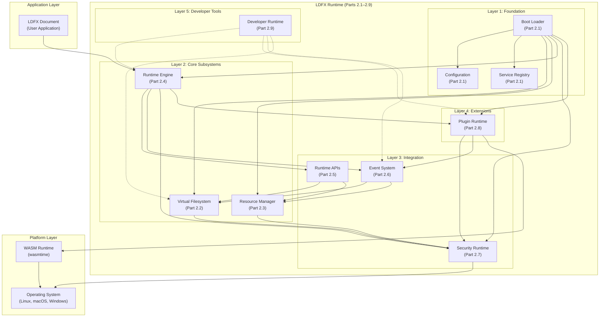

### 2.2 Layer Responsibilities

**Layer 1 — Foundation (Part 2.1)**
- Boot sequence orchestration
- Configuration loading and validation
- Service registry initialization
- Lifecycle state management
- Graceful shutdown

**Layer 2 — Core Subsystems (Parts 2.2, 2.3, 2.4)**
- Virtual Filesystem: File I/O, mounting, access control
- Resource Manager: Resource loading, caching, eviction
- Runtime Engine: Document execution, tick loop, state machine

**Layer 3 — Integration (Parts 2.5, 2.6, 2.7)**
- Runtime APIs: Expose runtime services to documents and plugins
- Event System: Coordinate subsystems via events
- Security Runtime: Enforce trust, permissions, and cryptography

**Layer 4 — Extensions (Part 2.8)**
- Plugin Runtime: Discover, load, manage, and sandbox plugins

**Layer 5 — Developer Tools (Part 2.9)**
- Developer Runtime: Debugging, profiling, inspection, testing

### 2.3 Subsystem Dependencies

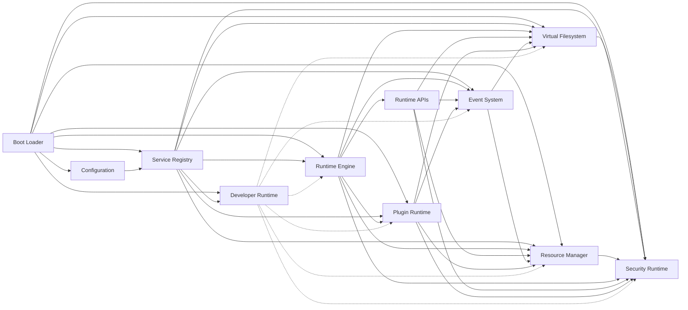

### 2.4 Ownership Model

| Subsystem | Owner | Responsible For |
|---|---|---|
| Boot Loader | Runtime Foundation | Orchestrating startup sequence |
| Configuration | Runtime Foundation | Loading and validating config |
| Service Registry | Runtime Foundation | Registering and discovering services |
| Virtual Filesystem | VFS Team | File I/O, mounting, access control |
| Resource Manager | Resource Team | Resource loading, caching, eviction |
| Runtime Engine | Engine Team | Document execution, tick loop |
| Runtime APIs | API Team | API namespaces, method dispatch |
| Event System | Event Team | Event bus, subscriptions, delivery |
| Security Runtime | Security Team | Cryptography, trust, permissions |
| Plugin Runtime | Plugin Team | Plugin discovery, loading, lifecycle |
| Developer Runtime | DevEx Team | Debugging, profiling, inspection |

### 2.5 Communication Model

Subsystems communicate through three mechanisms:

**1. Direct function calls** (synchronous, same-thread):
- Boot Loader calls subsystem init functions
- Runtime APIs call VFS and Resource Manager
- Security Runtime is called by all subsystems for permission checks

**2. Event Bus** (asynchronous, cross-subsystem):
- Runtime Engine emits `runtime.tick` events
- Plugin Runtime emits `plugin.loaded`, `plugin.crashed` events
- Event System delivers events to subscribers

**3. Async channels** (asynchronous, cross-thread):
- Developer Runtime communicates with subsystems via channels
- Plugin sandboxes communicate with Plugin Runtime via channels
- Resource Manager communicates with VFS via channels

---

## 3. Component Interaction Matrix

### 3.1 Interaction Matrix

| From | To | Interaction | Type | Frequency | Latency Budget |
|---|---|---|---|---|---|
| Runtime Engine | Event System | Emit tick events | Event | Every tick (60 Hz) | < 1 ms |
| Runtime Engine | Runtime APIs | Dispatch API calls | Function | On demand | < 5 ms |
| Runtime Engine | Resource Manager | Load resources | Async | On demand | < 100 ms |
| Runtime Engine | Virtual Filesystem | Read/write files | Async | On demand | < 50 ms |
| Runtime Engine | Plugin Runtime | Manage plugins | Function | On demand | < 10 ms |
| Runtime Engine | Security Runtime | Check permissions | Function | Every API call | < 1 µs |
| Runtime APIs | Virtual Filesystem | File I/O | Async | On demand | < 50 ms |
| Runtime APIs | Resource Manager | Resource access | Async | On demand | < 100 ms |
| Runtime APIs | Event System | Emit/subscribe events | Function | On demand | < 1 ms |
| Runtime APIs | Security Runtime | Permission checks | Function | Every call | < 1 µs |
| Event System | Plugin Runtime | Deliver events to plugins | Async | On demand | < 1 ms |
| Event System | Developer Runtime | Stream events | Async | Continuous | < 10 ms |
| Plugin Runtime | Virtual Filesystem | Plugin file access | Async | On demand | < 50 ms |
| Plugin Runtime | Resource Manager | Plugin resource access | Async | On demand | < 100 ms |
| Plugin Runtime | Security Runtime | Permission checks | Function | Every API call | < 1 µs |
| Plugin Runtime | Event System | Emit/subscribe events | Function | On demand | < 1 ms |
| Security Runtime | Virtual Filesystem | Read certificates | Async | On startup | < 100 ms |
| Developer Runtime | Runtime Engine | Inspect state | Function | On demand | < 10 ms |
| Developer Runtime | Plugin Runtime | Inspect plugins | Function | On demand | < 10 ms |
| Developer Runtime | Event System | Subscribe to events | Function | On demand | < 1 ms |

### 3.2 Subsystem Responsibilities

**Virtual Filesystem (Part 2.2)**
- Responsibilities: File I/O, mounting, access control, path resolution
- Dependencies: Security Runtime (permission checks)
- Interfaces: `VirtualFilesystem` trait with `read()`, `write()`, `open()`, `close()`, `stat()`, `list_dir()`
- Events: `vfs.file_opened`, `vfs.file_closed`, `vfs.file_read`, `vfs.file_written`
- Ownership: VFS Team
- Security: Path-based access control, permission enforcement
- Performance: Bounded latency < 50 ms for file operations

**Resource Manager (Part 2.3)**
- Responsibilities: Resource loading, caching, eviction, quota management
- Dependencies: Virtual Filesystem (load resources), Security Runtime (permission checks)
- Interfaces: `ResourceManager` trait with `load()`, `get()`, `release()`, `evict()`
- Events: `resource.loaded`, `resource.evicted`, `resource.failed`
- Ownership: Resource Team
- Security: Resource quota per plugin, permission enforcement
- Performance: Bounded latency < 100 ms for resource loads

**Runtime Engine (Part 2.4)**
- Responsibilities: Document execution, tick loop, state machine, lifecycle
- Dependencies: All subsystems (orchestrates them)
- Interfaces: `RuntimeEngine` trait with `boot()`, `run()`, `pause()`, `shutdown()`
- Events: `runtime.tick`, `runtime.state_changed`, `runtime.error`
- Ownership: Engine Team
- Security: Enforces runtime invariants, delegates to Security Runtime
- Performance: Tick rate 60 Hz, bounded latency per tick

**Runtime APIs (Part 2.5)**
- Responsibilities: Expose runtime services to documents and plugins
- Dependencies: Virtual Filesystem, Resource Manager, Event System, Security Runtime
- Interfaces: `RuntimeApi` trait with namespaced methods
- Events: `api.call_started`, `api.call_completed`, `api.call_failed`
- Ownership: API Team
- Security: Permission checks on every API call
- Performance: Bounded latency < 5 ms per API call

**Event System (Part 2.6)**
- Responsibilities: Event bus, subscriptions, delivery, routing
- Dependencies: Virtual Filesystem (event log storage)
- Interfaces: `EventBus` trait with `emit()`, `subscribe()`, `unsubscribe()`
- Events: `event.emitted`, `event.delivered`, `event.dropped`
- Ownership: Event Team
- Security: Event source validation, permission-based filtering
- Performance: Event delivery latency < 1 ms p99

**Security Runtime (Part 2.7)**
- Responsibilities: Cryptography, trust, permissions, audit logging
- Dependencies: Virtual Filesystem (read certificates)
- Interfaces: `SecurityRuntime` trait with `verify_signature()`, `check_capability()`, `assign_trust_level()`
- Events: `security.permission_denied`, `security.trust_revoked`, `security.signature_verified`
- Ownership: Security Team
- Security: Zero-trust model, fail-safe defaults
- Performance: Permission checks < 1 µs, signature verification < 100 ms

**Plugin Runtime (Part 2.8)**
- Responsibilities: Plugin discovery, loading, lifecycle, sandbox management
- Dependencies: Virtual Filesystem, Resource Manager, Event System, Security Runtime
- Interfaces: `PluginRuntime` trait with `discover()`, `load()`, `unload()`, `enable()`, `disable()`
- Events: `plugin.discovered`, `plugin.loaded`, `plugin.crashed`, `plugin.unloaded`
- Ownership: Plugin Team
- Security: WASM sandbox, permission enforcement, crash isolation
- Performance: Plugin load < 500 ms, event delivery < 1 ms

**Developer Runtime (Part 2.9)**
- Responsibilities: Debugging, profiling, inspection, testing
- Dependencies: All subsystems (read-only observation)
- Interfaces: `DeveloperApi` trait with `inspect()`, `debug()`, `profile()`, `test()`
- Events: `developer.breakpoint_hit`, `developer.profile_started`, `developer.profile_stopped`
- Ownership: DevEx Team
- Security: Developer mode gating, no state modification
- Performance: Instrumentation overhead < 2% CPU

---

## 4. Boot Process

### 4.1 Boot Sequence Overview

The LDFX Runtime boot process is a carefully orchestrated sequence of initialization steps. Each step depends on the previous step completing successfully. If any step fails, the boot process halts and reports the error.

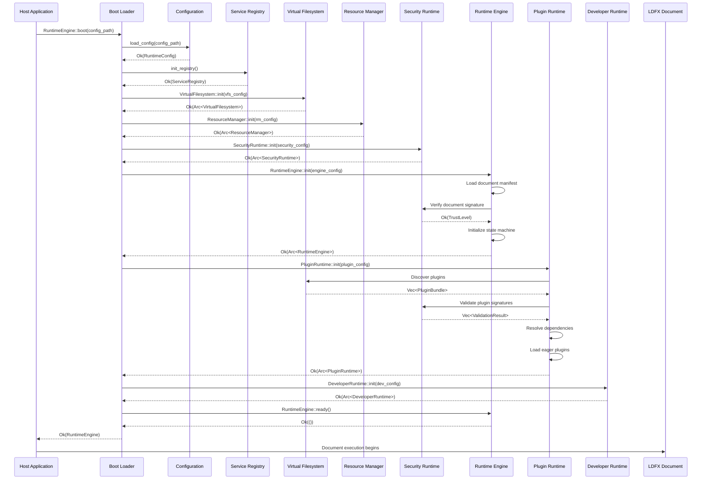

### 4.2 Boot Stages

**Stage 1: Configuration Loading**
- Load runtime configuration from `.ldfx/config.toml` or environment variables
- Validate configuration against schema
- Merge with defaults
- Output: `RuntimeConfig` struct

**Stage 2: Service Registry**
- Initialize the service registry
- Register all subsystem services
- Output: `ServiceRegistry` with all services registered

**Stage 3: Virtual Filesystem**
- Mount the document container as the root VFS
- Mount any additional VFS paths from configuration
- Verify all mount points are accessible
- Output: `Arc<VirtualFilesystem>` ready for I/O

**Stage 4: Resource Manager**
- Initialize resource cache
- Load resource configuration (cache size, eviction policy)
- Output: `Arc<ResourceManager>` ready to load resources

**Stage 5: Security Runtime**
- Load trust store (trusted CAs)
- Load certificate revocation lists (if configured)
- Initialize permission system
- Output: `Arc<SecurityRuntime>` ready to verify signatures and check permissions

**Stage 6: Runtime Engine**
- Load document manifest from VFS
- Verify document signature against trust store
- Assign trust level to document
- Initialize runtime state machine
- Output: `Arc<RuntimeEngine>` in `Initialized` state

**Stage 7: Plugin Runtime**
- Discover all plugins in configured repositories
- Validate each plugin's manifest and signature
- Resolve plugin dependencies (topological sort)
- Load eager plugins (trust level ≥ 3)
- Schedule lazy plugins for on-demand loading
- Output: `Arc<PluginRuntime>` with plugins loaded/scheduled

**Stage 8: Developer Runtime**
- If `developer_mode: true`, initialize debugging, profiling, inspection subsystems
- Start LDP protocol server on configured socket
- If `developer_mode: false`, initialize no-op stubs
- Output: `Arc<DeveloperRuntime>` ready for inspection

**Stage 9: Ready State**
- All subsystems initialized and ready
- Runtime transitions to `Running` state
- Document execution begins

### 4.3 Boot Failure Handling

If any boot stage fails:

1. All successfully initialized subsystems are shut down in reverse order
2. A detailed error report is generated with the failure stage and reason
3. The error is returned to the host application
4. The runtime is not left in a partially initialized state

**Boot failure scenarios**:

| Scenario | Stage | Recovery |
|---|---|---|
| Config file not found | 1 | Use defaults, retry |
| VFS mount fails | 3 | Check filesystem permissions, retry |
| Document signature invalid | 6 | Reject document, report error |
| Plugin dependency cycle | 7 | Report cycle, skip plugin, continue |
| Plugin signature invalid | 7 | Skip plugin, continue if not mandatory |
| LDP socket already in use | 8 | Use alternate socket, continue |

### 4.4 Boot Performance Budget

| Stage | Budget | Typical |
|---|---|---|
| Configuration loading | 10 ms | 2 ms |
| Service registry | 5 ms | 1 ms |
| VFS initialization | 50 ms | 10 ms |
| Resource Manager init | 10 ms | 2 ms |
| Security Runtime init | 100 ms | 50 ms |
| Runtime Engine init | 50 ms | 20 ms |
| Plugin discovery | 200 ms | 100 ms |
| Plugin validation | 500 ms | 300 ms |
| Plugin dependency resolution | 100 ms | 50 ms |
| Eager plugin loading | 1000 ms | 500 ms |
| Developer Runtime init | 50 ms | 10 ms |
| **Total boot time** | **2075 ms** | **1045 ms** |

---

## 5. Runtime Lifecycle

### 5.1 Runtime State Machine

```mermaid
stateDiagram-v2
    [*] --> Created: RuntimeEngine::new()
    Created --> Verified: verify_document()
    Verified --> Initialized: initialize_subsystems()
    Initialized --> Loading: load_plugins()
    Loading --> Running: ready()
    Running --> Idle: no_active_operations()
    Idle --> Running: operation_triggered()
    Running --> Paused: pause()
    Paused --> Running: resume()
    Running --> Suspended: suspend_for_resource_pressure()
    Suspended --> Running: resume()
    Running --> Updating: hot_reload_plugin()
    Updating --> Running: reload_complete()
    Running --> Recovering: error_detected()
    Recovering --> Running: recovery_successful()
    Recovering --> Closing: recovery_failed()
    Running --> Closing: shutdown()
    Paused --> Closing: shutdown()
    Idle --> Closing: shutdown()
    Suspended --> Closing: shutdown()
    Updating --> Closing: shutdown()
    Recovering --> Closing: shutdown()
    Closing --> Destroyed: cleanup_complete()
    Destroyed --> [*]
```

### 5.2 State Descriptions

**Created**: Runtime object instantiated but not yet initialized. No subsystems are active.

**Verified**: Document has been loaded and cryptographically verified. Manifest is valid. Trust level assigned.

**Initialized**: All subsystems initialized. VFS mounted. Security Runtime ready. Plugin Runtime ready. Runtime Engine ready.

**Loading**: Eager plugins are being loaded. Dependency resolution in progress. WASM compilation in progress.

**Running**: Document is executing. Plugins are active. Events are flowing. APIs are responding to calls.

**Idle**: Document is running but no active operations. Waiting for events or API calls. CPU usage minimal.

**Paused**: Document execution paused (via `pause()` API or debugger breakpoint). Plugins are paused. Event queue accumulating.

**Suspended**: Document suspended due to resource pressure (memory, CPU). Plugins paused. Resources may be evicted.

**Updating**: A plugin is being hot-reloaded. Old instance still running. New instance being loaded. Transition is atomic.

**Recovering**: An error was detected (plugin crash, resource load failure, API error). Recovery procedures running. May transition back to Running or to Closing.

**Closing**: Shutdown initiated. All plugins being unloaded. Resources being released. Subsystems being shut down in reverse order.

**Destroyed**: All cleanup complete. Runtime object can be deallocated.

### 5.3 State Transitions

**Created → Verified**: Triggered by `verify_document()`. Document manifest loaded and signature verified.

**Verified → Initialized**: Triggered by `initialize_subsystems()`. All subsystems initialized.

**Initialized → Loading**: Triggered by `load_plugins()`. Plugin discovery and loading begins.

**Loading → Running**: Triggered by `ready()`. All eager plugins loaded. Runtime ready for execution.

**Running → Idle**: Automatic transition when no operations are active for > 100 ms.

**Idle → Running**: Automatic transition when an operation is triggered (event, API call, timer).

**Running ↔ Paused**: Triggered by `pause()` / `resume()` API or debugger.

**Running → Suspended**: Automatic transition when memory usage > 80% of budget or CPU throttling detected.

**Suspended → Running**: Automatic transition when resource pressure relieved.

**Running → Updating**: Triggered by `hot_reload(plugin_id)`. Old plugin instance paused.

**Updating → Running**: Automatic transition when new plugin instance initialized successfully.

**Running → Recovering**: Automatic transition when an error is detected (plugin crash, resource failure).

**Recovering → Running**: Automatic transition when recovery procedures complete successfully.

**Recovering → Closing**: Automatic transition when recovery fails and error is unrecoverable.

**Any → Closing**: Triggered by `shutdown()` API.

**Closing → Destroyed**: Automatic transition when all cleanup complete.

### 5.4 Safe Mode

If the runtime detects a critical error during boot or execution, it enters **Safe Mode**:

- All plugins are disabled
- Only essential APIs are available
- The document can still execute but with limited functionality
- Developers can inspect the runtime state and diagnose the problem
- The runtime remains running and responsive

Safe Mode is triggered by:
- Plugin dependency cycle detected
- Plugin signature verification failure (non-mandatory plugin)
- Resource load failure (non-critical resource)
- API error that does not affect core functionality

### 5.5 Crash Recovery

When a plugin crashes:

1. The plugin transitions to `Crashed` state
2. A crash report is generated
3. The plugin's event queue is cleared
4. The plugin's IPC channels are closed
5. The plugin's resources are released
6. Other plugins continue running normally
7. The document continues executing

The crashed plugin can be:
- Manually reloaded via `reload()` API
- Automatically restarted (if configured with `auto_restart: true`)
- Left in Crashed state for debugging

### 5.6 Restart

The runtime can be restarted without restarting the host application:

1. `shutdown()` is called
2. All plugins are unloaded
3. All resources are released
4. All subsystems are shut down
5. The runtime transitions to `Destroyed` state
6. A new runtime can be created and booted

---

## 6. Communication Architecture

### 6.1 Communication Patterns

The LDFX Runtime uses three communication patterns:

**Pattern 1: Synchronous Function Calls**
- Used for: Permission checks, state queries, configuration
- Latency: < 1 µs to < 10 ms
- Blocking: Yes (but very short duration)
- Example: `SecurityRuntime::check_capability(plugin_id, capability)`

**Pattern 2: Asynchronous Events**
- Used for: Subsystem coordination, plugin notifications, state changes
- Latency: < 1 ms to < 100 ms
- Blocking: No (non-blocking channels)
- Example: `EventBus::emit(event)` → subscribers notified asynchronously

**Pattern 3: Async Channels**
- Used for: Long-running operations, I/O, cross-thread communication
- Latency: < 50 ms to < 500 ms
- Blocking: No (async/await)
- Example: `VirtualFilesystem::read(path)` → returns `Future<Bytes>`

### 6.2 Message Flow Diagram

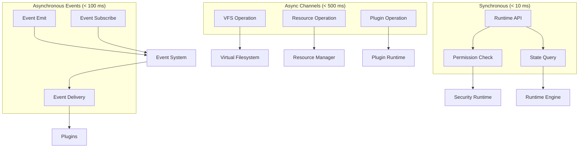

### 6.3 Event Flow

Events flow through the system in a directed acyclic graph (DAG):

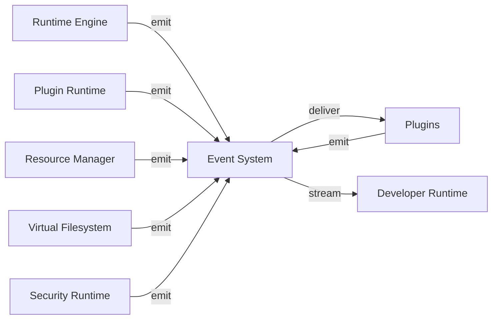

### 6.4 Dependency Graph


### 6.5 Subsystem Interfaces

**Virtual Filesystem Interface**
```
trait VirtualFilesystem {
    async fn read(&self, path: VfsPath) -> Result<Bytes>;
    async fn write(&self, path: VfsPath, data: Bytes) -> Result<()>;
    async fn open(&self, path: VfsPath, mode: OpenMode) -> Result<FileHandle>;
    async fn close(&self, handle: FileHandle) -> Result<()>;
    async fn stat(&self, path: VfsPath) -> Result<FileMetadata>;
    async fn list_dir(&self, path: VfsPath) -> Result<Vec<DirEntry>>;
}
```

**Resource Manager Interface**
```
trait ResourceManager {
    async fn load(&self, resource_id: ResourceId) -> Result<Arc<Resource>>;
    async fn get(&self, resource_id: ResourceId) -> Result<Option<Arc<Resource>>>;
    async fn release(&self, resource_id: ResourceId) -> Result<()>;
    async fn evict(&self, resource_id: ResourceId) -> Result<()>;
}
```

**Runtime Engine Interface**
```
trait RuntimeEngine {
    async fn boot(&mut self, config: RuntimeConfig) -> Result<()>;
    async fn run(&mut self) -> Result<()>;
    async fn pause(&mut self) -> Result<()>;
    async fn resume(&mut self) -> Result<()>;
    async fn shutdown(&mut self) -> Result<()>;
    fn state(&self) -> RuntimeState;
}
```

**Event System Interface**
```
trait EventBus {
    fn emit(&self, event: Event) -> Result<()>;
    fn subscribe(&self, event_type: EventType) -> Receiver<Event>;
    fn unsubscribe(&self, subscription_id: SubscriptionId) -> Result<()>;
}
```

**Security Runtime Interface**
```
trait SecurityRuntime {
    fn check_capability(&self, plugin_id: &PluginId, capability: &Capability) -> Result<()>;
    async fn verify_signature(&self, data: &[u8], signature: &Signature) -> Result<()>;
    fn assign_trust_level(&self, plugin_id: &PluginId, level: TrustLevel) -> Result<()>;
}
```

**Plugin Runtime Interface**
```
trait PluginRuntime {
    async fn discover(&self) -> Result<Vec<PluginBundle>>;
    async fn load(&self, plugin_id: &PluginId) -> Result<()>;
    async fn unload(&self, plugin_id: &PluginId) -> Result<()>;
    async fn enable(&self, plugin_id: &PluginId) -> Result<()>;
    async fn disable(&self, plugin_id: &PluginId) -> Result<()>;
}
```

**Runtime API Interface**
```
trait RuntimeApi {
    async fn call(&self, namespace: &str, method: &str, args: Value) -> Result<Value>;
}
```

---

## 7. Data Flow

### 7.1 End-to-End Data Flow

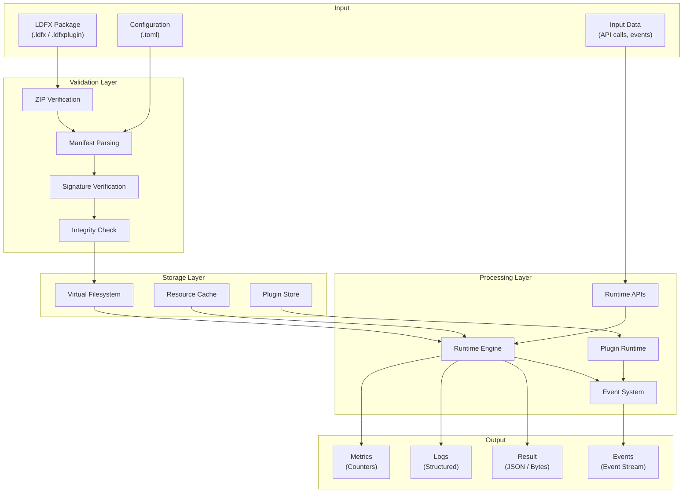

### 7.2 Read Operation Flow

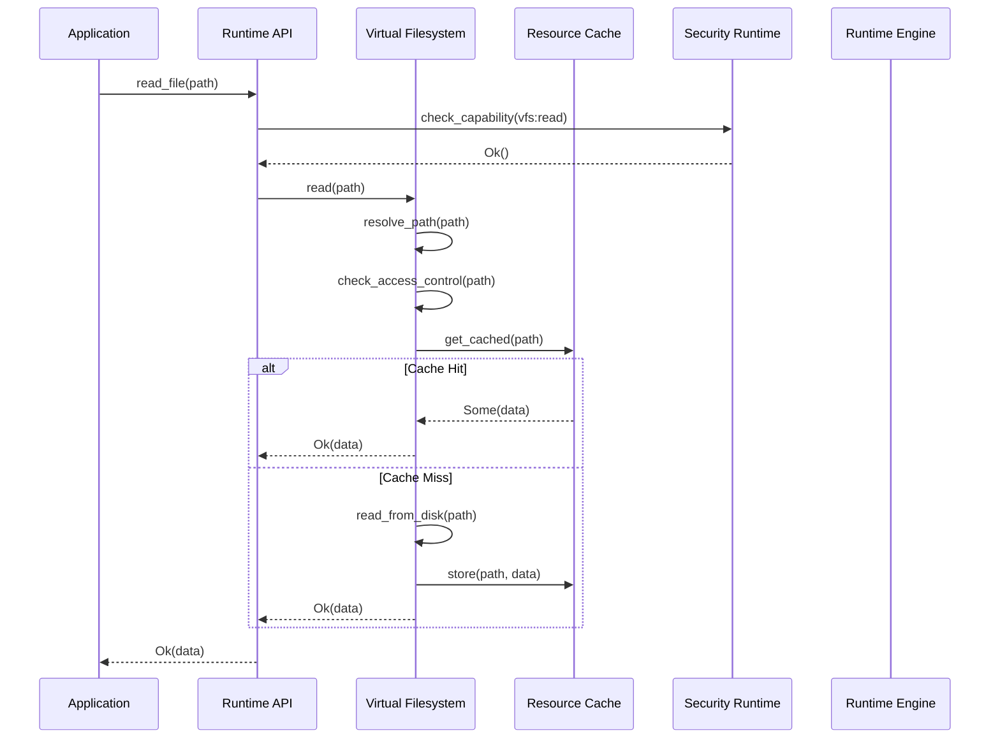

### 7.3 Write Operation Flow

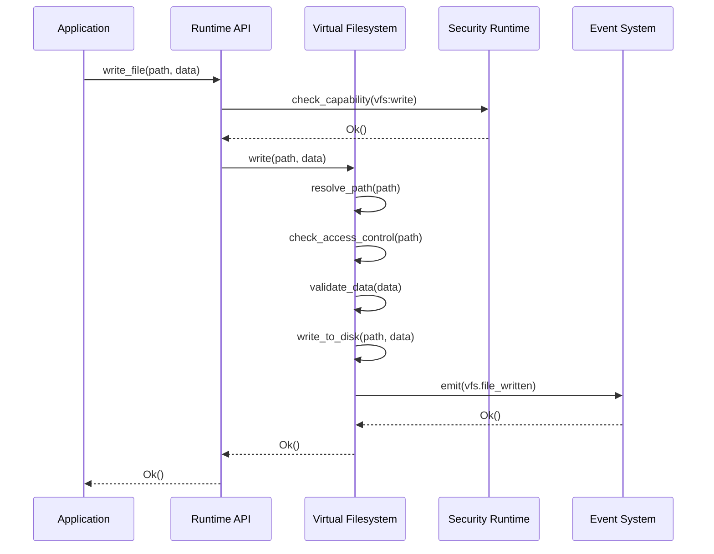

### 7.4 Event Flow

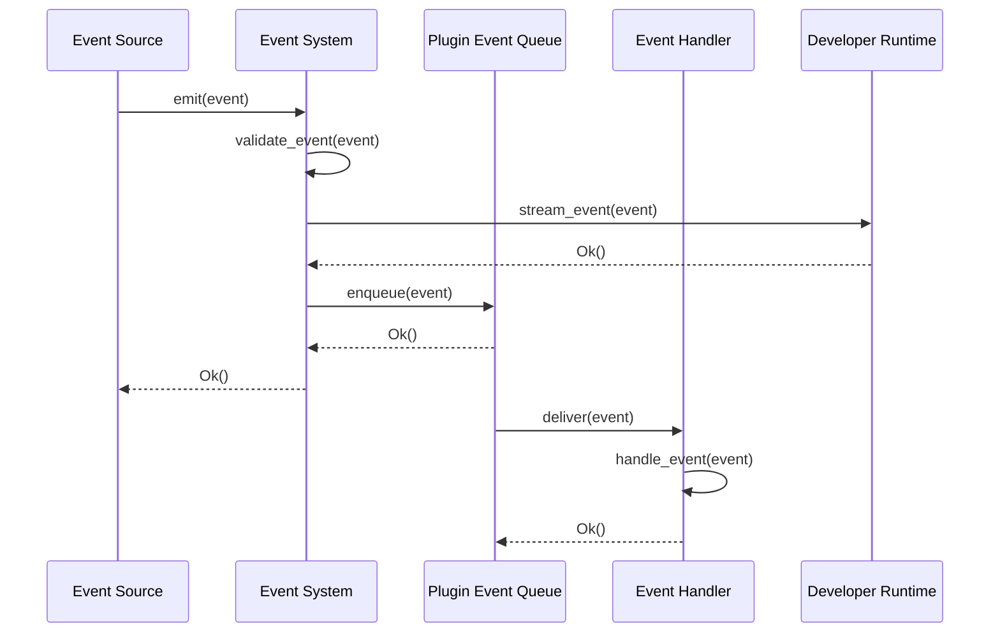

### 7.5 Plugin Load Flow

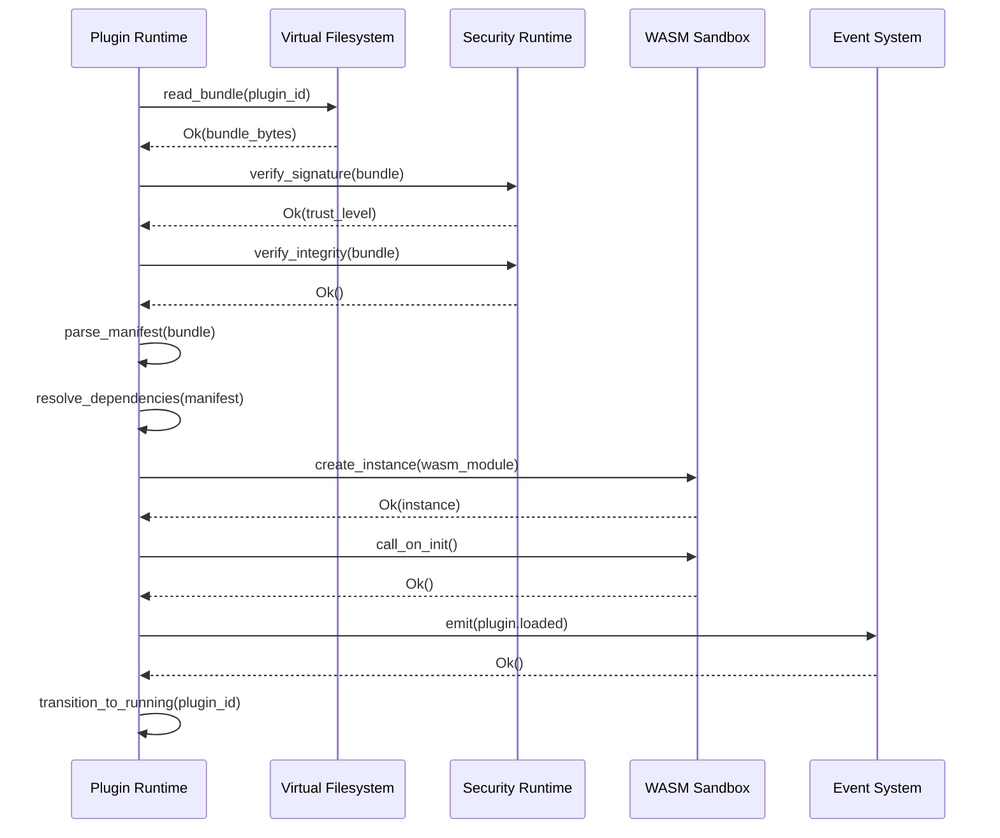

### 7.6 API Call Flow

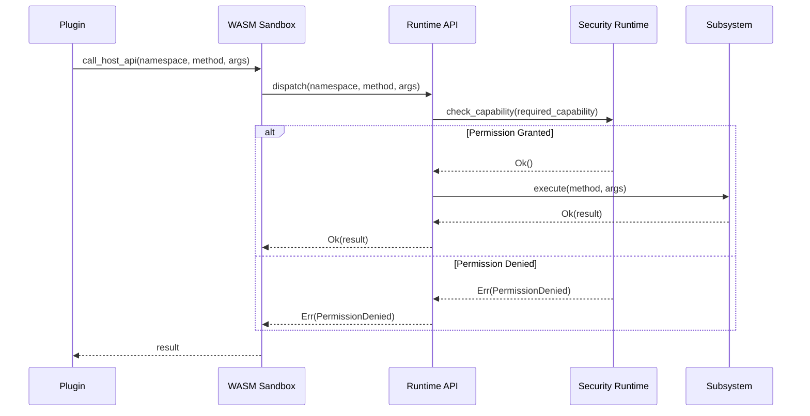

### 7.7 Caching Strategy

The runtime uses a multi-level caching strategy:

**Level 1: VFS File Cache**
- Caches recently read files in memory
- LRU eviction policy
- Size limit: configurable (default 100 MiB)
- TTL: configurable (default 5 minutes)

**Level 2: Resource Cache**
- Caches loaded resources (images, data, etc.)
- LRU eviction policy
- Size limit: configurable (default 500 MiB)
- Per-plugin quota: configurable

**Level 3: Compiled Plugin Cache**
- Caches compiled WASM modules
- Persistent on disk
- Invalidated on plugin update
- Size limit: configurable (default 1 GiB)

**Cache Invalidation**:
- File cache invalidated on write
- Resource cache invalidated on resource update
- Plugin cache invalidated on plugin update or signature change

### 7.8 Streaming

Large data transfers use streaming to avoid buffering entire payloads in memory:

**File streaming**: `read_file_stream(path)` returns an async stream of chunks
**Resource streaming**: `load_resource_stream(id)` returns an async stream of chunks
**Event streaming**: `subscribe_events()` returns an async stream of events
**Log streaming**: `subscribe_logs()` returns an async stream of log entries

---

## 8. Security Integration

### 8.1 Security Architecture

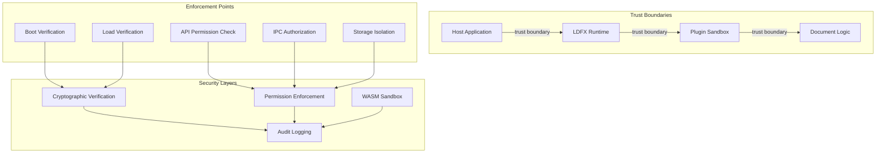

### 8.2 Trust Model

The LDFX Runtime uses a **zero-trust security model**:

- No plugin is trusted by default
- Every plugin runs in a sandbox
- Every API call is permission-checked
- Every file access is validated
- Every network operation is logged
- Trust is earned through cryptographic verification

**Trust levels** (assigned by Security Runtime based on certificate chain):

| Level | Name | Sandbox | Heap | Permissions |
|---|---|---|---|---|
| 0 | Untrusted | Strict | 4 MiB | Minimal |
| 1 | Community | Strict | 8 MiB | Limited |
| 2 | Verified | Standard | 16 MiB | Standard |
| 3 | Trusted | Relaxed | 32 MiB | Extended |
| 4 | Privileged | Minimal | 64 MiB | Full |
| 5 | System | None | 128 MiB | Unrestricted |

### 8.3 Sandboxing

Every plugin runs in a WASM sandbox with the following restrictions:

**Memory isolation**: Plugin cannot access host memory outside its WASM linear memory.

**System call isolation**: Plugin cannot make system calls. All I/O goes through host APIs.

**Network isolation**: Plugin cannot make network requests. All network access goes through host APIs.

**Filesystem isolation**: Plugin can only access files it has permission for. Access is mediated by the VFS.

**Resource isolation**: Plugin has a memory budget. Exceeding the budget causes the plugin to crash.

**Execution isolation**: Plugin execution is time-limited. Infinite loops cause the plugin to crash.

### 8.4 Permission Enforcement

Every Runtime API call is permission-checked:

```
API Call Flow:
  1. Plugin calls host API
  2. Runtime API dispatcher receives call
  3. Dispatcher looks up required capability
  4. Dispatcher calls SecurityRuntime::check_capability(plugin_id, capability)
  5. SecurityRuntime checks:
     - Is capability in plugin's manifest permissions?
     - Is capability granted at runtime (user override)?
     - Is capability revoked?
  6. If all checks pass: API executes
  7. If any check fails: PermissionDenied error returned
```

### 8.5 Integrity Validation

Every document and plugin is validated before execution:

**Document validation**:
1. ZIP structure verified
2. Manifest parsed and validated against schema
3. Manifest signature verified against trust store
4. All files in manifest integrity list are hashed and compared
5. Document is assigned a trust level

**Plugin validation**:
1. ZIP structure verified
2. Manifest parsed and validated against schema
3. Manifest signature verified against trust store
4. All files in manifest integrity list are hashed and compared
5. Plugin is assigned a trust level
6. Dependencies are resolved and validated

### 8.6 Cryptographic Verification

The Security Runtime performs all cryptographic operations:

**Signature verification**:
- Algorithm: ECDSA with SHA-256
- Certificate chain validation: Verifies chain leads to trusted root CA
- Timestamp validation: Verifies signature timestamp is within certificate validity period
- Revocation checking: Checks certificate revocation list (if configured)

**Integrity checking**:
- Algorithm: SHA-256
- All files in manifest integrity list are hashed
- Hashes are compared to manifest values
- Any mismatch causes validation failure

### 8.7 Runtime Monitoring

The Security Runtime continuously monitors for security violations:

**Permission denial tracking**: Every permission denial is logged with timestamp, plugin ID, and capability.

**Trust revocation**: If a certificate is revoked, all plugins signed by that certificate are immediately disabled.

**Anomaly detection**: Unusual permission denial patterns are flagged (e.g., plugin repeatedly requesting denied capability).

**Audit logging**: All security-relevant events are logged to a tamper-evident audit log.

### 8.8 Plugin Isolation

Plugins are isolated from each other:

**Memory isolation**: Each plugin has its own WASM linear memory. Plugins cannot access each other's memory.

**Storage isolation**: Each plugin has its own key-value storage namespace. Plugins cannot access each other's storage.

**Event isolation**: Events are routed based on subscription. A plugin only receives events it subscribed to.

**IPC authorization**: A plugin can only send IPC messages to plugins it has declared as dependencies or been granted explicit IPC permission for.

### 8.9 AI Isolation (Future)

When AI plugins are supported (future release), they will be isolated in a dedicated sandbox with:

- Restricted model access (only approved models)
- Input/output filtering (no sensitive data)
- Rate limiting (prevent resource exhaustion)
- Audit logging (all AI operations logged)

---

## 9. Plugin Integration

### 9.1 Plugin Lifecycle

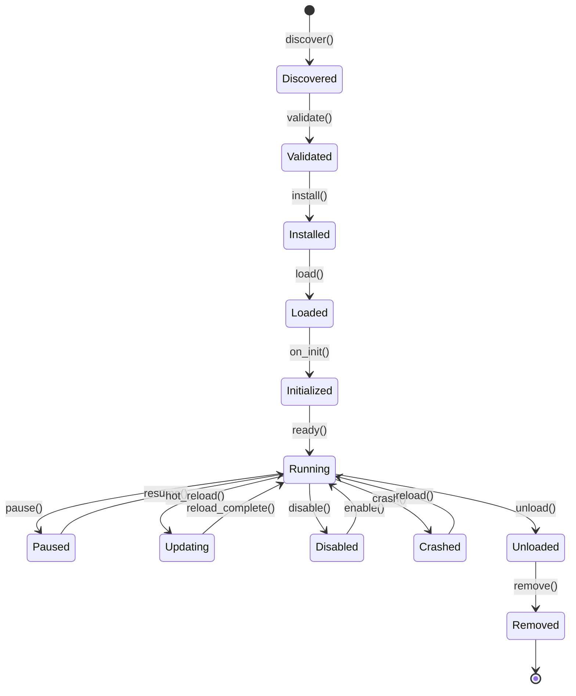

### 9.2 Plugin Discovery

Plugin discovery scans configured repositories for plugin bundles:

```
Discovery Process:
  1. Scan local plugin directory (.ldfx/plugins/)
  2. Scan container plugins/ directory
  3. Scan configured external repositories
  4. For each .ldfxplugin file found:
     - Extract manifest
     - Record plugin ID, version, author
     - Add to discovered plugins list
  5. Return list of discovered plugins
```

### 9.3 Plugin Validation

Each discovered plugin is validated:

```
Validation Process:
  1. Parse manifest JSON
  2. Validate manifest against schema
  3. Verify manifest signature
  4. Verify file integrity hashes
  5. Check manifest schema version compatibility
  6. Assign trust level based on certificate chain
  7. Return ValidationResult (Ok or specific error)
```

### 9.4 Plugin Loading

Validated plugins are loaded:

```
Loading Process:
  1. Extract WASM module from bundle
  2. Compile WASM module (or load from cache)
  3. Create WASM instance
  4. Allocate sandbox memory budget
  5. Create plugin-scoped storage namespace
  6. Create plugin event queue
  7. Call on_init() hook
  8. Transition to Initialized state
```

### 9.5 Plugin Registration

Loaded plugins are registered in the Plugin Runtime:

```
Registration Process:
  1. Add plugin to plugin registry
  2. Register plugin's exported APIs
  3. Register plugin's event subscriptions
  4. Register plugin's IPC channels
  5. Emit plugin.loaded event
  6. Transition to Running state
```

### 9.6 Plugin Communication

Plugins communicate through three mechanisms:

**1. Events**: Plugins emit and subscribe to events via the Event Bus.

**2. IPC**: Plugins exchange messages via named IPC channels.

**3. Shared APIs**: Plugins expose APIs that other plugins can call.

### 9.7 Plugin Permissions

Plugins declare permissions in their manifest:

```json
{
  "permissions": {
    "vfs": ["read:assets/**", "write:documents/**"],
    "events": ["subscribe:document.*", "emit:custom.*"],
    "ipc": ["send:com.example.other-plugin"],
    "storage": ["read", "write"],
    "resources": ["load:images/*"]
  }
}
```

Permissions are enforced at runtime. A plugin without a permission cannot perform the corresponding operation.

### 9.8 Plugin Updates

Plugins can be updated via hot reload:

```
Hot Reload Process:
  1. Validate new plugin bundle
  2. Compile new WASM module
  3. Create new plugin instance
  4. Call on_init() on new instance
  5. Pause old instance
  6. Redirect new events to new instance
  7. Drain old instance's event queue
  8. Unload old instance
  9. Transition to Running with new instance
```

Hot reload is atomic — the plugin is never in an inconsistent state.

### 9.9 Plugin Removal

Plugins can be uninstalled:

```
Removal Process:
  1. Disable plugin (if running)
  2. Unload plugin (destroy WASM instance)
  3. Close all IPC channels
  4. Clear plugin storage
  5. Remove plugin bundle from install store
  6. Emit plugin.removed event
  7. Transition to Removed state
```

### 9.10 Plugin Recovery

If a plugin crashes:

```
Recovery Process:
  1. Capture crash report
  2. Emit plugin.crashed event
  3. Transition to Crashed state
  4. Clear plugin event queue
  5. Close IPC channels
  6. Release plugin resources
  7. Other plugins continue running
  8. Plugin can be manually reloaded or auto-restarted
```

---

## 10. Runtime API Integration

### 10.1 API Architecture

The Runtime APIs (Part 2.5) expose runtime services to documents and plugins through a namespace-based interface:

```
RuntimeApi
├── document.*          # Document lifecycle and state
├── plugin.*            # Plugin management
├── resource.*          # Resource loading and access
├── storage.*           # Plugin-scoped key-value storage
├── event.*             # Event emission and subscription
├── vfs.*               # Virtual filesystem access
├── security.*          # Security and permission queries
├── performance.*       # Performance monitoring
└── diagnostics.*       # Diagnostics and health checks
```

### 10.2 Namespace Interactions

**document namespace**:
- `document.id()` — Get document ID
- `document.title()` — Get document title
- `document.state()` — Get current state
- `document.metadata()` — Get document metadata
- `document.close()` — Close document (requires permission)

**plugin namespace**:
- `plugin.list()` — List all plugins
- `plugin.info(id)` — Get plugin info
- `plugin.enable(id)` — Enable plugin (requires permission)
- `plugin.disable(id)` — Disable plugin (requires permission)
- `plugin.reload(id)` — Hot-reload plugin (requires permission)

**resource namespace**:
- `resource.load(id)` — Load a resource
- `resource.get(id)` — Get cached resource
- `resource.release(id)` — Release resource
- `resource.list()` — List available resources

**storage namespace**:
- `storage.get(key)` — Get value from plugin storage
- `storage.set(key, value)` — Set value in plugin storage
- `storage.delete(key)` — Delete value from plugin storage
- `storage.list_keys()` — List all keys in plugin storage
- `storage.clear()` — Clear all plugin storage

**event namespace**:
- `event.emit(type, payload)` — Emit an event
- `event.subscribe(type)` — Subscribe to events
- `event.unsubscribe(subscription_id)` — Unsubscribe from events

**vfs namespace**:
- `vfs.read(path)` — Read file
- `vfs.write(path, data)` — Write file
- `vfs.stat(path)` — Get file metadata
- `vfs.list_dir(path)` — List directory

**security namespace**:
- `security.has_permission(capability)` — Check if plugin has permission
- `security.trust_level()` — Get plugin's trust level
- `security.audit_log()` — Get permission audit log

**performance namespace**:
- `performance.metrics()` — Get runtime metrics
- `performance.profile_start()` — Start profiling
- `performance.profile_stop()` — Stop profiling

**diagnostics namespace**:
- `diagnostics.health()` — Get runtime health status
- `diagnostics.report()` — Get diagnostics report
- `diagnostics.logs()` — Get runtime logs

### 10.3 Permission Checks

Every API call is permission-checked:

```
API Call Permission Check:
  1. Plugin calls API method
  2. Runtime API dispatcher receives call
  3. Dispatcher looks up required capability for method
  4. Dispatcher calls SecurityRuntime::check_capability(plugin_id, capability)
  5. SecurityRuntime checks:
     - Is capability in plugin's manifest permissions?
     - Is capability granted at runtime (user override)?
     - Is capability revoked?
  6. If all checks pass: API executes
  7. If any check fails: PermissionDenied error returned
```

### 10.4 Event Integration

APIs emit events for all significant operations:

| API Call | Event Emitted |
|---|---|
| `plugin.enable(id)` | `plugin.enabled` |
| `plugin.disable(id)` | `plugin.disabled` |
| `plugin.reload(id)` | `plugin.reloading`, `plugin.reloaded` |
| `resource.load(id)` | `resource.loading`, `resource.loaded` |
| `storage.set(key, value)` | `storage.changed` |
| `event.emit(type, payload)` | `type` (custom event) |
| `vfs.write(path, data)` | `vfs.file_written` |

### 10.5 Version Negotiation

APIs support version negotiation to enable forward compatibility:

```
Version Negotiation:
  1. Plugin declares supported API versions in manifest
  2. Runtime checks if declared versions are supported
  3. If supported: Use declared version
  4. If not supported: Use highest compatible version
  5. If no compatible version: Return VersionNotSupported error
```

### 10.6 SDK Integration

Each SDK (JavaScript, Rust, C#, Go, Java, Swift, Kotlin) provides typed wrappers around the Runtime APIs:

**Rust SDK**:
```rust
let api = runtime.api();
let plugins = api.plugin.list().await?;
let metrics = api.performance.metrics().await?;
```

**TypeScript SDK**:
```typescript
const api = client.api();
const plugins = await api.plugin.list();
const metrics = await api.performance.metrics();
```

**Go SDK**:
```go
api := runtime.API()
plugins, err := api.Plugin.List(ctx)
metrics, err := api.Performance.Metrics(ctx)
```

---

## 11. Performance Architecture

### 11.1 Performance Budgets

The runtime defines performance budgets for all critical operations:

| Operation | Budget | Typical | P99 |
|---|---|---|---|
| Boot time | 2075 ms | 1045 ms | 1500 ms |
| Plugin load | 500 ms | 300 ms | 400 ms |
| API call | 5 ms | 1 ms | 3 ms |
| Permission check | 1 µs | 0.5 µs | 2 µs |
| Event delivery | 1 ms | 0.5 ms | 2 ms |
| File read | 50 ms | 10 ms | 30 ms |
| Resource load | 100 ms | 50 ms | 80 ms |
| Tick duration | 16.67 ms | 5 ms | 10 ms |

### 11.2 Startup Optimization

**Parallel initialization**: Independent subsystems initialize in parallel:
- VFS and Resource Manager initialize concurrently
- Security Runtime initializes concurrently
- Plugin discovery and validation run in parallel

**Lazy loading**: Plugins with trust level < 3 are loaded on-demand, not upfront.

**Background loading**: Plugins with `load_strategy: Background` are loaded on a background thread.

**Caching**: Compiled WASM modules are cached on disk to avoid recompilation.

### 11.3 Memory Budget

| Component | Budget | Typical |
|---|---|---|
| Runtime Engine | 50 MiB | 20 MiB |
| Virtual Filesystem | 100 MiB | 50 MiB |
| Resource Manager | 500 MiB | 200 MiB |
| Event System | 50 MiB | 20 MiB |
| Security Runtime | 10 MiB | 5 MiB |
| Plugin Runtime | 100 MiB | 50 MiB |
| Developer Runtime | 50 MiB | 10 MiB |
| Per-plugin WASM heap | 4–128 MiB | 16 MiB |
| **Total (50 plugins)** | **2 GiB** | **1 GiB** |

### 11.4 CPU Targets

| Operation | Target |
|---|---|
| Idle CPU usage | < 1% |
| Boot CPU usage | < 80% (parallel initialization) |
| Tick CPU usage | < 10% (per tick) |
| Plugin load CPU usage | < 50% (WASM compilation) |
| Profiling overhead | < 2% |

### 11.5 Cache Strategy

**VFS file cache**:
- LRU eviction
- Size limit: 100 MiB (configurable)
- TTL: 5 minutes (configurable)

**Resource cache**:
- LRU eviction
- Size limit: 500 MiB (configurable)
- Per-plugin quota: 50 MiB (configurable)

**Plugin WASM cache**:
- Persistent on disk
- Size limit: 1 GiB (configurable)
- Invalidated on plugin update

### 11.6 Lazy Loading

Plugins are loaded lazily based on trust level:

| Trust Level | Load Strategy |
|---|---|
| 0–2 | Lazy (on first use) |
| 3–4 | Eager (during boot) |
| 5 | Eager (during boot) |

Lazy loading reduces boot time for documents with many low-trust plugins.

### 11.7 Parallel Initialization

Independent subsystems initialize in parallel:

```
Boot Timeline:
  T=0ms:   Start boot
  T=0ms:   Config loading (10ms)
  T=0ms:   VFS init (50ms) ─┐
  T=0ms:   RM init (10ms)   ├─ Parallel
  T=0ms:   SR init (100ms) ─┤
  T=100ms: RE init (50ms)
  T=150ms: PR init (500ms)
  T=650ms: DR init (50ms)
  T=700ms: Ready
```

### 11.8 Background Work

Long-running operations are moved to background threads:

- Plugin compilation (WASM)
- Resource loading
- Signature verification
- Dependency resolution

Background work does not block the main runtime thread.

### 11.9 Scheduling

The runtime uses a priority-based scheduler:

| Priority | Operations |
|---|---|
| Critical | Permission checks, event delivery, API calls |
| High | Plugin initialization, resource loading |
| Normal | Profiling, logging, diagnostics |
| Low | Cache eviction, cleanup |

### 11.10 Resource Optimization

**Memory optimization**:
- Shared libraries reduce memory usage
- String interning for common strings
- Lazy allocation for optional fields

**CPU optimization**:
- Caching of compiled WASM modules
- Memoization of permission checks
- Batch event delivery

**I/O optimization**:
- Streaming for large files
- Buffered writes
- Async I/O throughout

---

## 12. Fault Tolerance

### 12.1 Error Propagation

Errors propagate through the runtime in a structured way:

```
Error Propagation:
  1. Error occurs in subsystem
  2. Subsystem returns Result<T, Error>
  3. Caller handles error or propagates
  4. Error reaches Runtime Engine
  5. Runtime Engine logs error
  6. Runtime Engine emits error event
  7. Runtime Engine transitions to appropriate state
```

### 12.2 Recovery Strategies

**Plugin crash recovery**:
- Plugin transitions to Crashed state
- Other plugins continue running
- Plugin can be manually reloaded
- Plugin can be auto-restarted (if configured)

**Resource load failure recovery**:
- Resource transitions to Failed state
- Dependent operations fail gracefully
- Resource can be retried
- Fallback resource can be used (if configured)

**API error recovery**:
- API call returns error
- Caller handles error
- Runtime continues running

**Subsystem error recovery**:
- Subsystem detects error
- Subsystem enters degraded mode
- Runtime continues with reduced functionality
- Error is logged and reported

### 12.3 Fallback Mechanisms

**Fallback resources**: If a resource fails to load, a fallback resource can be used.

**Fallback plugins**: If a plugin fails to load, a fallback plugin can be used (if configured).

**Fallback APIs**: If an API is unavailable, a fallback implementation can be used.

### 12.4 Safe Mode

If the runtime detects a critical error, it enters Safe Mode:

- All plugins are disabled
- Only essential APIs are available
- The document can still execute but with limited functionality
- Developers can inspect the runtime state and diagnose the problem

Safe Mode is triggered by:
- Plugin dependency cycle detected
- Plugin signature verification failure (non-mandatory plugin)
- Resource load failure (non-critical resource)
- API error that does not affect core functionality

### 12.5 Isolation

Errors in one plugin do not affect other plugins:

- Plugin crash does not crash other plugins
- Plugin memory leak does not affect other plugins
- Plugin infinite loop does not affect other plugins
- Plugin permission denial does not affect other plugins

### 12.6 Retry Logic

Failed operations are retried with exponential backoff:

```
Retry Logic:
  1. Operation fails
  2. Wait 100ms, retry
  3. If fails again: wait 200ms, retry
  4. If fails again: wait 400ms, retry
  5. If fails again: wait 800ms, retry
  6. If fails again: give up, return error
```

Maximum retries: 5 (configurable)

### 12.7 Crash Handling

When a plugin crashes:

```
Crash Handling:
  1. WASM trap detected
  2. Sandbox captures crash context
  3. Crash report generated
  4. plugin.crashed event emitted
  5. Plugin transitions to Crashed state
  6. Plugin's event queue cleared
  7. Plugin's IPC channels closed
  8. Plugin's resources released
  9. Other plugins continue running
```

### 12.8 Corruption Handling

If runtime state is detected to be corrupted:

```
Corruption Handling:
  1. Corruption detected
  2. Affected subsystem enters safe mode
  3. Corruption is logged
  4. Diagnostics report generated
  5. Runtime continues with reduced functionality
  6. User is notified
```

### 12.9 Self-Diagnostics

The runtime continuously monitors itself for problems:

**Health checks** (every 5 seconds):
- Tick rate within bounds
- No stuck operations
- Event bus not saturated
- No plugins in Crashed state
- Memory usage within bounds

**Anomaly detection**:
- Unusual permission denial patterns
- Unusual event throughput
- Unusual memory growth
- Unusual CPU usage

**Automatic recovery**:
- Restart stuck operations
- Evict resources under memory pressure
- Disable misbehaving plugins

---

## 13. Observability

### 13.1 Logging

The runtime emits structured log events for all significant operations:

**Log levels**:
- `TRACE`: Extremely verbose internal state (disabled in production)
- `DEBUG`: Detailed diagnostic information
- `INFO`: Normal operational events
- `WARN`: Recoverable anomalies
- `ERROR`: Non-fatal errors
- `FATAL`: Unrecoverable errors

**Log event schema**:
```
LogEvent {
    id:          u64,
    timestamp:   Timestamp,
    level:       LogLevel,
    subsystem:   String,
    plugin_id:   Option<PluginId>,
    message:     String,
    fields:      Map<String, LogValue>,
    trace_id:    Option<TraceId>,
}
```

**Mandatory log events**:
- Runtime boot started / completed
- Document opened / closed
- Plugin discovered / loaded / crashed / unloaded
- Resource loaded / evicted / failed
- Permission denied
- API call failed
- Event delivery failed
- Runtime error

### 13.2 Tracing

The runtime integrates with distributed tracing systems (OpenTelemetry):

**Trace spans**:
- `runtime.boot` — Boot sequence
- `runtime.tick` — Each tick
- `plugin.load` — Plugin loading
- `api.call` — API call
- `event.delivery` — Event delivery
- `resource.load` — Resource loading

**Span attributes**:
- `plugin_id` — Plugin ID (if applicable)
- `duration_ms` — Operation duration
- `result` — Ok or error code
- `error_message` — Error message (if failed)

### 13.3 Metrics

The runtime exposes metrics for monitoring:

**Runtime metrics**:
- `runtime.boot_time_ms` — Boot duration
- `runtime.tick_rate_hz` — Ticks per second
- `runtime.memory_bytes` — Total memory usage
- `runtime.cpu_percent` — CPU usage percentage

**Plugin metrics**:
- `plugin.count` — Total plugin count
- `plugin.running_count` — Running plugins
- `plugin.crashed_count` — Crashed plugins
- `plugin.memory_bytes` — Per-plugin memory usage
- `plugin.cpu_time_ms` — Per-plugin CPU time

**API metrics**:
- `api.call_count` — Total API calls
- `api.call_latency_ms` — API call latency (p50, p95, p99)
- `api.error_count` — Failed API calls

**Event metrics**:
- `event.emit_count` — Total events emitted
- `event.delivery_latency_ms` — Event delivery latency
- `event.queue_depth` — Per-plugin event queue depth

### 13.4 Runtime Statistics

The runtime maintains statistics for performance analysis:

**Startup statistics**:
- Boot time per stage
- Plugin load time per plugin
- Dependency resolution time

**Execution statistics**:
- Tick duration (min, max, avg, p99)
- API call latency (min, max, avg, p99)
- Event delivery latency (min, max, avg, p99)
- Resource load time (min, max, avg, p99)

**Resource statistics**:
- Memory usage (current, peak, average)
- Cache hit rate
- Cache eviction count

### 13.5 Performance Monitoring

The runtime continuously monitors performance:

**Performance alerts**:
- Boot time exceeds budget
- Tick duration exceeds budget
- API call latency exceeds budget
- Memory usage exceeds budget
- CPU usage exceeds budget

**Performance reports**:
- Slowest operations
- Most CPU-intensive operations
- Most memory-intensive operations
- Cache hit/miss ratios

### 13.6 Health Monitoring

The runtime continuously monitors health:

**Health checks** (every 5 seconds):
- Tick rate within bounds
- No stuck operations
- Event bus not saturated
- No plugins in Crashed state
- Memory usage within bounds
- CPU usage within bounds

**Health status**:
- `Healthy` — All checks pass
- `Degraded` — One or more non-critical checks failing
- `Unhealthy` — One or more critical checks failing

### 13.7 Diagnostics

The Diagnostics Engine generates comprehensive reports:

**Diagnostics report contents**:
- Health status
- Performance metrics
- Resource usage
- Plugin status
- Error log
- Recommendations

**Diagnostics triggers**:
- On-demand via `ldfx diagnose`
- Automatic on error
- Periodic (configurable)

### 13.8 Developer Inspection

The Developer Runtime provides real-time inspection:

**Inspection capabilities**:
- Runtime state inspection
- Plugin state inspection
- Event stream inspection
- Memory inspection
- Storage inspection
- Performance inspection

**Inspection interfaces**:
- CLI: `ldfx inspect <subsystem>`
- IDE: Runtime Inspector panel
- SDK: `DeveloperApi::inspect()`

### 13.9 Audit Logging

All security-relevant operations are logged to an audit log:

**Audit log entries**:
- Plugin installed / uninstalled
- Plugin enabled / disabled
- Permission granted / denied
- Certificate verified / failed
- Trust level assigned
- Plugin crashed

**Audit log format**:
```
[2024-01-15 10:23:45.123] INSTALL  com.example.plugin v1.0.0
[2024-01-15 10:23:46.001] ENABLE   com.example.plugin
[2024-01-15 10:23:47.500] DENY     com.example.plugin capability=vfs:write:documents/**
```

---

## 14. Deployment Architecture

### 14.1 Desktop Deployment

**Target platforms**: Linux, macOS, Windows

**Deployment model**:
- Single-user, single-document execution
- Local filesystem storage
- No network access required
- Developer tools available

**Typical deployment**:
```
User Machine
├── LDFX Runtime (binary)
├── LDFX CLI (binary)
├── LDFX IDE Extension (plugin)
├── Documents (.ldfx files)
├── Plugins (.ldfxplugin files)
└── Configuration (.ldfx/config.toml)
```

### 14.2 Mobile Deployment (Future)

**Target platforms**: iOS, Android

**Deployment model**:
- Single-user, single-document execution
- Local storage (app sandbox)
- Optional cloud sync (future)
- Limited developer tools

### 14.3 Web Deployment (Future)

**Target platforms**: Browser (Chrome, Firefox, Safari, Edge)

**Deployment model**:
- Multi-user, multi-document execution
- Cloud storage
- Optional offline support
- Limited developer tools

### 14.4 Embedded Deployment

**Target platforms**: IoT devices, embedded systems

**Deployment model**:
- Headless execution
- Local filesystem storage
- No developer tools
- Minimal memory footprint

### 14.5 Enterprise Deployment

**Target platforms**: Linux servers, Kubernetes

**Deployment model**:
- Multi-user, multi-document execution
- Centralized storage
- Private package registry
- Enterprise signing authority
- Audit logging
- Air-gapped operation

**Typical enterprise deployment**:
```
Enterprise Infrastructure
├── LDFX Runtime (containerized)
├── Private Package Registry
├── Enterprise Signing Authority
├── Audit Log Server
├── Configuration Management
└── Monitoring & Alerting
```

### 14.6 Cloud-Assisted Deployment (Future)

**Target platforms**: AWS, Azure, GCP

**Deployment model**:
- Hybrid local/cloud execution
- Cloud storage with local caching
- Cloud-based package registry
- Cloud-based diagnostics

### 14.7 Air-Gapped Deployment

For environments without internet access:

**Requirements**:
- Local package registry (mirrored from public registry)
- Local certificate store
- Local signing authority
- Offline documentation

**Setup**:
```
ldfx registry mirror --source registry.ldfx.io --dest ./local-repo
ldfx config set registry.url file:///local-repo
```

---

## 15. Compatibility Strategy

### 15.1 Backward Compatibility

The runtime maintains backward compatibility across major versions:

**Manifest versioning**: Manifests declare their schema version. The runtime supports multiple versions.

**API versioning**: APIs are versioned. Old API versions are supported alongside new ones.

**Plugin compatibility**: Plugins written for LDFX 2.x continue to work in LDFX 3.x.

**Document compatibility**: Documents written for LDFX 2.x continue to execute in LDFX 3.x.

### 15.2 Forward Compatibility

The runtime is designed to accept future manifest versions:

**Unknown fields**: Unknown manifest fields are ignored (not errors).

**Unknown permissions**: Unknown permissions are treated as valid (fail-safe).

**Unknown event types**: Unknown event types are accepted (not errors).

**Unknown API methods**: Unknown API methods return `MethodNotFound` (not crash).

### 15.3 Runtime Version Negotiation

When a document or plugin is loaded:

```
Version Negotiation:
  1. Document/plugin declares manifest schema version
  2. Runtime checks if version is supported
  3. If supported: Use declared version
  4. If not supported: Check if compatible version exists
  5. If compatible: Use compatible version
  6. If not compatible: Return VersionNotSupported error
```

### 15.4 Manifest Evolution

Manifest schema evolves carefully:

**Additive changes** (always compatible):
- New optional fields
- New permission strings
- New event types

**Breaking changes** (require major version bump):
- Removing required fields
- Changing field types
- Removing permission strings

### 15.5 API Evolution

Runtime APIs evolve carefully:

**Additive changes** (always compatible):
- New API methods
- New optional parameters
- New return fields

**Breaking changes** (require major version bump):
- Removing API methods
- Changing method signatures
- Changing return types

### 15.6 Plugin Compatibility

Plugins are compatible across runtime versions if:

- Plugin manifest schema version is supported
- All declared permissions are supported
- All declared event types are supported
- All declared dependencies are available

### 15.7 Migration Strategy

When breaking changes are necessary:

1. Deprecation period (1+ major versions)
2. Clear migration guide provided
3. Automated migration tools provided (if possible)
4. Old API versions supported alongside new ones
5. Breaking change only in major version bump

### 15.8 Deprecation Policy

Features are deprecated gradually:

**Deprecation timeline**:
- Version N: Feature marked as deprecated
- Version N+1: Feature still works, warnings emitted
- Version N+2: Feature still works, errors emitted
- Version N+3: Feature removed

**Deprecation communication**:
- Release notes
- Migration guide
- Compiler warnings
- Runtime warnings

---

## 16. Implementation Roadmap

### 16.1 Phase 3: Core Runtime (Q2 2024)

**Objective**: Complete implementation of all Phase 2 specifications.

**Deliverables**:
- Runtime Foundation (Part 2.1) implementation
- Virtual Filesystem (Part 2.2) implementation
- Resource Manager (Part 2.3) implementation
- Runtime Engine (Part 2.4) implementation
- Runtime APIs (Part 2.5) implementation
- Event System (Part 2.6) implementation
- Security Runtime (Part 2.7) implementation
- Plugin Runtime (Part 2.8) implementation
- Developer Runtime (Part 2.9) implementation

**Dependencies**: None (Phase 2 is complete)

**Success criteria**:
- All acceptance criteria from Part 2.1–2.9 met
- All tests passing (unit, integration, security, performance)
- Runtime conformance checklist complete
- Documentation complete

### 16.2 Phase 4: Viewer & Editor (Q3 2024)

**Objective**: Build the LDFX Viewer and Editor applications.

**Deliverables**:
- LDFX Viewer (read-only document rendering)
- LDFX Editor (document editing)
- SDK implementations (JavaScript, Rust, C#, Go, Java, Swift, Kotlin)
- CLI implementation
- Package Manager implementation
- Marketplace implementation

**Dependencies**: Phase 3 (Core Runtime)

**Success criteria**:
- Viewer can render all document types
- Editor can create and modify documents
- All SDKs functional and documented
- CLI fully functional
- Marketplace operational

### 16.3 Phase 5: Enterprise Features (Q4 2024)

**Objective**: Add enterprise-grade features.

**Deliverables**:
- Enterprise package registry
- Enterprise signing authority integration
- Audit logging system
- SSO integration (OAuth 2.0, SAML 2.0)
- Air-gapped deployment support
- Enterprise documentation

**Dependencies**: Phase 4 (Viewer & Editor)

**Success criteria**:
- Enterprise registry operational
- Audit logging complete
- SSO working with major providers
- Air-gapped deployment tested

### 16.4 Phase 6: Cloud Sync (Q1 2025)

**Objective**: Add cloud synchronization capabilities.

**Deliverables**:
- Cloud storage backend
- Sync engine
- Conflict resolution
- Offline support
- Cloud-based package registry

**Dependencies**: Phase 5 (Enterprise Features)

**Success criteria**:
- Cloud sync working reliably
- Offline support functional
- Conflict resolution tested
- Performance acceptable

### 16.5 Phase 7: AI Integration (Q2 2025)

**Objective**: Integrate AI capabilities.

**Deliverables**:
- AI plugin sandbox
- AI model registry
- AI API integration
- AI-assisted diagnostics
- AI-assisted code generation

**Dependencies**: Phase 6 (Cloud Sync)

**Success criteria**:
- AI plugins can be loaded and executed
- AI model registry operational
- AI APIs functional
- AI diagnostics working

### 16.6 Implementation Dependencies

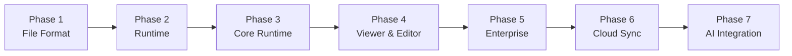

---

## 17. Testing & Validation

### 17.1 Unit Testing

Every module has comprehensive unit tests:

**Coverage targets**:
- Line coverage: ≥ 90%
- Branch coverage: ≥ 85%
- Function coverage: 100%

**Test types**:
- Happy path tests
- Error path tests
- Edge case tests
- Boundary tests

### 17.2 Integration Testing

Integration tests verify subsystem interactions:

**Test scenarios**:
- Boot sequence
- Plugin loading and execution
- Event delivery
- API calls
- Resource loading
- Permission enforcement

**Test fixtures**:
- Minimal valid document
- Minimal valid plugin
- Complex document with multiple plugins
- Document with resource dependencies
- Document with permission requirements

### 17.3 Security Testing

Security tests verify security invariants:

**Test scenarios**:
- Plugin sandbox escape attempts
- Permission bypass attempts
- Signature forgery attempts
- Integrity violation attempts
- Trust level escalation attempts

**Security test harness**:
- Malicious plugin fixtures
- Tampered bundle fixtures
- Invalid signature fixtures
- Expired certificate fixtures

### 17.4 Performance Testing

Performance tests verify performance budgets:

**Benchmarks**:
- Boot time
- Plugin load time
- API call latency
- Event delivery latency
- Memory usage
- CPU usage

**Performance test harness**:
- Criterion for benchmarking
- Flamegraph generation
- Performance regression detection

### 17.5 Compatibility Testing

Compatibility tests verify backward compatibility:

**Test matrix**:
- Multiple manifest schema versions
- Multiple API versions
- Multiple plugin versions
- Multiple document versions

**Compatibility test harness**:
- Version compatibility matrix
- Automated version testing

### 17.6 Regression Testing

Regression tests prevent reintroduction of fixed bugs:

**Regression test suite**:
- All previously fixed bugs have regression tests
- Regression tests run on every commit
- Regression test failures block commits

### 17.7 Cross-Platform Testing

Tests run on all supported platforms:

**Platforms**:
- Linux x86_64
- Linux aarch64
- macOS aarch64
- Windows x86_64

**CI/CD integration**:
- GitHub Actions for Linux and macOS
- Azure DevOps for Windows
- Automated test runs on every commit

### 17.8 Conformance Testing

Conformance tests verify LDFX Runtime compliance:

**Conformance test suite**:
- All mandatory features tested
- All acceptance criteria verified
- All performance budgets verified
- All security invariants verified

**Conformance certification**:
- Passing conformance tests required for release
- Conformance test results published

---

## 18. Risks & Trade-offs

### 18.1 Performance Risks

**Risk**: Boot time exceeds budget due to plugin loading.

**Impact**: High (affects user experience)
**Likelihood**: Medium (depends on plugin count and complexity)
**Mitigation**:
- Lazy loading for low-trust plugins
- Background loading for non-critical plugins
- Parallel initialization of independent subsystems
- WASM module caching

**Risk**: Event delivery latency exceeds budget under high load.

**Impact**: High (affects responsiveness)
**Likelihood**: Medium (depends on event throughput)
**Mitigation**:
- Event queue depth limits
- Backpressure handling
- Event batching
- Performance monitoring and alerts

### 18.2 Security Risks

**Risk**: Plugin sandbox escape via WASM vulnerability.

**Impact**: Critical (complete compromise)
**Likelihood**: Low (WASM is well-tested)
**Mitigation**:
- Use well-tested WASM runtime (wasmtime)
- Regular security audits
- Fuzzing of WASM sandbox
- Rapid patching of vulnerabilities

**Risk**: Permission system bypass.

**Impact**: Critical (complete compromise)
**Likelihood**: Low (permission checks are simple)
**Mitigation**:
- Comprehensive permission testing
- Audit logging of all permission checks
- Regular security audits
- Fuzzing of permission system

### 18.3 Scalability Risks

**Risk**: Runtime does not scale to 1000+ plugins.

**Impact**: High (limits enterprise deployments)
**Likelihood**: Medium (depends on implementation)
**Mitigation**:
- Lazy loading of plugins
- Efficient plugin registry
- Parallel plugin loading
- Performance monitoring

**Risk**: Memory usage grows unbounded with plugin count.

**Impact**: High (causes out-of-memory errors)
**Likelihood**: Medium (depends on plugin behavior)
**Mitigation**:
- Per-plugin memory budgets
- Memory pressure detection
- Automatic resource eviction
- Memory monitoring

### 18.4 Compatibility Risks

**Risk**: Breaking changes required for security fixes.

**Impact**: Medium (affects existing plugins)
**Likelihood**: Low (breaking changes are rare)
**Mitigation**:
- Careful API design to minimize breaking changes
- Deprecation period before breaking changes
- Migration tools for breaking changes
- Clear communication of breaking changes

**Risk**: Plugin incompatibility with new runtime versions.

**Impact**: Medium (affects plugin ecosystem)
**Likelihood**: Low (backward compatibility is prioritized)
**Mitigation**:
- Comprehensive compatibility testing
- Version negotiation mechanism
- Compatibility matrix published
- Plugin version pinning support

### 18.5 Developer Adoption Risks

**Risk**: Developers find LDFX difficult to learn.

**Impact**: High (affects adoption)
**Likelihood**: Medium (depends on documentation and tooling)
**Mitigation**:
- Comprehensive documentation
- Tutorial and examples
- IDE integration
- Active community support

**Risk**: Developers find LDFX tooling inadequate.

**Impact**: High (affects adoption)
**Likelihood**: Medium (depends on tooling quality)
**Mitigation**:
- High-quality CLI
- IDE extensions
- SDK implementations
- Developer community feedback

### 18.6 Maintenance Risks

**Risk**: Runtime becomes difficult to maintain due to complexity.

**Impact**: High (affects long-term viability)
**Likelihood**: Medium (depends on architecture quality)
**Mitigation**:
- Clear modular architecture
- Comprehensive documentation
- Automated testing
- Code review process

**Risk**: Security vulnerabilities discovered in dependencies.

**Impact**: High (affects security)
**Likelihood**: Medium (depends on dependency quality)
**Mitigation**:
- Careful dependency selection
- Regular dependency updates
- Security scanning
- Rapid patching

### 18.7 Trade-offs

**Trade-off 1: Security vs. Performance**
- Tighter security (more permission checks) reduces performance
- Mitigation: Permission checks are highly optimized (< 1 µs)

**Trade-off 2: Flexibility vs. Simplicity**
- More flexible API surface increases complexity
- Mitigation: API surface is carefully designed and documented

**Trade-off 3: Backward Compatibility vs. Progress**
- Maintaining backward compatibility slows progress
- Mitigation: Deprecation policy allows breaking changes in major versions

**Trade-off 4: Offline-First vs. Cloud Features**
- Offline-first design limits cloud features
- Mitigation: Cloud features are added as optional extensions

---

## 19. Master Runtime Folder Structure

### 19.1 Complete Runtime Directory Layout

```
ldfx-core/src/
│
├── lib.rs                          # Top-level module re-exports
│
├── foundation/                     # Part 2.1: Runtime Foundation
│   ├── mod.rs                      # Boot loader, lifecycle, services
│   ├── boot.rs                     # Boot sequence orchestration
│   ├── config.rs                   # Configuration loading and validation
│   ├── services.rs                 # Service registry
│   ├── lifecycle.rs                # Runtime state machine
│   └── error.rs                    # Foundation errors
│
├── vfs/                            # Part 2.2: Virtual Filesystem
│   ├── mod.rs                      # VFS trait and main implementation
│   ├── mount.rs                    # Mount management
│   ├── path.rs                     # Path resolution and validation
│   ├── access_control.rs           # Permission-based access control
│   ├── cache.rs                    # File cache
│   └── error.rs                    # VFS errors
│
├── resources/                      # Part 2.3: Resource Manager
│   ├── mod.rs                      # Resource manager trait and implementation
│   ├── loader.rs                   # Resource loading
│   ├── cache.rs                    # Resource cache with LRU eviction
│   ├── quota.rs                    # Per-plugin resource quotas
│   ├── types.rs                    # Resource types and metadata
│   └── error.rs                    # Resource errors
│
├── engine/                         # Part 2.4: Runtime Engine
│   ├── mod.rs                      # Runtime engine trait and main loop
│   ├── state_machine.rs            # Runtime state machine
│   ├── tick.rs                     # Tick loop implementation
│   ├── executor.rs                 # Document execution
│   ├── context.rs                  # Runtime execution context
│   └── error.rs                    # Engine errors
│
├── api/                            # Part 2.5: Runtime APIs
│   ├── mod.rs                      # API dispatcher and trait
│   ├── document.rs                 # document.* namespace
│   ├── plugin.rs                   # plugin.* namespace
│   ├── resource.rs                 # resource.* namespace
│   ├── storage.rs                  # storage.* namespace
│   ├── event.rs                    # event.* namespace
│   ├── vfs.rs                      # vfs.* namespace
│   ├── security.rs                 # security.* namespace
│   ├── performance.rs              # performance.* namespace
│   ├── diagnostics.rs              # diagnostics.* namespace
│   ├── versioning.rs               # API version negotiation
│   └── error.rs                    # API errors
│
├── events/                         # Part 2.6: Event System
│   ├── mod.rs                      # Event bus trait and implementation
│   ├── bus.rs                      # Event bus core
│   ├── subscription.rs             # Event subscriptions
│   ├── delivery.rs                 # Event delivery and routing
│   ├── queue.rs                    # Per-plugin event queues
│   ├── types.rs                    # Event types and schemas
│   └── error.rs                    # Event system errors
│
├── security/                       # Part 2.7: Security Runtime
│   ├── mod.rs                      # Security runtime trait and implementation
│   ├── crypto.rs                   # Cryptographic operations
│   ├── signature.rs                # Signature verification
│   ├── integrity.rs                # Integrity checking
│   ├── trust.rs                    # Trust store and trust levels
│   ├── permissions.rs              # Permission system and capability taxonomy
│   ├── audit.rs                    # Audit logging
│   └── error.rs                    # Security errors
│
├── plugin_runtime/                 # Part 2.8: Plugin Runtime
│   ├── mod.rs                      # Plugin runtime trait and main API
│   ├── manifest.rs                 # Plugin manifest types
│   ├── types.rs                    # Plugin types and state machine
│   ├── error.rs                    # Plugin runtime errors
│   ├── lifecycle.rs                # Plugin lifecycle state machine
│   ├── loader.rs                   # Plugin discovery and loading
│   ├── validator.rs                # Plugin validation
│   ├── dependency.rs               # Dependency resolution
│   ├── sandbox.rs                  # WASM sandbox management
│   ├── permissions.rs              # Plugin permission checking
│   ├── api.rs                      # Plugin API (install, enable, etc.)
│   ├── events.rs                   # Plugin event bridge
│   ├── ipc.rs                      # Inter-plugin communication
│   ├── storage.rs                  # Plugin-scoped storage
│   ├── resources.rs                # Plugin resource management
│   ├── metrics.rs                  # Plugin metrics collection
│   ├── diagnostics.rs              # Plugin diagnostics API
│   └── marketplace.rs              # Marketplace integration
│
├── developer/                      # Part 2.9: Developer Runtime
│   ├── mod.rs                      # Developer runtime trait and main API
│   ├── api.rs                      # Developer API dispatcher
│   ├── protocol/                   # LDP Protocol Server
│   │   ├── mod.rs                  # LDP server implementation
│   │   ├── server.rs               # Socket server
│   │   ├── framing.rs              # Message framing
│   │   └── auth.rs                 # Client authentication
│   ├── inspector/                  # Runtime Inspector
│   │   ├── mod.rs                  # Inspector API
│   │   ├── document.rs             # Document inspector
│   │   ├── manifest.rs             # Manifest viewer
│   │   ├── resource.rs             # Resource viewer
│   │   ├── plugin.rs               # Plugin viewer
│   │   ├── memory.rs               # Memory viewer
│   │   ├── storage.rs              # Storage viewer
│   │   ├── security.rs             # Security viewer
│   │   ├── performance.rs          # Performance viewer
│   │   ├── event.rs                # Event viewer
│   │   ├── api.rs                  # API explorer
│   │   ├── state.rs                # State viewer
│   │   ├── dependency.rs           # Dependency viewer
│   │   └── vfs.rs                  # VFS viewer
│   ├── debugger/                   # Debugger
│   │   ├── mod.rs                  # Debugger API
│   │   ├── breakpoints.rs          # Breakpoint management
│   │   ├── execution.rs            # Execution control
│   │   ├── variables.rs            # Variable inspection
│   │   ├── callstack.rs            # Call stack capture
│   │   ├── watches.rs              # Watch expressions
│   │   └── dap.rs                  # DAP protocol adapter
│   ├── profiler/                   # Performance Profiler
│   │   ├── mod.rs                  # Profiler API
│   │   ├── probes.rs               # Probe registry
│   │   ├── cpu.rs                  # CPU profiling
│   │   ├── memory.rs               # Memory profiling
│   │   ├── io.rs                   # I/O profiling
│   │   ├── events.rs               # Event profiling
│   │   ├── plugins.rs              # Plugin profiling
│   │   ├── timeline.rs             # Timeline collection
│   │   └── export.rs               # Profile export
│   ├── logging/                    # Logging System
│   │   ├── mod.rs                  # Logging API
│   │   ├── collector.rs            # Log collection
│   │   ├── buffer.rs               # Ring buffer
│   │   ├── filter.rs               # Log filtering
│   │   ├── format.rs               # Log formatting
│   │   ├── rotation.rs             # Log rotation
│   │   ├── export.rs               # Log export
│   │   └── stream.rs               # Live log stream
│   ├── diagnostics/                # Diagnostics Engine
│   │   ├── mod.rs                  # Diagnostics API
│   │   ├── health.rs               # Health monitoring
│   │   ├── validators/             # Validation subsystem
│   │   │   ├── mod.rs
│   │   │   ├── runtime.rs
│   │   │   ├── resource.rs
│   │   │   ├── plugin.rs
│   │   │   ├── security.rs
│   │   │   └── performance.rs
│   │   ├── analyzers/              # Analysis subsystem
│   │   │   ├── mod.rs
│   │   │   ├── memory.rs
│   │   │   ├── performance.rs
│   │   │   ├── event.rs
│   │   │   └── dependency.rs
│   │   ├── crash.rs                # Crash analysis
│   │   ├── recommendations.rs      # Recommendation engine
│   │   └── report.rs               # Report generation
│   ├── testing/                    # Testing Framework
│   │   ├── mod.rs                  # Testing API
│   │   ├── registry.rs             # Test registry
│   │   ├── runner.rs               # Test runner
│   │   ├── fixtures.rs             # Test fixtures
│   │   ├── assert.rs               # Assertion library
│   │   ├── snapshot.rs             # Snapshot engine
│   │   ├── coverage.rs             # Coverage collection
│   │   └── report.rs               # Test report generation
│   └── package/                    # Package Manager
│       ├── mod.rs                  # Package manager API
│       ├── builder.rs              # Bundle builder
│       ├── signer.rs               # Bundle signer
│       ├── verifier.rs             # Bundle verifier
│       ├── registry.rs             # Registry client
│       ├── deps.rs                 # Dependency resolver
│       ├── cache.rs                # Local cache
│       └── offline.rs              # Offline repository
│
├── diagnostics/                    # Diagnostics (cross-cutting)
│   ├── mod.rs                      # Diagnostics trait
│   ├── metrics.rs                  # Metrics collection
│   ├── tracing.rs                  # Distributed tracing
│   └── health.rs                   # Health monitoring
│
├── tests/                          # Test suite
│   ├── unit/                       # Unit tests
│   ├── integration/                # Integration tests
│   ├── security/                   # Security tests
│   ├── performance/                # Performance tests
│   ├── compatibility/              # Compatibility tests
│   └── fixtures/                   # Test fixtures
│
└── error.rs                        # Top-level error types
```

### 19.2 Ownership Model

| Directory | Owner | Responsibility |
|---|---|---|
| `foundation/` | Runtime Foundation Team | Boot, lifecycle, services |
| `vfs/` | VFS Team | File I/O, mounting, access control |
| `resources/` | Resource Team | Resource loading, caching, eviction |
| `engine/` | Engine Team | Document execution, tick loop |
| `api/` | API Team | API namespaces, method dispatch |
| `events/` | Event Team | Event bus, subscriptions, delivery |
| `security/` | Security Team | Cryptography, trust, permissions |
| `plugin_runtime/` | Plugin Team | Plugin discovery, loading, lifecycle |
| `developer/` | DevEx Team | Debugging, profiling, inspection |
| `diagnostics/` | DevEx Team | Metrics, tracing, health |
| `tests/` | QA Team | Test suite, test fixtures |

### 19.3 Module Dependencies

```
lib.rs
├── foundation/
│   ├── config
│   ├── services
│   ├── boot
│   ├── lifecycle
│   └── error
├── vfs/
│   ├── mount
│   ├── path
│   ├── access_control
│   ├── cache
│   └── error
├── resources/
│   ├── loader
│   ├── cache
│   ├── quota
│   ├── types
│   └── error
├── engine/
│   ├── state_machine
│   ├── tick
│   ├── executor
│   ├── context
│   └── error
├── api/
│   ├── document
│   ├── plugin
│   ├── resource
│   ├── storage
│   ├── event
│   ├── vfs
│   ├── security
│   ├── performance
│   ├── diagnostics
│   ├── versioning
│   └── error
├── events/
│   ├── bus
│   ├── subscription
│   ├── delivery
│   ├── queue
│   ├── types
│   └── error
├── security/
│   ├── crypto
│   ├── signature
│   ├── integrity
│   ├── trust
│   ├── permissions
│   ├── audit
│   └── error
├── plugin_runtime/
│   ├── manifest
│   ├── types
│   ├── error
│   ├── lifecycle
│   ├── loader
│   ├── validator
│   ├── dependency
│   ├── sandbox
│   ├── permissions
│   ├── api
│   ├── events
│   ├── ipc
│   ├── storage
│   ├── resources
│   ├── metrics
│   ├── diagnostics
│   └── marketplace
├── developer/
│   ├── api
│   ├── protocol/
│   ├── inspector/
│   ├── debugger/
│   ├── profiler/
│   ├── logging/
│   ├── diagnostics/
│   ├── testing/
│   └── package/
├── diagnostics/
│   ├── metrics
│   ├── tracing
│   └── health
└── error.rs
```

---

## 20. Runtime Conformance Checklist

### 20.1 Mandatory Features

Every LDFX Runtime implementation must support:

**Core Runtime**:
- [ ] Boot sequence (Part 2.1)
- [ ] Configuration loading (Part 2.1)
- [ ] Service registry (Part 2.1)
- [ ] Runtime state machine (Part 2.1)
- [ ] Graceful shutdown (Part 2.1)

**Virtual Filesystem**:
- [ ] File read/write operations (Part 2.2)
- [ ] Directory listing (Part 2.2)
- [ ] Path resolution (Part 2.2)
- [ ] Mount management (Part 2.2)
- [ ] Access control (Part 2.2)

**Resource Manager**:
- [ ] Resource loading (Part 2.3)
- [ ] Resource caching (Part 2.3)
- [ ] Cache eviction (Part 2.3)
- [ ] Per-plugin quotas (Part 2.3)

**Runtime Engine**:
- [ ] Document execution (Part 2.4)
- [ ] Tick loop (60 Hz) (Part 2.4)
- [ ] State machine (Part 2.4)
- [ ] Error handling (Part 2.4)

**Runtime APIs**:
- [ ] API dispatcher (Part 2.5)
- [ ] All namespaces (document, plugin, resource, storage, event, vfs, security, performance, diagnostics) (Part 2.5)
- [ ] Permission checking (Part 2.5)
- [ ] Version negotiation (Part 2.5)

**Event System**:
- [ ] Event bus (Part 2.6)
- [ ] Event subscriptions (Part 2.6)
- [ ] Event delivery (Part 2.6)
- [ ] Event routing (Part 2.6)

**Security Runtime**:
- [ ] Signature verification (Part 2.7)
- [ ] Integrity checking (Part 2.7)
- [ ] Trust store (Part 2.7)
- [ ] Permission enforcement (Part 2.7)
- [ ] Audit logging (Part 2.7)

**Plugin Runtime**:
- [ ] Plugin discovery (Part 2.8)
- [ ] Plugin validation (Part 2.8)
- [ ] Plugin loading (Part 2.8)
- [ ] Plugin lifecycle (Part 2.8)
- [ ] WASM sandbox (Part 2.8)
- [ ] Plugin permissions (Part 2.8)
- [ ] Plugin events (Part 2.8)
- [ ] Plugin IPC (Part 2.8)
- [ ] Plugin storage (Part 2.8)

**Developer Runtime**:
- [ ] Runtime inspection (Part 2.9)
- [ ] Logging system (Part 2.9)
- [ ] Diagnostics engine (Part 2.9)
- [ ] Testing framework (Part 2.9)

### 20.2 Optional Features

Implementations may optionally support:

**Advanced Features**:
- [ ] Debugger (Part 2.9)
- [ ] Performance Profiler (Part 2.9)
- [ ] IDE integration (Part 2.9)
- [ ] CI/CD integration (Part 2.9)
- [ ] Package management (Part 2.9)

**Enterprise Features**:
- [ ] Enterprise package registry
- [ ] Enterprise signing authority
- [ ] SSO integration
- [ ] Air-gapped deployment

**Future Features**:
- [ ] Cloud sync
- [ ] AI integration
- [ ] Remote debugging
- [ ] Time-travel debugging

### 20.3 Performance Requirements

Implementations must meet these performance targets:

| Operation | Budget | Requirement |
|---|---|---|
| Boot time | 2075 ms | ≤ 2500 ms |
| Plugin load | 500 ms | ≤ 600 ms |
| API call | 5 ms | ≤ 10 ms |
| Permission check | 1 µs | ≤ 10 µs |
| Event delivery | 1 ms | ≤ 5 ms |
| File read | 50 ms | ≤ 100 ms |
| Resource load | 100 ms | ≤ 200 ms |
| Tick duration | 16.67 ms | ≤ 20 ms |

### 20.4 Security Requirements

Implementations must meet these security requirements:

- [ ] All plugins run in WASM sandbox
- [ ] All API calls are permission-checked
- [ ] All documents are signature-verified
- [ ] All plugins are signature-verified
- [ ] All file integrity is verified
- [ ] All security operations are audit-logged
- [ ] No plugin can access host memory outside sandbox
- [ ] No plugin can make system calls
- [ ] No plugin can access other plugin's storage
- [ ] No plugin can forge events

### 20.5 Compatibility Requirements

Implementations must meet these compatibility requirements:

- [ ] Support manifest schema version 2.x
- [ ] Support API version 2.x
- [ ] Support plugins written for LDFX 2.x
- [ ] Support documents written for LDFX 2.x
- [ ] Maintain backward compatibility across minor versions
- [ ] Support version negotiation

### 20.6 Testing Requirements

Implementations must pass:

- [ ] All unit tests (≥ 90% coverage)
- [ ] All integration tests
- [ ] All security tests
- [ ] All performance tests
- [ ] All compatibility tests
- [ ] Conformance test suite

### 20.7 Documentation Requirements

Implementations must provide:

- [ ] Architecture documentation
- [ ] API documentation
- [ ] Plugin development guide
- [ ] CLI documentation
- [ ] SDK documentation
- [ ] Troubleshooting guide
- [ ] Performance tuning guide
- [ ] Security guide

### 20.8 Certification Process

To certify an LDFX Runtime implementation:

1. **Submission**: Submit implementation for certification
2. **Review**: Technical review of architecture and code
3. **Testing**: Run conformance test suite
4. **Performance**: Verify performance requirements
5. **Security**: Security audit
6. **Documentation**: Review documentation
7. **Approval**: Certification approved or rejected
8. **Publication**: Certified implementation listed on LDFX website

---

*End of Phase 2 — Part 2.10: LDFX Master Runtime Architecture & Integration Specification*

This specification completes Phase 2 of the LDFX project. It integrates all nine subsystems (Parts 2.1–2.9) into a unified, coherent runtime architecture. The specification provides the authoritative blueprint for implementing the LDFX Runtime across all supported platforms and serves as the foundation for Phase 3 (Viewer & Rendering Engine) and beyond.
