# Phase 2 — Part 2: Virtual File System (VFS) Architecture
# LDFX Runtime VFS Specification

**Specification Version:** 2.0.0
**Status:** Canonical — Approved
**Phase:** 2 — Runtime Foundation
**Part:** 2.2 — Virtual File System
**Depends On:** Phase 1 (Modules 01–12), Phase 2 Part 2.1 (Runtime Foundation)

---

## Table of Contents

1. [Introduction](#1-introduction)
2. [VFS Architecture](#2-vfs-architecture)
3. [Mount System](#3-mount-system)
4. [Directory Tree](#4-directory-tree)
5. [Path Resolution](#5-path-resolution)
6. [File Objects](#6-file-objects)
7. [File Operations](#7-file-operations)
8. [ZIP Container Interface](#8-zip-container-interface)
9. [Caching](#9-caching)
10. [Integrity](#10-integrity)
11. [Permissions](#11-permissions)
12. [Memory Management](#12-memory-management)
13. [Performance](#13-performance)
14. [Error Handling](#14-error-handling)
15. [Runtime Integration](#15-runtime-integration)
16. [Developer APIs](#16-developer-apis)
17. [Observability](#17-observability)
18. [Testing](#18-testing)
19. [Folder Structure](#19-folder-structure)
20. [Acceptance Criteria](#20-acceptance-criteria)

---

## 1. Introduction

### 1.1 Why LDFX Needs a Virtual File System

The LDFX format stores all document content inside a ZIP archive that begins
at byte offset 64 of the `.ldfx` file. This ZIP archive contains pages, assets,
metadata, security files, plugins, scripts, AI data, and configuration — all
organized as a structured directory tree.

Without a Virtual File System layer, every runtime component that needs to read
document content would need to:

- Know about the 64-byte binary header offset
- Directly invoke ZIP decompression routines
- Manage its own entry lookup and caching
- Perform its own integrity verification
- Handle its own error recovery
- Implement its own path normalization and traversal protection

This creates an unacceptable situation: duplicated logic, inconsistent security
enforcement, no centralized caching, no unified observability, and a tightly
coupled architecture that cannot be tested or replaced independently.

The LDFX Virtual File System (VFS) solves all of these problems by providing
a single, unified abstraction layer between the raw ZIP container and every
runtime component that needs to read document content.

**The fundamental rule of the LDFX VFS:**

> No runtime component may ever access the ZIP container directly.
> All document content access must go through the VFS API.

This rule is absolute. It applies to the Runtime Kernel, the Resource Manager,
the Security Manager, the Plugin Runtime, the AI Runtime, and every other
component in the LDFX Runtime stack.

---

### 1.2 Goals

The LDFX VFS is designed to achieve the following primary goals:

| # | Goal | Description |
|---|---|---|
| G-01 | Abstraction | Hide all ZIP implementation details from every consumer |
| G-02 | Security | Enforce path traversal protection, integrity verification, and permission checks at a single point |
| G-03 | Performance | Provide a multi-tier cache that eliminates redundant decompression and I/O |
| G-04 | Portability | Present an identical API surface on Windows, Linux, macOS, and WASM |
| G-05 | Observability | Provide unified logging, tracing, and metrics for all file access |
| G-06 | Reliability | Handle ZIP corruption, partial reads, and I/O errors gracefully |
| G-07 | Extensibility | Support future mount types (network mounts, encrypted mounts, delta mounts) without API changes |
| G-08 | Offline-first | Operate entirely from the local `.ldfx` file with no network dependency |
| G-09 | Determinism | Given the same document bytes, produce identical read results on every platform |
| G-10 | Testability | Every VFS component must be independently testable with mock backends |

---

### 1.3 Design Philosophy

The VFS is designed around five philosophical principles:

#### Principle 1 — Single Point of Truth
All document content flows through one system. There is no side channel,
no direct ZIP access, no bypass. This makes security enforcement, caching,
and observability complete and consistent.

#### Principle 2 — Layered Responsibility
Each layer of the VFS has exactly one responsibility. The Path Resolver
resolves paths. The ZIP Reader reads ZIP entries. The Cache Manager manages
the cache. No layer does another layer's job.

#### Principle 3 — Fail Safe by Default
Every operation that cannot be completed safely returns a typed error.
The VFS never returns partial data silently. It never ignores integrity
failures. It never allows a path traversal to succeed.

#### Principle 4 — Zero Implicit Trust
Every read operation is verified. Every path is normalized and validated.
Every entry is checked against its declared hash before being returned
to the caller. Trust is never assumed — it is always verified.

#### Principle 5 — Performance Without Compromise
The VFS is designed to be fast. Hot-path reads from the manifest and
current page must complete in under 0.1ms. This is achieved through
aggressive caching, zero-copy reads where possible, and lazy loading
of non-critical entries. Performance is never achieved by weakening
security or correctness.

---

### 1.4 Requirements

#### 1.4.1 Functional Requirements

| ID | Requirement |
|---|---|
| FR-01 | The VFS must expose all ZIP entries as virtual files accessible by path |
| FR-02 | The VFS must support read operations on all entry types |
| FR-03 | The VFS must support directory enumeration at any virtual path |
| FR-04 | The VFS must support streaming reads for large entries |
| FR-05 | The VFS must support random access (seek) within entries |
| FR-06 | The VFS must support metadata queries (size, compression, hash) without full decompression |
| FR-07 | The VFS must support multiple simultaneous readers on the same entry |
| FR-08 | The VFS must support temporary write mounts for runtime-generated content |
| FR-09 | The VFS must support memory-only mounts for plugin sandboxes |
| FR-10 | The VFS must support mount/unmount operations at runtime |

#### 1.4.2 Security Requirements

| ID | Requirement |
|---|---|
| SR-01 | The VFS must reject all paths containing `..` components |
| SR-02 | The VFS must reject all absolute paths that escape the document root |
| SR-03 | The VFS must verify SHA-256 integrity of every entry before returning data |
| SR-04 | The VFS must enforce read/write permissions per path and per caller identity |
| SR-05 | The VFS must log all access denials as security events |
| SR-06 | The VFS must reject ZIP entries with encrypted content |
| SR-07 | The VFS must enforce per-caller resource limits (max open handles, max read bytes) |
| SR-08 | The VFS must isolate plugin mounts from the document root |

#### 1.4.3 Performance Requirements

| ID | Requirement | Target |
|---|---|---|
| PR-01 | Hot cache read latency | < 0.1ms |
| PR-02 | Warm cache read latency | < 2ms |
| PR-03 | Cold read (from ZIP) latency for entries < 100KB | < 10ms |
| PR-04 | Cold read (from ZIP) latency for entries 100KB–1MB | < 30ms |
| PR-05 | Directory enumeration (< 100 entries) | < 1ms |
| PR-06 | Path resolution latency | < 0.05ms |
| PR-07 | Manifest.json read (hot cache) | < 0.1ms |
| PR-08 | Concurrent readers on same entry | No serialization penalty |
| PR-09 | Memory overhead per open handle | < 256 bytes |
| PR-10 | Cache hit rate for standard document session | > 90% |

#### 1.4.4 Reliability Requirements

| ID | Requirement |
|---|---|
| RR-01 | The VFS must never return corrupted data — integrity failure must return an error |
| RR-02 | The VFS must handle ZIP CRC32 mismatches without crashing |
| RR-03 | The VFS must handle truncated ZIP entries without crashing |
| RR-04 | The VFS must handle concurrent reads without data races |
| RR-05 | The VFS must release all resources when a document is closed |
| RR-06 | The VFS must recover from cache corruption by falling back to ZIP reads |
| RR-07 | The VFS must handle out-of-memory conditions gracefully |

---

## 2. VFS Architecture

### 2.1 Architecture Overview

The LDFX VFS is organized as a strict vertical stack. Each layer communicates
only with the layer directly below it. No layer may skip an intermediate layer.

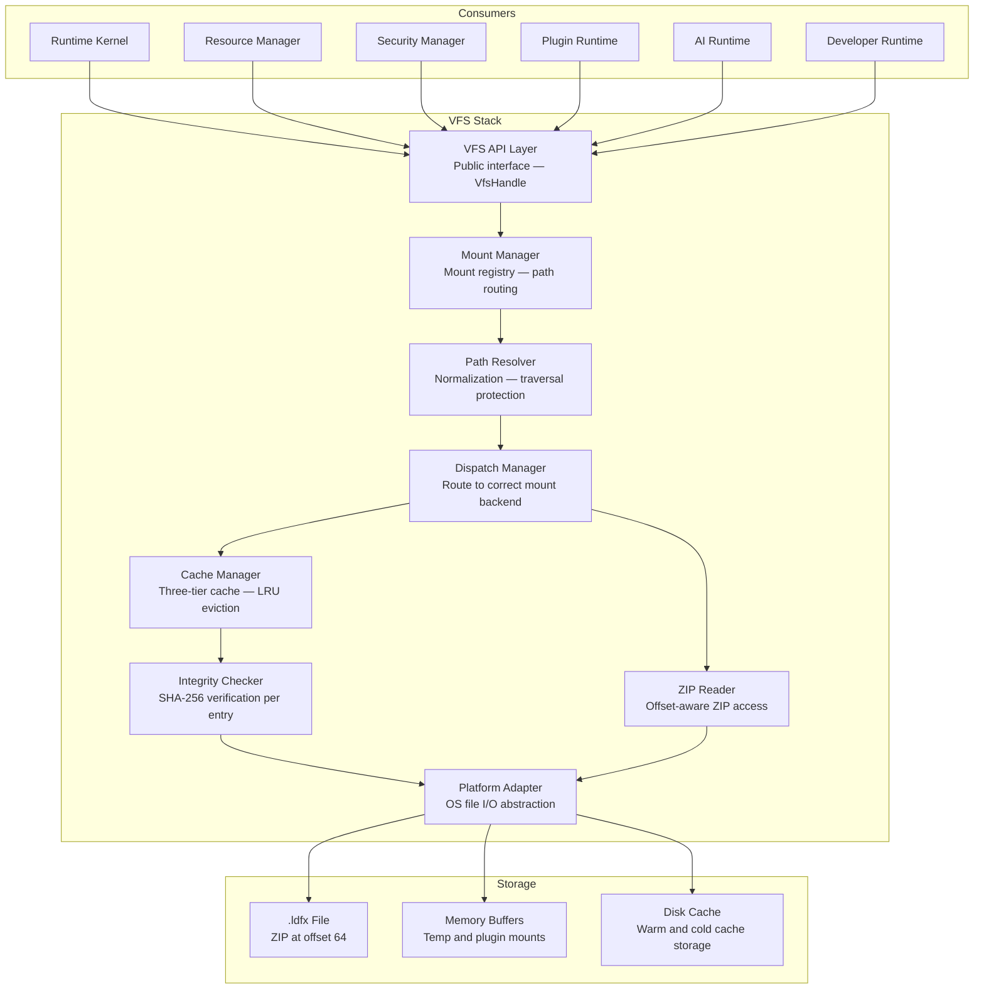
```mermaid
graph TD
    subgraph Consumers
        RK[Runtime Kernel]
        RM[Resource Manager]
        SM[Security Manager]
        PR[Plugin Runtime]
        AR[AI Runtime]
        DR[Developer Runtime]
    end

    subgraph VFS Stack
        API[VFS API Layer\nPublic interface — VfsHandle]
        MM[Mount Manager\nMount registry — path routing]
        PR2[Path Resolver\nNormalization — traversal protection]
        DM[Dispatch Manager\nRoute to correct mount backend]
        ZR[ZIP Reader\nOffset-aware ZIP access]
        CM[Cache Manager\nThree-tier cache — LRU eviction]
        IC[Integrity Checker\nSHA-256 verification per entry]
        PA[Platform Adapter\nOS file I/O abstraction]
    end

    subgraph Storage
        ZIP[.ldfx File\nZIP at offset 64]
        MEM[Memory Buffers\nTemp and plugin mounts]
        DISK[Disk Cache\nWarm and cold cache storage]
    end

    RK --> API
    RM --> API
    SM --> API
    PR --> API
    AR --> API
    DR --> API

    API --> MM
    MM --> PR2
    PR2 --> DM
    DM --> ZR
    DM --> CM
    CM --> IC
    IC --> PA
    ZR --> PA

    PA --> ZIP
    PA --> MEM
    PA --> DISK
```

---

### 2.2 Layer Definitions

#### Layer 1 — VFS API Layer

**Position:** Top of the VFS stack. The only surface consumers touch.

**Responsibilities:**
- Expose the `VfsHandle` — the single entry point for all VFS operations
- Accept typed, validated inputs from consumers
- Return typed results — never raw internal types
- Enforce API-level rate limiting and input validation
- Translate consumer requests into Mount Manager operations
- Emit VFS events to the Runtime Event Dispatcher

**Interface surface:**
- `open(path, options)` → `VirtualHandle`
- `read(handle, buf)` → `usize`
- `seek(handle, pos)` → `u64`
- `stat(path)` → `VfsMetadata`
- `exists(path)` → `bool`
- `list(path)` → `Vec<VfsDirEntry>`
- `stream(path, options)` → `StreamHandle`
- `mount(point, backend, options)` → `MountHandle`
- `unmount(point)` → `Result`
- `resolve(path)` → `ResolvedPath`
- `close(handle)` → `Result`

**Boundaries:**
- Accepts only `VfsPath` typed inputs — never raw strings
- Returns only public-facing types — never internal structs
- All errors translated to `VfsError` before surfacing
- Never performs I/O directly — delegates to Mount Manager

**Ownership:** `ldfx-runtime/src/vfs/api/`

---

#### Layer 2 — Mount Manager

**Position:** Routes requests to the correct mount backend.

**Responsibilities:**
- Maintain the mount registry — a map of mount points to backends
- Route every path to the correct mount based on longest-prefix matching
- Manage mount lifecycle (register, activate, deactivate, remove)
- Enforce mount-level access policies
- Handle overlapping mounts with defined precedence rules
- Emit mount lifecycle events

**Mount registry structure:**
```
/                    → ZipMount (document root, read-only)
/cache/              → DiskMount (runtime cache, read-write)
/logs/               → MemoryMount (session logs, write-only)
/temp/               → MemoryMount (temp files, read-write)
/plugins/<id>/       → PluginMount (per-plugin sandbox, isolated)
/ai/models/          → AiMount (AI model data, read-only)
```

**Routing algorithm:**
1. Normalize the input path via Path Resolver
2. Find the mount with the longest matching prefix
3. Strip the mount prefix from the path
4. Forward the relative path to the mount backend
5. Return the result to the VFS API Layer

**Boundaries:**
- Never performs I/O directly
- Never modifies path content — only routes
- Never bypasses the Path Resolver

**Ownership:** `ldfx-runtime/src/vfs/mount/`

---

#### Layer 3 — Path Resolver

**Position:** Normalizes and validates all paths before routing.

**Responsibilities:**
- Normalize all path separators to `/`
- Resolve `.` and `..` components
- Detect and reject path traversal attempts
- Enforce maximum path length limits
- Validate Unicode path components
- Resolve path aliases and virtual links
- Enforce reserved name restrictions
- Apply case normalization rules per platform

**Path resolution pipeline:**
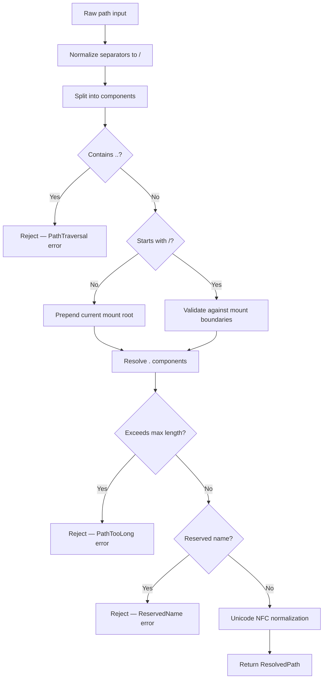
```mermaid
flowchart TD
    A[Raw path input] --> B[Normalize separators to /]
    B --> C[Split into components]
    C --> D{Contains ..?}
    D -->|Yes| E[Reject — PathTraversal error]
    D -->|No| F{Starts with /?}
    F -->|No| G[Prepend current mount root]
    F -->|Yes| H[Validate against mount boundaries]
    G --> I[Resolve . components]
    H --> I
    I --> J{Exceeds max length?}
    J -->|Yes| K[Reject — PathTooLong error]
    J -->|No| L{Reserved name?}
    L -->|Yes| M[Reject — ReservedName error]
    L -->|No| N[Unicode NFC normalization]
    N --> O[Return ResolvedPath]
```

**Boundaries:**
- Pure computation — no I/O
- Stateless — same input always produces same output
- Never modifies the mount registry

**Ownership:** `ldfx-runtime/src/vfs/path/`

---

#### Layer 4 — Dispatch Manager

**Position:** Routes resolved paths to the correct backend operation.

**Responsibilities:**
- Receive resolved paths from the Mount Manager
- Determine whether to serve from cache or from ZIP
- Coordinate between Cache Manager and ZIP Reader
- Implement the cache-aside pattern for reads
- Handle cache misses by delegating to ZIP Reader
- Promote entries from cold to warm to hot cache on access

**Cache-aside read flow:**
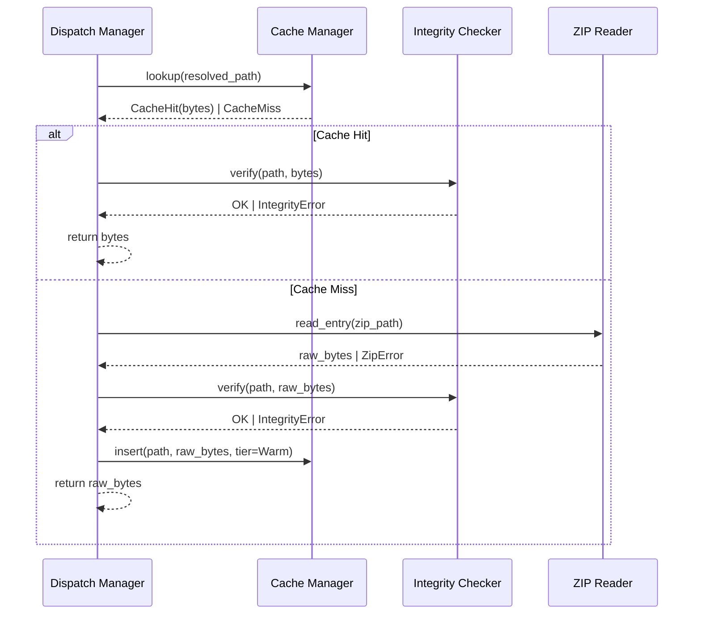
```mermaid
sequenceDiagram
    participant DM as Dispatch Manager
    participant CM as Cache Manager
    participant IC as Integrity Checker
    participant ZR as ZIP Reader

    DM->>CM: lookup(resolved_path)
    CM-->>DM: CacheHit(bytes) | CacheMiss

    alt Cache Hit
        DM->>IC: verify(path, bytes)
        IC-->>DM: OK | IntegrityError
        DM-->>DM: return bytes
    else Cache Miss
        DM->>ZR: read_entry(zip_path)
        ZR-->>DM: raw_bytes | ZipError
        DM->>IC: verify(path, raw_bytes)
        IC-->>DM: OK | IntegrityError
        DM->>CM: insert(path, raw_bytes, tier=Warm)
        DM-->>DM: return raw_bytes
    end
```

**Ownership:** `ldfx-runtime/src/vfs/dispatch/`

---

#### Layer 5 — ZIP Reader

**Position:** Direct interface to the ZIP archive inside the `.ldfx` file.

**Responsibilities:**
- Open the ZIP archive at byte offset 64 (per Phase 1 Module 03)
- Enumerate all ZIP entries
- Read named entries as raw compressed or decompressed bytes
- Support streaming decompression for large entries
- Support random access within decompressed entries
- Validate ZIP CRC32 checksums
- Handle ZIP64 extensions for large archives
- Detect and reject encrypted ZIP entries
- Detect and reject path traversal in ZIP entry names

**Boundaries:**
- Returns raw bytes only — no parsing, no interpretation
- Never performs integrity hash verification (that is the Integrity Checker's job)
- Never enforces permissions (that is the Permission layer's job)
- Reads from the Platform Adapter only — never directly from the OS

**Ownership:** `ldfx-runtime/src/vfs/zip/`

---

#### Layer 6 — Cache Manager

**Position:** Three-tier in-memory and on-disk cache.

**Responsibilities:**
- Maintain hot, warm, and cold cache tiers
- Implement LRU eviction per tier
- Enforce per-tier size limits
- Promote entries between tiers on access
- Evict entries under memory pressure
- Persist warm cache to disk for warm boot recovery
- Provide cache statistics for the Performance Monitor
- Support cache invalidation on document close

**Cache tier summary:**

| Tier | Storage | Max Size | Eviction | Contents |
|---|---|---|---|---|
| Hot | Memory (pinned) | 16MB | Never | manifest, current page, active assets |
| Warm | Memory (LRU) | 64MB | LRU | recently accessed pages and assets |
| Cold | Disk (LRU+TTL) | 256MB | LRU + 30min TTL | all other loaded entries |

**Ownership:** `ldfx-runtime/src/vfs/cache/`

---

#### Layer 7 — Integrity Checker

**Position:** SHA-256 verification for every entry read from ZIP or cache.

**Responsibilities:**
- Load the hash manifest from `security/hashes.json` at boot
- Verify SHA-256 hash of every entry before returning to caller
- Detect tampering that occurs after the file is opened
- Emit `IntegrityViolation` security events on hash mismatch
- Support entries that are excluded from hashing (cache/, logs/)
- Maintain a verified-entry set to avoid redundant re-verification

**Verification policy:**

| Entry Type | Verified | On Failure |
|---|---|---|
| manifest.json | Yes — every read | Fatal — reject entry |
| security/hashes.json | No — self-referential | N/A |
| pages/* | Yes — first read per session | Fatal — reject entry |
| assets/* | Yes — first read per session | Fatal — reject entry |
| metadata/* | Yes — every read | Fatal — reject entry |
| plugins/* | Yes — every read | Fatal — reject entry |
| cache/* | No — runtime-generated | N/A |
| logs/* | No — runtime-generated | N/A |
| temp/* | No — runtime-generated | N/A |

**Ownership:** `ldfx-runtime/src/vfs/security/`

---

#### Layer 8 — Platform Adapter

**Position:** OS abstraction — bottom of the VFS stack.

**Responsibilities:**
- Provide uniform file read access across Windows, Linux, macOS, WASM
- Provide memory-mapped file access via `memmap2`
- Provide async I/O via Tokio
- Provide temp directory and cache directory paths
- Abstract platform-specific file locking
- On WASM: bridge to JavaScript File API

**Boundaries:**
- Exposes a single trait — `VfsPlatformAdapter`
- All platform implementations are behind this trait
- No VFS layer above Layer 8 may use platform-specific types

**Ownership:** `ldfx-runtime/src/vfs/platform/`

---

### 2.3 Layer Communication Rules

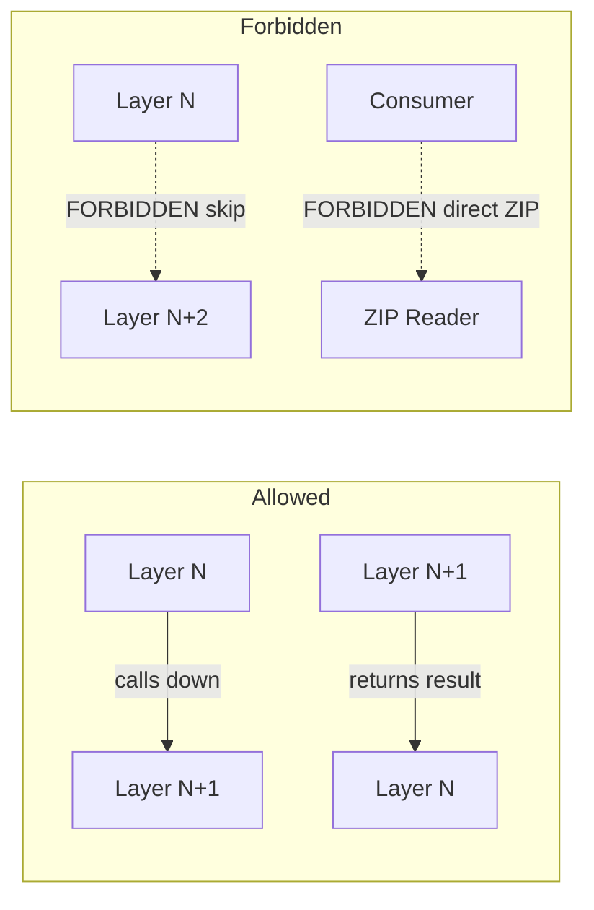
```mermaid
graph LR
    subgraph Allowed
        A1[Layer N] -->|calls down| A2[Layer N+1]
        A3[Layer N+1] -->|returns result| A4[Layer N]
    end
    subgraph Forbidden
        B1[Layer N] -. "FORBIDDEN skip" .-> B3[Layer N+2]
        B2[Consumer] -. "FORBIDDEN direct ZIP" .-> B4[ZIP Reader]
    end
```

| Rule | Description |
|---|---|
| Downward only | A layer calls only the layer directly below it |
| No skip | No layer may skip an intermediate layer |
| No upward calls | No layer calls a layer above it |
| Events are upward | The Runtime Event Dispatcher is the only upward channel |
| Integrity intercepts | The Integrity Checker intercepts all data flowing upward from ZIP |

---

### 2.4 VFS Initialization Sequence

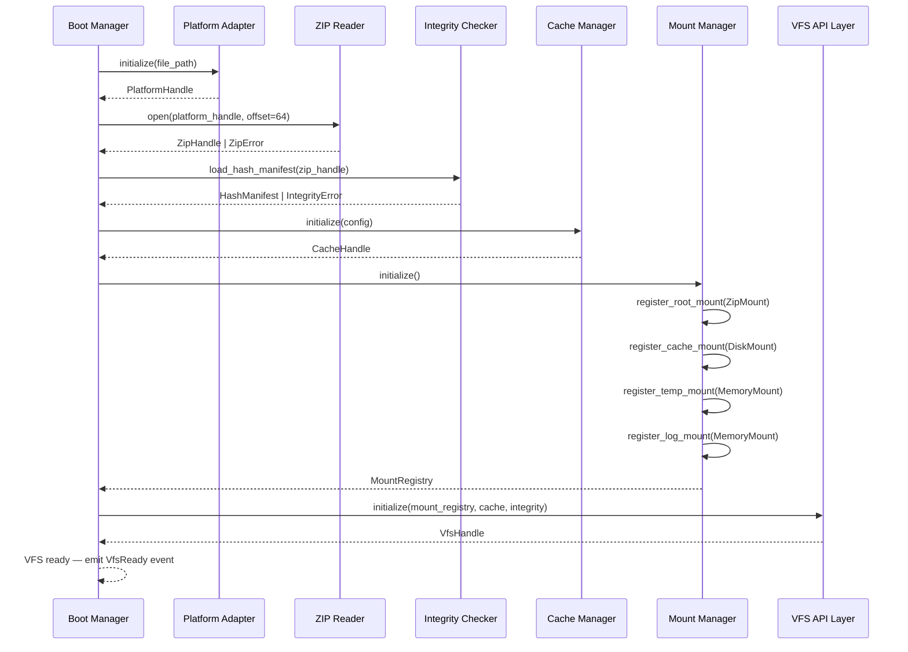
```mermaid
sequenceDiagram
    participant BM as Boot Manager
    participant PA as Platform Adapter
    participant ZR as ZIP Reader
    participant IC as Integrity Checker
    participant CM as Cache Manager
    participant MM as Mount Manager
    participant API as VFS API Layer

    BM->>PA: initialize(file_path)
    PA-->>BM: PlatformHandle

    BM->>ZR: open(platform_handle, offset=64)
    ZR-->>BM: ZipHandle | ZipError

    BM->>IC: load_hash_manifest(zip_handle)
    IC-->>BM: HashManifest | IntegrityError

    BM->>CM: initialize(config)
    CM-->>BM: CacheHandle

    BM->>MM: initialize()
    MM->>MM: register_root_mount(ZipMount)
    MM->>MM: register_cache_mount(DiskMount)
    MM->>MM: register_temp_mount(MemoryMount)
    MM->>MM: register_log_mount(MemoryMount)
    MM-->>BM: MountRegistry

    BM->>API: initialize(mount_registry, cache, integrity)
    API-->>BM: VfsHandle

    BM-->>BM: VFS ready — emit VfsReady event
```

---

### 2.5 VFS Shutdown Sequence

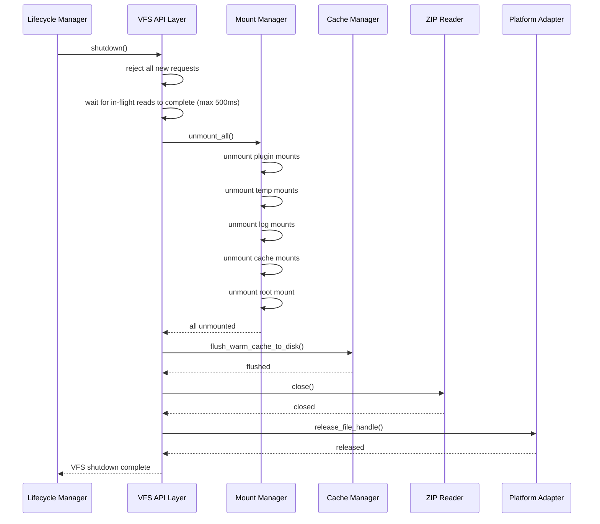
```mermaid
sequenceDiagram
    participant LC as Lifecycle Manager
    participant API as VFS API Layer
    participant MM as Mount Manager
    participant CM as Cache Manager
    participant ZR as ZIP Reader
    participant PA as Platform Adapter

    LC->>API: shutdown()
    API->>API: reject all new requests
    API->>API: wait for in-flight reads to complete (max 500ms)

    API->>MM: unmount_all()
    MM->>MM: unmount plugin mounts
    MM->>MM: unmount temp mounts
    MM->>MM: unmount log mounts
    MM->>MM: unmount cache mounts
    MM->>MM: unmount root mount
    MM-->>API: all unmounted

    API->>CM: flush_warm_cache_to_disk()
    CM-->>API: flushed

    API->>ZR: close()
    ZR-->>API: closed

    API->>PA: release_file_handle()
    PA-->>API: released

    API-->>LC: VFS shutdown complete
```

---

## 3. Mount System

### 3.1 Mount System Overview

The Mount System is the mechanism by which the VFS presents a unified virtual
directory tree composed of multiple independent backends. Each backend is
mounted at a specific path prefix. When a consumer requests a path, the Mount
Manager routes the request to the backend whose mount point is the longest
matching prefix of the requested path.

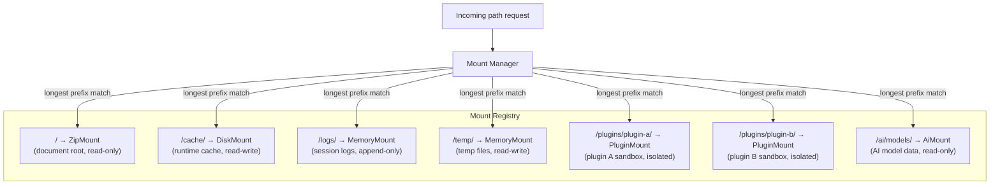
```mermaid
graph TD
    subgraph Mount Registry
        ROOT["/ → ZipMount\n(document root, read-only)"]
        CACHE["/cache/ → DiskMount\n(runtime cache, read-write)"]
        LOGS["/logs/ → MemoryMount\n(session logs, append-only)"]
        TEMP["/temp/ → MemoryMount\n(temp files, read-write)"]
        P1["/plugins/plugin-a/ → PluginMount\n(plugin A sandbox, isolated)"]
        P2["/plugins/plugin-b/ → PluginMount\n(plugin B sandbox, isolated)"]
        AI["/ai/models/ → AiMount\n(AI model data, read-only)"]
    end

    REQ[Incoming path request] --> MM[Mount Manager]
    MM -->|longest prefix match| ROOT
    MM -->|longest prefix match| CACHE
    MM -->|longest prefix match| LOGS
    MM -->|longest prefix match| TEMP
    MM -->|longest prefix match| P1
    MM -->|longest prefix match| P2
    MM -->|longest prefix match| AI
```

---

### 3.2 Mount Types

#### 3.2.1 ZipMount — Document Root Mount

**Mount point:** `/`
**Backend:** ZIP archive at byte offset 64 of the `.ldfx` file
**Access:** Read-only
**Lifecycle:** Created at VFS initialization. Destroyed at VFS shutdown.
**Integrity:** All reads verified against `security/hashes.json`

**Purpose:**
The ZipMount is the primary mount. It exposes the entire ZIP container as a
virtual read-only filesystem rooted at `/`. Every document entry — pages,
assets, metadata, security files, plugins — is accessible through this mount.

**Properties:**

| Property | Value |
|---|---|
| Writable | No |
| Deletable entries | No |
| Supports streaming | Yes |
| Supports random access | Yes |
| Supports enumeration | Yes |
| Integrity verified | Yes |
| Encrypted entries | Rejected |
| ZIP64 support | Yes |

**Lifecycle:**
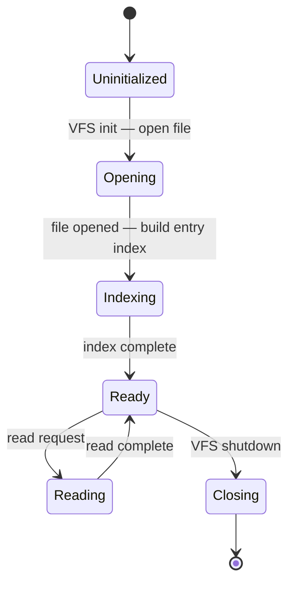
```mermaid
stateDiagram-v2
    [*] --> Uninitialized
    Uninitialized --> Opening : VFS init — open file
    Opening --> Indexing : file opened — build entry index
    Indexing --> Ready : index complete
    Ready --> Reading : read request
    Reading --> Ready : read complete
    Ready --> Closing : VFS shutdown
    Closing --> [*]
```

---

#### 3.2.2 DiskMount — Cache Mount

**Mount point:** `/cache/`
**Backend:** Platform temp directory on disk
**Access:** Read-write (runtime only — not accessible to plugins or scripts)
**Lifecycle:** Created at VFS initialization. Flushed and destroyed at shutdown.
**Integrity:** Not hash-verified (runtime-generated content)

**Purpose:**
The DiskMount provides persistent cache storage across warm boots. The runtime
writes decompressed and decoded entries here so that subsequent opens of the
same document can skip decompression. The cache is keyed by document hash and
entry path.

**Properties:**

| Property | Value |
|---|---|
| Writable | Yes (runtime only) |
| Max size | 256MB (configurable) |
| Eviction | LRU + 30-minute TTL |
| Accessible to plugins | No |
| Accessible to scripts | No |
| Persists across sessions | Yes (warm boot) |
| Encrypted at rest | No (future option) |

---

#### 3.2.3 MemoryMount — Temp Mount

**Mount point:** `/temp/`
**Backend:** In-process heap memory
**Access:** Read-write (runtime only)
**Lifecycle:** Created at VFS initialization. All content destroyed at shutdown.
**Integrity:** Not hash-verified (runtime-generated content)

**Purpose:**
The MemoryMount at `/temp/` provides a scratch space for the runtime to store
transient data during a session. Examples include decoded asset thumbnails,
pre-rendered page fragments, and intermediate processing results. All content
is lost when the document is closed.

**Properties:**

| Property | Value |
|---|---|
| Writable | Yes (runtime only) |
| Max size | 16MB |
| Eviction | LRU under memory pressure |
| Persists across sessions | No |
| Accessible to plugins | No |

---

#### 3.2.4 MemoryMount — Log Mount

**Mount point:** `/logs/`
**Backend:** In-process ring buffer
**Access:** Append-only (runtime writes, no reads by consumers)
**Lifecycle:** Created at VFS initialization. Flushed to disk at shutdown.
**Integrity:** Not hash-verified

**Purpose:**
The Log Mount provides a write-only virtual path for the Logging System to
write structured log entries during a session. Logs are stored in a ring
buffer and flushed to the platform log directory at shutdown. The VFS
exposes this as a virtual path so that log writes go through the same
permission and resource-limit enforcement as all other VFS operations.

**Properties:**

| Property | Value |
|---|---|
| Writable | Yes (runtime Logging System only) |
| Readable | No (write-only from VFS perspective) |
| Max size | 8MB ring buffer |
| Overflow policy | Oldest entries dropped |
| Accessible to plugins | No |
| Accessible to scripts | No |

---

#### 3.2.5 PluginMount — Plugin Sandbox Mount

**Mount point:** `/plugins/<plugin-id>/`
**Backend:** Isolated in-process memory per plugin
**Access:** Read-write (owning plugin only)
**Lifecycle:** Created when plugin is loaded. Destroyed when plugin is unloaded.
**Integrity:** Not hash-verified (plugin-generated content)

**Purpose:**
Each plugin receives its own isolated mount point. The plugin may read and
write files within its own mount. It cannot access any other mount point —
not the document root, not other plugins' mounts, not the cache or temp mounts.
This is the primary filesystem isolation mechanism for the plugin sandbox.

**Properties:**

| Property | Value |
|---|---|
| Writable | Yes (owning plugin only) |
| Max size | 4MB per plugin |
| Isolated from other plugins | Yes — absolute |
| Isolated from document root | Yes — absolute |
| Persists across sessions | No |
| Accessible to runtime | Read-only (for diagnostics) |

**Isolation enforcement:**
```mermaid
graph TD
    PA[Plugin A] -->|read/write| MA[/plugins/plugin-a/]
    PB[Plugin B] -->|read/write| MB[/plugins/plugin-b/]
    PA -. "FORBIDDEN" .-> MB
    PB -. "FORBIDDEN" .-> MA
    PA -. "FORBIDDEN" .-> ROOT[/ document root]
    PB -. "FORBIDDEN" .-> ROOT
```

---

#### 3.2.6 AiMount — AI Model Mount

**Mount point:** `/ai/`
**Backend:** ZIP entries under `ai/` in the document, plus optional external model files
**Access:** Read-only (AI Runtime only)
**Lifecycle:** Created when AI features are first accessed. Destroyed at shutdown.
**Integrity:** Hash-verified for embedded models

**Purpose:**
The AiMount provides the AI Runtime with access to embedded AI model data,
prompt templates, and AI configuration. It is a specialized read-only mount
that may optionally reference external model files via the Platform Adapter
when the document declares external AI model dependencies.

**Properties:**

| Property | Value |
|---|---|
| Writable | No |
| Accessible to plugins | No (AI Runtime only) |
| Accessible to scripts | No |
| Supports streaming | Yes (models are large) |
| External model support | Yes (future phase) |

---

#### 3.2.7 Future Mount Types

The Mount System is designed to support additional mount types in future
phases without changes to the VFS API:

| Future Mount | Purpose | Phase |
|---|---|---|
| NetworkMount | Stream content from a CDN or sync server | Phase 3 |
| EncryptedMount | Decrypt-on-read for encrypted document sections | Phase 3 |
| DeltaMount | Apply incremental updates over the base document | Phase 4 |
| CollabMount | Real-time collaborative content from sync engine | Phase 4 |
| VersionMount | Access historical document versions | Phase 5 |

---

### 3.3 Mount Lifecycle

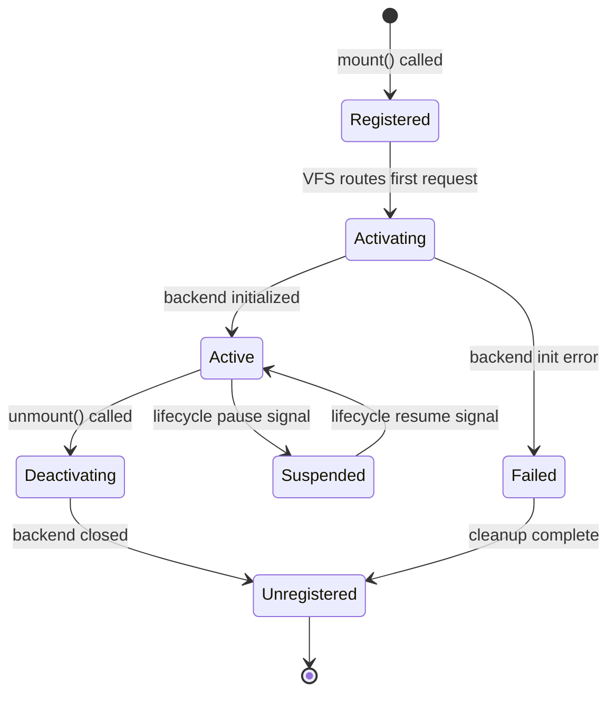
```mermaid
stateDiagram-v2
    [*] --> Registered : mount() called
    Registered --> Activating : VFS routes first request
    Activating --> Active : backend initialized
    Activating --> Failed : backend init error
    Active --> Suspended : lifecycle pause signal
    Suspended --> Active : lifecycle resume signal
    Active --> Deactivating : unmount() called
    Deactivating --> Unregistered : backend closed
    Failed --> Unregistered : cleanup complete
    Unregistered --> [*]
```

---

### 3.4 Mount Precedence Rules

When two mounts have overlapping prefixes, the following rules apply:

| Rule | Description |
|---|---|
| Longest prefix wins | The mount with the longest matching prefix handles the request |
| Explicit over implicit | An explicitly registered mount overrides an inherited path |
| Plugin mounts are isolated | Plugin mounts never overlap with the document root |
| Cache mounts shadow document | `/cache/` requests never fall through to the ZIP root |
| Unmounted paths fail | A request to an unmounted path returns `VfsError::PathNotMounted` |

---

### 3.5 Mount Registration API

| Method | Input | Output | Description |
|---|---|---|---|
| `register(point, backend, options)` | Mount point path + backend + options | `MountHandle` | Register a new mount |
| `unregister(handle)` | MountHandle | `Result` | Remove a mount |
| `list_mounts()` | — | `Vec<MountInfo>` | List all active mounts |
| `get_mount(path)` | VfsPath | `Option<MountInfo>` | Find mount for path |
| `is_mounted(point)` | Mount point path | `bool` | Check if point is mounted |

---

## 4. Directory Tree

### 4.1 Complete Virtual Directory Tree

The LDFX VFS presents the following complete virtual directory tree to all
consumers. Every path in this tree is accessible through the VFS API.

```
/                                   ← Document root (ZipMount, read-only)
│
├── manifest.json                   ← Document manifest (Module 05)
│
├── metadata/                       ← Document metadata folder
│   └── metadata.json               ← Full metadata record (Module 06)
│
├── pages/                          ← All document pages
│   ├── index.json                  ← Page index (Module 11)
│   ├── page_001/                   ← First page directory
│   │   ├── content.json            ← Page content node tree
│   │   └── layout.json             ← Page layout specification
│   ├── page_002/
│   │   ├── content.json
│   │   └── layout.json
│   └── page_NNN/                   ← Additional pages (NNN = zero-padded number)
│       ├── content.json
│       └── layout.json
│
├── assets/                         ← All document assets
│   ├── index.json                  ← Asset index (Module 10)
│   ├── images/                     ← Image assets (webp, avif, png, jpeg, gif, svg)
│   │   └── <sha256-prefix>.<ext>   ← Content-addressed naming
│   ├── audio/                      ← Audio assets (opus, aac, mp3, flac, wav)
│   │   └── <sha256-prefix>.<ext>
│   ├── video/                      ← Video assets (webm, mp4)
│   │   └── <sha256-prefix>.<ext>
│   ├── fonts/                      ← Font assets (woff2, woff, ttf, otf)
│   │   └── <sha256-prefix>.<ext>
│   ├── vector/                     ← Vector assets (svg, pdf)
│   │   └── <sha256-prefix>.<ext>
│   ├── 3d/                         ← 3D model assets (glb, gltf, usdz)
│   │   └── <sha256-prefix>.<ext>
│   └── data/                       ← Data assets (json, csv, parquet)
│       └── <sha256-prefix>.<ext>
│
├── scripts/                        ← Script files (optional)
│   └── index.json                  ← Script index
│
├── annotations/                    ← Annotation data (optional)
│   └── index.json                  ← Annotation index
│
├── security/                       ← Security files (required)
│   ├── hashes.json                 ← SHA-256 hash manifest (Module 09)
│   └── signatures.json             ← Digital signatures (Module 09)
│
├── plugins/                        ← Embedded plugins (optional)
│   ├── index.json                  ← Plugin index (Module 12)
│   └── <plugin-id>/                ← Per-plugin directory
│       ├── plugin.json             ← Plugin manifest
│       └── plugin.wasm             ← Plugin WASM binary
│
├── ai/                             ← AI data (optional)
│   └── index.json                  ← AI index
│
├── thumbnails/                     ← Document thumbnails (optional)
│   └── cover.webp                  ← Cover thumbnail
│
│   ── Runtime-managed paths (not in ZIP — mounted separately) ──
│
├── cache/                          ← Runtime cache (DiskMount, read-write)
│   ├── entries/                    ← Cached decompressed entries
│   ├── decoded/                    ← Decoded asset cache
│   └── manifest.json               ← Cache manifest (what is cached)
│
├── logs/                           ← Session logs (MemoryMount, append-only)
│   ├── runtime.log                 ← Runtime log
│   └── security.log                ← Security event log
│
└── temp/                           ← Temporary files (MemoryMount, read-write)
    ├── render/                     ← Pre-rendered page fragments
    └── processing/                 ← Intermediate processing results
```

---

### 4.2 Folder Ownership and Access Rights

| Path | Owner | Read | Write | Delete | Enumerate | Notes |
|---|---|---|---|---|---|---|
| `/` | Runtime Kernel | All | None | None | All | Document root |
| `/manifest.json` | Runtime Kernel | All | None | None | N/A | Hot-cached always |
| `/metadata/` | Runtime Kernel | All | None | None | All | |
| `/pages/` | Resource Manager | All | None | None | All | |
| `/pages/index.json` | Resource Manager | All | None | None | N/A | Hot-cached always |
| `/pages/page_*/` | Resource Manager | All | None | None | All | |
| `/assets/` | Resource Manager | All | None | None | All | |
| `/assets/index.json` | Resource Manager | All | None | None | N/A | |
| `/assets/images/` | Resource Manager | All | None | None | All | |
| `/assets/audio/` | Resource Manager | All | None | None | All | |
| `/assets/video/` | Resource Manager | All | None | None | All | |
| `/assets/fonts/` | Resource Manager | All | None | None | All | |
| `/scripts/` | Script Runtime | All | None | None | All | Requires has_scripts |
| `/annotations/` | Annotation Service | All | None | None | All | Requires has_annotations |
| `/security/` | Security Manager | Security Mgr only | None | None | Security Mgr only | Restricted |
| `/security/hashes.json` | Security Manager | Security Mgr only | None | None | N/A | Boot-time only |
| `/security/signatures.json` | Security Manager | Security Mgr only | None | None | N/A | Boot-time only |
| `/plugins/` | Extension Loader | All | None | None | All | |
| `/plugins/<id>/` | Extension Loader | Extension Loader | None | None | Extension Loader | |
| `/ai/` | AI Runtime | AI Runtime only | None | None | AI Runtime only | Requires has_ai |
| `/thumbnails/` | Resource Manager | All | None | None | All | |
| `/cache/` | Cache Manager | Cache Manager | Cache Manager | Cache Manager | Cache Manager | Runtime-managed |
| `/logs/` | Logging System | Logging System | Logging System | None | None | Append-only |
| `/temp/` | Runtime Kernel | Runtime only | Runtime only | Runtime only | Runtime only | Session-scoped |
| `/plugins/<id>/` (sandbox) | Plugin Runtime | Owning plugin | Owning plugin | Owning plugin | Owning plugin | Isolated |

---

### 4.3 Folder Purpose Descriptions

#### `/manifest.json`
The document manifest. Contains document identity, feature flags, runtime
requirements, security declarations, and compatibility information. This is
the first file read during boot and is pinned in the hot cache for the
entire session. Maximum size: 256KB.

#### `/metadata/metadata.json`
The document metadata record. Contains authors, license, permissions,
revision history, accessibility information, and localization data.
Read during boot Phase 8. Maximum size: 2MB.

#### `/pages/`
All page content. The `index.json` file lists all pages with their paths,
titles, and ordering. Each page has its own subdirectory containing
`content.json` (the content node tree) and `layout.json` (the page layout
specification). Pages are loaded lazily — only the entry page is loaded
at boot.

#### `/assets/`
All document assets organized by type. Assets are named using content-addressed
naming: the first 32 hex characters of the SHA-256 hash of the asset content,
followed by the file extension. The `index.json` file provides the mapping
from logical asset IDs to file paths.

#### `/security/`
Security-critical files. Access is restricted to the Security Manager only.
`hashes.json` contains the SHA-256 hash of every document entry. `signatures.json`
contains digital signature records. These files are read only during boot
and are never exposed to plugins, scripts, or the Application Layer.

#### `/plugins/`
Embedded plugin packages. Each plugin has its own subdirectory containing
a `plugin.json` manifest and a `plugin.wasm` binary. The `index.json` file
lists all embedded plugins. Plugin WASM binaries are loaded by the Extension
Loader and passed to the Plugin Runtime for instantiation.

#### `/cache/`
Runtime-managed cache. Not present in the ZIP archive — mounted as a
DiskMount by the runtime. Contains decompressed and decoded versions of
document entries for fast access on subsequent opens. Managed entirely
by the Cache Manager.

#### `/logs/`
Session log files. Not present in the ZIP archive — mounted as a MemoryMount.
Written by the Logging System. Flushed to the platform log directory at
shutdown. Never readable through the VFS API by consumers.

#### `/temp/`
Temporary runtime files. Not present in the ZIP archive — mounted as a
MemoryMount. Used by the runtime for intermediate processing results.
All content is destroyed when the document is closed.

---

### 4.4 Folder Constraints

| Constraint | Description |
|---|---|
| No new root folders in ZIP | Only the defined root folders may appear in the ZIP archive |
| Unknown root folders | Treated as warnings, not errors (forward compatibility) |
| Empty folders | Permitted — a folder may exist with no entries |
| Nested depth limit | Maximum 8 levels of nesting within any folder |
| Entry name length | Maximum 255 bytes (UTF-8 encoded) |
| Total entry count | Maximum 100,000 entries per document |
| Total uncompressed size | Maximum 10GB per document (ZIP64) |

---

## 5. Path Resolution

### 5.1 Overview

Path resolution is the process of transforming a raw path string into a
validated, normalized `ResolvedPath` that can be safely used for VFS
operations. Every path that enters the VFS — from any consumer — must
pass through the Path Resolver before any other operation is performed.

The Path Resolver is stateless and deterministic. Given the same input,
it always produces the same output. It performs no I/O.

---

### 5.2 Path Types

#### 5.2.1 Absolute Paths

An absolute path begins with `/` and is resolved relative to the VFS root.

```
/manifest.json
/pages/page_001/content.json
/assets/images/a1b2c3d4e5f6a1b2c3d4e5f6a1b2c3d4.webp
/security/hashes.json
```

Absolute paths are the canonical form. All paths are normalized to absolute
form before being used in any VFS operation.

#### 5.2.2 Relative Paths

A relative path does not begin with `/`. It is resolved relative to a
provided base path. Relative paths are accepted at the VFS API layer
and immediately converted to absolute form.

```
pages/page_001/content.json        → /pages/page_001/content.json
../assets/images/abc.webp          → REJECTED (traversal)
./layout.json                      → resolved relative to base
```

#### 5.2.3 Path Aliases

Path aliases are named shortcuts to frequently accessed paths. They are
defined by the runtime and resolved before normalization.

| Alias | Resolves To | Description |
|---|---|---|
| `@manifest` | `/manifest.json` | Document manifest |
| `@metadata` | `/metadata/metadata.json` | Document metadata |
| `@page-index` | `/pages/index.json` | Page index |
| `@asset-index` | `/assets/index.json` | Asset index |
| `@plugin-index` | `/plugins/index.json` | Plugin index |
| `@hashes` | `/security/hashes.json` | Hash manifest |
| `@signatures` | `/security/signatures.json` | Signatures file |
| `@entry-page` | Resolved from manifest at boot | Entry page content |

Aliases are resolved first, before any other normalization step.

#### 5.2.4 Virtual Links

Virtual links are runtime-defined path mappings that redirect one path
to another. They are used by the runtime to provide stable paths for
dynamically located content.

```
/current-page/content.json  →  /pages/page_003/content.json
/current-page/layout.json   →  /pages/page_003/layout.json
```

Virtual links are updated by the Lifecycle Manager when the active page
changes. They are never exposed to plugins or scripts.

---

### 5.3 Path Normalization Pipeline

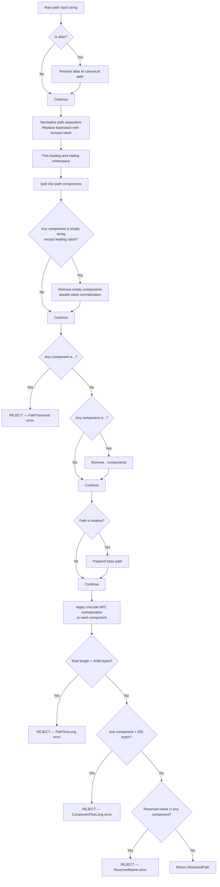
```mermaid
flowchart TD
    A[Raw path input string] --> B{Is alias?}
    B -->|Yes| C[Resolve alias to canonical path]
    B -->|No| D[Continue]
    C --> D

    D --> E[Normalize path separators\nReplace backslash with forward slash]
    E --> F[Trim leading and trailing whitespace]
    F --> G[Split into path components]
    G --> H{Any component is empty string\nexcept leading slash?}
    H -->|Yes| I[Remove empty components\ndouble-slash normalization]
    H -->|No| J[Continue]
    I --> J

    J --> K{Any component is ..?}
    K -->|Yes| L[REJECT — PathTraversal error]
    K -->|No| M{Any component is . ?}
    M -->|Yes| N[Remove . components]
    M -->|No| O[Continue]
    N --> O

    O --> P{Path is relative?}
    P -->|Yes| Q[Prepend base path]
    P -->|No| R[Continue]
    Q --> R

    R --> S[Apply Unicode NFC normalization\nto each component]
    S --> T{Total length > 4096 bytes?}
    T -->|Yes| U[REJECT — PathTooLong error]
    T -->|No| V{Any component > 255 bytes?}
    V -->|Yes| W[REJECT — ComponentTooLong error]
    V -->|No| X{Reserved name in any component?}
    X -->|Yes| Y[REJECT — ReservedName error]
    X -->|No| Z[Return ResolvedPath]
```

---

### 5.4 Traversal Protection

Path traversal is the most critical security concern in path resolution.
The VFS applies multiple layers of traversal protection:

#### Layer 1 — Component-level `..` rejection
Any path component equal to `..` is immediately rejected. This is checked
after splitting the path into components, before any other processing.

#### Layer 2 — Encoded traversal detection
The following encoded forms of `..` are detected and rejected:

| Encoded Form | Description |
|---|---|
| `%2e%2e` | URL-encoded `..` |
| `%2e%2e%2f` | URL-encoded `../` |
| `..%2f` | Mixed encoding |
| `%2e%2e/` | Mixed encoding |
| `....` | Four-dot variant |
| `..;` | Semicolon variant |

#### Layer 3 — Null byte injection
Any path containing a null byte (`\0`) is rejected immediately.

#### Layer 4 — Mount boundary enforcement
After normalization, the resolved path is checked against the mount
boundary. A path that resolves outside the mount's root is rejected
even if it contains no `..` components (e.g., via symlink following).

#### Layer 5 — ZIP entry name validation
When the resolved path is mapped to a ZIP entry name, the ZIP entry
name is independently validated for traversal before the ZIP Reader
is invoked.

---

### 5.5 Case Sensitivity

| Platform | VFS Behavior | Notes |
|---|---|---|
| Linux | Case-sensitive | ZIP entry names are case-sensitive |
| macOS | Case-insensitive (default) | Normalized to lowercase |
| Windows | Case-insensitive | Normalized to lowercase |
| WASM | Case-sensitive | Follows ZIP entry names exactly |

**Policy:** All VFS paths are normalized to lowercase before lookup.
ZIP entry names are stored in lowercase in the entry index. Documents
that contain mixed-case entry names are accepted but normalized.

---

### 5.6 Unicode Path Rules

| Rule | Description |
|---|---|
| Encoding | All paths must be valid UTF-8 |
| Normalization | NFC (Canonical Decomposition, Canonical Composition) |
| BOM | Byte Order Mark in path strings is rejected |
| Control characters | Any Unicode control character (U+0000–U+001F, U+007F) is rejected |
| Null bytes | Rejected (see traversal protection) |
| Right-to-left override | U+202E and similar bidirectional override characters are rejected |
| Homoglyph attacks | Not mitigated at path level — mitigated at display level |

---

### 5.7 Reserved Names

The following path component names are reserved and may not appear in
any user-accessible path:

| Reserved Name | Reason |
|---|---|
| `CON`, `PRN`, `AUX`, `NUL` | Windows reserved device names |
| `COM1`–`COM9` | Windows reserved device names |
| `LPT1`–`LPT9` | Windows reserved device names |
| `.` | Current directory — removed during normalization |
| `..` | Parent directory — rejected as traversal |
| Names ending with `.` | Windows filesystem restriction |
| Names ending with space | Windows filesystem restriction |

---

### 5.8 Path Length Limits

| Limit | Value | Notes |
|---|---|---|
| Maximum total path length | 4096 bytes | UTF-8 encoded |
| Maximum single component length | 255 bytes | UTF-8 encoded |
| Maximum path depth | 8 levels | Counted from mount root |
| Minimum path length | 1 character | Empty paths rejected |

---

### 5.9 ResolvedPath Type

The `ResolvedPath` is the output of the Path Resolver. It is an opaque
type that carries the validated, normalized path. It cannot be constructed
directly — it can only be produced by the Path Resolver.

| Field | Type | Description |
|---|---|---|
| `absolute` | `String` | Normalized absolute path string |
| `components` | `Vec<String>` | Pre-split path components |
| `mount_point` | `String` | The mount point prefix |
| `mount_relative` | `String` | Path relative to mount root |
| `depth` | `u8` | Number of path components |
| `is_directory` | `bool` | True if path ends with `/` |

---

## 6. File Objects

### 6.1 Object Hierarchy

The VFS defines a hierarchy of file objects that represent different
aspects of virtual filesystem entries.

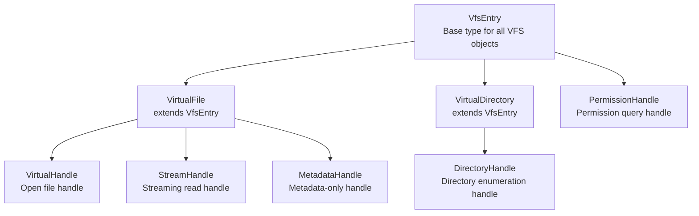
```mermaid
graph TD
    VE[VfsEntry\nBase type for all VFS objects]
    VF[VirtualFile\nextends VfsEntry]
    VD[VirtualDirectory\nextends VfsEntry]
    VH[VirtualHandle\nOpen file handle]
    SH[StreamHandle\nStreaming read handle]
    DH[DirectoryHandle\nDirectory enumeration handle]
    MH[MetadataHandle\nMetadata-only handle]
    PH[PermissionHandle\nPermission query handle]

    VE --> VF
    VE --> VD
    VF --> VH
    VF --> SH
    VF --> MH
    VD --> DH
    VE --> PH
```

---

### 6.2 VfsEntry — Base Type

`VfsEntry` is the base type for all VFS objects. It carries the common
properties shared by all entries.

| Field | Type | Mutable | Description |
|---|---|---|---|
| `path` | `ResolvedPath` | No | Canonical path of this entry |
| `entry_type` | `VfsEntryType` | No | File, Directory, or Symlink |
| `mount_id` | `MountId` | No | Which mount this entry belongs to |
| `size_compressed` | `Option<u64>` | No | Compressed size in ZIP (None for non-ZIP entries) |
| `size_uncompressed` | `u64` | No | Uncompressed size in bytes |
| `compression_method` | `CompressionMethod` | No | Stored, Deflated, or Zstd |
| `crc32` | `Option<u32>` | No | ZIP CRC32 (None for non-ZIP entries) |
| `hash_sha256` | `Option<String>` | No | Expected SHA-256 from hashes.json |
| `last_modified` | `Option<DateTime>` | No | ZIP entry modification time |
| `is_encrypted` | `bool` | No | Always false — encrypted entries rejected |
| `permissions` | `VfsPermissions` | No | Access permissions for this entry |

---

### 6.3 VirtualFile

`VirtualFile` extends `VfsEntry` and represents a readable file entry.

| Field | Type | Mutable | Description |
|---|---|---|---|
| `(all VfsEntry fields)` | — | — | Inherited |
| `content_type` | `ContentType` | No | JSON, Binary, WASM, Image, etc. |
| `is_hot_cached` | `bool` | Yes | Currently in hot cache |
| `is_warm_cached` | `bool` | Yes | Currently in warm cache |
| `integrity_verified` | `bool` | Yes | SHA-256 verified this session |
| `open_handle_count` | `u32` | Yes | Number of currently open handles |
| `last_accessed` | `Option<DateTime>` | Yes | Last access time (for LRU) |
| `access_count` | `u64` | Yes | Total access count this session |

---

### 6.4 VirtualDirectory

`VirtualDirectory` extends `VfsEntry` and represents a directory entry.

| Field | Type | Mutable | Description |
|---|---|---|---|
| `(all VfsEntry fields)` | — | — | Inherited |
| `child_count` | `u32` | No | Number of direct children |
| `children` | `Vec<VfsEntry>` | No | Direct children (lazy-loaded) |
| `is_indexed` | `bool` | Yes | Whether children have been enumerated |

---

### 6.5 VirtualHandle

`VirtualHandle` is an open file handle returned by `VfsHandle::open()`.
It represents an active read session on a specific file.

| Field | Type | Mutable | Description |
|---|---|---|---|
| `handle_id` | `HandleId` | No | Unique handle identifier |
| `path` | `ResolvedPath` | No | Path of the opened file |
| `position` | `u64` | Yes | Current read position |
| `size` | `u64` | No | Total uncompressed size |
| `mode` | `OpenMode` | No | Read, ReadSeek, Stream |
| `caller_id` | `CallerId` | No | Identity of the opening component |
| `opened_at` | `DateTime` | No | When this handle was opened |
| `bytes_read` | `u64` | Yes | Total bytes read through this handle |
| `is_closed` | `bool` | Yes | Whether this handle has been closed |
| `timeout` | `Option<Duration>` | No | Auto-close timeout |

**Handle lifecycle:**
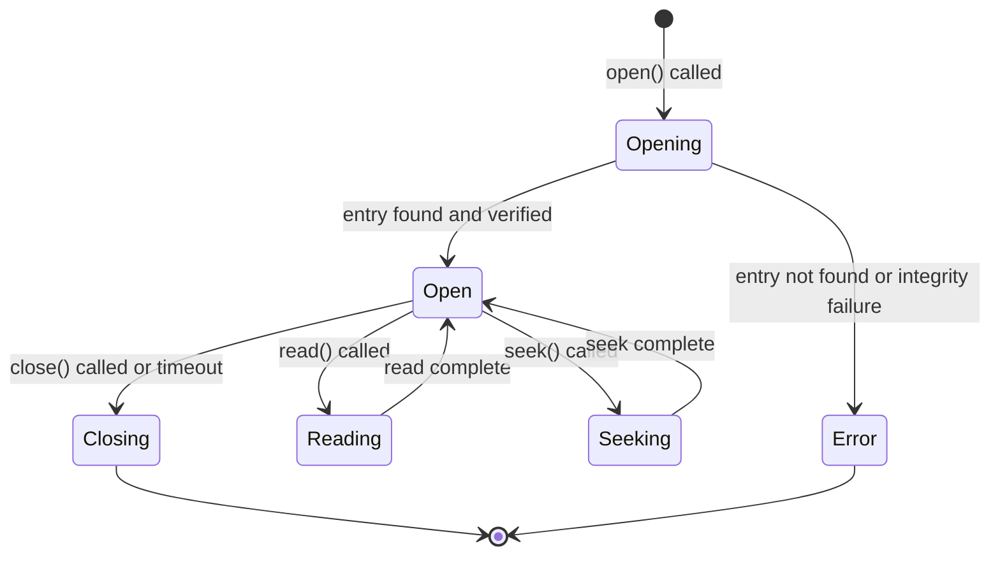
```mermaid
stateDiagram-v2
    [*] --> Opening : open() called
    Opening --> Open : entry found and verified
    Opening --> Error : entry not found or integrity failure
    Open --> Reading : read() called
    Reading --> Open : read complete
    Open --> Seeking : seek() called
    Seeking --> Open : seek complete
    Open --> Closing : close() called or timeout
    Closing --> [*]
    Error --> [*]
```

---

### 6.6 StreamHandle

`StreamHandle` is a specialized handle for streaming reads of large entries.
It supports chunk-by-chunk reading without buffering the entire entry in memory.

| Field | Type | Mutable | Description |
|---|---|---|---|
| `handle_id` | `HandleId` | No | Unique handle identifier |
| `path` | `ResolvedPath` | No | Path of the streamed file |
| `chunk_size` | `usize` | No | Bytes per chunk (default: 64KB) |
| `position` | `u64` | Yes | Current stream position |
| `total_size` | `u64` | No | Total uncompressed size |
| `chunks_delivered` | `u64` | Yes | Number of chunks delivered |
| `is_complete` | `bool` | Yes | Whether all chunks have been delivered |
| `is_cancelled` | `bool` | Yes | Whether streaming was cancelled |
| `decompressor` | `DecompressorState` | Yes | Internal decompression state |

---

### 6.7 DirectoryHandle

`DirectoryHandle` is returned by `VfsHandle::list()` and supports
incremental directory enumeration.

| Field | Type | Mutable | Description |
|---|---|---|---|
| `handle_id` | `HandleId` | No | Unique handle identifier |
| `path` | `ResolvedPath` | No | Path of the directory |
| `entries` | `Vec<VfsDirEntry>` | No | All entries (loaded at open) |
| `position` | `usize` | Yes | Current enumeration position |
| `filter` | `Option<EntryFilter>` | No | Optional filter (files only, dirs only) |
| `sort_order` | `SortOrder` | No | Name, Size, Type |

---

### 6.8 VfsDirEntry

`VfsDirEntry` is a lightweight entry descriptor returned during directory
enumeration. It does not open the entry — it only describes it.

| Field | Type | Description |
|---|---|---|
| `name` | `String` | Entry name (not full path) |
| `path` | `ResolvedPath` | Full resolved path |
| `entry_type` | `VfsEntryType` | File or Directory |
| `size_uncompressed` | `u64` | Uncompressed size |
| `size_compressed` | `Option<u64>` | Compressed size (ZIP entries only) |
| `content_type` | `ContentType` | Detected content type |
| `is_cached` | `bool` | Whether entry is currently cached |

---

### 6.9 MetadataHandle

`MetadataHandle` provides access to entry metadata without opening the
entry for reading. Used for stat operations and directory listings.

| Field | Type | Description |
|---|---|---|
| `path` | `ResolvedPath` | Entry path |
| `size_uncompressed` | `u64` | Uncompressed size |
| `size_compressed` | `Option<u64>` | Compressed size |
| `compression_ratio` | `f32` | Compression ratio |
| `content_type` | `ContentType` | Detected content type |
| `hash_sha256` | `Option<String>` | Expected hash |
| `integrity_verified` | `bool` | Whether hash has been verified |
| `is_cached` | `bool` | Whether in any cache tier |
| `cache_tier` | `Option<CacheTier>` | Hot, Warm, or Cold |
| `last_accessed` | `Option<DateTime>` | Last access time |

---

### 6.10 Handle Limits

| Limit | Value | Notes |
|---|---|---|
| Max open handles per caller | 32 | Enforced per caller identity |
| Max open handles total | 256 | Enforced globally |
| Max stream handles per caller | 4 | Streaming is resource-intensive |
| Handle auto-close timeout | 30 seconds | Handles idle for 30s are auto-closed |
| Max bytes per handle per second | 100MB | Rate limit for large reads |

---

## 7. File Operations

### 7.1 Operation Overview

The VFS exposes a defined set of file operations. Every operation is
typed, validated, permission-checked, and integrity-verified before
returning data to the caller.

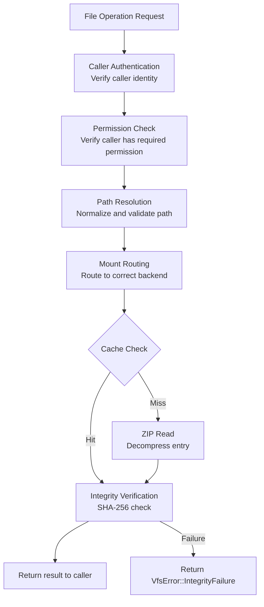
```mermaid
graph TD
    OP[File Operation Request] --> AUTH[Caller Authentication\nVerify caller identity]
    AUTH --> PERM[Permission Check\nVerify caller has required permission]
    PERM --> PATH[Path Resolution\nNormalize and validate path]
    PATH --> MOUNT[Mount Routing\nRoute to correct backend]
    MOUNT --> CACHE{Cache Check}
    CACHE -->|Hit| VERIFY[Integrity Verification\nSHA-256 check]
    CACHE -->|Miss| ZIP[ZIP Read\nDecompress entry]
    ZIP --> VERIFY
    VERIFY --> RESULT[Return result to caller]
    VERIFY -->|Failure| ERR[Return VfsError::IntegrityFailure]
```

---

### 7.2 Open

**Signature:** `open(path: VfsPath, options: OpenOptions) → Result<VirtualHandle, VfsError>`

**Description:** Opens a file entry for reading. Returns a `VirtualHandle`
that the caller uses for subsequent read and seek operations.

**Options:**

| Option | Type | Default | Description |
|---|---|---|---|
| `mode` | `OpenMode` | `Read` | Read, ReadSeek, or Stream |
| `timeout` | `Option<Duration>` | `None` | Auto-close timeout |
| `priority` | `ReadPriority` | `Normal` | Critical, High, Normal, Low |
| `verify_integrity` | `bool` | `true` | Whether to verify SHA-256 |
| `allow_cached` | `bool` | `true` | Whether to serve from cache |

**Open modes:**

| Mode | Description | Seek Support | Streaming |
|---|---|---|---|
| `Read` | Sequential read from start | No | No |
| `ReadSeek` | Random access read | Yes | No |
| `Stream` | Chunk-by-chunk streaming | No | Yes |

**Sequence:**
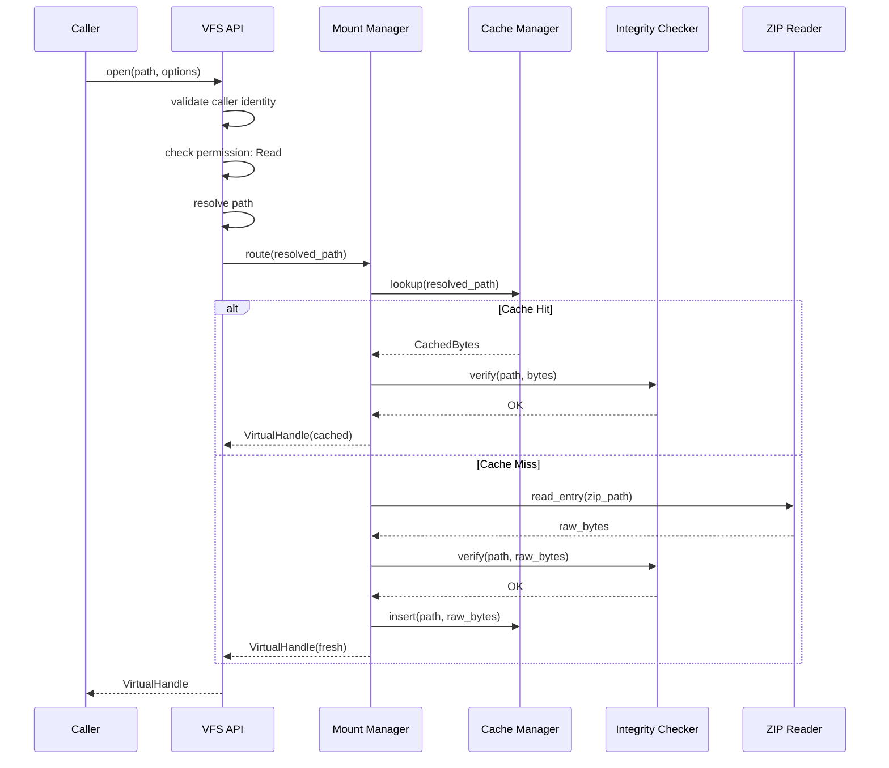
```mermaid
sequenceDiagram
    participant C as Caller
    participant API as VFS API
    participant MM as Mount Manager
    participant CM as Cache Manager
    participant IC as Integrity Checker
    participant ZR as ZIP Reader

    C->>API: open(path, options)
    API->>API: validate caller identity
    API->>API: check permission: Read
    API->>API: resolve path
    API->>MM: route(resolved_path)
    MM->>CM: lookup(resolved_path)

    alt Cache Hit
        CM-->>MM: CachedBytes
        MM->>IC: verify(path, bytes)
        IC-->>MM: OK
        MM-->>API: VirtualHandle(cached)
    else Cache Miss
        MM->>ZR: read_entry(zip_path)
        ZR-->>MM: raw_bytes
        MM->>IC: verify(path, raw_bytes)
        IC-->>MM: OK
        MM->>CM: insert(path, raw_bytes)
        MM-->>API: VirtualHandle(fresh)
    end

    API-->>C: VirtualHandle
```

**Errors:**

| Error | Condition |
|---|---|
| `VfsError::NotFound` | Path does not exist in any mount |
| `VfsError::PermissionDenied` | Caller lacks Read permission |
| `VfsError::PathTraversal` | Path contains traversal components |
| `VfsError::IntegrityFailure` | SHA-256 mismatch |
| `VfsError::HandleLimitExceeded` | Caller has too many open handles |
| `VfsError::EntryEncrypted` | ZIP entry is encrypted |
| `VfsError::ZipError` | ZIP decompression failed |

---

### 7.3 Read

**Signature:** `read(handle: &mut VirtualHandle, buf: &mut [u8]) → Result<usize, VfsError>`

**Description:** Reads bytes from an open handle into the provided buffer.
Returns the number of bytes actually read. Returns `Ok(0)` at end of file.

**Behavior:**
- Reads sequentially from the current position
- Advances the handle position by the number of bytes read
- Returns fewer bytes than requested only at end of file
- Thread-safe — multiple callers may read different handles simultaneously
- A single handle must not be shared between threads

**Chunk reading:**
For large entries, the read operation internally uses chunk-based
decompression to avoid buffering the entire entry in memory. The chunk
size is determined by the entry size and the available memory budget.

| Entry Size | Internal Chunk Size | Buffering Strategy |
|---|---|---|
| < 64KB | Full entry | Buffer entirely in memory |
| 64KB – 1MB | 64KB chunks | Stream through decompressor |
| 1MB – 10MB | 256KB chunks | Stream through decompressor |
| > 10MB | 1MB chunks | Stream through decompressor |

**Errors:**

| Error | Condition |
|---|---|
| `VfsError::HandleClosed` | Handle has been closed |
| `VfsError::HandleInvalid` | Handle ID is not recognized |
| `VfsError::IoError` | Underlying I/O error |
| `VfsError::DecompressionError` | ZIP decompression failed mid-read |

---

### 7.4 Seek

**Signature:** `seek(handle: &mut VirtualHandle, pos: SeekFrom) → Result<u64, VfsError>`

**Description:** Sets the read position within an open handle. Only available
for handles opened with `OpenMode::ReadSeek`.

**SeekFrom variants:**

| Variant | Description |
|---|---|
| `SeekFrom::Start(n)` | Seek to byte offset `n` from the start |
| `SeekFrom::End(n)` | Seek to `n` bytes before the end (n must be ≤ 0) |
| `SeekFrom::Current(n)` | Seek `n` bytes from current position |

**Implementation note:** Seeking in a compressed ZIP entry requires
decompressing from the beginning up to the seek target. The VFS
mitigates this by caching the fully decompressed entry in the warm
cache when a seek handle is opened. Seek operations on cached entries
are O(1).

**Errors:**

| Error | Condition |
|---|---|
| `VfsError::SeekNotSupported` | Handle was not opened with ReadSeek mode |
| `VfsError::SeekOutOfBounds` | Seek target is beyond end of file |
| `VfsError::HandleClosed` | Handle has been closed |

---

### 7.5 Close

**Signature:** `close(handle: VirtualHandle) → Result<(), VfsError>`

**Description:** Closes an open handle and releases its resources.
After close, the handle is invalid and must not be used.

**Behavior:**
- Decrements the open handle count for the entry
- Releases any handle-specific buffers
- Updates the entry's last-accessed time
- Emits a `HandleClosed` event in developer mode
- Handles are automatically closed if dropped without explicit close

**Auto-close:** Handles that have been idle for longer than their
configured timeout are automatically closed by the VFS housekeeping
task. The caller receives a `VfsError::HandleClosed` on the next
operation after auto-close.

---

### 7.6 Stat

**Signature:** `stat(path: VfsPath) → Result<MetadataHandle, VfsError>`

**Description:** Returns metadata for a path without opening the entry
for reading. Does not perform integrity verification. Does not count
against the open handle limit.

**Returns:** `MetadataHandle` containing size, compression info, content
type, cache status, and integrity verification status.

**Performance:** Stat operations are served from the entry index and
do not require ZIP decompression. Target latency: < 0.5ms.

---

### 7.7 Exists

**Signature:** `exists(path: VfsPath) → bool`

**Description:** Returns `true` if the path exists in any mounted backend.
Returns `false` if the path does not exist or if the caller lacks permission
to know whether it exists.

**Note:** `exists()` does not distinguish between "does not exist" and
"permission denied" — both return `false`. This prevents information
leakage about restricted paths.

---

### 7.8 Enumerate (List)

**Signature:** `list(path: VfsPath, options: ListOptions) → Result<DirectoryHandle, VfsError>`

**Description:** Returns a `DirectoryHandle` for iterating over the
entries in a directory.

**Options:**

| Option | Type | Default | Description |
|---|---|---|---|
| `filter` | `Option<EntryFilter>` | `None` | Files only, dirs only, or all |
| `sort` | `SortOrder` | `Name` | Name, Size, or Type |
| `recursive` | `bool` | `false` | Include subdirectory entries |
| `max_depth` | `u8` | `1` | Maximum recursion depth |

**Behavior:**
- Returns entries from all mounts whose paths are under the requested directory
- Entries from different mounts at the same path are merged
- Hidden entries (starting with `.`) are included unless filtered
- The caller must have Read permission on the directory

---

### 7.9 Streaming

**Signature:** `stream(path: VfsPath, options: StreamOptions) → Result<StreamHandle, VfsError>`

**Description:** Opens a streaming read handle for large entries. Returns
chunks of data as they are decompressed, without buffering the entire
entry in memory.

**Options:**

| Option | Type | Default | Description |
|---|---|---|---|
| `chunk_size` | `usize` | `65536` | Bytes per chunk (64KB default) |
| `buffer_ahead` | `u8` | `2` | Number of chunks to buffer ahead |
| `timeout` | `Option<Duration>` | `None` | Stream timeout |
| `on_progress` | `Option<ProgressCallback>` | `None` | Progress callback |

**Streaming flow:**
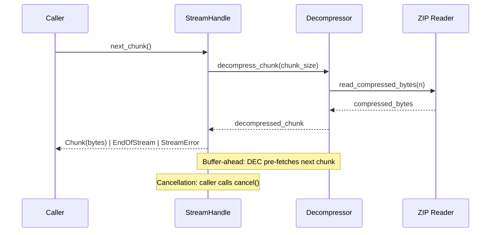
```mermaid
sequenceDiagram
    participant C as Caller
    participant SH as StreamHandle
    participant DEC as Decompressor
    participant ZR as ZIP Reader

    C->>SH: next_chunk()
    SH->>DEC: decompress_chunk(chunk_size)
    DEC->>ZR: read_compressed_bytes(n)
    ZR-->>DEC: compressed_bytes
    DEC-->>SH: decompressed_chunk
    SH-->>C: Chunk(bytes) | EndOfStream | StreamError

    Note over SH,DEC: Buffer-ahead: DEC pre-fetches next chunk
    Note over SH: Cancellation: caller calls cancel()
```

**Cancellation:** The caller may cancel a stream at any time by calling
`stream_handle.cancel()`. The VFS releases all decompressor state and
buffers immediately.

---

### 7.10 Copy

**Signature:** `copy(src: VfsPath, dst: VfsPath) → Result<u64, VfsError>`

**Description:** Copies a file from one VFS path to another. The source
must be readable. The destination must be in a writable mount (cache or temp).
Returns the number of bytes copied.

**Restrictions:**
- Source must be in a readable mount
- Destination must be in a writable mount (cache/, temp/, or plugin sandbox)
- Cross-mount copies are permitted
- Copying to the document root (ZipMount) is forbidden

---

### 7.11 Create Temp

**Signature:** `create_temp(prefix: &str, suffix: &str) → Result<VirtualHandle, VfsError>`

**Description:** Creates a new temporary file in `/temp/` with a unique
name. Returns a writable handle. The file is automatically deleted when
the handle is closed or when the document is closed.

**Naming:** Temp files are named `<prefix>-<uuid>.<suffix>`.

---

### 7.12 Create Cache Entry

**Signature:** `create_cache(path: VfsPath, data: &[u8]) → Result<(), VfsError>`

**Description:** Writes a pre-processed entry to the cache mount. Used
by the Resource Manager to store decoded assets and pre-rendered content.
Only the runtime may call this operation — plugins and scripts cannot.

---

### 7.13 Flush

**Signature:** `flush(mount: Option<MountId>) → Result<(), VfsError>`

**Description:** Flushes all pending writes to the specified mount.
If `mount` is `None`, flushes all writable mounts. Used during shutdown
and before warm boot state is saved.

---

### 7.14 Timeout and Cancellation

Every VFS operation supports a timeout. If the operation does not complete
within the timeout, it is cancelled and returns `VfsError::Timeout`.

| Operation | Default Timeout | Configurable |
|---|---|---|
| open | 5 seconds | Yes |
| read (per chunk) | 2 seconds | Yes |
| stream (per chunk) | 10 seconds | Yes |
| stat | 1 second | Yes |
| list | 2 seconds | Yes |
| copy | 30 seconds | Yes |
| flush | 10 seconds | Yes |

Cancellation tokens are supported for all async operations. A cancelled
operation returns `VfsError::Cancelled` immediately.

---

## 8. ZIP Container Interface

### 8.1 Overview

The ZIP Container Interface is the lowest-level component of the VFS that
directly reads the ZIP archive embedded in the `.ldfx` file. It is owned
by the ZIP Reader layer and is never accessed directly by any component
above the Dispatch Manager.

The ZIP archive begins at byte offset 64 of the `.ldfx` file, immediately
after the 64-byte LDFX binary header (Phase 1 Module 02).

---

### 8.2 ZIP Reader Architecture

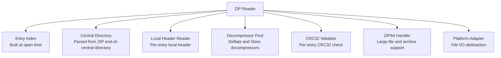
```mermaid
graph TD
    ZR[ZIP Reader]
    ZR --> EI[Entry Index\nBuilt at open time]
    ZR --> CD[Central Directory\nParsed from ZIP end-of-central-directory]
    ZR --> LH[Local Header Reader\nPer-entry local header]
    ZR --> DEC[Decompressor Pool\nDeflate and Store decompressors]
    ZR --> CRC[CRC32 Validator\nPer-entry CRC32 check]
    ZR --> Z64[ZIP64 Handler\nLarge file and archive support]
    ZR --> PA[Platform Adapter\nFile I/O abstraction]
```

---

### 8.3 ZIP Open Sequence

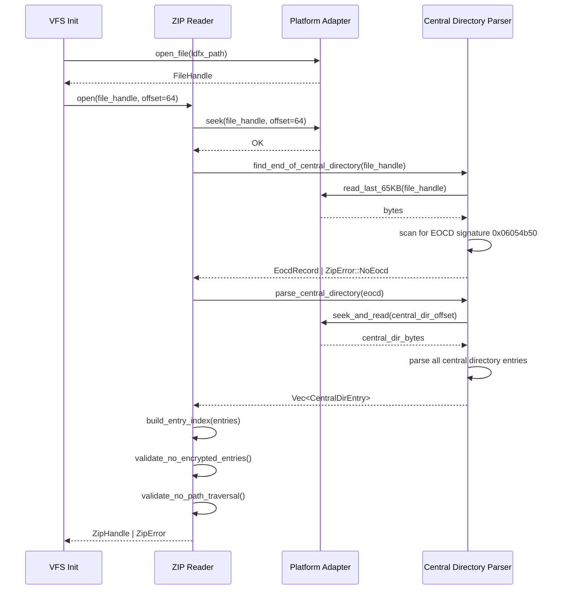
```mermaid
sequenceDiagram
    participant VFS as VFS Init
    participant ZR as ZIP Reader
    participant PA as Platform Adapter
    participant CD as Central Directory Parser

    VFS->>PA: open_file(ldfx_path)
    PA-->>VFS: FileHandle

    VFS->>ZR: open(file_handle, offset=64)
    ZR->>PA: seek(file_handle, offset=64)
    PA-->>ZR: OK

    ZR->>CD: find_end_of_central_directory(file_handle)
    CD->>PA: read_last_65KB(file_handle)
    PA-->>CD: bytes
    CD->>CD: scan for EOCD signature 0x06054b50
    CD-->>ZR: EocdRecord | ZipError::NoEocd

    ZR->>CD: parse_central_directory(eocd)
    CD->>PA: seek_and_read(central_dir_offset)
    PA-->>CD: central_dir_bytes
    CD->>CD: parse all central directory entries
    CD-->>ZR: Vec<CentralDirEntry>

    ZR->>ZR: build_entry_index(entries)
    ZR->>ZR: validate_no_encrypted_entries()
    ZR->>ZR: validate_no_path_traversal()
    ZR-->>VFS: ZipHandle | ZipError
```

---

### 8.4 Entry Index

The ZIP Reader builds an in-memory entry index at open time. This index
maps virtual paths to ZIP central directory entries, enabling O(1) entry
lookup without scanning the central directory on every read.

| Field | Type | Description |
|---|---|---|
| `path` | `String` | Normalized entry path (lowercase) |
| `compressed_size` | `u64` | Compressed size in bytes |
| `uncompressed_size` | `u64` | Uncompressed size in bytes |
| `compression_method` | `u16` | 0=Store, 8=Deflate |
| `crc32` | `u32` | CRC32 of uncompressed data |
| `local_header_offset` | `u64` | Byte offset of local file header |
| `is_directory` | `bool` | True if entry is a directory |
| `is_encrypted` | `bool` | Always false — encrypted entries rejected |
| `is_zip64` | `bool` | True if entry uses ZIP64 extensions |

---

### 8.5 Entry Read Sequence

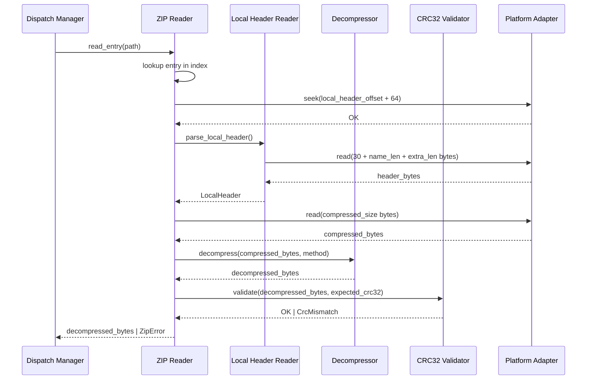
```mermaid
sequenceDiagram
    participant DM as Dispatch Manager
    participant ZR as ZIP Reader
    participant LH as Local Header Reader
    participant DEC as Decompressor
    participant CRC as CRC32 Validator
    participant PA as Platform Adapter

    DM->>ZR: read_entry(path)
    ZR->>ZR: lookup entry in index
    ZR->>PA: seek(local_header_offset + 64)
    PA-->>ZR: OK

    ZR->>LH: parse_local_header()
    LH->>PA: read(30 + name_len + extra_len bytes)
    PA-->>LH: header_bytes
    LH-->>ZR: LocalHeader

    ZR->>PA: read(compressed_size bytes)
    PA-->>ZR: compressed_bytes

    ZR->>DEC: decompress(compressed_bytes, method)
    DEC-->>ZR: decompressed_bytes

    ZR->>CRC: validate(decompressed_bytes, expected_crc32)
    CRC-->>ZR: OK | CrcMismatch

    ZR-->>DM: decompressed_bytes | ZipError
```

---

### 8.6 Compression Methods

| Method | Code | Description | Used For |
|---|---|---|---|
| Store | 0 | No compression | manifest.json, security/ entries |
| Deflate | 8 | DEFLATE compression | All other JSON and text entries |
| Zstandard | 93 | Zstd compression (future) | Reserved for future use |

**Decompressor pool:** The ZIP Reader maintains a pool of reusable
Deflate decompressor instances to avoid repeated allocations. Pool
size: min(4, logical_cpu_count).

---

### 8.7 ZIP64 Support

ZIP64 is required for documents that contain entries or archives larger
than 4GB. The ZIP Reader fully supports ZIP64 extensions.

| ZIP64 Field | Standard Limit | ZIP64 Limit |
|---|---|---|
| Uncompressed size | 4GB | 18 exabytes |
| Compressed size | 4GB | 18 exabytes |
| Local header offset | 4GB | 18 exabytes |
| Number of entries | 65,535 | 4 billion |
| Archive size | 4GB | 18 exabytes |

**ZIP64 detection:** The ZIP Reader checks for the ZIP64 end-of-central-directory
locator signature (`0x07064b50`) before parsing the standard EOCD record.
If found, the ZIP64 EOCD is used instead.

---

### 8.8 CRC32 Validation

Every entry read from the ZIP archive is validated against its CRC32
checksum stored in the central directory. This is a first-pass integrity
check that detects ZIP-level corruption before the SHA-256 integrity
check is applied.

| Check | When | On Failure |
|---|---|---|
| ZIP CRC32 | After decompression | `ZipError::CrcMismatch` |
| SHA-256 | After CRC32 passes | `VfsError::IntegrityFailure` |

The two checks are complementary:
- CRC32 detects ZIP-level corruption (decompression errors, truncation)
- SHA-256 detects content tampering (intentional modification)

---

### 8.9 Error Recovery

| Error | Recovery Strategy |
|---|---|
| `ZipError::NoEocd` | File is not a valid ZIP — fatal, reject document |
| `ZipError::CentralDirCorrupt` | Cannot enumerate entries — fatal, reject document |
| `ZipError::LocalHeaderCorrupt` | Single entry unreadable — return error for that entry, continue |
| `ZipError::CrcMismatch` | Entry data corrupted — return error, do not cache |
| `ZipError::DecompressionError` | Decompressor failed — return error, do not cache |
| `ZipError::EntryNotFound` | Entry does not exist — return `VfsError::NotFound` |
| `ZipError::Truncated` | File was truncated — fatal for affected entry |

---

### 8.10 Memory-Mapped Access

For large documents on desktop platforms (Windows, Linux, macOS), the
ZIP Reader uses memory-mapped file access via `memmap2` to avoid
copying file data through the kernel buffer cache.

**Memory mapping policy:**

| Platform | Memory Mapping | Notes |
|---|---|---|
| Windows | Yes (CreateFileMapping) | Used for files > 1MB |
| Linux | Yes (mmap) | Used for files > 1MB |
| macOS | Yes (mmap) | Used for files > 1MB |
| WASM | No | Not supported in browser sandbox |

**Safety:** Memory-mapped regions are read-only. The VFS never maps
a writable region over the `.ldfx` file.

---

## 9. Caching

### 9.1 Cache Architecture Overview

The VFS cache is a three-tier system designed to eliminate redundant
ZIP decompression and minimize read latency for frequently accessed
entries. The cache is managed entirely by the Cache Manager layer and
is transparent to all consumers above the Dispatch Manager.

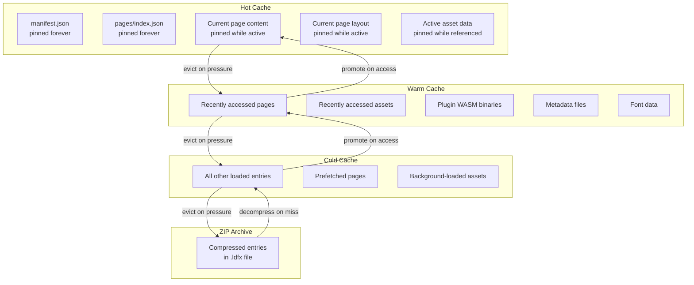
```mermaid
graph TD
    subgraph Hot Cache
        HC1[manifest.json\npinned forever]
        HC2[pages/index.json\npinned forever]
        HC3[Current page content\npinned while active]
        HC4[Current page layout\npinned while active]
        HC5[Active asset data\npinned while referenced]
    end

    subgraph Warm Cache
        WC1[Recently accessed pages]
        WC2[Recently accessed assets]
        WC3[Plugin WASM binaries]
        WC4[Metadata files]
        WC5[Font data]
    end

    subgraph Cold Cache
        CC1[All other loaded entries]
        CC2[Prefetched pages]
        CC3[Background-loaded assets]
    end

    subgraph ZIP Archive
        ZIP[Compressed entries\nin .ldfx file]
    end

    ZIP -->|decompress on miss| CC1
    CC1 -->|promote on access| WC1
    WC1 -->|promote on access| HC3
    HC3 -->|evict on pressure| WC1
    WC1 -->|evict on pressure| CC1
    CC1 -->|evict on pressure| ZIP
```

---

### 9.2 Hot Cache

**Storage:** In-process heap memory, pinned (never evicted by LRU)
**Max size:** 16MB (not configurable — safety limit)
**Eviction:** Manual only — entries are pinned until explicitly unpinned

**Purpose:** The hot cache holds entries that must be available with
sub-millisecond latency at all times. These are the entries that the
runtime accesses on every operation: the manifest, the page index,
the current page content, and the currently active assets.

**Pinned entries (always in hot cache):**

| Entry | Pinned When | Unpinned When |
|---|---|---|
| `manifest.json` | VFS initialization | VFS shutdown |
| `pages/index.json` | VFS initialization | VFS shutdown |
| `metadata/metadata.json` | Boot Phase 8 | VFS shutdown |
| `security/hashes.json` | Boot Phase 6 | VFS shutdown |
| Current page `content.json` | Page becomes active | Page changes |
| Current page `layout.json` | Page becomes active | Page changes |
| Active asset data | Asset first accessed | Asset released |

**Hot cache read path:** A hot cache read is a direct memory copy from
the pinned buffer to the caller's buffer. No lock contention. No I/O.
Target latency: < 0.1ms.

**Hot cache overflow policy:** If pinning a new entry would exceed the
16MB limit, the entry is placed in the warm cache instead. A warning
event is emitted. The hot cache limit is never exceeded.

---

### 9.3 Warm Cache

**Storage:** In-process heap memory, LRU-managed
**Max size:** 64MB (configurable via user preferences, range: 16MB–256MB)
**Eviction:** LRU — least recently used entry is evicted when size limit is reached

**Purpose:** The warm cache holds recently accessed entries that are
likely to be accessed again soon. It provides fast access (< 2ms) for
entries that are not pinned in the hot cache.

**Warm cache key:** `(document_hash, entry_path)` — entries are keyed
by both the document hash and the entry path to prevent stale cache
hits when the same VFS instance is reused across documents.

**Warm cache entry metadata:**

| Field | Description |
|---|---|
| `key` | `(document_hash, entry_path)` |
| `data` | Decompressed entry bytes |
| `size` | Size in bytes |
| `inserted_at` | Insertion timestamp |
| `last_accessed` | Last access timestamp |
| `access_count` | Number of accesses |
| `integrity_verified` | Whether SHA-256 was verified |

**Warm cache persistence:** At shutdown, the warm cache is serialized
to the disk cache directory. On warm boot, it is restored. This allows
subsequent opens of the same document to skip decompression entirely.

---

### 9.4 Cold Cache

**Storage:** Disk (platform temp directory)
**Max size:** 256MB (configurable via user preferences, range: 64MB–1GB)
**Eviction:** LRU + 30-minute TTL — entries older than 30 minutes are
evicted regardless of access frequency

**Purpose:** The cold cache provides persistent storage for decompressed
entries across sessions. It is the primary mechanism for warm boot
performance. On a warm boot, the cold cache is checked before the ZIP
archive is read.

**Cold cache directory structure:**
```
<platform_temp>/ldfx-cache/
└── <document_hash>/
    ├── cache-manifest.json     ← Index of cached entries
    ├── entries/
    │   ├── <entry_hash>.bin    ← Decompressed entry data
    │   └── ...
    └── decoded/
        ├── <asset_hash>.bin    ← Decoded asset data (e.g., decoded image)
        └── ...
```

**Cold cache invalidation:**
- Document bytes hash changed → full cold cache invalidation
- Runtime version changed → full cold cache invalidation
- Entry SHA-256 mismatch → single entry invalidation
- TTL expired → single entry eviction
- Manual invalidation via `VfsHandle::invalidate_cache()`

---

### 9.5 Metadata Cache

The metadata cache is a separate, lightweight cache for entry metadata
(size, compression, hash, content type). It is populated from the ZIP
central directory at open time and never evicted during a session.

**Purpose:** Allows `stat()` and `exists()` operations to complete in
< 0.5ms without touching the warm or cold cache.

**Storage:** In-process hash map (`DashMap<ResolvedPath, EntryMetadata>`)
**Max size:** Bounded by entry count × 256 bytes per entry
**Eviction:** None — populated once at open, cleared at close

---

### 9.6 Manifest Cache

The manifest cache is a specialized cache for the parsed `manifest.json`
and `metadata/metadata.json` objects. It stores the deserialized Rust
structs, not the raw bytes.

**Purpose:** Allows the Runtime Kernel and other components to access
manifest and metadata fields without JSON deserialization overhead on
every access.

**Storage:** In-process memory, pinned
**Invalidation:** Never during a session

---

### 9.7 LRU Eviction Algorithm

The warm and cold caches use a clock-hand LRU approximation for
efficient eviction under memory pressure.

```mermaid
flowchart TD
    A[New entry to insert] --> B{Size fits in cache?}
    B -->|Yes| C[Insert entry]
    B -->|No| D[Find LRU candidate]
    D --> E{Candidate is pinned?}
    E -->|Yes| F[Skip — find next LRU]
    E -->|No| G[Evict candidate]
    G --> H[Free memory]
    H --> B
    C --> I[Update LRU order]
```

**Eviction priority (lowest priority evicted first):**
1. Entries with TTL expired
2. Entries with access_count = 1 and oldest last_accessed
3. Entries with access_count > 1 and oldest last_accessed
4. Entries with access_count > 10 (frequently accessed — evict last)

---

### 9.8 Prefetch Strategy

The VFS implements a background prefetch strategy to load entries before
they are requested, reducing perceived latency.

**Prefetch triggers:**

| Trigger | Prefetch Action | Priority |
|---|---|---|
| Entry page loaded | Prefetch next 2 pages | Low |
| Page N rendered | Prefetch page N+1 and N+2 assets | Low |
| Plugin loaded | Prefetch plugin's declared asset dependencies | Low |
| User scrolls near page boundary | Prefetch next page | Normal |

**Prefetch limits:**
- Maximum 4 concurrent prefetch operations
- Prefetch is cancelled if the document transitions to Background or Sleeping
- Prefetch never evicts hot cache entries

---

### 9.9 Cache Statistics

The Cache Manager exposes the following statistics to the Performance Monitor:

| Metric | Description |
|---|---|
| `hot_cache_size_bytes` | Current hot cache size |
| `warm_cache_size_bytes` | Current warm cache size |
| `cold_cache_size_bytes` | Current cold cache size on disk |
| `hot_cache_hit_count` | Total hot cache hits this session |
| `warm_cache_hit_count` | Total warm cache hits this session |
| `cold_cache_hit_count` | Total cold cache hits this session |
| `zip_read_count` | Total reads from ZIP (cache misses) |
| `eviction_count` | Total entries evicted this session |
| `prefetch_count` | Total prefetch operations |
| `prefetch_hit_count` | Prefetches that were actually used |
| `integrity_check_count` | Total SHA-256 verifications |
| `integrity_failure_count` | Total integrity failures |

---

## 10. Integrity

### 10.1 Integrity Model Overview

The LDFX VFS enforces a zero-trust integrity model. Every byte of document
content that flows through the VFS is verified against its declared SHA-256
hash before being returned to any consumer. This model ensures that:

1. Tampered documents are detected before their content is used
2. Corrupted entries are detected and rejected
3. Cache poisoning attacks are prevented
4. Runtime integrity violations are detected even after boot

```mermaid
graph TD
    subgraph Trust Boundary
        ZIP[ZIP Archive\nUntrusted bytes]
        CACHE[Cache\nPreviously verified bytes]
    end

    subgraph Integrity Checker
        HM[Hash Manifest\nLoaded from security/hashes.json]
        VER[SHA-256 Verifier\nComputes and compares hash]
        VS[Verified Set\nEntries verified this session]
        LOG[Security Event Log\nAll integrity events]
    end

    subgraph Trusted Zone
        CONSUMER[Runtime Consumer\nReceives only verified bytes]
    end

    ZIP -->|raw bytes| VER
    CACHE -->|cached bytes| VER
    HM -->|expected hash| VER
    VER -->|verified bytes| CONSUMER
    VER -->|failure| LOG
    VER -->|success| VS
```

---

### 10.2 Hash Manifest Loading

The hash manifest (`security/hashes.json`) is loaded during VFS
initialization, before any other entry is read. It is the authoritative
source of expected SHA-256 hashes for all document entries.

**Loading sequence:**
```mermaid
sequenceDiagram
    participant VFS as VFS Init
    participant ZR as ZIP Reader
    participant IC as Integrity Checker

    VFS->>ZR: read_entry_raw("security/hashes.json")
    Note over ZR: Raw read — no integrity check yet
    ZR-->>VFS: hash_manifest_bytes

    VFS->>IC: load_hash_manifest(hash_manifest_bytes)
    IC->>IC: parse JSON
    IC->>IC: validate schema
    IC->>IC: build path→hash lookup table
    IC-->>VFS: HashManifest | IntegrityError

    Note over VFS: Hash manifest is now loaded
    Note over VFS: All subsequent reads are verified
```

**Note:** The hash manifest itself is not hash-verified (it is
self-referential). Its integrity is protected by the digital signature
in `security/signatures.json` (if the document is signed).

---

### 10.3 Verification Policy

| Entry Path Pattern | Verified | Frequency | On Failure |
|---|---|---|---|
| `manifest.json` | Yes | Every read | Fatal — reject, emit SecurityEvent |
| `metadata/metadata.json` | Yes | Every read | Fatal — reject, emit SecurityEvent |
| `pages/*/content.json` | Yes | First read per session | Fatal — reject, emit SecurityEvent |
| `pages/*/layout.json` | Yes | First read per session | Fatal — reject, emit SecurityEvent |
| `pages/index.json` | Yes | Every read | Fatal — reject, emit SecurityEvent |
| `assets/**` | Yes | First read per session | Fatal — reject, emit SecurityEvent |
| `plugins/*/plugin.wasm` | Yes | Every read | Fatal — reject, emit SecurityEvent |
| `plugins/*/plugin.json` | Yes | Every read | Fatal — reject, emit SecurityEvent |
| `scripts/**` | Yes | Every read | Fatal — reject, emit SecurityEvent |
| `security/signatures.json` | No | N/A | N/A |
| `security/hashes.json` | No | N/A | N/A |
| `cache/**` | No | N/A | N/A |
| `logs/**` | No | N/A | N/A |
| `temp/**` | No | N/A | N/A |

---

### 10.4 Verified Entry Set

To avoid redundant SHA-256 computation, the Integrity Checker maintains
a `VerifiedSet` — a set of entry paths that have been successfully
verified during the current session.

**Verified set behavior:**
- An entry is added to the verified set after its first successful verification
- Subsequent reads of the same entry skip SHA-256 computation
- Exceptions: `manifest.json`, `metadata/metadata.json`, and all plugin
  files are re-verified on every read (they are security-critical)
- The verified set is cleared on document close
- The verified set is cleared if a `SecurityViolation` event is emitted

---

### 10.5 Tampering Detection

The Integrity Checker detects tampering at two points:

**Point 1 — Boot time (Phase 6):**
All entries listed in `security/hashes.json` are verified during boot.
Any mismatch is a fatal boot error. The document is rejected.

**Point 2 — Load time (runtime):**
Every entry read from the ZIP archive is re-verified against its hash.
This catches tampering that occurs after the file is opened (e.g., another
process modifying the `.ldfx` file while it is open).

**Tampering response:**
```mermaid
flowchart TD
    A[Hash mismatch detected] --> B[Emit SecurityEvent::IntegrityViolation]
    B --> C[Log to security event log]
    C --> D[Reject the entry — return VfsError::IntegrityFailure]
    D --> E[Invalidate entry in all cache tiers]
    E --> F{Is entry critical?}
    F -->|Yes — manifest, metadata, security| G[Escalate to Runtime Kernel]
    G --> H[Initiate document shutdown]
    F -->|No — page, asset| I[Return error to caller]
    I --> J[Caller shows error placeholder]
```

---

### 10.6 Signature Validation

Digital signature validation is performed by the Security Manager, not
the VFS Integrity Checker. The VFS provides the raw bytes of
`security/signatures.json` to the Security Manager during boot.
The Security Manager validates the signature and reports the result
to the Runtime Context.

The VFS Integrity Checker does not perform cryptographic signature
verification — it only performs SHA-256 hash verification.

---

### 10.7 Trust Levels

The VFS assigns a trust level to each entry based on its verification status:

| Trust Level | Description | Condition |
|---|---|---|
| `Verified` | SHA-256 hash matches | Hash verified successfully |
| `Unverified` | Not yet verified | Entry not yet read this session |
| `Excluded` | Not subject to verification | cache/, logs/, temp/ entries |
| `Violated` | Hash mismatch detected | Integrity failure — entry rejected |

---

### 10.8 Security Events

The Integrity Checker emits the following security events:

| Event | Trigger | Severity |
|---|---|---|
| `IntegrityVerified` | Entry hash verified successfully | Info |
| `IntegrityViolation` | Entry hash mismatch | Critical |
| `HashManifestLoaded` | Hash manifest loaded at boot | Info |
| `HashManifestMissing` | No hashes.json in document | Warning |
| `EntryNotInHashManifest` | Entry read but not in hash manifest | Warning |
| `VerifiedSetCleared` | Verified set cleared after violation | Warning |

All security events are written to the security event log and cannot
be suppressed by the document or by any consumer.

---

## 11. Permissions

### 11.1 Permission Model Overview

The VFS enforces a permission model that controls which runtime components
can access which paths, and what operations they can perform. Permissions
are evaluated at the VFS API layer before any path resolution or I/O occurs.

The VFS permission model is separate from the document permission model
(Phase 1 Module 09). The document permission model controls what features
a document may use. The VFS permission model controls which runtime
components may access which VFS paths.

```mermaid
graph TD
    REQ[VFS Operation Request] --> CI[Caller Identity Check\nWho is calling?]
    CI --> PP[Path Permission Check\nIs this path accessible to this caller?]
    PP --> OP[Operation Permission Check\nIs this operation allowed for this caller?]
    OP --> RL[Resource Limit Check\nIs caller within resource limits?]
    RL --> PROCEED[Proceed with operation]

    CI -->|Unknown caller| DENY1[Deny — UnknownCaller]
    PP -->|Path not accessible| DENY2[Deny — PermissionDenied]
    OP -->|Operation not allowed| DENY3[Deny — OperationNotPermitted]
    RL -->|Limit exceeded| DENY4[Deny — ResourceLimitExceeded]
```

---

### 11.2 Caller Identities

Every VFS operation is associated with a caller identity. The caller
identity determines which paths and operations are permitted.

| Caller Identity | Description |
|---|---|
| `RuntimeKernel` | The Runtime Kernel — full access |
| `BootManager` | The Boot Manager — read access to all entries during boot |
| `ResourceManager` | The Resource Manager — read access to pages, assets, plugins |
| `SecurityManager` | The Security Manager — read access to security/ entries only |
| `PluginRuntime` | The Plugin Runtime — read access to plugins/ entries |
| `AiRuntime` | The AI Runtime — read access to ai/ entries |
| `ScriptRuntime` | The Script Runtime — read access to scripts/ entries |
| `CacheManager` | The Cache Manager — read-write access to cache/ |
| `LoggingSystem` | The Logging System — write access to logs/ |
| `DeveloperRuntime` | The Developer Runtime — read access to all entries |
| `Plugin(<id>)` | A specific plugin — access to its own sandbox only |
| `Script(<id>)` | A specific script — no VFS access (scripts use Plugin API) |

---

### 11.3 Path Permission Matrix

| Path | RuntimeKernel | BootManager | ResourceManager | SecurityManager | PluginRuntime | Plugin(<id>) | AiRuntime | DeveloperRuntime |
|---|---|---|---|---|---|---|---|---|
| `/manifest.json` | R | R | R | R | — | — | — | R |
| `/metadata/` | R | R | R | R | — | — | — | R |
| `/pages/` | R | R | R | — | — | — | — | R |
| `/assets/` | R | R | R | — | — | — | — | R |
| `/scripts/` | R | R | R | — | — | — | — | R |
| `/annotations/` | R | R | R | — | — | — | — | R |
| `/security/` | R | R | — | R | — | — | — | — |
| `/plugins/` | R | R | R | — | R | — | — | R |
| `/plugins/<id>/` | R | R | — | — | R | R (own only) | — | R |
| `/ai/` | R | R | — | — | — | — | R | R |
| `/thumbnails/` | R | R | R | — | — | — | — | R |
| `/cache/` | RW | — | RW | — | — | — | — | R |
| `/logs/` | RW | — | — | — | — | — | — | R |
| `/temp/` | RW | — | RW | — | — | — | — | R |

**Legend:** R = Read, W = Write, RW = Read+Write, — = No access

---

### 11.4 Operation Permissions

| Operation | Minimum Required Permission |
|---|---|
| `open(Read)` | Read on path |
| `open(ReadSeek)` | Read on path |
| `open(Stream)` | Read on path |
| `read()` | Read on path (via open handle) |
| `seek()` | Read on path (via open handle) |
| `stat()` | Read on path |
| `exists()` | Read on path (returns false if no permission) |
| `list()` | Read on directory |
| `stream()` | Read on path |
| `copy(src, dst)` | Read on src + Write on dst |
| `create_temp()` | Write on /temp/ |
| `create_cache()` | Write on /cache/ (runtime only) |
| `mount()` | RuntimeKernel only |
| `unmount()` | RuntimeKernel only |
| `flush()` | RuntimeKernel or CacheManager |

---

### 11.5 Plugin Sandbox Permissions

Plugins operate in a strictly isolated permission environment:

**What a plugin CAN do via VFS:**
- Read and write files within its own mount: `/plugins/<plugin-id>/`
- Read files that the Plugin API explicitly exposes (e.g., specific asset data)

**What a plugin CANNOT do via VFS:**
- Access the document root `/`
- Access other plugins' mounts
- Access `/security/`, `/cache/`, `/logs/`, `/temp/`
- Enumerate any directory outside its own mount
- Call `mount()` or `unmount()`

**Plugin VFS access is mediated:** Plugins do not call the VFS API directly.
They call the Plugin API, which calls the VFS on their behalf with the
`Plugin(<id>)` caller identity. This ensures that all plugin VFS access
is subject to the permission matrix above.

---

### 11.6 Permission Inheritance

Permissions do not inherit from parent directories. Each path has its
own explicit permission set. A caller that has Read permission on `/pages/`
does not automatically have Read permission on `/security/`.

This is intentional — it prevents permission escalation through directory
traversal and ensures that sensitive paths (security/, logs/) are always
explicitly protected.

---

### 11.7 Permission Denial Logging

Every permission denial is logged as a security event:

| Event | Trigger |
|---|---|
| `PermissionDenied` | Caller lacks required permission for operation |
| `UnknownCaller` | Caller identity is not recognized |
| `ResourceLimitExceeded` | Caller has exceeded its resource limits |
| `SandboxViolation` | Plugin attempted to access path outside its sandbox |

`SandboxViolation` events are escalated to the Security Manager and
may trigger document shutdown depending on the security policy.

---

### 11.8 Resource Limits Per Caller

| Limit | Plugin | Script | ResourceManager | Other Runtime |
|---|---|---|---|---|
| Max open handles | 8 | 0 (no direct VFS) | 32 | 64 |
| Max bytes read per second | 10MB | N/A | 100MB | Unlimited |
| Max concurrent streams | 1 | N/A | 4 | 8 |
| Max temp file size | 1MB | N/A | 16MB | 16MB |
| Max cache writes per session | 0 | N/A | Unlimited | Unlimited |

---

## 12. Memory Management

### 12.1 Memory Architecture

The VFS manages memory across multiple subsystems: the hot cache,
warm cache, decompressor pool, read buffers, and handle metadata.
All memory is tracked and bounded to prevent unbounded growth.

```mermaid
graph TD
    subgraph VFS Memory Budget
        HC[Hot Cache\n16MB pinned]
        WC[Warm Cache\n64MB LRU]
        DP[Decompressor Pool\n4 × 2MB = 8MB]
        RB[Read Buffers\n32 × 256KB = 8MB]
        HM[Handle Metadata\n256 × 256B = 64KB]
        MI[Mount Index\n~1MB]
        EI[Entry Index\n~4MB for 100K entries]
    end

    TOTAL[Total VFS Memory Budget\n~101MB baseline]
    HC --> TOTAL
    WC --> TOTAL
    DP --> TOTAL
    RB --> TOTAL
    HM --> TOTAL
    MI --> TOTAL
    EI --> TOTAL
```

---

### 12.2 Buffer Pool

The VFS maintains a pool of reusable read buffers to avoid repeated
heap allocations for common read sizes.

**Buffer pool configuration:**

| Buffer Size | Pool Size | Use Case |
|---|---|---|
| 4KB | 16 buffers | Small JSON reads |
| 64KB | 8 buffers | Standard chunk reads |
| 256KB | 4 buffers | Large chunk reads |
| 1MB | 2 buffers | Streaming chunks |

**Buffer lifecycle:**
1. Caller requests a buffer from the pool
2. Pool provides a buffer (or allocates a new one if pool is empty)
3. Caller uses the buffer for a read operation
4. Caller returns the buffer to the pool
5. Pool resets the buffer (zeroes it) and makes it available

**Zero-on-return:** All buffers are zeroed when returned to the pool.
This prevents information leakage between reads.

---

### 12.3 Zero-Copy Reads

For hot cache entries, the VFS supports zero-copy reads where the
caller provides a reference to the cached bytes rather than copying
them into a new buffer.

**Zero-copy conditions:**
- Entry is in the hot cache
- Caller requests a read-only reference (not a mutable buffer)
- Entry size is ≤ 1MB
- Caller identity is trusted (not a plugin)

**Zero-copy API:**
```
vfs.read_ref(path) → Result<&[u8], VfsError>
```

The returned reference is valid for the lifetime of the hot cache entry.
The caller must not hold the reference across a cache eviction event.

---

### 12.4 Streaming Memory Management

Streaming reads are designed to use a fixed, bounded amount of memory
regardless of the entry size.

**Streaming memory model:**

```mermaid
graph LR
    ZIP[ZIP compressed bytes\non disk] -->|read chunk| COMP[Compressed buffer\n1 chunk = 64KB]
    COMP -->|decompress| DEC[Decompressed buffer\n1 chunk = 64KB]
    DEC -->|deliver| CALLER[Caller buffer\nprovided by caller]
    DEC -->|buffer ahead| AHEAD[Ahead buffer\n1 chunk = 64KB]
```

**Maximum streaming memory per stream:** 3 × chunk_size = 192KB (default)

This means a 1GB video asset can be streamed using only 192KB of VFS
memory, regardless of the asset size.

---

### 12.5 Large File Handling

Entries larger than 10MB are handled with special care:

| Size Range | Strategy | Max Memory |
|---|---|---|
| < 1MB | Buffer entirely in warm cache | Entry size |
| 1MB – 10MB | Buffer in warm cache with streaming decompressor | Entry size |
| 10MB – 100MB | Stream only — never fully buffered | 3 × chunk_size |
| > 100MB | Stream only — memory-mapped if possible | 3 × chunk_size |

**Large file policy:** Entries larger than 10MB are never placed in the
warm cache. They are always streamed. This prevents a single large asset
from evicting many smaller, more frequently accessed entries.

---

### 12.6 Memory Pressure Response

When the system reports low available memory, the VFS responds in stages:

| Stage | Available Memory | VFS Response |
|---|---|---|
| Normal | > 200MB | No action |
| Caution | 100MB – 200MB | Evict cold cache entries with TTL < 5 minutes |
| Warning | 50MB – 100MB | Evict all cold cache entries |
| Critical | 20MB – 50MB | Evict warm cache entries (LRU) |
| Emergency | < 20MB | Evict all warm cache entries, cancel prefetch |

The VFS receives memory pressure signals from the Platform Adapter and
responds within 100ms of receiving the signal.

---

### 12.7 Resource Release on Close

When a document is closed, the VFS releases all memory in the following order:

1. Cancel all in-flight streaming operations
2. Close all open handles (force-close if not already closed)
3. Evict all warm cache entries
4. Flush warm cache to disk (if configured)
5. Release the decompressor pool
6. Release the buffer pool
7. Release the entry index
8. Release the mount registry
9. Close the ZIP file handle via Platform Adapter
10. Release the hot cache (last — ensures no dangling references)

**Target release time:** < 100ms for standard documents.

---

## 13. Performance

### 13.1 Performance Philosophy

The VFS is designed to be fast enough that it is never the bottleneck
in document loading or rendering. Every performance decision is guided
by the principle that the VFS should be invisible — consumers should
not need to think about VFS performance.

---

### 13.2 Boot Optimization

The VFS contributes to the overall boot time budget. Its target
contribution is < 50ms for standard documents.

**Boot optimization strategies:**

| Strategy | Description | Savings |
|---|---|---|
| Parallel entry indexing | Build entry index while reading central directory | ~10ms |
| Warm cache restore | Skip ZIP reads for previously cached entries | ~100ms |
| Manifest pre-read | Read manifest.json immediately after ZIP open | ~5ms |
| Hash manifest pre-load | Load hashes.json before any other reads | ~2ms |
| Entry index pre-build | Build full entry index at open time | Amortized |

**Boot sequence VFS timeline:**
```mermaid
gantt
    title VFS Boot Timeline (Standard Document)
    dateFormat  x
    axisFormat  %Lms

    section Phase 1
    Open file handle         :0, 5
    Seek to offset 64        :5, 6

    section Phase 2
    Parse EOCD               :6, 10
    Parse central directory  :10, 20
    Build entry index        :20, 30

    section Phase 3
    Load hashes.json         :30, 35
    Parse hash manifest      :35, 40

    section Phase 4
    Restore warm cache       :40, 45
    Pin hot cache entries    :45, 50

    section Ready
    VFS ready                :50, 50
```

---

### 13.3 Lazy Loading

The VFS implements lazy loading at multiple levels:

**Level 1 — Entry content:** Entry content is not read from ZIP until
the first `open()` call for that entry. The entry index is built eagerly,
but content is loaded lazily.

**Level 2 — Directory children:** Directory children are not enumerated
until the first `list()` call for that directory.

**Level 3 — Asset decoding:** Asset decoding (e.g., image decoding) is
not performed by the VFS — it is performed by the Resource Manager after
the VFS returns the raw bytes. The VFS only decompresses ZIP entries.

**Level 4 — Plugin WASM:** Plugin WASM binaries are not read from ZIP
until the Extension Loader requests them.

---

### 13.4 Parallel Loading

The VFS supports parallel reads from multiple callers simultaneously.
The ZIP Reader uses a shared file handle with per-read seek operations,
protected by a read lock.

**Parallelism model:**

| Operation | Parallelism | Notes |
|---|---|---|
| Hot cache reads | Fully parallel | No locking — read-only memory |
| Warm cache reads | Parallel reads | RwLock — multiple readers |
| ZIP reads | Serialized per file handle | Seek + read must be atomic |
| Decompression | Parallel | Each decompressor is independent |
| Integrity verification | Parallel | SHA-256 is stateless |

**ZIP read serialization:** ZIP reads are serialized because seek + read
must be atomic. However, decompression happens after the read and is
fully parallel. For documents with many concurrent readers, the VFS
uses multiple file handles (up to 4) to allow parallel ZIP reads.

---

### 13.5 Read-Ahead

The VFS implements read-ahead for sequential access patterns:

**Read-ahead triggers:**
- A page's `content.json` is opened → read-ahead `layout.json` for the same page
- A page's `layout.json` is opened → read-ahead `content.json` for the same page
- An asset is opened → read-ahead the next 2 assets in the asset index

**Read-ahead limits:**
- Maximum 2 read-ahead operations per trigger
- Read-ahead uses Low priority in the Scheduler
- Read-ahead is cancelled if the document transitions to Background

---

### 13.6 Compression Optimization

**Deflate decompressor reuse:** Deflate decompressors are expensive to
initialize. The VFS maintains a pool of 4 reusable decompressors.
Each decompressor is reset between uses, not reallocated.

**Store entries:** Entries stored with `CompressionMethod::Store` (manifest.json,
security/ entries) are read without decompression. This is a zero-copy
path for these critical entries.

**Compression ratio tracking:** The VFS tracks the compression ratio of
each entry type. This data is used by the Performance Monitor to identify
entries that would benefit from recompression in future document versions.

---

### 13.7 Performance Targets Summary

| Operation | Target Latency | Measurement |
|---|---|---|
| Hot cache read (< 1MB) | < 0.1ms | p99 |
| Warm cache read (< 1MB) | < 2ms | p99 |
| Cold cache read (< 100KB) | < 10ms | p99 |
| ZIP read (< 100KB) | < 10ms | p99 |
| ZIP read (100KB – 1MB) | < 30ms | p99 |
| Path resolution | < 0.05ms | p99 |
| stat() | < 0.5ms | p99 |
| exists() | < 0.1ms | p99 |
| list() (< 100 entries) | < 1ms | p99 |
| open() (hot cache) | < 0.2ms | p99 |
| open() (ZIP read) | < 15ms | p99 |
| stream() first chunk | < 20ms | p99 |
| VFS boot (standard doc) | < 50ms | p99 |
| VFS shutdown | < 100ms | p99 |

---

## 14. Error Handling

### 14.1 Error Hierarchy

The VFS defines a complete error hierarchy. Every error that can occur
within the VFS is represented as a variant of `VfsError`. Errors are
never swallowed — they are always propagated to the caller with full
context.

```mermaid
graph TD
    VE[VfsError\nTop-level VFS error]
    VE --> PE[PathError\nPath resolution failures]
    VE --> PERM[PermissionError\nAccess control failures]
    VE --> ZE[ZipError\nZIP container failures]
    VE --> CE[CacheError\nCache operation failures]
    VE --> IE[IntegrityError\nHash and signature failures]
    VE --> SE[StreamError\nStreaming operation failures]
    VE --> ME[MountError\nMount system failures]
    VE --> HE[HandleError\nFile handle failures]
    VE --> IOE[IoError\nPlatform I/O failures]
    VE --> RE[ResourceError\nResource limit failures]

    PE --> PE1[PathTraversal]
    PE --> PE2[PathTooLong]
    PE --> PE3[ComponentTooLong]
    PE --> PE4[ReservedName]
    PE --> PE5[InvalidUnicode]
    PE --> PE6[NullByte]
    PE --> PE7[NotFound]

    PERM --> PERM1[PermissionDenied]
    PERM --> PERM2[UnknownCaller]
    PERM --> PERM3[SandboxViolation]
    PERM --> PERM4[OperationNotPermitted]

    ZE --> ZE1[NoEocd]
    ZE --> ZE2[CentralDirCorrupt]
    ZE --> ZE3[LocalHeaderCorrupt]
    ZE --> ZE4[CrcMismatch]
    ZE --> ZE5[DecompressionError]
    ZE --> ZE6[EntryEncrypted]
    ZE --> ZE7[Truncated]
    ZE --> ZE8[Zip64Required]

    CE --> CE1[CacheFull]
    CE --> CE2[CacheCorrupt]
    CE --> CE3[CacheWriteFailed]
    CE --> CE4[CacheReadFailed]

    IE --> IE1[IntegrityFailure]
    IE --> IE2[HashManifestMissing]
    IE --> IE3[HashManifestCorrupt]
    IE --> IE4[EntryNotInManifest]

    SE --> SE1[StreamCancelled]
    SE --> SE2[StreamTimeout]
    SE --> SE3[StreamInterrupted]

    ME --> ME1[MountNotFound]
    ME --> ME2[MountAlreadyExists]
    ME --> ME3[MountBackendFailed]
    ME --> ME4[PathNotMounted]

    HE --> HE1[HandleClosed]
    HE --> HE2[HandleInvalid]
    HE --> HE3[HandleLimitExceeded]
    HE --> HE4[SeekNotSupported]
    HE --> HE5[SeekOutOfBounds]

    RE --> RE1[ResourceLimitExceeded]
    RE --> RE2[Timeout]
    RE --> RE3[Cancelled]
    RE --> RE4[OutOfMemory]
```

---

### 14.2 Error Context

Every `VfsError` carries a context object that provides diagnostic
information for logging and debugging:

| Field | Type | Description |
|---|---|---|
| `error_code` | `String` | Machine-readable error code (e.g., `VFS_PATH_TRAVERSAL`) |
| `message` | `String` | Human-readable error description |
| `path` | `Option<ResolvedPath>` | The path that caused the error |
| `caller_id` | `CallerId` | The caller that triggered the error |
| `operation` | `VfsOperation` | The operation that failed |
| `timestamp` | `DateTime` | When the error occurred |
| `recoverable` | `bool` | Whether the error is recoverable |
| `source` | `Option<Box<dyn Error>>` | The underlying cause |

---

### 14.3 Error Recovery Strategies

| Error | Recovery Strategy | Automatic | Notes |
|---|---|---|---|
| `PathError::NotFound` | None — entry does not exist | N/A | Caller handles |
| `ZipError::CrcMismatch` | Retry read once | Yes | Single retry |
| `ZipError::DecompressionError` | Retry with fresh decompressor | Yes | Single retry |
| `IntegrityError::IntegrityFailure` | No recovery — reject entry | No | Security event emitted |
| `CacheError::CacheCorrupt` | Invalidate cache, fall back to ZIP | Yes | Automatic |
| `CacheError::CacheFull` | Evict LRU entries, retry | Yes | Automatic |
| `HandleError::HandleClosed` | Caller must reopen | No | Caller handles |
| `ResourceError::Timeout` | Caller may retry | No | Caller handles |
| `ResourceError::OutOfMemory` | Evict cache, retry | Yes | One attempt |
| `MountError::MountBackendFailed` | Unmount and report | No | Escalated |
| `PermissionError::SandboxViolation` | Deny + security event | No | May trigger shutdown |

---

### 14.4 Error Propagation

Errors propagate upward through the VFS stack. Each layer wraps the
error from the layer below in its own error type before passing it up.

```mermaid
graph BT
    PA[Platform I/O Error] -->|wrapped as| IOE[VfsError::IoError]
    ZR[ZIP Reader Error] -->|wrapped as| ZE[VfsError::ZipError]
    IC[Integrity Error] -->|wrapped as| IE[VfsError::IntegrityError]
    CM[Cache Error] -->|wrapped as| CE[VfsError::CacheError]
    PR[Path Error] -->|wrapped as| PE[VfsError::PathError]
    MM[Mount Error] -->|wrapped as| ME[VfsError::MountError]
    ALL[All VfsErrors] -->|translated at API boundary| CONSUMER[Consumer receives\nVfsError with full context]
```

---

### 14.5 Fatal vs Non-Fatal Errors

| Error Category | Fatal | Description |
|---|---|---|
| `IntegrityError::IntegrityFailure` on manifest | Yes | Document is compromised |
| `IntegrityError::IntegrityFailure` on security/ | Yes | Security files compromised |
| `ZipError::NoEocd` | Yes | File is not a valid LDFX document |
| `ZipError::CentralDirCorrupt` | Yes | Cannot enumerate entries |
| `PermissionError::SandboxViolation` | Conditional | Depends on security policy |
| `IntegrityError::IntegrityFailure` on page/asset | No | Show error placeholder |
| `ZipError::CrcMismatch` on page/asset | No | Show error placeholder |
| `ResourceError::OutOfMemory` | No | Evict cache and retry |
| `HandleError::HandleLimitExceeded` | No | Caller must close handles |
| `PathError::NotFound` | No | Caller handles missing entry |

Fatal errors are escalated to the Runtime Kernel via the Error Handler.
Non-fatal errors are returned to the caller for handling.

---

## 15. Runtime Integration

### 15.1 Integration Overview

The VFS is a foundational service used by every component in the LDFX
Runtime. This section defines how each runtime component interacts with
the VFS and what caller identity it uses.

```mermaid
graph TD
    VFS[VFS Handle\nCentral access point]

    BM[Boot Manager\nCallerId::BootManager] -->|reads manifest, metadata, hashes, sigs| VFS
    RM[Resource Manager\nCallerId::ResourceManager] -->|reads pages, assets, plugins| VFS
    SM[Security Manager\nCallerId::SecurityManager] -->|reads security/ entries| VFS
    EL[Extension Loader\nCallerId::PluginRuntime] -->|reads plugins/ entries| VFS
    AI[AI Runtime\nCallerId::AiRuntime] -->|reads ai/ entries| VFS
    LOG[Logging System\nCallerId::LoggingSystem] -->|writes logs/| VFS
    CM[Cache Manager\nCallerId::CacheManager] -->|reads and writes cache/| VFS
    DR[Developer Runtime\nCallerId::DeveloperRuntime] -->|reads all entries| VFS
    PLUG[Plugin A\nCallerId::Plugin(id)] -->|reads and writes plugins/plugin-a/| VFS
```

---

### 15.2 Boot Manager Integration

The Boot Manager is the first consumer of the VFS. It uses the VFS
during boot Phases 2–8 to read the critical document files.

**Boot Manager VFS access pattern:**

| Boot Phase | VFS Operation | Entry |
|---|---|---|
| Phase 2 | `open(Read)` | `manifest.json` |
| Phase 6 | `open(Read)` | `security/hashes.json` |
| Phase 7 | `open(Read)` | `security/signatures.json` |
| Phase 8 | `open(Read)` | `metadata/metadata.json` |
| Phase 10 | `open(Read)` | `pages/index.json` |
| Phase 10 | `open(Read)` | Entry page `content.json` |
| Phase 10 | `open(Read)` | Entry page `layout.json` |
| Phase 11 | `open(Read)` | `plugins/index.json` |

**Boot Manager VFS initialization:**
The Boot Manager is responsible for initializing the VFS itself. It
calls `VfsHandle::initialize()` with the raw `.ldfx` file bytes and
the boot options. The VFS returns a `VfsHandle` that is stored in the
Runtime Context and shared with all other components.

---

### 15.3 Resource Manager Integration

The Resource Manager is the primary consumer of the VFS during normal
document operation. It uses the VFS to load pages, assets, and plugins
on demand.

**Resource Manager VFS access pattern:**

| Resource Type | VFS Operation | Notes |
|---|---|---|
| Page content | `open(ReadSeek)` | Seek support for large pages |
| Page layout | `open(Read)` | Sequential read |
| Image asset | `stream()` | Streaming for large images |
| Audio asset | `stream()` | Streaming always |
| Video asset | `stream()` | Streaming always |
| Font asset | `open(Read)` | Cached in hot cache |
| Data asset | `open(Read)` | Sequential read |
| Plugin WASM | `open(Read)` | Read once, passed to Plugin Runtime |

**Resource Manager cache interaction:**
The Resource Manager writes decoded assets to the VFS cache mount
(`/cache/decoded/`) via `create_cache()`. On subsequent opens, the
Resource Manager checks the cache mount first before requesting the
raw entry from the ZIP mount.

---

### 15.4 Security Manager Integration

The Security Manager uses the VFS exclusively during boot to read
the security files. After boot, it does not access the VFS directly.

**Security Manager VFS access:**
- Reads `security/hashes.json` during boot Phase 6
- Reads `security/signatures.json` during boot Phase 7
- Uses `CallerId::SecurityManager` — only these two paths are accessible

**Security Manager and Integrity Checker relationship:**
The Security Manager does not perform SHA-256 verification itself.
It delegates hash verification to the VFS Integrity Checker. The
Security Manager's role is to validate digital signatures and to
maintain the security event log.

---

### 15.5 Plugin Runtime Integration

The Plugin Runtime uses the VFS to load plugin WASM binaries and to
provide plugins with access to their sandbox mounts.

**Plugin Runtime VFS access:**
- Reads `plugins/index.json` via Extension Loader
- Reads `plugins/<id>/plugin.json` for each plugin
- Reads `plugins/<id>/plugin.wasm` for each plugin
- Registers a `PluginMount` at `/plugins/<id>/` for each loaded plugin

**Plugin sandbox mount lifecycle:**
```mermaid
sequenceDiagram
    participant EL as Extension Loader
    participant VFS as VFS Handle
    participant PR as Plugin Runtime

    EL->>VFS: open("plugins/plugin-a/plugin.wasm")
    VFS-->>EL: wasm_bytes

    EL->>PR: instantiate(plugin_id, wasm_bytes)
    PR-->>EL: PluginInstance

    EL->>VFS: mount("/plugins/plugin-a/", PluginMount, options)
    VFS-->>EL: MountHandle

    Note over PR: Plugin is now running
    Note over PR: Plugin calls Plugin API for file access
    Note over PR: Plugin API calls VFS with CallerId::Plugin(id)

    PR->>VFS: unmount("/plugins/plugin-a/")
    VFS-->>PR: OK
    Note over VFS: Plugin sandbox destroyed
```

---

### 15.6 Scheduler Integration

The VFS uses the Runtime Scheduler for background operations:

| Background Operation | Scheduler Priority | Description |
|---|---|---|
| Prefetch | Low | Background page and asset prefetch |
| Cache flush to disk | Low | Periodic warm cache persistence |
| Cache eviction | Deferred | LRU eviction under memory pressure |
| Read-ahead | Low | Sequential access read-ahead |
| Cold cache cleanup | Deferred | TTL-expired entry removal |

The VFS submits tasks to the Scheduler via the `SchedulingService`
interface. It never creates threads directly.

---

### 15.7 Developer Runtime Integration

The Developer Runtime uses the VFS in read-only mode to provide
the Runtime Inspector with access to all document entries.

**Developer Runtime VFS capabilities:**
- Read any entry in the document (using `CallerId::DeveloperRuntime`)
- List any directory
- Access cache statistics and entry metadata
- Trigger cache invalidation for testing
- Simulate integrity failures for testing

**Developer Runtime VFS restrictions:**
- Cannot write to any mount
- Cannot mount or unmount
- Cannot access `/logs/` (security — logs are write-only)

---

## 16. Developer APIs

### 16.1 VfsHandle — Primary API

`VfsHandle` is the single entry point for all VFS operations. It is
obtained from the Runtime Context and is the only way to interact with
the VFS.

```
pub struct VfsHandle { /* opaque */ }
```

---

### 16.2 VFS.open()

```
fn open(
    &self,
    path: impl Into<VfsPath>,
    options: OpenOptions,
) -> Result<VirtualHandle, VfsError>
```

**Arguments:**

| Argument | Type | Required | Description |
|---|---|---|---|
| `path` | `impl Into<VfsPath>` | Yes | Path to open. Accepts string, alias, or ResolvedPath |
| `options.mode` | `OpenMode` | No (default: Read) | Read, ReadSeek, or Stream |
| `options.priority` | `ReadPriority` | No (default: Normal) | Scheduling priority |
| `options.timeout` | `Option<Duration>` | No | Auto-close timeout |
| `options.verify_integrity` | `bool` | No (default: true) | SHA-256 verification |

**Returns:** `VirtualHandle` on success, `VfsError` on failure.

**Events emitted:**
- `VfsHandleOpened` (developer mode only)
- `VfsIntegrityVerified` (on successful verification)
- `VfsIntegrityViolation` (on hash mismatch — always emitted)

**Example usage:**
```
// Open manifest for reading
let handle = vfs.open("@manifest", OpenOptions::default())?;

// Open page with seek support
let handle = vfs.open(
    "/pages/page_001/content.json",
    OpenOptions { mode: OpenMode::ReadSeek, ..Default::default() }
)?;
```

---

### 16.3 VFS.read()

```
fn read(
    &self,
    handle: &mut VirtualHandle,
    buf: &mut [u8],
) -> Result<usize, VfsError>
```

**Arguments:**

| Argument | Type | Description |
|---|---|---|
| `handle` | `&mut VirtualHandle` | Open handle from `open()` |
| `buf` | `&mut [u8]` | Buffer to read into |

**Returns:** Number of bytes read. Returns `Ok(0)` at end of file.

**Errors:** `HandleClosed`, `HandleInvalid`, `IoError`, `DecompressionError`

---

### 16.4 VFS.exists()

```
fn exists(&self, path: impl Into<VfsPath>) -> bool
```

**Arguments:** Path to check.

**Returns:** `true` if path exists and caller has Read permission.
`false` if path does not exist or caller lacks permission.

**Note:** Never returns an error — permission denials return `false`.

---

### 16.5 VFS.mount()

```
fn mount(
    &self,
    point: impl Into<VfsPath>,
    backend: MountBackend,
    options: MountOptions,
) -> Result<MountHandle, VfsError>
```

**Arguments:**

| Argument | Type | Description |
|---|---|---|
| `point` | `impl Into<VfsPath>` | Mount point path |
| `backend` | `MountBackend` | Zip, Disk, Memory, Plugin, or Ai |
| `options.read_only` | `bool` | Whether mount is read-only |
| `options.max_size` | `Option<u64>` | Maximum size in bytes |
| `options.owner` | `CallerId` | Caller identity that owns this mount |

**Caller restriction:** Only `CallerId::RuntimeKernel` may call `mount()`.

**Returns:** `MountHandle` on success.

---

### 16.6 VFS.unmount()

```
fn unmount(&self, handle: MountHandle) -> Result<(), VfsError>
```

**Arguments:** `MountHandle` from a previous `mount()` call.

**Behavior:** Flushes all pending writes, closes all open handles on
the mount, then removes the mount from the registry.

**Caller restriction:** Only `CallerId::RuntimeKernel` may call `unmount()`.

---

### 16.7 VFS.resolve()

```
fn resolve(
    &self,
    path: impl Into<VfsPath>,
) -> Result<ResolvedPath, VfsError>
```

**Arguments:** Raw path string, alias, or partial path.

**Returns:** `ResolvedPath` — the normalized, validated absolute path.

**Use case:** Callers that need to validate a path before using it,
or that need to compare paths for equality.

---

### 16.8 VFS.list()

```
fn list(
    &self,
    path: impl Into<VfsPath>,
    options: ListOptions,
) -> Result<DirectoryHandle, VfsError>
```

**Arguments:**

| Argument | Type | Description |
|---|---|---|
| `path` | `impl Into<VfsPath>` | Directory path to list |
| `options.filter` | `Option<EntryFilter>` | Files only, dirs only, or all |
| `options.sort` | `SortOrder` | Name, Size, or Type |
| `options.recursive` | `bool` | Include subdirectory entries |

**Returns:** `DirectoryHandle` for iterating entries.

---

### 16.9 VFS.stream()

```
fn stream(
    &self,
    path: impl Into<VfsPath>,
    options: StreamOptions,
) -> Result<StreamHandle, VfsError>
```

**Arguments:**

| Argument | Type | Description |
|---|---|---|
| `path` | `impl Into<VfsPath>` | Path to stream |
| `options.chunk_size` | `usize` | Bytes per chunk (default: 65536) |
| `options.buffer_ahead` | `u8` | Chunks to buffer ahead (default: 2) |
| `options.timeout` | `Option<Duration>` | Per-chunk timeout |

**Returns:** `StreamHandle`. Caller calls `handle.next_chunk()` to
receive chunks. Returns `None` when stream is complete.

---

### 16.10 VFS.stat()

```
fn stat(
    &self,
    path: impl Into<VfsPath>,
) -> Result<MetadataHandle, VfsError>
```

**Arguments:** Path to stat.

**Returns:** `MetadataHandle` with size, compression, content type,
cache status, and integrity verification status.

**Performance:** Served from the entry index. No ZIP I/O. Target: < 0.5ms.

---

### 16.11 VFS.cache()

```
fn cache(
    &self,
    path: impl Into<VfsPath>,
    data: &[u8],
    options: CacheOptions,
) -> Result<(), VfsError>
```

**Arguments:**

| Argument | Type | Description |
|---|---|---|
| `path` | `impl Into<VfsPath>` | Cache key path (under /cache/) |
| `data` | `&[u8]` | Data to cache |
| `options.tier` | `CacheTier` | Hot, Warm, or Cold |
| `options.ttl` | `Option<Duration>` | Time-to-live |

**Caller restriction:** Only `CallerId::CacheManager` and
`CallerId::ResourceManager` may call `cache()`.

---

### 16.12 VFS Events

The VFS emits the following events to the Runtime Event Dispatcher:

| Event | Priority | Description |
|---|---|---|
| `VfsReady` | High | VFS initialization complete |
| `VfsShutdown` | High | VFS shutdown complete |
| `VfsMounted` | Normal | New mount registered |
| `VfsUnmounted` | Normal | Mount removed |
| `VfsCacheHit` | Low (dev only) | Cache hit for an entry |
| `VfsCacheMiss` | Low (dev only) | Cache miss — ZIP read required |
| `VfsCacheEvicted` | Low | Entry evicted from cache |
| `VfsIntegrityVerified` | Low (dev only) | Entry hash verified |
| `VfsIntegrityViolation` | Critical | Entry hash mismatch |
| `VfsPermissionDenied` | High | Access denied |
| `VfsSandboxViolation` | Critical | Plugin sandbox escape attempt |
| `VfsHandleOpened` | Low (dev only) | Handle opened |
| `VfsHandleClosed` | Low (dev only) | Handle closed |
| `VfsStreamStarted` | Low (dev only) | Stream started |
| `VfsStreamComplete` | Low (dev only) | Stream completed |
| `VfsMemoryPressure` | High | Cache eviction triggered by memory pressure |

---

## 17. Observability

### 17.1 Logging

The VFS uses the Runtime Logging System for all log output. It never
writes to stdout or stderr directly. All log entries include the
component identifier `vfs` and a sub-component identifier.

**Log levels used by VFS:**

| Level | Examples |
|---|---|
| Error | Integrity failure, ZIP corruption, mount backend failure |
| Warn | Cache corruption (recovered), entry not in hash manifest, memory pressure |
| Info | VFS initialized, mount registered, warm cache restored |
| Debug | Cache hit/miss, handle opened/closed, path resolved |
| Trace | Per-byte read operations, decompressor state, LRU updates |

**Log entry format:**
```
[vfs:cache] WARN  cache_corrupt path=/pages/page_001/content.json action=fallback_to_zip
[vfs:integrity] ERROR integrity_failure path=/manifest.json expected=sha256:abc... actual=sha256:def...
[vfs:mount] INFO  mount_registered point=/plugins/plugin-a/ backend=PluginMount
```

---

### 17.2 Tracing

In developer mode, the VFS emits structured trace spans for every
operation. Trace spans are compatible with the OpenTelemetry format
and can be exported to external tracing tools.

**Trace spans:**

| Span | Attributes | Description |
|---|---|---|
| `vfs.open` | path, mode, caller_id, cache_tier | File open operation |
| `vfs.read` | handle_id, bytes_requested, bytes_read | Read operation |
| `vfs.seek` | handle_id, position, seek_from | Seek operation |
| `vfs.stat` | path, caller_id | Stat operation |
| `vfs.list` | path, entry_count, caller_id | Directory listing |
| `vfs.stream.chunk` | handle_id, chunk_index, chunk_size | Stream chunk |
| `vfs.zip.read` | entry_path, compressed_size, uncompressed_size | ZIP read |
| `vfs.cache.lookup` | path, tier, hit | Cache lookup |
| `vfs.integrity.verify` | path, result, duration_us | Integrity check |
| `vfs.path.resolve` | input, output, duration_us | Path resolution |

---

### 17.3 Performance Counters

The VFS maintains the following performance counters, accessible via
the `DiagnosticsInterface`:

| Counter | Type | Description |
|---|---|---|
| `vfs.reads.total` | Counter | Total read operations |
| `vfs.reads.bytes` | Counter | Total bytes read |
| `vfs.cache.hot.hits` | Counter | Hot cache hits |
| `vfs.cache.warm.hits` | Counter | Warm cache hits |
| `vfs.cache.cold.hits` | Counter | Cold cache hits |
| `vfs.cache.misses` | Counter | Cache misses (ZIP reads) |
| `vfs.cache.evictions` | Counter | Cache evictions |
| `vfs.integrity.checks` | Counter | SHA-256 verifications |
| `vfs.integrity.failures` | Counter | Integrity failures |
| `vfs.handles.open` | Gauge | Currently open handles |
| `vfs.handles.peak` | Gauge | Peak open handles |
| `vfs.memory.hot_cache` | Gauge | Hot cache size in bytes |
| `vfs.memory.warm_cache` | Gauge | Warm cache size in bytes |
| `vfs.zip.reads` | Counter | ZIP read operations |
| `vfs.zip.decompressions` | Counter | Decompression operations |
| `vfs.path.resolutions` | Counter | Path resolution operations |
| `vfs.permission.denials` | Counter | Permission denials |
| `vfs.sandbox.violations` | Counter | Sandbox violation attempts |

---

### 17.4 Health Monitoring

The VFS registers with the Runtime Health Monitor and responds to
periodic heartbeat requests.

**VFS health states:**

| State | Condition |
|---|---|
| `Healthy` | All operations within performance targets, no errors |
| `Degraded` | Cache hit rate < 50%, or read latency > 2× target |
| `Unresponsive` | No heartbeat response within 3 intervals |
| `Failed` | ZIP file handle lost, or integrity violation on critical entry |

**VFS health report fields:**

| Field | Description |
|---|---|
| `state` | Current health state |
| `cache_hit_rate` | Overall cache hit rate this session |
| `open_handle_count` | Currently open handles |
| `integrity_failure_count` | Integrity failures this session |
| `last_zip_read_ms` | Latency of last ZIP read |
| `memory_usage_bytes` | Total VFS memory usage |
| `mount_count` | Number of active mounts |
| `uptime_ms` | VFS uptime in milliseconds |

---

### 17.5 Debug Mode

In debug mode (activated by `DevFlags { verbose_logging: true }`),
the VFS enables additional logging:

- Every path resolution is logged with input and output
- Every cache lookup is logged with hit/miss result
- Every handle open and close is logged
- Every integrity check is logged with duration
- Every permission check is logged with result
- Every ZIP read is logged with entry name and size

Debug mode has a measurable performance impact (~5% overhead) due to
the additional logging. It is never active in production builds unless
explicitly enabled.

---

### 17.6 Developer Mode Inspector

In developer mode, the VFS exposes an inspector interface via the
`DeveloperInterface`:

| Inspector Method | Description |
|---|---|
| `vfs_state()` | Full VFS state snapshot |
| `cache_contents()` | All entries in all cache tiers |
| `open_handles()` | All currently open handles |
| `mount_registry()` | All registered mounts |
| `entry_index()` | Full ZIP entry index |
| `integrity_status()` | Verification status of all entries |
| `performance_stats()` | All VFS performance counters |
| `invalidate_cache(path)` | Force cache invalidation for testing |
| `simulate_integrity_failure(path)` | Inject integrity failure for testing |

---

## 18. Testing

### 18.1 Unit Testing

Every VFS component must have comprehensive unit tests. Unit tests
use mock backends and do not require a real `.ldfx` file.

**Unit test coverage requirements:**

| Component | Required Coverage | Key Test Cases |
|---|---|---|
| Path Resolver | 100% | All traversal variants, all reserved names, Unicode edge cases |
| Mount Manager | 95% | Mount/unmount, routing, precedence, overlapping mounts |
| Cache Manager | 95% | LRU eviction, TTL expiry, memory pressure, cache restore |
| Integrity Checker | 100% | Hash match, hash mismatch, missing entry, excluded entries |
| ZIP Reader | 90% | Valid ZIP, corrupt EOCD, CRC mismatch, ZIP64, encrypted entries |
| Permission System | 100% | All caller identities, all paths, all operations |
| Error Handling | 95% | All error variants, recovery paths |

---

### 18.2 Integration Testing

Integration tests use real `.ldfx` files created by the Phase 1
`DocumentBuilder`. They test the full VFS stack end-to-end.

**Integration test scenarios:**

| Scenario | Description |
|---|---|
| Standard document open | Open a valid document, read all entries |
| Warm boot | Open document, close, reopen — verify cache restore |
| Concurrent readers | 16 simultaneous readers on the same document |
| Large asset streaming | Stream a 100MB video asset |
| Plugin sandbox | Load plugin, verify sandbox isolation |
| Integrity violation | Tamper with a ZIP entry, verify detection |
| Memory pressure | Simulate low memory, verify cache eviction |
| Mount lifecycle | Register, use, and unregister all mount types |
| Path traversal | Attempt all known traversal variants, verify rejection |

---

### 18.3 Stress Testing

Stress tests verify VFS behavior under extreme conditions.

| Stress Test | Parameters | Success Criteria |
|---|---|---|
| High concurrency | 256 simultaneous readers | No deadlocks, no data corruption |
| Rapid open/close | 10,000 open/close cycles | No handle leaks, no memory leaks |
| Cache thrashing | 1000 entries, 16MB cache | LRU eviction correct, no crashes |
| Large document | 10,000 pages, 50,000 assets | Boot < 5 seconds, all entries accessible |
| Long session | 8-hour session simulation | Memory growth < 1MB/hour |
| Rapid mount/unmount | 1000 mount/unmount cycles | No registry corruption |

---

### 18.4 Corruption Testing

Corruption tests verify that the VFS handles malformed input safely.

| Corruption Test | Description | Expected Result |
|---|---|---|
| Truncated ZIP | File ends mid-entry | `ZipError::Truncated` |
| Corrupt EOCD | EOCD signature overwritten | `ZipError::NoEocd` |
| Corrupt central directory | Central dir entries mangled | `ZipError::CentralDirCorrupt` |
| CRC32 mismatch | Entry data modified | `ZipError::CrcMismatch` |
| SHA-256 mismatch | Entry data modified after hashes.json | `IntegrityError::IntegrityFailure` |
| Zip bomb | Entry claims 1TB uncompressed | Size limit enforced, rejected |
| Path traversal in ZIP | Entry named `../../etc/passwd` | `PathError::PathTraversal` |
| Encrypted entry | ZIP entry with encryption flag | `ZipError::EntryEncrypted` |
| Null bytes in path | Entry name contains `\0` | `PathError::NullByte` |
| Oversized manifest | manifest.json > 256KB | `VfsError::SizeLimitExceeded` |

---

### 18.5 Security Testing

Security tests verify that the VFS enforces its security model correctly.

| Security Test | Description | Expected Result |
|---|---|---|
| Plugin sandbox escape | Plugin attempts to read `/manifest.json` | `PermissionError::SandboxViolation` |
| Cross-plugin access | Plugin A attempts to read Plugin B's mount | `PermissionError::SandboxViolation` |
| Unauthorized security access | ResourceManager attempts to read `/security/` | `PermissionError::PermissionDenied` |
| Integrity bypass | Caller passes `verify_integrity: false` | Integrity still enforced for critical entries |
| Cache poisoning | Inject corrupt data into cache | Integrity check catches on next read |
| Handle exhaustion | Open 1000 handles | `HandleError::HandleLimitExceeded` |
| Rate limit bypass | Read 1GB/second | Rate limit enforced |

---

### 18.6 Performance Benchmarks

Performance benchmarks verify that the VFS meets its latency targets.

| Benchmark | Target | Measurement |
|---|---|---|
| Hot cache read (1KB) | < 0.1ms p99 | 10,000 iterations |
| Warm cache read (100KB) | < 2ms p99 | 1,000 iterations |
| ZIP read (100KB) | < 10ms p99 | 100 iterations |
| Path resolution | < 0.05ms p99 | 100,000 iterations |
| stat() | < 0.5ms p99 | 10,000 iterations |
| exists() | < 0.1ms p99 | 10,000 iterations |
| list() (100 entries) | < 1ms p99 | 1,000 iterations |
| VFS boot (standard doc) | < 50ms p99 | 100 iterations |
| Concurrent reads (16 threads) | < 5ms p99 | 1,000 iterations |
| Stream first chunk (1MB entry) | < 20ms p99 | 100 iterations |

---

### 18.7 Compatibility Testing

Compatibility tests verify that the VFS correctly handles documents
created by different versions of the LDFX format.

| Compatibility Test | Description |
|---|---|
| Phase 1 v1.0.0 documents | All documents created by Phase 1 builder must open correctly |
| ZIP64 documents | Documents with entries > 4GB must open correctly |
| Store-only documents | Documents with no compression must open correctly |
| Maximum entry count | Documents with 100,000 entries must open correctly |
| Unicode paths | Documents with Unicode entry names must open correctly |
| Windows-created documents | Documents created on Windows (CRLF, case) must open on Linux |

---

## 19. Folder Structure

### 19.1 Rust Module Structure

The VFS is implemented as a module within the `ldfx-runtime` crate.
Every folder has a single owner. No folder is shared between components.

```
ldfx-runtime/
└── src/
    └── vfs/
        ├── mod.rs                  ← VFS module root — re-exports VfsHandle
        ├── api/
        │   ├── mod.rs              ← Re-exports
        │   ├── handle.rs           ← VfsHandle — primary API struct
        │   ├── options.rs          ← OpenOptions, ListOptions, StreamOptions, MountOptions
        │   └── events.rs           ← VFS event types emitted to Event Dispatcher
        ├── mount/
        │   ├── mod.rs              ← Re-exports
        │   ├── manager.rs          ← MountManager — registry and routing
        │   ├── registry.rs         ← MountRegistry — DashMap<MountPoint, MountBackend>
        │   ├── zip_mount.rs        ← ZipMount — document root backend
        │   ├── disk_mount.rs       ← DiskMount — cache backend
        │   ├── memory_mount.rs     ← MemoryMount — temp and log backend
        │   ├── plugin_mount.rs     ← PluginMount — plugin sandbox backend
        │   └── ai_mount.rs         ← AiMount — AI data backend
        ├── path/
        │   ├── mod.rs              ← Re-exports
        │   ├── resolver.rs         ← PathResolver — normalization and validation
        │   ├── types.rs            ← VfsPath, ResolvedPath, PathComponents
        │   ├── aliases.rs          ← Path alias registry (@manifest, @metadata, etc.)
        │   └── traversal.rs        ← Traversal detection — all encoding variants
        ├── zip/
        │   ├── mod.rs              ← Re-exports
        │   ├── reader.rs           ← ZipReader — entry reading and decompression
        │   ├── index.rs            ← EntryIndex — DashMap<path, CentralDirEntry>
        │   ├── central_dir.rs      ← CentralDirectory parser
        │   ├── local_header.rs     ← LocalHeader parser
        │   ├── decompressor.rs     ← DecompressorPool — reusable Deflate instances
        │   ├── zip64.rs            ← ZIP64 extension handling
        │   └── crc.rs              ← CRC32 validation
        ├── cache/
        │   ├── mod.rs              ← Re-exports
        │   ├── manager.rs          ← CacheManager — tier coordination
        │   ├── hot.rs              ← HotCache — pinned in-memory cache
        │   ├── warm.rs             ← WarmCache — LRU in-memory cache
        │   ├── cold.rs             ← ColdCache — LRU on-disk cache
        │   ├── metadata.rs         ← MetadataCache — entry metadata index
        │   ├── manifest.rs         ← ManifestCache — parsed manifest/metadata
        │   ├── lru.rs              ← LRU eviction algorithm
        │   └── prefetch.rs         ← Prefetcher — background prefetch logic
        ├── security/
        │   ├── mod.rs              ← Re-exports
        │   ├── integrity.rs        ← IntegrityChecker — SHA-256 verification
        │   ├── hash_manifest.rs    ← HashManifest — parsed hashes.json
        │   ├── verified_set.rs     ← VerifiedSet — entries verified this session
        │   └── events.rs           ← Security event emission
        ├── stream/
        │   ├── mod.rs              ← Re-exports
        │   ├── handle.rs           ← StreamHandle — streaming read handle
        │   ├── chunker.rs          ← Chunker — chunk-based decompression
        │   └── buffer.rs           ← StreamBuffer — ahead buffering
        ├── objects/
        │   ├── mod.rs              ← Re-exports
        │   ├── entry.rs            ← VfsEntry, VirtualFile, VirtualDirectory
        │   ├── handle.rs           ← VirtualHandle — open file handle
        │   ├── dir_handle.rs       ← DirectoryHandle — directory enumeration
        │   ├── metadata_handle.rs  ← MetadataHandle — stat result
        │   └── permission_handle.rs ← PermissionHandle — permission query
        ├── permissions/
        │   ├── mod.rs              ← Re-exports
        │   ├── checker.rs          ← PermissionChecker — access control enforcement
        │   ├── matrix.rs           ← Permission matrix — caller × path × operation
        │   ├── caller.rs           ← CallerId — caller identity types
        │   └── limits.rs           ← ResourceLimits — per-caller limits
        ├── memory/
        │   ├── mod.rs              ← Re-exports
        │   ├── pool.rs             ← BufferPool — reusable read buffers
        │   ├── zero_copy.rs        ← ZeroCopyReader — reference-based reads
        │   └── pressure.rs         ← MemoryPressureHandler — pressure response
        ├── platform/
        │   ├── mod.rs              ← VfsPlatformAdapter trait definition
        │   ├── native.rs           ← Native platform implementation (Windows/Linux/macOS)
        │   └── wasm.rs             ← WASM platform implementation
        ├── dispatch/
        │   ├── mod.rs              ← Re-exports
        │   └── manager.rs          ← DispatchManager — cache-aside coordination
        ├── error.rs                ← VfsError hierarchy — all error types
        ├── types.rs                ← Shared types — ContentType, CompressionMethod, etc.
        └── tests/
            ├── mod.rs              ← Test module root
            ├── unit/
            │   ├── path_tests.rs   ← Path resolver unit tests
            │   ├── cache_tests.rs  ← Cache manager unit tests
            │   ├── integrity_tests.rs ← Integrity checker unit tests
            │   ├── zip_tests.rs    ← ZIP reader unit tests
            │   └── permission_tests.rs ← Permission system unit tests
            ├── integration/
            │   ├── open_tests.rs   ← End-to-end open/read tests
            │   ├── stream_tests.rs ← Streaming tests
            │   ├── mount_tests.rs  ← Mount lifecycle tests
            │   └── warmboot_tests.rs ← Warm boot cache restore tests
            ├── stress/
            │   ├── concurrency_tests.rs ← High-concurrency stress tests
            │   └── memory_tests.rs ← Memory pressure stress tests
            ├── security/
            │   ├── traversal_tests.rs ← Path traversal security tests
            │   ├── sandbox_tests.rs ← Plugin sandbox isolation tests
            │   └── integrity_tests.rs ← Integrity violation tests
            └── benchmarks/
                ├── read_bench.rs   ← Read latency benchmarks
                ├── cache_bench.rs  ← Cache performance benchmarks
                └── boot_bench.rs   ← VFS boot time benchmarks
```

---

### 19.2 Module Ownership Summary

| Module | Owner Component | Depends On |
|---|---|---|
| `vfs/api/` | VFS API Layer | `mount/`, `objects/`, `types.rs` |
| `vfs/mount/` | Mount Manager | `path/`, `zip/`, `cache/`, `security/` |
| `vfs/path/` | Path Resolver | `types.rs`, `error.rs` |
| `vfs/zip/` | ZIP Reader | `platform/`, `error.rs` |
| `vfs/cache/` | Cache Manager | `platform/`, `security/`, `error.rs` |
| `vfs/security/` | Integrity Checker | `ldfx-core::security`, `error.rs` |
| `vfs/stream/` | Stream Manager | `zip/`, `cache/`, `error.rs` |
| `vfs/objects/` | Shared types | `path/`, `types.rs` |
| `vfs/permissions/` | Permission System | `objects/`, `error.rs` |
| `vfs/memory/` | Memory Manager | `platform/`, `error.rs` |
| `vfs/platform/` | Platform Adapter | OS only |
| `vfs/dispatch/` | Dispatch Manager | `cache/`, `zip/`, `security/` |

---

### 19.3 Cargo.toml VFS Dependencies

```toml
# VFS-specific dependencies within ldfx-runtime

[dependencies]
# ZIP container reading
zip = "0.6"

# Memory-mapped file access
memmap2 = "0.9"

# Concurrent hash maps for entry index and cache
dashmap = "5"

# Fast locking primitives
parking_lot = "0.12"

# SHA-256 for integrity verification
sha2 = "0.10"

# CRC32 for ZIP validation
crc32fast = "1"

# Async runtime for streaming and background operations
tokio = { version = "1", features = ["full"] }

# Serialization for cache manifests
serde = { version = "1", features = ["derive"] }
serde_json = "1"

# LDFX Phase 1 core library
ldfx-core = { path = "../ldfx-core", version = "1.0.0" }
```

---

## 20. Acceptance Criteria

### 20.1 Overview

The VFS specification is considered complete and the implementation is
considered accepted when every criterion in this section is satisfied.
No criterion may be waived.

---

### 20.2 Specification Completeness Criteria

| ID | Criterion | Verification |
|---|---|---|
| SC-01 | All 20 sections of this specification are written and approved | Document review |
| SC-02 | Every VFS layer has defined responsibilities, inputs, outputs, and failure modes | Section 2 review |
| SC-03 | Every mount type has a defined purpose, access policy, and lifecycle | Section 3 review |
| SC-04 | Every directory in the virtual tree has a defined owner and access rights | Section 4 review |
| SC-05 | Every path resolution rule is explicitly stated with examples | Section 5 review |
| SC-06 | Every file object type has a complete field table | Section 6 review |
| SC-07 | Every file operation has a defined signature, arguments, return type, and error table | Section 7 review |
| SC-08 | The ZIP container interface covers all ZIP features used by LDFX | Section 8 review |
| SC-09 | All three cache tiers are fully specified with eviction policies | Section 9 review |
| SC-10 | The integrity model covers boot-time and load-time verification | Section 10 review |
| SC-11 | The permission matrix covers all caller identities and all paths | Section 11 review |
| SC-12 | Memory management covers all allocation, pooling, and release scenarios | Section 12 review |
| SC-13 | All performance targets are measurable and testable | Section 13 review |
| SC-14 | The error hierarchy covers all possible failure modes | Section 14 review |
| SC-15 | Runtime integration is defined for every consuming component | Section 15 review |
| SC-16 | Every public API method has a complete specification | Section 16 review |
| SC-17 | Observability covers logging, tracing, metrics, and health | Section 17 review |
| SC-18 | Testing covers unit, integration, stress, security, and benchmarks | Section 18 review |
| SC-19 | Every Rust module has a defined owner and dependency list | Section 19 review |
| SC-20 | All Mermaid diagrams render correctly without errors | Diagram check |

---

### 20.3 Architecture Correctness Criteria

| ID | Criterion | Verification |
|---|---|---|
| AC-01 | No consumer accesses the ZIP Reader directly — all access via VFS API | Code review |
| AC-02 | No layer skips an intermediate layer | Dependency graph review |
| AC-03 | The Path Resolver is stateless and deterministic | Unit tests |
| AC-04 | The Integrity Checker verifies every non-excluded entry | Integration tests |
| AC-05 | Plugin mounts are fully isolated from the document root | Security tests |
| AC-06 | The Mount Manager uses longest-prefix matching for routing | Unit tests |
| AC-07 | The hot cache never exceeds 16MB | Stress tests |
| AC-08 | The warm cache correctly evicts LRU entries | Unit tests |
| AC-09 | The cold cache correctly applies TTL eviction | Unit tests |
| AC-10 | All path traversal variants are rejected | Security tests |

---

### 20.4 Security Criteria

| ID | Criterion | Verification |
|---|---|---|
| SEC-01 | All 6 traversal protection layers are implemented | Security tests |
| SEC-02 | Integrity failure on manifest.json triggers document shutdown | Integration tests |
| SEC-03 | Plugin sandbox violations are logged as security events | Security tests |
| SEC-04 | Encrypted ZIP entries are rejected before decompression | Unit tests |
| SEC-05 | The permission matrix is enforced for all caller identities | Security tests |
| SEC-06 | Zero-copy reads are never provided to plugin callers | Code review |
| SEC-07 | Security events cannot be suppressed by any consumer | Code review |
| SEC-08 | The verified set is cleared after any integrity violation | Unit tests |

---

### 20.5 Performance Criteria

| ID | Criterion | Verification |
|---|---|---|
| PERF-01 | Hot cache read p99 < 0.1ms | Benchmark |
| PERF-02 | Warm cache read p99 < 2ms | Benchmark |
| PERF-03 | ZIP read (< 100KB) p99 < 10ms | Benchmark |
| PERF-04 | Path resolution p99 < 0.05ms | Benchmark |
| PERF-05 | VFS boot (standard doc) p99 < 50ms | Benchmark |
| PERF-06 | Streaming memory per stream ≤ 3 × chunk_size | Memory test |
| PERF-07 | Memory growth per hour < 1MB | Long-session test |
| PERF-08 | Cache hit rate > 90% for standard session | Integration test |
| PERF-09 | 16 concurrent readers with no serialization penalty | Concurrency test |
| PERF-10 | VFS shutdown < 100ms | Integration test |

---

### 20.6 Reliability Criteria

| ID | Criterion | Verification |
|---|---|---|
| REL-01 | VFS never returns corrupted data — integrity failure always returns error | Corruption tests |
| REL-02 | VFS handles ZIP CRC32 mismatch without crashing | Corruption tests |
| REL-03 | VFS handles truncated ZIP entries without crashing | Corruption tests |
| REL-04 | VFS handles out-of-memory conditions gracefully | Stress tests |
| REL-05 | All resources released within 100ms of document close | Integration tests |
| REL-06 | Cache corruption triggers fallback to ZIP, not crash | Corruption tests |
| REL-07 | No handle leaks after 10,000 open/close cycles | Stress tests |
| REL-08 | No memory leaks after 8-hour session simulation | Long-session test |

---

### 20.7 Compatibility Criteria

| ID | Criterion | Verification |
|---|---|---|
| COMPAT-01 | All Phase 1 v1.0.0 documents open correctly | Compatibility tests |
| COMPAT-02 | ZIP64 documents open correctly | Compatibility tests |
| COMPAT-03 | Documents with Unicode entry names open correctly | Compatibility tests |
| COMPAT-04 | Documents created on Windows open correctly on Linux | Cross-platform tests |
| COMPAT-05 | VFS API is identical on all four target platforms | Platform tests |
| COMPAT-06 | WASM build compiles and passes all non-I/O tests | WASM build test |

---

*End of Phase 2 — Part 2.2: Virtual File System Specification*
*Specification Version: 2.0.0 | Status: Canonical — Approved*
