# LDFX Phase 2 — Part 2.3: Resource Manager Architecture Specification

**Document ID**: LDFX-P2-2.3-RM  
**Version**: 1.0.0  
**Status**: Official Specification  
**Depends On**: LDFX-P2-2.1 (Runtime Foundation), LDFX-P2-2.2 (Virtual File System), LDFX-P1 (File Format)

---

## Table of Contents

1. [Introduction](#1-introduction)
2. [Resource Architecture](#2-resource-architecture)
3. [Supported Resource Types](#3-supported-resource-types)
4. [Resource Registry](#4-resource-registry)
5. [Resource Loading Pipeline](#5-resource-loading-pipeline)
6. [Dependency Resolution](#6-dependency-resolution)
7. [Streaming System](#7-streaming-system)
8. [Resource Cache](#8-resource-cache)
9. [Validation](#9-validation)
10. [Resource Lifecycle](#10-resource-lifecycle)
11. [Memory Management](#11-memory-management)
12. [Scheduler Integration](#12-scheduler-integration)
13. [Security](#13-security)
14. [Runtime Integration](#14-runtime-integration)
15. [Public Resource APIs](#15-public-resource-apis)
16. [Resource Events](#16-resource-events)
17. [Diagnostics](#17-diagnostics)
18. [Testing Strategy](#18-testing-strategy)
19. [Rust Module Layout](#19-rust-module-layout)
20. [Acceptance Criteria](#20-acceptance-criteria)

---

## 1. Introduction

### 1.1 Why the Resource Manager Exists

An LDFX document is not a static file. It is a living, structured container that may hold hundreds of heterogeneous assets — fonts, images, scripts, audio, video, AI models, WASM plugins, localization tables, SQLite databases, and custom binary resources — all packed inside a single ZIP-based container with a 64-byte binary header.

Without a centralized resource management layer, every runtime component would need to independently negotiate with the Virtual File System, implement its own caching, perform its own integrity checks, manage its own memory, and handle its own error recovery. This leads to:

- Duplicated validation logic across components
- Inconsistent security enforcement
- Uncoordinated memory pressure
- Race conditions during concurrent access
- No unified observability or diagnostics
- Fragile dependency ordering during boot

The Resource Manager eliminates all of these problems by acting as the **single, authoritative gateway** for every asset inside an LDFX document. No runtime component may read, decode, stream, or reference any resource without going through the Resource Manager API.

This is not a convenience layer. It is an architectural invariant enforced at the system boundary.

### 1.2 Goals

| Goal | Description |
|------|-------------|
| **Single Gateway** | All resource access flows through one API surface |
| **Offline-First** | All resources are self-contained in the .ldfx container; no network required |
| **Security-First** | Every resource is integrity-verified before use; no unverified bytes reach consumers |
| **Performance** | Sub-10ms load for cached resources; parallel loading for independent assets |
| **Reliability** | Graceful degradation when resources are missing, corrupt, or unsupported |
| **Observability** | Every load, cache hit, failure, and eviction is measurable and traceable |
| **Extensibility** | New resource types can be registered without modifying core loader logic |
| **Determinism** | Given the same document, the same resources load in the same order every time |

### 1.3 Design Principles

**Principle 1 — Ownership is Explicit**  
Every resource has exactly one owner at any point in its lifecycle. Ownership transfers are tracked. No resource is silently shared without reference counting.

**Principle 2 — Validation Before Use**  
No decoded resource bytes are handed to a consumer before hash verification, schema validation, and type validation have passed. Validation is not optional and cannot be bypassed.

**Principle 3 — Fail Loudly, Recover Gracefully**  
Integrity failures produce structured errors with full diagnostic context. Where a fallback resource exists (e.g., a default font), the Resource Manager attempts recovery. Where no fallback exists, the failure is propagated with a complete audit trail.

**Principle 4 — Zero Trust for Plugins**  
Plugin-provided resources are treated as untrusted by default. They are loaded in an isolated namespace, validated against stricter rules, and never allowed to shadow core document resources.

**Principle 5 — Memory is a Shared Resource**  
The Resource Manager coordinates with the Runtime Memory Manager. No single resource load may exceed its memory budget. Under memory pressure, the eviction policy activates automatically.

**Principle 6 — Streaming is First-Class**  
Large resources (video, audio, AI models) are never fully buffered in memory. The streaming subsystem is not an afterthought — it is a primary loading path with the same validation and security guarantees as synchronous loads.

**Principle 7 — Immutability of Loaded Resources**  
Once a resource is decoded and placed in cache, its bytes are immutable. Any component that needs a modified version must request a derived resource through the appropriate API.

**Principle 8 — Dependency Ordering is Enforced**  
Resources that depend on other resources (e.g., a CSS file that references a font) are never handed to consumers before their dependencies are resolved. The dependency graph is computed at registration time, not at load time.

### 1.4 Offline-First Philosophy

LDFX documents are designed to function completely without network access. The Resource Manager enforces this by:

- Resolving all resource paths against the VFS, never against external URLs
- Rejecting any resource reference that points outside the document container
- Treating the ZIP container as the canonical and complete source of truth
- Providing no mechanism for runtime network fetching of missing resources

If a resource is not present in the container, it is absent. The Resource Manager reports the absence as a structured error. It does not attempt to fetch it from the internet.

This design ensures that LDFX documents behave identically regardless of network availability, geographic location, or CDN status.

### 1.5 Security-First Philosophy

The Resource Manager is a security boundary. It enforces:

- **Integrity**: Every resource is verified against its SHA-256 hash from the manifest before decoding
- **Authenticity**: Signed documents have their resource signatures verified before any resource is made available
- **Isolation**: Plugin resources cannot access or shadow document resources
- **Containment**: No resource path may escape the VFS root through traversal attacks
- **Type Safety**: A resource declared as PNG cannot be loaded as JavaScript

Security checks are not configurable off. They run on every load, every time, without exception.

### 1.6 Performance Objectives

| Metric | Target |
|--------|--------|
| Cached resource load latency | < 1ms |
| Small resource load (< 64KB) | < 10ms |
| Medium resource load (< 1MB) | < 50ms |
| Large resource first-byte (streaming) | < 100ms |
| Parallel load throughput | ≥ 8 concurrent loads |
| Cache hit ratio (warm document) | ≥ 90% |
| Memory overhead per registered resource | < 512 bytes |
| Boot-time resource discovery | < 20ms for 1,000 resources |

### 1.7 Reliability Objectives

- No resource load failure may crash the runtime
- Every failure produces a structured `ResourceError` with full context
- Fallback resources are attempted before propagating failure
- Partial streaming failures support resume from last confirmed chunk
- Cache corruption is detected and the affected entry is evicted and reloaded

### 1.8 Scalability

The Resource Manager is designed to handle documents containing:

- Up to 100,000 registered resources
- Up to 10GB of total asset data (streamed, not buffered)
- Up to 64 concurrent resource load operations
- Up to 1,000 plugin-provided resources per plugin namespace

Internal data structures (registry, dependency graph, cache index) are designed for O(1) or O(log n) lookup at these scales.

### 1.9 Future Extensibility

The Resource Manager supports extension through:

- **Custom Loaders**: New resource types register a loader implementation against a MIME type or file extension
- **Custom Validators**: New validation rules attach to existing or new resource types
- **Custom Cache Backends**: The cache layer accepts pluggable storage backends
- **Custom Decoders**: Format-specific decoders (e.g., new image formats) register without modifying core logic

All extension points are versioned. Extensions compiled against Resource Manager API v1.0 will continue to function in future versions unless explicitly deprecated.

---

## 2. Resource Architecture

### 2.1 Architectural Overview

The Resource Manager is a layered system. Each layer has a single responsibility and communicates only with the layers immediately above and below it. No layer bypasses another.

```
┌─────────────────────────────────────────────────────────────────┐
│                        Runtime Components                        │
│         (Page Renderer, Plugin Runtime, AI Runtime, etc.)        │
└─────────────────────────┬───────────────────────────────────────┘
                          │  Resource API (public surface)
┌─────────────────────────▼───────────────────────────────────────┐
│                       Resource Manager                           │
│              (orchestration, lifecycle, coordination)            │
└──────┬──────────────────┬──────────────────┬────────────────────┘
       │                  │                  │
┌──────▼──────┐  ┌────────▼───────┐  ┌──────▼──────────┐
│  Resource   │  │  Cache Manager │  │  Stream Manager  │
│  Registry   │  │                │  │                  │
└──────┬──────┘  └────────┬───────┘  └──────┬──────────┘
       │                  │                  │
┌──────▼──────────────────▼──────────────────▼──────────┐
│                    Loader Manager                       │
│         (type dispatch, decode, validate, decode)       │
└─────────────────────────┬───────────────────────────────┘
                          │
┌─────────────────────────▼───────────────────────────────┐
│                 Virtual File System (VFS)                 │
│              (path resolution, mount points)              │
└─────────────────────────┬───────────────────────────────┘
                          │
┌─────────────────────────▼───────────────────────────────┐
│                    ZIP Container                          │
│           (64-byte header + ZIP archive)                  │
└─────────────────────────────────────────────────────────┘
```

### 2.2 Full Architecture Diagram

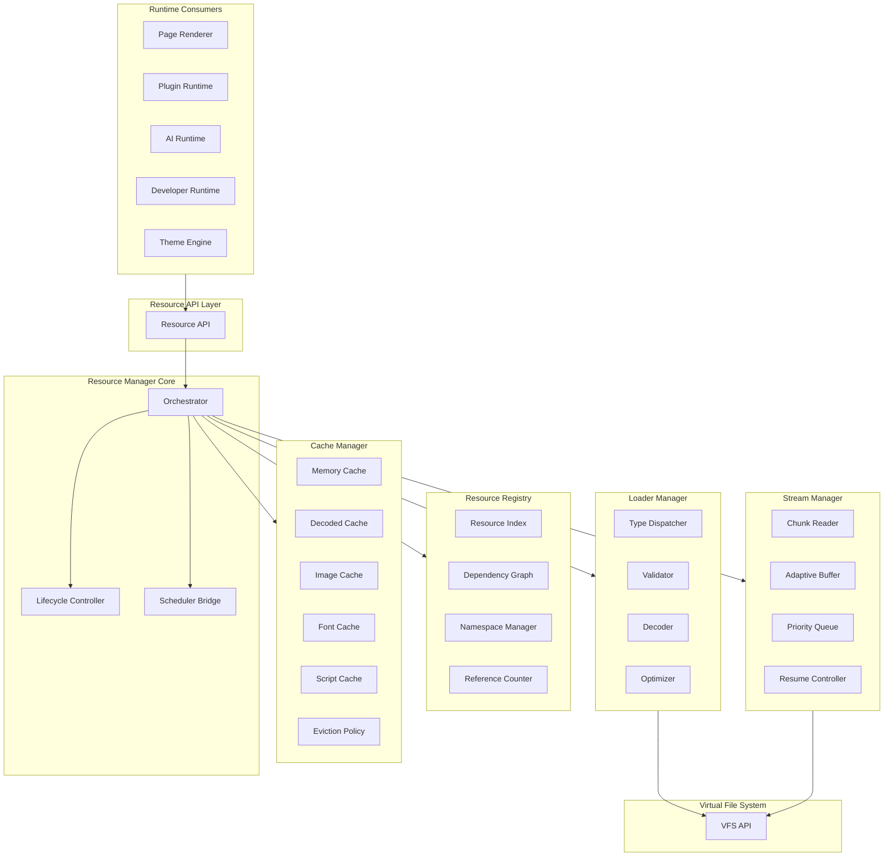

### 2.3 Layer Descriptions

#### Layer 1 — Resource API

The public surface exposed to all runtime consumers. This layer:

- Accepts resource requests by path, ID, or alias
- Enforces caller permission checks before any work begins
- Returns typed resource handles, never raw bytes
- Emits resource events to the Event Bus
- Provides both synchronous (small resources) and asynchronous (large/streaming) access patterns

The Resource API is the only entry point. There is no back-channel access to lower layers.

#### Layer 2 — Resource Manager Core (Orchestrator)

The central coordinator. This layer:

- Receives requests from the API layer
- Determines the correct loading strategy (cache hit, fresh load, stream)
- Coordinates the Registry, Cache Manager, Loader Manager, and Stream Manager
- Manages the resource lifecycle state machine
- Reports all events to the Event Bus
- Enforces memory budgets by coordinating with the Runtime Memory Manager

The Orchestrator does not perform I/O. It delegates all I/O to the Loader Manager and Stream Manager.

#### Layer 3 — Resource Registry

The authoritative index of all known resources in the document. This layer:

- Maintains a map of resource ID → resource descriptor
- Tracks the dependency graph between resources
- Manages namespaces (document, plugin, theme, ai)
- Maintains reference counts for all loaded resources
- Provides O(1) lookup by ID and O(log n) lookup by path

The Registry is populated during document boot from the VFS asset index. It is read-only after boot except for plugin-registered resources.

#### Layer 4 — Cache Manager

The in-process memory cache for loaded and decoded resources. This layer:

- Maintains separate cache tiers: raw bytes, decoded objects, rendered images, parsed fonts, compiled scripts
- Implements LRU eviction with configurable memory limits per tier
- Tracks cache statistics (hits, misses, evictions, memory usage)
- Coordinates with the Runtime Memory Manager for pressure-based eviction
- Never stores unvalidated bytes

#### Layer 5 — Loader Manager

Responsible for the actual loading, validation, and decoding of resources. This layer:

- Dispatches load requests to the correct type-specific loader
- Runs the validation pipeline (hash check → schema check → type check)
- Runs the decode pipeline (decompress → parse → normalize)
- Runs the optimization pipeline (resize, transcode, compile) where applicable
- Returns a fully validated, decoded resource to the Orchestrator

The Loader Manager is stateless. It processes one request at a time per loader instance. Multiple loader instances run in parallel.

#### Layer 6 — Stream Manager

Handles large resources that cannot be fully buffered. This layer:

- Manages chunk-based reading from the VFS
- Maintains adaptive buffers sized to available memory
- Supports priority-based streaming (foreground vs background)
- Supports pause, resume, and cancellation of in-progress streams
- Validates each chunk as it arrives (incremental hash verification)

#### Layer 7 — Virtual File System

Defined in LDFX-P2-2.2. The Resource Manager accesses the VFS exclusively through the VFS public API. The Resource Manager has no knowledge of ZIP internals, mount points, or path resolution logic.

#### Layer 8 — ZIP Container

Defined in LDFX-P1. Never accessed directly by the Resource Manager or any layer above the VFS.

### 2.4 Communication Patterns

| From | To | Pattern | Notes |
|------|----|---------|-------|
| Consumer | Resource API | Synchronous call or async future | API returns handle or stream |
| Resource API | Orchestrator | Direct method call | Same process, no serialization |
| Orchestrator | Registry | Direct method call | Registry is in-process |
| Orchestrator | Cache Manager | Direct method call | Cache is in-process |
| Orchestrator | Loader Manager | Task dispatch | Loader runs on worker thread pool |
| Orchestrator | Stream Manager | Task dispatch | Stream runs on I/O thread pool |
| Loader Manager | VFS | Async VFS API call | Defined in LDFX-P2-2.2 |
| Stream Manager | VFS | Async VFS streaming API | Defined in LDFX-P2-2.2 |
| Orchestrator | Event Bus | Fire-and-forget event emission | Non-blocking |
| Orchestrator | Memory Manager | Synchronous budget query | Blocking only for budget check |

### 2.5 Ownership Rules

- The Resource Manager **owns** all loaded resource bytes until they are released
- Consumers receive **handles** (typed references), never raw byte slices
- A handle holds a reference count increment; releasing the handle decrements it
- When reference count reaches zero, the resource is eligible for cache eviction
- The Registry **owns** resource descriptors for the lifetime of the document
- The Cache Manager **owns** decoded resource objects; it may evict them under memory pressure
- The Stream Manager **owns** in-flight stream buffers; they are released on stream completion or cancellation

---

*[Sections 3–20 follow in subsequent parts]*

---

## 3. Supported Resource Types

### 3.1 Resource Type Registry

Every resource type known to the Resource Manager is registered in the Type Registry at compile time. Each entry defines:

- MIME type(s)
- File extension(s)
- Loader implementation
- Validator implementation
- Decoder implementation
- Cache tier assignment
- Streaming eligibility
- Security classification
- Dependency capability (can this type declare dependencies?)

The Type Registry is extensible. Custom types register at runtime through the extension API.

### 3.2 Type Classification Table

| Category | Types | Streaming | Dependencies | Cache Tier |
|----------|-------|-----------|--------------|------------|
| Document | HTML, Markdown | No | Yes (CSS, JS, fonts) | Decoded |
| Style | CSS | No | Yes (fonts, images) | Decoded |
| Script | JavaScript, TypeScript | No | Yes (other scripts) | Compiled |
| Font | TTF, OTF, WOFF, WOFF2 | No | No | Font |
| Image (raster) | PNG, JPEG, WEBP, GIF, AVIF | No | No | Image |
| Image (vector) | SVG | No | Yes (fonts, images) | Decoded |
| Icon | ICO, SVG subset | No | No | Image |
| Audio | MP3, OGG, FLAC, WAV | Yes | No | Stream |
| Video | MP4, WEBM, AV1 | Yes | Yes (subtitles, audio) | Stream |
| Subtitle | VTT, SRT | No | No | Decoded |
| Data | JSON, YAML, XML | No | No | Decoded |
| Database | SQLite | Yes (pages) | No | Database |
| Binary | Arbitrary binary | No | No | Raw |
| WASM | WebAssembly module | No | Yes (imports) | Compiled |
| AI Model | ONNX, GGUF, custom | Yes | No | Stream |
| Plugin | LDFX plugin bundle | No | Yes (WASM, resources) | Plugin |
| Theme | LDFX theme bundle | No | Yes (CSS, fonts, images) | Decoded |
| Localization | JSON/YAML i18n | No | No | Decoded |
| Configuration | TOML, JSON config | No | No | Decoded |
| Custom LDFX | `.ldfx-*` types | Configurable | Configurable | Configurable |

### 3.3 HTML Resources

**Loading**: Read from VFS as UTF-8 bytes. Parsed into a structured DOM representation by the Page Renderer, not by the Resource Manager. The Resource Manager delivers validated raw bytes.

**Validation**: UTF-8 encoding verified. Hash verified against manifest. Basic structural check (DOCTYPE or root element present). No full HTML parse at validation time.

**Dependencies**: HTML resources declare dependencies on CSS files, JavaScript files, fonts, and images through their content. The Resource Manager performs a lightweight dependency scan at registration time to pre-populate the dependency graph.

**Caching**: Cached in the Decoded tier as validated UTF-8 string. Not re-read from VFS on subsequent requests.

**Streaming**: Not streamed. HTML documents are loaded atomically. Maximum supported size: 50MB. Documents exceeding this limit are rejected at validation.

**Security**: Script tags referencing external URLs are flagged as security violations. Inline scripts are permitted only if the document's security policy allows them. All resource references within HTML are resolved through the Resource Manager, never directly.

**Optimization**: Whitespace normalization is available as an optional post-load optimization. Not applied by default.

### 3.4 Markdown Resources

**Loading**: Read from VFS as UTF-8 bytes. The Resource Manager delivers raw Markdown bytes; rendering is the responsibility of the Page Renderer.

**Validation**: UTF-8 encoding verified. Hash verified. No structural validation beyond encoding.

**Dependencies**: Markdown image references and link targets are scanned at registration time. Internal references are registered as dependencies. External URL references are flagged.

**Caching**: Decoded tier as validated UTF-8 string.

**Streaming**: Not streamed. Maximum size: 10MB.

**Security**: External URL references in Markdown are flagged. Embedded HTML within Markdown is subject to the same HTML security rules.

### 3.5 CSS Resources

**Loading**: Read from VFS as UTF-8 bytes.

**Validation**: UTF-8 encoding verified. Hash verified. CSS syntax validation is performed to detect malformed rules that could cause renderer crashes.

**Dependencies**: `@import` statements and `url()` references are scanned at registration time. All referenced resources (fonts, images) are registered as dependencies and pre-loaded.

**Caching**: Decoded tier as validated UTF-8 string. A parsed CSS object model may be cached in the Compiled tier if the renderer supports it.

**Streaming**: Not streamed. Maximum size: 5MB per file.

**Security**: CSS `url()` references to external URLs are rejected. CSS custom properties that reference external resources are rejected. CSS `@import` of external URLs is rejected.

**Optimization**: Minification is available as an optional optimization. Not applied by default.

### 3.6 JavaScript and TypeScript Resources

**Loading**: Read from VFS as UTF-8 bytes. TypeScript is transpiled to JavaScript by the Script Decoder before delivery.

**Validation**: UTF-8 encoding verified. Hash verified. Syntax validation performed (parse-only, no execution). TypeScript type checking is not performed at load time.

**Dependencies**: Static `import` statements are scanned at registration time. Dynamic `import()` calls are noted but not pre-resolved (they are resolved at runtime when encountered).

**Caching**: Compiled tier as validated source text. Pre-compiled bytecode may be cached if the script runtime supports it.

**Streaming**: Not streamed. Maximum size: 20MB per file.

**Security**: Scripts are executed only within the plugin sandbox or developer runtime. The Resource Manager does not execute scripts. External `import` URLs are rejected. `eval`-equivalent patterns are flagged as warnings.

**Optimization**: Minification and dead-code elimination are available as optional optimizations.

### 3.7 Font Resources (TTF, OTF, WOFF, WOFF2)

**Loading**: Read from VFS as binary bytes.

**Validation**: Hash verified. Font file header magic bytes verified per format. Font table structure validated (required tables present). Malformed fonts that could cause renderer crashes are rejected.

**Dependencies**: None. Fonts have no dependencies.

**Caching**: Font tier. Fonts are high-priority cache residents. They are evicted last under memory pressure because re-loading a font causes visible layout reflow.

**Streaming**: Not streamed. Fonts are loaded atomically. Maximum size: 50MB per font file.

**Security**: Font files are validated against known malformed-font attack patterns. Fonts are never executed. Font subsetting is applied if the document declares a subset manifest.

**Optimization**: WOFF2 compression is preferred. TTF/OTF fonts are converted to WOFF2 in the decoded cache if the runtime supports it.

### 3.8 Raster Image Resources (PNG, JPEG, WEBP, GIF, AVIF)

**Loading**: Read from VFS as binary bytes.

**Validation**: Hash verified. Image header magic bytes verified per format. Image dimensions validated against declared dimensions in the asset index. Corrupt images (truncated data, invalid checksums) are rejected.

**Dependencies**: None. Raster images have no dependencies.

**Caching**: Image tier. Decoded pixel data is cached separately from compressed source bytes. The cache stores both the compressed source (for re-encoding) and the decoded RGBA bitmap (for rendering).

**Streaming**: Not streamed for images under 10MB. Images over 10MB use progressive streaming with tile-based decoding.

**Security**: Image bombs (extremely high-resolution images with small compressed size) are detected by checking the ratio of compressed size to declared dimensions. Images exceeding 16384×16384 pixels are rejected unless explicitly permitted by the document manifest.

**Optimization**: Images are decoded to the renderer's native pixel format. Mipmaps are generated for images used at multiple scales.

### 3.9 SVG Resources

**Loading**: Read from VFS as UTF-8 bytes.

**Validation**: UTF-8 encoding verified. Hash verified. XML well-formedness verified. SVG root element verified. Embedded scripts within SVG are rejected unless the document security policy permits them.

**Dependencies**: SVG `<image>` references and `<use>` references to external files are scanned at registration time and registered as dependencies.

**Caching**: Decoded tier as validated UTF-8 string. A parsed SVG object model may be cached in the Compiled tier.

**Streaming**: Not streamed. Maximum size: 10MB.

**Security**: Embedded `<script>` elements are rejected by default. External `href` references are rejected. `foreignObject` elements are rejected unless explicitly permitted.

### 3.10 Audio Resources (MP3, OGG, FLAC, WAV)

**Loading**: Initiated as a streaming load. The first chunk is validated before the stream handle is returned to the consumer.

**Validation**: Hash verified incrementally as chunks arrive. Audio container header verified (format magic bytes, codec identification). Duration and bitrate validated against asset index declarations.

**Dependencies**: None.

**Caching**: Stream tier. The first 256KB of audio data is cached for instant playback start. Full audio files are not cached in memory.

**Streaming**: Full streaming support. Chunk size: 64KB. Adaptive buffering based on available memory. Supports seek operations by requesting VFS range reads.

**Security**: Audio files are never executed. Codec parameters are validated to prevent decoder exploits (e.g., malformed headers designed to overflow audio decoders).

### 3.11 Video Resources (MP4, WEBM, AV1)

**Loading**: Initiated as a streaming load. The moov/init segment is loaded first to enable seeking.

**Validation**: Hash verified incrementally. Container header verified. Codec identification verified against declared codec in asset index. Resolution and frame rate validated.

**Dependencies**: Subtitle tracks and alternate audio tracks declared in the asset index are registered as dependencies.

**Caching**: Stream tier. The init segment (moov atom / WebM init cluster) is cached for instant seek support. Individual video frames are not cached.

**Streaming**: Full streaming with adaptive chunk sizing (128KB–1MB based on available bandwidth and memory). Supports random-access seeking via VFS range reads. Background pre-buffering of upcoming segments.

**Security**: Video files are never executed. Container parsing uses a hardened parser with strict size limits on all metadata fields.

### 3.12 Subtitle Resources (VTT, SRT)

**Loading**: Read from VFS as UTF-8 bytes.

**Validation**: UTF-8 encoding verified. Hash verified. Cue syntax validated.

**Dependencies**: None.

**Caching**: Decoded tier as parsed cue list.

**Streaming**: Not streamed. Maximum size: 5MB.

### 3.13 Data Resources (JSON, YAML, XML)

**Loading**: Read from VFS as UTF-8 bytes.

**Validation**: UTF-8 encoding verified. Hash verified. Schema validation performed if a schema is declared in the asset index. Well-formedness verified (valid JSON/YAML/XML syntax).

**Dependencies**: XML resources may declare XInclude dependencies, which are scanned at registration time.

**Caching**: Decoded tier as parsed object tree. The parsed representation is cached, not the raw text.

**Streaming**: Not streamed. Maximum size: 100MB. Files over 100MB must use the SQLite resource type instead.

**Security**: XML external entity (XXE) processing is disabled. YAML deserialization of arbitrary objects is disabled. Only safe subsets of YAML are parsed.

### 3.14 SQLite Database Resources

**Loading**: The database file is memory-mapped through the VFS. The Resource Manager does not parse SQLite internals; it delivers a validated file handle to the database consumer.

**Validation**: Hash verified. SQLite magic bytes verified (`53 51 4C 69 74 65 20 66 6F 72 6D 61 74 20 33 00`). Page size and file format version validated.

**Dependencies**: None.

**Caching**: Database tier. The SQLite page cache is managed by the SQLite engine, not by the Resource Manager cache. The Resource Manager caches only the file handle and metadata.

**Streaming**: Page-level streaming through VFS range reads. The SQLite engine requests pages on demand.

**Security**: SQLite databases are opened read-only. Write access requires explicit permission. SQL injection is not a Resource Manager concern (it is the consumer's responsibility), but the Resource Manager validates that the file is a valid SQLite database before delivering the handle.

### 3.15 Binary Resources

**Loading**: Read from VFS as raw bytes.

**Validation**: Hash verified. No structural validation beyond hash.

**Dependencies**: None declared. Binary resources may have runtime dependencies declared in the asset index.

**Caching**: Raw tier as byte buffer.

**Streaming**: Supported for binary files over 1MB.

**Security**: Binary resources are never executed by the Resource Manager. Consumers are responsible for safe handling.

### 3.16 WebAssembly (WASM) Resources

**Loading**: Read from VFS as binary bytes.

**Validation**: Hash verified. WASM magic bytes verified (`00 61 73 6D`). WASM version verified (`01 00 00 00`). Module structure validated (section headers, import/export tables). Imports validated against the declared import list in the asset index.

**Dependencies**: WASM imports are scanned at registration time. All imported modules must be present in the document or in the plugin namespace.

**Caching**: Compiled tier. WASM modules are compiled to native code by the WASM runtime and the compiled artifact is cached. The compiled cache is invalidated if the source hash changes.

**Streaming**: Not streamed. WASM modules are loaded atomically. Maximum size: 100MB.

**Security**: WASM modules execute only within the WASM sandbox (wasmtime). The Resource Manager validates the import list before compilation. Modules that import functions not on the approved list are rejected.

### 3.17 AI Model Resources (ONNX, GGUF, Custom)

**Loading**: Initiated as a streaming load due to large file sizes (potentially gigabytes).

**Validation**: Hash verified incrementally. Model format header verified. Model metadata (architecture, parameter count, quantization) validated against asset index declarations.

**Dependencies**: None declared at the Resource Manager level. Model dependencies (tokenizers, configuration files) are declared in the asset index and loaded as separate resources.

**Caching**: Stream tier for model weights. Model metadata and configuration are cached in the Decoded tier.

**Streaming**: Full streaming with large chunk sizes (1MB–16MB). Models are streamed directly to the AI runtime's memory-mapped region. The Resource Manager does not buffer the full model.

**Security**: AI model files are never executed by the Resource Manager. The AI runtime is responsible for safe model loading. The Resource Manager validates the declared architecture against a known-safe list.

### 3.18 Plugin Resources

**Loading**: Plugin bundles are loaded as a unit. The plugin manifest is loaded first, then individual plugin assets are loaded through the standard pipeline under the plugin's namespace.

**Validation**: Plugin manifest hash verified. Plugin signature verified (plugins must be signed). Each plugin asset is validated individually.

**Dependencies**: Plugin dependencies on document resources are declared in the plugin manifest and validated at registration time.

**Caching**: Plugin tier. Plugin resources are cached in an isolated namespace. They cannot be accessed by other plugins or by document resources.

**Security**: Plugins are loaded in strict isolation. Plugin resources cannot shadow document resources. Plugin WASM modules are validated against the plugin's declared import list.

### 3.19 Theme Resources

**Loading**: Theme bundles are loaded as a unit. The theme manifest is loaded first, then CSS, fonts, and images are loaded through the standard pipeline under the theme's namespace.

**Validation**: Theme manifest hash verified. Each theme asset validated individually.

**Dependencies**: Themes may depend on document fonts and images. These dependencies are declared in the theme manifest.

**Caching**: Decoded tier under the theme namespace.

**Security**: Themes cannot override security-critical document resources. Theme CSS is subject to the same security rules as document CSS.

### 3.20 Localization Resources

**Loading**: Read from VFS as UTF-8 bytes (JSON or YAML format).

**Validation**: UTF-8 encoding verified. Hash verified. Schema validated against the LDFX localization schema.

**Dependencies**: None.

**Caching**: Decoded tier as parsed key-value map.

**Streaming**: Not streamed. Maximum size: 10MB per locale file.

### 3.21 Configuration Resources

**Loading**: Read from VFS as UTF-8 bytes (TOML or JSON format).

**Validation**: UTF-8 encoding verified. Hash verified. Schema validated against the declared configuration schema.

**Dependencies**: None.

**Caching**: Decoded tier as parsed configuration object.

**Security**: Configuration values are validated against allowed value ranges. Configuration files cannot reference external resources.

### 3.22 Custom LDFX Resource Types

Custom resource types are registered through the extension API. A custom type registration must provide:

- MIME type string (must begin with `application/x-ldfx-`)
- File extension(s)
- A loader implementation conforming to the `ResourceLoader` trait
- A validator implementation conforming to the `ResourceValidator` trait
- A cache tier assignment
- A streaming eligibility flag
- A maximum size limit

Custom types are subject to the same security and validation pipeline as built-in types. They cannot bypass hash verification or permission checks.

### 3.23 Future Resource Types

The Type Registry is designed to accommodate future resource types without modification to the core Resource Manager. Anticipated future types include:

| Type | Notes |
|------|-------|
| 3D Models (glTF, USD) | Streaming, large files, complex dependencies |
| Shader Programs (GLSL, WGSL) | Compiled tier, GPU upload |
| Spatial Audio (Ambisonics) | Streaming, specialized decoder |
| Encrypted Resources | Decryption key management integration |
| Differential Resources | Delta-encoded updates to existing resources |
| Federated Resources | Multi-document resource sharing (future spec) |

---

*[Sections 4–20 follow in subsequent parts]*

---

## 4. Resource Registry

### 4.1 Purpose

The Resource Registry is the authoritative index of every resource known to the Resource Manager. It is populated during document boot from the VFS asset index and is the first point of contact for every resource request. No resource can be loaded, cached, or streamed unless it is registered.

The Registry is not a cache. It stores descriptors (metadata about resources), not resource bytes. A resource can be registered but not yet loaded. A resource can be loaded and then evicted from cache while remaining registered.

### 4.2 Registry Architecture

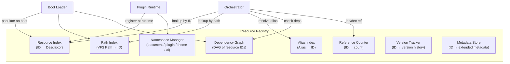

### 4.3 Resource Descriptor

Every registered resource has a descriptor stored in the Resource Index. The descriptor is immutable after registration (except for the lifecycle state field).

```
ResourceDescriptor {
    id:              ResourceId       // UUID v4, assigned at registration
    path:            VfsPath          // canonical VFS path
    resource_type:   ResourceType     // enum of all supported types
    mime_type:       String           // MIME type string
    size_bytes:      u64              // declared size from asset index
    hash_sha256:     [u8; 32]         // expected SHA-256 hash
    namespace:       Namespace        // document | plugin(id) | theme(id) | ai
    version:         SemVer           // resource version from asset index
    aliases:         Vec<String>      // alternate names for this resource
    dependencies:    Vec<ResourceId>  // direct dependencies (not transitive)
    dependents:      Vec<ResourceId>  // resources that depend on this one
    lifecycle_state: LifecycleState   // current state (see Section 10)
    registered_at:   Timestamp        // boot time or plugin registration time
    flags:           ResourceFlags    // streaming_eligible, read_only, trusted, etc.
}
```

### 4.4 Resource Identification

Resources are identified by three mechanisms, all of which resolve to a canonical `ResourceId`:

**By ResourceId (UUID)**: The primary identifier. Assigned at registration. Stable for the lifetime of the document session. Used internally by all Resource Manager subsystems.

**By VFS Path**: The path within the VFS (e.g., `/assets/images/logo.png`). Resolved through the Path Index to a ResourceId. Path lookup is O(1) via hash map.

**By Alias**: Human-readable names declared in the asset index (e.g., `"app-logo"`, `"primary-font"`). Resolved through the Alias Index to a ResourceId. Aliases are unique within a namespace.

### 4.5 Namespaces

The Registry partitions resources into four namespaces:

| Namespace | Contents | Access Rules |
|-----------|----------|--------------|
| `document` | All resources declared in the document's asset index | Accessible to all runtime components |
| `plugin(id)` | Resources registered by a specific plugin | Accessible only to that plugin and components it grants access to |
| `theme(id)` | Resources registered by a specific theme | Accessible to the renderer and theme engine |
| `ai` | AI model resources | Accessible only to the AI runtime |

Cross-namespace access requires explicit permission. A plugin cannot access another plugin's namespace. A plugin cannot access the `ai` namespace. The `document` namespace is readable by all but writable by none after boot.

### 4.6 Dependency Graph

The dependency graph is a directed acyclic graph (DAG) where nodes are ResourceIds and edges represent "depends on" relationships.

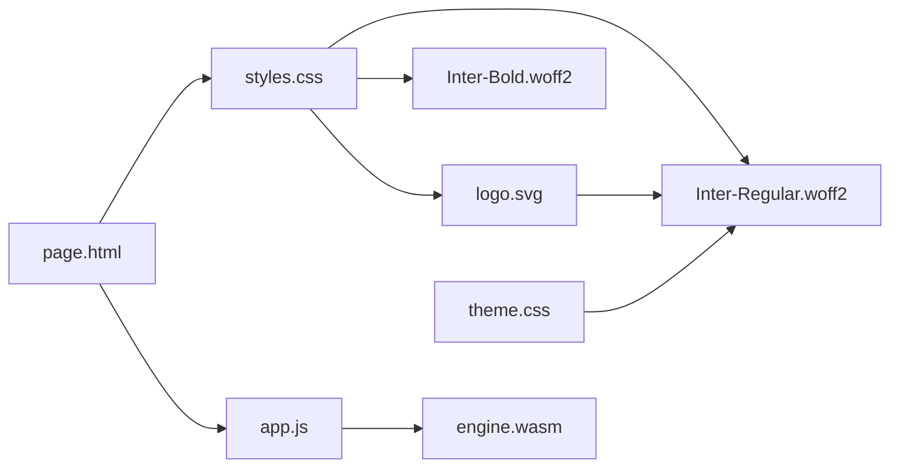

**Graph Construction**: The dependency graph is built during the registration phase. Each resource type's dependency scanner runs over the resource's content (or declared dependencies in the asset index) to identify direct dependencies.

**Cycle Detection**: The graph is validated as a DAG during construction. If a cycle is detected, the registration of the offending resource fails with a `DependencyCycleError`. The cycle is reported with the full path of the cycle for diagnostic purposes.

**Transitive Dependencies**: The Registry computes and caches the transitive closure of the dependency graph for each resource. This allows the Orchestrator to determine the complete set of resources that must be loaded before a given resource is ready.

**Topological Sort**: The Registry provides a topological sort of the dependency graph for use during boot-time pre-loading. Resources with no dependencies are loaded first; resources with dependencies are loaded after their dependencies are ready.

### 4.7 Reference Counting

Every loaded resource has a reference count maintained by the Registry. The reference count tracks how many active handles exist for the resource.

| Operation | Effect on Reference Count |
|-----------|--------------------------|
| `Resource.load()` returns a handle | +1 |
| Handle is dropped / `Resource.release()` called | -1 |
| Resource is added to cache | +1 (cache holds a reference) |
| Resource is evicted from cache | -1 |
| Count reaches 0 | Resource is eligible for eviction |

A resource with a reference count of 0 is not immediately freed. It remains in cache until the eviction policy selects it. This allows rapid re-access without a full reload.

A resource with a reference count > 0 is **pinned** and cannot be evicted. The eviction policy skips pinned resources.

### 4.8 Version Tracking

Each resource descriptor includes a version field from the asset index. The Version Tracker maintains a history of version transitions for resources that are reloaded during a document session (e.g., when a plugin updates a resource it owns).

Version history entries record:

- Previous version
- New version
- Timestamp of transition
- Reason for transition (initial load, plugin update, integrity failure recovery)

Version history is available through the diagnostics API and is included in error reports.

### 4.9 Registry Lifecycle

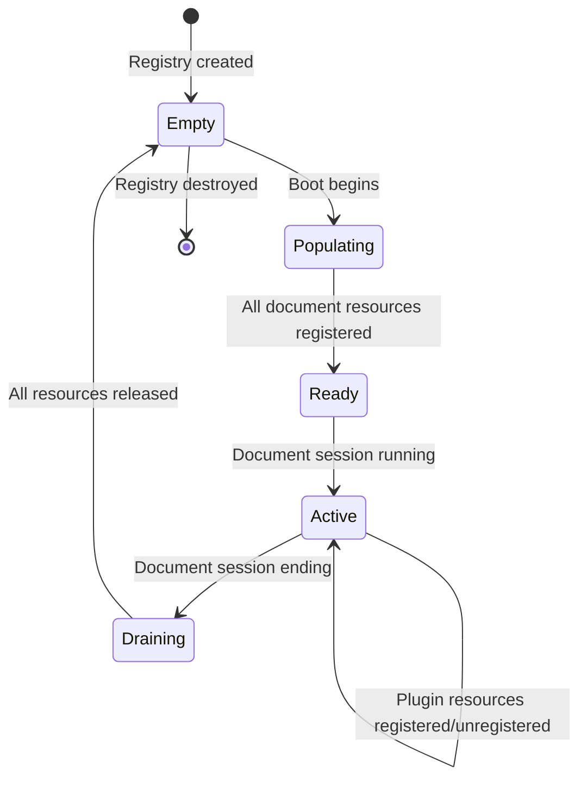

The Registry transitions to `Ready` only after all document resources have been registered and the dependency graph has been validated. The Runtime Kernel waits for this transition before allowing any resource loads.

### 4.10 Registry API (Internal)

These methods are internal to the Resource Manager. They are not part of the public Resource API.

| Method | Description |
|--------|-------------|
| `register(descriptor)` | Register a new resource descriptor |
| `lookup_by_id(id)` | O(1) lookup by ResourceId |
| `lookup_by_path(path)` | O(1) lookup by VFS path |
| `lookup_by_alias(alias, namespace)` | O(1) lookup by alias within namespace |
| `dependencies(id)` | Return direct dependencies |
| `transitive_deps(id)` | Return full transitive dependency set |
| `dependents(id)` | Return resources that depend on this one |
| `increment_ref(id)` | Increment reference count |
| `decrement_ref(id)` | Decrement reference count, return new count |
| `set_lifecycle(id, state)` | Update lifecycle state |
| `topological_order()` | Return all resources in dependency order |
| `validate_dag()` | Verify no cycles exist in dependency graph |

---

## 5. Resource Loading Pipeline

### 5.1 Pipeline Overview

Every resource load — whether triggered by a consumer request, a prefetch hint, or a dependency resolution — passes through the same loading pipeline. The pipeline is sequential within a single load operation but multiple load operations run in parallel on the worker thread pool.

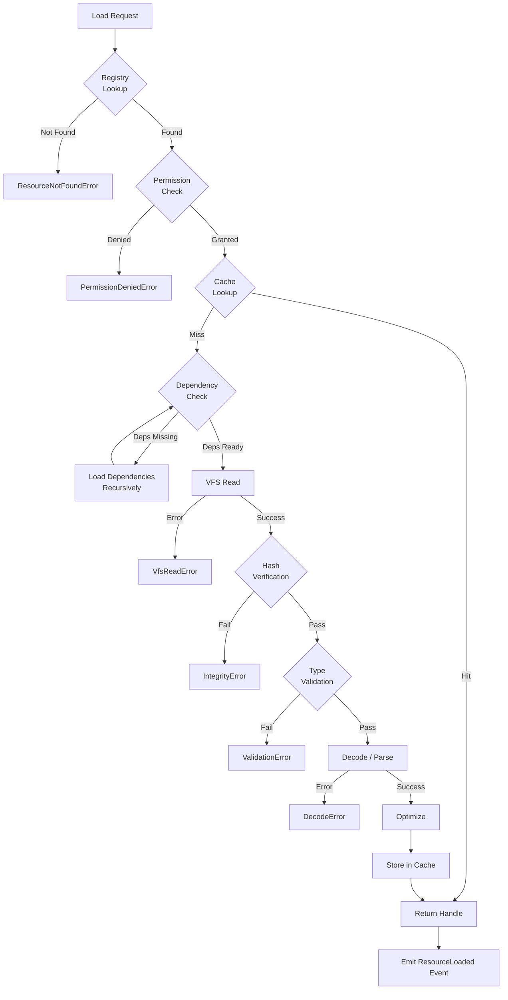

### 5.2 Stage 1 — Request Intake

The pipeline begins when a consumer calls a Resource API method. The request is normalized into a `LoadRequest` structure:

```
LoadRequest {
    resource_ref:  ResourceRef        // ID, path, or alias
    caller_id:     CallerId           // identity of the requesting component
    priority:      LoadPriority       // Critical | High | Normal | Low | Background
    options:       LoadOptions        // streaming, prefetch, force_reload flags
    timeout:       Option<Duration>   // optional load timeout
    context:       RequestContext     // trace ID, parent span
}
```

The Orchestrator assigns a unique `LoadOperationId` to the request and begins tracing.

### 5.3 Stage 2 — Registry Lookup

The Orchestrator queries the Registry to resolve the `ResourceRef` to a `ResourceDescriptor`.

- If the resource is not found in the Registry, a `ResourceNotFoundError` is returned immediately. No I/O is attempted.
- If the resource is found, its descriptor is retrieved. The descriptor contains the expected hash, type, size, and dependency list.
- The resource's lifecycle state is checked. If the resource is in a terminal error state, the error is returned without retrying unless `force_reload` is set.

### 5.4 Stage 3 — Permission Check

The caller's identity is checked against the resource's namespace and the document's permission policy.

Permission check rules:

| Caller | document namespace | plugin(X) namespace | theme namespace | ai namespace |
|--------|--------------------|---------------------|-----------------|--------------|
| Page Renderer | Read | Denied | Read | Denied |
| Plugin X | Read | Read (own) | Read | Denied |
| Plugin Y | Read | Denied | Read | Denied |
| AI Runtime | Read | Denied | Denied | Read |
| Developer Runtime | Read | Read (all) | Read | Read |
| Theme Engine | Read | Denied | Read | Denied |

If the permission check fails, a `PermissionDeniedError` is returned with the caller identity, resource path, and required permission. No further pipeline stages execute.

### 5.5 Stage 4 — Cache Lookup

The Cache Manager is queried for the resource by its ResourceId.

Cache lookup order:
1. Decoded cache (type-specific parsed object)
2. Raw bytes cache (validated but not decoded)

If a cache hit is found:
- The reference count is incremented
- A typed handle is constructed wrapping the cached object
- The pipeline exits here — no VFS read, no validation, no decode
- A `ResourceCacheHit` event is emitted

If a cache miss is found, the pipeline continues to Stage 5.

### 5.6 Stage 5 — Dependency Check and Resolution

Before loading the resource itself, all of its direct dependencies must be in the `Ready` state.

The Orchestrator queries the Registry for the resource's dependency list. For each dependency:

- If the dependency is `Ready` (in cache or loaded), proceed
- If the dependency is `Loading`, wait for it to complete (subscribe to its completion event)
- If the dependency is `Discovered` or `Registered`, initiate a load for it recursively

Dependency loads are initiated in parallel where possible (independent branches of the dependency graph). The Orchestrator waits for all dependencies to reach `Ready` before proceeding.

If any dependency fails to load:
- The dependent resource load fails with a `DependencyLoadError`
- The error includes the identity of the failed dependency and its error
- The failure is propagated up the dependency chain

Circular dependency detection is performed at registration time (Section 4.6), so circular dependencies cannot occur at this stage.

### 5.7 Stage 6 — VFS Read

The Loader Manager requests the resource bytes from the VFS through the VFS public API.

```
vfs.read_file(path: VfsPath, options: ReadOptions) -> Result<Bytes, VfsError>
```

The VFS handles path resolution, mount point selection, and ZIP decompression. The Resource Manager receives raw decompressed bytes.

For streaming resources, the Loader Manager requests a stream handle instead:

```
vfs.open_stream(path: VfsPath, options: StreamOptions) -> Result<StreamHandle, VfsError>
```

If the VFS returns an error (file not found in ZIP, decompression failure, I/O error), the load fails with a `VfsReadError` wrapping the VFS error. The resource's lifecycle state is set to `Failed`.

### 5.8 Stage 7 — Hash Verification

The received bytes are hashed with SHA-256 and compared against the expected hash stored in the resource descriptor (which was loaded from the manifest during boot).

```
computed_hash = sha256(bytes)
if computed_hash != descriptor.hash_sha256 {
    return Err(IntegrityError { path, expected: descriptor.hash_sha256, computed: computed_hash })
}
```

Hash verification is not skippable. There is no flag, option, or configuration that bypasses this check.

If verification fails:
- The resource lifecycle state is set to `IntegrityFailure`
- An `IntegrityViolation` security event is emitted to the Event Bus
- The Security Manager is notified
- The load fails with an `IntegrityError`
- The raw bytes are zeroed and freed immediately

### 5.9 Stage 8 — Type Validation

The type-specific validator runs on the verified bytes. Validation rules are defined per resource type (Section 3). Validation checks include:

- Magic byte verification (format identification)
- Structural integrity (required headers, sections, tables present)
- Encoding verification (UTF-8 for text types)
- Size limit enforcement
- Security-specific checks (image bomb detection, XXE prevention, etc.)

If validation fails, the load fails with a `ValidationError` containing the specific validation rule that failed and the byte offset of the violation.

### 5.10 Stage 9 — Decode

The type-specific decoder transforms the raw validated bytes into a typed in-memory representation.

Examples:
- JSON bytes → parsed `JsonValue` tree
- Font bytes → parsed font object with glyph tables
- WASM bytes → compiled WASM module (via wasmtime)
- Image bytes → decoded RGBA pixel buffer

Decoding is performed on the worker thread pool. Decode errors (malformed data that passed validation but fails during full parse) produce a `DecodeError`.

### 5.11 Stage 10 — Optimization

Optional post-decode optimizations are applied based on resource type and document configuration:

| Resource Type | Optimization |
|---------------|-------------|
| Images | Mipmap generation, pixel format conversion |
| Fonts | Subsetting, WOFF2 conversion |
| Scripts | Minification (if enabled) |
| WASM | AOT compilation caching |
| CSS | Parsed rule deduplication |

Optimization failures are non-fatal. If optimization fails, the unoptimized decoded resource is used.

### 5.12 Stage 11 — Cache Storage

The decoded resource is stored in the appropriate cache tier. The Cache Manager checks the current memory budget before storing:

- If budget allows: store and proceed
- If budget is tight: evict LRU entries to make room, then store
- If budget is exhausted and no evictions are possible (all entries pinned): store without caching (resource will be reloaded on next access)

The reference count is incremented for the cache's reference.

### 5.13 Stage 12 — Handle Construction and Return

A typed `ResourceHandle` is constructed wrapping the decoded resource. The handle:

- Holds a reference count increment
- Provides type-safe access to the decoded resource
- Carries the resource's metadata (ID, path, version, load time)
- Implements `Drop` to automatically decrement the reference count when released

The handle is returned to the caller. A `ResourceLoaded` event is emitted to the Event Bus with the load duration, resource size, and cache status.

### 5.14 Pipeline Timing Targets

| Stage | Target Duration |
|-------|----------------|
| Registry Lookup | < 0.1ms |
| Permission Check | < 0.1ms |
| Cache Lookup | < 0.5ms |
| Dependency Check | < 1ms |
| VFS Read (< 64KB) | < 5ms |
| Hash Verification (< 64KB) | < 1ms |
| Type Validation | < 2ms |
| Decode (< 64KB) | < 5ms |
| Optimization | < 10ms |
| Cache Storage | < 0.5ms |
| **Total (cache miss, < 64KB)** | **< 25ms** |
| **Total (cache hit)** | **< 1ms** |

### 5.15 Error Recovery

At each pipeline stage, if an error occurs and a fallback resource is declared in the asset index, the pipeline attempts to load the fallback resource through the same pipeline. Fallback loading is attempted only once — if the fallback also fails, the original error is returned.

Fallback declarations in the asset index:

```json
{
  "path": "/assets/fonts/CustomFont.woff2",
  "fallback": "/assets/fonts/SystemFallback.woff2"
}
```

---

*[Sections 6–20 follow in subsequent parts]*

---

## 6. Dependency Resolution

### 6.1 Overview

Dependency resolution is the process of determining, for a given resource, the complete set of other resources that must be loaded and ready before that resource can be used. The Resource Manager enforces dependency ordering — a resource is never delivered to a consumer in a state where its dependencies are absent.

Dependency resolution operates at two points in time:

1. **Registration time** (boot): The dependency graph is constructed from static analysis of resource content and asset index declarations. This is the primary resolution pass.
2. **Load time**: Dynamic dependencies discovered during decoding (e.g., a WASM module's runtime imports) are resolved before the decoded resource is returned.

### 6.2 Dependency Graph Construction

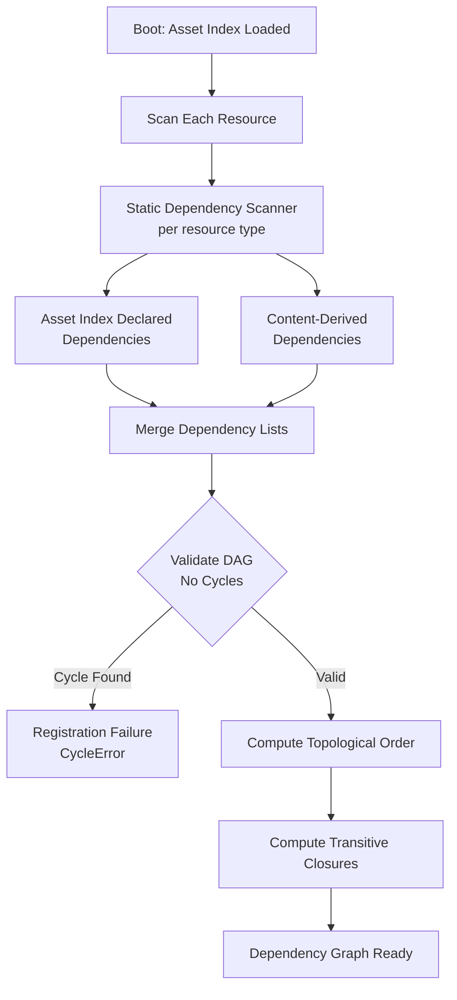

**Static Dependency Scanners** run per resource type:

| Resource Type | Scanner Behavior |
|---------------|-----------------|
| HTML | Scans `<link>`, `<script>`, ``, `<source>` tags for internal references |
| CSS | Scans `@import` and `url()` for internal references |
| JavaScript | Scans static `import` statements |
| SVG | Scans `<image>`, `<use>`, `<feImage>` for internal references |
| WASM | Reads import section for module dependencies |
| Video | Reads container metadata for subtitle and audio track references |
| Plugin | Reads plugin manifest dependency declarations |
| Theme | Reads theme manifest dependency declarations |
| All others | Uses only asset index declared dependencies |

### 6.3 Dependency Graph Data Structure

The dependency graph is stored as an adjacency list with bidirectional edges:

```
DependencyGraph {
    forward:  HashMap<ResourceId, Vec<ResourceId>>   // resource → its dependencies
    backward: HashMap<ResourceId, Vec<ResourceId>>   // resource → its dependents
    topo_order: Vec<ResourceId>                       // topological sort (deps first)
    transitive: HashMap<ResourceId, HashSet<ResourceId>>  // transitive closure cache
}
```

The topological order is computed once at boot using Kahn's algorithm. It is used to determine the optimal loading order during boot-time pre-loading.

### 6.4 Circular Dependency Detection

Circular dependency detection runs during graph construction using depth-first search with a visited/in-stack marker:

```
detect_cycle(graph, node, visited, in_stack):
    mark node as visited and in_stack
    for each dependency of node:
        if dependency is in_stack:
            CYCLE DETECTED — report path
        if dependency not visited:
            detect_cycle(graph, dependency, visited, in_stack)
    remove node from in_stack
```

When a cycle is detected:
- The full cycle path is recorded (e.g., `A → B → C → A`)
- The registration of the resource that introduced the cycle fails
- All other resources in the cycle are marked with a `CyclicDependency` error state
- The error is reported to the Runtime Kernel, which may abort boot or continue with the affected resources excluded

### 6.5 Lazy Dependencies

Some dependencies are declared as lazy — they are not required before the resource is delivered to the consumer, but they will be needed during use.

Lazy dependencies are declared in the asset index:

```json
{
  "path": "/pages/chapter-5.html",
  "dependencies": {
    "eager": ["/assets/css/base.css"],
    "lazy": ["/assets/images/chapter-5-hero.jpg"]
  }
}
```

Lazy dependencies are:
- Registered in the dependency graph (for cycle detection and reference counting)
- Not waited on during the loading pipeline
- Prefetched in the background after the primary resource is delivered
- Loaded on demand if accessed before the prefetch completes

### 6.6 Optional Dependencies

Optional dependencies are resources that enhance the primary resource but are not required for basic functionality. If an optional dependency fails to load, the primary resource is still delivered.

```json
{
  "path": "/assets/scripts/analytics.js",
  "dependencies": {
    "optional": ["/assets/scripts/analytics-worker.js"]
  }
}
```

Optional dependency failures are logged as warnings, not errors. The primary resource's lifecycle state is not affected.

### 6.7 Version Conflict Resolution

When two resources declare dependencies on different versions of the same resource, a version conflict exists. The Resource Manager resolves version conflicts using the following policy:

1. **Exact match**: If both requestors need the same version, one copy is loaded and shared.
2. **Compatible range**: If one version satisfies both declared ranges (semver compatibility), the higher compatible version is loaded.
3. **Incompatible**: If no single version satisfies both ranges, the conflict is reported as a `VersionConflictError`. The document author must resolve the conflict by updating the asset index.

Version conflicts are detected at registration time, not at load time. A document with unresolved version conflicts cannot boot.

### 6.8 Plugin Dependencies

Plugins may declare dependencies on:
- Document resources (read-only access)
- Other plugins (must be loaded first)
- WASM modules within their own namespace

Plugin dependency rules:
- A plugin cannot declare a dependency on another plugin's private resources
- Plugin dependency cycles are detected and cause plugin registration failure
- If a plugin's dependency (another plugin) fails to load, the dependent plugin is also marked as failed
- Plugin dependencies are resolved after all document resources are registered

### 6.9 Theme Dependencies

Themes may declare dependencies on:
- Document fonts (to extend or override)
- Document images (to reference in CSS)
- Other theme components within the same theme bundle

Themes cannot declare dependencies on plugin resources or AI resources.

### 6.10 AI Model Dependencies

AI models may declare dependencies on:
- Tokenizer files (JSON/binary)
- Configuration files (JSON)
- Vocabulary files (text/binary)

These dependencies are declared in the asset index and loaded before the model stream begins. The AI runtime receives all dependency resources before the model weights start streaming.

### 6.11 Failure Recovery in Dependency Chains

When a dependency fails to load, the failure propagates up the dependency chain. The propagation policy:

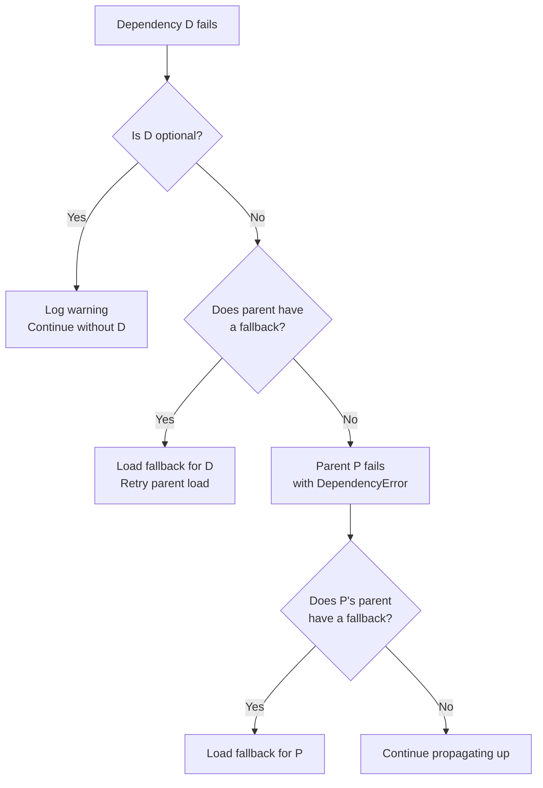

The failure propagation stops when:
- A fallback is successfully loaded
- An optional dependency boundary is reached
- The root of the dependency chain is reached (the consumer receives the error)

---

## 7. Streaming System

### 7.1 Overview

The Streaming System handles resources that are too large to buffer entirely in memory or that benefit from progressive delivery. It is a first-class subsystem with the same security and validation guarantees as the synchronous loading pipeline.

Streaming is used for:
- Video files (any size)
- Audio files (any size)
- AI model weights (typically 1GB–100GB)
- Large binary datasets
- SQLite databases (page-level streaming)

### 7.2 Streaming Architecture

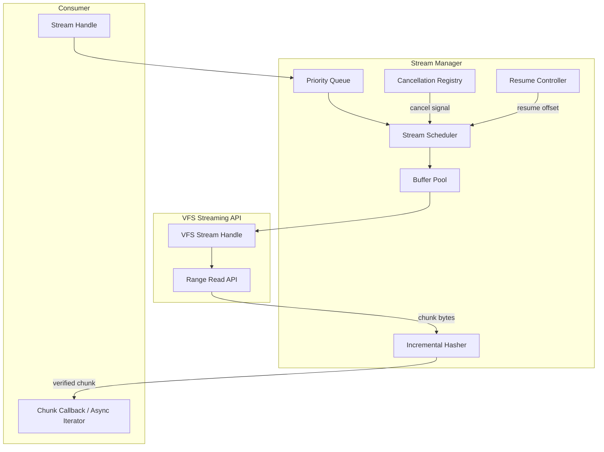

### 7.3 Stream Handle

When a consumer requests a streaming resource, the Resource Manager returns a `StreamHandle` instead of a `ResourceHandle`. The `StreamHandle` provides:

```
StreamHandle {
    stream_id:      StreamId           // unique ID for this stream operation
    resource_id:    ResourceId         // the resource being streamed
    total_size:     Option<u64>        // known total size, if available
    position:       u64                // current byte position
    state:          StreamState        // Active | Paused | Completed | Failed | Cancelled
}

StreamHandle methods:
    next_chunk() -> Result<Option<Bytes>, StreamError>   // async, returns None at EOF
    seek(offset: u64) -> Result<(), StreamError>          // seek to byte offset
    pause() -> Result<(), StreamError>                    // pause streaming
    resume() -> Result<(), StreamError>                   // resume from current position
    cancel() -> Result<(), StreamError>                   // cancel and release resources
    statistics() -> StreamStatistics                      // bytes read, throughput, etc.
```

### 7.4 Chunk Reading

Chunks are read from the VFS using range reads. The chunk size is adaptive:

| Available Memory | Chunk Size |
|-----------------|------------|
| > 1GB free | 1MB |
| 512MB–1GB free | 512KB |
| 256MB–512MB free | 256KB |
| 128MB–256MB free | 128KB |
| < 128MB free | 64KB |

The chunk size is re-evaluated every 10 chunks. If memory pressure increases during streaming, the chunk size is reduced. If memory pressure decreases, the chunk size is increased.

### 7.5 Incremental Hash Verification

For streaming resources, hash verification cannot wait until the entire resource is received. Instead, the Stream Manager uses incremental SHA-256 hashing:

```
state = sha256_init()
for each chunk received:
    sha256_update(state, chunk)
    deliver chunk to consumer
at EOF:
    final_hash = sha256_finalize(state)
    if final_hash != expected_hash:
        emit IntegrityViolation event
        invalidate all delivered chunks
        return StreamIntegrityError
```

The consumer receives chunks before the final hash is verified. This is a deliberate design choice for performance. However:

- If the final hash fails, the consumer is notified via the stream's error channel
- The consumer must handle the `StreamIntegrityError` and discard any data derived from the stream
- For security-critical consumers (e.g., WASM module loading), the stream is buffered internally and not delivered until the full hash is verified

### 7.6 Background Streaming

Resources can be streamed in the background without a consumer actively reading them. Background streaming is used for:

- Prefetching video segments before they are needed
- Pre-loading AI model weights during document idle time
- Pre-buffering audio for gapless playback

Background streams run at `Background` priority and are automatically paused if a foreground stream needs the I/O bandwidth.

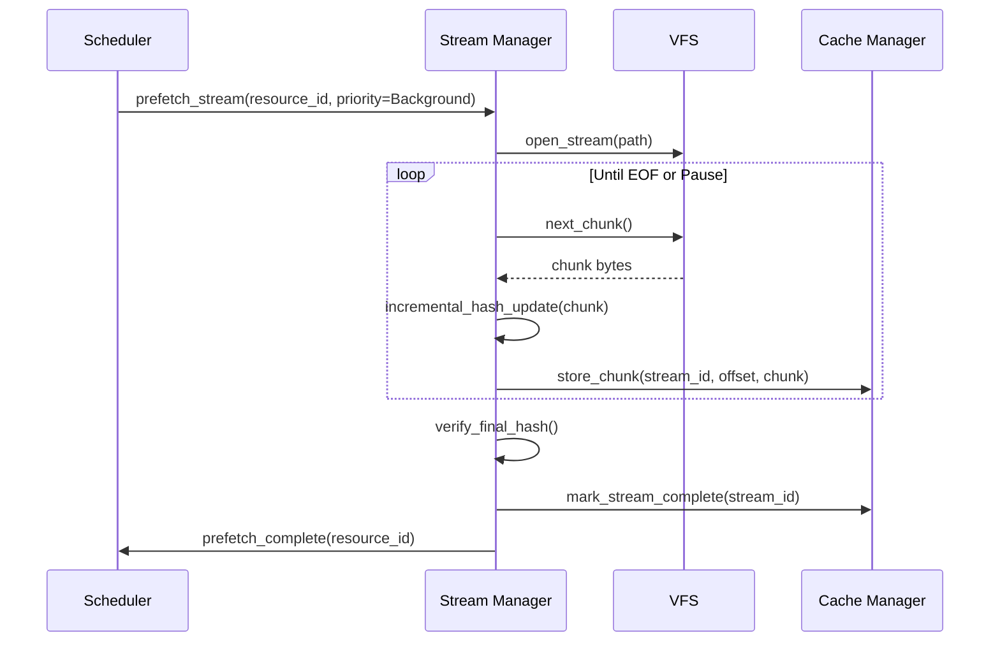

### 7.7 Adaptive Buffering

The Stream Manager maintains a look-ahead buffer for each active stream. The buffer holds pre-read chunks that have not yet been consumed. Buffer sizing:

| Stream Priority | Look-ahead Buffer Size |
|----------------|----------------------|
| Critical | 8 chunks |
| High | 4 chunks |
| Normal | 2 chunks |
| Low | 1 chunk |
| Background | 0 (no look-ahead) |

When the consumer reads faster than the VFS can supply chunks, the buffer drains. When the consumer reads slower than the VFS supplies, the buffer fills. If the buffer is full, the VFS read is paused until the consumer catches up.

### 7.8 Cancellation

Any in-progress stream can be cancelled by the consumer or by the Resource Manager (e.g., under memory pressure).

Cancellation is cooperative:
1. Consumer calls `stream_handle.cancel()` or Resource Manager issues a cancel signal
2. The Stream Manager marks the stream as `Cancelling`
3. The current VFS read completes (no mid-chunk cancellation)
4. The stream is marked `Cancelled`
5. All buffers are released
6. The reference count for the resource is decremented
7. A `ResourceStreamCancelled` event is emitted

Cancelled streams can be resumed from the beginning (not from the cancellation point) by requesting a new stream.

### 7.9 Resume

Streams that fail due to transient errors (VFS I/O error, memory pressure) support resume from the last successfully verified chunk:

```
Resume process:
1. Stream fails at byte offset N
2. Stream state transitions to Failed(offset=N, last_verified_chunk=M)
3. Consumer calls stream_handle.resume() or Resource Manager auto-resumes
4. New VFS range read starts at offset M (last verified chunk boundary)
5. Incremental hash state is restored from the checkpoint at M
6. Streaming continues from M
```

Resume is only possible if the stream's hash checkpoint is intact. If the hash state is lost (e.g., process restart), the stream must restart from the beginning.

### 7.10 Priority Streaming

The Stream Manager maintains a priority queue of active streams. When I/O bandwidth is limited (e.g., the VFS is under load from multiple concurrent reads), streams are scheduled in priority order:

| Priority | Use Case | Preemptable |
|----------|----------|-------------|
| Critical | WASM module required for page render | No |
| High | Video/audio currently playing | No |
| Normal | Resource requested by user interaction | Yes |
| Low | Prefetch triggered by page navigation | Yes |
| Background | Idle-time pre-loading | Yes |

Higher-priority streams preempt lower-priority streams by pausing them. A paused stream resumes automatically when higher-priority streams complete or yield.

### 7.11 Streaming Flow Diagram

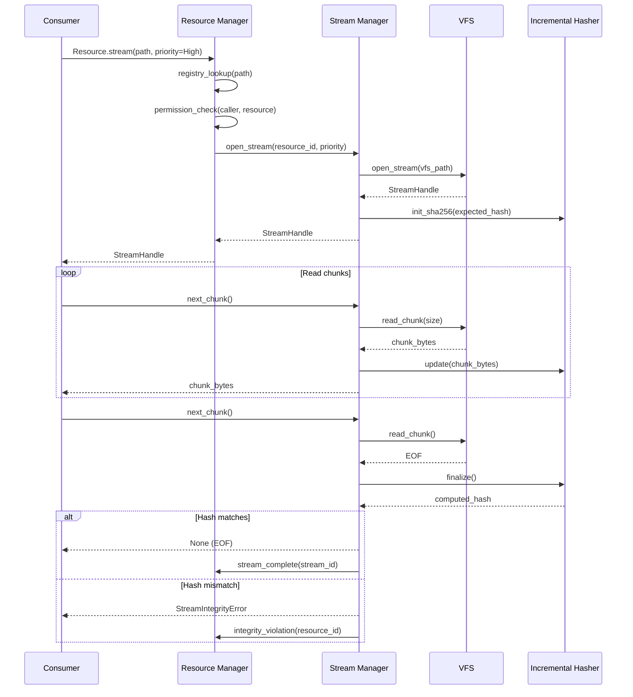

### 7.12 Large Resource Streaming Targets

| Resource Type | First Byte Target | Throughput Target |
|---------------|------------------|-------------------|
| Video (1080p) | < 100ms | ≥ 10MB/s |
| Audio | < 50ms | ≥ 2MB/s |
| AI Model (GGUF) | < 200ms | ≥ 50MB/s |
| SQLite (page read) | < 10ms | ≥ 100MB/s |
| Large Binary | < 50ms | ≥ 20MB/s |

These targets assume the VFS is reading from a local ZIP container on an NVMe drive. Performance on slower storage is expected to be proportionally lower.

---

*[Sections 8–20 follow in subsequent parts]*

---

## 8. Resource Cache

### 8.1 Cache Philosophy

The Resource Manager cache is a multi-tier, in-process memory cache. Its purpose is to eliminate redundant VFS reads, redundant hash verifications, and redundant decode operations for resources that are accessed repeatedly during a document session.

The cache stores only validated, decoded resources. Raw unvalidated bytes are never cached. A cache hit means the consumer receives a resource that has already passed all validation and integrity checks.

The cache is not persistent across document sessions. When the document is closed, the cache is cleared. There is no disk-based cache in the current specification (this is reserved for a future extension).

### 8.2 Cache Hierarchy

```mermaid
graph TD
    subgraph CacheHierarchy["Cache Hierarchy (fastest to slowest)"]
        L1["L1 — Decoded Cache\n(parsed objects, compiled scripts)\nSize: 256MB default\nEviction: LRU"]
        L2["L2 — Image Cache\n(decoded RGBA bitmaps)\nSize: 512MB default\nEviction: LRU + size-weighted"]
        L3["L3 — Font Cache\n(parsed font objects)\nSize: 64MB default\nEviction: LRU, low priority"]
        L4["L4 — Script Cache\n(compiled WASM, JS bytecode)\nSize: 128MB default\nEviction: LRU"]
        L5["L5 — Raw Bytes Cache\n(validated compressed bytes)\nSize: 128MB default\nEviction: LRU"]
        L6["L6 — Stream Cache\n(pre-buffered stream chunks)\nSize: 256MB default\nEviction: FIFO by stream"]
        L7["L7 — Database Cache\n(SQLite file handles + page cache)\nSize: 64MB default\nEviction: LRU"]
        L8["L8 — Plugin Cache\n(plugin-namespace resources)\nSize: 64MB default\nEviction: LRU"]
    end

    L1 --> L2
    L2 --> L3
    L3 --> L4
    L4 --> L5
    L5 --> L6
    L6 --> L7
    L7 --> L8
```

### 8.3 Cache Tier Descriptions

**L1 — Decoded Cache**  
Stores the fully decoded, type-specific in-memory representation of resources. Examples: parsed JSON trees, parsed CSS object models, decoded Markdown ASTs, parsed localization maps. This is the primary cache tier. A hit here means zero I/O and zero decode work.

**L2 — Image Cache**  
Stores decoded RGBA pixel buffers for raster images. Separate from L1 because image data is large and has different eviction characteristics (size-weighted LRU — larger images are evicted before smaller ones when memory is tight).

**L3 — Font Cache**  
Stores parsed font objects. Fonts are high-priority cache residents because evicting a font causes visible layout reflow. The font cache uses a modified LRU that deprioritizes eviction of fonts currently referenced by active page layouts.

**L4 — Script Cache**  
Stores compiled WASM modules and JavaScript bytecode. Compilation is expensive (100ms–1s for large WASM modules), so compiled artifacts are cached aggressively. The script cache is invalidated when the source hash changes.

**L5 — Raw Bytes Cache**  
Stores validated but not decoded resource bytes. Used as a fallback when the decoded cache is full but the raw bytes are still available. A hit here avoids VFS I/O and hash verification but still requires decode.

**L6 — Stream Cache**  
Stores pre-buffered chunks from background streaming operations. Organized by stream ID and byte offset. Chunks are stored in FIFO order and released as they are consumed.

**L7 — Database Cache**  
Stores open SQLite file handles and the SQLite page cache. The Resource Manager does not manage SQLite's internal page cache; it manages only the file handle and the metadata about the open database.

**L8 — Plugin Cache**  
Stores resources registered by plugins, in isolated per-plugin namespaces. Plugin cache entries cannot be accessed by other plugins or by the document namespace.

### 8.4 Cache Entry Structure

```
CacheEntry {
    resource_id:    ResourceId
    tier:           CacheTier
    data:           CacheData          // type-erased pointer to decoded object
    size_bytes:     u64                // actual memory footprint
    inserted_at:    Timestamp
    last_accessed:  Timestamp
    access_count:   u64
    ref_count:      u32                // number of active handles
    pinned:         bool               // true if ref_count > 0
    ttl:            Option<Duration>   // time-to-live (None = no expiry)
}
```

### 8.5 LRU Eviction Policy

Each cache tier implements LRU (Least Recently Used) eviction. The eviction algorithm:

1. When a new entry needs to be stored and the tier is at capacity:
2. Collect all entries where `pinned == false` (ref_count == 0)
3. Sort by `last_accessed` ascending (oldest first)
4. Evict entries until sufficient space is available
5. If all entries are pinned and space is insufficient, the new entry is stored without caching (bypass)

For the Image Cache (L2), eviction is size-weighted: among entries with the same `last_accessed` time, larger entries are evicted first.

For the Font Cache (L3), eviction is modified: fonts referenced by the currently active page layout are temporarily pinned even if their ref_count is 0.

### 8.6 TTL-Based Expiry

Cache entries may have a TTL (time-to-live). After the TTL expires, the entry is eligible for eviction regardless of its LRU position. TTL is used for:

- Plugin-registered resources that may be updated by the plugin
- Localization resources when the active locale changes
- Configuration resources that may be reloaded

TTL expiry is checked lazily (on next access) and eagerly (by a background sweep every 30 seconds).

### 8.7 Memory Limits and Pressure Response

Each cache tier has a configurable memory limit. The total cache memory limit is the sum of all tier limits. Default total: 1,472MB.

The Cache Manager monitors total memory usage and responds to memory pressure signals from the Runtime Memory Manager:

| Pressure Level | Response |
|---------------|----------|
| Normal (< 70% of limit) | No action |
| Elevated (70–85%) | Evict expired TTL entries across all tiers |
| High (85–95%) | Evict LRU entries from L5, L6, L8 |
| Critical (> 95%) | Evict LRU entries from all tiers including L2, L3 |
| Emergency | Evict all unpinned entries from all tiers |

Memory pressure signals are received from the Runtime Memory Manager via the Event Bus.

### 8.8 Cache Statistics

The Cache Manager maintains per-tier statistics:

```
CacheTierStats {
    tier:           CacheTier
    entry_count:    u64
    total_bytes:    u64
    capacity_bytes: u64
    hits:           u64
    misses:         u64
    evictions:      u64
    hit_ratio:      f64    // hits / (hits + misses)
    avg_entry_size: u64
    oldest_entry:   Timestamp
    newest_entry:   Timestamp
}
```

Statistics are exposed through the Diagnostics API (Section 17) and are included in the document session report.

### 8.9 Prefetching

The Cache Manager supports prefetch hints from the Orchestrator. A prefetch hint causes a resource to be loaded and cached before it is explicitly requested by a consumer.

Prefetch sources:
- Dependency graph: when resource A is loaded, its lazy dependencies are prefetched
- Page navigation: when the user navigates to a new page, that page's resources are prefetched
- Scheduler hints: the Runtime Scheduler may issue prefetch hints based on predicted access patterns

Prefetch operations run at `Background` priority and do not block foreground loads.

### 8.10 Cache Invalidation

Cache entries are invalidated when:
- The resource's hash changes (detected during a reload operation)
- The resource's TTL expires
- A plugin explicitly invalidates a resource it owns
- The Security Manager detects a tampering event for the resource
- The document session ends

Invalidation removes the entry from the cache and sets the resource's lifecycle state to `Registered` (ready to be reloaded). It does not affect active handles — consumers holding a handle to an invalidated resource continue to use the cached copy until they release the handle.

---

## 9. Validation

### 9.1 Validation Philosophy

Validation is the process of verifying that a resource is what it claims to be, that its bytes are intact, and that it is safe to decode and use. Validation is mandatory, non-bypassable, and runs on every resource load (cache misses only — cached resources have already been validated).

Validation has two phases:
1. **Integrity validation**: Verifies the resource's bytes match the expected hash
2. **Type validation**: Verifies the resource's content conforms to its declared type

### 9.2 Validation Pipeline

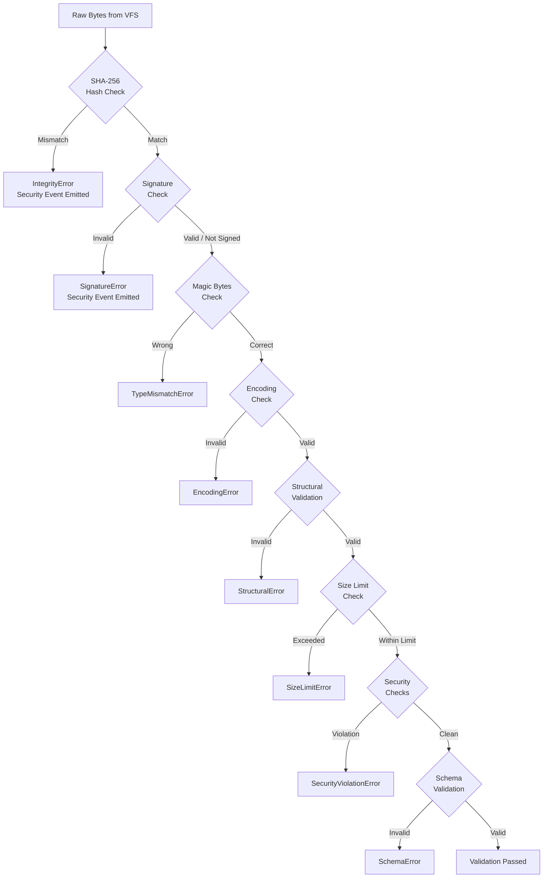

### 9.3 Hash Verification

Hash verification is the first and most critical validation step. It uses SHA-256 as defined in LDFX-P1.

The expected hash is loaded from the manifest's hash file (`security/hashes.json`) during document boot. The hash file itself is verified against the document's root hash before any resource hashes are trusted.

Hash verification process:
1. Compute SHA-256 of the received bytes
2. Compare against the expected hash from the manifest
3. If they match: proceed
4. If they do not match: emit `IntegrityViolation` security event, zero the bytes, return `IntegrityError`

The `IntegrityError` includes:
- Resource path
- Expected hash (hex)
- Computed hash (hex)
- Byte count received
- Timestamp
- Load operation ID (for tracing)

### 9.4 Signature Verification

For signed documents (documents with a `security/signatures.json` file), resource signatures are verified after hash verification.

Signature verification:
1. Load the resource's signature from `security/signatures.json`
2. Verify the signature against the resource's hash using the document's public key
3. If verification passes: proceed
4. If verification fails: emit `SignatureViolation` security event, return `SignatureError`

Signature verification is only performed for documents that declare signing in their manifest. Unsigned documents skip this step.

### 9.5 Magic Byte Verification

Each resource type has a defined set of magic bytes (file format signatures) that must appear at specific offsets in the file. Magic byte verification catches cases where a file has been renamed to a different extension without changing its content.

| Resource Type | Magic Bytes | Offset |
|---------------|-------------|--------|
| PNG | `89 50 4E 47 0D 0A 1A 0A` | 0 |
| JPEG | `FF D8 FF` | 0 |
| WEBP | `52 49 46 46 ... 57 45 42 50` | 0, 8 |
| GIF | `47 49 46 38` | 0 |
| AVIF | `66 74 79 70 61 76 69 66` | 4 |
| WASM | `00 61 73 6D` | 0 |
| SQLite | `53 51 4C 69 74 65 20 66 6F 72 6D 61 74 20 33 00` | 0 |
| PDF | `25 50 44 46` | 0 |
| WOFF | `77 4F 46 46` | 0 |
| WOFF2 | `77 4F 46 32` | 0 |
| ZIP | `50 4B 03 04` | 0 |
| GGUF | `47 47 55 46` | 0 |

Text-based formats (HTML, CSS, JS, JSON, YAML, XML, Markdown) do not have magic bytes. They are validated by encoding check and structural validation instead.

### 9.6 Encoding Validation

Text-based resources are validated for correct encoding:

- **UTF-8**: All text resources must be valid UTF-8. Invalid byte sequences cause an `EncodingError`.
- **BOM handling**: UTF-8 BOM (`EF BB BF`) is accepted but stripped before further processing.
- **Null bytes**: Null bytes in text resources are rejected (they indicate binary data mislabeled as text).
- **Line endings**: Both CRLF and LF are accepted. CR-only line endings are rejected.

### 9.7 Structural Validation

Structural validation verifies that the resource's content has the expected structure for its type. This is a lightweight check — it does not perform a full parse.

| Resource Type | Structural Check |
|---------------|-----------------|
| HTML | Root element present (html or DOCTYPE) |
| CSS | At least one valid rule or at-rule present |
| JavaScript | Parseable as ECMAScript (syntax check only) |
| JSON | Valid JSON syntax |
| YAML | Valid YAML syntax |
| XML | Well-formed XML (matching tags, valid attributes) |
| SVG | Root `<svg>` element present |
| WASM | Valid section headers, import/export tables parseable |
| Font (WOFF2) | Required font tables present (cmap, glyf/CFF, head, hhea, hmtx, maxp, name, post) |

### 9.8 Size Limit Enforcement

Every resource type has a maximum allowed size. Size limits are enforced before decoding to prevent memory exhaustion attacks.

| Resource Type | Maximum Size |
|---------------|-------------|
| HTML | 50MB |
| Markdown | 10MB |
| CSS | 5MB per file |
| JavaScript | 20MB per file |
| Font | 50MB |
| PNG/JPEG/WEBP | 500MB (compressed) |
| SVG | 10MB |
| JSON/YAML/XML | 100MB |
| WASM | 100MB |
| SQLite | 10GB (streamed) |
| AI Model | 100GB (streamed) |
| Video | Unlimited (streamed) |
| Audio | Unlimited (streamed) |

Size limits are checked against the declared size in the asset index before reading. If the declared size exceeds the limit, the load is rejected before any VFS I/O occurs.

### 9.9 Security Validation

Security validation runs after structural validation and applies type-specific security checks:

| Resource Type | Security Checks |
|---------------|----------------|
| HTML | No external URL references in `<script src>`, `<link href>`, `` |
| CSS | No `url()` references to external URLs; no `@import` of external URLs |
| JavaScript | No `eval()`, `Function()`, `setTimeout(string)` patterns (warning, not error) |
| SVG | No `<script>` elements; no `<foreignObject>`; no external `href` |
| XML | XXE disabled; no external entity declarations |
| YAML | No arbitrary object deserialization tags |
| Image | Image bomb detection (compressed/decompressed ratio check) |
| WASM | Import list validated against approved API surface |
| Font | Known malformed-font attack pattern detection |

Security validation failures produce `SecurityViolationError` and emit a security event to the Event Bus. The Security Manager is notified for all security validation failures.

### 9.10 Schema Validation

For resources with declared schemas (JSON, YAML, XML, configuration files, localization files), schema validation verifies that the resource's content conforms to the declared schema.

Schema validation:
- The schema is declared in the asset index alongside the resource
- The schema itself is loaded and validated before use
- Schema validation errors produce a `SchemaValidationError` with the specific field path and constraint that failed

Schema validation is performed after structural validation. It is the most expensive validation step and runs last.

### 9.11 Corruption Detection and Recovery

Corruption is detected when:
- Hash verification fails (bytes changed after the document was packed)
- Structural validation fails on a resource that was previously valid
- A decode operation fails on a resource that passed validation

Recovery steps:
1. Mark the resource as `Corrupted` in the Registry
2. Emit a `ResourceCorrupted` event
3. Attempt to load the fallback resource (if declared)
4. If no fallback: return `CorruptionError` to the consumer
5. Log the corruption event with full diagnostic context

The Resource Manager does not attempt to repair corrupted resources. Corruption is treated as a fatal condition for the affected resource.

---

*[Sections 10–20 follow in subsequent parts]*

---

## 10. Resource Lifecycle

### 10.1 Lifecycle Overview

Every resource managed by the Resource Manager passes through a defined set of lifecycle states. The lifecycle state machine governs what operations are valid at each state and what transitions are permitted. The Registry tracks the current lifecycle state for every registered resource.

### 10.2 Lifecycle State Machine

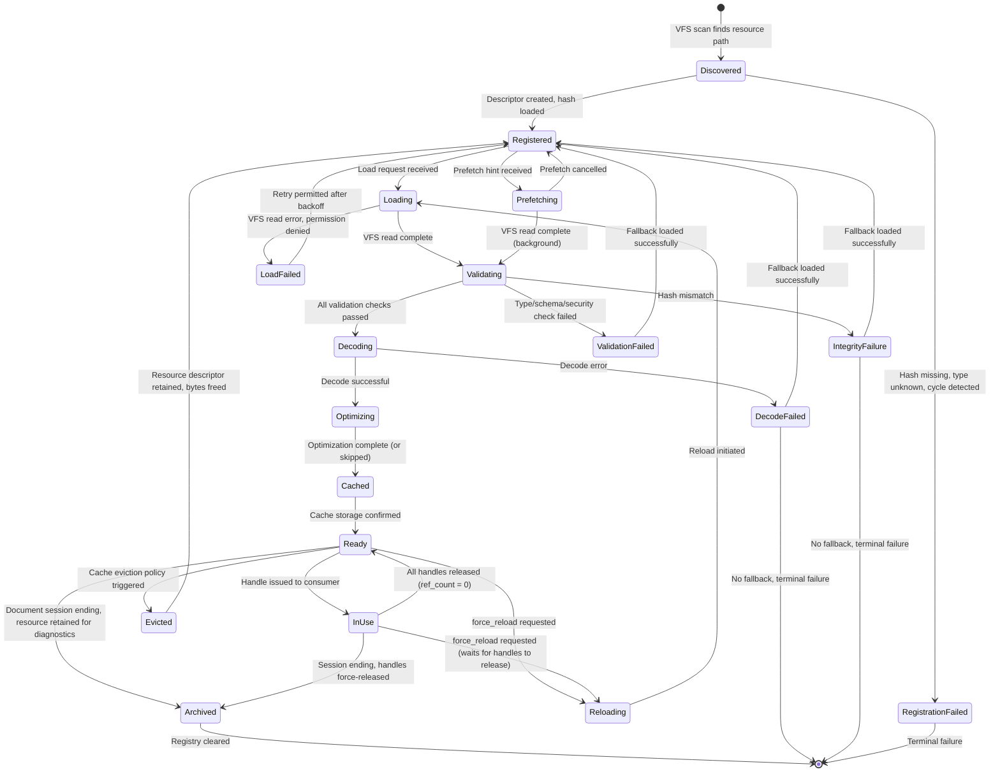

### 10.3 State Descriptions

| State | Description | Valid Operations |
|-------|-------------|-----------------|
| `Discovered` | Resource path found in VFS scan; descriptor not yet created | Register |
| `Registered` | Descriptor created; resource not yet loaded | Load, Prefetch, Exists check |
| `Loading` | VFS read in progress | Cancel |
| `Prefetching` | Background VFS read in progress | Cancel |
| `Validating` | Hash and type validation in progress | Cancel |
| `Decoding` | Type-specific decode in progress | Cancel |
| `Optimizing` | Post-decode optimization in progress | Cancel |
| `Cached` | Decoded object stored in cache | — (internal transition) |
| `Ready` | Resource available; no active handles | Load (returns cached), Prefetch, Reload, Release |
| `InUse` | One or more active handles exist | Load (returns cached), Reload (deferred) |
| `Evicted` | Cache entry evicted; descriptor retained | Load (triggers fresh load) |
| `Reloading` | Reload in progress (replaces existing cached version) | Cancel |
| `IntegrityFailure` | Hash verification failed | Load fallback |
| `ValidationFailed` | Type/schema/security validation failed | Load fallback |
| `LoadFailed` | VFS read or permission error | Retry after backoff |
| `DecodeFailed` | Decode error after successful validation | Load fallback |
| `RegistrationFailed` | Could not create descriptor (cycle, missing hash) | None (terminal) |
| `Archived` | Session ending; resource retained for diagnostics | Read metadata only |

### 10.4 State Transitions

**Discovered → Registered**  
Triggered during boot when the VFS asset index is scanned. The Resource Manager creates a `ResourceDescriptor` for each discovered resource, loads its expected hash from the manifest, and registers it in the Registry. Transition fails if the hash is missing from the manifest or the resource type is unknown.

**Registered → Loading**  
Triggered when a consumer calls `Resource.load()` or `Resource.stream()` for a resource that is not in cache. The Orchestrator initiates the loading pipeline.

**Registered → Prefetching**  
Triggered by a prefetch hint (from dependency resolution, page navigation, or scheduler). Identical to Loading but runs at Background priority.

**Loading / Prefetching → Validating**  
Triggered when the VFS read completes successfully. The raw bytes are passed to the validation pipeline.

**Validating → Decoding**  
Triggered when all validation checks pass. The validated bytes are passed to the type-specific decoder.

**Decoding → Optimizing**  
Triggered when the decode completes successfully. The decoded object is passed to the optimizer.

**Optimizing → Cached**  
Triggered when optimization completes (or is skipped). The decoded object is stored in the appropriate cache tier.

**Cached → Ready**  
Triggered when cache storage is confirmed. The resource is now available for handle issuance.

**Ready → InUse**  
Triggered when a handle is issued to a consumer. The reference count increments from 0 to 1 (or higher for multiple consumers).

**InUse → Ready**  
Triggered when all handles are released (reference count returns to 0). The resource remains in cache but is eligible for eviction.

**Ready → Evicted**  
Triggered by the cache eviction policy. The decoded object is freed from memory. The descriptor remains in the Registry. The resource can be reloaded by transitioning back to Loading.

**Ready / InUse → Reloading**  
Triggered by `Resource.reload()`. If the resource is InUse, the reload waits until all handles are released before initiating. The existing cache entry is retained until the reload completes successfully.

**Any failure state → Registered**  
If a fallback resource is successfully loaded, the original resource's state is reset to Registered (it can be retried). The fallback is delivered to the consumer.

### 10.5 Lifecycle Events

Each state transition emits a corresponding event to the Event Bus (see Section 16 for full event specifications):

| Transition | Event |
|------------|-------|
| Discovered → Registered | `ResourceRegistered` |
| Registered → Loading | `ResourceLoading` |
| Validating → Decoding | `ResourceValidated` |
| Cached → Ready | `ResourceLoaded` |
| Ready → InUse | `ResourceHandleIssued` |
| InUse → Ready | `ResourceHandleReleased` |
| Ready → Evicted | `ResourceEvicted` |
| Any → Reloading | `ResourceReloading` |
| Reloading → Ready | `ResourceReloaded` |
| Any failure | `ResourceFailed` |
| IntegrityFailure | `ResourceIntegrityViolation` |

### 10.6 Lifecycle Timing Targets

| Transition | Target Duration |
|------------|----------------|
| Discovered → Registered (per resource) | < 0.1ms |
| Registered → Ready (cache miss, < 64KB) | < 25ms |
| Registered → Ready (cache miss, 1MB) | < 100ms |
| Ready → InUse (handle issuance) | < 0.1ms |
| InUse → Ready (handle release) | < 0.1ms |
| Ready → Evicted (eviction) | < 1ms |
| Evicted → Ready (reload, < 64KB) | < 25ms |

---

## 11. Memory Management

### 11.1 Memory Management Philosophy

The Resource Manager is a significant consumer of process memory. It must coordinate with the Runtime Memory Manager to ensure that resource loading, caching, and streaming do not exhaust available memory. Memory management in the Resource Manager is proactive, not reactive — it anticipates memory needs before they become critical.

### 11.2 Memory Budget System

The Resource Manager operates within a memory budget assigned by the Runtime Memory Manager at boot time. The budget is divided among the cache tiers and the streaming buffer pool.

Default budget allocation (total: 1,600MB):

| Component | Default Budget | Configurable |
|-----------|---------------|-------------|
| L1 Decoded Cache | 256MB | Yes |
| L2 Image Cache | 512MB | Yes |
| L3 Font Cache | 64MB | Yes |
| L4 Script Cache | 128MB | Yes |
| L5 Raw Bytes Cache | 128MB | Yes |
| L6 Stream Cache | 256MB | Yes |
| L7 Database Cache | 64MB | Yes |
| L8 Plugin Cache | 64MB | Yes |
| Streaming Buffer Pool | 128MB | Yes |
| Registry + Metadata | ~10MB | No |

The Runtime Memory Manager may reduce the Resource Manager's budget at runtime in response to system-wide memory pressure. The Resource Manager responds by evicting cache entries to stay within the reduced budget.

### 11.3 Memory Flow Diagram

```mermaid
graph TD
    subgraph MemoryFlow["Memory Flow"]
        VFS[VFS Read\nRaw Bytes] -->|"allocate from\nbuffer pool"| RAWBUF[Raw Buffer\n(temporary)]
        RAWBUF -->|"hash + validate"| VALBUF[Validated Buffer\n(temporary)]
        VALBUF -->|"decode"| DECODED[Decoded Object\n(permanent until eviction)]
        DECODED -->|"store"| CACHE[Cache Tier]
        CACHE -->|"issue handle"| HANDLE[Consumer Handle\n(shared reference)]
        HANDLE -->|"release"| CACHE
        CACHE -->|"evict"| FREE[Memory Freed]
    end

    subgraph Streaming["Streaming Memory Flow"]
        VFSS[VFS Stream] -->|"chunk"| CHUNKBUF[Chunk Buffer\n(pool allocated)]
        CHUNKBUF -->|"verify + deliver"| CONSUMER[Consumer]
        CONSUMER -->|"consume"| RELEASE[Return to Pool]
    end

    subgraph Pressure["Memory Pressure Response"]
        MM[Runtime Memory Manager] -->|"pressure signal"| EVICT[Eviction Policy]
        EVICT -->|"evict LRU"| FREE
    end
```

### 11.4 Buffer Pool

The Resource Manager maintains a buffer pool for temporary allocations during loading and streaming. The buffer pool eliminates per-load heap allocations for common buffer sizes.

Buffer pool configuration:

| Buffer Size | Pool Count | Total Memory |
|-------------|------------|-------------|
| 4KB | 256 | 1MB |
| 64KB | 128 | 8MB |
| 256KB | 64 | 16MB |
| 1MB | 32 | 32MB |
| 4MB | 16 | 64MB |
| 16MB | 4 | 64MB |

Total pool memory: ~185MB (within the 128MB streaming buffer budget — the pool is shared with the stream cache).

When a buffer of a requested size is not available in the pool, a heap allocation is made. The allocation is returned to the pool when released if the pool has capacity; otherwise it is freed.

### 11.5 Zero-Copy Paths

The Resource Manager implements zero-copy paths for specific resource types to avoid unnecessary memory copies:

**Zero-copy image delivery**: When a consumer requests an image that is already in the Image Cache, the handle provides a direct reference to the cached pixel buffer. No copy is made.

**Zero-copy stream delivery**: Stream chunks are delivered to consumers as references to pool-allocated buffers. The consumer must release the chunk reference before the buffer is returned to the pool.

**Zero-copy font delivery**: Font objects in the Font Cache are delivered by reference. The font renderer reads directly from the cached font object.

**Memory-mapped SQLite**: SQLite database files are accessed through VFS memory mapping. The SQLite engine reads pages directly from the mapped region without copying.

### 11.6 Shared Resources

Some resources are shared between multiple consumers without duplication:

- A font used by both the page renderer and a plugin is loaded once and shared
- A localization file used by multiple page components is loaded once and shared
- A WASM module used by multiple plugin instances is compiled once and shared

Sharing is managed through reference counting. The shared resource is not freed until all consumers release their handles.

### 11.7 Compression in Cache

To increase the effective cache capacity, the Raw Bytes Cache (L5) stores compressed bytes rather than decompressed bytes. Resources in L5 are stored in their original compressed form (as they appear in the ZIP container). Decompression occurs when the resource is promoted from L5 to a higher tier.

Decoded objects in L1 are not compressed — compression of parsed object trees is not cost-effective.

Image data in L2 may be stored in a compressed pixel format (e.g., BC7 texture compression for GPU-bound images) to reduce memory footprint.

### 11.8 Low-Memory Mode

When the Runtime Memory Manager signals a low-memory condition, the Resource Manager enters Low-Memory Mode:

1. All Background and Low priority streaming operations are paused
2. Cache tier budgets are reduced by 50%
3. Eviction runs immediately to bring usage within the reduced budgets
4. New resource loads are serialized (no parallel loading)
5. Optimization steps are skipped
6. Prefetching is disabled

Low-Memory Mode is exited when the Runtime Memory Manager signals that memory pressure has returned to normal.

### 11.9 Reference Counting and Garbage Collection

The Resource Manager uses reference counting (not a tracing garbage collector) for resource lifetime management. Reference counting provides deterministic resource release, which is critical for predictable memory behavior.

Reference count rules:
- Every issued handle holds one reference
- The cache holds one reference per cached entry
- When a handle is dropped, its reference is released
- When a cache entry is evicted, the cache's reference is released
- When the reference count reaches zero, the resource's memory is freed immediately

There is no background GC sweep. Memory is freed synchronously when the last reference is released.

Cycle prevention: The dependency graph is a DAG (no cycles), so reference cycles between resources cannot occur. Plugin resources that reference document resources hold a reference to the document resource, not vice versa.

### 11.10 Memory Accounting

The Resource Manager reports its memory usage to the Runtime Memory Manager at regular intervals (every 100ms) and on demand. The report includes:

- Total bytes in each cache tier
- Total bytes in the buffer pool (used and free)
- Total bytes in active stream buffers
- Number of pinned resources (cannot be evicted)
- Peak memory usage since last report

This information is used by the Runtime Memory Manager to make system-wide memory allocation decisions.

---

*[Sections 12–20 follow in subsequent parts]*

---

## 12. Scheduler Integration

### 12.1 Overview

The Resource Manager does not manage its own thread pool. It delegates all concurrent work to the Runtime Scheduler, which owns the worker thread pool and I/O thread pool. The Resource Manager submits tasks to the Scheduler and receives completion notifications through futures and callbacks.

### 12.2 Scheduler Interaction Diagram

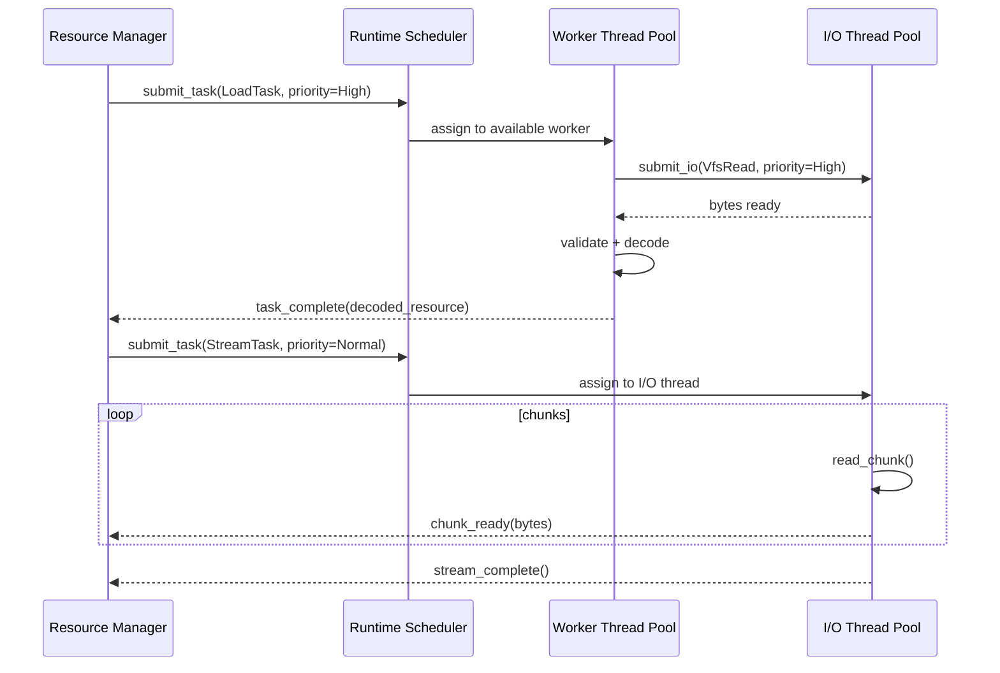

### 12.3 Task Types

The Resource Manager submits the following task types to the Scheduler:

| Task Type | Thread Pool | Priority Range | Cancellable |
|-----------|-------------|---------------|-------------|
| `LoadTask` | Worker | Critical–Background | Yes |
| `StreamTask` | I/O | Critical–Background | Yes |
| `PrefetchTask` | Worker + I/O | Background | Yes |
| `ValidationTask` | Worker | Inherits from LoadTask | Yes |
| `DecodeTask` | Worker | Inherits from LoadTask | Yes |
| `OptimizeTask` | Worker | Low | Yes |
| `EvictionTask` | Worker | Low | No |
| `PrefetchSweepTask` | Worker | Background | Yes |

### 12.4 Priority Queues

The Scheduler maintains separate priority queues for Resource Manager tasks. Priority levels:

| Priority | Numeric Value | Use Case |
|----------|--------------|----------|
| Critical | 0 | Resources blocking page render |
| High | 1 | Resources for active user interaction |
| Normal | 2 | Standard resource loads |
| Low | 3 | Prefetch triggered by navigation |
| Background | 4 | Idle-time pre-loading, optimization |

Priority is assigned at request time and can be escalated (but not reduced) if the resource becomes blocking. For example, a prefetch that was running at Background priority is escalated to High if the user navigates to the page before the prefetch completes.

### 12.5 Deferred Loading

Resources can be marked for deferred loading — they are registered in the Registry but not loaded until explicitly requested. Deferred loading is used for:

- Resources on pages that have not been visited
- Plugin resources that are not needed at boot
- AI model weights that are loaded on first use

Deferred resources remain in the `Registered` state until a load request arrives.

### 12.6 Idle Loading

The Resource Manager registers an idle callback with the Scheduler. When the Scheduler detects that the worker thread pool is idle (no pending tasks), it invokes the idle callback. The Resource Manager uses idle time to:

1. Prefetch lazy dependencies of currently loaded resources
2. Pre-compile WASM modules that are registered but not yet compiled
3. Generate image mipmaps for cached images
4. Run the TTL expiry sweep on the cache
5. Pre-load resources for the next predicted page navigation

Idle loading tasks are submitted at Background priority and are immediately preempted if a higher-priority task arrives.

### 12.7 Parallel Loading

Independent resources (resources with no dependency relationship) are loaded in parallel. The degree of parallelism is controlled by the Scheduler's worker thread pool size.

The Orchestrator determines which resources can be loaded in parallel by consulting the dependency graph:

```
parallel_groups = topological_sort_by_level(dependency_graph)
for each level in parallel_groups:
    submit all resources in this level as parallel LoadTasks
    wait for all tasks in this level to complete
    proceed to next level
```

This ensures that dependencies are always loaded before their dependents, while maximizing parallelism within each dependency level.

### 12.8 Task Cancellation

Any pending or in-progress task can be cancelled through the Scheduler's cancellation API. Cancellation is cooperative:

- Pending tasks (not yet started): removed from the queue immediately
- In-progress tasks: receive a cancellation signal and complete their current atomic operation before stopping

When a load task is cancelled:
- The resource's lifecycle state returns to `Registered`
- Any partially loaded bytes are freed
- A `ResourceLoadCancelled` event is emitted
- The consumer receives a `LoadCancelledError`

### 12.9 Background Streaming Coordination

Background streaming tasks coordinate with the Scheduler to avoid saturating the I/O thread pool. The Resource Manager limits the number of concurrent background streams:

| System State | Max Concurrent Background Streams |
|-------------|----------------------------------|
| Idle | 4 |
| Normal load | 2 |
| High load | 1 |
| Critical load | 0 (all background streams paused) |

The Scheduler reports its load level to the Resource Manager through a shared state variable updated every 100ms.

---

## 13. Security

### 13.1 Security Model

The Resource Manager is a security enforcement point. It enforces the document's security policy for every resource access. Security is not a feature that can be disabled — it is an architectural invariant.

The security model is based on three principles:
1. **Verify before use**: No resource bytes reach a consumer without passing integrity and type validation
2. **Least privilege**: Every caller receives only the access it needs, nothing more
3. **Fail secure**: When a security check fails, the operation fails completely — there is no partial success

### 13.2 Permission Enforcement

Permission enforcement is described in Section 5.4. The permission matrix is enforced at the Resource API layer before any work begins. Permission checks are:

- Synchronous (no I/O required)
- Non-bypassable (no override mechanism)
- Logged (every permission check, pass or fail, is logged)
- Auditable (permission check logs are included in the security audit trail)

### 13.3 Sandbox Enforcement

Plugin resources are loaded in an isolated sandbox:

```mermaid
graph TD
    subgraph DocumentNamespace["Document Namespace (trusted)"]
        DRES[Document Resources]
    end

    subgraph PluginSandbox["Plugin Sandbox (isolated)"]
        PRES[Plugin Resources]
        PWASM[Plugin WASM Module]
        PAPI[Plugin Resource API\n(restricted subset)]
    end

    PWASM -->|"read via restricted API"| PAPI
    PAPI -->|"permission check"| DRES
    PWASM -->|"read own resources"| PRES
    PWASM -.->|"BLOCKED"| DRES
```

Plugin sandboxing rules:
- Plugins access document resources only through the restricted Resource API subset
- Plugins cannot access other plugins' resources
- Plugins cannot access the AI namespace
- Plugin WASM modules cannot call VFS APIs directly
- Plugin resource paths are confined to the plugin's namespace prefix

### 13.4 Read-Only Enforcement

All document resources are read-only after boot. The Resource Manager enforces this at the VFS layer — all VFS reads for document resources use read-only file handles. There is no write path for document resources.

Plugin resources within the plugin's own namespace may be writable if the plugin declares write permission in its manifest. Write operations on plugin resources go through the same validation pipeline as reads.

### 13.5 Tampering Detection

Tampering is detected through hash verification (Section 9.3). When tampering is detected:

1. The `IntegrityViolation` security event is emitted immediately
2. The Security Manager is notified synchronously (blocking call)
3. The affected resource is marked as `IntegrityFailure`
4. The raw bytes are zeroed and freed
5. The Security Manager decides whether to:
   - Abort the document session
   - Continue with the fallback resource
   - Continue without the resource (if optional)

The Resource Manager does not make the abort/continue decision. That decision belongs to the Security Manager.

### 13.6 Attack Prevention

The Resource Manager defends against the following attack vectors:

| Attack | Defense |
|--------|---------|
| Path traversal | VFS enforces path containment; Resource Manager validates all paths against the Registry |
| Resource substitution | Hash verification detects any byte-level change |
| Type confusion | Magic byte verification and type validation prevent mislabeled resources |
| Image bomb | Compressed/decompressed ratio check with dimension limits |
| WASM import injection | Import list validated against approved API surface before compilation |
| XXE injection | XML external entity processing disabled |
| YAML deserialization | Only safe YAML subset parsed; no arbitrary object tags |
| Memory exhaustion | Size limits enforced before allocation; buffer pool prevents unbounded allocation |
| Denial of service via large resources | Size limits and streaming prevent blocking on large files |
| Plugin resource shadowing | Namespace isolation prevents plugins from overriding document resources |

### 13.7 Integrity Verification Chain

The integrity verification chain ensures that trust flows from the document root downward:

```
Document Root Hash (in 64-byte binary header)
    ↓ verifies
manifest.json hash
    ↓ verifies
security/hashes.json hash
    ↓ contains
Per-resource SHA-256 hashes
    ↓ verify
Individual resource bytes
```

If any link in this chain fails, all resources below that link are considered untrusted. The Resource Manager will not load any resource whose hash cannot be traced back to the document root hash.

### 13.8 Trusted Resources

Resources can be marked as `trusted` in the asset index. Trusted resources:
- Are signed with the document author's private key
- Have their signatures verified in addition to hash verification
- Are given elevated access in the permission matrix (e.g., trusted scripts can access more APIs)

Trusted status is declared by the document author and verified by the Resource Manager. A resource cannot claim trusted status at runtime.

---

## 14. Runtime Integration

### 14.1 Integration Overview

The Resource Manager integrates with every major runtime component. Each integration is defined by a specific API contract. The Resource Manager never calls into runtime components directly — it communicates through the Event Bus and through well-defined service interfaces.

### 14.2 Runtime Integration Diagram

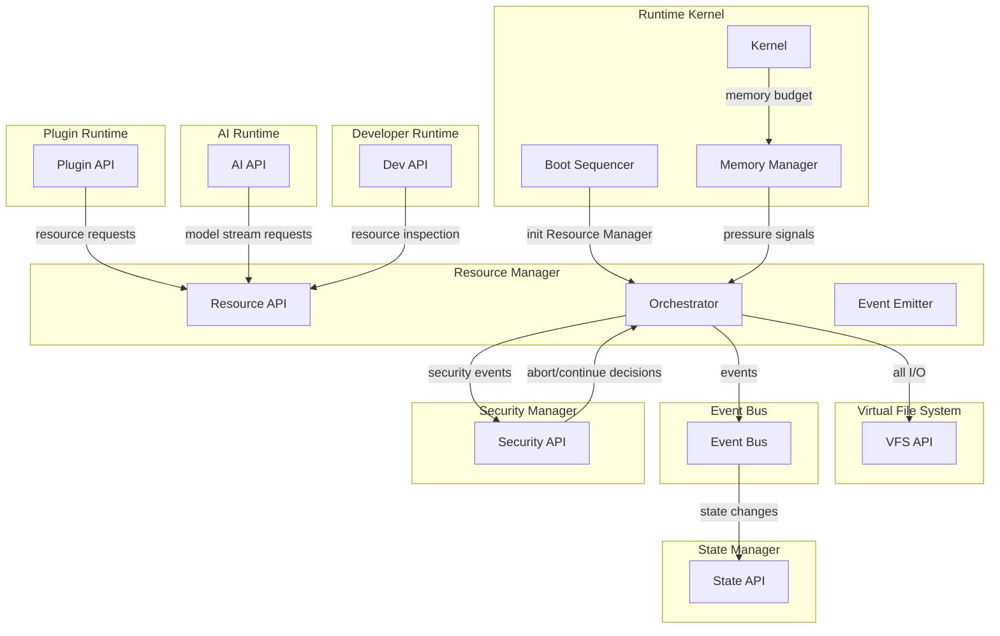

### 14.3 Runtime Kernel Integration

The Runtime Kernel initializes the Resource Manager during the boot sequence. The initialization contract:

1. Kernel provides the VFS handle to the Resource Manager
2. Kernel provides the memory budget allocation
3. Kernel provides the document's security policy
4. Resource Manager performs boot-time registration of all document resources
5. Resource Manager signals `Ready` to the Kernel when registration is complete
6. Kernel proceeds with the rest of the boot sequence

The Resource Manager registers a shutdown handler with the Kernel. On shutdown, the Resource Manager:
1. Cancels all in-progress loads and streams
2. Releases all cache entries
3. Clears the Registry
4. Reports final statistics to the Kernel

### 14.4 Virtual File System Integration

The Resource Manager is the primary consumer of the VFS API. All resource I/O goes through the VFS. The Resource Manager uses the following VFS operations:

| VFS Operation | Resource Manager Use |
|---------------|---------------------|
| `vfs.read_file(path)` | Synchronous resource load |
| `vfs.open_stream(path)` | Streaming resource load |
| `vfs.file_exists(path)` | Resource existence check |
| `vfs.file_metadata(path)` | Size and hash pre-check |
| `vfs.list_directory(path)` | Boot-time resource discovery |
| `vfs.read_range(path, offset, len)` | Streaming seek and random access |

The Resource Manager never accesses the ZIP container directly. All access is through the VFS API as defined in LDFX-P2-2.2.

### 14.5 State Manager Integration

The Resource Manager reports significant state changes to the State Manager:

- Document resource loading progress (percentage of boot resources loaded)
- Cache utilization state (normal, elevated, high, critical)
- Active stream count
- Integrity violation events

The State Manager uses this information to update the document's overall health state and to trigger UI updates (e.g., loading progress indicators).

### 14.6 Event Bus Integration

The Resource Manager emits events to the Event Bus for all significant operations. It also subscribes to events from other components:

**Events emitted** (see Section 16 for full specifications):
- All resource lifecycle events
- Cache events (hit, miss, eviction)
- Integrity and security events
- Stream events

**Events subscribed**:
- `MemoryPressureChanged` (from Memory Manager) → triggers cache eviction
- `DocumentSessionEnding` (from Kernel) → triggers graceful shutdown
- `PluginRegistered` (from Plugin Runtime) → triggers plugin resource registration
- `PluginUnregistered` (from Plugin Runtime) → triggers plugin resource cleanup
- `LocaleChanged` (from Localization Service) → triggers localization resource reload

### 14.7 Plugin Runtime Integration

The Plugin Runtime accesses resources through a restricted subset of the Resource API. The restriction is enforced by the Resource Manager based on the caller's identity (plugin ID).

Plugin resource registration:
1. Plugin Runtime calls `Resource.register_plugin_resources(plugin_id, manifest)`
2. Resource Manager validates the plugin manifest
3. Resource Manager registers plugin resources in the plugin's namespace
4. Resource Manager validates plugin dependencies against document resources
5. Resource Manager signals registration complete to Plugin Runtime

Plugin resource cleanup:
1. Plugin Runtime calls `Resource.unregister_plugin(plugin_id)`
2. Resource Manager cancels all in-progress loads for the plugin's resources
3. Resource Manager evicts all plugin resources from cache
4. Resource Manager removes all plugin resource descriptors from the Registry

### 14.8 Security Manager Integration

The Security Manager and Resource Manager have a bidirectional relationship:

**Resource Manager → Security Manager**:
- `notify_integrity_violation(resource_id, expected_hash, computed_hash)` — synchronous call, blocks until Security Manager responds
- `notify_signature_violation(resource_id, signature_error)` — synchronous call
- `notify_security_validation_failure(resource_id, violation_type)` — synchronous call

**Security Manager → Resource Manager**:
- `get_resource_permission_policy()` — called at boot to load the permission matrix
- `abort_resource_load(resource_id)` — called in response to a security violation
- `allow_fallback(resource_id)` — called to permit fallback loading after a violation

### 14.9 AI Runtime Integration

The AI Runtime accesses AI model resources through the Resource Manager's streaming API. The integration:

1. AI Runtime calls `Resource.stream(model_path, priority=High)`
2. Resource Manager validates the caller has AI namespace access
3. Resource Manager initiates streaming of the model weights
4. AI Runtime receives chunks and loads them into its memory-mapped model region
5. AI Runtime calls `Resource.metadata(model_path)` to get model architecture information
6. AI Runtime calls `Resource.dependencies(model_path)` to get tokenizer and config paths
7. AI Runtime loads tokenizer and config through standard `Resource.load()` calls

### 14.10 Developer Runtime Integration

The Developer Runtime has elevated access to the Resource Manager for debugging and inspection purposes. It can:

- Access resources in any namespace (with appropriate developer permissions)
- Force-reload any resource
- Inspect cache contents and statistics
- Trigger cache eviction for specific resources
- Access the dependency graph visualization
- Access the full resource registry

Developer Runtime access is only available when the document is opened in developer mode. Developer mode is declared in the document manifest and cannot be enabled at runtime.

---

*[Sections 15–20 follow in subsequent parts]*

---

## 15. Public Resource APIs

### 15.1 API Design Principles

The public Resource API is the only interface through which runtime components interact with the Resource Manager. It is designed to be:

- **Type-safe**: Return types are specific to the resource type, not generic byte buffers
- **Async-first**: All potentially blocking operations return futures
- **Error-explicit**: Every method returns a `Result` type; no panics, no silent failures
- **Permission-aware**: Every method checks caller permissions before executing
- **Observable**: Every method emits events and produces trace spans

### 15.2 Resource.load()

**Purpose**: Load a resource and return a typed handle. For resources already in cache, returns immediately. For cache misses, initiates the full loading pipeline.

**Signature**:
```
Resource.load(
    resource_ref: ResourceRef,       // ID, VFS path, or alias
    options: LoadOptions             // priority, timeout, force_reload
) -> Future<Result<ResourceHandle, ResourceError>>
```

**Parameters**:
- `resource_ref`: Identifies the resource. Accepts `ResourceId` (UUID), `VfsPath` (string), or `Alias` (string + namespace).
- `options.priority`: `LoadPriority` enum. Default: `Normal`.
- `options.timeout`: Optional `Duration`. If the load does not complete within this duration, returns `TimeoutError`. Default: 30 seconds.
- `options.force_reload`: `bool`. If true, bypasses cache and reloads from VFS. Default: false.

**Return**: `ResourceHandle` — a typed handle providing access to the decoded resource. The handle type is determined by the resource type (e.g., `ImageHandle`, `FontHandle`, `ScriptHandle`).

**Errors**:
- `ResourceNotFoundError`: Resource not in Registry
- `PermissionDeniedError`: Caller lacks access to the resource's namespace
- `IntegrityError`: Hash verification failed
- `ValidationError`: Type or schema validation failed
- `DecodeError`: Decode failed after successful validation
- `DependencyLoadError`: A required dependency failed to load
- `TimeoutError`: Load did not complete within the timeout
- `LoadCancelledError`: Load was cancelled

**Events emitted**: `ResourceLoading`, `ResourceValidated`, `ResourceLoaded` (or `ResourceFailed`)

**Permissions**: Caller must have read access to the resource's namespace (see Section 5.4).

**Example**:
```
let handle = Resource.load("/assets/fonts/Inter-Regular.woff2", LoadOptions::default()).await?;
let font = handle.as_font()?;
renderer.register_font(font);
```

### 15.3 Resource.unload()

**Purpose**: Release a resource handle and decrement the reference count. If the reference count reaches zero, the resource becomes eligible for cache eviction.

**Signature**:
```
Resource.unload(handle: ResourceHandle) -> Result<(), ResourceError>
```

**Parameters**:
- `handle`: The handle to release. After this call, the handle is invalid.

**Return**: `()` on success.

**Errors**:
- `InvalidHandleError`: The handle is already released or was never valid.

**Events emitted**: `ResourceHandleReleased`

**Notes**: Handles also implement `Drop`, so they are automatically released when they go out of scope. Explicit `unload()` is provided for cases where the release timing must be controlled precisely.

### 15.4 Resource.reload()

**Purpose**: Force a reload of a resource from the VFS, bypassing the cache. Used when a plugin has updated a resource it owns, or when the developer forces a refresh.

**Signature**:
```
Resource.reload(
    resource_ref: ResourceRef,
    options: ReloadOptions
) -> Future<Result<ResourceHandle, ResourceError>>
```

**Parameters**:
- `resource_ref`: Identifies the resource to reload.
- `options.wait_for_handles`: `bool`. If true, waits for all existing handles to be released before reloading. If false, reloads immediately and invalidates existing handles. Default: true.

**Return**: A new `ResourceHandle` to the freshly loaded resource.

**Errors**: Same as `Resource.load()`, plus:
- `ReloadConflictError`: `wait_for_handles` is false but existing handles cannot be invalidated (e.g., resource is in active use by a critical component).

**Events emitted**: `ResourceReloading`, `ResourceReloaded` (or `ResourceFailed`)

**Permissions**: Caller must have write access to the resource's namespace. Only plugin resources in the plugin's own namespace and developer runtime can trigger reloads.

### 15.5 Resource.exists()

**Purpose**: Check whether a resource is registered in the Registry. Does not trigger a load.

**Signature**:
```
Resource.exists(resource_ref: ResourceRef) -> bool
```

**Parameters**:
- `resource_ref`: Identifies the resource to check.

**Return**: `true` if the resource is registered (in any lifecycle state), `false` otherwise.

**Errors**: None. This method never fails.

**Events emitted**: None.

**Permissions**: No permission check. Existence checks are always permitted.

**Notes**: `exists()` returning `true` does not guarantee that `load()` will succeed. The resource may be in a failed state.

### 15.6 Resource.stream()

**Purpose**: Open a streaming handle for a large resource. Returns immediately with a `StreamHandle`; data is delivered asynchronously as chunks.

**Signature**:
```
Resource.stream(
    resource_ref: ResourceRef,
    options: StreamOptions
) -> Future<Result<StreamHandle, ResourceError>>
```

**Parameters**:
- `resource_ref`: Identifies the resource to stream.
- `options.priority`: `LoadPriority`. Default: `Normal`.
- `options.start_offset`: `u64`. Byte offset to start streaming from. Default: 0.
- `options.chunk_size_hint`: `Option<u64>`. Hint for preferred chunk size. The Stream Manager may ignore this. Default: None (adaptive).

**Return**: `StreamHandle` — provides `next_chunk()`, `seek()`, `pause()`, `resume()`, `cancel()`.

**Errors**:
- `ResourceNotFoundError`
- `PermissionDeniedError`
- `StreamingNotSupportedError`: Resource type does not support streaming
- `IntegrityError`: First chunk hash verification failed

**Events emitted**: `ResourceStreamOpened`, `ResourceStreamChunk` (per chunk), `ResourceStreamCompleted` (or `ResourceStreamFailed`)

**Permissions**: Same as `Resource.load()`.

### 15.7 Resource.prefetch()

**Purpose**: Hint to the Resource Manager that a resource will be needed soon. Initiates a background load at low priority. Returns immediately without waiting for the load to complete.

**Signature**:
```
Resource.prefetch(
    resource_ref: ResourceRef,
    options: PrefetchOptions
) -> Result<PrefetchHandle, ResourceError>
```

**Parameters**:
- `resource_ref`: Identifies the resource to prefetch.
- `options.priority`: `LoadPriority`. Default: `Background`.
- `options.include_dependencies`: `bool`. If true, also prefetches all transitive dependencies. Default: true.

**Return**: `PrefetchHandle` — can be used to cancel the prefetch or wait for its completion.

**Errors**:
- `ResourceNotFoundError`
- `PermissionDeniedError`

**Events emitted**: `ResourcePrefetchStarted`, `ResourcePrefetchCompleted` (or `ResourcePrefetchCancelled`)

**Permissions**: Same as `Resource.load()`.

### 15.8 Resource.release()

**Purpose**: Explicitly release a resource from cache, freeing its memory. Used when a component knows it will not need a resource again and wants to free memory immediately.

**Signature**:
```
Resource.release(
    resource_ref: ResourceRef,
    options: ReleaseOptions
) -> Result<(), ResourceError>
```

**Parameters**:
- `resource_ref`: Identifies the resource to release.
- `options.force`: `bool`. If true, releases even if the reference count is > 0 (invalidates all existing handles). Default: false.

**Return**: `()` on success.

**Errors**:
- `ResourceNotFoundError`
- `PermissionDeniedError`
- `ResourceInUseError`: `force` is false and the resource has active handles.

**Events emitted**: `ResourceReleased`

**Permissions**: Caller must own the resource (plugin releasing its own resource) or have developer access.

### 15.9 Resource.metadata()

**Purpose**: Retrieve the metadata for a resource without loading it. Returns the resource descriptor from the Registry.

**Signature**:
```
Resource.metadata(resource_ref: ResourceRef) -> Result<ResourceMetadata, ResourceError>
```

**Parameters**:
- `resource_ref`: Identifies the resource.

**Return**: `ResourceMetadata` containing:
  - `id`: ResourceId
  - `path`: VfsPath
  - `resource_type`: ResourceType
  - `mime_type`: String
  - `size_bytes`: u64
  - `hash_sha256`: [u8; 32]
  - `version`: SemVer
  - `lifecycle_state`: LifecycleState
  - `namespace`: Namespace
  - `aliases`: Vec<String>
  - `registered_at`: Timestamp
  - `last_loaded_at`: Option<Timestamp>
  - `load_count`: u64

**Errors**:
- `ResourceNotFoundError`

**Events emitted**: None.

**Permissions**: No permission check for metadata. Metadata is always accessible.

### 15.10 Resource.dependencies()

**Purpose**: Retrieve the dependency list for a resource.

**Signature**:
```
Resource.dependencies(
    resource_ref: ResourceRef,
    options: DependencyOptions
) -> Result<DependencyList, ResourceError>
```

**Parameters**:
- `resource_ref`: Identifies the resource.
- `options.transitive`: `bool`. If true, returns the full transitive closure. If false, returns only direct dependencies. Default: false.
- `options.include_optional`: `bool`. If true, includes optional dependencies. Default: true.

**Return**: `DependencyList` containing:
  - `direct`: Vec<ResourceMetadata>
  - `transitive`: Option<Vec<ResourceMetadata>> (if requested)
  - `optional`: Vec<ResourceMetadata>
  - `missing`: Vec<VfsPath> (declared dependencies not found in Registry)

**Errors**:
- `ResourceNotFoundError`

**Events emitted**: None.

**Permissions**: No permission check.

### 15.11 Resource.statistics()

**Purpose**: Retrieve runtime statistics for a specific resource or for the Resource Manager as a whole.

**Signature**:
```
Resource.statistics(
    resource_ref: Option<ResourceRef>
) -> Result<ResourceStatistics, ResourceError>
```

**Parameters**:
- `resource_ref`: If `Some`, returns statistics for that resource. If `None`, returns aggregate statistics for the entire Resource Manager.

**Return** (per-resource): `ResourceStatistics` containing:
  - `load_count`: u64
  - `cache_hit_count`: u64
  - `cache_miss_count`: u64
  - `total_load_time_ms`: u64
  - `avg_load_time_ms`: f64
  - `last_load_time_ms`: u64
  - `current_ref_count`: u32
  - `cache_tier`: Option<CacheTier>
  - `memory_bytes`: u64

**Return** (aggregate): `ManagerStatistics` containing per-tier cache stats, total loads, total failures, uptime, memory usage.

**Errors**:
- `ResourceNotFoundError` (only if `resource_ref` is `Some` and not found)

**Events emitted**: None.

**Permissions**: Available to all callers. Developer Runtime receives extended statistics.

---

## 16. Resource Events

### 16.1 Event System Overview

The Resource Manager emits structured events to the Event Bus for every significant operation. Events are the primary mechanism for other runtime components to observe Resource Manager activity without polling.

All Resource Manager events:
- Are emitted asynchronously (fire-and-forget from the Resource Manager's perspective)
- Carry a `trace_id` linking them to the originating load operation
- Are logged to the diagnostics subsystem
- Are available to the Developer Runtime for inspection

### 16.2 Event Flow Diagram

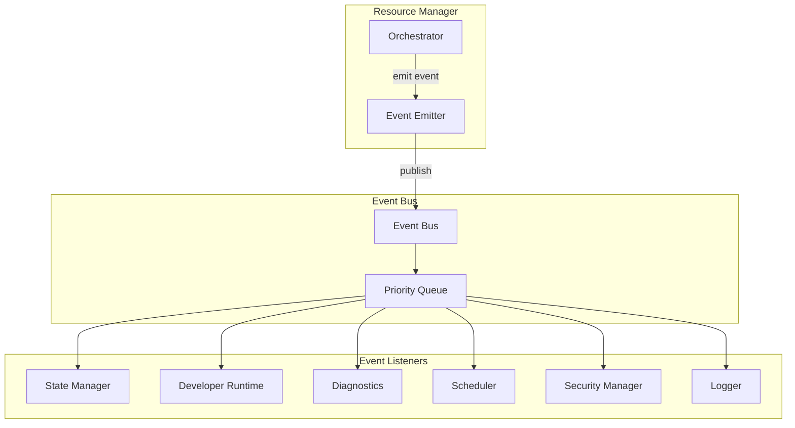

### 16.3 Event Catalog

#### ResourceDiscovered
Emitted when a resource path is found during VFS scan but before the descriptor is created.

```
ResourceDiscovered {
    path:       VfsPath
    timestamp:  Timestamp
    trace_id:   TraceId
}
```
Priority: Low. Listeners: Diagnostics, Developer Runtime.

#### ResourceRegistered
Emitted when a resource descriptor is successfully created and added to the Registry.

```
ResourceRegistered {
    resource_id:    ResourceId
    path:           VfsPath
    resource_type:  ResourceType
    namespace:      Namespace
    timestamp:      Timestamp
    trace_id:       TraceId
}
```
Priority: Low. Listeners: Diagnostics, Developer Runtime, State Manager.

#### ResourceLoading
Emitted when a load operation begins (VFS read initiated).

```
ResourceLoading {
    resource_id:    ResourceId
    path:           VfsPath
    priority:       LoadPriority
    caller_id:      CallerId
    timestamp:      Timestamp
    trace_id:       TraceId
}
```
Priority: Normal. Listeners: Diagnostics, Developer Runtime, State Manager.

#### ResourceLoaded
Emitted when a resource successfully completes the full loading pipeline and is ready for use.

```
ResourceLoaded {
    resource_id:    ResourceId
    path:           VfsPath
    resource_type:  ResourceType
    size_bytes:     u64
    load_time_ms:   u64
    cache_hit:      bool
    timestamp:      Timestamp
    trace_id:       TraceId
}
```
Priority: Normal. Listeners: All.

#### ResourceValidated
Emitted when a resource passes all validation checks (hash, type, schema).

```
ResourceValidated {
    resource_id:    ResourceId
    path:           VfsPath
    hash_verified:  bool
    sig_verified:   bool
    timestamp:      Timestamp
    trace_id:       TraceId
}
```
Priority: Low. Listeners: Diagnostics, Security Manager.

#### ResourceCached
Emitted when a resource is stored in a cache tier.

```
ResourceCached {
    resource_id:    ResourceId
    cache_tier:     CacheTier
    size_bytes:     u64
    timestamp:      Timestamp
    trace_id:       TraceId
}
```
Priority: Low. Listeners: Diagnostics.

#### ResourceReleased
Emitted when a resource handle is released and the reference count reaches zero.

```
ResourceReleased {
    resource_id:    ResourceId
    path:           VfsPath
    ref_count:      u32    // 0 after release
    timestamp:      Timestamp
    trace_id:       TraceId
}
```
Priority: Low. Listeners: Diagnostics, State Manager.

#### ResourceReloaded
Emitted when a force-reload completes successfully.

```
ResourceReloaded {
    resource_id:    ResourceId
    path:           VfsPath
    old_version:    SemVer
    new_version:    SemVer
    load_time_ms:   u64
    timestamp:      Timestamp
    trace_id:       TraceId
}
```
Priority: Normal. Listeners: All.

#### ResourceInvalidated
Emitted when a cache entry is invalidated (TTL expiry, plugin update, security event).

```
ResourceInvalidated {
    resource_id:    ResourceId
    path:           VfsPath
    reason:         InvalidationReason   // TtlExpired | PluginUpdate | SecurityEvent | ManualInvalidation
    timestamp:      Timestamp
    trace_id:       TraceId
}
```
Priority: Normal. Listeners: Diagnostics, Developer Runtime.

#### ResourceFailed
Emitted when any stage of the loading pipeline fails.

```
ResourceFailed {
    resource_id:    ResourceId
    path:           VfsPath
    stage:          PipelineStage        // VfsRead | HashVerification | TypeValidation | Decode | etc.
    error:          ResourceError
    fallback_used:  bool
    timestamp:      Timestamp
    trace_id:       TraceId
}
```
Priority: High. Listeners: All.

#### ResourceIntegrityViolation
Emitted when hash or signature verification fails. This is a security event.

```
ResourceIntegrityViolation {
    resource_id:    ResourceId
    path:           VfsPath
    expected_hash:  [u8; 32]
    computed_hash:  [u8; 32]
    violation_type: ViolationType    // HashMismatch | SignatureMismatch
    timestamp:      Timestamp
    trace_id:       TraceId
}
```
Priority: Critical. Listeners: Security Manager (synchronous), all others (async).

#### ResourceEvicted
Emitted when a cache entry is evicted by the eviction policy.

```
ResourceEvicted {
    resource_id:    ResourceId
    cache_tier:     CacheTier
    reason:         EvictionReason   // LruEviction | MemoryPressure | TtlExpired | ManualRelease
    bytes_freed:    u64
    timestamp:      Timestamp
}
```
Priority: Low. Listeners: Diagnostics.

#### ResourceStreamOpened / ResourceStreamCompleted / ResourceStreamFailed
Stream lifecycle events with stream ID, resource ID, byte counts, and timing.

Priority: Normal. Listeners: Diagnostics, Developer Runtime.

---

## 17. Diagnostics

### 17.1 Diagnostics Philosophy

The Resource Manager is fully observable. Every operation produces structured logs, trace spans, and metrics. Diagnostics are not optional — they run in all modes including production. The overhead of diagnostics is bounded and accounted for in the performance targets.

### 17.2 Performance Metrics

The Resource Manager maintains the following counters, updated atomically:

| Metric | Type | Description |
|--------|------|-------------|
| `rm.loads.total` | Counter | Total load operations initiated |
| `rm.loads.success` | Counter | Successful load completions |
| `rm.loads.failed` | Counter | Failed load operations |
| `rm.loads.cancelled` | Counter | Cancelled load operations |
| `rm.cache.hits` | Counter | Cache hits across all tiers |
| `rm.cache.misses` | Counter | Cache misses |
| `rm.cache.evictions` | Counter | Cache evictions |
| `rm.cache.bytes_used` | Gauge | Current cache memory usage |
| `rm.cache.hit_ratio` | Gauge | Rolling 60s cache hit ratio |
| `rm.streams.active` | Gauge | Currently active streams |
| `rm.streams.bytes_delivered` | Counter | Total bytes delivered via streaming |
| `rm.integrity.violations` | Counter | Integrity verification failures |
| `rm.validation.failures` | Counter | Type/schema validation failures |
| `rm.load_time_ms.p50` | Histogram | 50th percentile load time |
| `rm.load_time_ms.p95` | Histogram | 95th percentile load time |
| `rm.load_time_ms.p99` | Histogram | 99th percentile load time |
| `rm.registry.size` | Gauge | Number of registered resources |
| `rm.memory.pool_used` | Gauge | Buffer pool utilization |
| `rm.deps.resolution_time_ms` | Histogram | Dependency resolution time |

### 17.3 Structured Logging

All Resource Manager log entries follow a structured format:

```
{
  "timestamp": "2025-01-15T10:23:45.123Z",
  "level": "INFO",
  "component": "resource_manager",
  "operation": "load",
  "trace_id": "a1b2c3d4-...",
  "resource_id": "uuid-...",
  "path": "/assets/fonts/Inter-Regular.woff2",
  "duration_ms": 12,
  "cache_hit": false,
  "size_bytes": 98304,
  "message": "Resource loaded successfully"
}
```

Log levels:
- `TRACE`: Per-chunk streaming events, cache lookup details
- `DEBUG`: Individual pipeline stage completions
- `INFO`: Resource load completions, cache evictions, stream completions
- `WARN`: Validation warnings, optional dependency failures, fallback activations
- `ERROR`: Load failures, integrity violations, security events

### 17.4 Trace Spans

Every load operation produces a trace span hierarchy:

```
resource_manager.load [root span]
├── registry.lookup
├── permission.check
├── cache.lookup
├── dependency.resolve
│   ├── resource_manager.load [child span for each dep]
│   └── ...
├── vfs.read
├── validation.hash
├── validation.type
├── decode
├── optimize
└── cache.store
```

Trace spans are compatible with OpenTelemetry. They include:
- Span ID and parent span ID
- Start and end timestamps
- Status (OK, ERROR)
- Attributes (resource ID, path, size, cache tier)
- Events (significant moments within the span)

### 17.5 Health States

The Resource Manager reports one of four health states to the Runtime Kernel:

| State | Condition | Action |
|-------|-----------|--------|
| `Healthy` | All systems nominal | None |
| `Degraded` | Cache hit ratio < 50%, or load failure rate > 5% | Log warning, notify Kernel |
| `Impaired` | Integrity violations detected, or load failure rate > 20% | Notify Security Manager, notify Kernel |
| `Failed` | Registry unavailable, or VFS unreachable | Abort document session |

Health state is evaluated every 10 seconds and on every integrity violation.

### 17.6 Developer Mode Inspector

When the document is opened in developer mode, the Resource Manager exposes an inspector interface:

- **Resource Browser**: List all registered resources with their lifecycle state, cache tier, reference count, and load history
- **Dependency Visualizer**: Interactive graph of the dependency DAG with load state overlays
- **Cache Inspector**: Per-tier cache contents with size, age, and access frequency
- **Load Timeline**: Gantt chart of resource load operations during boot and session
- **Stream Monitor**: Real-time view of active streams with throughput and buffer utilization
- **Integrity Report**: List of all integrity checks performed with pass/fail status

The inspector is read-only. It cannot modify Resource Manager state.

---

*[Sections 18–20 follow in subsequent parts]*

---

## 18. Testing Strategy

### 18.1 Testing Philosophy

The Resource Manager is a critical system component. Its test suite must verify correctness, security, performance, and resilience. Tests are organized into layers that mirror the architecture: unit tests for individual components, integration tests for component interactions, and system tests for end-to-end behavior.

### 18.2 Unit Tests

Unit tests cover individual components in isolation. Each component is tested with mock dependencies.

#### Registry Unit Tests

| Test | Assertion |
|------|-----------|
| `test_register_resource` | Descriptor stored, ID assigned, path indexed |
| `test_lookup_by_id` | O(1) lookup returns correct descriptor |
| `test_lookup_by_path` | Path index returns correct ID |
| `test_lookup_by_alias` | Alias resolves to correct ID within namespace |
| `test_namespace_isolation` | Plugin namespace lookup fails for document namespace query |
| `test_dependency_registration` | Forward and backward edges created correctly |
| `test_cycle_detection_simple` | A→B→A detected and rejected |
| `test_cycle_detection_complex` | A→B→C→D→B detected and rejected |
| `test_topological_sort` | Dependencies always precede dependents in output |
| `test_transitive_closure` | Transitive deps computed correctly for 5-level graph |
| `test_reference_counting` | Inc/dec operations produce correct counts |
| `test_ref_count_zero_eligible` | Resource with count=0 is eviction-eligible |
| `test_ref_count_nonzero_pinned` | Resource with count>0 is not eviction-eligible |

#### Cache Unit Tests

| Test | Assertion |
|------|-----------|
| `test_cache_store_and_retrieve` | Stored entry retrieved correctly |
| `test_cache_hit_increments_counter` | Hit counter incremented on retrieval |
| `test_lru_eviction_order` | Least recently used entry evicted first |
| `test_size_weighted_eviction` | Larger entries evicted before smaller when LRU is equal |
| `test_pinned_entry_not_evicted` | Entry with ref_count>0 survives eviction pass |
| `test_ttl_expiry` | Entry with expired TTL is eviction-eligible |
| `test_memory_pressure_response` | Eviction triggered when usage exceeds 85% of budget |
| `test_tier_isolation` | L1 hit does not affect L5 |
| `test_cache_invalidation` | Invalidated entry removed, lifecycle reset to Registered |
| `test_plugin_cache_isolation` | Plugin A cache not accessible from Plugin B |

#### Validation Unit Tests

| Test | Assertion |
|------|-----------|
| `test_hash_verification_pass` | Correct hash passes |
| `test_hash_verification_fail` | Wrong hash returns IntegrityError |
| `test_hash_verification_zeroes_bytes` | Failed verification zeroes the byte buffer |
| `test_magic_bytes_png` | PNG magic bytes accepted |
| `test_magic_bytes_wrong_type` | JPEG bytes with PNG extension rejected |
| `test_utf8_valid` | Valid UTF-8 passes encoding check |
| `test_utf8_invalid_sequence` | Invalid UTF-8 returns EncodingError |
| `test_utf8_bom_stripped` | BOM present but stripped from output |
| `test_size_limit_enforced` | File exceeding limit rejected before VFS read |
| `test_image_bomb_detection` | 1×1 PNG claiming 16385×16385 dimensions rejected |
| `test_wasm_magic_bytes` | Valid WASM magic accepted |
| `test_wasm_invalid_import` | WASM with unapproved import rejected |
| `test_xml_xxe_disabled` | XML with external entity declaration rejected |
| `test_yaml_safe_subset` | YAML with arbitrary object tag rejected |
| `test_schema_validation_pass` | Valid JSON against schema passes |
| `test_schema_validation_fail` | Invalid JSON against schema returns SchemaError |

#### Streaming Unit Tests

| Test | Assertion |
|------|-----------|
| `test_stream_open` | StreamHandle returned, state=Active |
| `test_stream_next_chunk` | Chunk bytes delivered, position advanced |
| `test_stream_eof` | next_chunk() returns None at EOF |
| `test_stream_incremental_hash_pass` | Final hash matches, stream completes |
| `test_stream_incremental_hash_fail` | Final hash mismatch, StreamIntegrityError returned |
| `test_stream_pause_resume` | Paused stream resumes from correct position |
| `test_stream_cancel` | Cancelled stream releases buffers |
| `test_stream_seek` | Seek to offset N, next chunk starts at N |
| `test_adaptive_chunk_size` | Chunk size reduces under memory pressure |
| `test_priority_preemption` | High-priority stream preempts Background stream |

### 18.3 Integration Tests

Integration tests verify interactions between Resource Manager components and with the VFS.

| Test | Components | Assertion |
|------|------------|-----------|
| `test_full_load_pipeline` | All pipeline stages | Resource loaded, validated, decoded, cached, handle returned |
| `test_cache_hit_path` | Orchestrator + Cache | Second load returns cached result, no VFS read |
| `test_dependency_load_order` | Orchestrator + Registry + Loader | Dependencies loaded before dependents |
| `test_parallel_independent_loads` | Orchestrator + Scheduler | Independent resources loaded concurrently |
| `test_fallback_on_integrity_failure` | Orchestrator + Validator + Registry | Fallback loaded when primary hash fails |
| `test_plugin_resource_registration` | Orchestrator + Registry + Plugin Runtime | Plugin resources registered in isolated namespace |
| `test_plugin_resource_cleanup` | Orchestrator + Registry + Cache | Plugin resources evicted on plugin unregister |
| `test_memory_pressure_eviction` | Cache + Memory Manager | Cache evicts entries when pressure signal received |
| `test_stream_with_vfs` | Stream Manager + VFS | Large file streamed in chunks, hash verified |
| `test_permission_enforcement` | Resource API + Registry | Plugin cannot access document namespace directly |
| `test_boot_registration` | Orchestrator + VFS + Registry | All document resources registered during boot |
| `test_dependency_cycle_rejected` | Registry | Document with cyclic dependency fails boot |

### 18.4 Stress Tests

| Test | Scenario | Pass Criteria |
|------|----------|--------------|
| `stress_concurrent_loads` | 64 concurrent loads of different resources | All complete without deadlock or data corruption |
| `stress_cache_thrashing` | 10,000 loads with cache size = 10 resources | No crash, correct eviction, no stale data |
| `stress_large_registry` | 100,000 registered resources | Boot completes in < 2 seconds, lookup < 0.1ms |
| `stress_streaming_throughput` | 8 concurrent video streams | Each stream delivers ≥ 10MB/s |
| `stress_memory_pressure` | Load resources until OOM, then release | No crash, graceful degradation, recovery after release |
| `stress_rapid_reload` | 1,000 force-reloads per second | No deadlock, correct versioning |
| `stress_plugin_churn` | 100 plugin register/unregister cycles | No resource leaks, no stale cache entries |

### 18.5 Streaming Tests

| Test | Assertion |
|------|-----------|
| `test_stream_1gb_file` | 1GB binary file streamed completely, hash verified |
| `test_stream_resume_after_failure` | Stream resumes from last verified chunk after simulated I/O error |
| `test_stream_cancel_releases_memory` | All buffers freed after cancellation |
| `test_stream_seek_large_offset` | Seek to 500MB offset in 1GB file, streaming continues correctly |
| `test_background_stream_preemption` | Background stream paused when foreground stream starts |
| `test_adaptive_buffer_under_pressure` | Chunk size reduces from 1MB to 64KB as memory fills |
| `test_multiple_consumers_same_stream` | Two consumers reading same stream receive identical data |

### 18.6 Corruption Tests

| Test | Scenario | Assertion |
|------|----------|-----------|
| `test_single_byte_flip` | One byte changed in resource | IntegrityError, bytes zeroed |
| `test_truncated_resource` | Resource truncated by 1 byte | IntegrityError or StructuralError |
| `test_wrong_resource_at_path` | Different resource placed at expected path | IntegrityError (hash mismatch) |
| `test_corrupt_manifest_hash` | Hash in manifest changed | Root hash verification fails, all resources untrusted |
| `test_corrupt_stream_mid_transfer` | Byte flipped in chunk 50 of 100 | StreamIntegrityError at EOF, consumer notified |
| `test_corrupt_font` | Font file with invalid table checksum | ValidationError, fallback font used |
| `test_corrupt_wasm` | WASM with invalid section header | ValidationError, module rejected |
| `test_corrupt_sqlite` | SQLite with invalid page header | ValidationError, database rejected |

### 18.7 Security Tests

| Test | Scenario | Assertion |
|------|----------|-----------|
| `test_path_traversal_blocked` | Request for `../../etc/passwd` | ResourceNotFoundError, no VFS access |
| `test_plugin_cannot_access_document` | Plugin calls load() on document resource directly | PermissionDeniedError |
| `test_plugin_cannot_shadow_document` | Plugin registers resource at document path | RegistrationError |
| `test_image_bomb_rejected` | PNG with 1×1 pixels claiming 100000×100000 | ValidationError |
| `test_wasm_unapproved_import` | WASM importing `fs::read` | ValidationError |
| `test_xxe_rejected` | XML with `<!ENTITY xxe SYSTEM "file:///etc/passwd">` | ValidationError |
| `test_integrity_violation_notifies_security` | Hash mismatch | Security Manager notified synchronously |
| `test_unsigned_resource_in_signed_doc` | Resource missing from signatures.json | SignatureError |
| `test_css_external_url_rejected` | CSS with `url(https://evil.com/font.woff2)` | SecurityViolationError |
| `test_html_external_script_rejected` | HTML with `<script src="https://evil.com/x.js">` | SecurityViolationError |

### 18.8 Performance Benchmarks

| Benchmark | Target |
|-----------|--------|
| `bench_cache_hit_latency` | < 1ms p99 |
| `bench_small_resource_load` | < 10ms p95 for 64KB resource |
| `bench_medium_resource_load` | < 50ms p95 for 1MB resource |
| `bench_registry_lookup_by_id` | < 0.1ms p99 |
| `bench_registry_lookup_by_path` | < 0.1ms p99 |
| `bench_hash_verification_64kb` | < 1ms |
| `bench_hash_verification_1mb` | < 5ms |
| `bench_dependency_resolution_10_deps` | < 1ms |
| `bench_dependency_resolution_100_deps` | < 5ms |
| `bench_boot_registration_1000_resources` | < 20ms |
| `bench_stream_throughput_local` | ≥ 50MB/s |
| `bench_parallel_loads_8` | ≥ 8× single-load throughput |

### 18.9 Compatibility Tests

| Test | Assertion |
|------|-----------|
| `test_ldfx_v1_document` | All v1.0 documents load correctly |
| `test_unknown_resource_type` | Unknown type registered as Binary, warning emitted |
| `test_future_resource_type_flag` | Resource with unknown type flag loads with degraded validation |
| `test_plugin_api_v1_compat` | Plugin compiled against API v1.0 works with Resource Manager v1.x |
| `test_large_document_100k_resources` | Document with 100,000 resources boots within targets |

---

## 19. Rust Module Layout

### 19.1 Module Structure

The Resource Manager is implemented as a sub-crate of the LDFX runtime: `ldfx-runtime/src/resources/`. It is a self-contained module with clear internal boundaries.

```
ldfx-runtime/
└── src/
    └── resources/
        ├── mod.rs                    # Public API surface, re-exports
        ├── api/
        │   ├── mod.rs                # ResourceApi struct, method dispatch
        │   ├── handle.rs             # ResourceHandle, StreamHandle, PrefetchHandle
        │   ├── options.rs            # LoadOptions, StreamOptions, ReloadOptions, etc.
        │   └── types.rs              # ResourceRef, ResourceMetadata, DependencyList, etc.
        ├── orchestrator/
        │   ├── mod.rs                # Orchestrator struct, pipeline coordination
        │   ├── pipeline.rs           # LoadPipeline, stage execution
        │   └── lifecycle.rs          # LifecycleController, state transitions
        ├── registry/
        │   ├── mod.rs                # ResourceRegistry struct
        │   ├── descriptor.rs         # ResourceDescriptor, ResourceFlags
        │   ├── index.rs              # ResourceIndex (ID map), PathIndex, AliasIndex
        │   ├── namespace.rs          # Namespace enum, NamespaceManager
        │   ├── dependency.rs         # DependencyGraph, cycle detection, topo sort
        │   └── refcount.rs           # ReferenceCounter
        ├── cache/
        │   ├── mod.rs                # CacheManager struct
        │   ├── tier.rs               # CacheTier enum, per-tier storage
        │   ├── entry.rs              # CacheEntry struct
        │   ├── eviction.rs           # LruEvictionPolicy, SizeWeightedEviction
        │   ├── ttl.rs                # TtlManager, expiry sweep
        │   └── stats.rs              # CacheTierStats, hit/miss counters
        ├── loader/
        │   ├── mod.rs                # LoaderManager struct, type dispatch
        │   ├── dispatcher.rs         # TypeDispatcher, loader registry
        │   ├── validator.rs          # ValidationPipeline, per-type validators
        │   ├── decoder.rs            # DecoderPipeline, per-type decoders
        │   ├── optimizer.rs          # OptimizerPipeline, per-type optimizers
        │   └── types/
        │       ├── html.rs           # HtmlLoader, HtmlValidator, HtmlDecoder
        │       ├── css.rs            # CssLoader, CssValidator, CssDecoder
        │       ├── script.rs         # ScriptLoader, ScriptValidator, ScriptDecoder
        │       ├── font.rs           # FontLoader, FontValidator, FontDecoder
        │       ├── image.rs          # ImageLoader, ImageValidator, ImageDecoder
        │       ├── svg.rs            # SvgLoader, SvgValidator, SvgDecoder
        │       ├── audio.rs          # AudioLoader, AudioValidator
        │       ├── video.rs          # VideoLoader, VideoValidator
        │       ├── data.rs           # JsonLoader, YamlLoader, XmlLoader, validators
        │       ├── database.rs       # SqliteLoader, SqliteValidator
        │       ├── wasm.rs           # WasmLoader, WasmValidator, WasmDecoder
        │       ├── ai_model.rs       # AiModelLoader, AiModelValidator
        │       ├── plugin.rs         # PluginLoader, PluginValidator
        │       ├── theme.rs          # ThemeLoader, ThemeValidator
        │       ├── localization.rs   # LocalizationLoader, LocalizationValidator
        │       └── binary.rs         # BinaryLoader (fallback for unknown types)
        ├── stream/
        │   ├── mod.rs                # StreamManager struct
        │   ├── handle.rs             # StreamHandle, StreamState
        │   ├── scheduler.rs          # StreamScheduler, priority queue
        │   ├── buffer.rs             # BufferPool, AdaptiveBuffer
        │   ├── hasher.rs             # IncrementalHasher (SHA-256 streaming)
        │   └── resume.rs             # ResumeController, checkpoint management
        ├── security/
        │   ├── mod.rs                # SecurityEnforcer struct
        │   ├── permissions.rs        # PermissionMatrix, caller identity checks
        │   ├── integrity.rs          # IntegrityVerifier, hash chain validation
        │   ├── sandbox.rs            # PluginSandbox, namespace isolation
        │   └── audit.rs              # SecurityAuditLog
        ├── scheduler/
        │   └── bridge.rs             # SchedulerBridge, task submission, cancellation
        ├── events/
        │   ├── mod.rs                # EventEmitter, event type definitions
        │   └── payloads.rs           # All event payload structs
        ├── diagnostics/
        │   ├── mod.rs                # DiagnosticsCollector
        │   ├── metrics.rs            # Counters, gauges, histograms
        │   ├── tracing.rs            # Span creation, attribute attachment
        │   ├── health.rs             # HealthState, health evaluation
        │   └── inspector.rs          # DeveloperInspector (dev mode only)
        ├── memory/
        │   ├── mod.rs                # MemoryManager integration
        │   ├── budget.rs             # BudgetTracker, tier allocations
        │   └── pool.rs               # BufferPool implementation
        ├── error.rs                  # ResourceError enum, all error variants
        └── tests/
            ├── unit/
            │   ├── registry_tests.rs
            │   ├── cache_tests.rs
            │   ├── validation_tests.rs
            │   └── stream_tests.rs
            ├── integration/
            │   ├── pipeline_tests.rs
            │   ├── dependency_tests.rs
            │   └── plugin_tests.rs
            ├── stress/
            │   ├── concurrent_load_tests.rs
            │   └── memory_pressure_tests.rs
            ├── security/
            │   ├── integrity_tests.rs
            │   └── permission_tests.rs
            └── benchmarks/
                ├── load_benchmarks.rs
                └── cache_benchmarks.rs
```

### 19.2 Module Dependency Graph

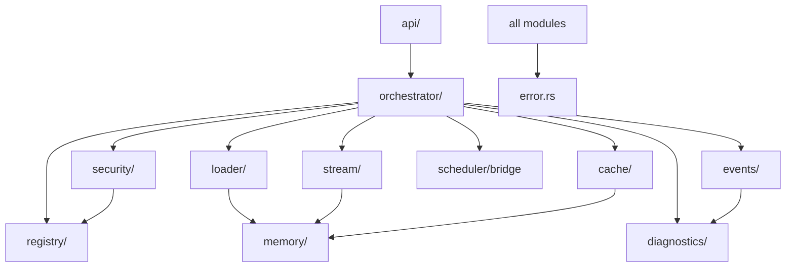

### 19.3 Cargo.toml Dependencies

```toml
[package]
name = "ldfx-runtime"
version = "1.0.0"
edition = "2021"

[dependencies]
# Core LDFX
ldfx-core = { path = "../ldfx-core", version = "1.0.0" }

# Async runtime
tokio = { version = "1", features = ["full"] }

# Serialization
serde = { version = "1", features = ["derive"] }
serde_json = "1"
serde_yaml = "0.9"

# Hashing and security
sha2 = "0.10"
hex = "0.4"

# WASM runtime
wasmtime = "18"

# Memory mapping
memmap2 = "0.9"

# Concurrent data structures
dashmap = "5"
parking_lot = "0.12"

# Tracing and observability
tracing = "0.1"
tracing-subscriber = { version = "0.3", features = ["json"] }

# UUID
uuid = { version = "1", features = ["v4"] }

# Image decoding
image = "0.25"

# Font parsing
ttf-parser = "0.21"

# XML parsing (safe subset)
quick-xml = "0.36"

# YAML parsing (safe subset)
serde_yaml = "0.9"

# SQLite
rusqlite = { version = "0.31", features = ["bundled"] }

# Error handling
thiserror = "1"
anyhow = "1"

# Semver
semver = "1"

# Time
chrono = { version = "0.4", features = ["serde"] }

[dev-dependencies]
criterion = { version = "0.5", features = ["html_reports"] }
tokio-test = "0.4"
tempfile = "3"
```

### 19.4 Trait Definitions

The Resource Manager defines the following traits for extensibility:

```
ResourceLoader trait:
    fn resource_type() -> ResourceType
    fn supported_mime_types() -> &[&str]
    fn load(path: VfsPath, vfs: &VfsApi) -> Future<Result<Bytes, LoadError>>

ResourceValidator trait:
    fn resource_type() -> ResourceType
    fn validate(bytes: &Bytes, descriptor: &ResourceDescriptor) -> Result<(), ValidationError>

ResourceDecoder trait:
    fn resource_type() -> ResourceType
    fn decode(bytes: Bytes) -> Result<Box<dyn DecodedResource>, DecodeError>

ResourceOptimizer trait:
    fn resource_type() -> ResourceType
    fn optimize(resource: Box<dyn DecodedResource>) -> Result<Box<dyn DecodedResource>, OptimizeError>

DecodedResource trait:
    fn resource_type() -> ResourceType
    fn memory_size() -> u64
    fn as_any() -> &dyn Any
```

---

## 20. Acceptance Criteria

### 20.1 Functional Completeness

| ID | Criterion | Verification |
|----|-----------|-------------|
| F-01 | All 27 resource types listed in Section 3 are loadable | Integration test per type |
| F-02 | Resource.load() returns a typed handle for every supported type | Unit test per type |
| F-03 | Resource.stream() works for all streaming-eligible types | Integration test |
| F-04 | Resource.prefetch() initiates background load at Background priority | Integration test |
| F-05 | Resource.reload() replaces cached entry with fresh load | Integration test |
| F-06 | Resource.exists() returns correct result for registered and unregistered resources | Unit test |
| F-07 | Resource.metadata() returns complete descriptor without triggering a load | Unit test |
| F-08 | Resource.dependencies() returns correct direct and transitive dependency lists | Unit test |
| F-09 | Resource.statistics() returns accurate per-resource and aggregate statistics | Integration test |
| F-10 | All 11 public API methods are implemented and documented | Code review |

### 20.2 Registry Correctness

| ID | Criterion | Verification |
|----|-----------|-------------|
| R-01 | All document resources are registered during boot before any load is permitted | Boot sequence test |
| R-02 | Registry lookup by ID is O(1) | Benchmark: < 0.1ms for 100,000 resources |
| R-03 | Registry lookup by path is O(1) | Benchmark: < 0.1ms for 100,000 resources |
| R-04 | Circular dependency detection rejects all cyclic graphs | Unit tests with 10 cycle patterns |
| R-05 | Topological sort produces valid ordering for all test dependency graphs | Unit test |
| R-06 | Reference counting is accurate under concurrent access | Stress test with 64 threads |
| R-07 | Namespace isolation prevents cross-namespace access | Security test |
| R-08 | Plugin resource registration and cleanup leave no orphaned entries | Integration test |

### 20.3 Loading Pipeline Correctness

| ID | Criterion | Verification |
|----|-----------|-------------|
| L-01 | Hash verification runs on every cache miss | Unit test: verify hash check called |
| L-02 | Hash verification failure zeroes the byte buffer | Unit test: inspect memory after failure |
| L-03 | Type validation runs after hash verification | Unit test: verify order |
| L-04 | Decode runs only after validation passes | Unit test: verify order |
| L-05 | Dependencies are loaded before the dependent resource | Integration test |
| L-06 | Fallback resource is attempted on integrity failure | Integration test |
| L-07 | Fallback resource is attempted on validation failure | Integration test |
| L-08 | Fallback resource is attempted on decode failure | Integration test |
| L-09 | Permission check runs before any I/O | Unit test: verify no VFS call on permission failure |
| L-10 | Cache hit path skips VFS read, hash check, and decode | Integration test: verify no VFS call on hit |

### 20.4 Security Requirements

| ID | Criterion | Verification |
|----|-----------|-------------|
| S-01 | No resource is delivered to a consumer without passing hash verification | Code audit + unit test |
| S-02 | Integrity violation emits security event synchronously before returning error | Unit test |
| S-03 | Plugin cannot access document namespace resources directly | Security test |
| S-04 | Plugin cannot register resources at document namespace paths | Security test |
| S-05 | Path traversal attempts return ResourceNotFoundError without VFS access | Security test |
| S-06 | Image bomb detection rejects images exceeding dimension limits | Security test |
| S-07 | WASM modules with unapproved imports are rejected | Security test |
| S-08 | XML XXE processing is disabled | Security test |
| S-09 | CSS external URL references are rejected | Security test |
| S-10 | All security events are logged with full context | Log inspection test |

### 20.5 Performance Requirements

| ID | Criterion | Verification |
|----|-----------|-------------|
| P-01 | Cache hit latency < 1ms p99 | Benchmark |
| P-02 | Small resource load (< 64KB) < 10ms p95 | Benchmark |
| P-03 | Medium resource load (< 1MB) < 50ms p95 | Benchmark |
| P-04 | Large resource first-byte (streaming) < 100ms | Benchmark |
| P-05 | Boot-time registration of 1,000 resources < 20ms | Benchmark |
| P-06 | Cache hit ratio ≥ 90% for warm document session | Integration test with realistic access pattern |
| P-07 | 8 concurrent loads complete without serialization | Stress test |
| P-08 | Stream throughput ≥ 50MB/s for local ZIP container | Benchmark |
| P-09 | Memory overhead per registered resource < 512 bytes | Memory profiling test |
| P-10 | Resource Manager memory usage stays within configured budget | Stress test with memory pressure |

### 20.6 Reliability Requirements

| ID | Criterion | Verification |
|----|-----------|-------------|
| RL-01 | No resource load failure crashes the runtime | Stress test with all failure modes |
| RL-02 | Every failure produces a structured ResourceError with full context | Unit test per error type |
| RL-03 | Stream resume works after simulated I/O failure | Integration test |
| RL-04 | Cache corruption is detected and the entry is evicted and reloaded | Corruption test |
| RL-05 | Low-memory mode activates correctly and recovers when pressure clears | Memory pressure test |
| RL-06 | Cancelled loads release all allocated memory | Memory profiling after cancellation |
| RL-07 | Plugin unregistration releases all plugin resources without leaks | Memory profiling test |
| RL-08 | Document session shutdown completes within 500ms regardless of active loads | Shutdown test |
| RL-09 | Registry remains consistent under concurrent registration and lookup | Concurrent stress test |
| RL-10 | All 20 lifecycle state transitions are reachable and correct | State machine coverage test |

---

*End of LDFX Phase 2 — Part 2.3: Resource Manager Architecture Specification*

---

**Document**: LDFX-P2-2.3-RM  
**Version**: 1.0.0  
**Status**: Complete  
**Next**: LDFX-P2-2.4 — Runtime Engine Specification
