# LDFX Phase 2 — Part 2.4: Runtime Engine Specification

**Document ID**: LDFX-P2-2.4-ENGINE  
**Version**: 1.0.0  
**Status**: Official Specification  
**Classification**: Architecture — Internal  
**Depends On**:
- LDFX-P2-2.1 (Runtime Foundation — Kernel, Boot, Lifecycle, Services)
- LDFX-P2-2.2 (Virtual File System)
- LDFX-P2-2.3 (Resource Manager)
- LDFX-P1 (File Format — Manifest, Pages, Assets, Security)

**Consumed By**:
- LDFX-P2-2.5 (Runtime API — the Engine is what the API exposes)
- LDFX-P2-2.6 (Event System — the Engine is the primary event emitter)
- LDFX-P2-2.7 (Security Runtime — the Engine is the primary enforcement target)
- LDFX-P2-2.8 (Plugin Runtime — plugins execute inside the Engine)

**Audience**: Runtime Implementors, Renderer Developers, Plugin Authors  
**Stability**: Stable — all interfaces are binding

---

## Table of Contents

1. [Introduction](#1-introduction)
2. [Engine Architecture](#2-engine-architecture)
3. [Content Model](#3-content-model)
4. [Page Pipeline](#4-page-pipeline)
5. [Layout Engine](#5-layout-engine)
6. [Script Engine](#6-script-engine)
7. [Render Pipeline](#7-render-pipeline)
8. [Navigation Engine](#8-navigation-engine)
9. [Document Session](#9-document-session)
10. [Engine Services](#10-engine-services)
11. [Engine Lifecycle](#11-engine-lifecycle)
12. [Engine Events](#12-engine-events)
13. [Security Enforcement](#13-security-enforcement)
14. [Performance](#14-performance)
15. [Error Handling](#15-error-handling)
16. [Rust Module Layout](#16-rust-module-layout)
17. [Acceptance Criteria](#17-acceptance-criteria)

---

## 1. Introduction

### 1.1 What the Runtime Engine Is

The Runtime Foundation (LDFX-P2-2.1) defines the kernel, boot sequence, lifecycle, and services. The Virtual File System (LDFX-P2-2.2) provides raw byte access to the ZIP container. The Resource Manager (LDFX-P2-2.3) loads and caches typed resources. The Runtime API (LDFX-P2-2.5) exposes a public interface to consumers.

The **Runtime Engine** is the layer that sits between all of these. It is the execution core — the component that takes loaded resources and turns them into a running, interactive document session. It owns:

- The **content model** — the in-memory representation of a document's pages, blocks, and assets
- The **page pipeline** — the process of transforming raw page JSON into a rendered content tree
- The **layout engine** — the rules that determine how content is positioned and sized
- The **script engine** — the execution environment for JavaScript/WASM scripts embedded in pages
- The **render pipeline** — the process of producing a visual output from a laid-out content tree
- The **navigation engine** — the rules for moving between pages and tracking history
- The **document session** — the stateful context of an active user interaction with a document

Without the Runtime Engine, the runtime can open, validate, and cache a document — but it cannot execute it. The Engine is what makes a `.ldfx` document live.

### 1.2 Design Goals

| Goal | Description |
|------|-------------|
| **Separation of concerns** | The Engine does not perform I/O, security checks, or API dispatch — it delegates those to the layers below and above |
| **Content-model-first** | All rendering and layout decisions are driven by the content model, never by raw bytes |
| **Deterministic output** | Given the same content model and the same viewport, the Engine always produces the same layout |
| **Incremental processing** | Pages are processed on demand; the Engine never processes the entire document upfront |
| **Plugin-extensible** | Every pipeline stage has defined extension points where plugins can inject behavior |
| **Offline-complete** | The Engine operates entirely from the local content model; no network access is required |
| **Frame-budget aware** | All rendering work is scheduled within a 16ms frame budget (60fps target) |
| **Testable in isolation** | Every Engine component can be tested with a mock content model, without a real document |

### 1.3 Engine Position in the Runtime Stack

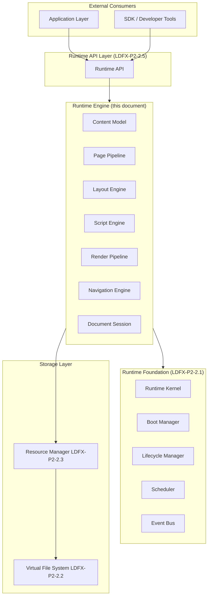

### 1.4 What the Engine Does Not Own

The Engine has strict boundaries. It does not own:

- **File I/O** — delegated to the VFS and Resource Manager
- **Security validation** — delegated to the Security Manager (LDFX-P2-2.7)
- **Plugin sandboxing** — delegated to the Plugin Runtime (LDFX-P2-2.8)
- **API dispatch** — delegated to the Runtime API Layer (LDFX-P2-2.5)
- **Event routing** — delegated to the Event Bus (LDFX-P2-2.1)
- **Persistence** — delegated to the Storage Service (LDFX-P2-2.1)
- **Boot sequencing** — delegated to the Boot Manager (LDFX-P2-2.1)

The Engine receives already-loaded, already-validated resources from the Resource Manager. It processes them into a content model, lays them out, executes scripts, and produces render output. It emits events to the Event Bus. It reads and writes session state through the State Service. It calls plugins through the Plugin Runtime interface. It never reaches below the Resource Manager.

### 1.5 Relationship to Phase 1

Phase 1 defines the on-disk format of a `.ldfx` document — the JSON schemas for pages, assets, manifests, and metadata. The Runtime Engine is the consumer of those schemas. Every JSON structure defined in Phase 1 has a corresponding in-memory type in the Engine's content model. The Engine's content model is the authoritative in-memory representation of the Phase 1 on-disk format.

---

## 2. Engine Architecture

### 2.1 Component Overview

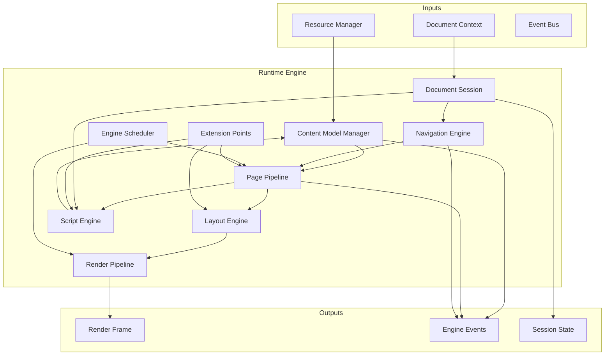

### 2.2 Component Responsibilities

| Component | Responsibility |
|-----------|---------------|
| Content Model Manager | Owns the in-memory document tree; manages node lifecycle |
| Page Pipeline | Transforms raw page JSON into a typed content tree |
| Layout Engine | Computes position and size for every content node |
| Script Engine | Executes JavaScript/WASM scripts; manages execution contexts |
| Render Pipeline | Produces render frames from laid-out content trees |
| Navigation Engine | Manages page transitions, history, and deep links |
| Document Session | Holds all mutable state for the active user session |
| Engine Scheduler | Schedules pipeline work within the frame budget |
| Extension Points | Defined hooks where plugins can inject behavior |

### 2.3 Data Flow

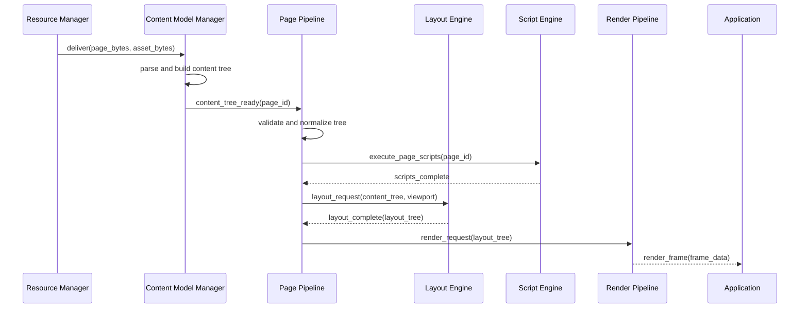

### 2.4 Engine Initialization

The Engine is initialized by the Boot Manager during Phase 13 of the boot sequence (Runtime Init). At initialization the Engine:

1. Receives the `DocumentContext` from the Runtime Kernel
2. Initializes the Content Model Manager with the document's page index and asset index
3. Initializes the Navigation Engine with the entry page
4. Initializes the Script Engine with the document's declared script capabilities
5. Initializes the Document Session with a new session ID
6. Registers all extension points with the Plugin Runtime
7. Emits `EngineReady` to the Event Bus

The Engine does not load any page content during initialization. Page loading is lazy — triggered by the first navigation request.

### 2.5 Engine Shutdown

During shutdown the Engine:

1. Receives `ShutdownRequested` from the Lifecycle Manager
2. Cancels all in-progress pipeline work
3. Flushes the Script Engine (allows scripts to complete their current microtask)
4. Saves session state to the State Service
5. Releases all content model nodes
6. Emits `EngineShutdown` to the Event Bus

---

## 3. Content Model

### 3.1 Overview

The Content Model is the Engine's in-memory representation of a document's structure and content. It is a typed tree of nodes. Every node corresponds to a JSON object defined in the Phase 1 page content schema. The Content Model Manager owns this tree and is the single authority for all content model mutations.

The content model is **not** a DOM. It is not a rendering tree. It is a semantic representation of the document's content — what the content *is*, not how it *looks*. The Layout Engine transforms the content model into a layout tree. The Render Pipeline transforms the layout tree into pixels.

### 3.2 Node Type Hierarchy

```mermaid
graph TD
    NODE[ContentNode base] --> DOC[DocumentNode]
    NODE --> PAGE[PageNode]
    NODE --> BLOCK[BlockNode]
    NODE --> INLINE[InlineNode]
    NODE --> LEAF[LeafNode]

    BLOCK --> SECTION[SectionBlock]
    BLOCK --> HEADING[HeadingBlock]
    BLOCK --> PARAGRAPH[ParagraphBlock]
    BLOCK --> LIST[ListBlock]
    BLOCK --> TABLE[TableBlock]
    BLOCK --> CODE[CodeBlock]
    BLOCK --> QUOTE[QuoteBlock]
    BLOCK --> CALLOUT[CalloutBlock]
    BLOCK --> DIVIDER[DividerBlock]
    BLOCK --> EMBED[EmbedBlock]
    BLOCK --> PLUGIN_BLOCK[PluginBlock]
    BLOCK --> AI_BLOCK[AiBlock]

    INLINE --> TEXT[TextInline]
    INLINE --> LINK[LinkInline]
    INLINE --> BOLD[BoldInline]
    INLINE --> ITALIC[ItalicInline]
    INLINE --> CODE_INLINE[CodeInline]
    INLINE --> ANNOTATION[AnnotationInline]

    LEAF --> IMAGE[ImageLeaf]
    LEAF --> VIDEO[VideoLeaf]
    LEAF --> AUDIO[AudioLeaf]
    LEAF --> FORMULA[FormulaLeaf]
    LEAF --> CHART[ChartLeaf]
    LEAF --> INTERACTIVE[InteractiveLeaf]
```

### 3.3 ContentNode Base

Every node in the content model shares a common base:

| Field | Type | Description |
|-------|------|-------------|
| `node_id` | UUID string | Unique identifier within the document |
| `node_type` | `NodeType` enum | The specific node type |
| `parent_id` | `Option<UUID>` | Parent node ID (None for root) |
| `children` | `Vec<NodeId>` | Ordered child node IDs |
| `attributes` | `HashMap<String, JsonValue>` | Type-specific attributes |
| `metadata` | `NodeMetadata` | Source location, version, flags |
| `state` | `NodeState` | Current rendering state |

`NodeState` tracks whether the node is: `Pending`, `Loaded`, `Rendered`, `Error`, or `Hidden`.

### 3.4 PageNode

A `PageNode` is the root of a single page's content tree. It maps directly to a `pages/{page_id}/content.json` entry in the document.

| Field | Type | Description |
|-------|------|-------------|
| `page_id` | string | Matches the page ID in `pages/index.json` |
| `title` | string | Page title |
| `layout_id` | string | References a layout in `pages/{page_id}/layout.json` |
| `theme_override` | `Option<ThemeId>` | Page-level theme override |
| `script_refs` | `Vec<ScriptRef>` | Scripts to execute for this page |
| `asset_refs` | `Vec<AssetRef>` | Assets required by this page |
| `blocks` | `Vec<NodeId>` | Top-level block node IDs |
| `annotations` | `Vec<AnnotationRef>` | Annotation references |
| `load_state` | `PageLoadState` | `Unloaded`, `Loading`, `Ready`, `Error` |

### 3.5 BlockNode Types

#### SectionBlock
Groups related blocks under a semantic section. Maps to `{ "type": "section" }` in page JSON.

| Field | Type | Description |
|-------|------|-------------|
| `level` | `u8` | Nesting depth (1–6) |
| `label` | `Option<string>` | Section label for navigation |
| `collapsible` | `bool` | Whether the section can be collapsed |
| `collapsed` | `bool` | Current collapsed state (mutable) |

#### HeadingBlock
A document heading. Maps to `{ "type": "heading", "level": 1–6 }`.

| Field | Type | Description |
|-------|------|-------------|
| `level` | `u8` | Heading level 1–6 |
| `text` | `Vec<InlineNode>` | Inline content |
| `anchor` | `Option<string>` | Deep-link anchor ID |
| `numbered` | `bool` | Whether to show section number |

#### ParagraphBlock
A block of inline text. Maps to `{ "type": "paragraph" }`.

| Field | Type | Description |
|-------|------|-------------|
| `text` | `Vec<InlineNode>` | Inline content |
| `alignment` | `TextAlignment` | `Left`, `Center`, `Right`, `Justify` |

#### ListBlock
An ordered or unordered list. Maps to `{ "type": "list" }`.

| Field | Type | Description |
|-------|------|-------------|
| `list_type` | `ListType` | `Ordered`, `Unordered`, `Task` |
| `items` | `Vec<ListItem>` | List items (each may contain inline nodes or nested lists) |
| `start_index` | `u32` | Starting number for ordered lists |

#### TableBlock
A data table. Maps to `{ "type": "table" }`.

| Field | Type | Description |
|-------|------|-------------|
| `columns` | `Vec<ColumnDef>` | Column definitions (width, alignment, header) |
| `rows` | `Vec<TableRow>` | Row data |
| `has_header` | `bool` | Whether the first row is a header |
| `caption` | `Option<Vec<InlineNode>>` | Table caption |

#### CodeBlock
A code listing. Maps to `{ "type": "code" }`.

| Field | Type | Description |
|-------|------|-------------|
| `language` | `Option<string>` | Programming language for syntax highlighting |
| `code` | `string` | Raw code text |
| `line_numbers` | `bool` | Whether to show line numbers |
| `highlight_lines` | `Vec<u32>` | Lines to highlight |
| `filename` | `Option<string>` | Optional filename label |

#### EmbedBlock
An embedded resource (image, video, audio, iframe). Maps to `{ "type": "embed" }`.

| Field | Type | Description |
|-------|------|-------------|
| `asset_ref` | `AssetRef` | Reference to the embedded asset |
| `caption` | `Option<Vec<InlineNode>>` | Caption text |
| `alt_text` | `Option<string>` | Accessibility alt text |
| `width` | `Option<DimensionSpec>` | Width constraint |
| `height` | `Option<DimensionSpec>` | Height constraint |
| `alignment` | `BlockAlignment` | `Left`, `Center`, `Right`, `Full` |

#### PluginBlock
A block rendered by a plugin. Maps to `{ "type": "plugin" }`.

| Field | Type | Description |
|-------|------|-------------|
| `plugin_id` | `string` | The plugin that owns this block |
| `block_type` | `string` | Plugin-defined block type identifier |
| `data` | `JsonValue` | Plugin-defined block data |
| `fallback` | `Option<Vec<BlockNode>>` | Fallback content if plugin unavailable |

#### AiBlock
A block whose content is generated by an AI model. Maps to `{ "type": "ai" }`.

| Field | Type | Description |
|-------|------|-------------|
| `model_id` | `string` | AI model to use for inference |
| `prompt` | `string` | Inference prompt |
| `context_refs` | `Vec<NodeId>` | Nodes to include as context |
| `output_type` | `AiOutputType` | `Text`, `Table`, `List`, `Code` |
| `cached_output` | `Option<Vec<BlockNode>>` | Previously generated output |
| `generation_state` | `AiGenerationState` | `Pending`, `Generating`, `Complete`, `Error` |

### 3.6 InlineNode Types

Inline nodes appear inside block nodes that contain text content.

| Type | Fields | Description |
|------|--------|-------------|
| `TextInline` | `text: string, style: TextStyle` | Plain styled text |
| `LinkInline` | `text: Vec<InlineNode>, target: LinkTarget` | Hyperlink (internal or external) |
| `BoldInline` | `children: Vec<InlineNode>` | Bold text wrapper |
| `ItalicInline` | `children: Vec<InlineNode>` | Italic text wrapper |
| `CodeInline` | `code: string` | Inline code span |
| `AnnotationInline` | `annotation_id: string, children: Vec<InlineNode>` | Annotated text span |

`LinkTarget` is a discriminated union:
- `{ kind: "page", page_id: string, anchor?: string }` — internal page link
- `{ kind: "anchor", anchor: string }` — same-page anchor link
- `{ kind: "external", url: string }` — external URL (requires `network_read` permission)

### 3.7 LeafNode Types

Leaf nodes have no children. They represent atomic content elements.

| Type | Key Fields | Description |
|------|-----------|-------------|
| `ImageLeaf` | `asset_ref, alt_text, width?, height?` | Raster or vector image |
| `VideoLeaf` | `asset_ref, poster_ref?, autoplay, loop, controls` | Video asset |
| `AudioLeaf` | `asset_ref, autoplay, loop, controls` | Audio asset |
| `FormulaLeaf` | `formula: string, format: "latex"\|"mathml"` | Mathematical formula |
| `ChartLeaf` | `data: JsonValue, chart_type: string, options: JsonValue` | Data visualization |
| `InteractiveLeaf` | `plugin_id, component_id, props: JsonValue` | Plugin-rendered interactive element |

### 3.8 Content Model Mutations

The content model is **immutable by default**. Mutations are only permitted through the Content Model Manager's mutation API, and only in specific circumstances:

| Mutation Type | Permitted By | Trigger |
|---------------|-------------|---------|
| Node state update | Engine internal | Load state changes |
| Collapsed state toggle | Script Engine | User interaction |
| AiBlock output update | AI Service | Inference completion |
| PluginBlock data update | Plugin Runtime | Plugin data push |
| Annotation add/remove | Annotation Service | User annotation action |
| Form state update | Script Engine | User form input |

All mutations are recorded in the mutation log for undo/redo support and for developer mode inspection.

### 3.9 Content Model Ownership

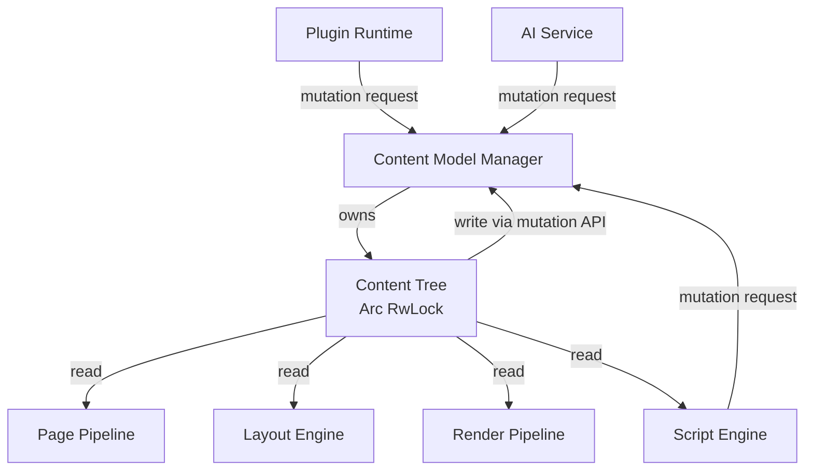

No component may hold a write lock on the content tree for more than 5ms. All mutations are applied atomically. Partial mutations are not permitted — either the full mutation succeeds or it is rolled back.


---

## 4. Page Pipeline

### 4.1 Overview

The Page Pipeline is the ordered sequence of processing stages that transforms a raw page JSON entry (loaded by the Resource Manager) into a fully populated, script-executed, layout-ready content tree. Every page passes through the same pipeline. The pipeline is stateless — the same input always produces the same output.

### 4.2 Pipeline Stages

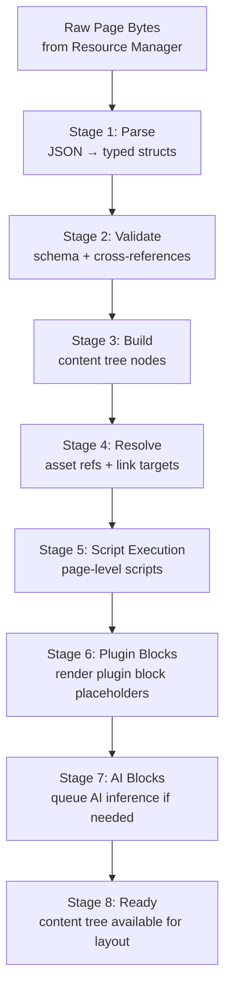

### 4.3 Stage Definitions

#### Stage 1 — Parse

Deserializes the raw JSON bytes into typed Rust structs using the Phase 1 page content schema. Uses `serde_json` with strict unknown-field rejection in production mode and tolerant parsing in developer mode.

**Input**: `Vec<u8>` (raw JSON bytes)  
**Output**: `RawPageContent` (typed but unvalidated struct)  
**Errors**: `ParseError::InvalidJson`, `ParseError::SchemaMismatch`  
**Timeout**: 20ms  
**On failure**: `PageLoadState::Error`, emit `PageLoadFailed`

#### Stage 2 — Validate

Validates the parsed content against the Phase 1 content schema rules:
- All required fields are present
- All node IDs are unique within the page
- All asset references exist in the document's asset index
- All internal link targets reference valid page IDs or anchors
- All plugin block `plugin_id` values reference registered plugins
- All AI block `model_id` values reference declared AI models

**Input**: `RawPageContent`  
**Output**: `ValidatedPageContent`  
**Errors**: `ValidationError::MissingField`, `ValidationError::UnknownReference`, `ValidationError::DuplicateNodeId`  
**Timeout**: 10ms  
**On failure**: `PageLoadState::Error`, emit `PageValidationFailed`

#### Stage 3 — Build

Constructs the typed content tree nodes from the validated content. Allocates `ContentNode` instances, assigns node IDs, establishes parent-child relationships, and registers all nodes with the Content Model Manager.

**Input**: `ValidatedPageContent`  
**Output**: `PageNode` (root of the content tree)  
**Errors**: `BuildError::AllocationFailed`, `BuildError::CyclicReference`  
**Timeout**: 30ms  
**On failure**: Deallocate all partially built nodes, emit `PageBuildFailed`

#### Stage 4 — Resolve

Resolves all references in the content tree:
- Asset references → `ResourceHandle` (triggers Resource Manager load if not cached)
- Internal link targets → validated `PageNode` references
- Anchor targets → validated node IDs within the document
- Plugin block types → `PluginInfo` from the Plugin Registry

Asset loading in this stage is asynchronous. The pipeline waits for all critical assets (images in the viewport, fonts) before proceeding. Non-critical assets (off-screen images, audio) are resolved lazily.

**Input**: `PageNode` (unresolved)  
**Output**: `PageNode` (resolved)  
**Errors**: `ResourceError::NotFound`, `ResourceError::IntegrityFailure`  
**Timeout**: 300ms (includes asset loading)  
**On failure**: Unresolved assets show error placeholders; pipeline continues

#### Stage 5 — Script Execution

Executes all page-level scripts declared in `script_refs`. Scripts run in the Script Engine within their execution context. Scripts may:
- Read the content tree (read-only)
- Request content model mutations through the mutation API
- Subscribe to events
- Call the Runtime API

Scripts may not block the pipeline. If a script does not complete within its time budget, it is suspended and the pipeline continues. The script resumes on the next event loop tick.

**Input**: `PageNode` (resolved), `ScriptRef[]`  
**Output**: `PageNode` (potentially mutated by scripts)  
**Errors**: `ScriptError::ExecutionFailed`, `ScriptError::Timeout`  
**Timeout**: 50ms per script, 200ms total  
**On failure**: Script marked failed, pipeline continues without it

#### Stage 6 — Plugin Blocks

For each `PluginBlock` in the content tree, the pipeline calls the owning plugin's `render_block()` method through the Plugin Runtime. The plugin returns either:
- A `PluginRenderResult::Content(Vec<BlockNode>)` — replaces the plugin block's placeholder with real content
- A `PluginRenderResult::Pending` — the plugin is not ready; show a loading placeholder
- A `PluginRenderResult::Error(message)` — show the fallback content if defined, otherwise an error placeholder

**Input**: `PageNode` (with PluginBlock nodes)  
**Output**: `PageNode` (PluginBlock nodes replaced or marked pending)  
**Errors**: `PluginError::NotReady`, `PluginError::RenderFailed`  
**Timeout**: 100ms per plugin block  
**On failure**: Show fallback content or error placeholder; pipeline continues

#### Stage 7 — AI Blocks

For each `AiBlock` in the content tree:
- If `cached_output` is present and valid → use cached output, skip inference
- If inference is needed → queue an inference request with the AI Service
- Set `generation_state` to `Pending` and show a loading placeholder
- When inference completes, the AI Service calls the Content Model Manager mutation API to update the block

AI inference is always asynchronous. The pipeline never waits for AI inference to complete. The page becomes available for layout and rendering with AI blocks in `Pending` state.

**Input**: `PageNode` (with AiBlock nodes)  
**Output**: `PageNode` (AiBlock nodes queued or using cached output)  
**Errors**: `AiError::ModelNotReady`, `AiError::InferenceFailed`  
**Timeout**: None (async; pipeline does not wait)

#### Stage 8 — Ready

The content tree is fully built, resolved, and script-executed. The pipeline emits `PageReady` and makes the content tree available to the Layout Engine.

**Output**: `PageLoadState::Ready`, emit `PageReady(page_id, load_time_ms)`

### 4.4 Pipeline Execution Model

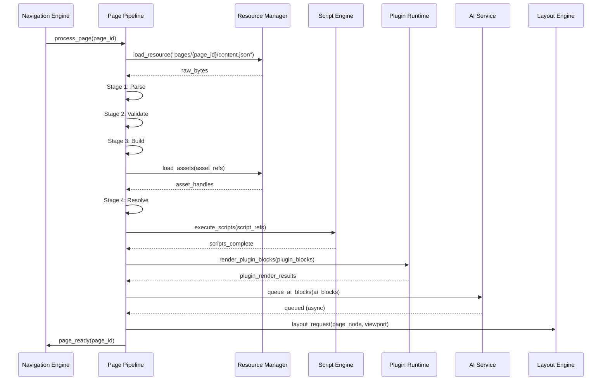

### 4.5 Pipeline Cancellation

The pipeline can be cancelled at any stage. Cancellation is triggered when:
- The user navigates away before the page finishes loading
- The Lifecycle Manager transitions to `Closing` or `Background`
- A timeout is exceeded at a fatal stage

On cancellation:
1. The current stage is interrupted at its next cooperative yield point
2. All allocated nodes are released
3. All pending asset loads are cancelled via the Resource Manager
4. `PageLoadCancelled` event is emitted

### 4.6 Pipeline Extension Points

Plugins may register handlers at the following extension points:

| Extension Point | When Called | Plugin Can |
|----------------|-------------|-----------|
| `AfterParse` | After Stage 1 | Inspect raw content |
| `AfterValidate` | After Stage 2 | Add custom validation |
| `AfterBuild` | After Stage 3 | Add synthetic nodes |
| `AfterResolve` | After Stage 4 | Modify resolved references |
| `BeforeLayout` | Before Layout Engine | Modify content tree |

Extension point handlers must complete within 10ms. Handlers that exceed this limit are skipped with a warning.

---

## 5. Layout Engine

### 5.1 Overview

The Layout Engine takes a fully processed content tree (output of the Page Pipeline) and a viewport specification, and produces a **layout tree** — a parallel tree where every node has a computed position, size, and rendering properties. The layout tree is the input to the Render Pipeline.

The Layout Engine is deterministic. Given the same content tree and the same viewport, it always produces the same layout tree.

### 5.2 Layout Model

LDFX uses a **block-flow layout model** as its primary layout system, with support for grid and flex layouts for specific block types. The model is inspired by CSS block formatting contexts but is defined independently of CSS.

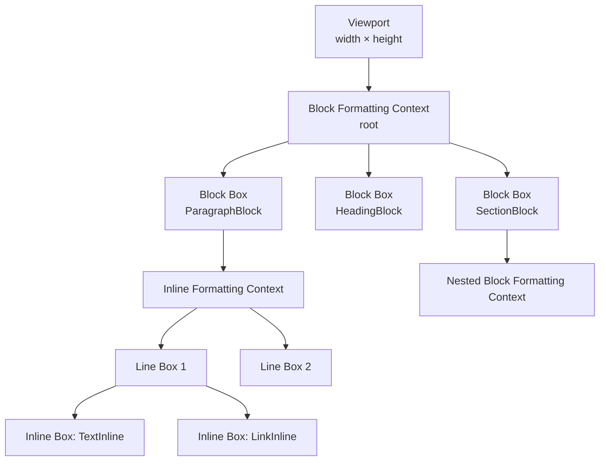

### 5.3 Layout Tree Node

Every node in the layout tree corresponds to a node in the content tree.

| Field | Type | Description |
|-------|------|-------------|
| `node_id` | UUID | Matches the content tree node ID |
| `node_type` | `LayoutNodeType` | Block, Inline, Line, Replaced |
| `x` | `f32` | X position relative to parent (px) |
| `y` | `f32` | Y position relative to parent (px) |
| `width` | `f32` | Computed width (px) |
| `height` | `f32` | Computed height (px) |
| `margin` | `EdgeSizes` | Computed margins (top, right, bottom, left) |
| `padding` | `EdgeSizes` | Computed padding |
| `border` | `EdgeSizes` | Computed border widths |
| `overflow` | `OverflowMode` | `Visible`, `Hidden`, `Scroll`, `Auto` |
| `visibility` | `Visibility` | `Visible`, `Hidden`, `Collapsed` |
| `z_index` | `i32` | Stacking order |
| `children` | `Vec<LayoutNodeId>` | Ordered child layout nodes |
| `paint_layers` | `Vec<PaintLayer>` | Background, border, shadow layers |

### 5.4 Layout Algorithm

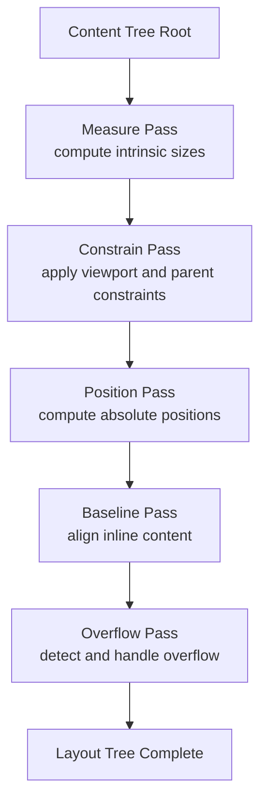

**Measure Pass**: Computes the intrinsic (unconstrained) size of every node bottom-up. Leaf nodes report their natural size (image dimensions, text metrics). Parent nodes aggregate child sizes.

**Constrain Pass**: Applies constraints top-down. The viewport constrains the root. Each parent constrains its children based on its own constrained size and the layout rules for its block type.

**Position Pass**: Computes the absolute position of every node relative to its containing block. Block nodes stack vertically. Inline nodes flow horizontally within line boxes.

**Baseline Pass**: Aligns inline nodes within line boxes to a common baseline. Handles mixed font sizes and replaced elements (images inline with text).

**Overflow Pass**: Detects nodes whose content exceeds their constrained size. Applies the node's `overflow` setting. Creates scroll containers where needed.

### 5.5 Layout Rules by Block Type

| Block Type | Layout Rule |
|------------|-------------|
| `SectionBlock` | Block formatting context; children stack vertically |
| `HeadingBlock` | Block box; single line or wrapping inline content |
| `ParagraphBlock` | Inline formatting context; text wraps to line boxes |
| `ListBlock` | Block formatting context; items stack vertically with markers |
| `TableBlock` | Table formatting context; fixed or auto column widths |
| `CodeBlock` | Block box; monospace font; horizontal scroll on overflow |
| `EmbedBlock` | Replaced block; size from asset dimensions or explicit spec |
| `PluginBlock` | Block box; size from plugin render result or explicit spec |
| `AiBlock` | Block box; size from generated content or loading placeholder |

### 5.6 Viewport and Responsive Layout

The viewport is defined by the Application Layer and passed to the Layout Engine at layout time. The Engine supports responsive layout through **breakpoints** declared in the page's layout JSON:

| Breakpoint | Width Range | Layout Mode |
|------------|-------------|-------------|
| `xs` | 0–479px | Single column, full width |
| `sm` | 480–767px | Single column, padded |
| `md` | 768–1023px | Two column optional |
| `lg` | 1024–1439px | Multi-column |
| `xl` | 1440px+ | Wide layout with max-width |

When the viewport changes (window resize, zoom), the Layout Engine re-runs the full layout algorithm. Layout re-runs are debounced — multiple viewport changes within 16ms are coalesced into a single layout pass.

### 5.7 Layout Caching

Layout results are cached per `(page_id, viewport_hash)`. If the same page is requested at the same viewport size, the cached layout tree is returned without re-running the algorithm.

Cache invalidation triggers:
- Content tree mutation (any node change)
- Viewport size change
- Theme change (affects font metrics and spacing)
- Locale change (affects text direction and line breaking)

---

## 6. Script Engine

### 6.1 Overview

The Script Engine manages the execution of JavaScript and WASM scripts embedded in document pages. It provides each script with an isolated execution context, injects the `LDF` Runtime API global, enforces time budgets, and handles errors without crashing the Engine.

### 6.2 Execution Context

Each script runs in its own **execution context**. An execution context is:
- An isolated JavaScript environment (V8 context or QuickJS context)
- Injected with the `LDF` global object (the Runtime API)
- Bound to a specific page (scripts cannot access other pages' content trees)
- Subject to the capabilities declared in the document manifest for that script

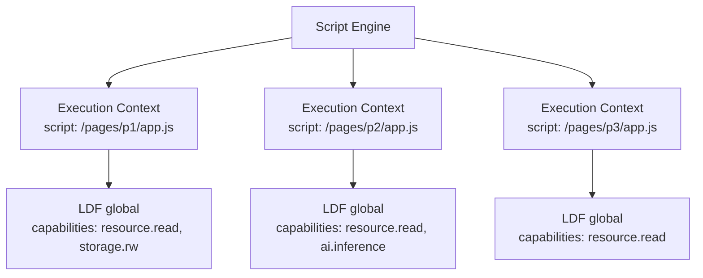

### 6.3 Script Lifecycle

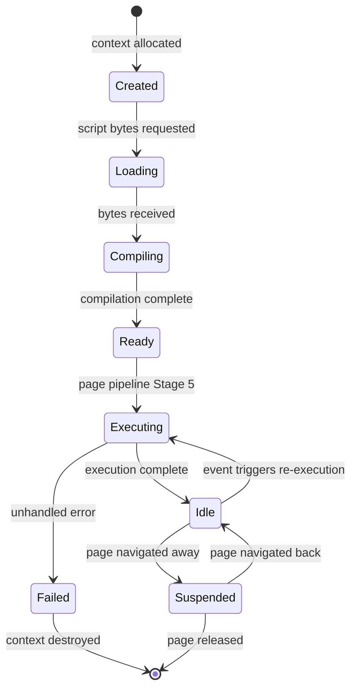

### 6.4 Script Time Budget

Scripts are subject to strict time budgets enforced by the Engine Scheduler:

| Budget Type | Limit | On Exceeded |
|-------------|-------|-------------|
| Initial execution (page load) | 50ms | Script suspended, warning logged |
| Event handler execution | 10ms | Handler suspended, warning logged |
| Async callback execution | 20ms | Callback suspended, warning logged |
| Total CPU time per session | 5 minutes | Script terminated, `ScriptCpuLimitError` |

Time budgets are enforced cooperatively. Scripts must yield at async boundaries (`await`, `setTimeout`, `requestAnimationFrame`). Scripts that do not yield are interrupted at the next safe interrupt point.

### 6.5 Script API Access

Scripts access the Runtime API through the `LDF` global object injected into their execution context. The `LDF` global is the same object defined in LDFX-P2-2.5. The Script Engine is responsible for:

- Injecting the `LDF` global at context creation
- Routing `LDF.*` calls through the API Gateway
- Enforcing the script's declared capabilities on every API call
- Returning typed results to the script

Scripts cannot access the content tree directly. They interact with the document through the Runtime API (`LDF.document`, `LDF.resource`, `LDF.storage`, etc.).

### 6.6 Script Error Handling

| Error Type | Response |
|------------|----------|
| Syntax error | Script not executed; `ScriptSyntaxError` logged |
| Runtime exception (caught) | Exception logged; script continues |
| Runtime exception (uncaught) | Script marked failed; page continues without it |
| Timeout | Script suspended; `ScriptTimeoutWarning` emitted |
| Permission error | `PermissionError` returned to script; script continues |
| Memory limit exceeded | Script terminated; `ScriptMemoryLimitError` emitted |

Script errors never crash the Engine. A page with a failed script is still rendered — the script's effects are simply absent.

### 6.7 Script Isolation

Scripts are isolated from each other and from the Engine:

- Scripts on different pages cannot communicate directly (only through `LDF.events`)
- Scripts cannot access the Engine's internal objects
- Scripts cannot access other scripts' execution contexts
- Scripts cannot modify the content tree directly (only through the mutation API)
- Scripts cannot access the host file system (only through `LDF.resource`)

---

## 7. Render Pipeline

### 7.1 Overview

The Render Pipeline takes a layout tree (output of the Layout Engine) and produces a **render frame** — the visual output that the Application Layer presents to the user. The Render Pipeline is the final stage of the Engine's processing chain.

The Render Pipeline is designed to be **renderer-agnostic**. It produces a structured render frame description (a display list) rather than pixels. The Application Layer is responsible for rasterizing the display list using its own rendering technology (WebView, native canvas, PDF renderer, etc.).

### 7.2 Render Frame

A render frame is a structured description of what to draw. It is a flat list of **draw commands** in painter's order (back to front).

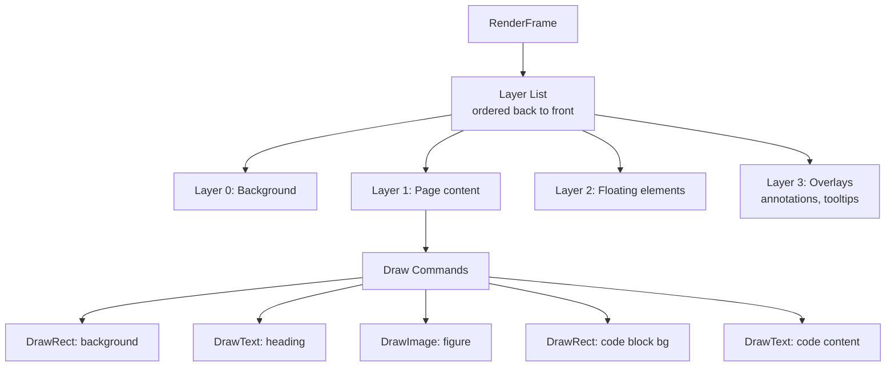

### 7.3 Draw Command Types

| Command | Fields | Description |
|---------|--------|-------------|
| `DrawRect` | `x, y, width, height, fill, border, radius` | Filled rectangle with optional border |
| `DrawText` | `x, y, text, font, size, color, decoration` | Text run with font and style |
| `DrawImage` | `x, y, width, height, asset_id, fit_mode` | Image from asset handle |
| `DrawVideo` | `x, y, width, height, asset_id, state` | Video frame placeholder |
| `DrawSvg` | `x, y, width, height, asset_id` | SVG vector graphic |
| `DrawPath` | `path_data, fill, stroke` | Arbitrary vector path |
| `DrawFormula` | `x, y, formula, format, size` | Rendered mathematical formula |
| `DrawPlugin` | `x, y, width, height, plugin_id, component_id, props` | Plugin-rendered component |
| `ClipRect` | `x, y, width, height` | Push clip region |
| `PopClip` | — | Pop clip region |
| `PushLayer` | `opacity, blend_mode` | Push compositing layer |
| `PopLayer` | — | Pop compositing layer |
| `ScrollContainer` | `x, y, width, height, scroll_x, scroll_y, content_width, content_height` | Scrollable region |

### 7.4 Render Pipeline Stages

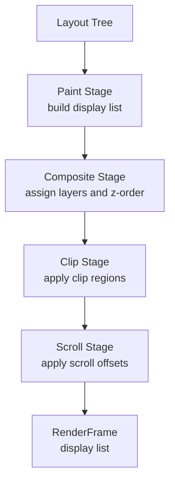

**Paint Stage**: Traverses the layout tree in document order and generates draw commands for each node. Each node type has a defined paint procedure.

**Composite Stage**: Groups draw commands into layers based on `z_index` and compositing properties. Assigns blend modes and opacity.

**Clip Stage**: Inserts `ClipRect`/`PopClip` commands around nodes with `overflow: hidden` or `overflow: scroll`.

**Scroll Stage**: Applies scroll offsets from the Document Session to scroll container nodes.

### 7.5 Frame Budget

The Render Pipeline targets a 16ms frame budget (60fps). Work is distributed:

| Stage | Budget |
|-------|--------|
| Layout Engine (if dirty) | 8ms |
| Paint Stage | 4ms |
| Composite + Clip + Scroll | 2ms |
| Frame delivery to Application | 2ms |

If the layout tree is clean (no mutations since last frame), the Layout Engine is skipped and the cached layout tree is used. In this case the full 16ms is available for the Paint and Composite stages.

### 7.6 Incremental Rendering

The Render Pipeline supports incremental rendering. When only part of the content tree changes (e.g., an AI block completes inference, a plugin updates its data), only the affected subtree is re-laid-out and re-painted. The rest of the frame is reused from the previous render.

Dirty tracking:
- Content model mutations mark affected nodes as dirty
- The Layout Engine re-runs only for dirty subtrees
- The Paint Stage re-generates draw commands only for dirty nodes
- Clean nodes reuse their cached draw commands

### 7.7 Render Output Formats

The Render Pipeline can produce output in multiple formats depending on the Application Layer's needs:

| Format | Use Case | Description |
|--------|----------|-------------|
| `DisplayList` | Interactive viewer | Structured draw commands for real-time rendering |
| `PdfPage` | PDF export | PDF-compatible draw commands |
| `HtmlFragment` | HTML export | Semantic HTML with inline styles |
| `AccessibilityTree` | Screen readers | Semantic accessibility tree |
| `PrintLayout` | Print | Print-optimized layout with page breaks |

The format is specified by the Application Layer when requesting a render frame.


---

## 8. Navigation Engine

### 8.1 Overview

The Navigation Engine manages all movement between pages within a document. It owns the navigation history, validates navigation targets, coordinates page loading with the Page Pipeline, and emits navigation events. It is the single authority for the document's current page state.

### 8.2 Navigation Target Resolution

A navigation target can be specified in four ways:

| Target Form | Example | Resolution |
|-------------|---------|------------|
| Page index | `{ index: 3 }` | Look up page ID at index 3 in the page index |
| Page ID | `{ page_id: "page_003" }` | Direct lookup in the page index |
| Anchor | `{ anchor: "section-2.1" }` | Find the page containing the anchor, then scroll to it |
| Path | `{ path: "/pages/chapter2/intro" }` | Resolve VFS path to page ID |

All target forms are resolved to a `(page_id, anchor?)` pair before navigation begins.

### 8.3 Navigation Flow

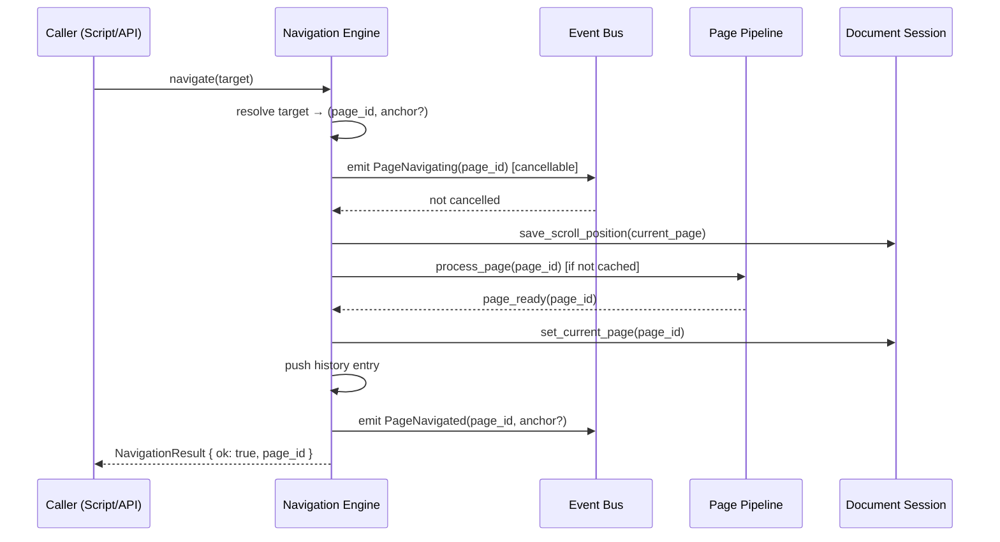

### 8.4 Navigation History

The Navigation Engine maintains a linear history stack for the current session.

| Field | Type | Description |
|-------|------|-------------|
| `entries` | `Vec<HistoryEntry>` | Ordered navigation history |
| `current_index` | `usize` | Index of the current page in history |
| `max_entries` | `usize` | Maximum history depth (default: 100) |

`HistoryEntry`:

| Field | Type | Description |
|-------|------|-------------|
| `page_id` | `string` | Page ID |
| `anchor` | `Option<string>` | Anchor within the page |
| `scroll_y` | `f32` | Scroll position at time of navigation |
| `navigated_at` | `DateTime` | Timestamp |

**Back navigation**: Decrements `current_index`, restores scroll position.  
**Forward navigation**: Increments `current_index`.  
**New navigation**: Truncates history after `current_index`, appends new entry.

### 8.5 Deep Linking

Deep links allow navigation to a specific location within a document using a structured reference. Deep link format:

```
ldfx://document/{document_id}/page/{page_id}[#anchor]
ldfx://document/{document_id}/index/{page_index}[#anchor]
```

Deep links are resolved by the Navigation Engine at session start (if the document was opened with a deep link) or at any point during a session via `LDF.navigation.goto({ path: "..." })`.

### 8.6 Navigation Guards

Navigation guards allow scripts and plugins to intercept and conditionally cancel navigation. A guard is registered via `LDF.events.on("PageNavigating", handler, { priority: "high" })`. The handler may call `event.cancel()` to prevent the navigation.

Use cases for navigation guards:
- Unsaved form data warning
- Confirmation before leaving a page
- Conditional navigation based on user state

Guards are executed synchronously. A guard that does not complete within 100ms is skipped.

---

## 9. Document Session

### 9.1 Overview

The Document Session holds all mutable state for the active user interaction with a document. It is created when the Engine initializes and destroyed when the Engine shuts down. It is the Engine's equivalent of the Runtime Foundation's `DocumentContext` — but focused on user-facing session state rather than structural document state.

### 9.2 Session State Fields

| Field | Type | Mutable | Description |
|-------|------|---------|-------------|
| `session_id` | UUID | No | Generated at Engine init |
| `current_page_id` | `Option<string>` | Yes | Currently displayed page |
| `navigation_history` | `NavigationHistory` | Yes | Full navigation history |
| `scroll_positions` | `HashMap<page_id, f32>` | Yes | Per-page scroll position |
| `form_state` | `HashMap<form_id, JsonValue>` | Yes | Form input state |
| `collapsed_sections` | `HashSet<node_id>` | Yes | Collapsed section node IDs |
| `annotation_drafts` | `Vec<AnnotationDraft>` | Yes | Unsaved annotation drafts |
| `selection` | `Option<ContentSelection>` | Yes | Current text selection |
| `zoom_level` | `f32` | Yes | Current zoom factor (default: 1.0) |
| `active_theme` | `ThemeId` | Yes | Current theme (may differ from document default) |
| `active_locale` | `BCP47` | Yes | Current locale |
| `plugin_state` | `HashMap<plugin_id, JsonValue>` | Yes | Per-plugin session state |
| `ai_cache` | `HashMap<block_id, AiOutput>` | Yes | Cached AI inference results |
| `interaction_count` | `u64` | Yes | Total user interactions this session |
| `last_interaction_at` | `Option<DateTime>` | Yes | Last user interaction timestamp |

### 9.3 Session Persistence

Session state is persisted to the State Service at defined checkpoints:

| Checkpoint | Trigger | State Saved |
|------------|---------|-------------|
| Page navigation | Every navigation | `scroll_positions`, `current_page_id` |
| Form change | Every form input | `form_state` |
| Section collapse | Toggle | `collapsed_sections` |
| Annotation draft | Every draft change | `annotation_drafts` |
| Session end | Document close | Full session snapshot |
| Sleep | OS suspend signal | Full session snapshot |

Persisted state is restored on warm boot and recovery boot.

### 9.4 Session Snapshot

A session snapshot is a serializable representation of the full session state. It is used for:
- Warm boot restoration
- Recovery boot restoration
- Developer mode inspection
- Undo/redo support (future)

```
SessionSnapshot {
    session_id: UUID,
    document_id: UUID,
    snapshot_at: DateTime,
    current_page_id: Option<string>,
    navigation_history: NavigationHistory,
    scroll_positions: HashMap<string, f32>,
    form_state: HashMap<string, JsonValue>,
    collapsed_sections: Vec<string>,
    zoom_level: f32,
    active_theme: string,
    active_locale: string,
}
```

---

## 10. Engine Services

### 10.1 Overview

Engine Services are internal subsystems that support the Engine's core components. They are initialized by the Engine during boot and shut down during Engine shutdown. They communicate with each other and with the core components through defined interfaces.

### 10.2 Engine Scheduler

The Engine Scheduler manages all pipeline work within the 16ms frame budget. It is distinct from the Runtime Foundation's Scheduler — it is frame-aware and optimized for rendering workloads.

**Responsibilities**:
- Maintain a per-frame work queue
- Assign pipeline stages to the frame budget
- Defer non-critical work to future frames
- Coordinate with the Runtime Foundation Scheduler for background tasks

**Frame work categories**:

| Category | Budget | Examples |
|----------|--------|---------|
| Critical | Unlimited | Navigation, user input response |
| Render | 14ms | Layout, paint, composite |
| Script | 2ms per frame | Event handlers, microtasks |
| Background | Remaining | Prefetch, AI inference, plugin updates |

### 10.3 Annotation Service

The Annotation Service manages the creation, storage, and display of user annotations on document content.

**Responsibilities**:
- Create annotations on selected content ranges
- Store annotations in the State Service
- Inject `AnnotationInline` nodes into the content tree for annotated spans
- Provide annotation data to the Render Pipeline for visual display
- Support annotation export

**Annotation types**: `Highlight`, `Comment`, `Bookmark`, `Drawing`

**Annotation storage**: Annotations are stored in the persistent scope of the State Service, keyed by `(document_id, page_id, node_id, offset)`.

### 10.4 Search Service

The Search Service provides full-text search across all loaded pages.

**Responsibilities**:
- Build a search index from loaded page content trees
- Execute search queries against the index
- Return ranked results with page ID, node ID, and match offset
- Highlight search matches in the Render Pipeline

**Index scope**: The search index covers all pages that have been loaded into the content model. Pages not yet loaded are not searchable until they are loaded.

**Search query types**: Plain text, phrase, wildcard, regex (if `search.advanced` capability is declared).

### 10.5 Accessibility Service

The Accessibility Service produces an accessibility tree from the content model for screen readers and assistive technologies.

**Responsibilities**:
- Map content model nodes to ARIA roles
- Compute accessible names and descriptions
- Maintain focus order
- Emit accessibility events on content changes
- Provide the accessibility tree to the Application Layer

**ARIA role mapping**:

| Content Node | ARIA Role |
|-------------|-----------|
| `PageNode` | `document` |
| `SectionBlock` | `region` |
| `HeadingBlock` | `heading` (level 1–6) |
| `ParagraphBlock` | `paragraph` |
| `ListBlock` | `list` |
| `TableBlock` | `table` |
| `CodeBlock` | `code` |
| `ImageLeaf` | `img` |
| `LinkInline` | `link` |

### 10.6 Print Service

The Print Service coordinates document printing and PDF export.

**Responsibilities**:
- Compute print layout (page breaks, headers, footers)
- Request `PrintLayout` render frames from the Render Pipeline
- Coordinate with the Application Layer's print dialog
- Generate PDF output via the `PdfPage` render format

**Print layout rules**:
- Page breaks are inserted before `HeadingBlock` level 1 and 2 by default
- Explicit page breaks can be declared in the page layout JSON
- Headers and footers are defined in the document's print configuration
- Images are scaled to fit the print page width

---

## 11. Engine Lifecycle

### 11.1 Engine States

The Engine has its own lifecycle that runs within the Runtime Foundation's lifecycle. The Engine is active only when the Runtime is in `Running`, `Idle`, `Updating`, or `Restoring` states.

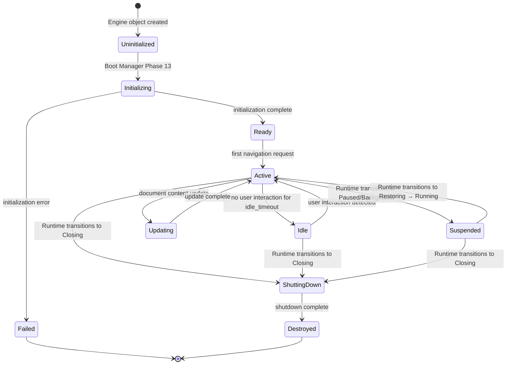

### 11.2 Initialization Sequence

The Engine initialization sequence runs during Boot Manager Phase 13:

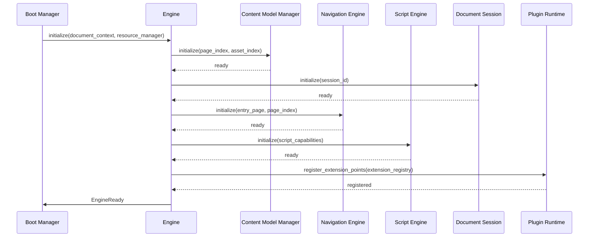

### 11.3 Suspension and Restoration

When the Runtime transitions to `Paused` or `Background`, the Engine suspends:

**On suspension**:
1. Cancel all in-progress pipeline work
2. Suspend all script execution contexts
3. Save session snapshot to the State Service
4. Release warm cache (layout trees, render frames)
5. Emit `EngineSuspended`

**On restoration**:
1. Emit `EngineRestoring`
2. Restore session snapshot from the State Service
3. Re-navigate to the current page (triggers Page Pipeline)
4. Resume script execution contexts
5. Emit `EngineRestored`

### 11.4 Update Sequence

A document update occurs when the document's content changes during an active session (live editing, collaboration sync). The Engine handles updates without a full restart:

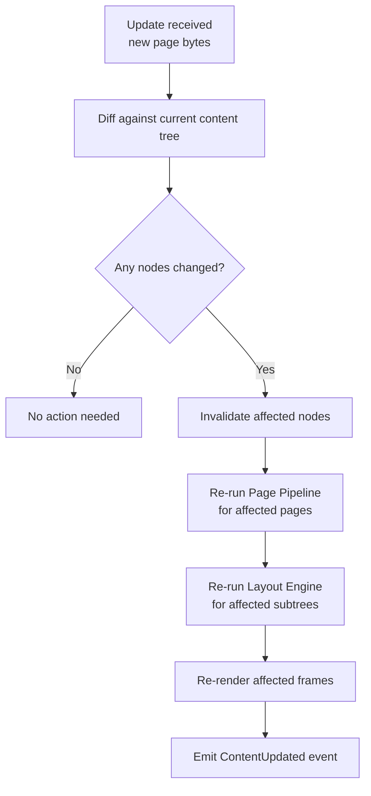

---

## 12. Engine Events

### 12.1 Event Catalog

The Engine emits the following events to the Runtime Event Bus. All events follow the `BaseEvent` structure defined in LDFX-P2-2.1.

#### Page Events

| Event | Priority | Cancellable | Payload |
|-------|----------|-------------|---------|
| `PageNavigating` | High | Yes | `{ page_id, from_page_id?, anchor? }` |
| `PageNavigated` | High | No | `{ page_id, from_page_id?, anchor?, load_time_ms }` |
| `PageLoading` | Normal | No | `{ page_id }` |
| `PageReady` | High | No | `{ page_id, load_time_ms, node_count }` |
| `PageLoadFailed` | High | No | `{ page_id, error_code, error_message }` |
| `PageLoadCancelled` | Normal | No | `{ page_id, reason }` |
| `PageReleased` | Low | No | `{ page_id }` |

#### Content Model Events

| Event | Priority | Cancellable | Payload |
|-------|----------|-------------|---------|
| `ContentMutated` | Normal | No | `{ page_id, node_id, mutation_type }` |
| `AiBlockGenerating` | Normal | No | `{ page_id, node_id, model_id }` |
| `AiBlockComplete` | Normal | No | `{ page_id, node_id, latency_ms }` |
| `AiBlockFailed` | Normal | No | `{ page_id, node_id, error_message }` |
| `PluginBlockUpdated` | Normal | No | `{ page_id, node_id, plugin_id }` |

#### Render Events

| Event | Priority | Cancellable | Payload |
|-------|----------|-------------|---------|
| `FrameReady` | High | No | `{ page_id, frame_id, render_time_ms }` |
| `LayoutComplete` | Normal | No | `{ page_id, layout_time_ms, node_count }` |
| `RenderSlow` | Low | No | `{ page_id, frame_time_ms, budget_ms }` |

#### Script Events

| Event | Priority | Cancellable | Payload |
|-------|----------|-------------|---------|
| `ScriptLoaded` | Normal | No | `{ page_id, script_path }` |
| `ScriptFailed` | Normal | No | `{ page_id, script_path, error_message }` |
| `ScriptTimeout` | Normal | No | `{ page_id, script_path, elapsed_ms }` |

#### Session Events

| Event | Priority | Cancellable | Payload |
|-------|----------|-------------|---------|
| `EngineReady` | High | No | `{ session_id, entry_page_id }` |
| `EngineSuspended` | High | No | `{ reason }` |
| `EngineRestored` | High | No | `{ from_state }` |
| `EngineShutdown` | High | No | `{ session_id, uptime_ms }` |
| `SessionStateChanged` | Low | No | `{ key, scope }` |
| `ZoomChanged` | Normal | No | `{ level, previous_level }` |
| `ThemeChanged` | Normal | No | `{ theme_id, previous_theme_id }` |
| `LocaleChanged` | Normal | No | `{ locale, previous_locale }` |

### 12.2 Event Emission Rules

- The Engine never emits security events — those are emitted by the Security Manager
- The Engine never emits lifecycle events — those are emitted by the Lifecycle Manager
- Plugin-emitted events are routed through the Event Bus but are not Engine events
- All Engine events include `source: "engine"` in their base payload
- `PageNavigating` is the only Engine event that is cancellable


---

## 13. Security Enforcement

### 13.1 Engine Security Responsibilities

The Engine is not the primary security enforcement point — that is the Security Manager (LDFX-P2-2.7) and the API Gateway (LDFX-P2-2.5). However, the Engine has its own security responsibilities that are specific to content processing and script execution.

### 13.2 Content Security

The Engine enforces the following content security rules during the Page Pipeline:

| Rule | Stage | Enforcement |
|------|-------|-------------|
| External link targets require `network_read` permission | Stage 4 (Resolve) | Links without permission are rendered as disabled |
| External embed sources require `network_read` permission | Stage 4 (Resolve) | Embeds without permission show a blocked placeholder |
| SVG assets are scanned for script content before rendering | Stage 4 (Resolve) | SVGs with scripts are rejected; error placeholder shown |
| AI blocks require `ai.inference` capability | Stage 7 (AI Blocks) | AI blocks without capability show static fallback |
| Plugin blocks require the plugin to be in the granted plugin list | Stage 6 (Plugin Blocks) | Unauthorized plugin blocks show fallback content |

### 13.3 Script Security

The Script Engine enforces the following rules:

| Rule | Enforcement |
|------|-------------|
| Scripts can only access the `LDF` API — no direct DOM, no `window`, no `document` | Execution context does not expose browser globals |
| Script capabilities are fixed at context creation | Capability set is immutable after context creation |
| Scripts cannot access other pages' content trees | Each context is bound to a single page |
| Scripts cannot call each other directly | Inter-script communication only through `LDF.events` |
| Scripts cannot modify the content tree directly | All mutations go through the Content Model Manager mutation API |
| Script memory is isolated from Engine memory | V8/QuickJS heap is separate from Rust heap |

### 13.4 Plugin Block Security

Plugin blocks are rendered by calling the plugin's `render_block()` method through the Plugin Runtime. The Engine enforces:

- The plugin must be in the `Running` state before its blocks are rendered
- The plugin's `render_block()` call is subject to the Plugin Runtime's sandbox
- The plugin cannot return draw commands that reference assets outside its declared namespace
- The plugin's render result is validated before being inserted into the content tree

### 13.5 Content Sanitization

All text content from the content model is treated as data, not markup. The Render Pipeline never interprets text content as HTML or executable code. Text is always rendered as literal characters.

Exception: `CodeBlock` content is syntax-highlighted but never executed. `FormulaLeaf` content is rendered by a formula renderer but never executed as code.

---

## 14. Performance

### 14.1 Engine Performance Targets

| Metric | Target | Measurement |
|--------|--------|-------------|
| Page Pipeline (standard page) | < 100ms | Stage 1 start to Stage 8 complete |
| Page Pipeline (complex page, 200+ nodes) | < 300ms | Stage 1 start to Stage 8 complete |
| Layout Engine (standard page) | < 8ms | Layout request to layout complete |
| Layout Engine (complex page) | < 16ms | Layout request to layout complete |
| Render Pipeline (standard frame) | < 4ms | Layout tree to render frame |
| Navigation response (cached page) | < 16ms | `goto()` call to `FrameReady` event |
| Navigation response (uncached page) | < 200ms | `goto()` call to `FrameReady` event |
| Script execution (page load) | < 50ms | Script start to completion |
| Content model mutation | < 5ms | Mutation request to tree updated |
| Session snapshot save | < 20ms | Snapshot request to State Service write |

### 14.2 Content Model Performance

The content model is optimized for read-heavy workloads:

- Nodes are stored in a flat `HashMap<NodeId, ContentNode>` for O(1) lookup
- Parent-child relationships are stored as `Vec<NodeId>` for O(n) traversal
- The tree is never cloned — all access is through shared references
- Mutations use a copy-on-write strategy for affected subtrees

### 14.3 Layout Caching

Layout results are cached aggressively:

| Cache Entry | Key | Invalidation |
|-------------|-----|-------------|
| Full layout tree | `(page_id, viewport_hash)` | Content mutation, viewport change, theme change |
| Node layout box | `(node_id, constraint_hash)` | Node mutation, parent constraint change |
| Text metrics | `(text, font, size)` | Font change |
| Image dimensions | `asset_id` | Never (images are immutable) |

### 14.4 Render Frame Caching

Render frames are cached per `(page_id, scroll_y, zoom_level)`. If the page content, scroll position, and zoom level have not changed since the last frame, the cached frame is returned without re-running the Render Pipeline.

### 14.5 Prefetching Strategy

The Engine prefetches pages adjacent to the current page to minimize navigation latency:

| Prefetch Target | Priority | Trigger |
|----------------|----------|---------|
| Next page (index + 1) | Normal | After current page renders |
| Previous page (index - 1) | Low | After next page prefetch starts |
| Linked pages (from current page links) | Low | After current page renders |
| Entry page assets | High | At Engine initialization |

Prefetch work runs on the Runtime Foundation Scheduler at `Low` priority and never competes with foreground rendering work.

---

## 15. Error Handling

### 15.1 Error Philosophy

The Engine follows the Runtime Foundation's fail-safe principle: no Engine error may crash the runtime. Every error has a defined response that allows the document to continue operating in a degraded but functional state.

### 15.2 Error Classification

| Error Class | Examples | Response |
|-------------|---------|----------|
| Page load error | JSON parse failure, missing entry | Show error page; other pages unaffected |
| Asset load error | Missing image, corrupted font | Show error placeholder; page continues |
| Script error | Syntax error, runtime exception | Script disabled; page continues without it |
| Plugin block error | Plugin not ready, render failed | Show fallback content; page continues |
| AI block error | Model not ready, inference failed | Show fallback content; page continues |
| Layout error | Infinite loop in layout algorithm | Use fallback layout; log error |
| Navigation error | Invalid target, page not found | Navigation rejected; current page unchanged |
| Session state error | State write failure | State kept in memory; warning logged |

### 15.3 Error Placeholders

When a content element cannot be rendered, the Engine substitutes an error placeholder. Placeholders are rendered by the Render Pipeline as a styled box with an error indicator.

| Error Type | Placeholder Appearance |
|------------|----------------------|
| Missing image | Gray box with broken image icon and alt text |
| Missing video | Gray box with video icon and filename |
| Plugin unavailable | Dashed border box with plugin name and "unavailable" message |
| AI block failed | Dashed border box with "Content unavailable" message |
| Blocked external link | Link text with strikethrough and lock icon |
| Blocked external embed | Gray box with "External content blocked" message |

### 15.4 Error Recovery

Some errors are recoverable without user action:

| Error | Recovery Trigger | Recovery Action |
|-------|-----------------|----------------|
| Plugin not ready | `PluginReady` event | Re-run Stage 6 for affected blocks |
| AI inference pending | `AiInferenceCompleted` event | Update AiBlock with result |
| Asset loading | `AssetLoaded` event | Re-resolve affected nodes |
| Script timeout | Script resumes on next tick | Script continues from suspension point |

### 15.5 Engine Error Types

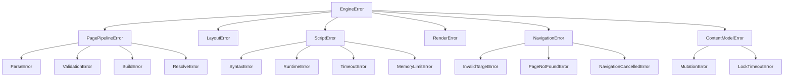

---

## 16. Rust Module Layout

### 16.1 Folder Structure

The Runtime Engine is implemented in `ldfx-runtime/src/engine/`. It is organized by component, with shared types in `types/`.

```
ldfx-runtime/
└── src/
    └── engine/
        ├── mod.rs                      # Engine struct, initialization, shutdown
        ├── content_model/
        │   ├── mod.rs                  # ContentModelManager
        │   ├── node.rs                 # ContentNode, NodeType, NodeState
        │   ├── page.rs                 # PageNode, PageLoadState
        │   ├── blocks.rs               # All BlockNode types
        │   ├── inline.rs               # All InlineNode types
        │   ├── leaf.rs                 # All LeafNode types
        │   ├── mutation.rs             # MutationApi, MutationLog
        │   └── tree.rs                 # ContentTree, node lookup, traversal
        ├── pipeline/
        │   ├── mod.rs                  # PagePipeline, pipeline orchestration
        │   ├── parse.rs                # Stage 1: JSON parsing
        │   ├── validate.rs             # Stage 2: Schema validation
        │   ├── build.rs                # Stage 3: Tree construction
        │   ├── resolve.rs              # Stage 4: Reference resolution
        │   ├── script_stage.rs         # Stage 5: Script execution trigger
        │   ├── plugin_stage.rs         # Stage 6: Plugin block rendering
        │   ├── ai_stage.rs             # Stage 7: AI block queuing
        │   └── extension.rs            # Extension point registry and dispatch
        ├── layout/
        │   ├── mod.rs                  # LayoutEngine
        │   ├── tree.rs                 # LayoutTree, LayoutNode
        │   ├── algorithm.rs            # Measure, Constrain, Position, Baseline, Overflow
        │   ├── block.rs                # Block formatting context rules
        │   ├── inline.rs               # Inline formatting context, line boxes
        │   ├── table.rs                # Table formatting context
        │   ├── responsive.rs           # Breakpoint resolution
        │   ├── cache.rs                # Layout cache
        │   └── text_metrics.rs         # Font metrics, text measurement
        ├── script/
        │   ├── mod.rs                  # ScriptEngine
        │   ├── context.rs              # ExecutionContext, context lifecycle
        │   ├── runtime.rs              # JS/WASM runtime wrapper
        │   ├── api_bridge.rs           # LDF global injection, API call routing
        │   ├── scheduler.rs            # Script time budget enforcement
        │   └── error.rs                # ScriptError types
        ├── render/
        │   ├── mod.rs                  # RenderPipeline
        │   ├── frame.rs                # RenderFrame, DrawCommand types
        │   ├── paint.rs                # Paint stage: content tree → draw commands
        │   ├── composite.rs            # Composite stage: layer assignment
        │   ├── clip.rs                 # Clip stage: overflow handling
        │   ├── scroll.rs               # Scroll stage: scroll offset application
        │   ├── cache.rs                # Frame cache
        │   └── formats/
        │       ├── display_list.rs     # DisplayList format
        │       ├── pdf.rs              # PdfPage format
        │       ├── html.rs             # HtmlFragment format
        │       └── accessibility.rs    # AccessibilityTree format
        ├── navigation/
        │   ├── mod.rs                  # NavigationEngine
        │   ├── history.rs              # NavigationHistory, HistoryEntry
        │   ├── resolver.rs             # Target resolution (index/id/anchor/path)
        │   ├── guards.rs               # Navigation guard registration and execution
        │   └── deep_link.rs            # Deep link parsing and resolution
        ├── session/
        │   ├── mod.rs                  # DocumentSession
        │   ├── state.rs                # Session state fields
        │   ├── snapshot.rs             # SessionSnapshot, serialize/deserialize
        │   └── persistence.rs          # State Service integration
        ├── services/
        │   ├── mod.rs                  # Engine service registry
        │   ├── scheduler.rs            # EngineScheduler, frame budget management
        │   ├── annotation.rs           # AnnotationService
        │   ├── search.rs               # SearchService, search index
        │   ├── accessibility.rs        # AccessibilityService
        │   └── print.rs                # PrintService
        ├── errors/
        │   ├── mod.rs                  # EngineError enum
        │   ├── pipeline.rs             # PagePipelineError variants
        │   ├── layout.rs               # LayoutError variants
        │   ├── script.rs               # ScriptError variants
        │   ├── render.rs               # RenderError variants
        │   └── navigation.rs           # NavigationError variants
        └── tests/
            ├── unit/
            │   ├── content_model_tests.rs
            │   ├── pipeline_tests.rs
            │   ├── layout_tests.rs
            │   ├── script_tests.rs
            │   ├── render_tests.rs
            │   └── navigation_tests.rs
            ├── integration/
            │   ├── page_load_tests.rs
            │   ├── navigation_flow_tests.rs
            │   └── script_api_tests.rs
            └── benchmarks/
                ├── pipeline_benchmarks.rs
                ├── layout_benchmarks.rs
                └── render_benchmarks.rs
```

### 16.2 Module Dependency Graph

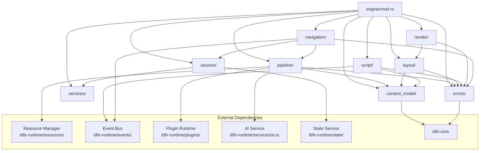

### 16.3 Key Traits

```
EngineComponent trait:
    fn name() -> &'static str
    fn initialize(ctx: &EngineContext) -> Result<(), EngineError>
    fn shutdown() -> Result<(), EngineError>

PipelineStage trait:
    fn name() -> &'static str
    fn execute(input: StageInput, ctx: &PipelineContext) -> Result<StageOutput, PipelineError>
    fn timeout_ms() -> u64
    fn is_fatal_on_failure() -> bool

LayoutRule trait:
    fn applies_to(node_type: NodeType) -> bool
    fn measure(node: &ContentNode, ctx: &MeasureContext) -> IntrinsicSize
    fn constrain(node: &ContentNode, constraint: SizeConstraint) -> ConstrainedSize
    fn position(node: &ContentNode, ctx: &PositionContext) -> Position

RenderFormat trait:
    fn format_name() -> &'static str
    fn render(layout_tree: &LayoutTree, session: &DocumentSession) -> RenderOutput
```

---

## 17. Acceptance Criteria

### 17.1 Content Model Completeness

| ID | Criterion | Verification |
|----|-----------|-------------|
| CM-01 | All block node types defined in Phase 1 page content schema are represented in the content model | Cross-reference with Phase 1 schema |
| CM-02 | All inline node types are represented | Cross-reference with Phase 1 schema |
| CM-03 | All leaf node types are represented | Cross-reference with Phase 1 schema |
| CM-04 | Content model mutations are atomic — no partial mutations | Mutation rollback test |
| CM-05 | No component holds a write lock on the content tree for more than 5ms | Lock timing benchmark |
| CM-06 | Content tree node lookup is O(1) | HashMap implementation verification |
| CM-07 | Content model is immutable except through the mutation API | Direct mutation attempt test |

### 17.2 Page Pipeline Correctness

| ID | Criterion | Verification |
|----|-----------|-------------|
| PP-01 | All 8 pipeline stages execute in order for every page load | Stage execution trace test |
| PP-02 | Stage 2 rejects pages with duplicate node IDs | Validation test with duplicate IDs |
| PP-03 | Stage 2 rejects pages with references to unknown assets | Validation test with unknown asset ref |
| PP-04 | Stage 4 loads all critical assets before proceeding | Asset load timing test |
| PP-05 | Stage 5 script timeout does not block the pipeline | Script timeout test |
| PP-06 | Stage 6 plugin block failure shows fallback content | Plugin failure test |
| PP-07 | Stage 7 AI blocks do not block the pipeline | AI async test |
| PP-08 | Pipeline cancellation releases all allocated nodes | Memory test after cancellation |
| PP-09 | Standard page pipeline completes within 100ms | Performance benchmark |
| PP-10 | Extension point handlers that exceed 10ms are skipped | Extension timeout test |

### 17.3 Layout Engine Correctness

| ID | Criterion | Verification |
|----|-----------|-------------|
| LE-01 | Layout is deterministic — same input always produces same output | Determinism test (100 runs) |
| LE-02 | All 5 layout algorithm passes execute in order | Pass execution trace test |
| LE-03 | Layout cache is invalidated on content mutation | Cache invalidation test |
| LE-04 | Layout cache is invalidated on viewport change | Viewport change test |
| LE-05 | Responsive breakpoints produce correct layouts at all widths | Breakpoint test at each boundary |
| LE-06 | Standard page layout completes within 8ms | Performance benchmark |
| LE-07 | Layout re-run for a single dirty node does not re-layout the full tree | Incremental layout test |

### 17.4 Script Engine Correctness

| ID | Criterion | Verification |
|----|-----------|-------------|
| SE-01 | Each script runs in an isolated execution context | Cross-context access test |
| SE-02 | Scripts cannot access browser globals (window, document, fetch) | Global access test |
| SE-03 | Script time budget is enforced — scripts exceeding 50ms are suspended | Timeout enforcement test |
| SE-04 | Script errors do not crash the Engine | Error injection test |
| SE-05 | Scripts can only call API methods matching their declared capabilities | Permission enforcement test |
| SE-06 | Script memory is isolated from Engine memory | Memory isolation test |
| SE-07 | Scripts can communicate with each other only through LDF.events | Direct cross-script call test |

### 17.5 Render Pipeline Correctness

| ID | Criterion | Verification |
|----|-----------|-------------|
| RP-01 | Render output is deterministic — same layout tree always produces same frame | Determinism test |
| RP-02 | All draw command types are generated correctly | Draw command coverage test |
| RP-03 | Clip regions are correctly applied for overflow:hidden nodes | Clip test |
| RP-04 | Scroll offsets are correctly applied to scroll containers | Scroll test |
| RP-05 | Standard page render completes within 4ms | Performance benchmark |
| RP-06 | Incremental render only re-paints dirty nodes | Dirty tracking test |
| RP-07 | All four render output formats produce valid output | Format validation test |

### 17.6 Navigation Engine Correctness

| ID | Criterion | Verification |
|----|-----------|-------------|
| NE-01 | All four target forms (index, page_id, anchor, path) resolve correctly | Target resolution test |
| NE-02 | PageNavigating event is emitted before navigation begins | Event sequence test |
| NE-03 | Navigation can be cancelled by a high-priority event handler | Cancellation test |
| NE-04 | Navigation history is correctly maintained (back, forward, new) | History state test |
| NE-05 | Scroll position is saved and restored on back navigation | Scroll restore test |
| NE-06 | Navigation to a cached page completes within 16ms | Performance benchmark |
| NE-07 | Navigation to an uncached page completes within 200ms | Performance benchmark |

### 17.7 Security Requirements

| ID | Criterion | Verification |
|----|-----------|-------------|
| SEC-01 | External links without network_read permission are rendered as disabled | Permission test |
| SEC-02 | SVG assets with script content are rejected | SVG script scan test |
| SEC-03 | AI blocks without ai.inference capability show static fallback | Capability test |
| SEC-04 | Plugin blocks from unauthorized plugins show fallback content | Plugin auth test |
| SEC-05 | Scripts cannot access browser globals | Global access test |
| SEC-06 | Text content is never interpreted as HTML or executable code | XSS injection test |
| SEC-07 | Script capabilities are immutable after context creation | Capability mutation test |

### 17.8 Performance Requirements

| ID | Criterion | Verification |
|----|-----------|-------------|
| PERF-01 | Page Pipeline (standard page) < 100ms | Benchmark |
| PERF-02 | Layout Engine (standard page) < 8ms | Benchmark |
| PERF-03 | Render Pipeline (standard frame) < 4ms | Benchmark |
| PERF-04 | Navigation to cached page < 16ms | Benchmark |
| PERF-05 | Navigation to uncached page < 200ms | Benchmark |
| PERF-06 | Content model mutation < 5ms | Benchmark |
| PERF-07 | Session snapshot save < 20ms | Benchmark |
| PERF-08 | Layout cache hit returns result without re-running algorithm | Cache hit test |
| PERF-09 | Render frame cache hit returns result without re-running pipeline | Cache hit test |
| PERF-10 | Engine memory overhead < 16MB for a standard 100-page document | Memory profiling |

### 17.9 Reliability Requirements

| ID | Criterion | Verification |
|----|-----------|-------------|
| RL-01 | No Engine error crashes the runtime | Fault injection test for all error paths |
| RL-02 | Page load failure shows error page; other pages unaffected | Isolation test |
| RL-03 | Script error does not affect page rendering | Script error injection test |
| RL-04 | Plugin block failure shows fallback; page continues | Plugin failure test |
| RL-05 | Engine suspension saves full session snapshot | Suspension + restore test |
| RL-06 | Engine restoration correctly restores current page and scroll position | Restore accuracy test |
| RL-07 | Pipeline cancellation releases all allocated memory | Memory leak test |
| RL-08 | All Engine events include correct payloads | Event payload validation test |

---

*End of LDFX Phase 2 — Part 2.4: Runtime Engine Specification*

---

**Document**: LDFX-P2-2.4-ENGINE  
**Version**: 1.0.0  
**Status**: Complete  
**Previous**: LDFX-P2-2.3 — Resource Manager Specification  
**Next**: LDFX-P2-2.5 — Runtime API Architecture Specification
