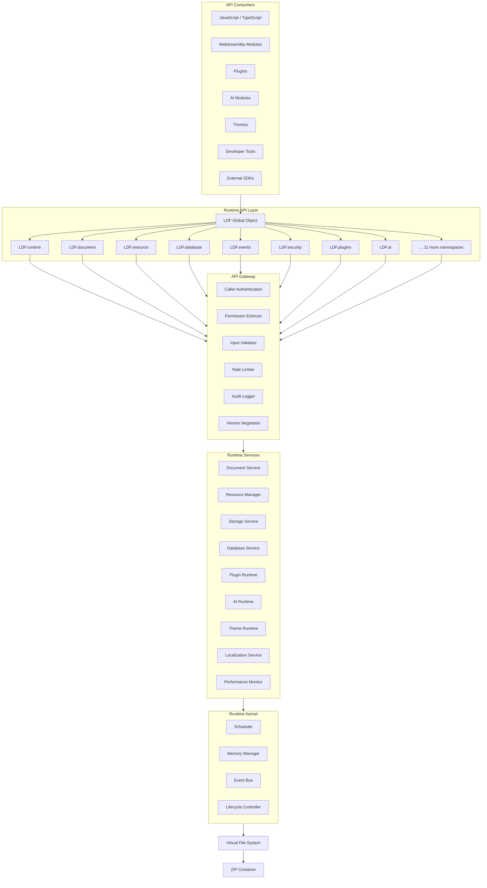
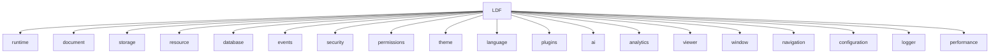
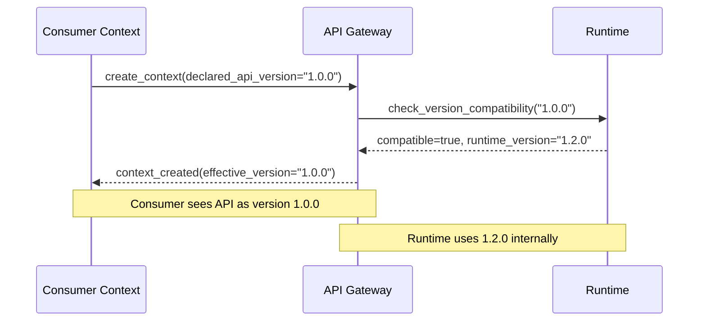
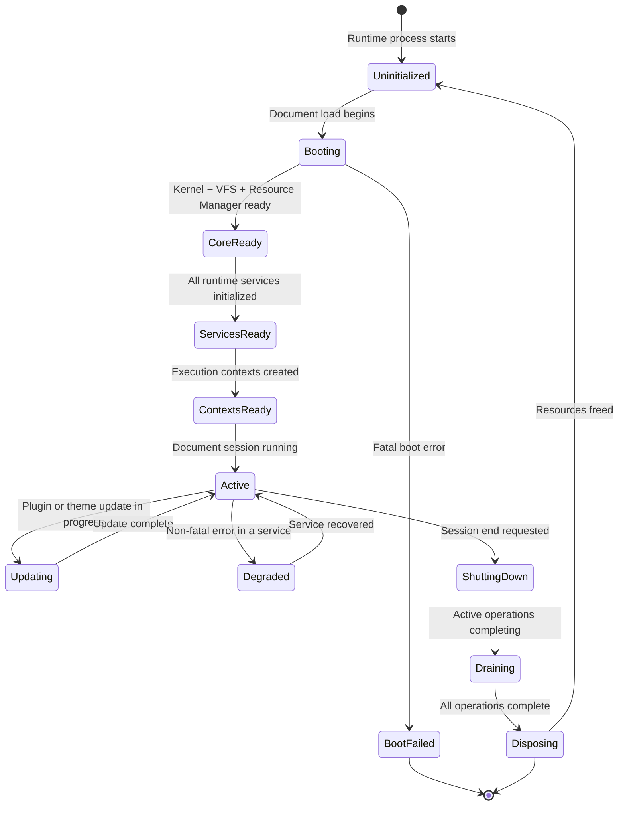
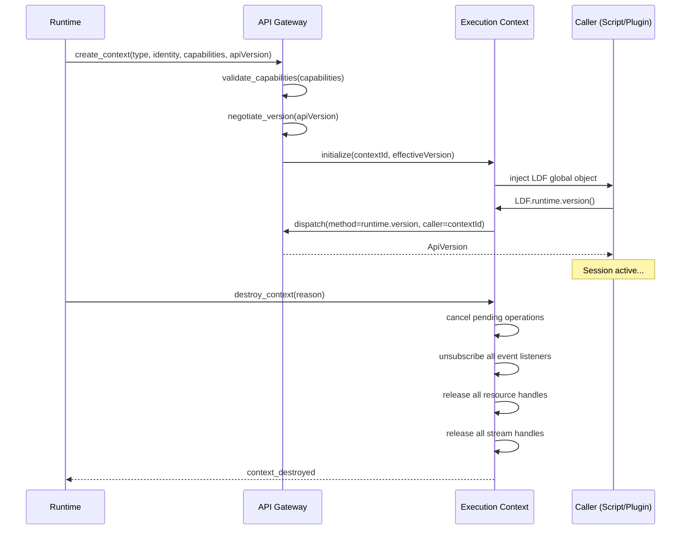
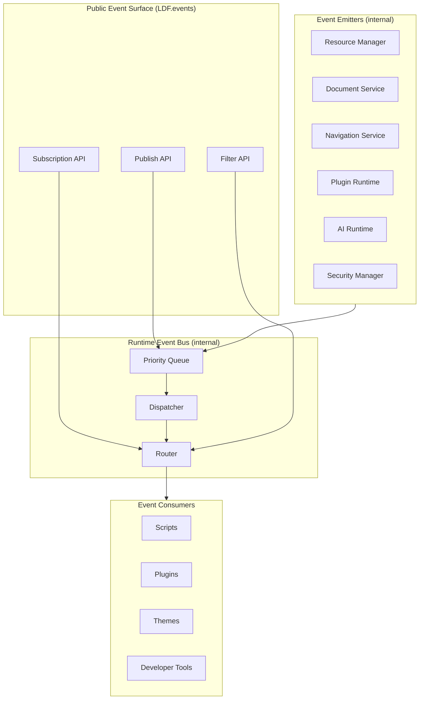
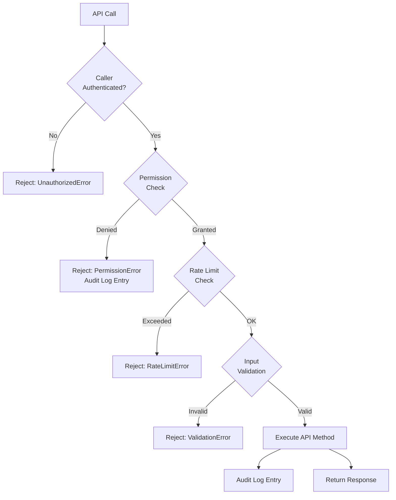
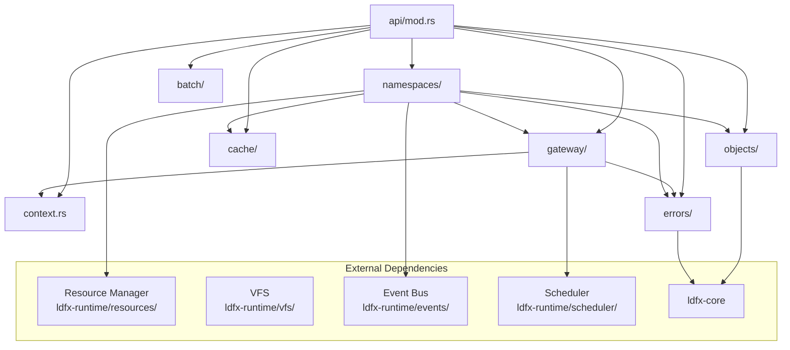

# LDFX Phase 2 — Part 2.5: Runtime API Architecture Specification

**Document ID**: LDFX-P2-2.5-API  
**Version**: 1.0.0  
**Status**: Official Specification  
**Classification**: Architecture — Public  
**Depends On**: LDFX-P2-2.1 (Runtime Foundation), LDFX-P2-2.2 (VFS), LDFX-P2-2.3 (Resource Manager), LDFX-P1 (File Format)  
**Audience**: SDK Developers, Plugin Authors, Document Authors, Runtime Implementors  
**Stability**: Stable — all `@stable` methods are binding

---

## Table of Contents

1. [Introduction](#1-introduction)
2. [API Architecture](#2-api-architecture)
3. [Core Namespaces](#3-core-namespaces)
4. [API Design Principles](#4-api-design-principles)
5. [Runtime API Methods](#5-runtime-api-methods)
6. [Object Model](#6-object-model)
7. [API Lifecycle](#7-api-lifecycle)
8. [Event Integration](#8-event-integration)
9. [Security](#9-security)
10. [SDK Design](#10-sdk-design)
11. [Error Model](#11-error-model)
12. [Performance](#12-performance)
13. [Developer Experience](#13-developer-experience)
14. [Versioning](#14-versioning)
15. [Testing Strategy](#15-testing-strategy)
16. [Rust Module Layout](#16-rust-module-layout)
17. [Acceptance Criteria](#17-acceptance-criteria)

---

## 1. Introduction

### 1.1 Why the Runtime API Exists

An LDFX document is a self-contained, executable environment. It contains not just static content but scripts, plugins, AI modules, themes, databases, and interactive components — all packaged inside a single `.ldfx` container. These components need a stable, secure, and well-defined interface to interact with the runtime that hosts them.

Without a formal Runtime API:

- Scripts would need to reach directly into runtime internals, creating tight coupling that breaks on every runtime update
- Plugins would have no guaranteed interface contract, making them fragile and version-dependent
- AI modules would have no standard way to request resources, report results, or interact with the document
- Developer tools would have no introspection surface
- SDK authors would have nothing to build against

The Runtime API solves all of these problems by providing a **single, versioned, stable interface** between every consumer (scripts, plugins, AI, themes, developer tools) and the LDFX runtime. It is the only supported way to interact with the runtime. There are no back-channels, no internal object references, and no undocumented escape hatches.

This design mirrors the philosophy of browser platform APIs: the browser engine is an implementation detail; the Web API is the contract. The LDFX Runtime API is the contract.

### 1.2 Design Goals

| Goal | Description |
|------|-------------|
| **Single Interface** | All runtime interaction flows through one API surface |
| **Stability** | Published API methods do not change behavior across minor versions |
| **Security** | Every API call is permission-checked; no caller can exceed its declared capabilities |
| **Offline-First** | All API operations work without network access |
| **Async-First** | All potentially blocking operations are asynchronous |
| **Typed** | All inputs and outputs have defined types; no untyped `any` parameters |
| **Observable** | Every significant API operation emits events and produces trace spans |
| **Extensible** | New namespaces and methods can be added without breaking existing callers |
| **Discoverable** | The API surface is self-describing; callers can query available methods and permissions |
| **Testable** | Every API method has a defined contract that can be verified by automated tests |

### 1.3 API Philosophy

**The API is a contract, not a convenience layer.**  
Every method in the Runtime API represents a deliberate architectural decision. Methods are added only when there is a clear, stable use case. Methods are never added speculatively.

**Explicit over implicit.**  
API callers must explicitly declare what they need. There are no ambient globals, no implicit context, and no magic behavior. A script that needs access to the document's storage must explicitly request it through `LDF.storage`.

**Fail loudly.**  
Every API method returns a `Result` type. There are no silent failures, no `undefined` returns, and no swallowed exceptions. If an operation fails, the caller receives a structured error with full context.

**Immutable by default.**  
Objects returned by the API are immutable snapshots unless the API explicitly provides a mutable interface. Callers cannot modify runtime state by mutating returned objects.

**Capability-based security.**  
Access to API namespaces is governed by capabilities declared in the document manifest or plugin manifest. A caller that has not declared a capability cannot access the corresponding API namespace, regardless of how it calls it.

### 1.4 Offline-First Design

The Runtime API is designed for a world where network access is unavailable. Every API method that could theoretically require network access has been designed to work entirely from the local `.ldfx` container:

- `LDF.resource.load()` reads from the VFS, never from a URL
- `LDF.database.query()` reads from a SQLite file in the container
- `LDF.language.translate()` reads from localization files in the container
- `LDF.ai.infer()` runs against a model packed in the container

There is no API method that makes an outbound network request. The Runtime API does not expose a `fetch()` equivalent. Network access, if needed by a plugin, must be declared as a special capability and is handled outside the standard API surface.

### 1.5 Security-First Design

Security is not a layer on top of the API — it is woven into every method:

- **Permission checks** run before any method body executes
- **Input validation** runs on every parameter before it reaches the runtime
- **Output sanitization** ensures no internal runtime state leaks through return values
- **Rate limiting** prevents API abuse by runaway scripts or malicious plugins
- **Audit logging** records every sensitive API call with caller identity and parameters

A caller that fails a permission check receives a `PermissionError` immediately. No partial execution occurs. No side effects are produced.

### 1.6 Stability Guarantees

The Runtime API follows semantic versioning:

- **Patch versions** (1.0.x): Bug fixes only. No API changes.
- **Minor versions** (1.x.0): New methods and namespaces may be added. Existing methods are not changed. Existing behavior is not changed.
- **Major versions** (x.0.0): Breaking changes are permitted. A migration guide is published. Old major versions are supported for a minimum of 24 months after the new major version is released.

A method marked `@stable` will not change its signature or behavior within a major version.  
A method marked `@experimental` may change in any minor version.  
A method marked `@deprecated` will be removed in the next major version.

### 1.7 Backward Compatibility

Backward compatibility means that code written against API version 1.0 will continue to work correctly against API version 1.x without modification.

Backward compatibility is maintained by:
- Never removing `@stable` methods within a major version
- Never changing the parameter types of `@stable` methods
- Never changing the return type of `@stable` methods
- Never changing the error types of `@stable` methods
- Never changing the behavior of `@stable` methods in ways that break existing callers

### 1.8 Forward Compatibility

Forward compatibility means that code written against API version 1.0 will not crash when run against API version 1.1, even if it does not use the new features in 1.1.

Forward compatibility is maintained by:
- Ignoring unknown properties in input objects (tolerant reader pattern)
- Including a version field in all response objects
- Providing feature detection methods (`LDF.runtime.supports()`)
- Never making previously optional parameters required

### 1.9 Versioning Strategy

The API version is declared in the document manifest:

```json
{
  "runtime": {
    "api_version": "1.0.0",
    "min_api_version": "1.0.0"
  }
}
```

At boot, the runtime checks whether it can satisfy the document's `api_version` requirement. If the runtime's API version is lower than `min_api_version`, the document fails to load with an `ApiVersionError`.

Callers can query the current API version at runtime:

```
LDF.runtime.version()  →  ApiVersion { major: 1, minor: 0, patch: 0 }
```

### 1.10 Performance Goals

| Metric | Target |
|--------|--------|
| Synchronous API call overhead | < 0.1ms |
| Async API call overhead (excluding I/O) | < 1ms |
| Permission check overhead | < 0.05ms |
| Event subscription registration | < 0.1ms |
| Event delivery latency | < 1ms |
| API object construction | < 0.5ms |
| Batch operation overhead per item | < 0.01ms |

---

## 2. API Architecture

### 2.1 Architectural Overview

The Runtime API is a layered system. Each layer has a single responsibility. No layer bypasses another.

```
┌─────────────────────────────────────────────────────────────────┐
│                         API Consumers                            │
│   (Scripts, Plugins, AI Modules, Themes, Developer Tools, SDKs) │
└─────────────────────────┬───────────────────────────────────────┘
                          │  LDF global object
┌─────────────────────────▼───────────────────────────────────────┐
│                       Runtime API Layer                          │
│              (namespace objects, method dispatch)                │
└─────────────────────────┬───────────────────────────────────────┘
                          │
┌─────────────────────────▼───────────────────────────────────────┐
│                       API Gateway                                │
│     (authentication, permission checks, input validation,        │
│      rate limiting, audit logging, version negotiation)          │
└──────┬──────────────────┬──────────────────┬────────────────────┘
       │                  │                  │
┌──────▼──────┐  ┌────────▼───────┐  ┌──────▼──────────┐
│  Document   │  │   Resource     │  │    Storage      │
│  Service    │  │   Manager      │  │    Service      │
└──────┬──────┘  └────────┬───────┘  └──────┬──────────┘
       │                  │                  │
┌──────▼──────────────────▼──────────────────▼──────────┐
│                    Runtime Kernel                        │
│         (lifecycle, scheduler, memory, events)           │
└─────────────────────────┬───────────────────────────────┘
                          │
┌─────────────────────────▼───────────────────────────────┐
│                 Virtual File System                       │
└─────────────────────────┬───────────────────────────────┘
                          │
┌─────────────────────────▼───────────────────────────────┐
│                    ZIP Container                          │
└─────────────────────────────────────────────────────────┘
```

### 2.2 Full Architecture Diagram



### 2.3 Layer Descriptions

#### Layer 1 — API Consumers

Any code that calls the Runtime API. Consumers are identified by their caller identity, which is established at the time the consumer's execution context is created:

- **Scripts**: JavaScript/TypeScript code embedded in HTML pages within the document
- **WASM Modules**: WebAssembly modules loaded by the Plugin Runtime
- **Plugins**: LDFX plugin bundles with their own manifest and capabilities
- **AI Modules**: AI inference modules with access to the AI namespace
- **Themes**: Theme bundles with access to the theme and style namespaces
- **Developer Tools**: The Developer Runtime with elevated access
- **External SDKs**: Host applications embedding the LDFX runtime

#### Layer 2 — Runtime API Layer

The `LDF` global object and its namespace objects. This layer:

- Provides the public API surface as a structured object hierarchy
- Dispatches method calls to the API Gateway
- Constructs typed return objects from Gateway responses
- Manages the caller's execution context (identity, capabilities, version)

The `LDF` object is injected into each execution context at creation time. Scripts cannot construct `LDF` themselves — it is provided by the runtime.

#### Layer 3 — API Gateway

The security and validation boundary. Every API call passes through the Gateway before reaching any runtime service. The Gateway:

- **Authenticates** the caller by verifying their execution context identity
- **Checks permissions** against the caller's declared capabilities
- **Validates inputs** against the method's parameter schema
- **Enforces rate limits** to prevent API abuse
- **Logs** every call to the audit trail
- **Negotiates versions** to ensure the caller's API version is compatible

The Gateway is synchronous for permission checks and input validation. It is asynchronous for operations that require service calls.

#### Layer 4 — Runtime Services

The actual implementation of API functionality. Services are internal to the runtime and are never exposed directly to consumers. Each service corresponds to one or more API namespaces:

| Service | Serves Namespaces |
|---------|------------------|
| Document Service | `LDF.document`, `LDF.navigation`, `LDF.viewer` |
| Resource Manager | `LDF.resource` |
| Storage Service | `LDF.storage` |
| Database Service | `LDF.database` |
| Plugin Runtime | `LDF.plugins` |
| AI Runtime | `LDF.ai` |
| Theme Runtime | `LDF.theme` |
| Localization Service | `LDF.language` |
| Performance Monitor | `LDF.performance` |
| Security Manager | `LDF.security`, `LDF.permissions` |
| Event Bus | `LDF.events` |
| Configuration Service | `LDF.configuration` |
| Logger | `LDF.logger` |
| Analytics Service | `LDF.analytics` |
| Window Manager | `LDF.window` |

#### Layer 5 — Runtime Kernel

The foundational runtime layer defined in LDFX-P2-2.1. The API layer never calls the Kernel directly — it goes through Runtime Services. The Kernel provides scheduling, memory management, lifecycle control, and the Event Bus.

#### Layer 6 — Virtual File System

Defined in LDFX-P2-2.2. Accessed only by Runtime Services, never by the API layer directly.

### 2.4 Communication Patterns

| From | To | Pattern |
|------|----|---------|
| Consumer | API Layer | Synchronous call or async/await |
| API Layer | Gateway | Direct method call (same process) |
| Gateway | Runtime Services | Direct method call (same process) |
| Runtime Services | Kernel | Direct method call (same process) |
| Runtime Services | VFS | Async VFS API call |
| API Layer | Consumer | Return value or Promise resolution |
| Event Bus | Consumer | Event callback invocation |

### 2.5 Ownership Rules

- The Runtime owns the `LDF` global object and all namespace objects
- Consumers receive **value objects** (immutable snapshots), never references to internal runtime objects
- Event subscriptions are owned by the consumer; they are automatically cleaned up when the consumer's execution context is destroyed
- Handles (resource handles, stream handles) are owned by the consumer; they must be explicitly released or they are released when the context is destroyed

---

## 3. Core Namespaces

### 3.1 The LDF Global Object

The `LDF` global object is the single entry point to the entire Runtime API. It is injected into every execution context by the runtime. It is read-only — consumers cannot replace or extend it.



The `LDF` object itself exposes:
- `LDF.version` — the API version string (e.g., `"1.0.0"`)
- `LDF.context` — the caller's execution context (read-only identity information)
- All namespace objects listed above

### 3.2 LDF.runtime

**Purpose**: Provides access to runtime-level information and control. This is the meta-namespace — it describes the runtime itself.

**Scope**: Global. Available to all callers.

**Responsibilities**:
- Report runtime version, capabilities, and health state
- Provide feature detection
- Expose the document session identifier
- Report boot status and timing
- Provide graceful shutdown signaling

**Lifecycle**: Available from the moment the execution context is created. Never null.

**Access Rules**: Read-only for all callers. No caller can modify runtime state through this namespace.

**Key Methods**: `version()`, `supports(feature)`, `health()`, `session()`, `uptime()`, `capabilities()`

### 3.3 LDF.document

**Purpose**: Provides access to the document's structure, content, metadata, and manifest.

**Scope**: Document-wide. Represents the loaded `.ldfx` document.

**Responsibilities**:
- Expose document metadata (title, author, version, description)
- Expose the document manifest (features, security policy, compatibility)
- Provide access to the document's page list
- Provide access to the document's asset index
- Report document health and integrity status

**Lifecycle**: Available after the document boot sequence completes. Null during boot.

**Access Rules**: Read-only for scripts and plugins. The Developer Runtime has additional inspection access.

**Key Methods**: `metadata()`, `manifest()`, `pages()`, `assets()`, `integrity()`, `version()`

### 3.4 LDF.storage

**Purpose**: Provides a key-value storage interface for persistent data within the document session.

**Scope**: Per-caller namespace. Each plugin and script context has its own isolated storage namespace.

**Responsibilities**:
- Store and retrieve serializable values
- Provide transactional writes
- Enforce storage quotas per caller
- Persist data across page navigations within a session
- Optionally persist data across sessions (if the document declares persistent storage capability)

**Lifecycle**: Available after boot. Cleared on session end (unless persistent storage is declared).

**Access Rules**: Each caller can only access its own storage namespace. Cross-namespace access requires explicit sharing through `LDF.storage.share()`.

**Required Capability**: `storage.read`, `storage.write`

**Key Methods**: `get(key)`, `set(key, value)`, `delete(key)`, `clear()`, `keys()`, `quota()`

### 3.5 LDF.resource

**Purpose**: Provides access to the Resource Manager API for loading, streaming, and managing document assets.

**Scope**: Document-wide. All resources in the document's asset index are accessible (subject to permissions).

**Responsibilities**:
- Load resources by path, ID, or alias
- Stream large resources
- Prefetch resources
- Report resource metadata and statistics
- Expose the dependency graph

**Lifecycle**: Available after the Resource Manager completes boot-time registration.

**Access Rules**: All callers can read document namespace resources. Plugin resources are accessible only to the owning plugin. AI resources are accessible only to the AI Runtime.

**Required Capability**: `resource.read`

**Key Methods**: `load(ref)`, `stream(ref)`, `prefetch(ref)`, `exists(ref)`, `metadata(ref)`, `dependencies(ref)`, `statistics()`

### 3.6 LDF.database

**Purpose**: Provides a SQL query interface for SQLite databases packed in the document.

**Scope**: Per-database. Each database in the document is accessed through a `DatabaseHandle`.

**Responsibilities**:
- Open database connections to SQLite files in the container
- Execute read-only SQL queries
- Execute write queries (if the caller has write permission)
- Manage transactions
- Report database statistics

**Lifecycle**: Available after boot. Database handles are opened on demand.

**Access Rules**: Read access requires `database.read` capability. Write access requires `database.write` capability. Write access is restricted to plugin-owned databases.

**Key Methods**: `open(path)`, `query(handle, sql, params)`, `execute(handle, sql, params)`, `transaction(handle, fn)`, `close(handle)`

### 3.7 LDF.events

**Purpose**: Provides the event subscription and publishing interface for the LDFX Event Bus.

**Scope**: Document-wide. Events flow across all components.

**Responsibilities**:
- Subscribe to runtime events by event type
- Publish custom events
- Manage event listener lifecycle
- Support event filtering and priority
- Support one-time event listeners

**Lifecycle**: Available from context creation. Subscriptions are automatically cleaned up when the context is destroyed.

**Access Rules**: All callers can subscribe to public events. Publishing system events requires elevated permissions. Plugins can publish custom events in their own namespace.

**Key Methods**: `on(event, handler)`, `once(event, handler)`, `off(subscription)`, `emit(event, payload)`, `filter(event, predicate)`

### 3.8 LDF.security

**Purpose**: Provides access to the document's security state and integrity information.

**Scope**: Document-wide. Reports on the security posture of the loaded document.

**Responsibilities**:
- Report document signing status
- Report integrity verification results
- Report active security violations
- Provide the document's security policy
- Allow callers to verify resource integrity on demand

**Lifecycle**: Available after boot.

**Access Rules**: Read-only for all callers. Security state cannot be modified through the API.

**Key Methods**: `policy()`, `isSigned()`, `integrityStatus()`, `violations()`, `verifyResource(ref)`

### 3.9 LDF.permissions

**Purpose**: Provides capability introspection for the current caller.

**Scope**: Per-caller. Reports the capabilities of the calling execution context.

**Responsibilities**:
- Report which capabilities the caller has declared
- Report which API namespaces are accessible
- Allow callers to check permissions before attempting operations
- Report permission denial reasons

**Lifecycle**: Available from context creation.

**Access Rules**: Each caller can only inspect its own permissions. The Developer Runtime can inspect any caller's permissions.

**Key Methods**: `has(capability)`, `list()`, `check(namespace, method)`, `request(capability)` (for future interactive permission grants)

### 3.10 LDF.theme

**Purpose**: Provides access to the active theme and theme switching.

**Scope**: Document-wide. The active theme applies to all pages.

**Responsibilities**:
- Report the active theme
- List available themes
- Switch the active theme
- Access theme variables (CSS custom properties)
- Report theme loading status

**Lifecycle**: Available after the Theme Runtime initializes.

**Access Rules**: Read access for all callers. Theme switching requires `theme.write` capability.

**Key Methods**: `active()`, `list()`, `apply(themeId)`, `variable(name)`, `variables()`, `status()`

### 3.11 LDF.language

**Purpose**: Provides internationalization and localization services.

**Scope**: Document-wide. The active locale applies to all translation calls.

**Responsibilities**:
- Report the active locale
- List available locales
- Switch the active locale
- Translate keys to localized strings
- Format numbers, dates, and currencies per locale
- Report locale loading status

**Lifecycle**: Available after the Localization Service initializes.

**Access Rules**: Read access for all callers. Locale switching requires `language.write` capability.

**Key Methods**: `locale()`, `locales()`, `setLocale(locale)`, `t(key, params)`, `format(value, type, options)`, `direction()`

### 3.12 LDF.plugins

**Purpose**: Provides plugin management and inter-plugin communication.

**Scope**: Document-wide. Lists all registered plugins.

**Responsibilities**:
- List registered plugins and their status
- Provide inter-plugin messaging (through the Event Bus)
- Allow plugins to declare their public API surface
- Allow other callers to discover and call plugin APIs
- Report plugin health and errors

**Lifecycle**: Available after the Plugin Runtime initializes.

**Access Rules**: All callers can list plugins and call their public APIs. Plugin internals are isolated.

**Key Methods**: `list()`, `get(pluginId)`, `call(pluginId, method, params)`, `status(pluginId)`, `on(pluginId, event, handler)`

### 3.13 LDF.ai

**Purpose**: Provides access to AI inference capabilities from models packed in the document.

**Scope**: Document-wide. AI models are shared across callers (subject to permissions).

**Responsibilities**:
- List available AI models
- Run inference against a model
- Stream inference results (for generative models)
- Report model loading status and performance
- Manage inference sessions

**Lifecycle**: Available after the AI Runtime initializes. Model loading is lazy.

**Access Rules**: Requires `ai.inference` capability. AI model weights are not directly accessible — only inference results are returned.

**Key Methods**: `models()`, `infer(modelId, input)`, `stream(modelId, input)`, `session(modelId)`, `status(modelId)`

### 3.14 LDF.analytics

**Purpose**: Provides document usage analytics collection (privacy-preserving, local-only).

**Scope**: Document-wide.

**Responsibilities**:
- Record user interaction events (page views, clicks, time-on-page)
- Provide aggregate analytics reports
- Enforce privacy constraints (no PII, no external transmission)
- Allow callers to record custom events

**Lifecycle**: Available after boot. Analytics are local-only — never transmitted externally.

**Access Rules**: Recording requires `analytics.write` capability. Reading reports requires `analytics.read` capability.

**Key Methods**: `record(event, data)`, `report(timeRange)`, `clear()`, `enabled()`

### 3.15 LDF.viewer

**Purpose**: Provides control over the document viewer (the rendering surface).

**Scope**: Document-wide. Controls the visual presentation of the document.

**Responsibilities**:
- Report the current viewport dimensions
- Control zoom level
- Control scroll position
- Report the currently visible page
- Trigger print/export operations

**Lifecycle**: Available after the viewer initializes.

**Access Rules**: Read access for all callers. Viewer control requires `viewer.control` capability.

**Key Methods**: `viewport()`, `zoom(level)`, `scrollTo(target)`, `currentPage()`, `print()`, `export(format)`

### 3.16 LDF.window

**Purpose**: Provides access to the document window context (dialogs, notifications, focus).

**Scope**: Per-caller context.

**Responsibilities**:
- Show modal dialogs (alert, confirm, prompt)
- Show non-modal notifications
- Report focus state
- Manage keyboard shortcuts

**Lifecycle**: Available after boot.

**Access Rules**: Requires `window.ui` capability for dialog operations.

**Key Methods**: `alert(message)`, `confirm(message)`, `prompt(message, default)`, `notify(message, options)`, `focus()`

### 3.17 LDF.navigation

**Purpose**: Provides document navigation control (page-to-page navigation within the document).

**Scope**: Document-wide.

**Responsibilities**:
- Navigate to a specific page by index or ID
- Navigate forward and backward in history
- Report navigation history
- Support deep linking within the document
- Emit navigation events

**Lifecycle**: Available after boot.

**Access Rules**: Read access for all callers. Navigation control requires `navigation.control` capability.

**Key Methods**: `goto(target)`, `back()`, `forward()`, `history()`, `current()`, `canGoBack()`, `canGoForward()`

### 3.18 LDF.configuration

**Purpose**: Provides access to the document's runtime configuration.

**Scope**: Document-wide.

**Responsibilities**:
- Read configuration values from the document's configuration resources
- Report configuration schema
- Allow plugins to read their own configuration section
- Report configuration validation status

**Lifecycle**: Available after boot.

**Access Rules**: All callers can read their own configuration section. Global configuration requires `configuration.read` capability.

**Key Methods**: `get(key)`, `section(namespace)`, `schema()`, `validate()`

### 3.19 LDF.logger

**Purpose**: Provides structured logging for scripts and plugins.

**Scope**: Per-caller. Each caller's log entries are tagged with their identity.

**Responsibilities**:
- Accept log entries at defined severity levels
- Route log entries to the runtime's diagnostics subsystem
- Support structured log data (key-value pairs)
- Support log filtering by level and caller

**Lifecycle**: Available from context creation.

**Access Rules**: All callers can write logs. Log reading requires `logger.read` capability (Developer Runtime only).

**Key Methods**: `trace(msg, data)`, `debug(msg, data)`, `info(msg, data)`, `warn(msg, data)`, `error(msg, data)`, `fatal(msg, data)`

### 3.20 LDF.performance

**Purpose**: Provides performance measurement and reporting for scripts and plugins.

**Scope**: Per-caller. Each caller's performance data is isolated.

**Responsibilities**:
- Provide high-resolution timestamps
- Support named performance marks
- Support named performance measures (time between marks)
- Report resource load timing
- Report API call timing

**Lifecycle**: Available from context creation.

**Access Rules**: All callers can record their own performance data. Aggregate performance data requires `performance.read` capability.

**Key Methods**: `now()`, `mark(name)`, `measure(name, start, end)`, `entries()`, `clear()`, `report()`

---

## 4. API Design Principles

### 4.1 Naming Conventions

All API identifiers follow a consistent naming scheme derived from web platform conventions:

**Namespaces**: `PascalCase` for the concept, accessed as `LDF.camelCase`
- Correct: `LDF.resource`, `LDF.database`, `LDF.language`
- Incorrect: `LDF.Resource`, `LDF.DB`, `LDF.i18n`

**Methods**: `camelCase` verbs
- Correct: `load()`, `getMetadata()`, `setLocale()`, `isReady()`
- Incorrect: `Load()`, `get_metadata()`, `set-locale()`

**Properties**: `camelCase` nouns
- Correct: `resourceId`, `mimeType`, `loadTimeMs`
- Incorrect: `resource_id`, `MimeType`, `load-time-ms`

**Events**: `PascalCase` noun phrases
- Correct: `ResourceLoaded`, `PageNavigated`, `ThemeChanged`
- Incorrect: `resource_loaded`, `onPageNavigated`, `theme-changed`

**Error types**: `PascalCase` ending in `Error`
- Correct: `PermissionError`, `ResourceNotFoundError`, `ValidationError`
- Incorrect: `permission_error`, `NotFound`, `ValidationFailed`

**Boolean methods**: Prefix with `is`, `has`, `can`
- Correct: `isReady()`, `hasCapability()`, `canNavigate()`
- Incorrect: `ready()`, `capability()`, `navigable()`

**Constants**: `SCREAMING_SNAKE_CASE`
- Correct: `LDF.resource.LOAD_PRIORITY_HIGH`
- Incorrect: `LDF.resource.loadPriorityHigh`

### 4.2 Async Patterns

All API methods that may block (I/O, computation, waiting for state) return a `Promise`. Methods that are guaranteed to be synchronous (pure lookups, property reads) return values directly.

**Rule**: If a method could ever take more than 1ms, it must be async.

Async methods follow the `async/await` pattern:

```
// Async — returns Promise
const handle = await LDF.resource.load("/assets/fonts/Inter.woff2");

// Sync — returns value directly
const version = LDF.runtime.version();
const exists = LDF.resource.exists("/assets/images/logo.png");
```

**Cancellation**: Long-running async operations return a `CancellablePromise` that exposes a `cancel()` method. Cancellation is cooperative — the operation completes its current atomic step before stopping.

**Timeout**: All async methods accept an optional `timeout` parameter. If the operation does not complete within the timeout, the Promise rejects with a `TimeoutError`.

**Concurrency**: Multiple async operations can run concurrently. The API does not serialize concurrent calls unless the underlying service requires it.

### 4.3 Promise Usage

All Promises returned by the API:
- Resolve with a typed value (never `undefined` on success)
- Reject with a structured `ApiError` subtype (never a plain string)
- Are thenable (compatible with `await` and `.then()/.catch()`)
- Support `Promise.all()` for parallel operations

Promise rejection always includes:
- Error type (specific `ApiError` subclass)
- Error message (human-readable)
- Error code (machine-readable string, e.g., `"RESOURCE_NOT_FOUND"`)
- Context (relevant identifiers — resource path, caller ID, etc.)
- Trace ID (links to the diagnostic trace)

### 4.4 Event-Driven APIs

The `LDF.events` namespace provides the primary event-driven interface. Event subscriptions follow the observer pattern:

```
// Subscribe
const sub = LDF.events.on("ResourceLoaded", (event) => {
    console.log(event.resourceId, event.loadTimeMs);
});

// Unsubscribe
LDF.events.off(sub);

// One-time subscription
LDF.events.once("DocumentReady", (event) => {
    // fires once, then automatically unsubscribed
});
```

**Event guarantees**:
- Events are delivered in the order they were emitted (within the same priority level)
- Event handlers are called asynchronously (never blocking the emitter)
- Event handlers that throw are caught; the error is logged and the subscription remains active
- Events are not delivered to destroyed execution contexts

### 4.5 Error Handling

Every API method that can fail returns a `Result`-style value or rejects its Promise with a structured error. There are no methods that return `null` or `undefined` to indicate failure.

Error handling patterns:

```
// Pattern 1: async/await with try/catch
try {
    const handle = await LDF.resource.load("/assets/missing.png");
} catch (err) {
    if (err instanceof LDF.errors.ResourceNotFoundError) {
        // handle missing resource
    } else if (err instanceof LDF.errors.PermissionError) {
        // handle permission denial
    } else {
        throw err; // re-throw unexpected errors
    }
}

// Pattern 2: Result object (for methods that return Result<T, E>)
const result = LDF.resource.exists("/assets/logo.png");
// result is always a boolean — exists() never throws
```

**Error propagation**: Errors from lower layers (VFS errors, Resource Manager errors) are wrapped in API-level errors. The original error is available as `err.cause`. This preserves the full error chain for diagnostics.

### 4.6 Result Objects

API methods that return complex data return typed result objects. Result objects are:
- **Immutable**: Properties cannot be modified after construction
- **Serializable**: All properties are JSON-serializable
- **Versioned**: Include an `apiVersion` field for forward compatibility
- **Complete**: Never return partial objects — either the full object or an error

Result objects do not use `null` for optional fields. Optional fields use a discriminated union pattern:

```
// Instead of:
{ title: string | null }

// Use:
{ title: { present: true, value: string } | { present: false } }
```

### 4.7 Immutable Data

All objects returned by the API are immutable. Attempting to modify a property of a returned object has no effect (in strict mode, it throws a `TypeError`). This ensures that:

- Consumers cannot accidentally corrupt runtime state by modifying returned objects
- The runtime can safely return references to cached objects without defensive copying
- Concurrent access to returned objects is safe without synchronization

Mutable operations are performed through explicit API methods (`LDF.storage.set()`, `LDF.theme.apply()`), not by modifying returned objects.

### 4.8 Serialization

All API inputs and outputs must be serializable to JSON. This requirement ensures:
- API calls can be logged, replayed, and debugged
- API calls can be proxied across process boundaries (for SDK implementations)
- API contracts can be verified by automated schema validation

Types that are not JSON-serializable (binary data, file handles) are represented as:
- **Binary data**: Base64-encoded strings or `Uint8Array` (for in-process use)
- **Handles**: Opaque string identifiers (the actual handle is held by the runtime)
- **Streams**: Async iterators (not serializable, but the stream ID is)

### 4.9 Version Negotiation

When a consumer calls an API method, the Gateway checks that the method exists in the API version declared by the consumer's execution context. If the consumer declares API version 1.0 and calls a method added in 1.1, the call fails with an `ApiVersionError`.

Version negotiation at context creation:



The consumer's effective API version is the lower of the declared version and the runtime version. The consumer sees only the API surface available in its declared version.

### 4.10 Batch Operations

For operations that would otherwise require many individual API calls, batch variants are provided. Batch operations:
- Accept an array of inputs
- Return an array of results (one per input, in order)
- Execute in parallel where possible
- Report per-item errors without failing the entire batch

```
// Instead of:
const [a, b, c] = await Promise.all([
    LDF.resource.load(pathA),
    LDF.resource.load(pathB),
    LDF.resource.load(pathC),
]);

// Use batch:
const results = await LDF.resource.loadBatch([pathA, pathB, pathC]);
// results[i] is either { ok: true, handle: ... } or { ok: false, error: ... }
```

---

## 5. Runtime API Methods

### 5.1 LDF.runtime Methods

#### runtime.version()
**Purpose**: Returns the current Runtime API version.  
**Signature**: `version() → ApiVersion`  
**Returns**: `ApiVersion { major: number, minor: number, patch: number, string: string }`  
**Errors**: None.  
**Permissions**: None.  
**Events**: None.  
**Sync/Async**: Synchronous.

#### runtime.supports(feature)
**Purpose**: Checks whether a specific feature or capability is available in the current runtime.  
**Signature**: `supports(feature: string) → boolean`  
**Parameters**: `feature` — a feature identifier string (e.g., `"ai.inference"`, `"database.write"`, `"streaming.video"`)  
**Returns**: `true` if the feature is available, `false` otherwise.  
**Errors**: None.  
**Permissions**: None.  
**Events**: None.  
**Sync/Async**: Synchronous.

#### runtime.health()
**Purpose**: Returns the current health state of the runtime.  
**Signature**: `health() → RuntimeHealth`  
**Returns**: `RuntimeHealth { state: "healthy"|"degraded"|"impaired"|"failed", details: HealthDetail[] }`  
**Errors**: None.  
**Permissions**: None.  
**Events**: None.  
**Sync/Async**: Synchronous.

#### runtime.session()
**Purpose**: Returns the current document session identifier and metadata.  
**Signature**: `session() → SessionInfo`  
**Returns**: `SessionInfo { sessionId: string, documentId: string, startedAt: string, apiVersion: string }`  
**Errors**: None.  
**Permissions**: None.  
**Events**: None.  
**Sync/Async**: Synchronous.

#### runtime.uptime()
**Purpose**: Returns the number of milliseconds elapsed since the runtime completed boot.  
**Signature**: `uptime() → number`  
**Returns**: Milliseconds as a floating-point number.  
**Errors**: None.  
**Permissions**: None.  
**Events**: None.  
**Sync/Async**: Synchronous.

#### runtime.capabilities()
**Purpose**: Returns the full list of capabilities available in the current runtime.  
**Signature**: `capabilities() → string[]`  
**Returns**: Array of capability identifier strings.  
**Errors**: None.  
**Permissions**: None.  
**Events**: None.  
**Sync/Async**: Synchronous.

### 5.2 LDF.document Methods

#### document.metadata()
**Purpose**: Returns the document's metadata (title, author, description, version, dates).  
**Signature**: `metadata() → Promise<DocumentMetadata>`  
**Returns**: `DocumentMetadata { title, author, description, version, createdAt, modifiedAt, language, license }`  
**Errors**: `RuntimeError` if document not yet loaded.  
**Permissions**: None.  
**Events**: None.  
**Sync/Async**: Async (reads from VFS on first call, cached thereafter).

#### document.manifest()
**Purpose**: Returns the document's manifest (features, security policy, compatibility).  
**Signature**: `manifest() → Promise<DocumentManifest>`  
**Returns**: Full manifest object as defined in LDFX-P1.  
**Errors**: `RuntimeError` if document not yet loaded.  
**Permissions**: None.  
**Events**: None.  
**Sync/Async**: Async.

#### document.pages()
**Purpose**: Returns the list of pages in the document.  
**Signature**: `pages() → Promise<PageInfo[]>`  
**Returns**: `PageInfo[] { id, index, title, path, layout, dependencies }`  
**Errors**: `RuntimeError`.  
**Permissions**: None.  
**Events**: None.  
**Sync/Async**: Async.

#### document.integrity()
**Purpose**: Returns the document's integrity verification status.  
**Signature**: `integrity() → Promise<IntegrityStatus>`  
**Returns**: `IntegrityStatus { verified: boolean, signed: boolean, violations: IntegrityViolation[] }`  
**Errors**: None.  
**Permissions**: None.  
**Events**: None.  
**Sync/Async**: Async.

#### document.assets()
**Purpose**: Returns the full asset index for the document.  
**Signature**: `assets() → Promise<AssetIndexEntry[]>`  
**Returns**: `AssetIndexEntry[] { id, path, type, mimeType, size, hash, namespace }`  
**Errors**: `RuntimeError` if document not yet loaded.  
**Permissions**: None.  
**Events**: None.  
**Sync/Async**: Async (cached after first call).

#### document.version()
**Purpose**: Returns the document's version string as declared in its metadata.  
**Signature**: `version() → Promise<string>`  
**Returns**: Semantic version string (e.g., `"1.0.0"`).  
**Errors**: `RuntimeError` if document not yet loaded.  
**Permissions**: None.  
**Events**: None.  
**Sync/Async**: Async.

### 5.3 LDF.resource Methods

#### resource.load(ref, options?)
**Purpose**: Load a resource and return a typed handle.  
**Signature**: `load(ref: ResourceRef, options?: LoadOptions) → Promise<ResourceHandle>`  
**Parameters**:
- `ref`: string (VFS path), UUID string (resource ID), or `{ alias: string, namespace?: string }`
- `options.priority`: `"critical"|"high"|"normal"|"low"|"background"` — default `"normal"`
- `options.timeout`: number (milliseconds) — default 30000
- `options.forceReload`: boolean — default false

**Returns**: `ResourceHandle { resourceId, path, type, mimeType, size, version, data }`  
**Errors**: `ResourceNotFoundError`, `PermissionError`, `IntegrityError`, `ValidationError`, `DecodeError`, `TimeoutError`  
**Permissions**: `resource.read`  
**Events**: `ResourceLoading`, `ResourceLoaded` (or `ResourceFailed`)  
**Sync/Async**: Async.

#### resource.stream(ref, options?)
**Purpose**: Open a streaming handle for a large resource.  
**Signature**: `stream(ref: ResourceRef, options?: StreamOptions) → Promise<StreamHandle>`  
**Parameters**:
- `ref`: ResourceRef
- `options.priority`: LoadPriority — default `"normal"`
- `options.startOffset`: number — default 0
- `options.chunkSizeHint`: number (bytes) — optional

**Returns**: `StreamHandle { streamId, resourceId, totalSize?, read(), seek(), pause(), resume(), cancel() }`  
**Errors**: `ResourceNotFoundError`, `PermissionError`, `StreamingNotSupportedError`  
**Permissions**: `resource.read`  
**Events**: `ResourceStreamOpened`, `ResourceStreamCompleted`, `ResourceStreamFailed`  
**Sync/Async**: Async (returns handle immediately; data arrives via `read()`).

#### resource.prefetch(ref, options?)
**Purpose**: Hint that a resource will be needed soon; initiates background load.  
**Signature**: `prefetch(ref: ResourceRef, options?: PrefetchOptions) → PrefetchHandle`  
**Parameters**:
- `options.includeDependencies`: boolean — default true

**Returns**: `PrefetchHandle { cancel(), wait() → Promise<void> }`  
**Errors**: `ResourceNotFoundError`, `PermissionError`  
**Permissions**: `resource.read`  
**Events**: `ResourcePrefetchStarted`, `ResourcePrefetchCompleted`  
**Sync/Async**: Synchronous return (background operation).

#### resource.exists(ref)
**Purpose**: Check whether a resource is registered.  
**Signature**: `exists(ref: ResourceRef) → boolean`  
**Returns**: boolean  
**Errors**: None.  
**Permissions**: None.  
**Events**: None.  
**Sync/Async**: Synchronous.

#### resource.metadata(ref)
**Purpose**: Retrieve resource metadata without loading.  
**Signature**: `metadata(ref: ResourceRef) → Promise<ResourceMetadata>`  
**Returns**: `ResourceMetadata { id, path, type, mimeType, size, hash, version, namespace, aliases, lifecycleState }`  
**Errors**: `ResourceNotFoundError`  
**Permissions**: None.  
**Events**: None.  
**Sync/Async**: Async.

#### resource.loadBatch(refs, options?)
**Purpose**: Load multiple resources in parallel.  
**Signature**: `loadBatch(refs: ResourceRef[], options?: LoadOptions) → Promise<BatchResult<ResourceHandle>[]>`  
**Returns**: Array of `{ ok: true, handle: ResourceHandle } | { ok: false, error: ApiError }`  
**Errors**: Never rejects — per-item errors are in the result array.  
**Permissions**: `resource.read`  
**Events**: Per-resource events for each item.  
**Sync/Async**: Async.

#### resource.metadataBatch(refs)
**Purpose**: Retrieve metadata for multiple resources in a single operation.  
**Signature**: `metadataBatch(refs: ResourceRef[]) → Promise<BatchResult<ResourceMetadata>[]>`  
**Returns**: Array of `{ ok: true, metadata: ResourceMetadata } | { ok: false, error: ApiError }` in input order.  
**Errors**: Never rejects — per-item errors are in the result array.  
**Permissions**: None.  
**Events**: None.  
**Sync/Async**: Async.

#### resource.existsBatch(refs)
**Purpose**: Check registration status for multiple resources in a single operation.  
**Signature**: `existsBatch(refs: ResourceRef[]) → boolean[]`  
**Returns**: Array of booleans in input order. Never throws.  
**Errors**: None.  
**Permissions**: None.  
**Events**: None.  
**Sync/Async**: Synchronous.

#### resource.dependencies(ref)
**Purpose**: Return the dependency graph for a resource — all resources that must be loaded before this one.  
**Signature**: `dependencies(ref: ResourceRef) → Promise<ResourceDependency[]>`  
**Returns**: `ResourceDependency[] { resourceId, path, type, required: boolean, depth: number }`  
**Errors**: `ResourceNotFoundError`  
**Permissions**: None.  
**Events**: None.  
**Sync/Async**: Async.

#### resource.statistics()
**Purpose**: Return aggregate resource loading statistics for the current session.  
**Signature**: `statistics() → Promise<ResourceStatistics>`  
**Returns**: `ResourceStatistics { totalLoaded, totalBytes, cacheHits, cacheMisses, averageLoadTimeMs, failedLoads }`  
**Errors**: None.  
**Permissions**: None.  
**Events**: None.  
**Sync/Async**: Async.

### 5.4 LDF.database Methods

#### database.open(path)
**Purpose**: Open a connection to a SQLite database in the container.  
**Signature**: `open(path: string) → Promise<DatabaseHandle>`  
**Parameters**: `path` — VFS path to the SQLite file  
**Returns**: `DatabaseHandle { databaseId, path, schema() }`  
**Errors**: `ResourceNotFoundError`, `PermissionError`, `ValidationError` (not a valid SQLite file)  
**Permissions**: `database.read`  
**Events**: `DatabaseOpened`  
**Sync/Async**: Async.

#### database.query(handle, sql, params?)
**Purpose**: Execute a read-only SQL query.  
**Signature**: `query(handle: DatabaseHandle, sql: string, params?: SqlParams) → Promise<QueryResult>`  
**Parameters**:
- `handle`: DatabaseHandle from `open()`
- `sql`: SQL SELECT statement (non-SELECT statements are rejected)
- `params`: Named or positional parameters

**Returns**: `QueryResult { rows: Record<string, JsonValue>[], rowCount: number, columns: ColumnInfo[] }`  
**Errors**: `PermissionError`, `SqlError`, `InvalidHandleError`  
**Permissions**: `database.read`  
**Events**: None.  
**Sync/Async**: Async.

#### database.execute(handle, sql, params?)
**Purpose**: Execute a write SQL statement (INSERT, UPDATE, DELETE).  
**Signature**: `execute(handle: DatabaseHandle, sql: string, params?: SqlParams) → Promise<ExecuteResult>`  
**Returns**: `ExecuteResult { rowsAffected: number, lastInsertId?: number }`  
**Errors**: `PermissionError`, `SqlError`, `ReadOnlyError` (for document databases)  
**Permissions**: `database.write`  
**Events**: `DatabaseModified`  
**Sync/Async**: Async.

#### database.transaction(handle, fn)
**Purpose**: Execute multiple operations in a single atomic transaction.  
**Signature**: `transaction(handle: DatabaseHandle, fn: (tx: Transaction) => Promise<void>) → Promise<void>`  
**Parameters**: `fn` — async function that receives a transaction context  
**Errors**: `PermissionError`, `TransactionError`  
**Permissions**: `database.write`  
**Events**: `DatabaseTransactionCommitted` or `DatabaseTransactionRolledBack`  
**Sync/Async**: Async.

#### database.schema(handle)
**Purpose**: Return the schema of an open database without executing a query.  
**Signature**: `schema(handle: DatabaseHandle) → Promise<DatabaseSchema>`  
**Returns**: `DatabaseSchema { tables: TableInfo[], views: ViewInfo[], version: number }`  
**Errors**: `InvalidHandleError`, `PermissionError`  
**Permissions**: `database.read`  
**Events**: None.  
**Sync/Async**: Async.

#### database.close(handle)
**Purpose**: Close an open database connection and release its resources.  
**Signature**: `close(handle: DatabaseHandle) → Promise<void>`  
**Parameters**: `handle` — DatabaseHandle from `open()`  
**Errors**: `InvalidHandleError`  
**Permissions**: None (caller must own the handle).  
**Events**: `DatabaseClosed`  
**Sync/Async**: Async.

### 5.5 LDF.events Methods

#### events.on(eventType, handler, options?)
**Purpose**: Subscribe to an event type.  
**Signature**: `on(eventType: string, handler: (event: Event) => void, options?: SubscribeOptions) → Subscription`  
**Parameters**:
- `eventType`: Event type string (e.g., `"ResourceLoaded"`, `"PageNavigated"`)
- `handler`: Callback function
- `options.priority`: `"high"|"normal"|"low"` — default `"normal"`
- `options.filter`: Predicate function for event filtering

**Returns**: `Subscription { subscriptionId, unsubscribe() }`  
**Errors**: `ValidationError` (unknown event type)  
**Permissions**: None for public events; `events.system` for system events.  
**Events**: None.  
**Sync/Async**: Synchronous.

#### events.once(eventType, handler)
**Purpose**: Subscribe to an event type for a single delivery.  
**Signature**: `once(eventType: string, handler: (event: Event) => void) → Subscription`  
**Returns**: `Subscription`  
**Errors**: `ValidationError`  
**Permissions**: Same as `on()`.  
**Sync/Async**: Synchronous.

#### events.off(subscription)
**Purpose**: Unsubscribe from an event.  
**Signature**: `off(subscription: Subscription | string) → void`  
**Errors**: None (idempotent — unsubscribing an already-removed subscription is a no-op).  
**Sync/Async**: Synchronous.

#### events.emit(eventType, payload)
**Purpose**: Publish a custom event.  
**Signature**: `emit(eventType: string, payload: Record<string, JsonValue>) → void`  
**Parameters**: `eventType` must be in the caller's namespace (e.g., `"plugin.myPlugin.DataReady"`)  
**Errors**: `PermissionError` (cannot emit system events), `ValidationError` (event type not in caller's namespace)  
**Permissions**: `events.publish`  
**Events**: The emitted event itself.  
**Sync/Async**: Synchronous (fire-and-forget).

#### events.waitFor(eventType, options?)
**Purpose**: Return a Promise that resolves with the next occurrence of an event type.  
**Signature**: `waitFor(eventType: string, options?: WaitForOptions) → Promise<Event>`  
**Parameters**:
- `eventType`: Event type string
- `options.timeout`: number (ms) — if the event does not fire within this period, rejects with `TimeoutError`
- `options.filter`: Predicate function — only resolves when the predicate returns `true`

**Returns**: The matching event object.  
**Errors**: `TimeoutError`, `ValidationError`  
**Permissions**: Same as `on()` for the given event type.  
**Events**: None (consumes the event; does not re-emit it).  
**Sync/Async**: Async.

### 5.6 LDF.storage Methods

#### storage.get(key)
**Purpose**: Retrieve a stored value by key.  
**Signature**: `get(key: string) → Promise<StorageValue | null>`  
**Returns**: The stored value, or `null` if the key does not exist.  
**Errors**: `PermissionError`  
**Permissions**: `storage.read`  
**Sync/Async**: Async.

#### storage.set(key, value)
**Purpose**: Store a value by key.  
**Signature**: `set(key: string, value: JsonValue) → Promise<void>`  
**Errors**: `PermissionError`, `QuotaExceededError`, `ValidationError` (value not serializable)  
**Permissions**: `storage.write`  
**Events**: `StorageChanged`  
**Sync/Async**: Async.

#### storage.delete(key)
**Purpose**: Delete a stored value.  
**Signature**: `delete(key: string) → Promise<boolean>`  
**Returns**: `true` if the key existed and was deleted, `false` if it did not exist.  
**Errors**: `PermissionError`  
**Permissions**: `storage.write`  
**Events**: `StorageChanged`  
**Sync/Async**: Async.

#### storage.keys()
**Purpose**: List all keys in the caller's storage namespace.  
**Signature**: `keys() → Promise<string[]>`  
**Errors**: `PermissionError`  
**Permissions**: `storage.read`  
**Sync/Async**: Async.

#### storage.quota()
**Purpose**: Report storage quota usage.  
**Signature**: `quota() → Promise<StorageQuota>`  
**Returns**: `StorageQuota { used: number, limit: number, available: number }` (bytes)  
**Errors**: None.  
**Permissions**: None.  
**Sync/Async**: Async.

#### storage.clear()
**Purpose**: Delete all keys in the caller's storage namespace.  
**Signature**: `clear() → Promise<void>`  
**Errors**: `PermissionError`  
**Permissions**: `storage.write`  
**Events**: `StorageChanged`  
**Sync/Async**: Async.

#### storage.getBatch(keys)
**Purpose**: Retrieve multiple stored values in a single operation.  
**Signature**: `getBatch(keys: string[]) → Promise<BatchResult<StorageValue | null>[]>`  
**Returns**: Array of `{ ok: true, value: StorageValue | null } | { ok: false, error: ApiError }` in input order.  
**Errors**: Never rejects — per-item errors are in the result array.  
**Permissions**: `storage.read`  
**Events**: None.  
**Sync/Async**: Async.

#### storage.setBatch(entries)
**Purpose**: Store multiple key-value pairs in a single atomic operation.  
**Signature**: `setBatch(entries: Array<{ key: string, value: JsonValue }>) → Promise<void>`  
**Errors**: `PermissionError`, `QuotaExceededError`, `ValidationError`  
**Permissions**: `storage.write`  
**Events**: `StorageChanged` (one event for the entire batch)  
**Sync/Async**: Async.

### 5.7 LDF.ai Methods

#### ai.models()
**Purpose**: List available AI models in the document.  
**Signature**: `models() → Promise<AiModelInfo[]>`  
**Returns**: `AiModelInfo[] { modelId, name, architecture, parameterCount, quantization, status }`  
**Errors**: `PermissionError`  
**Permissions**: `ai.inference`  
**Sync/Async**: Async.

#### ai.infer(modelId, input, options?)
**Purpose**: Run a single inference against a model.  
**Signature**: `infer(modelId: string, input: AiInput, options?: InferOptions) → Promise<AiOutput>`  
**Parameters**:
- `modelId`: Model identifier from `models()`
- `input`: Model-specific input (text, image bytes, embeddings)
- `options.timeout`: number (ms) — default 60000
- `options.maxTokens`: number (for generative models)

**Returns**: `AiOutput { result: JsonValue, confidence?: number, tokens?: number, latencyMs: number }`  
**Errors**: `PermissionError`, `ModelNotReadyError`, `InferenceError`, `TimeoutError`  
**Permissions**: `ai.inference`  
**Events**: `AiInferenceStarted`, `AiInferenceCompleted`  
**Sync/Async**: Async.

#### ai.stream(modelId, input, options?)
**Purpose**: Run streaming inference (for generative models).  
**Signature**: `stream(modelId: string, input: AiInput, options?: InferOptions) → Promise<AiStreamHandle>`  
**Returns**: `AiStreamHandle { read() → Promise<AiToken | null>, cancel() }`  
**Errors**: `PermissionError`, `ModelNotReadyError`, `StreamingNotSupportedError`  
**Permissions**: `ai.inference`  
**Events**: `AiStreamStarted`, `AiStreamCompleted`  
**Sync/Async**: Async.

#### ai.session(modelId)
**Purpose**: Create a stateful inference session for models that require conversational context.  
**Signature**: `session(modelId: string) → Promise<AiSession>`  
**Returns**: `AiSession { sessionId, infer(input) → Promise<AiOutput>, stream(input) → Promise<AiStreamHandle>, reset() → void, close() → Promise<void> }`  
**Errors**: `PermissionError`, `ModelNotReadyError`  
**Permissions**: `ai.inference`  
**Events**: `AiSessionCreated`, `AiSessionClosed`  
**Sync/Async**: Async.

#### ai.status(modelId)
**Purpose**: Return the current loading and readiness status of an AI model.  
**Signature**: `status(modelId: string) → Promise<AiModelStatus>`  
**Returns**: `AiModelStatus { modelId, state: "unloaded"|"loading"|"ready"|"failed", loadProgressPercent?: number, errorMessage?: string }`  
**Errors**: `PermissionError`, `ResourceNotFoundError` (unknown modelId)  
**Permissions**: `ai.inference`  
**Events**: None.  
**Sync/Async**: Async.

### 5.8 LDF.theme Methods

#### theme.active()
**Purpose**: Return the currently active theme.  
**Signature**: `active() → Promise<ThemeInfo>`  
**Returns**: `ThemeInfo { themeId, name, version, author, status, variables: Record<string, string> }`  
**Errors**: None.  
**Permissions**: None.  
**Events**: None.  
**Sync/Async**: Async.

#### theme.list()
**Purpose**: Return all themes available in the document.  
**Signature**: `list() → Promise<ThemeInfo[]>`  
**Errors**: None.  
**Permissions**: None.  
**Events**: None.  
**Sync/Async**: Async (cached; invalidated on `ThemeLoaded`).

#### theme.apply(themeId)
**Purpose**: Switch the active theme.  
**Signature**: `apply(themeId: string) → Promise<void>`  
**Errors**: `PermissionError`, `ResourceNotFoundError` (unknown themeId)  
**Permissions**: `theme.write`  
**Events**: `ThemeChanging` (cancellable), `ThemeChanged`  
**Sync/Async**: Async.

#### theme.variable(name)
**Purpose**: Return the value of a single CSS custom property from the active theme.  
**Signature**: `variable(name: string) → string | null`  
**Returns**: The variable value string, or `null` if not defined.  
**Errors**: None.  
**Permissions**: None.  
**Events**: None.  
**Sync/Async**: Synchronous.

#### theme.variables()
**Purpose**: Return all CSS custom properties defined by the active theme.  
**Signature**: `variables() → Record<string, string>`  
**Errors**: None.  
**Permissions**: None.  
**Events**: None.  
**Sync/Async**: Synchronous.

#### theme.status()
**Purpose**: Return the loading status of the active theme.  
**Signature**: `status() → ThemeLoadStatus`  
**Returns**: `ThemeLoadStatus { state: "loading"|"ready"|"failed", themeId: string }`  
**Errors**: None.  
**Permissions**: None.  
**Events**: None.  
**Sync/Async**: Synchronous.

### 5.9 LDF.language Methods

#### language.locale()
**Purpose**: Return the currently active locale identifier.  
**Signature**: `locale() → string`  
**Returns**: BCP 47 locale string (e.g., `"en-US"`, `"fr-FR"`).  
**Errors**: None.  
**Permissions**: None.  
**Events**: None.  
**Sync/Async**: Synchronous.

#### language.locales()
**Purpose**: Return all locales available in the document.  
**Signature**: `locales() → Promise<LocaleInfo[]>`  
**Returns**: `LocaleInfo[] { locale, name, direction: "ltr"|"rtl", status }`  
**Errors**: None.  
**Permissions**: None.  
**Events**: None.  
**Sync/Async**: Async (cached; invalidated on locale resource change).

#### language.setLocale(locale)
**Purpose**: Switch the active locale.  
**Signature**: `setLocale(locale: string) → Promise<void>`  
**Parameters**: `locale` — BCP 47 locale string; must be in the list returned by `locales()`  
**Errors**: `PermissionError`, `ValidationError` (unsupported locale)  
**Permissions**: `language.write`  
**Events**: `LocaleChanging` (cancellable), `LocaleChanged`  
**Sync/Async**: Async.

#### language.t(key, params?)
**Purpose**: Translate a key to a localized string in the active locale.  
**Signature**: `t(key: string, params?: Record<string, string | number>) → string`  
**Parameters**:
- `key`: Translation key (e.g., `"nav.next"`, `"error.notFound"`)
- `params`: Named interpolation parameters (e.g., `{ count: 5 }`)

**Returns**: Localized string. If the key is not found, returns the key itself.  
**Errors**: None (never throws; missing keys return the key string).  
**Permissions**: None.  
**Events**: None.  
**Sync/Async**: Synchronous.

#### language.format(value, type, options?)
**Purpose**: Format a value according to the active locale's conventions.  
**Signature**: `format(value: number | string | Date, type: "number"|"currency"|"date"|"time"|"relative", options?: FormatOptions) → string`  
**Returns**: Locale-formatted string.  
**Errors**: `ValidationError` (unsupported type or value).  
**Permissions**: None.  
**Events**: None.  
**Sync/Async**: Synchronous.

#### language.direction()
**Purpose**: Return the text direction of the active locale.  
**Signature**: `direction() → "ltr" | "rtl"`  
**Errors**: None.  
**Permissions**: None.  
**Events**: None.  
**Sync/Async**: Synchronous.

### 5.10 LDF.plugins Methods

#### plugins.list()
**Purpose**: Return all registered plugins and their status.  
**Signature**: `list() → Promise<PluginInfo[]>`  
**Returns**: `PluginInfo[] { pluginId, name, version, status, capabilities, publicMethods }`  
**Errors**: None.  
**Permissions**: None.  
**Events**: None.  
**Sync/Async**: Async (short-lived cache; invalidated on `PluginLoaded` or `PluginFailed`).

#### plugins.get(pluginId)
**Purpose**: Return the info object for a specific plugin.  
**Signature**: `get(pluginId: string) → Promise<PluginInfo>`  
**Errors**: `PluginNotFoundError`  
**Permissions**: None.  
**Events**: None.  
**Sync/Async**: Async.

#### plugins.call(pluginId, method, params?)
**Purpose**: Call a public method exposed by a plugin.  
**Signature**: `call(pluginId: string, method: string, params?: Record<string, JsonValue>) → Promise<PluginCallResult>`  
**Returns**: `PluginCallResult { ok: boolean, result?: JsonValue, error?: ApiError }`  
**Errors**: `PluginNotFoundError`, `PluginMethodNotFoundError`, `PermissionError`, `PluginFailedError`  
**Permissions**: `plugins.call`  
**Events**: None (plugin may emit its own events).  
**Sync/Async**: Async.

#### plugins.status(pluginId)
**Purpose**: Return the current operational status of a plugin.  
**Signature**: `status(pluginId: string) → Promise<PluginStatus>`  
**Returns**: `PluginStatus { pluginId, state: "loading"|"ready"|"failed"|"disabled", errorMessage?: string }`  
**Errors**: `PluginNotFoundError`  
**Permissions**: None.  
**Events**: None.  
**Sync/Async**: Async.

#### plugins.on(pluginId, eventName, handler)
**Purpose**: Subscribe to a custom event emitted by a specific plugin.  
**Signature**: `on(pluginId: string, eventName: string, handler: (event: Event) => void) → Subscription`  
**Parameters**: Equivalent to `LDF.events.on("plugin.{pluginId}.{eventName}", handler)`  
**Errors**: `PluginNotFoundError`, `ValidationError`  
**Permissions**: None.  
**Events**: None.  
**Sync/Async**: Synchronous.

### 5.11 LDF.navigation Methods

#### navigation.goto(target)
**Purpose**: Navigate to a page within the document.  
**Signature**: `goto(target: NavigationTarget) → Promise<NavigationResult>`  
**Parameters**: `target` — one of `{ index: number }`, `{ pageId: string }`, `{ anchor: string }`, `{ path: string }`  
**Returns**: `NavigationResult { ok: boolean, pageId?: string, error?: ApiError }`  
**Errors**: `PermissionError`, `ValidationError` (invalid target)  
**Permissions**: `navigation.control`  
**Events**: `PageNavigating` (cancellable), `PageNavigated`  
**Sync/Async**: Async.

#### navigation.back()
**Purpose**: Navigate to the previous page in history.  
**Signature**: `back() → Promise<NavigationResult>`  
**Errors**: `PermissionError`; resolves with `{ ok: false }` if no history  
**Permissions**: `navigation.control`  
**Events**: `PageNavigating`, `PageNavigated`  
**Sync/Async**: Async.

#### navigation.forward()
**Purpose**: Navigate to the next page in history.  
**Signature**: `forward() → Promise<NavigationResult>`  
**Errors**: `PermissionError`; resolves with `{ ok: false }` if at end of history  
**Permissions**: `navigation.control`  
**Events**: `PageNavigating`, `PageNavigated`  
**Sync/Async**: Async.

#### navigation.current()
**Purpose**: Return the currently displayed page.  
**Signature**: `current() → PageInfo`  
**Returns**: `PageInfo { id, index, title, path, layout, dependencies }`  
**Errors**: None.  
**Permissions**: None.  
**Events**: None.  
**Sync/Async**: Synchronous.

#### navigation.history()
**Purpose**: Return the navigation history for the current session.  
**Signature**: `history() → NavigationHistory`  
**Returns**: `NavigationHistory { entries, currentIndex, canGoBack, canGoForward }`  
**Errors**: None.  
**Permissions**: None.  
**Events**: None.  
**Sync/Async**: Synchronous.

#### navigation.canGoBack()
**Purpose**: Check whether backward navigation is possible.  
**Signature**: `canGoBack() → boolean`  
**Errors**: None.  
**Permissions**: None.  
**Sync/Async**: Synchronous.

#### navigation.canGoForward()
**Purpose**: Check whether forward navigation is possible.  
**Signature**: `canGoForward() → boolean`  
**Errors**: None.  
**Permissions**: None.  
**Sync/Async**: Synchronous.

### 5.12 LDF.viewer Methods

#### viewer.viewport()
**Purpose**: Return the current viewport dimensions.  
**Signature**: `viewport() → ViewportInfo`  
**Returns**: `ViewportInfo { width: number, height: number, devicePixelRatio: number, orientation: "portrait"|"landscape" }`  
**Errors**: None.  
**Permissions**: None.  
**Sync/Async**: Synchronous.

#### viewer.zoom(level)
**Purpose**: Set the zoom level of the document viewer.  
**Signature**: `zoom(level: number) → Promise<void>`  
**Parameters**: `level` — zoom factor (1.0 = 100%, 0.5 = 50%, 2.0 = 200%)  
**Errors**: `PermissionError`, `ValidationError` (level out of range 0.1–5.0)  
**Permissions**: `viewer.control`  
**Events**: `ViewerZoomChanged`  
**Sync/Async**: Async.

#### viewer.scrollTo(target)
**Purpose**: Scroll the viewer to a specific position or element.  
**Signature**: `scrollTo(target: ScrollTarget) → Promise<void>`  
**Parameters**: `target` — one of `{ top: number, left: number }` or `{ elementId: string }` or `{ anchor: string }`  
**Errors**: `PermissionError`, `ValidationError`  
**Permissions**: `viewer.control`  
**Events**: `ViewerScrolled`  
**Sync/Async**: Async.

#### viewer.currentPage()
**Purpose**: Return the page currently visible in the viewport.  
**Signature**: `currentPage() → PageInfo`  
**Errors**: None.  
**Permissions**: None.  
**Sync/Async**: Synchronous.

#### viewer.print()
**Purpose**: Trigger the host environment's print dialog for the current document.  
**Signature**: `print() → Promise<void>`  
**Errors**: `PermissionError`  
**Permissions**: `viewer.control`  
**Events**: `PrintRequested` (cancellable)  
**Sync/Async**: Async.

#### viewer.export(format)
**Purpose**: Export the document to a specified format.  
**Signature**: `export(format: "pdf"|"html"|"markdown") → Promise<ExportResult>`  
**Returns**: `ExportResult { format, sizeBytes, data: Uint8Array }`  
**Errors**: `PermissionError`, `ValidationError` (unsupported format)  
**Permissions**: `viewer.control`  
**Events**: `ExportRequested` (cancellable), `ExportCompleted`  
**Sync/Async**: Async.

### 5.13 LDF.window Methods

#### window.alert(message)
**Purpose**: Display a modal alert dialog.  
**Signature**: `alert(message: string) → Promise<void>`  
**Errors**: `PermissionError`  
**Permissions**: `window.ui`  
**Events**: None.  
**Sync/Async**: Async (resolves when the user dismisses the dialog).

#### window.confirm(message)
**Purpose**: Display a modal confirmation dialog.  
**Signature**: `confirm(message: string) → Promise<boolean>`  
**Returns**: `true` if the user confirmed, `false` if cancelled.  
**Errors**: `PermissionError`  
**Permissions**: `window.ui`  
**Events**: None.  
**Sync/Async**: Async.

#### window.prompt(message, defaultValue?)
**Purpose**: Display a modal text input dialog.  
**Signature**: `prompt(message: string, defaultValue?: string) → Promise<string | null>`  
**Returns**: The entered string, or `null` if cancelled.  
**Errors**: `PermissionError`  
**Permissions**: `window.ui`  
**Events**: None.  
**Sync/Async**: Async.

#### window.notify(message, options?)
**Purpose**: Display a non-modal notification.  
**Signature**: `notify(message: string, options?: NotifyOptions) → void`  
**Parameters**:
- `options.level`: `"info"|"success"|"warning"|"error"` — default `"info"`
- `options.durationMs`: number — auto-dismiss after this many ms; 0 = persistent

**Errors**: `PermissionError`  
**Permissions**: `window.ui`  
**Events**: None.  
**Sync/Async**: Synchronous (fire-and-forget).

#### window.focus()
**Purpose**: Return whether the document window currently has focus.  
**Signature**: `focus() → boolean`  
**Errors**: None.  
**Permissions**: None.  
**Sync/Async**: Synchronous.

### 5.14 LDF.configuration Methods

#### configuration.get(key)
**Purpose**: Read a configuration value by dot-notation key.  
**Signature**: `get(key: string) → Promise<JsonValue | null>`  
**Returns**: The configuration value, or `null` if the key does not exist.  
**Errors**: `PermissionError`  
**Permissions**: `configuration.read`  
**Events**: None.  
**Sync/Async**: Async.

#### configuration.section(namespace)
**Purpose**: Return all configuration values under a namespace prefix.  
**Signature**: `section(namespace: string) → Promise<Record<string, JsonValue>>`  
**Parameters**: `namespace` — dot-notation prefix (e.g., `"plugin.myPlugin"`)  
**Errors**: `PermissionError`  
**Permissions**: `configuration.read`  
**Events**: None.  
**Sync/Async**: Async.

#### configuration.schema()
**Purpose**: Return the JSON Schema for the document's configuration.  
**Signature**: `schema() → Promise<JsonSchema>`  
**Errors**: None.  
**Permissions**: None.  
**Events**: None.  
**Sync/Async**: Async.

#### configuration.validate()
**Purpose**: Validate the current configuration against its schema.  
**Signature**: `validate() → Promise<ConfigValidationResult>`  
**Returns**: `ConfigValidationResult { valid: boolean, errors: ConfigValidationError[] }`  
**Errors**: None.  
**Permissions**: None.  
**Events**: None.  
**Sync/Async**: Async.

### 5.15 LDF.security Methods

#### security.policy()
**Purpose**: Return the document's active security policy.  
**Signature**: `policy() → Promise<SecurityPolicy>`  
**Returns**: `SecurityPolicy { allowedCapabilities, requireSignature, integrityMode, sandboxLevel }`  
**Errors**: None.  
**Permissions**: None.  
**Sync/Async**: Async.

#### security.isSigned()
**Purpose**: Return whether the document has a valid cryptographic signature.  
**Signature**: `isSigned() → boolean`  
**Errors**: None.  
**Permissions**: None.  
**Sync/Async**: Synchronous.

#### security.integrityStatus()
**Purpose**: Return the overall integrity verification result for the document.  
**Signature**: `integrityStatus() → Promise<IntegrityStatus>`  
**Returns**: `IntegrityStatus { verified: boolean, signed: boolean, violations: IntegrityViolation[] }`  
**Errors**: None.  
**Permissions**: None.  
**Sync/Async**: Async.

#### security.violations()
**Purpose**: Return all active security violations detected since document load.  
**Signature**: `violations() → Promise<SecurityViolation[]>`  
**Returns**: `SecurityViolation[] { type, severity, description, detectedAt, resourcePath? }`  
**Errors**: None.  
**Permissions**: None.  
**Sync/Async**: Async.

#### security.verifyResource(ref)
**Purpose**: Verify the integrity of a specific resource on demand.  
**Signature**: `verifyResource(ref: ResourceRef) → Promise<ResourceIntegrityResult>`  
**Returns**: `ResourceIntegrityResult { ok: boolean, hash: string, expectedHash: string, violation?: IntegrityViolation }`  
**Errors**: `ResourceNotFoundError`  
**Permissions**: None.  
**Events**: `SecurityViolation` (if verification fails)  
**Sync/Async**: Async.

### 5.16 LDF.permissions Methods

#### permissions.has(capability)
**Purpose**: Check whether the calling context has a specific capability.  
**Signature**: `has(capability: string) → boolean`  
**Returns**: `true` if the capability is declared, `false` otherwise.  
**Errors**: None.  
**Permissions**: None.  
**Sync/Async**: Synchronous.

#### permissions.list()
**Purpose**: Return all capabilities declared by the calling context.  
**Signature**: `list() → string[]`  
**Errors**: None.  
**Permissions**: None.  
**Sync/Async**: Synchronous.

#### permissions.check(namespace, method)
**Purpose**: Check whether the calling context can invoke a specific API method.  
**Signature**: `check(namespace: string, method: string) → PermissionCheckResult`  
**Returns**: `PermissionCheckResult { granted: boolean, requiredCapability?: string, reason?: string }`  
**Errors**: None.  
**Permissions**: None.  
**Sync/Async**: Synchronous.

### 5.17 LDF.analytics Methods

#### analytics.record(event, data?)
**Purpose**: Record a custom analytics event.  
**Signature**: `record(event: string, data?: Record<string, JsonValue>) → void`  
**Parameters**: `event` — event name (no PII allowed); `data` — non-PII metadata  
**Errors**: `PermissionError`, `ValidationError` (PII detected in data)  
**Permissions**: `analytics.write`  
**Events**: None.  
**Sync/Async**: Synchronous (fire-and-forget).

#### analytics.report(timeRange?)
**Purpose**: Return aggregate analytics data for the current session.  
**Signature**: `report(timeRange?: { from: string, to: string }) → Promise<AnalyticsReport>`  
**Returns**: `AnalyticsReport { pageViews, events: AnalyticsEvent[], totalDurationMs, generatedAt }`  
**Errors**: `PermissionError`  
**Permissions**: `analytics.read`  
**Events**: None.  
**Sync/Async**: Async.

#### analytics.clear()
**Purpose**: Clear all analytics data for the current session.  
**Signature**: `clear() → Promise<void>`  
**Errors**: `PermissionError`  
**Permissions**: `analytics.write`  
**Events**: None.  
**Sync/Async**: Async.

#### analytics.enabled()
**Purpose**: Return whether analytics collection is enabled for this document.  
**Signature**: `enabled() → boolean`  
**Errors**: None.  
**Permissions**: None.  
**Sync/Async**: Synchronous.

### 5.18 LDF.logger Methods

#### logger.trace(msg, data?)
**Purpose**: Log a trace-level message (highest verbosity, lowest severity).  
**Signature**: `trace(msg: string, data?: Record<string, JsonValue>) → void`  
**Errors**: None.  
**Permissions**: None.  
**Sync/Async**: Synchronous.

#### logger.debug(msg, data?)
**Purpose**: Log a debug-level message.  
**Signature**: `debug(msg: string, data?: Record<string, JsonValue>) → void`  
**Errors**: None.  
**Permissions**: None.  
**Sync/Async**: Synchronous.

#### logger.info(msg, data?)
**Purpose**: Log an informational message.  
**Signature**: `info(msg: string, data?: Record<string, JsonValue>) → void`  
**Errors**: None.  
**Permissions**: None.  
**Sync/Async**: Synchronous.

#### logger.warn(msg, data?)
**Purpose**: Log a warning message.  
**Signature**: `warn(msg: string, data?: Record<string, JsonValue>) → void`  
**Errors**: None.  
**Permissions**: None.  
**Sync/Async**: Synchronous.

#### logger.error(msg, data?)
**Purpose**: Log an error message.  
**Signature**: `error(msg: string, data?: Record<string, JsonValue>) → void`  
**Errors**: None.  
**Permissions**: None.  
**Sync/Async**: Synchronous.

#### logger.fatal(msg, data?)
**Purpose**: Log a fatal error message. Signals that the caller is in an unrecoverable state.  
**Signature**: `fatal(msg: string, data?: Record<string, JsonValue>) → void`  
**Errors**: None.  
**Permissions**: None.  
**Events**: `FatalLogEntry` (routed to the Developer Runtime and diagnostics subsystem)  
**Sync/Async**: Synchronous.

### 5.19 LDF.performance Methods

#### performance.now()
**Purpose**: Return a high-resolution timestamp in milliseconds since session start.  
**Signature**: `now() → number`  
**Errors**: None.  
**Permissions**: None.  
**Sync/Async**: Synchronous.

#### performance.mark(name)
**Purpose**: Record a named timestamp mark.  
**Signature**: `mark(name: string) → PerformanceMark`  
**Returns**: `PerformanceMark { name, timestamp, entryType: "mark" }`  
**Errors**: None.  
**Permissions**: None.  
**Sync/Async**: Synchronous.

#### performance.measure(name, startMark, endMark?)
**Purpose**: Record a named duration between two marks.  
**Signature**: `measure(name: string, startMark: string, endMark?: string) → PerformanceMeasure`  
**Parameters**: `endMark` defaults to `performance.now()` if omitted.  
**Returns**: `PerformanceMeasure { name, startTime, duration, entryType: "measure" }`  
**Errors**: `ValidationError` (unknown mark name)  
**Permissions**: None.  
**Sync/Async**: Synchronous.

#### performance.entries()
**Purpose**: Return all recorded marks and measures for the calling context.  
**Signature**: `entries() → Array<PerformanceMark | PerformanceMeasure>`  
**Errors**: None.  
**Permissions**: None.  
**Sync/Async**: Synchronous.

#### performance.clear()
**Purpose**: Clear all recorded performance entries for the calling context.  
**Signature**: `clear() → void`  
**Errors**: None.  
**Permissions**: None.  
**Sync/Async**: Synchronous.

#### performance.report()
**Purpose**: Return a structured performance report for the calling context.  
**Signature**: `report() → Promise<PerformanceReport>`  
**Returns**: `PerformanceReport { marks, measures, resourceTimings, apiCallTimings }`  
**Errors**: None.  
**Permissions**: None.  
**Sync/Async**: Async.

---

## 6. Object Model

### 6.1 Object Model Overview

The Runtime API exposes a set of well-defined public objects. These objects are value types — immutable snapshots of runtime state at the moment they were created. They are not live views of runtime state. To get updated state, the caller must call the API method again.

```mermaid
classDiagram
    class ApiVersion {
        +number major
        +number minor
        +number patch
        +string string
    }

    class SessionInfo {
        +string sessionId
        +string documentId
        +string startedAt
        +string apiVersion
        +string runtimeVersion
    }

    class DocumentMetadata {
        +string title
        +string description
        +string[] authors
        +string version
        +string createdAt
        +string modifiedAt
        +string language
        +string license
        +string documentId
    }

    class DocumentManifest {
        +string documentId
        +string specVersion
        +FeaturesBlock features
        +SecurityBlock security
        +CompatibilityBlock compatibility
    }

    class PageInfo {
        +string id
        +number index
        +string title
        +string path
        +string layout
        +string[] dependencies
    }

    class ResourceHandle {
        +string resourceId
        +string path
        +string type
        +string mimeType
        +number size
        +string version
        +ResourceData data
        +release() void
    }

    class ResourceMetadata {
        +string id
        +string path
        +string type
        +string mimeType
        +number size
        +string hash
        +string version
        +string namespace
        +string[] aliases
        +string lifecycleState
    }

    class StreamHandle {
        +string streamId
        +string resourceId
        +number~optional~ totalSize
        +number position
        +string state
        +read() Promise~Bytes~
        +seek(offset) Promise~void~
        +pause() void
        +resume() void
        +cancel() void
        +statistics() StreamStats
    }

    class DatabaseHandle {
        +string databaseId
        +string path
        +schema() Promise~DatabaseSchema~
        +close() Promise~void~
    }

    class QueryResult {
        +Record[] rows
        +number rowCount
        +ColumnInfo[] columns
        +number queryTimeMs
    }

    class Subscription {
        +string subscriptionId
        +string eventType
        +unsubscribe() void
    }

    class AiModelInfo {
        +string modelId
        +string name
        +string architecture
        +number parameterCount
        +string quantization
        +string status
    }

    class AiOutput {
        +JsonValue result
        +number~optional~ confidence
        +number~optional~ tokens
        +number latencyMs
    }

    class StorageQuota {
        +number used
        +number limit
        +number available
    }

    class RuntimeHealth {
        +string state
        +HealthDetail[] details
        +string checkedAt
    }

    class PermissionInfo {
        +string capability
        +string namespace
        +string[] methods
        +string grantedAt
        +string grantedBy
    }

    class ThemeInfo {
        +string themeId
        +string name
        +string version
        +string author
        +string status
        +Record variables
    }

    class LocaleInfo {
        +string locale
        +string name
        +string direction
        +string status
    }

    class PluginInfo {
        +string pluginId
        +string name
        +string version
        +string status
        +string[] capabilities
        +string[] publicMethods
    }

    class NavigationHistory {
        +HistoryEntry[] entries
        +number currentIndex
        +boolean canGoBack
        +boolean canGoForward
    }

    class PerformanceMark {
        +string name
        +number timestamp
        +string entryType
    }

    class PerformanceMeasure {
        +string name
        +number startTime
        +number duration
        +string entryType
    }

    ResourceHandle --> ResourceMetadata : describes
    DatabaseHandle --> QueryResult : produces
    AiModelInfo --> AiOutput : produces
    NavigationHistory --> PageInfo : references
```



### 6.2 Runtime Object

The `Runtime` object is the root of the API. It is not directly instantiated — it is accessed through `LDF.runtime`.

**Properties**:
- `version`: `ApiVersion` — current API version (read-only)
- `context`: `ExecutionContext` — the caller's context (read-only)

**Methods**:
- `version()` → `ApiVersion`
- `supports(feature: string)` → `boolean`
- `health()` → `RuntimeHealth`
- `session()` → `SessionInfo`
- `uptime()` → `number` (milliseconds since boot)
- `capabilities()` → `string[]`

**Relationships**: The Runtime object is the parent of all namespace objects.

**Ownership**: Owned by the runtime. Callers receive a reference, not a copy.

**Lifecycle**: Created at runtime boot. Destroyed at runtime shutdown.

### 6.3 Document Object

Accessed through `LDF.document`. Represents the loaded `.ldfx` document.

**Properties**: None directly — all data is accessed through methods to ensure freshness.

**Methods**:
- `metadata()` → `Promise<DocumentMetadata>`
- `manifest()` → `Promise<DocumentManifest>`
- `pages()` → `Promise<PageInfo[]>`
- `assets()` → `Promise<AssetIndexEntry[]>`
- `integrity()` → `Promise<IntegrityStatus>`
- `version()` → `Promise<string>`

**Relationships**: Contains `PageInfo[]`, `AssetIndexEntry[]`, `DocumentManifest`.

**Ownership**: Owned by the Document Service. Callers receive immutable snapshots.

**Lifecycle**: Available after document boot. Null during boot.

### 6.4 Resource Object

Accessed through `LDF.resource`. Provides the Resource Manager API surface.

**Methods**: All methods defined in Section 5.3.

**Key sub-objects**:

`ResourceHandle` — returned by `load()`. Provides access to the decoded resource data.
- `data` property: type-specific data accessor
  - For images: `{ width, height, format, bytes: Uint8Array }`
  - For fonts: `{ family, style, weight, bytes: Uint8Array }`
  - For text (HTML/CSS/JS/JSON): `{ text: string }`
  - For binary: `{ bytes: Uint8Array }`
  - For WASM: `{ moduleId: string }` (module is held by the WASM runtime)
  - For databases: `{ databaseId: string }` (use `LDF.database` to query)
- `release()`: Decrements the reference count. Must be called when done.

`StreamHandle` — returned by `stream()`. Provides chunk-by-chunk access.
- `read()` → `Promise<Uint8Array | null>`: Returns next chunk or null at EOF.
- `seek(offset)` → `Promise<void>`: Seek to byte offset.
- `pause()` / `resume()` / `cancel()`: Stream control.
- `statistics()` → `StreamStats { bytesRead, throughputBps, chunksRead, elapsedMs }`

**Lifecycle**: `ResourceHandle` is valid until `release()` is called or the execution context is destroyed. `StreamHandle` is valid until `cancel()` is called or the stream reaches EOF.

### 6.5 Storage Object

Accessed through `LDF.storage`. Provides key-value storage.

**Key sub-objects**:

`StorageValue` — a JSON-serializable value stored under a key.
- Type: `string | number | boolean | null | JsonObject | JsonArray`

`StorageQuota` — reports storage usage.
- `used`: bytes currently used
- `limit`: maximum bytes allowed
- `available`: bytes remaining

**Namespace isolation**: Each caller's storage is isolated. The storage key space is:
- Scripts: `session:{sessionId}:script:{scriptPath}:{key}`
- Plugins: `session:{sessionId}:plugin:{pluginId}:{key}`
- Themes: `session:{sessionId}:theme:{themeId}:{key}`

Callers see only their own namespace. The full key is managed internally.

### 6.6 Database Object

Accessed through `LDF.database`. Provides SQL query access.

**Key sub-objects**:

`DatabaseHandle` — represents an open database connection.
- `databaseId`: string
- `path`: VFS path to the SQLite file
- `schema()` → `Promise<DatabaseSchema>`: Returns table and column definitions.
- `close()` → `Promise<void>`: Closes the connection.

`DatabaseSchema` — describes the database structure.
- `tables`: `TableInfo[] { name, columns: ColumnInfo[], rowCount? }`
- `views`: `ViewInfo[] { name, definition }`
- `version`: SQLite user_version pragma value

`QueryResult` — the result of a SELECT query.
- `rows`: `Record<string, JsonValue>[]` — array of row objects
- `rowCount`: number of rows returned
- `columns`: `ColumnInfo[] { name, type, nullable }`
- `queryTimeMs`: execution time

`Transaction` — passed to the `transaction()` callback.
- `query(sql, params)` → `Promise<QueryResult>`
- `execute(sql, params)` → `Promise<ExecuteResult>`
- `rollback()` → `void` (throws to abort the transaction)

### 6.7 Plugin Object

Accessed through `LDF.plugins`. Represents the plugin ecosystem.

**Key sub-objects**:

`PluginInfo` — describes a registered plugin.
- `pluginId`: string
- `name`: string
- `version`: string
- `status`: `"loading"|"ready"|"failed"|"disabled"`
- `capabilities`: `string[]` — declared capabilities
- `publicMethods`: `string[]` — methods the plugin exposes to other callers

`PluginCallResult` — the result of calling a plugin's public method.
- `ok`: boolean
- `result?`: JsonValue (if ok)
- `error?`: ApiError (if not ok)

**Inter-plugin communication**: Plugins communicate through the Event Bus (`LDF.events`) and through declared public methods (`LDF.plugins.call()`). Direct object references between plugins are not permitted.

### 6.8 Session and UserContext Objects

`SessionInfo` — describes the current document session.
- `sessionId`: UUID string
- `documentId`: UUID string (from the document manifest)
- `startedAt`: ISO 8601 timestamp
- `apiVersion`: string
- `runtimeVersion`: string

`ExecutionContext` — describes the calling execution context (available as `LDF.context`).
- `contextId`: UUID string
- `contextType`: `"script"|"plugin"|"ai"|"theme"|"developer"|"sdk"`
- `identity`: string (script path, plugin ID, etc.)
- `capabilities`: `string[]`
- `apiVersion`: string
- `createdAt`: ISO 8601 timestamp

`ExecutionContext` is read-only. Callers cannot modify their own context.

### 6.9 Navigation Object

Accessed through `LDF.navigation`. Represents the document navigation state.

**Key sub-objects**:

`NavigationTarget` — specifies where to navigate.
- By page index: `{ index: number }`
- By page ID: `{ pageId: string }`
- By anchor: `{ anchor: string }`
- By path: `{ path: string }`

`NavigationHistory` — the navigation history for the current session.
- `entries`: `HistoryEntry[] { pageId, title, navigatedAt }`
- `currentIndex`: number
- `canGoBack`: boolean
- `canGoForward`: boolean

`NavigationResult` — the result of a navigation operation.
- `ok`: boolean
- `pageId?`: string (if ok)
- `error?`: ApiError (if not ok)

### 6.10 Performance Monitor Object

Accessed through `LDF.performance`. Provides performance measurement.

**Key sub-objects**:

`PerformanceMark` — a named timestamp.
- `name`: string
- `timestamp`: number (milliseconds since session start)
- `entryType`: `"mark"`

`PerformanceMeasure` — a named duration between two marks.
- `name`: string
- `startTime`: number
- `duration`: number
- `entryType`: `"measure"`

`PerformanceReport` — aggregate performance data.
- `marks`: `PerformanceMark[]`
- `measures`: `PerformanceMeasure[]`
- `resourceTimings`: `ResourceTiming[]`
- `apiCallTimings`: `ApiCallTiming[]`

---

## 7. API Lifecycle

### 7.1 Lifecycle Overview

The Runtime API has a well-defined lifecycle that mirrors the document session lifecycle. API namespaces become available at specific points during boot and become unavailable during shutdown. Callers must not assume that all namespaces are available immediately.

### 7.2 API Lifecycle State Machine



### 7.3 Namespace Availability by Lifecycle Phase

| Namespace | Uninitialized | Booting | CoreReady | ServicesReady | Active |
|-----------|:---:|:---:|:---:|:---:|:---:|
| `LDF.runtime` | ✗ | ✓ | ✓ | ✓ | ✓ |
| `LDF.document` | ✗ | ✗ | ✓ | ✓ | ✓ |
| `LDF.resource` | ✗ | ✗ | ✓ | ✓ | ✓ |
| `LDF.events` | ✗ | ✓ | ✓ | ✓ | ✓ |
| `LDF.logger` | ✗ | ✓ | ✓ | ✓ | ✓ |
| `LDF.storage` | ✗ | ✗ | ✗ | ✓ | ✓ |
| `LDF.database` | ✗ | ✗ | ✗ | ✓ | ✓ |
| `LDF.security` | ✗ | ✗ | ✓ | ✓ | ✓ |
| `LDF.permissions` | ✗ | ✗ | ✗ | ✓ | ✓ |
| `LDF.theme` | ✗ | ✗ | ✗ | ✓ | ✓ |
| `LDF.language` | ✗ | ✗ | ✗ | ✓ | ✓ |
| `LDF.plugins` | ✗ | ✗ | ✗ | ✓ | ✓ |
| `LDF.ai` | ✗ | ✗ | ✗ | ✓ | ✓ |
| `LDF.navigation` | ✗ | ✗ | ✗ | ✓ | ✓ |
| `LDF.viewer` | ✗ | ✗ | ✗ | ✓ | ✓ |
| `LDF.window` | ✗ | ✗ | ✗ | ✓ | ✓ |
| `LDF.performance` | ✗ | ✗ | ✗ | ✓ | ✓ |
| `LDF.analytics` | ✗ | ✗ | ✗ | ✓ | ✓ |
| `LDF.configuration` | ✗ | ✗ | ✓ | ✓ | ✓ |

Accessing a namespace that is not yet available returns `null`. Callers should check availability using `LDF.runtime.supports()` or subscribe to the `ApiNamespaceReady` event.

### 7.4 Execution Context Lifecycle



### 7.5 API Registration

Plugins and themes register their public API surface during their initialization phase. Registration declares:
- The plugin/theme ID
- The list of public method names
- The parameter schema for each method
- The required capabilities for each method

Registration is performed through an internal API (not exposed to scripts). After registration, other callers can discover and call the plugin's methods through `LDF.plugins.call()`.

### 7.6 API Deprecation Process

When an API method is deprecated:

1. The method is marked `@deprecated` in the specification
2. The method continues to work for the remainder of the current major version
3. Calling a deprecated method emits a `DeprecationWarning` event (visible in developer mode)
4. The deprecation is documented with the replacement method and migration guide
5. In the next major version, the method is removed

Deprecated methods are never removed within a major version. The minimum deprecation period is one full major version cycle (minimum 24 months).

### 7.7 Shutdown Sequence

During shutdown, the API layer performs an orderly teardown:

1. `ShuttingDown` event emitted to all subscribers
2. New API calls are rejected with `ShutdownError`
3. In-progress async operations are given a 5-second grace period to complete
4. After grace period, in-progress operations are cancelled
5. All execution contexts are destroyed (handles released, subscriptions removed)
6. All namespace objects are set to null
7. `Shutdown` event emitted (last event before the bus closes)

---

## 8. Event Integration

### 8.1 Event Architecture

The `LDF.events` namespace is the consumer-facing interface to the Runtime Event Bus defined in LDFX-P2-2.1. The Event Bus is the backbone of inter-component communication in the LDFX runtime. The API layer exposes a subset of the Event Bus — the public event surface.



### 8.2 Event Categories

Events are organized into categories. Each category has a defined access level:

| Category | Prefix | Access Level | Examples |
|----------|--------|-------------|---------|
| Resource | `Resource*` | Public | `ResourceLoaded`, `ResourceFailed` |
| Document | `Document*` | Public | `DocumentReady`, `DocumentIntegrityViolation` |
| Navigation | `Page*` | Public | `PageNavigated`, `PageLoading` |
| Theme | `Theme*` | Public | `ThemeChanged`, `ThemeLoaded` |
| Language | `Locale*` | Public | `LocaleChanged` |
| Plugin | `Plugin*` | Public | `PluginLoaded`, `PluginFailed` |
| AI | `Ai*` | Requires `ai.inference` | `AiInferenceCompleted`, `AiModelLoaded` |
| Security | `Security*` | Requires `security.read` | `SecurityViolation`, `IntegrityViolation` |
| Storage | `Storage*` | Requires `storage.read` | `StorageChanged` |
| Database | `Database*` | Requires `database.read` | `DatabaseOpened`, `DatabaseModified` |
| System | `System*` | Requires `events.system` | `MemoryPressure`, `RuntimeHealthChanged` |
| Custom | `{namespace}.*` | Requires `events.publish` | Plugin-defined events |

### 8.3 Event Object Structure

All events share a common base structure:

```
BaseEvent {
    eventType:   string          // e.g., "ResourceLoaded"
    eventId:     string          // UUID, unique per event instance
    timestamp:   string          // ISO 8601
    traceId:     string          // links to diagnostic trace
    source:      string          // component that emitted the event
    apiVersion:  string          // API version of the emitter
}
```

Each event type extends `BaseEvent` with type-specific payload fields. Example:

```
ResourceLoadedEvent extends BaseEvent {
    resourceId:   string
    path:         string
    resourceType: string
    sizeBytes:    number
    loadTimeMs:   number
    cacheHit:     boolean
}
```

### 8.4 Event Subscription Patterns

**Basic subscription**:
```
const sub = LDF.events.on("ResourceLoaded", (event) => {
    // event is ResourceLoadedEvent
});
```

**Filtered subscription** (only events matching a predicate):
```
const sub = LDF.events.on("ResourceLoaded",
    (event) => { /* handle */ },
    { filter: (event) => event.resourceType === "font" }
);
```

**One-time subscription**:
```
LDF.events.once("DocumentReady", (event) => {
    // fires once, then auto-unsubscribed
});
```

**Awaiting a specific event** (Promise-based):
```
const event = await LDF.events.waitFor("ThemeChanged", { timeout: 5000 });
```

### 8.5 Event Priority

Event handlers are invoked in priority order within the same event type:

| Priority | Use Case |
|----------|----------|
| `"high"` | Security handlers, critical state updates |
| `"normal"` | Standard application logic (default) |
| `"low"` | Logging, analytics, non-critical updates |

Within the same priority level, handlers are invoked in subscription order (FIFO).

### 8.6 Event Cancellation

Some events are cancellable. A cancellable event can be stopped from propagating to lower-priority handlers by calling `event.cancel()` in a high-priority handler.

Cancellable events:
- `PageNavigating` (can be cancelled to prevent navigation)
- `ThemeChanging` (can be cancelled to prevent theme switch)
- `PluginLoading` (can be cancelled to prevent plugin load)

Non-cancellable events (informational only):
- `ResourceLoaded`, `PageNavigated`, `ThemeChanged`, `PluginLoaded`, all `*Failed` events

### 8.7 Custom Event Publishing

Plugins and scripts can publish custom events in their own namespace:

```
// Plugin "myPlugin" publishes a custom event
LDF.events.emit("plugin.myPlugin.DataProcessed", {
    recordCount: 42,
    processingTimeMs: 150
});

// Another component subscribes
LDF.events.on("plugin.myPlugin.DataProcessed", (event) => {
    console.log(event.recordCount);
});
```

Custom event types must be prefixed with the caller's namespace:
- Plugins: `plugin.{pluginId}.{EventName}`
- Scripts: `script.{scriptPath}.{EventName}`
- Themes: `theme.{themeId}.{EventName}`

Publishing events outside the caller's namespace is rejected with a `PermissionError`.

### 8.8 Async Event Handling

Event handlers can be async. The Event Bus does not wait for async handlers to complete before delivering the event to the next handler. Async handlers run concurrently with subsequent handlers.

If an async handler throws, the error is caught, logged, and the subscription remains active. The error does not affect other handlers.

---

## 9. Security

### 9.1 Security Architecture

The API Gateway is the primary security enforcement point. Every API call passes through the Gateway's security pipeline before reaching any runtime service.



### 9.2 Caller Authentication

Every execution context has a verified identity established at creation time. The identity is:
- **Scripts**: The VFS path of the script file (e.g., `/pages/chapter1/app.js`)
- **Plugins**: The plugin ID from the plugin manifest (e.g., `com.example.myplugin`)
- **AI Modules**: The AI module ID from the document manifest
- **Themes**: The theme ID from the theme manifest
- **Developer Runtime**: A special `developer` identity (only available in developer mode)
- **SDK**: The SDK client ID registered with the runtime

The identity is cryptographically bound to the execution context. It cannot be spoofed or changed after context creation.

### 9.3 Capability-Based Permission Model

Access to API namespaces and methods is governed by capabilities. Capabilities are declared in the document manifest (for scripts) or plugin manifest (for plugins) before the document is loaded. They cannot be requested at runtime.

Capability declaration in the document manifest:
```json
{
  "scripts": {
    "/pages/chapter1/app.js": {
      "capabilities": [
        "resource.read",
        "storage.read",
        "storage.write",
        "events.publish",
        "database.read"
      ]
    }
  }
}
```

If a script attempts to call an API method that requires a capability it has not declared, the call is rejected with a `PermissionError` before any work is done.

### 9.4 Permission Enforcement Table

| Namespace | Method | Required Capability |
|-----------|--------|-------------------|
| `runtime` | All methods | None |
| `document` | All read methods | None |
| `resource` | `load`, `stream`, `prefetch`, `exists`, `metadata` | `resource.read` |
| `resource` | `loadBatch` | `resource.read` |
| `storage` | `get`, `keys`, `quota` | `storage.read` |
| `storage` | `set`, `delete`, `clear` | `storage.write` |
| `database` | `open`, `query` | `database.read` |
| `database` | `execute`, `transaction` | `database.write` |
| `events` | `on`, `once`, `off` | None (public events) |
| `events` | `on`, `once` (system events) | `events.system` |
| `events` | `emit` | `events.publish` |
| `security` | All read methods | None |
| `permissions` | `has`, `list`, `check` | None |
| `theme` | `active`, `list`, `variable` | None |
| `theme` | `apply` | `theme.write` |
| `language` | `locale`, `locales`, `t`, `format` | None |
| `language` | `setLocale` | `language.write` |
| `plugins` | `list`, `get`, `status` | None |
| `plugins` | `call` | `plugins.call` |
| `ai` | All methods | `ai.inference` |
| `analytics` | `record` | `analytics.write` |
| `analytics` | `report` | `analytics.read` |
| `viewer` | `viewport`, `currentPage` | None |
| `viewer` | `zoom`, `scrollTo`, `print`, `export` | `viewer.control` |
| `navigation` | `current`, `history`, `canGoBack`, `canGoForward` | None |
| `navigation` | `goto`, `back`, `forward` | `navigation.control` |
| `window` | `alert`, `confirm`, `prompt`, `notify` | `window.ui` |
| `configuration` | `get`, `section` | `configuration.read` |
| `logger` | `trace`, `debug`, `info`, `warn`, `error`, `fatal` | None |
| `performance` | All methods | None |

### 9.5 API Isolation

Each execution context is isolated from all others. Isolation guarantees:

- A script cannot access another script's storage namespace
- A plugin cannot access another plugin's private resources
- A plugin cannot call another plugin's internal methods (only declared public methods)
- An AI module cannot access plugin resources
- No execution context can access the runtime's internal objects

Isolation is enforced by the API Gateway, which tags every call with the caller's context ID and enforces namespace boundaries.

### 9.6 Plugin Restrictions

Plugins have additional restrictions beyond standard capability checks:

- Plugins cannot call `LDF.navigation.goto()` without `navigation.control` capability
- Plugins cannot call `LDF.viewer.print()` or `LDF.viewer.export()` without `viewer.control` capability
- Plugins cannot subscribe to `Security*` events without `security.read` capability
- Plugins cannot emit events outside their own namespace
- Plugins cannot access the `LDF.window` namespace without `window.ui` capability
- Plugin WASM modules cannot call any API method that is not in the WASM API subset

### 9.7 AI Module Restrictions

AI modules have the most restricted API access:

- AI modules can only access `LDF.ai`, `LDF.resource` (read-only), `LDF.logger`, and `LDF.performance`
- AI modules cannot access `LDF.storage`, `LDF.database`, `LDF.navigation`, `LDF.window`, or `LDF.viewer`
- AI modules cannot publish events
- AI modules cannot call plugin methods
- AI inference results are returned as JSON values — no binary data, no file handles

### 9.8 Rate Limiting

The API Gateway enforces rate limits to prevent runaway scripts and malicious plugins from degrading the runtime:

| Caller Type | API Calls per Second | Concurrent Async Operations |
|-------------|---------------------|---------------------------|
| Script | 1,000 | 16 |
| Plugin | 500 | 8 |
| AI Module | 100 | 4 |
| Theme | 200 | 4 |
| Developer Runtime | Unlimited | Unlimited |

Rate limit violations return a `RateLimitError` with a `retryAfterMs` field indicating when the caller can retry.

### 9.9 Sensitive Operations

Certain API operations are classified as sensitive and require additional safeguards:

| Operation | Safeguard |
|-----------|-----------|
| `database.execute()` | Requires `database.write` capability; write-only to plugin-owned databases |
| `viewer.print()` | Requires `viewer.control`; emits `PrintRequested` event (can be cancelled) |
| `viewer.export()` | Requires `viewer.control`; emits `ExportRequested` event (can be cancelled) |
| `theme.apply()` | Requires `theme.write`; emits `ThemeChanging` event (can be cancelled) |
| `language.setLocale()` | Requires `language.write`; emits `LocaleChanging` event (can be cancelled) |
| `navigation.goto()` | Requires `navigation.control`; emits `PageNavigating` event (can be cancelled) |
| `storage.clear()` | Requires `storage.write`; clears only the caller's namespace |

### 9.10 Audit Logging

Every API call that requires a capability is logged to the security audit trail. The audit log entry includes:
- Timestamp
- Caller identity (context ID, context type, identity string)
- API method called
- Parameters (sanitized — no sensitive values)
- Permission check result (granted/denied)
- Outcome (success/error)
- Trace ID

The audit log is accessible to the Developer Runtime and is included in the document session report.

---

## 10. SDK Design

### 10.1 SDK Philosophy

The Runtime API is defined in terms of abstract types and behaviors. SDKs are language-specific implementations of this API that provide idiomatic access for developers in each target language. SDKs do not add new functionality — they provide ergonomic wrappers around the same underlying API contract.

All SDKs must:
- Implement the full API surface defined in this specification
- Enforce the same type safety as the specification
- Produce the same errors as the specification
- Be versioned in sync with the API version they implement

### 10.2 SDK Layer Diagram

```mermaid
graph TD
    subgraph Spec["API Specification (this document)"]
        CONTRACT[API Contract\nTypes, Methods, Errors, Events]
    end

    subgraph SDKs["Language SDKs"]
        JS[JavaScript SDK\n@ldfx/sdk-js]
        TS[TypeScript SDK\n@ldfx/sdk-ts]
        RUST[Rust SDK\nldfx-sdk]
        WASM[WASM API Bindings\nldfx-wasm-api]
        PY[Python SDK (future)\nldfx-py]
        CS[C# SDK (future)\nLdfx.Sdk]
    end

    subgraph Runtime["LDFX Runtime"]
        RAPI[Runtime API Layer]
        GW[API Gateway]
    end

    CONTRACT --> JS
    CONTRACT --> TS
    CONTRACT --> RUST
    CONTRACT --> WASM
    CONTRACT --> PY
    CONTRACT --> CS

    JS --> RAPI
    TS --> RAPI
    RUST --> RAPI
    WASM --> RAPI
    PY --> RAPI
    CS --> RAPI

    RAPI --> GW
```

### 10.3 JavaScript SDK (`@ldfx/sdk-js`)

**Target**: JavaScript applications running inside LDFX document pages.

**Package structure**:
```
@ldfx/sdk-js/
├── index.js              # Entry point, exports LDF global accessor
├── runtime.js            # LDF.runtime namespace
├── document.js           # LDF.document namespace
├── resource.js           # LDF.resource namespace
├── database.js           # LDF.database namespace
├── events.js             # LDF.events namespace
├── storage.js            # LDF.storage namespace
├── ai.js                 # LDF.ai namespace
├── plugins.js            # LDF.plugins namespace
├── theme.js              # LDF.theme namespace
├── language.js           # LDF.language namespace
├── navigation.js         # LDF.navigation namespace
├── viewer.js             # LDF.viewer namespace
├── window.js             # LDF.window namespace
├── performance.js        # LDF.performance namespace
├── logger.js             # LDF.logger namespace
├── analytics.js          # LDF.analytics namespace
├── configuration.js      # LDF.configuration namespace
├── security.js           # LDF.security namespace
├── permissions.js        # LDF.permissions namespace
├── errors.js             # All error types
└── types.js              # All shared type definitions
```

**Design decisions**:
- The `LDF` global is injected by the runtime; the SDK provides typed wrappers around it
- All async methods return native `Promise` objects
- Error types extend `Error` for compatibility with standard `try/catch`
- Event handlers receive typed event objects
- The SDK is tree-shakeable — unused namespaces are not included in the bundle

**Versioning**: The SDK version matches the API version it implements. `@ldfx/sdk-js@1.0.0` implements API version 1.0.0.

### 10.4 TypeScript SDK (`@ldfx/sdk-ts`)

**Target**: TypeScript applications. Superset of the JavaScript SDK with full type definitions.

**Package structure**: Same as JavaScript SDK, plus:
```
@ldfx/sdk-ts/
├── types/
│   ├── index.d.ts        # All type definitions
│   ├── api.d.ts          # API method signatures
│   ├── objects.d.ts      # All object types
│   ├── events.d.ts       # All event types
│   └── errors.d.ts       # All error types
└── tsconfig.json         # TypeScript configuration
```

**Type design principles**:
- All API method parameters are strictly typed — no `any`
- All return types are fully specified
- Optional parameters use `?` syntax
- Union types use discriminated unions with a `kind` discriminant
- Generic types are used for batch operations: `BatchResult<T>`
- All event types extend `BaseEvent<T>` where `T` is the payload type

**TypeScript-specific features**:
- Full IntelliSense support for all methods, parameters, and return types
- JSDoc comments on all types and methods
- Strict null checks — no implicit `null` or `undefined`
- Template literal types for event type strings
- Const enums for priority levels and status values

### 10.5 Rust SDK (`ldfx-sdk`)

**Target**: Rust applications embedding the LDFX runtime, and Rust-based plugins compiled to WASM.

**Package structure**:
```
ldfx-sdk/
├── Cargo.toml
└── src/
    ├── lib.rs            # Crate root, re-exports
    ├── runtime.rs        # RuntimeApi struct
    ├── document.rs       # DocumentApi struct
    ├── resource.rs       # ResourceApi struct
    ├── database.rs       # DatabaseApi struct
    ├── events.rs         # EventsApi struct, EventSubscription
    ├── storage.rs        # StorageApi struct
    ├── ai.rs             # AiApi struct
    ├── plugins.rs        # PluginsApi struct
    ├── theme.rs          # ThemeApi struct
    ├── language.rs       # LanguageApi struct
    ├── navigation.rs     # NavigationApi struct
    ├── viewer.rs         # ViewerApi struct
    ├── window.rs         # WindowApi struct
    ├── performance.rs    # PerformanceApi struct
    ├── logger.rs         # LoggerApi struct
    ├── analytics.rs      # AnalyticsApi struct
    ├── configuration.rs  # ConfigurationApi struct
    ├── security.rs       # SecurityApi struct
    ├── permissions.rs    # PermissionsApi struct
    ├── objects/
    │   ├── mod.rs
    │   ├── resource.rs   # ResourceHandle, StreamHandle, ResourceMetadata
    │   ├── document.rs   # DocumentMetadata, DocumentManifest, PageInfo
    │   ├── database.rs   # DatabaseHandle, QueryResult, DatabaseSchema
    │   ├── ai.rs         # AiModelInfo, AiOutput, AiStreamHandle
    │   └── ...
    ├── errors.rs         # ApiError enum and all subtypes
    └── events/
        ├── mod.rs
        └── types.rs      # All event payload structs
```

**Design decisions**:
- All async methods return `Future` types compatible with `tokio`
- Error types use `thiserror` for ergonomic error handling
- Resource handles implement `Drop` for automatic release
- Event subscriptions implement `Drop` for automatic unsubscription
- The SDK uses `Arc<T>` for shared ownership of API objects
- All types implement `serde::Serialize` and `serde::Deserialize`

**Cargo.toml dependencies**:
```toml
[dependencies]
tokio = { version = "1", features = ["full"] }
serde = { version = "1", features = ["derive"] }
serde_json = "1"
thiserror = "1"
uuid = { version = "1", features = ["v4"] }
chrono = { version = "0.4", features = ["serde"] }
```

### 10.6 WebAssembly API Bindings (`ldfx-wasm-api`)

**Target**: WASM modules (plugins compiled to WASM) running inside the LDFX Plugin Runtime.

**Design**: WASM modules cannot use the full Rust SDK directly because they run in a sandboxed WASM environment. Instead, they use a restricted set of host function imports that the Plugin Runtime provides.

**WASM API subset** (available to WASM plugins):
- `LDF.resource.load()` — restricted to the plugin's namespace
- `LDF.resource.exists()` — restricted to the plugin's namespace
- `LDF.resource.metadata()` — restricted to the plugin's namespace
- `LDF.storage.get()`, `set()`, `delete()`, `keys()` — restricted to the plugin's namespace
- `LDF.events.on()`, `once()`, `off()`, `emit()` — emit restricted to plugin namespace
- `LDF.logger.*` — all log levels
- `LDF.performance.*` — all performance methods
- `LDF.plugins.call()` — call other plugins' public methods

**Not available to WASM plugins**:
- `LDF.database.*` (database access is through the plugin's host-side code)
- `LDF.ai.*` (AI access is through the plugin's host-side code)
- `LDF.navigation.*`, `LDF.viewer.*`, `LDF.window.*`
- `LDF.security.*`, `LDF.permissions.*`

**Package structure**:
```
ldfx-wasm-api/
├── Cargo.toml
└── src/
    ├── lib.rs            # WASM bindings, host function imports
    ├── resource.rs       # WASM resource API
    ├── storage.rs        # WASM storage API
    ├── events.rs         # WASM events API
    ├── logger.rs         # WASM logger API
    └── errors.rs         # WASM error types
```

### 10.7 Python SDK (Future — `ldfx-py`)

**Target**: Python applications embedding the LDFX runtime for document processing, automation, and testing.

**Design principles** (for future implementation):
- Async methods use Python `asyncio` coroutines
- Type hints for all parameters and return values
- Context managers for resource handles and database connections
- Event subscriptions as async generators
- Full `mypy` compatibility

**Package structure** (planned):
```
ldfx-py/
├── pyproject.toml
└── ldfx/
    ├── __init__.py
    ├── runtime.py
    ├── document.py
    ├── resource.py
    ├── database.py
    ├── events.py
    └── ...
```

### 10.8 C# SDK (Future — `Ldfx.Sdk`)

**Target**: .NET applications embedding the LDFX runtime.

**Design principles** (for future implementation):
- Async methods use `Task<T>` and `ValueTask<T>`
- All types implement `IDisposable` for resource management
- Event subscriptions use `IObservable<T>` (Rx.NET compatible)
- Full XML documentation comments
- NuGet package distribution

---

## 11. Error Model

### 11.1 Error Hierarchy

All errors thrown by the Runtime API are instances of `ApiError` or one of its subtypes. The hierarchy is designed to allow callers to catch at the appropriate level of specificity.

```mermaid
graph TD
    AE[ApiError\nbase class] --> VE[ValidationError\ninvalid input]
    AE --> PE[PermissionError\ncapability denied]
    AE --> RE[RuntimeError\nruntime state error]
    AE --> RSE[ResourceError\nresource operation failed]
    AE --> PLE[PluginError\nplugin operation failed]
    AE --> SE[SecurityError\nsecurity violation]
    AE --> TE[TimeoutError\noperation timed out]
    AE --> RLE[RateLimitError\nrate limit exceeded]
    AE --> VER[ApiVersionError\nversion incompatible]
    AE --> SDE[ShutdownError\nruntime shutting down]

    RSE --> RNFE[ResourceNotFoundError]
    RSE --> IE[IntegrityError]
    RSE --> VALE[ResourceValidationError]
    RSE --> DE[DecodeError]
    RSE --> STRE[StreamError]
    RSE --> STRE2[StreamIntegrityError]

    PE --> UE[UnauthorizedError\nno identity]
    PE --> NSPE[NamespacePermissionError]
    PE --> MPE[MethodPermissionError]

    RE --> BFRE[BootFailedError]
    RE --> NSRE[NamespaceNotReadyError]
    RE --> IHE[InvalidHandleError]
    RE --> ROE[ReadOnlyError]

    PLE --> PNFE[PluginNotFoundError]
    PLE --> PMNE[PluginMethodNotFoundError]
    PLE --> PFLE[PluginFailedError]

    SE --> SIGE[SignatureError]
    SE --> TAMPE[TamperingError]
    SE --> SANDE[SandboxViolationError]

    VE --> SVE[SchemaValidationError]
    VE --> TVE[TypeValidationError]
    VE --> PVE[ParameterValidationError]
```



### 11.2 ApiError Base Class

All errors share a common structure:

```
ApiError {
    name:       string          // error class name (e.g., "ResourceNotFoundError")
    code:       string          // machine-readable code (e.g., "RESOURCE_NOT_FOUND")
    message:    string          // human-readable description
    traceId:    string          // links to diagnostic trace
    timestamp:  string          // ISO 8601 when the error occurred
    context:    Record<string, JsonValue>  // relevant context (path, caller, etc.)
    cause?:     ApiError        // wrapped lower-level error (if any)
    apiVersion: string          // API version when the error occurred
}
```

### 11.3 Error Codes

Every error type has a stable machine-readable code. Codes do not change across minor versions.

| Error Type | Code |
|------------|------|
| `ValidationError` | `VALIDATION_ERROR` |
| `SchemaValidationError` | `SCHEMA_VALIDATION_ERROR` |
| `ParameterValidationError` | `PARAMETER_VALIDATION_ERROR` |
| `PermissionError` | `PERMISSION_DENIED` |
| `UnauthorizedError` | `UNAUTHORIZED` |
| `NamespacePermissionError` | `NAMESPACE_PERMISSION_DENIED` |
| `MethodPermissionError` | `METHOD_PERMISSION_DENIED` |
| `RuntimeError` | `RUNTIME_ERROR` |
| `NamespaceNotReadyError` | `NAMESPACE_NOT_READY` |
| `InvalidHandleError` | `INVALID_HANDLE` |
| `ReadOnlyError` | `READ_ONLY` |
| `ResourceNotFoundError` | `RESOURCE_NOT_FOUND` |
| `IntegrityError` | `INTEGRITY_VIOLATION` |
| `ResourceValidationError` | `RESOURCE_VALIDATION_FAILED` |
| `DecodeError` | `DECODE_FAILED` |
| `StreamError` | `STREAM_ERROR` |
| `StreamIntegrityError` | `STREAM_INTEGRITY_VIOLATION` |
| `PluginNotFoundError` | `PLUGIN_NOT_FOUND` |
| `PluginMethodNotFoundError` | `PLUGIN_METHOD_NOT_FOUND` |
| `PluginFailedError` | `PLUGIN_FAILED` |
| `SecurityError` | `SECURITY_ERROR` |
| `SignatureError` | `SIGNATURE_INVALID` |
| `TamperingError` | `TAMPERING_DETECTED` |
| `SandboxViolationError` | `SANDBOX_VIOLATION` |
| `TimeoutError` | `TIMEOUT` |
| `RateLimitError` | `RATE_LIMIT_EXCEEDED` |
| `ApiVersionError` | `API_VERSION_INCOMPATIBLE` |
| `ShutdownError` | `RUNTIME_SHUTTING_DOWN` |

### 11.4 Error Recovery Guidance

| Error Type | Recovery Strategy |
|------------|------------------|
| `ResourceNotFoundError` | Check `LDF.resource.exists()` before loading; use fallback resource |
| `PermissionError` | Check `LDF.permissions.has()` before calling; declare capability in manifest |
| `IntegrityError` | Document is potentially compromised; report to user; do not retry |
| `TimeoutError` | Retry with exponential backoff; reduce load priority |
| `RateLimitError` | Wait `retryAfterMs` before retrying |
| `NamespaceNotReadyError` | Subscribe to `ApiNamespaceReady` event and retry |
| `InvalidHandleError` | Handle was released; call the load method again |
| `StreamError` | Call `stream.resume()` if transient; restart stream if fatal |
| `PluginFailedError` | Check `LDF.plugins.status()` for details; plugin may need restart |
| `ShutdownError` | Do not retry; session is ending |

### 11.5 Error Propagation

Errors from lower layers (Resource Manager, VFS, Security Manager) are wrapped in API-level errors. The wrapping preserves the original error as `err.cause`:

```
ResourceNotFoundError {
    code: "RESOURCE_NOT_FOUND",
    message: "Resource not found: /assets/missing.png",
    context: { path: "/assets/missing.png", callerId: "script:/pages/app.js" },
    cause: ResourceManagerError {
        code: "RM_REGISTRY_MISS",
        message: "No descriptor found for path /assets/missing.png"
    }
}
```

This allows callers to inspect the full error chain for debugging while presenting a clean API-level error for normal error handling.

---

## 12. Performance

### 12.1 API Performance Philosophy

The Runtime API is a thin dispatch layer. Its overhead must be negligible compared to the work performed by the underlying services. The API layer itself — permission checks, input validation, method dispatch, and response construction — must add less than 1ms to any operation.

### 12.2 API Caching

The API layer caches the results of frequently called read-only methods to avoid redundant service calls:

| Method | Cache Strategy | TTL |
|--------|---------------|-----|
| `runtime.version()` | Permanent (immutable) | ∞ |
| `runtime.capabilities()` | Permanent (immutable) | ∞ |
| `document.metadata()` | Session-scoped | Session lifetime |
| `document.manifest()` | Session-scoped | Session lifetime |
| `document.pages()` | Session-scoped | Session lifetime |
| `resource.exists(ref)` | Short-lived | 1 second |
| `resource.metadata(ref)` | Medium-lived | 30 seconds |
| `permissions.has(cap)` | Session-scoped | Session lifetime |
| `permissions.list()` | Session-scoped | Session lifetime |
| `ai.models()` | Medium-lived | 60 seconds |
| `plugins.list()` | Short-lived | 5 seconds |
| `theme.list()` | Medium-lived | 30 seconds |
| `language.locales()` | Session-scoped | Session lifetime |

Cache entries are invalidated when the underlying data changes (e.g., a plugin is loaded, a theme is applied). Invalidation is triggered by the corresponding events.

### 12.3 Lazy Initialization

API namespace objects are initialized lazily — the underlying service is not contacted until the first method call on the namespace. This reduces boot time for documents that do not use all namespaces.

Lazy initialization sequence:
1. `LDF.database` is accessed for the first time
2. The Database Service is initialized (if not already)
3. The namespace object is populated
4. The method call proceeds

Subsequent calls to the same namespace skip initialization.

### 12.4 Batch Operations

Batch operations reduce the overhead of multiple individual API calls by combining them into a single Gateway pass:

| Individual | Batch Equivalent |
|------------|-----------------|
| `resource.load(ref)` × N | `resource.loadBatch(refs)` |
| `resource.metadata(ref)` × N | `resource.metadataBatch(refs)` |
| `resource.exists(ref)` × N | `resource.existsBatch(refs)` |
| `storage.get(key)` × N | `storage.getBatch(keys)` |
| `storage.set(key, val)` × N | `storage.setBatch(entries)` |

Batch operations perform a single permission check for the entire batch, a single rate limit check, and a single audit log entry. Individual items within the batch are processed in parallel.

### 12.5 Async Execution

All async API methods execute on the Runtime Scheduler's worker thread pool. The API layer never blocks the caller's thread. The caller's thread is only used for:
- Synchronous method calls (< 0.1ms)
- Promise resolution callbacks (invoked by the event loop)
- Event handler invocations (invoked by the event loop)

Long-running operations (resource loads, AI inference, database queries) run entirely on worker threads. The caller's thread is free to do other work while waiting.

### 12.6 Streaming APIs

Streaming APIs are designed for zero-copy delivery where possible:

- `resource.stream()` delivers chunks as `Uint8Array` views into pool-allocated buffers
- `ai.stream()` delivers tokens as they are generated, without buffering the full output
- `database.query()` for large result sets supports cursor-based pagination

Streaming consumers must process chunks promptly. If a consumer's read rate falls below the stream's delivery rate, the stream's adaptive buffer fills. If the buffer is full, the stream pauses automatically and resumes when the consumer catches up.

### 12.7 Performance Metrics

The API layer tracks the following metrics:

| Metric | Description |
|--------|-------------|
| `api.calls.total` | Total API calls dispatched |
| `api.calls.by_namespace` | Calls per namespace |
| `api.calls.by_method` | Calls per method |
| `api.calls.failed` | Failed API calls |
| `api.latency.p50` | 50th percentile API call latency |
| `api.latency.p95` | 95th percentile API call latency |
| `api.latency.p99` | 99th percentile API call latency |
| `api.permission.denied` | Permission check failures |
| `api.rate_limit.exceeded` | Rate limit violations |
| `api.cache.hits` | API-level cache hits |
| `api.cache.misses` | API-level cache misses |
| `api.batch.operations` | Batch operations executed |
| `api.batch.items` | Total items processed in batch operations |

These metrics are exposed through `LDF.performance.report()` (for the caller's own metrics) and through the Developer Runtime (for aggregate metrics).

---

## 13. Developer Experience

### 13.1 Documentation Generation

The Runtime API specification is the source of truth for documentation. Documentation is generated from:
- This specification document (human-readable descriptions)
- TypeScript type definitions (machine-readable signatures)
- JSDoc comments in the SDK source (inline examples)

Generated documentation formats:
- **HTML reference**: Full API reference with search, examples, and cross-references
- **Markdown**: Embeddable in project documentation
- **JSON Schema**: Machine-readable API schema for tooling integration
- **OpenAPI-style**: For SDK generators and API explorers

### 13.2 IntelliSense Support

The TypeScript SDK provides full IntelliSense support in editors that support the Language Server Protocol (VS Code, JetBrains IDEs, Neovim with LSP):

- **Method completion**: All `LDF.*` methods appear in autocomplete
- **Parameter hints**: Parameter names, types, and descriptions shown inline
- **Return type inference**: Return types are inferred for `await` expressions
- **Error type hints**: Possible error types shown in hover documentation
- **Event type completion**: Event type strings are completed with known event names
- **Deprecation warnings**: Deprecated methods are shown with strikethrough and migration hint

### 13.3 Type Definitions

The TypeScript SDK ships with a single `ldfx.d.ts` declaration file that defines the entire API surface. This file:
- Declares the `LDF` global object
- Declares all namespace interfaces
- Declares all method signatures
- Declares all object types
- Declares all error types
- Declares all event types
- Exports all types for use in TypeScript projects

The declaration file is versioned. `ldfx@1.0.0` ships `ldfx.d.ts` for API version 1.0.0.

### 13.4 API Discovery

Callers can discover the available API surface at runtime:

```
// Discover available namespaces
const namespaces = Object.keys(LDF);
// → ["runtime", "document", "resource", "database", ...]

// Discover available methods in a namespace
const methods = LDF.runtime.supports("api.introspection")
    ? await LDF.runtime.introspect("resource")
    : null;

// Check if a specific method is available
const canStream = LDF.runtime.supports("resource.stream");

// Check caller's permissions
const perms = LDF.permissions.list();
// → ["resource.read", "storage.read", "storage.write", ...]
```

### 13.5 Developer Mode Features

When the document is opened in developer mode, additional API features are available:

**Extended error information**: Errors include stack traces, internal state snapshots, and suggested fixes.

**API call inspector**: All API calls are logged to the developer console with:
- Method name and parameters
- Return value or error
- Execution time
- Permission check result
- Trace ID

**Event monitor**: All events are logged to the developer console with full payloads.

**Performance overlay**: Real-time display of API call latency, cache hit ratios, and resource load times.

**Permission explorer**: Visual display of the current caller's capabilities and which API methods they unlock.

**Dependency graph viewer**: Interactive visualization of the resource dependency graph.

### 13.6 Code Examples

The SDK documentation includes runnable examples for every API method. Examples are:
- Self-contained (no external dependencies)
- Annotated with expected output
- Tested as part of the SDK test suite
- Available in JavaScript and TypeScript

Example format:
```
// Load a font resource
// Requires: resource.read capability
const fontHandle = await LDF.resource.load("/assets/fonts/Inter-Regular.woff2");
const fontData = fontHandle.data; // { family: "Inter", style: "normal", weight: 400, bytes: Uint8Array }
// Use the font...
fontHandle.release(); // Always release when done
```

### 13.7 Debugging Tools

The Developer Runtime provides debugging tools accessible through `LDF.developer` (available only in developer mode):

- `LDF.developer.breakOnEvent(eventType)`: Pause execution when a specific event fires
- `LDF.developer.traceCall(namespace, method)`: Enable detailed tracing for a specific method
- `LDF.developer.inspectContext(contextId)`: Inspect any execution context's state
- `LDF.developer.simulateError(method, errorType)`: Inject an error into a method call for testing
- `LDF.developer.replayEvents(from, to)`: Replay recorded events for debugging

---

## 14. Versioning

### 14.1 Version Negotiation

Version negotiation occurs at execution context creation. The process:

```mermaid
flowchart TD
    CREATE[Create Execution Context\ndeclared_version = "1.0.0"] --> CHECK{Runtime API\nversion ≥ declared?}
    CHECK -->|No| FAIL[ApiVersionError\nruntime too old]
    CHECK -->|Yes| COMPAT{declared ≥\nmin_api_version?}
    COMPAT -->|No| FAIL2[ApiVersionError\ndocument requires newer API]
    COMPAT -->|Yes| NEGOTIATE[Effective version =\nmin(declared, runtime)]
    NEGOTIATE --> FILTER[Filter API surface\nto effective version]
    FILTER --> READY[Context ready\nwith versioned API]
```

The effective API version determines which methods are visible to the caller. Methods added after the effective version are not visible and return `ApiVersionError` if called.

### 14.2 Compatibility Matrix

| Document API Version | Runtime 1.0 | Runtime 1.1 | Runtime 1.2 | Runtime 2.0 |
|---------------------|:-----------:|:-----------:|:-----------:|:-----------:|
| 1.0 | ✓ | ✓ | ✓ | ✓ (compat mode) |
| 1.1 | ✗ | ✓ | ✓ | ✓ (compat mode) |
| 1.2 | ✗ | ✗ | ✓ | ✓ (compat mode) |
| 2.0 | ✗ | ✗ | ✗ | ✓ |

**Compatibility mode**: When a v1.x document runs on a v2.x runtime, the runtime provides a compatibility shim that maps v1.x API calls to v2.x equivalents. The shim is maintained for a minimum of 24 months after the v2.0 release.

### 14.3 Deprecated APIs

Deprecated methods are tracked in the API changelog. Each deprecation entry includes:
- Method name and namespace
- Version when deprecated
- Version when it will be removed (next major version)
- Replacement method
- Migration guide

Calling a deprecated method:
1. The method executes normally (no behavior change)
2. A `DeprecationWarning` event is emitted (visible in developer mode)
3. A warning is logged to the caller's logger

### 14.4 Feature Detection

Callers should use feature detection rather than version checks:

```
// Preferred: feature detection
if (LDF.runtime.supports("ai.streaming")) {
    const stream = await LDF.ai.stream(modelId, input);
} else {
    const result = await LDF.ai.infer(modelId, input);
}

// Avoid: version comparison
if (LDF.runtime.version().minor >= 1) { ... }
```

Feature identifiers are stable — a feature that exists in version 1.0 will always be detectable with the same identifier in all future versions.

### 14.5 Migration Strategy

When a breaking change is introduced in a major version:

1. The old method is deprecated in the last minor version of the previous major (e.g., 1.9.0)
2. The new method is introduced in the new major version (e.g., 2.0.0)
3. A compatibility shim maps old calls to new behavior in the new major version
4. The compatibility shim is removed in the next major version (e.g., 3.0.0)
5. A migration guide is published with automated codemods where possible

---

## 15. Testing Strategy

### 15.1 Testing Philosophy

The Runtime API is a contract. Testing verifies that the implementation honors the contract defined in this specification. Tests are organized into layers that verify different aspects of the contract: correctness, security, performance, and compatibility.

### 15.2 Unit Tests

Unit tests verify individual API methods in isolation, with all dependencies mocked.

#### LDF.runtime Unit Tests

| Test | Assertion |
|------|-----------|
| `test_version_returns_correct_version` | Returns `{ major: 1, minor: 0, patch: 0 }` |
| `test_supports_known_feature` | Returns `true` for registered feature |
| `test_supports_unknown_feature` | Returns `false` for unregistered feature |
| `test_health_returns_healthy_on_boot` | Returns `{ state: "healthy" }` after successful boot |
| `test_session_returns_valid_uuid` | `sessionId` is a valid UUID v4 |
| `test_capabilities_returns_array` | Returns non-empty string array |

#### LDF.resource Unit Tests

| Test | Assertion |
|------|-----------|
| `test_load_returns_handle_on_success` | Handle has correct resourceId, path, type |
| `test_load_rejects_with_not_found` | `ResourceNotFoundError` for unknown path |
| `test_load_rejects_with_permission_error` | `PermissionError` when capability missing |
| `test_load_rejects_with_integrity_error` | `IntegrityError` when hash fails |
| `test_load_respects_timeout` | `TimeoutError` when load exceeds timeout |
| `test_load_returns_cached_on_second_call` | Second call returns same handle without VFS read |
| `test_stream_returns_stream_handle` | StreamHandle has correct streamId |
| `test_stream_delivers_chunks` | `read()` returns non-null bytes until EOF |
| `test_stream_cancel_releases_resources` | After cancel, no more chunks delivered |
| `test_exists_returns_true_for_registered` | Returns `true` for registered resource |
| `test_exists_returns_false_for_unknown` | Returns `false` for unregistered path |
| `test_metadata_returns_descriptor` | Returns correct hash, type, size |
| `test_load_batch_parallel` | All items loaded concurrently |
| `test_load_batch_partial_failure` | Failed items have `ok: false`, others succeed |

#### LDF.database Unit Tests

| Test | Assertion |
|------|-----------|
| `test_open_returns_handle` | Handle has correct databaseId and path |
| `test_open_rejects_non_sqlite` | `ValidationError` for non-SQLite file |
| `test_query_returns_rows` | Rows match expected data |
| `test_query_rejects_non_select` | `PermissionError` for INSERT via query() |
| `test_execute_requires_write_capability` | `PermissionError` without `database.write` |
| `test_transaction_commits_on_success` | Changes visible after transaction |
| `test_transaction_rolls_back_on_error` | Changes not visible after rollback |
| `test_schema_returns_table_list` | All tables in database listed |

#### LDF.events Unit Tests

| Test | Assertion |
|------|-----------|
| `test_on_receives_event` | Handler called when event emitted |
| `test_once_fires_only_once` | Handler called exactly once |
| `test_off_stops_delivery` | Handler not called after unsubscribe |
| `test_filter_skips_non_matching` | Handler not called for filtered-out events |
| `test_emit_delivers_to_subscribers` | Custom event delivered to subscriber |
| `test_emit_rejects_system_event` | `PermissionError` for system event without capability |
| `test_emit_rejects_wrong_namespace` | `PermissionError` for event outside caller namespace |
| `test_handler_error_does_not_break_subscription` | Subscription active after handler throws |
| `test_priority_order_respected` | High-priority handler called before normal |

#### LDF.storage Unit Tests

| Test | Assertion |
|------|-----------|
| `test_set_and_get_roundtrip` | Value retrieved matches stored value |
| `test_get_returns_null_for_missing` | Returns `null` for unknown key |
| `test_delete_removes_key` | Key not found after delete |
| `test_delete_returns_false_for_missing` | Returns `false` for unknown key |
| `test_keys_returns_all_keys` | All stored keys listed |
| `test_namespace_isolation` | Plugin A cannot read Plugin B's keys |
| `test_quota_exceeded_error` | `QuotaExceededError` when limit reached |
| `test_non_serializable_value_rejected` | `ValidationError` for non-JSON value |

#### LDF.permissions Unit Tests

| Test | Assertion |
|------|-----------|
| `test_has_returns_true_for_declared` | Returns `true` for declared capability |
| `test_has_returns_false_for_undeclared` | Returns `false` for undeclared capability |
| `test_list_returns_declared_capabilities` | All declared capabilities listed |
| `test_check_returns_granted_for_permitted` | Returns `granted` for permitted method |
| `test_check_returns_denied_for_restricted` | Returns `denied` for restricted method |

### 15.3 Integration Tests

Integration tests verify interactions between the API layer and the underlying runtime services.

| Test | Components | Assertion |
|------|------------|-----------|
| `test_resource_load_full_pipeline` | API + Gateway + Resource Manager | Resource loaded, validated, decoded, handle returned |
| `test_event_subscription_receives_resource_event` | API + Event Bus + Resource Manager | `ResourceLoaded` event delivered to subscriber |
| `test_database_query_reads_real_data` | API + Database Service + VFS | Query returns correct rows from SQLite file |
| `test_ai_infer_returns_result` | API + AI Runtime | Inference result returned within timeout |
| `test_plugin_call_invokes_plugin_method` | API + Plugin Runtime | Plugin method called, result returned |
| `test_navigation_goto_emits_event` | API + Navigation Service + Event Bus | `PageNavigated` event emitted after goto() |
| `test_theme_apply_changes_active_theme` | API + Theme Runtime | `active()` returns new theme after `apply()` |
| `test_locale_change_updates_translations` | API + Localization Service | `t(key)` returns new locale string after `setLocale()` |
| `test_storage_persists_across_page_navigation` | API + Storage Service + Navigation | Value set before navigation readable after navigation |
| `test_permission_check_blocks_undeclared_capability` | API + Gateway | Method call fails before reaching service |

### 15.4 Contract Tests

Contract tests verify that the API implementation matches the specification contract exactly.

| Contract | Verification Method |
|----------|-------------------|
| All methods in Section 5 are implemented | Automated method presence check |
| All methods return the correct type | TypeScript type check + runtime type assertion |
| All methods throw the correct error types | Error type assertion in failure scenarios |
| All methods emit the correct events | Event capture and assertion |
| All methods respect the permission table in Section 9.4 | Permission matrix test for every method |
| All error codes match Section 11.3 | Error code assertion for every error type |
| All batch methods process items in parallel | Timing assertion (batch faster than sequential) |
| All async methods are cancellable | Cancellation test for every async method |

### 15.5 API Compatibility Tests

Compatibility tests verify that the API behaves correctly across version boundaries.

| Test | Assertion |
|------|-----------|
| `test_v1_0_context_sees_v1_0_surface` | Methods added in v1.1 not visible to v1.0 context |
| `test_v1_1_context_sees_v1_1_surface` | Methods added in v1.1 visible to v1.1 context |
| `test_deprecated_method_still_works` | Deprecated method executes and emits warning |
| `test_deprecated_method_emits_warning_event` | `DeprecationWarning` event emitted |
| `test_version_too_old_rejected` | `ApiVersionError` when runtime too old |
| `test_unknown_capability_ignored` | Unknown capability in manifest does not cause error |
| `test_extra_properties_in_input_ignored` | Unknown input properties do not cause error |

### 15.6 Performance Benchmarks

| Benchmark | Target |
|-----------|--------|
| `bench_sync_method_overhead` | < 0.1ms per call |
| `bench_async_method_overhead` | < 1ms per call (excluding I/O) |
| `bench_permission_check` | < 0.05ms per check |
| `bench_event_subscription` | < 0.1ms per subscription |
| `bench_event_delivery` | < 1ms from emit to handler |
| `bench_batch_load_8_resources` | < 8× single load time (parallel) |
| `bench_api_cache_hit` | < 0.1ms for cached method |
| `bench_1000_concurrent_calls` | No deadlock, all complete within 5s |

### 15.7 Security Testing

| Test | Scenario | Assertion |
|------|----------|-----------|
| `test_undeclared_capability_blocked` | Call method without required capability | `PermissionError` before any service call |
| `test_cross_namespace_storage_blocked` | Plugin A reads Plugin B's storage key | `PermissionError` |
| `test_system_event_subscription_blocked` | Script subscribes to `SystemMemoryPressure` | `PermissionError` |
| `test_emit_system_event_blocked` | Plugin emits `SecurityViolation` | `PermissionError` |
| `test_emit_wrong_namespace_blocked` | Plugin emits `plugin.otherPlugin.Event` | `PermissionError` |
| `test_rate_limit_enforced` | Script makes 1001 calls/second | 1001st call returns `RateLimitError` |
| `test_audit_log_records_permission_denial` | Permission denied | Audit log entry created |
| `test_audit_log_records_sensitive_operation` | `database.execute()` called | Audit log entry created |
| `test_wasm_plugin_cannot_call_restricted_api` | WASM plugin calls `LDF.navigation.goto()` | `PermissionError` |
| `test_ai_module_cannot_access_storage` | AI module calls `LDF.storage.get()` | `PermissionError` |

---

## 16. Rust Module Layout

### 16.1 Module Structure

The Runtime API is implemented in `ldfx-runtime/src/api/`. It is organized by namespace, with shared infrastructure in `core/`.

```
ldfx-runtime/
└── src/
    └── api/
        ├── mod.rs                    # LdfApi struct, global object construction
        ├── context.rs                # ExecutionContext, CallerIdentity, ContextType
        ├── gateway/
        │   ├── mod.rs                # ApiGateway struct, dispatch pipeline
        │   ├── auth.rs               # CallerAuthentication
        │   ├── permissions.rs        # PermissionEnforcer, capability checks
        │   ├── validation.rs         # InputValidator, parameter schema checks
        │   ├── rate_limit.rs         # RateLimiter, per-caller token buckets
        │   ├── audit.rs              # AuditLogger, audit trail
        │   └── version.rs            # VersionNegotiator, effective version computation
        ├── namespaces/
        │   ├── mod.rs                # Namespace trait, namespace registry
        │   ├── runtime.rs            # RuntimeNamespace (LDF.runtime)
        │   ├── document.rs           # DocumentNamespace (LDF.document)
        │   ├── resource.rs           # ResourceNamespace (LDF.resource)
        │   ├── database.rs           # DatabaseNamespace (LDF.database)
        │   ├── events.rs             # EventsNamespace (LDF.events)
        │   ├── storage.rs            # StorageNamespace (LDF.storage)
        │   ├── security.rs           # SecurityNamespace (LDF.security)
        │   ├── permissions.rs        # PermissionsNamespace (LDF.permissions)
        │   ├── theme.rs              # ThemeNamespace (LDF.theme)
        │   ├── language.rs           # LanguageNamespace (LDF.language)
        │   ├── plugins.rs            # PluginsNamespace (LDF.plugins)
        │   ├── ai.rs                 # AiNamespace (LDF.ai)
        │   ├── analytics.rs          # AnalyticsNamespace (LDF.analytics)
        │   ├── viewer.rs             # ViewerNamespace (LDF.viewer)
        │   ├── window.rs             # WindowNamespace (LDF.window)
        │   ├── navigation.rs         # NavigationNamespace (LDF.navigation)
        │   ├── configuration.rs      # ConfigurationNamespace (LDF.configuration)
        │   ├── logger.rs             # LoggerNamespace (LDF.logger)
        │   └── performance.rs        # PerformanceNamespace (LDF.performance)
        ├── objects/
        │   ├── mod.rs                # All public object types
        │   ├── api_version.rs        # ApiVersion
        │   ├── session.rs            # SessionInfo, ExecutionContext
        │   ├── document.rs           # DocumentMetadata, DocumentManifest, PageInfo
        │   ├── resource.rs           # ResourceHandle, StreamHandle, ResourceMetadata
        │   ├── database.rs           # DatabaseHandle, QueryResult, DatabaseSchema
        │   ├── events.rs             # Subscription, BaseEvent, all event payload types
        │   ├── storage.rs            # StorageQuota, StorageValue
        │   ├── ai.rs                 # AiModelInfo, AiOutput, AiStreamHandle
        │   ├── plugin.rs             # PluginInfo, PluginCallResult
        │   ├── theme.rs              # ThemeInfo
        │   ├── language.rs           # LocaleInfo
        │   ├── navigation.rs         # NavigationTarget, NavigationHistory
        │   ├── performance.rs        # PerformanceMark, PerformanceMeasure, PerformanceReport
        │   └── health.rs             # RuntimeHealth, HealthDetail
        ├── errors/
        │   ├── mod.rs                # ApiError enum, all error variants
        │   ├── codes.rs              # Error code constants
        │   └── conversion.rs         # From<InternalError> for ApiError impls
        ├── cache/
        │   ├── mod.rs                # ApiCache struct
        │   └── entries.rs            # Per-method cache entry types
        ├── batch/
        │   └── mod.rs                # BatchExecutor, BatchResult
        └── tests/
            ├── unit/
            │   ├── runtime_tests.rs
            │   ├── resource_tests.rs
            │   ├── database_tests.rs
            │   ├── events_tests.rs
            │   ├── storage_tests.rs
            │   └── permissions_tests.rs
            ├── integration/
            │   ├── pipeline_tests.rs
            │   ├── event_integration_tests.rs
            │   └── plugin_integration_tests.rs
            ├── contract/
            │   ├── method_presence_tests.rs
            │   ├── return_type_tests.rs
            │   └── permission_matrix_tests.rs
            ├── compatibility/
            │   ├── version_negotiation_tests.rs
            │   └── deprecation_tests.rs
            ├── security/
            │   ├── permission_enforcement_tests.rs
            │   └── rate_limit_tests.rs
            └── benchmarks/
                ├── method_overhead_benchmarks.rs
                └── batch_benchmarks.rs
```

### 16.2 Module Dependency Graph



### 16.3 Key Traits

The API layer defines the following traits for extensibility:

```
ApiNamespace trait:
    fn name() -> &'static str
    fn is_ready() -> bool
    fn required_capabilities() -> &[&str]

ApiMethod trait:
    fn name() -> &'static str
    fn namespace() -> &'static str
    fn required_capability() -> Option<&'static str>
    fn is_async() -> bool
    fn is_batch() -> bool

ApiObject trait:
    fn api_version() -> &'static str
    fn to_json() -> serde_json::Value

ApiError trait:
    fn code() -> &'static str
    fn message() -> &str
    fn context() -> serde_json::Value
    fn cause() -> Option<&dyn ApiError>
```

---

## 17. Acceptance Criteria

### 17.1 API Completeness

| ID | Criterion | Verification |
|----|-----------|-------------|
| AC-01 | All 19 namespaces defined in Section 3 are implemented and accessible via `LDF.*` | Namespace presence test |
| AC-02 | All methods defined in Section 5 are implemented with correct signatures | Contract test: method presence + signature |
| AC-03 | All methods return the correct type as defined in Section 5 | Contract test: return type assertion |
| AC-04 | All methods throw the correct error types as defined in Section 5 | Contract test: error type assertion per failure scenario |
| AC-05 | All methods emit the correct events as defined in Section 5 | Contract test: event capture per method |
| AC-06 | All batch methods are implemented for applicable operations | Batch method presence test |
| AC-07 | All streaming methods return correct `StreamHandle` with all control methods | StreamHandle interface test |
| AC-08 | `LDF.context` is populated correctly for all execution context types | Context type test per caller type |
| AC-09 | `LDF.runtime.supports()` returns correct results for all registered features | Feature detection test |
| AC-10 | All namespace objects are null-safe (accessing unavailable namespace returns null, not crash) | Null safety test per lifecycle phase |

### 17.2 Security Requirements

| ID | Criterion | Verification |
|----|-----------|-------------|
| S-01 | Every method that requires a capability is blocked without it | Permission matrix test: all 40+ method/capability pairs |
| S-02 | Permission check runs before any service call | Verified by mock: service not called on permission failure |
| S-03 | Caller identity cannot be spoofed after context creation | Identity immutability test |
| S-04 | Storage namespace isolation prevents cross-caller access | Cross-namespace storage test |
| S-05 | Plugin cannot emit events outside its namespace | Namespace enforcement test |
| S-06 | AI module cannot access storage, database, navigation, or window namespaces | AI restriction test |
| S-07 | WASM plugin cannot call methods outside the WASM API subset | WASM restriction test |
| S-08 | Rate limits are enforced per caller type | Rate limit test per caller type |
| S-09 | Audit log entry created for every sensitive operation | Audit log assertion per sensitive method |
| S-10 | Audit log entry created for every permission denial | Audit log assertion on permission failure |

### 17.3 Performance Requirements

| ID | Criterion | Verification |
|----|-----------|-------------|
| P-01 | Synchronous API call overhead < 0.1ms p99 | Benchmark |
| P-02 | Async API call overhead (excluding I/O) < 1ms p99 | Benchmark |
| P-03 | Permission check overhead < 0.05ms | Benchmark |
| P-04 | Event subscription registration < 0.1ms | Benchmark |
| P-05 | Event delivery latency < 1ms from emit to handler | Benchmark |
| P-06 | Batch load of 8 resources completes faster than 8 sequential loads | Timing assertion |
| P-07 | API-level cache hit < 0.1ms | Benchmark |
| P-08 | 1,000 concurrent API calls complete without deadlock | Stress test |
| P-09 | API layer memory overhead < 10MB for 100 active execution contexts | Memory profiling |
| P-10 | Namespace lazy initialization adds < 5ms on first access | Timing assertion |

### 17.4 Compatibility Requirements

| ID | Criterion | Verification |
|----|-----------|-------------|
| C-01 | API version 1.0 context cannot see methods added in 1.1 | Version surface test |
| C-02 | API version 1.1 context can see all 1.0 and 1.1 methods | Version surface test |
| C-03 | Deprecated methods continue to work until removed | Deprecated method execution test |
| C-04 | Deprecated method calls emit `DeprecationWarning` event | Event capture test |
| C-05 | Unknown input properties are ignored (tolerant reader) | Extra property test |
| C-06 | Unknown capabilities in manifest do not cause errors | Unknown capability test |
| C-07 | `ApiVersionError` returned when runtime is too old | Version mismatch test |
| C-08 | Compatibility shim maps v1.x calls correctly on v2.x runtime | Shim correctness test |

### 17.5 SDK Requirements

| ID | Criterion | Verification |
|----|-----------|-------------|
| SDK-01 | JavaScript SDK implements all methods defined in this specification | SDK method coverage test |
| SDK-02 | TypeScript SDK provides type definitions for all methods, objects, and errors | TypeScript compilation test |
| SDK-03 | TypeScript SDK has zero `any` types in public API surface | TypeScript strict mode check |
| SDK-04 | Rust SDK implements all methods with correct async signatures | Rust compilation + API coverage test |
| SDK-05 | WASM API bindings expose only the WASM-permitted subset | WASM binding coverage test |
| SDK-06 | All SDK error types match the error hierarchy in Section 11 | Error type mapping test |
| SDK-07 | SDK documentation is generated from type definitions | Documentation generation test |
| SDK-08 | All SDK examples in documentation are runnable and produce expected output | Example execution test |

### 17.6 Developer Experience Requirements

| ID | Criterion | Verification |
|----|-----------|-------------|
| DX-01 | TypeScript SDK provides IntelliSense for all methods in VS Code | Manual verification |
| DX-02 | All API methods have JSDoc comments with description, parameters, and return type | Documentation coverage check |
| DX-03 | All error types have JSDoc comments with recovery guidance | Documentation coverage check |
| DX-04 | Developer mode API call inspector logs all calls with timing | Developer mode integration test |
| DX-05 | Developer mode event monitor logs all events with payloads | Developer mode integration test |
| DX-06 | `LDF.runtime.supports()` returns correct results for all feature identifiers | Feature detection coverage test |
| DX-07 | `LDF.permissions.list()` returns all declared capabilities | Permission list test |
| DX-08 | `LDF.permissions.check()` returns correct result for all method/capability pairs | Permission check coverage test |

### 17.7 Reliability Requirements

| ID | Criterion | Verification |
|----|-----------|-------------|
| RL-01 | No API call failure crashes the runtime | Fault injection test for all error paths |
| RL-02 | Every API error includes a trace ID linking to the diagnostic trace | Trace ID presence test |
| RL-03 | Execution context destruction releases all handles and subscriptions | Context destruction test |
| RL-04 | `ShutdownError` returned for all calls during shutdown | Shutdown sequence test |
| RL-05 | Async operations respect their timeout parameter | Timeout test for all async methods |
| RL-06 | Cancelled async operations release all allocated resources | Cancellation + memory test |
| RL-07 | Event handler errors do not break the subscription | Error injection in handler test |
| RL-08 | Rate limit recovery works correctly after `retryAfterMs` | Rate limit recovery test |
| RL-09 | API cache invalidation is correct after underlying data changes | Cache invalidation test per event |
| RL-10 | All 19 namespaces are available in the `Active` lifecycle state | Namespace availability test |

---

*End of LDFX Phase 2 — Part 2.5: Runtime API Architecture Specification*

---

**Document**: LDFX-P2-2.5-API  
**Version**: 1.0.0  
**Status**: Complete  
**Next**: LDFX-P2-2.6 — Event System Specification
