# Phase 2 — Part 2.6: Runtime Event System Specification
# LDFX (Living Document Format eXtended)

**Specification Version:** 2.6.0
**Status:** Canonical — Approved
**Classification:** Internal Engineering Specification
**Audience:** Runtime Engineers, Systems Architects, Plugin Runtime Engineers, Security Engineers
**Stability:** Stable — No breaking changes without MAJOR version bump
**Phase:** 2 — Runtime
**Part:** 2.6 of 10
**Depends On:** Part 2.1 (Runtime Foundation), Part 2.2 (VFS), Part 2.3 (Resource Manager), Part 2.4 (Runtime Engine), Part 2.5 (Runtime APIs), Phase 1 (File Format)
**Consumed By:** Part 2.7 (Security Runtime), Part 2.8 (Plugin Runtime), Part 2.9 (Developer Runtime), Part 2.10 (Final Integration)

---

## Table of Contents

1. [Event System Philosophy](#1-event-system-philosophy)
2. [Event System Architecture](#2-event-system-architecture)
3. [Event Categories](#3-event-categories)
4. [Event Lifecycle](#4-event-lifecycle)
5. [Event Dispatcher](#5-event-dispatcher)
6. [Event Bus](#6-event-bus)
7. [Event Queue](#7-event-queue)
8. [Event Subscription Model](#8-event-subscription-model)
9. [Event Payload Specification](#9-event-payload-specification)
10. [Event Routing](#10-event-routing)
11. [Security](#11-security)
12. [Runtime Integration](#12-runtime-integration)
13. [Performance](#13-performance)
14. [Diagnostics](#14-diagnostics)
15. [Public Event APIs](#15-public-event-apis)
16. [Error Model](#16-error-model)
17. [Testing Strategy](#17-testing-strategy)
18. [Rust Module Layout](#18-rust-module-layout)
19. [Acceptance Criteria](#19-acceptance-criteria)

---

## 1. Event System Philosophy

### 1.1 Why an Event System Is Required

The LDFX Runtime is a multi-subsystem architecture. The Runtime Engine,
Virtual File System, Resource Manager, Plugin Runtime, AI Runtime, Security
Runtime, Developer Runtime, Scheduler, State Manager, and all public APIs
must communicate continuously during a document session. Without a
structured communication backbone, these subsystems would be forced into
direct coupling — each component holding references to every other component
it needs to notify, creating a dense dependency graph that is impossible to
test, extend, or reason about in isolation.

The Event System solves this by acting as the central communication backbone
of the LDFX Runtime. No subsystem calls another subsystem directly for the
purpose of notification. Instead, every subsystem publishes typed events to
the Event Bus and subscribes to the events it cares about. The Event System
owns all routing, delivery, ordering, prioritization, and security enforcement
between publishers and subscribers.

This architecture mirrors the design philosophy of production browser engines
(Blink, WebKit, Gecko) and operating system kernel event loops, where the
event system is not a convenience layer but a first-class architectural
primitive that the entire runtime depends on.

### 1.2 Design Goals

| Goal | Description |
|---|---|
| Loose coupling | Publishers and subscribers have zero direct knowledge of each other |
| Type safety | Every event carries a fully typed, versioned payload |
| Reliability | No event is silently dropped — every failure is observable |
| Ordering | Events within the same priority tier are delivered in emission order |
| Scalability | The system handles thousands of events per second without degradation |
| Offline-first | The Event System operates entirely in-process — no network dependency |
| Security | Every event is validated, authorized, and sandboxed before delivery |
| Observability | Every event is traceable from emission to final delivery |
| Extensibility | New event categories and namespaces can be added without breaking existing subscribers |
| Determinism | Given the same inputs, event delivery order is deterministic |

### 1.3 Design Philosophy

The LDFX Event System is designed around five core principles:

**Principle 1 — Events are facts, not commands.**
An event describes something that has already happened. A publisher emits
`PageLoaded` because a page has loaded — not to instruct subscribers to do
something. Subscribers decide independently how to react. This distinction
prevents the Event System from becoming a disguised remote procedure call
layer.

**Principle 2 — The bus owns delivery, not the publisher.**
Once a publisher emits an event, it relinquishes all control over delivery.
The Event Bus owns routing, ordering, prioritization, and retry. Publishers
never block waiting for subscriber acknowledgement (except for synchronous
critical events where the runtime explicitly requires it).

**Principle 3 — Security is not optional.**
Every event passes through the Security Gate before delivery. Plugin-emitted
events are sandboxed. AI-emitted events are rate-limited. No event may carry
a payload that violates the document's permission model. Security events
themselves are immutable and cannot be suppressed.

**Principle 4 — Failure is observable, not silent.**
A subscriber that throws, panics, or times out does not silently kill the
event. The Event System catches the failure, routes the event to the Dead
Letter Queue, emits a diagnostic event, and continues delivery to remaining
subscribers. Every failure is logged with full trace context.

**Principle 5 — The Event System is the only upward communication path.**
Per the layered architecture defined in Part 2.1 Module 02, lower layers
may never call upper layers directly. The Event System is the sole mechanism
by which lower layers (VFS, Resource Manager, Security Layer) communicate
upward to the Core Runtime and Application Layer. This rule is absolute.

### 1.4 Relationship to Runtime Foundation

Part 2.1 Module 09 defines the foundational event catalog and the Event
Dispatcher interface used by the Runtime Kernel. Part 2.6 extends that
foundation into a complete, production-grade Event System. Part 2.6 does
not replace or contradict Part 2.1 — it builds on top of it. All event
types, priorities, and delivery modes defined in Part 2.1 Module 09 remain
canonical and are incorporated by reference into this specification.

---

## 2. Event System Architecture

### 2.1 Component Overview

The Event System is composed of seven primary components arranged in a
strict processing pipeline. Every event flows through this pipeline from
emission to final delivery.

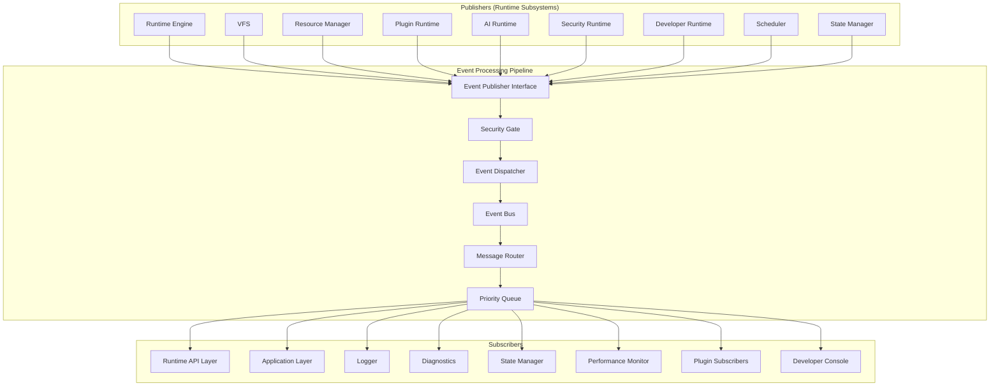
```mermaid
graph TD
    subgraph Publishers["Publishers (Runtime Subsystems)"]
        P1[Runtime Engine]
        P2[VFS]
        P3[Resource Manager]
        P4[Plugin Runtime]
        P5[AI Runtime]
        P6[Security Runtime]
        P7[Developer Runtime]
        P8[Scheduler]
        P9[State Manager]
    end

    subgraph Pipeline["Event Processing Pipeline"]
        EP[Event Publisher Interface]
        SG[Security Gate]
        ED[Event Dispatcher]
        EB[Event Bus]
        MR[Message Router]
        PQ[Priority Queue]
    end

    subgraph Subscribers["Subscribers"]
        S1[Runtime API Layer]
        S2[Application Layer]
        S3[Logger]
        S4[Diagnostics]
        S5[State Manager]
        S6[Performance Monitor]
        S7[Plugin Subscribers]
        S8[Developer Console]
    end

    P1 & P2 & P3 & P4 & P5 & P6 & P7 & P8 & P9 --> EP
    EP --> SG
    SG --> ED
    ED --> EB
    EB --> MR
    MR --> PQ
    PQ --> S1 & S2 & S3 & S4 & S5 & S6 & S7 & S8
```

### 2.2 Component Definitions

#### 2.2.1 Event Publisher Interface

The Event Publisher Interface is the single entry point through which all
runtime subsystems emit events. It is a thin, synchronous facade that
accepts a typed event, stamps it with a monotonic timestamp and a unique
Event ID, and forwards it to the Security Gate. Publishers never interact
with the Bus, Router, or Queue directly.

**Responsibilities:**
- Accept typed event emissions from any authorized subsystem
- Assign a globally unique Event ID (UUID v4)
- Stamp the monotonic emission timestamp
- Attach the publisher's component identity
- Forward to the Security Gate

**Ownership:** `ldfx-runtime/src/events/api/publisher.rs`

#### 2.2.2 Security Gate

The Security Gate is a synchronous, blocking checkpoint that every event
must pass before entering the Dispatcher. It validates the publisher's
authorization to emit the given event type, verifies the payload structure,
checks rate limits, and rejects any event that violates the security policy.

**Responsibilities:**
- Verify publisher identity and authorization
- Validate payload schema against the registered event schema
- Enforce per-publisher rate limits
- Reject plugin-emitted lifecycle events
- Reject AI-emitted security events
- Stamp the security clearance label on approved events

**Ownership:** `ldfx-runtime/src/events/security/gate.rs`

#### 2.2.3 Event Dispatcher

The Event Dispatcher receives security-cleared events and is responsible
for resolving the subscriber list, applying filters, determining delivery
mode (synchronous vs. asynchronous), and handing events to the Bus.

**Responsibilities:**
- Resolve the subscriber list for each event type
- Apply subscriber-defined filters
- Determine delivery mode per event priority
- Enforce cancellation semantics
- Emit dispatch trace records
- Hand approved events to the Event Bus

**Ownership:** `ldfx-runtime/src/events/dispatcher/`

#### 2.2.4 Event Bus

The Event Bus is the central routing fabric. It receives dispatched events
and routes them to the correct channel — broadcast, point-to-point,
multicast, or namespaced. It owns the channel topology and manages the
lifetime of all active channels.

**Responsibilities:**
- Maintain the channel registry (broadcast, p2p, multicast, namespace)
- Route events to the correct channel(s)
- Support hierarchical namespace routing
- Isolate plugin channels from internal channels
- Support future distributed runtime extension points

**Ownership:** `ldfx-runtime/src/events/bus/`

#### 2.2.5 Message Router

The Message Router sits between the Bus and the Priority Queue. It applies
topic-based and namespace-based routing rules, resolves wildcard
subscriptions, and determines the final delivery target list for each event.

**Responsibilities:**
- Apply topic routing rules
- Resolve wildcard and namespace subscriptions
- Deduplicate delivery targets
- Apply hierarchical routing (parent namespace receives child events)
- Enforce plugin routing isolation

**Ownership:** `ldfx-runtime/src/events/router/`

#### 2.2.6 Priority Queue

The Priority Queue holds events pending delivery and schedules them for
execution according to their priority tier. It owns seven distinct queues
and the scheduling algorithm that determines which queue is serviced next.

**Responsibilities:**
- Maintain seven priority tiers (Critical → Idle → Retry → Dead Letter)
- Schedule delivery according to priority and fairness rules
- Enforce queue depth limits and overflow policy
- Manage the Retry Queue for failed deliveries
- Route unrecoverable events to the Dead Letter Queue

**Ownership:** `ldfx-runtime/src/events/queue/`

#### 2.2.7 Subscriber Registry

The Subscriber Registry maintains the complete map of event type → subscriber
list. It handles subscription registration, deregistration, one-time
listener cleanup, and memory management for subscriber handles.

**Responsibilities:**
- Register and deregister subscribers
- Maintain priority-ordered subscriber lists per event type
- Clean up one-time listeners after first delivery
- Detect and remove dangling subscriber references
- Enforce maximum subscriber count per event type

**Ownership:** `ldfx-runtime/src/events/subscriptions/`

### 2.3 Data Flow — Full Event Processing Sequence

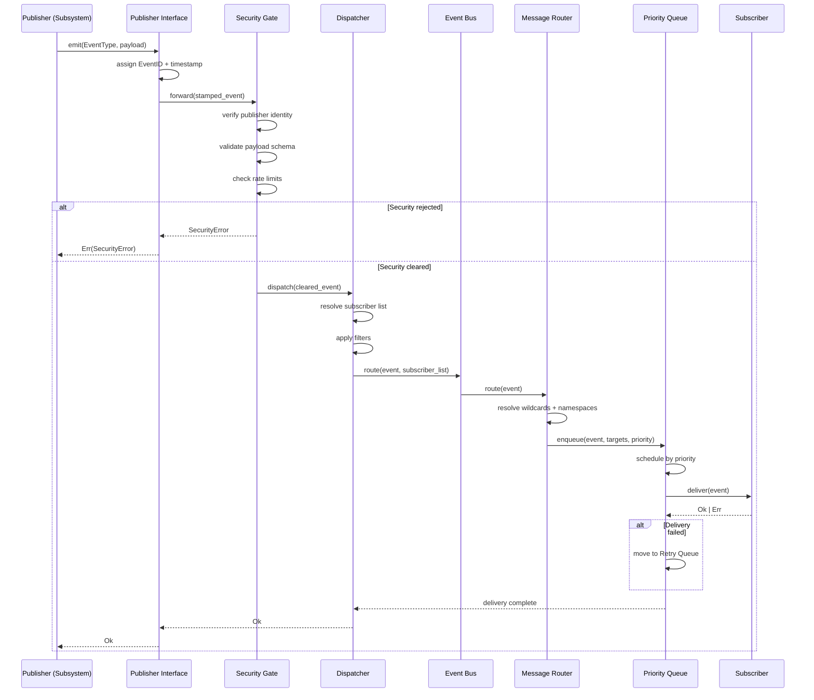
```mermaid
sequenceDiagram
    participant PUB as Publisher (Subsystem)
    participant EPI as Publisher Interface
    participant SG as Security Gate
    participant ED as Dispatcher
    participant EB as Event Bus
    participant MR as Message Router
    participant PQ as Priority Queue
    participant SUB as Subscriber

    PUB->>EPI: emit(EventType, payload)
    EPI->>EPI: assign EventID + timestamp
    EPI->>SG: forward(stamped_event)
    SG->>SG: verify publisher identity
    SG->>SG: validate payload schema
    SG->>SG: check rate limits
    alt Security rejected
        SG-->>EPI: SecurityError
        EPI-->>PUB: Err(SecurityError)
    else Security cleared
        SG->>ED: dispatch(cleared_event)
        ED->>ED: resolve subscriber list
        ED->>ED: apply filters
        ED->>EB: route(event, subscriber_list)
        EB->>MR: route(event)
        MR->>MR: resolve wildcards + namespaces
        MR->>PQ: enqueue(event, targets, priority)
        PQ->>PQ: schedule by priority
        PQ->>SUB: deliver(event)
        SUB-->>PQ: Ok | Err
        alt Delivery failed
            PQ->>PQ: move to Retry Queue
        end
        PQ-->>ED: delivery complete
        ED-->>EPI: Ok
        EPI-->>PUB: Ok
    end
```

### 2.4 Initialization Sequence

The Event System initializes as part of the Core Runtime boot sequence
defined in Part 2.1 Module 04. It must be fully operational before any
other subsystem emits its first event.

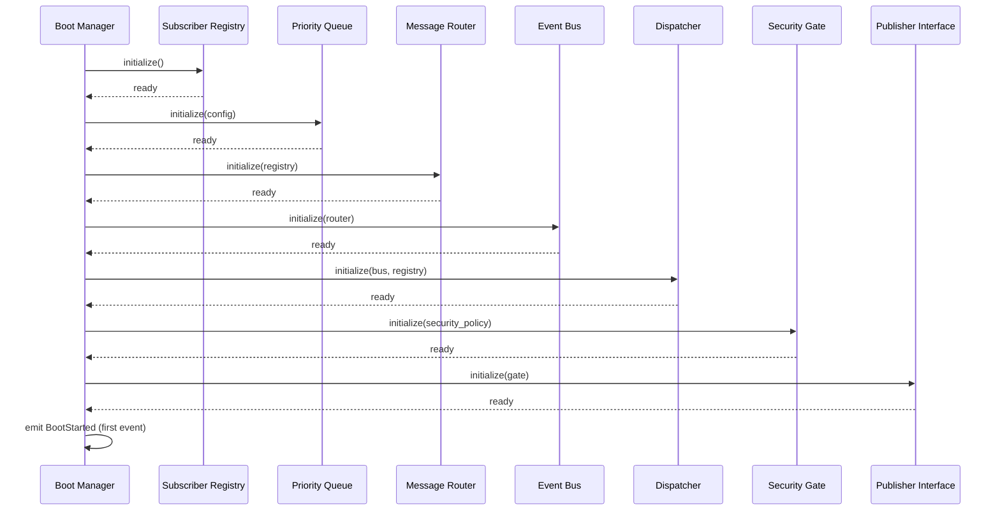
```mermaid
sequenceDiagram
    participant BOOT as Boot Manager
    participant SR as Subscriber Registry
    participant PQ as Priority Queue
    participant MR as Message Router
    participant EB as Event Bus
    participant ED as Dispatcher
    participant SG as Security Gate
    participant EPI as Publisher Interface

    BOOT->>SR: initialize()
    SR-->>BOOT: ready
    BOOT->>PQ: initialize(config)
    PQ-->>BOOT: ready
    BOOT->>MR: initialize(registry)
    MR-->>BOOT: ready
    BOOT->>EB: initialize(router)
    EB-->>BOOT: ready
    BOOT->>ED: initialize(bus, registry)
    ED-->>BOOT: ready
    BOOT->>SG: initialize(security_policy)
    SG-->>BOOT: ready
    BOOT->>EPI: initialize(gate)
    EPI-->>BOOT: ready
    BOOT->>BOOT: emit BootStarted (first event)
```

### 2.5 Shutdown Sequence

On shutdown, the Event System drains all queues before releasing resources.
No event is dropped during a clean shutdown.

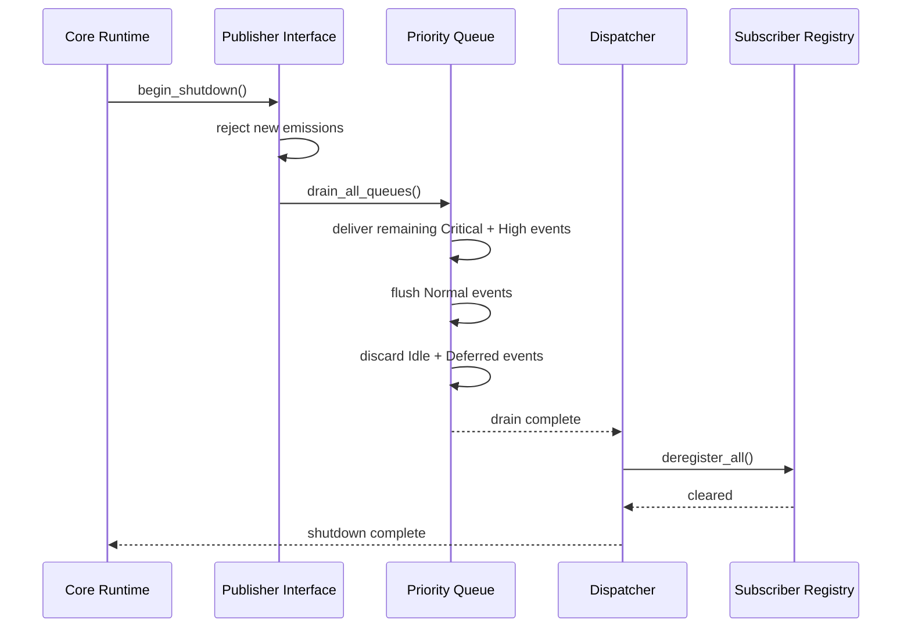
```mermaid
sequenceDiagram
    participant CORE as Core Runtime
    participant EPI as Publisher Interface
    participant PQ as Priority Queue
    participant ED as Dispatcher
    participant SR as Subscriber Registry

    CORE->>EPI: begin_shutdown()
    EPI->>EPI: reject new emissions
    EPI->>PQ: drain_all_queues()
    PQ->>PQ: deliver remaining Critical + High events
    PQ->>PQ: flush Normal events
    PQ->>PQ: discard Idle + Deferred events
    PQ-->>ED: drain complete
    ED->>SR: deregister_all()
    SR-->>ED: cleared
    ED-->>CORE: shutdown complete
```

---

## 3. Event Categories

The LDFX Event System organizes all events into 22 named families. Each
family owns a namespace prefix, a defined set of producers and consumers,
a payload schema, a default priority tier, and a security classification.

### 3.1 Category Overview

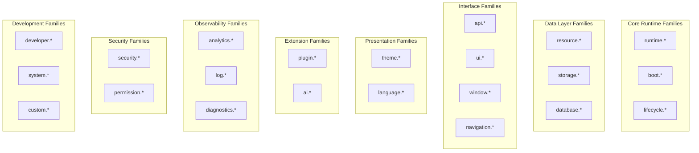
```mermaid
graph TD
    subgraph Core["Core Runtime Families"]
        RT[runtime.*]
        BOOT[boot.*]
        LC[lifecycle.*]
    end
    subgraph Data["Data Layer Families"]
        RES[resource.*]
        STOR[storage.*]
        DB[database.*]
    end
    subgraph Interface["Interface Families"]
        API[api.*]
        UI[ui.*]
        WIN[window.*]
        NAV[navigation.*]
    end
    subgraph Presentation["Presentation Families"]
        THEME[theme.*]
        LANG[language.*]
    end
    subgraph Extension["Extension Families"]
        PLUG[plugin.*]
        AI[ai.*]
    end
    subgraph Observability["Observability Families"]
        ANAL[analytics.*]
        LOG[log.*]
        DIAG[diagnostics.*]
    end
    subgraph Security["Security Families"]
        SEC[security.*]
        PERM[permission.*]
    end
    subgraph Development["Development Families"]
        DEV[developer.*]
        SYS[system.*]
        CUST[custom.*]
    end
```

### 3.2 Family Definitions

#### 3.2.1 `runtime.*` — Runtime Events

| Field | Value |
|---|---|
| Purpose | Top-level runtime state transitions |
| Producers | Runtime Kernel, Boot Manager, Lifecycle Manager |
| Consumers | Application Layer, State Manager, Logger, Diagnostics |
| Default Priority | High |
| Security Class | Internal — not accessible to plugins or documents |

| Event | Priority | Cancellable | Description |
|---|---|---|---|
| `runtime.created` | High | No | Runtime object instantiated |
| `runtime.initializing` | High | No | Boot sequence started |
| `runtime.ready` | Critical | No | Boot complete, document available |
| `runtime.running` | High | No | Active user session started |
| `runtime.idle` | Low | No | Idle timeout elapsed |
| `runtime.paused` | High | No | Runtime paused by host |
| `runtime.background` | High | No | Runtime moved to background |
| `runtime.restoring` | High | No | Restoring from paused state |
| `runtime.sleeping` | High | No | OS suspend signal received |
| `runtime.resuming` | High | No | OS resume signal received |
| `runtime.updating` | Normal | No | Document update in progress |
| `runtime.restarting` | High | No | Restart sequence started |
| `runtime.closing` | Critical | No | Shutdown sequence started |
| `runtime.destroyed` | Critical | No | All resources released |
| `runtime.error` | Critical | No | Unrecoverable runtime error |

**Payload — `runtime.ready`:**
```
{
  event_id:      UUID,
  session_id:    UUID,
  document_id:   UUID,
  boot_mode:     "cold" | "warm" | "recovery" | "safe",
  elapsed_ms:    u64,
  page_count:    u32,
  plugin_count:  u32,
  warnings:      Vec<String>
}
```

---

#### 3.2.2 `boot.*` — Boot Events

| Field | Value |
|---|---|
| Purpose | Granular boot sequence progress reporting |
| Producers | Boot Manager |
| Consumers | Logger, Diagnostics, Developer Console, Performance Monitor |
| Default Priority | Normal |
| Security Class | Internal |

| Event | Priority | Description |
|---|---|---|
| `boot.started` | Normal | Boot sequence initiated |
| `boot.header_verified` | Normal | 64-byte binary header validated |
| `boot.container_opened` | Normal | ZIP container opened at offset 64 |
| `boot.manifest_loaded` | Normal | manifest.json parsed and validated |
| `boot.version_verified` | Normal | Version compatibility confirmed |
| `boot.integrity_verified` | High | All SHA-256 hashes verified |
| `boot.signature_verified` | High | Digital signatures validated |
| `boot.metadata_loaded` | Normal | metadata.json parsed |
| `boot.config_resolved` | Normal | Configuration hierarchy resolved |
| `boot.resources_loading` | Normal | Resource loading pipeline started |
| `boot.resources_ready` | High | Entry page and hot assets loaded |
| `boot.plugins_discovered` | Normal | Plugin index loaded |
| `boot.plugins_ready` | Normal | All required plugins initialized |
| `boot.failed` | Critical | Boot sequence failed — unrecoverable |
| `boot.stage_complete` | Low | A named boot stage completed |

**Payload — `boot.failed`:**
```
{
  event_id:      UUID,
  phase:         u8,
  phase_name:    String,
  error_code:    String,
  error_message: String,
  elapsed_ms:    u64,
  recoverable:   bool
}
```

---

#### 3.2.3 `lifecycle.*` — Lifecycle Events

| Field | Value |
|---|---|
| Purpose | Document and session lifecycle transitions |
| Producers | Lifecycle Manager, Runtime Engine |
| Consumers | Application Layer, State Manager, Plugin Runtime, AI Runtime |
| Default Priority | High |
| Security Class | Internal — plugins receive a filtered subset only |

| Event | Priority | Cancellable | Description |
|---|---|---|---|
| `lifecycle.document_opened` | High | No | Document session started |
| `lifecycle.document_closing` | High | Yes | Document about to close |
| `lifecycle.document_closed` | High | No | Document session ended |
| `lifecycle.session_started` | High | No | User session began |
| `lifecycle.session_ended` | High | No | User session ended |
| `lifecycle.page_entered` | Normal | No | User navigated to a page |
| `lifecycle.page_exited` | Normal | No | User left a page |
| `lifecycle.focus_gained` | Normal | No | Runtime window gained focus |
| `lifecycle.focus_lost` | Normal | No | Runtime window lost focus |
| `lifecycle.visibility_changed` | Normal | No | Visibility state changed |

---

#### 3.2.4 `resource.*` — Resource Events

| Field | Value |
|---|---|
| Purpose | Asset and page loading pipeline status |
| Producers | Resource Manager |
| Consumers | Runtime Engine, Logger, Performance Monitor, Developer Console |
| Default Priority | Normal |
| Security Class | Internal + filtered plugin access |

| Event | Priority | Description |
|---|---|---|
| `resource.page_load_started` | Normal | Page load initiated |
| `resource.page_loaded` | High | Page content available in memory |
| `resource.page_load_failed` | High | Page load failed |
| `resource.page_released` | Low | Page evicted from cache |
| `resource.asset_load_started` | Normal | Asset load initiated |
| `resource.asset_loaded` | Normal | Asset available in memory |
| `resource.asset_load_failed` | Normal | Asset load failed |
| `resource.asset_released` | Low | Asset evicted from cache |
| `resource.cache_pressure` | Normal | Cache approaching size limit |
| `resource.cache_evicted` | Low | Entries evicted from cache |
| `resource.prefetch_complete` | Low | Prefetch batch completed |

**Payload — `resource.page_loaded`:**
```
{
  event_id:     UUID,
  page_id:      String,
  page_path:    String,
  page_number:  u32,
  load_time_ms: u64,
  from_cache:   bool,
  byte_size:    u64
}
```

---

#### 3.2.5 `storage.*` — Storage Events

| Field | Value |
|---|---|
| Purpose | Session state and persistent storage operations |
| Producers | State Manager, Storage Service |
| Consumers | Application Layer, Logger, Diagnostics |
| Default Priority | Low |
| Security Class | Internal |

| Event | Description |
|---|---|
| `storage.value_set` | A key-value pair was written |
| `storage.value_deleted` | A key was deleted |
| `storage.cleared` | All storage was cleared |
| `storage.persisted` | State written to warm store |
| `storage.restored` | State restored from warm store |
| `storage.quota_exceeded` | Storage quota limit reached |

---

#### 3.2.6 `database.*` — Database Events

| Field | Value |
|---|---|
| Purpose | Embedded document database operations |
| Producers | Database Service |
| Consumers | Application Layer, Logger |
| Default Priority | Normal |
| Security Class | Internal + document-scoped access |

| Event | Description |
|---|---|
| `database.opened` | Database connection established |
| `database.closed` | Database connection closed |
| `database.query_executed` | A query completed |
| `database.transaction_committed` | Transaction committed |
| `database.transaction_rolled_back` | Transaction rolled back |
| `database.schema_migrated` | Schema migration applied |
| `database.error` | Database operation failed |

---

#### 3.2.7 `api.*` — API Events

| Field | Value |
|---|---|
| Purpose | Runtime API call lifecycle tracking |
| Producers | Runtime API Layer |
| Consumers | Developer Console, Logger, Analytics |
| Default Priority | Low |
| Security Class | Developer mode only |

| Event | Description |
|---|---|
| `api.call_started` | An API method was invoked |
| `api.call_completed` | An API method returned successfully |
| `api.call_failed` | An API method returned an error |
| `api.rate_limited` | A caller exceeded the API rate limit |

---

#### 3.2.8 `ui.*` — UI Events

| Field | Value |
|---|---|
| Purpose | User interaction and rendering state |
| Producers | Runtime Engine (Render Pipeline), Viewer |
| Consumers | Application Layer, Analytics, Plugin Runtime |
| Default Priority | Normal |
| Security Class | Document-accessible |

| Event | Description |
|---|---|
| `ui.render_started` | Frame render began |
| `ui.render_complete` | Frame render completed |
| `ui.render_failed` | Frame render failed |
| `ui.scroll_changed` | Scroll position changed |
| `ui.zoom_changed` | Zoom level changed |
| `ui.selection_changed` | User text selection changed |
| `ui.interaction` | Generic user interaction (click, tap, key) |
| `ui.layout_complete` | Layout pass completed |

---

#### 3.2.9 `window.*` — Window Events

| Field | Value |
|---|---|
| Purpose | Host window and viewport state changes |
| Producers | Platform Adapter, Viewer |
| Consumers | Runtime Engine, Layout Engine, Application Layer |
| Default Priority | Normal |
| Security Class | Document-accessible (read-only) |

| Event | Description |
|---|---|
| `window.resized` | Window dimensions changed |
| `window.moved` | Window position changed |
| `window.focused` | Window gained OS focus |
| `window.blurred` | Window lost OS focus |
| `window.fullscreen_entered` | Fullscreen mode activated |
| `window.fullscreen_exited` | Fullscreen mode deactivated |
| `window.dpi_changed` | Display DPI/scale factor changed |
| `window.closed` | Window close requested |

---

#### 3.2.10 `navigation.*` — Navigation Events

| Field | Value |
|---|---|
| Purpose | Document navigation and history |
| Producers | Navigation Engine |
| Consumers | Application Layer, State Manager, Analytics |
| Default Priority | Normal |
| Security Class | Document-accessible |

| Event | Cancellable | Description |
|---|---|---|
| `navigation.navigate_started` | Yes | Navigation to a target initiated |
| `navigation.navigate_complete` | No | Navigation completed |
| `navigation.navigate_failed` | No | Navigation failed |
| `navigation.history_pushed` | No | History entry added |
| `navigation.history_popped` | No | History entry removed |
| `navigation.deep_link_resolved` | No | Deep link target resolved |
| `navigation.guard_blocked` | No | Navigation guard prevented navigation |

---

#### 3.2.11 `theme.*` — Theme Events

| Field | Value |
|---|---|
| Purpose | Visual theme and appearance changes |
| Producers | Theme Service |
| Consumers | Runtime Engine, Application Layer, Plugin Runtime |
| Default Priority | Normal |
| Security Class | Document-accessible |

| Event | Description |
|---|---|
| `theme.changed` | Active theme switched |
| `theme.token_updated` | A design token value changed |
| `theme.mode_changed` | Light/dark/system mode changed |
| `theme.custom_applied` | A custom theme was applied |

---

#### 3.2.12 `language.*` — Localization Events

| Field | Value |
|---|---|
| Purpose | Language and locale changes |
| Producers | Language Service |
| Consumers | Runtime Engine, Application Layer, Plugin Runtime |
| Default Priority | Normal |
| Security Class | Document-accessible |

| Event | Description |
|---|---|
| `language.changed` | Active language changed |
| `language.locale_changed` | Locale (date/number format) changed |
| `language.strings_loaded` | Language string bundle loaded |
| `language.fallback_used` | Missing string fell back to default |

---

#### 3.2.13 `plugin.*` — Plugin Events

| Field | Value |
|---|---|
| Purpose | Plugin lifecycle and inter-plugin messaging |
| Producers | Plugin Runtime, individual plugins (sandboxed) |
| Consumers | Runtime Engine, Application Layer, Developer Console |
| Default Priority | Normal |
| Security Class | Sandboxed — plugins cannot emit lifecycle events |

| Event | Priority | Description |
|---|---|---|
| `plugin.loading` | Normal | Plugin load started |
| `plugin.ready` | Normal | Plugin initialized |
| `plugin.failed` | High | Plugin failed to load |
| `plugin.crashed` | High | Plugin crashed during execution |
| `plugin.restarted` | Normal | Plugin restarted after crash |
| `plugin.terminated` | Normal | Plugin shut down cleanly |
| `plugin.message` | Normal | Plugin emitted a custom message |
| `plugin.permission_requested` | High | Plugin requested a permission |
| `plugin.sandbox_violation` | Critical | Plugin attempted sandbox escape |

---

#### 3.2.14 `ai.*` — AI Events

| Field | Value |
|---|---|
| Purpose | AI service operations and results |
| Producers | AI Runtime |
| Consumers | Application Layer, Plugin Runtime, Analytics |
| Default Priority | Normal |
| Security Class | Rate-limited — AI cannot emit security or lifecycle events |

| Event | Description |
|---|---|
| `ai.session_started` | AI session initialized |
| `ai.session_ended` | AI session closed |
| `ai.inference_started` | Inference request submitted |
| `ai.inference_complete` | Inference result available |
| `ai.inference_failed` | Inference request failed |
| `ai.model_loaded` | AI model loaded into memory |
| `ai.model_unloaded` | AI model released from memory |
| `ai.quota_exceeded` | AI usage quota reached |
| `ai.content_filtered` | AI output filtered by safety policy |

---

#### 3.2.15 `analytics.*` — Analytics Events

| Field | Value |
|---|---|
| Purpose | Usage telemetry and behavioral analytics |
| Producers | Analytics Service, Runtime Engine |
| Consumers | Analytics Service (aggregator), Logger |
| Default Priority | Low |
| Security Class | PII-stripped before emission |

| Event | Description |
|---|---|
| `analytics.page_view` | A page was viewed |
| `analytics.interaction` | A user interaction was recorded |
| `analytics.session_summary` | Session summary emitted on close |
| `analytics.feature_used` | A named feature was used |
| `analytics.error_encountered` | A user-visible error occurred |

---

#### 3.2.16 `log.*` — Logging Events

| Field | Value |
|---|---|
| Purpose | Structured log record emission |
| Producers | All subsystems |
| Consumers | Logger Service, Developer Console |
| Default Priority | Low |
| Security Class | Internal — log payloads are redacted in production |

| Event | Description |
|---|---|
| `log.trace` | Trace-level log record |
| `log.debug` | Debug-level log record |
| `log.info` | Info-level log record |
| `log.warn` | Warning-level log record |
| `log.error` | Error-level log record |
| `log.critical` | Critical-level log record |

---

#### 3.2.17 `diagnostics.*` — Diagnostics Events

| Field | Value |
|---|---|
| Purpose | Runtime health and diagnostic data |
| Producers | All subsystems, Performance Monitor |
| Consumers | Diagnostics Service, Developer Console |
| Default Priority | Low |
| Security Class | Developer mode only |

| Event | Description |
|---|---|
| `diagnostics.health_check` | Periodic health snapshot |
| `diagnostics.memory_snapshot` | Memory usage snapshot |
| `diagnostics.cpu_snapshot` | CPU usage snapshot |
| `diagnostics.queue_snapshot` | Event queue depth snapshot |
| `diagnostics.slow_event` | An event exceeded delivery latency target |
| `diagnostics.dead_letter` | An event reached the Dead Letter Queue |

---

#### 3.2.18 `security.*` — Security Events

| Field | Value |
|---|---|
| Purpose | Security enforcement and audit trail |
| Producers | Security Runtime, Security Gate |
| Consumers | Logger (always), Diagnostics, Application Layer |
| Default Priority | Critical or High |
| Security Class | Immutable — cannot be suppressed, filtered, or cancelled |

| Event | Priority | Description |
|---|---|---|
| `security.integrity_verified` | High | All hashes passed |
| `security.integrity_violation` | Critical | Hash mismatch detected |
| `security.signature_valid` | High | Signature verified |
| `security.signature_invalid` | Critical | Signature verification failed |
| `security.violation` | Critical | Security policy violated |
| `security.sandbox_violation` | Critical | Plugin escaped sandbox |
| `security.rate_limit_exceeded` | High | Publisher exceeded rate limit |
| `security.tamper_detected` | Critical | Event payload tamper detected |
| `security.replay_detected` | Critical | Replay attack detected |

---

#### 3.2.19 `permission.*` — Permission Events

| Field | Value |
|---|---|
| Purpose | Permission grant, denial, and request lifecycle |
| Producers | Permission Engine |
| Consumers | Application Layer, Plugin Runtime, Logger |
| Default Priority | High |
| Security Class | Always logged |

| Event | Cancellable | Description |
|---|---|---|
| `permission.requested` | Yes | Permission prompt required |
| `permission.granted` | No | Permission granted |
| `permission.denied` | No | Permission denied |
| `permission.revoked` | No | Previously granted permission revoked |
| `permission.escalation_required` | Yes | Higher privilege required |

---

#### 3.2.20 `developer.*` — Developer Events

| Field | Value |
|---|---|
| Purpose | Developer tooling, breakpoints, and inspection |
| Producers | Developer Runtime |
| Consumers | Developer Console, IDE extensions |
| Default Priority | Low |
| Security Class | Developer mode only — stripped in production builds |

| Event | Description |
|---|---|
| `developer.breakpoint_hit` | A developer breakpoint was triggered |
| `developer.inspect_requested` | Element inspection requested |
| `developer.profiler_started` | Profiler session started |
| `developer.profiler_stopped` | Profiler session ended |
| `developer.console_message` | Message emitted to developer console |
| `developer.hot_reload` | Hot reload triggered |

---

#### 3.2.21 `system.*` — System Events

| Field | Value |
|---|---|
| Purpose | Host OS and platform-level signals |
| Producers | Platform Adapter |
| Consumers | Runtime Kernel, Lifecycle Manager |
| Default Priority | High |
| Security Class | Internal |

| Event | Description |
|---|---|
| `system.memory_pressure` | OS memory pressure signal received |
| `system.memory_critical` | OS critical memory warning |
| `system.cpu_throttled` | OS CPU throttling applied |
| `system.suspend` | OS suspend signal |
| `system.resume` | OS resume signal |
| `system.network_changed` | Network connectivity changed |
| `system.locale_changed` | OS locale changed |
| `system.timezone_changed` | OS timezone changed |

---

#### 3.2.22 `custom.*` — Custom Events

| Field | Value |
|---|---|
| Purpose | Document-defined and plugin-defined custom events |
| Producers | Plugins, document scripts (sandboxed) |
| Consumers | Other plugins, document scripts, Application Layer |
| Default Priority | Normal |
| Security Class | Sandboxed — cannot use reserved namespaces |

Custom events must use the `custom.` prefix followed by a plugin-scoped
namespace: `custom.<plugin_id>.<event_name>`. The Event System rejects any
custom event that attempts to use a reserved namespace prefix (`runtime.*`,
`boot.*`, `security.*`, etc.).

---

## 4. Event Lifecycle

Every event in the LDFX Event System passes through a defined sequence of
states from the moment it is emitted to the moment it is archived or
discarded. This lifecycle is enforced by the Event System infrastructure —
no event may skip a state or transition backward.

### 4.1 Lifecycle State Diagram

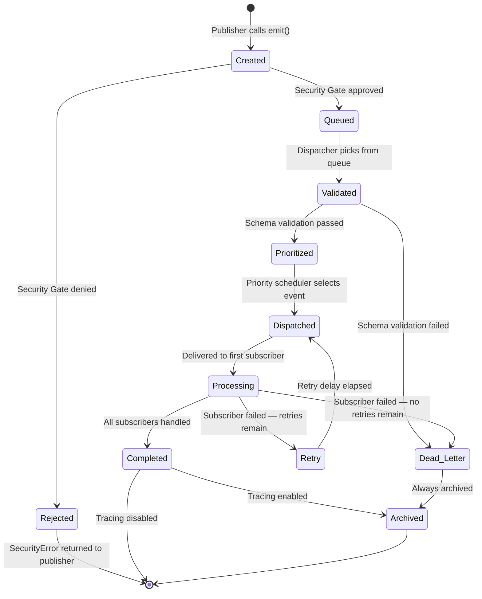
```mermaid
stateDiagram-v2
    [*] --> Created : Publisher calls emit()
    Created --> Queued : Security Gate approved
    Created --> Rejected : Security Gate denied
    Rejected --> [*] : SecurityError returned to publisher

    Queued --> Validated : Dispatcher picks from queue
    Validated --> Prioritized : Schema validation passed
    Validated --> Dead_Letter : Schema validation failed

    Prioritized --> Dispatched : Priority scheduler selects event
    Dispatched --> Processing : Delivered to first subscriber
    Processing --> Completed : All subscribers handled
    Processing --> Retry : Subscriber failed — retries remain
    Processing --> Dead_Letter : Subscriber failed — no retries remain

    Retry --> Dispatched : Retry delay elapsed
    Completed --> Archived : Tracing enabled
    Completed --> [*] : Tracing disabled
    Dead_Letter --> Archived : Always archived
    Archived --> [*]
```

### 4.2 State Definitions

| State | Description | Owner |
|---|---|---|
| `Created` | Event object constructed, EventID and timestamp assigned | Publisher Interface |
| `Queued` | Event accepted by Security Gate, placed in Priority Queue | Security Gate → Queue |
| `Rejected` | Event denied by Security Gate — never enters the queue | Security Gate |
| `Validated` | Dispatcher confirmed payload schema against registered schema | Dispatcher |
| `Prioritized` | Priority scheduler assigned the event a delivery slot | Priority Queue |
| `Dispatched` | Event handed to the first subscriber in the delivery list | Dispatcher |
| `Processing` | Event is actively being processed by one or more subscribers | Subscriber |
| `Completed` | All subscribers have handled the event | Dispatcher |
| `Retry` | Delivery failed — event placed in Retry Queue with backoff | Retry Queue |
| `Dead_Letter` | All retries exhausted or validation failed — event undeliverable | Dead Letter Queue |
| `Archived` | Event record written to trace log | Tracing Service |

### 4.3 State Transitions

#### 4.3.1 Created → Queued

**Trigger:** Publisher Interface forwards the stamped event to the Security Gate
and the Security Gate approves it.

**Actions performed:**
- Security Gate stamps the `security_clearance` label on the event
- Event is assigned to the correct priority queue tier
- Queue depth check is performed — if the queue is full, `OverflowError` is
  returned to the publisher and the event is dropped

**Failure path:** If the Security Gate rejects the event, the state
transitions to `Rejected` and a `SecurityError` is returned synchronously
to the publisher. A `security.rate_limit_exceeded` or `security.violation`
event is emitted by the Security Gate itself.

#### 4.3.2 Queued → Validated

**Trigger:** The Dispatcher picks the event from the Priority Queue for
processing.

**Actions performed:**
- Dispatcher re-validates the payload schema (defense-in-depth — the
  Security Gate performed the first validation)
- Dispatcher resolves the subscriber list for the event type
- If no subscribers exist, the event transitions directly to `Completed`
  (silent delivery — not an error)

**Failure path:** If schema re-validation fails (payload was mutated in the
queue — tamper detection), the event transitions to `Dead_Letter` and a
`security.tamper_detected` event is emitted.

#### 4.3.3 Validated → Prioritized

**Trigger:** Schema validation passed.

**Actions performed:**
- Priority scheduler assigns the event a delivery slot based on its priority
  tier and the current queue state
- Fairness algorithm ensures lower-priority events are not starved
- Cancellable events check if a cancellation has been registered

#### 4.3.4 Prioritized → Dispatched

**Trigger:** Priority scheduler selects the event for delivery.

**Actions performed:**
- Dispatcher iterates the subscriber list in priority order
- For synchronous delivery (Critical priority): dispatcher blocks until all
  subscribers complete
- For asynchronous delivery (all other priorities): dispatcher hands the
  event to the async executor and returns immediately

#### 4.3.5 Dispatched → Processing

**Trigger:** First subscriber callback is invoked.

**Actions performed:**
- Subscriber timeout timer starts
- Trace record updated with delivery start timestamp
- For cancellable events: cancellation flag is checked before each subscriber

#### 4.3.6 Processing → Completed

**Trigger:** All subscribers in the delivery list have returned `Ok` or
have been skipped due to cancellation.

**Actions performed:**
- Trace record updated with completion timestamp and delivery duration
- One-time listeners are deregistered from the Subscriber Registry
- If tracing is enabled, event is forwarded to the Archiver

#### 4.3.7 Processing → Retry

**Trigger:** A subscriber returned `Err` or timed out, and the event has
remaining retry attempts.

**Retry policy:**

| Attempt | Delay |
|---|---|
| 1st retry | 50 ms |
| 2nd retry | 200 ms |
| 3rd retry | 1000 ms |
| 4th retry | 5000 ms |
| 5th retry (final) | 15000 ms |

After the final retry, the event transitions to `Dead_Letter`.

**Note:** Critical priority events do not use the Retry Queue. A Critical
event that fails delivery triggers an immediate `runtime.error` event and
initiates the emergency shutdown sequence.

#### 4.3.8 Processing → Dead Letter

**Trigger:** All retry attempts exhausted, or schema tamper detected, or
the event is a non-retryable type (security events that fail delivery).

**Actions performed:**
- Event record written to the Dead Letter Queue with full failure context
- `diagnostics.dead_letter` event emitted
- If the dead-lettered event was Critical priority, `runtime.error` is
  emitted and the runtime enters the error recovery state

#### 4.3.9 Completed / Dead Letter → Archived

**Trigger:** Tracing is enabled (always in developer mode; configurable in
production).

**Actions performed:**
- Full event record (payload, subscriber list, delivery times, outcome)
  written to the trace log
- Trace record is immutable after archival
- Archived records are retained for the duration of the session and
  optionally persisted to disk in developer mode

### 4.4 Timeout Rules

| Priority Tier | Subscriber Timeout | Dispatcher Timeout |
|---|---|---|
| Critical | 100 ms | 500 ms |
| High | 500 ms | 2000 ms |
| Normal | 2000 ms | 10000 ms |
| Low | 5000 ms | 30000 ms |
| Deferred | 10000 ms | 60000 ms |

A subscriber that exceeds its timeout is considered failed. The event
proceeds to the next subscriber. The timed-out subscriber is flagged in
the Subscriber Registry and a `diagnostics.slow_event` record is emitted.

### 4.5 Recovery Paths

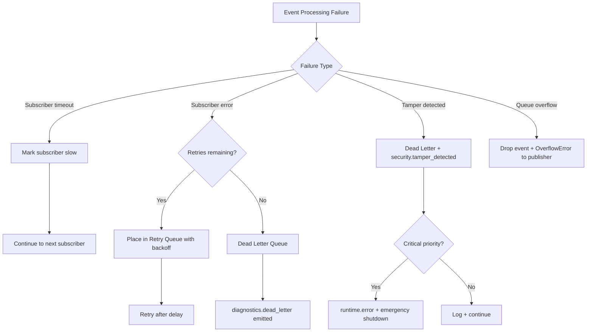
```mermaid
flowchart TD
    A[Event Processing Failure] --> B{Failure Type}
    B -->|Subscriber timeout| C[Mark subscriber slow]
    B -->|Subscriber error| D{Retries remaining?}
    B -->|Tamper detected| E[Dead Letter + security.tamper_detected]
    B -->|Queue overflow| F[Drop event + OverflowError to publisher]

    C --> G[Continue to next subscriber]
    D -->|Yes| H[Place in Retry Queue with backoff]
    D -->|No| I[Dead Letter Queue]
    H --> J[Retry after delay]
    I --> K[diagnostics.dead_letter emitted]
    E --> L{Critical priority?}
    L -->|Yes| M[runtime.error + emergency shutdown]
    L -->|No| N[Log + continue]
```

---

## 5. Event Dispatcher

The Event Dispatcher is the central coordination component of the Event
System. It sits between the Security Gate and the Event Bus and is
responsible for the complete delivery lifecycle of every approved event.

### 5.1 Dispatcher Architecture

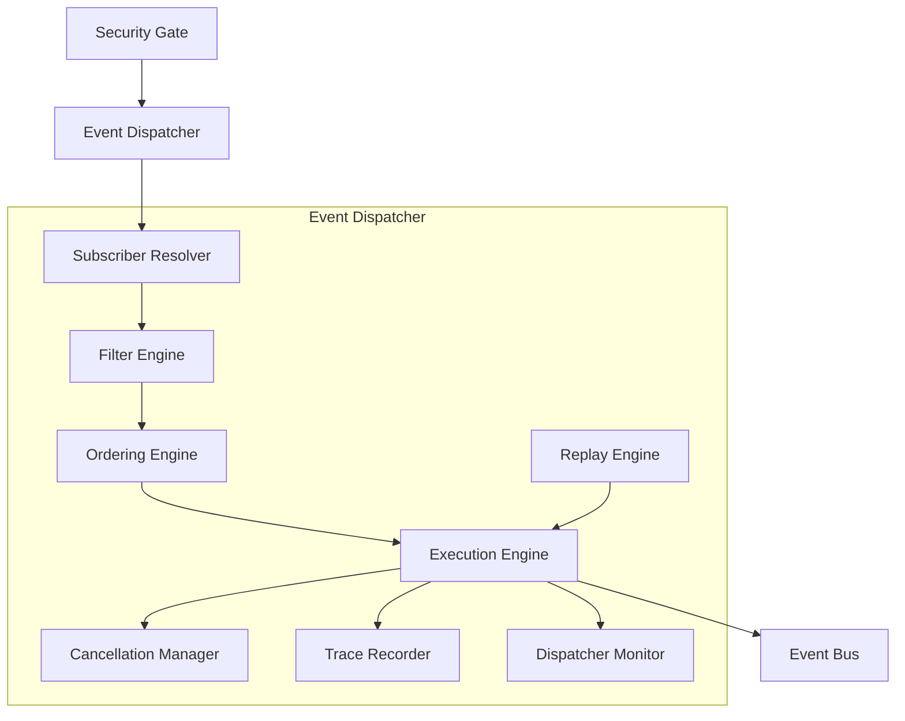
```mermaid
graph TD
    SG[Security Gate] --> DISP[Event Dispatcher]

    subgraph Dispatcher["Event Dispatcher"]
        REG[Subscriber Resolver]
        FILT[Filter Engine]
        ORD[Ordering Engine]
        EXEC[Execution Engine]
        CANCEL[Cancellation Manager]
        REPLAY[Replay Engine]
        TRACE[Trace Recorder]
        MON[Dispatcher Monitor]
    end

    DISP --> REG
    REG --> FILT
    FILT --> ORD
    ORD --> EXEC
    EXEC --> CANCEL
    EXEC --> TRACE
    EXEC --> MON
    REPLAY --> EXEC
    EXEC --> EB[Event Bus]
```

### 5.2 Dispatcher Responsibilities

#### 5.2.1 Registration

The Dispatcher maintains the authoritative Subscriber Registry. All
subscription and unsubscription operations pass through the Dispatcher,
which delegates to the Subscriber Registry for storage.

**Registration rules:**
- A subscriber must provide a valid component identity
- A subscriber must specify the event type(s) it subscribes to
- A subscriber may optionally provide a filter predicate
- A subscriber may optionally specify a priority override
- Plugin subscribers are registered in an isolated plugin registry partition
- Maximum 256 subscribers per event type (configurable)
- Duplicate registrations for the same component + event type are idempotent

#### 5.2.2 Dispatch

The Dispatcher's core dispatch algorithm:

```
function dispatch(event):
    subscribers = registry.resolve(event.type)
    if subscribers.is_empty():
        mark_completed(event)
        return Ok

    filtered = filter_engine.apply(subscribers, event)
    ordered  = ordering_engine.sort(filtered)

    for subscriber in ordered:
        if cancellation_manager.is_cancelled(event):
            break
        result = execution_engine.deliver(event, subscriber)
        if result.is_err():
            handle_delivery_failure(event, subscriber, result.err())

    trace_recorder.record(event, outcome)
    mark_completed(event)
```

#### 5.2.3 Filtering

The Filter Engine applies subscriber-defined predicates before delivery.
A subscriber may register a filter function that receives the event payload
and returns `true` (deliver) or `false` (skip this subscriber).

**Filter types:**

| Filter Type | Description |
|---|---|
| Payload filter | Predicate on event payload fields |
| Source filter | Only receive events from a specific publisher |
| Session filter | Only receive events for a specific session ID |
| Priority filter | Only receive events at or above a priority threshold |
| Namespace filter | Only receive events matching a namespace pattern |

Filters are evaluated synchronously and must complete within 1 ms. A filter
that exceeds 1 ms is treated as `true` (deliver) and a warning is logged.

#### 5.2.4 Ordering

Subscribers within the same event type are delivered to in the following
order:

1. Subscribers with explicit priority override (highest first)
2. Internal runtime subscribers (Logger, State Manager, Diagnostics)
3. Application Layer subscribers
4. Plugin subscribers (in plugin registration order)
5. Developer Console subscribers (last — observer only)

Within the same tier, subscribers are delivered to in registration order
(FIFO). This ordering is deterministic and reproducible.

#### 5.2.5 Async Execution

For all non-Critical events, the Dispatcher hands delivery to the async
executor. The executor runs subscriber callbacks on the runtime's async
task pool. The Dispatcher does not block waiting for async delivery to
complete — it records the dispatch and returns immediately.

The async executor enforces per-subscriber timeouts (see Section 4.4) and
reports failures back to the Dispatcher via a completion channel.

#### 5.2.6 Parallel Execution

Subscribers that are marked `parallel_safe` in their registration may
receive the same event concurrently. The Dispatcher identifies parallel-safe
subscriber groups and dispatches to them simultaneously via the async
executor. Subscribers that are not marked `parallel_safe` are always
delivered to sequentially.

**Parallel safety rules:**
- A subscriber is `parallel_safe` only if it declares no mutable shared state
- Plugin subscribers are never `parallel_safe`
- Security and Logger subscribers are never `parallel_safe`
- The Application Layer subscriber is never `parallel_safe`

#### 5.2.7 Cancellation

Cancellable events (see Section 3) support mid-dispatch cancellation. Any
subscriber may call `event.cancel()` to stop further delivery. The
Cancellation Manager tracks the cancellation state per event.

**Cancellation rules:**
- Only subscribers with `CancellationAuthority` may cancel events
- The Application Layer always has `CancellationAuthority`
- Plugin subscribers never have `CancellationAuthority`
- Security events are never cancellable regardless of subscriber authority
- Cancellation is checked before each subscriber delivery
- After cancellation, the event transitions to `Completed` (not `Dead_Letter`)
- The cancellation reason is recorded in the trace

#### 5.2.8 Replay

The Replay Engine allows authorized components (Developer Runtime, test
harness) to re-emit archived events for debugging and testing purposes.
Replayed events are stamped with a `replay: true` flag and a reference to
the original Event ID. Subscribers may inspect this flag to distinguish
live events from replayed events.

**Replay restrictions:**
- Replay is only available in developer mode
- Security events cannot be replayed
- Replayed events do not trigger analytics recording
- Replayed events are delivered to the same subscriber list as the original

#### 5.2.9 Tracing

The Trace Recorder captures a complete record of every event's dispatch
lifecycle. Each trace record contains:

| Field | Description |
|---|---|
| `event_id` | Unique event identifier |
| `event_type` | Fully qualified event type string |
| `publisher_id` | Component that emitted the event |
| `emission_ts` | Monotonic timestamp of emission |
| `dispatch_ts` | Monotonic timestamp of dispatch start |
| `completion_ts` | Monotonic timestamp of delivery completion |
| `subscriber_count` | Number of subscribers delivered to |
| `delivery_outcomes` | Per-subscriber result (Ok / Err / Timeout / Skipped) |
| `cancelled` | Whether the event was cancelled mid-dispatch |
| `replay` | Whether this was a replayed event |
| `priority` | Priority tier used for delivery |

In production mode, trace records are kept in a ring buffer (last 10,000
events). In developer mode, all trace records are retained for the session
and can be exported.

#### 5.2.10 Monitoring

The Dispatcher Monitor exposes real-time metrics to the Diagnostics Service:

| Metric | Description |
|---|---|
| `events_dispatched_total` | Total events dispatched since boot |
| `events_failed_total` | Total events that failed delivery |
| `events_dead_lettered_total` | Total events in Dead Letter Queue |
| `dispatch_latency_p50_ms` | Median dispatch latency |
| `dispatch_latency_p99_ms` | 99th percentile dispatch latency |
| `active_subscribers_total` | Current registered subscriber count |
| `queue_depth_by_tier` | Current depth of each priority queue tier |
| `retry_queue_depth` | Current depth of the Retry Queue |

### 5.3 Dispatcher Flow Diagram

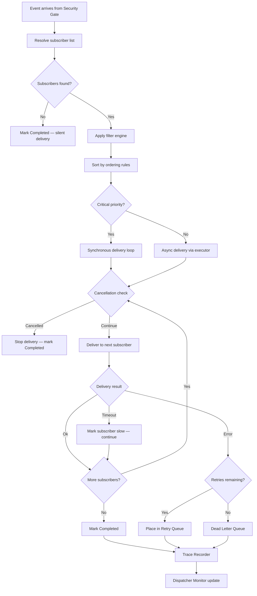
```mermaid
flowchart TD
    A[Event arrives from Security Gate] --> B[Resolve subscriber list]
    B --> C{Subscribers found?}
    C -->|No| D[Mark Completed — silent delivery]
    C -->|Yes| E[Apply filter engine]
    E --> F[Sort by ordering rules]
    F --> G{Critical priority?}
    G -->|Yes| H[Synchronous delivery loop]
    G -->|No| I[Async delivery via executor]

    H --> J{Cancellation check}
    I --> J
    J -->|Cancelled| K[Stop delivery — mark Completed]
    J -->|Continue| L[Deliver to next subscriber]
    L --> M{Delivery result}
    M -->|Ok| N{More subscribers?}
    M -->|Timeout| O[Mark subscriber slow — continue]
    M -->|Error| P{Retries remaining?}
    N -->|Yes| J
    N -->|No| Q[Mark Completed]
    O --> N
    P -->|Yes| R[Place in Retry Queue]
    P -->|No| S[Dead Letter Queue]
    Q --> T[Trace Recorder]
    R --> T
    S --> T
    T --> U[Dispatcher Monitor update]
```

---

## 6. Event Bus

The Event Bus is the routing fabric of the Event System. It receives
dispatched events from the Dispatcher and routes them to the correct
channel based on the event's routing mode, namespace, and destination
specification. The Bus owns the complete channel topology and manages
the lifetime of all active channels.

### 6.1 Channel Topology

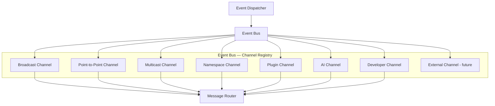
```mermaid
graph TD
    DISP[Event Dispatcher] --> BUS[Event Bus]

    subgraph Bus["Event Bus — Channel Registry"]
        BC[Broadcast Channel]
        P2P[Point-to-Point Channel]
        MC[Multicast Channel]
        NS[Namespace Channel]
        PLUG[Plugin Channel]
        AI[AI Channel]
        DEV[Developer Channel]
        EXT[External Channel - future]
    end

    BUS --> BC
    BUS --> P2P
    BUS --> MC
    BUS --> NS
    BUS --> PLUG
    BUS --> AI
    BUS --> DEV
    BUS --> EXT

    BC --> MR[Message Router]
    P2P --> MR
    MC --> MR
    NS --> MR
    PLUG --> MR
    AI --> MR
    DEV --> MR
```

### 6.2 Channel Definitions

#### 6.2.1 Broadcast Channel

The Broadcast Channel delivers an event to every registered subscriber
regardless of their specific subscription. It is used for system-wide
state changes that all components must be aware of.

**Events routed via Broadcast:**
- `runtime.ready`, `runtime.closing`, `runtime.destroyed`
- `security.violation`, `security.sandbox_violation`
- `system.memory_critical`, `system.suspend`, `system.resume`

**Delivery guarantee:** All-or-nothing. If any subscriber fails on a
broadcast event, the failure is recorded but delivery continues to all
remaining subscribers.

**Isolation:** Broadcast events are delivered to internal subscribers
before plugin subscribers. Plugin subscribers receive broadcast events
only if the event's security class permits plugin access.

#### 6.2.2 Point-to-Point Channel

The Point-to-Point Channel delivers an event to exactly one subscriber —
the one specified in the event's `destination` field. It is used for
request-response patterns and targeted notifications.

**Use cases:**
- Runtime API response delivery
- Plugin-to-plugin direct messaging (when permitted)
- Scheduler task completion notifications

**Delivery guarantee:** Exactly-once. If the target subscriber does not
exist, the event transitions to `Dead_Letter` immediately.

#### 6.2.3 Multicast Channel

The Multicast Channel delivers an event to a named group of subscribers.
Groups are registered at subscription time. A subscriber may belong to
multiple groups.

**Use cases:**
- Delivering `theme.changed` to all UI-rendering components
- Delivering `language.changed` to all localization-aware components
- Delivering `navigation.navigate_started` to all navigation guards

**Group management:**
- Groups are created implicitly when the first subscriber joins
- Groups are destroyed when the last subscriber leaves
- Maximum 64 members per group

#### 6.2.4 Namespace Channel

The Namespace Channel implements hierarchical routing based on the event's
namespace prefix. A subscriber to `resource.*` receives all events in the
`resource` namespace. A subscriber to `resource.page.*` receives only
page-related resource events.

**Hierarchy rules:**
- A subscription to `X.*` receives all events where the type starts with `X.`
- A subscription to `X.Y.*` receives all events where the type starts with `X.Y.`
- Parent namespace subscribers always receive events before child namespace
  subscribers
- Wildcard subscriptions are resolved by the Message Router (Section 10)

#### 6.2.5 Plugin Channel

The Plugin Channel is an isolated routing fabric for plugin-emitted and
plugin-targeted events. It is completely separated from the internal
channel topology. Plugin events never enter the internal channels unless
explicitly bridged by the Plugin Runtime with Security Gate approval.

**Isolation guarantees:**
- Plugin A cannot subscribe to Plugin B's events without explicit permission
- Plugin events cannot be routed to internal runtime subscribers directly
- The Plugin Runtime acts as the bridge between the Plugin Channel and
  internal channels
- Plugin channel depth is limited independently from the main queue

#### 6.2.6 AI Channel

The AI Channel is a rate-limited, isolated channel for AI Runtime events.
It enforces strict throughput limits to prevent AI inference loops from
flooding the Event Bus.

**Rate limits:**
- Maximum 100 AI events per second
- Maximum 10 concurrent AI inference events
- AI events are always delivered at Normal priority or below
- AI events cannot be promoted to High or Critical priority

#### 6.2.7 Developer Channel

The Developer Channel carries developer tooling events (`developer.*`,
`diagnostics.*`, `log.*` in verbose mode). It is active only in developer
mode builds. In production builds, the Developer Channel is a no-op stub
that discards all events immediately.

**Developer Channel guarantees:**
- Developer Channel failures never affect the main event pipeline
- Developer Channel has its own independent queue with no overflow impact
  on the main queues
- All events on the Developer Channel are automatically archived

#### 6.2.8 External Channel (Future)

The External Channel is a reserved extension point for future distributed
runtime support. It is not implemented in the current specification but
its interface is defined to ensure the Bus architecture can accommodate
cross-process and cross-machine event routing without structural changes.

**Reserved interface:**
- `ExternalChannel::connect(endpoint: RemoteEndpoint) -> Result<ChannelHandle>`
- `ExternalChannel::send(event: SerializedEvent) -> Result<()>`
- `ExternalChannel::receive() -> Result<SerializedEvent>`

All external events must pass through the Security Gate on both the sending
and receiving ends.

### 6.3 Channel Selection Algorithm

The Bus selects the correct channel(s) for each event using the following
algorithm:

```
function select_channels(event):
    channels = []

    if event.destination == Broadcast:
        channels.push(BroadcastChannel)

    if event.destination == PointToPoint(target_id):
        channels.push(P2PChannel(target_id))

    if event.destination == Group(group_id):
        channels.push(MulticastChannel(group_id))

    if event.namespace_routing_enabled:
        channels.push(NamespaceChannel(event.namespace))

    if event.publisher_type == Plugin:
        channels.push(PluginChannel(event.plugin_id))

    if event.publisher_type == AI:
        channels.push(AIChannel)

    if developer_mode and event.is_developer_event():
        channels.push(DeveloperChannel)

    return channels
```

An event may be routed to multiple channels simultaneously (e.g., a plugin
event that is also namespace-routed). Each channel delivers independently.

### 6.4 Bus Backpressure

When the Message Router signals that the Priority Queue is approaching
capacity, the Bus applies backpressure:

| Queue Fill Level | Action |
|---|---|
| < 70% | Normal operation |
| 70–85% | Reject new Low and Deferred events |
| 85–95% | Reject new Normal events; accept only High and Critical |
| > 95% | Accept only Critical events; emit `diagnostics.queue_snapshot` |
| 100% | Full overflow — return `OverflowError` to all publishers |

Backpressure is applied per-channel. The Plugin Channel and AI Channel
have independent backpressure thresholds that are lower than the main
channel thresholds, ensuring plugin and AI event floods cannot starve
internal runtime events.

---

## 7. Event Queue

The Event Queue is the scheduling and buffering layer between the Event Bus
and subscriber delivery. It maintains seven distinct queue tiers, each with
independent depth limits, scheduling weights, and overflow policies.

### 7.1 Queue Hierarchy

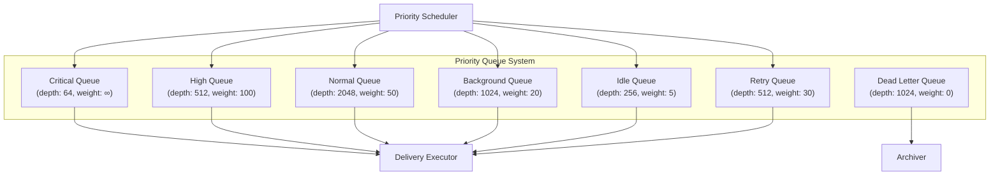
```mermaid
graph TD
    subgraph Queues["Priority Queue System"]
        CQ["Critical Queue\n(depth: 64, weight: ∞)"]
        HQ["High Queue\n(depth: 512, weight: 100)"]
        NQ["Normal Queue\n(depth: 2048, weight: 50)"]
        BQ["Background Queue\n(depth: 1024, weight: 20)"]
        IQ["Idle Queue\n(depth: 256, weight: 5)"]
        RQ["Retry Queue\n(depth: 512, weight: 30)"]
        DLQ["Dead Letter Queue\n(depth: 1024, weight: 0)"]
    end

    SCHED[Priority Scheduler] --> CQ
    SCHED --> HQ
    SCHED --> NQ
    SCHED --> BQ
    SCHED --> IQ
    SCHED --> RQ
    DLQ --> ARCH[Archiver]

    CQ --> EXEC[Delivery Executor]
    HQ --> EXEC
    NQ --> EXEC
    BQ --> EXEC
    IQ --> EXEC
    RQ --> EXEC
```

### 7.2 Queue Tier Definitions

#### 7.2.1 Critical Queue

| Property | Value |
|---|---|
| Priority tier | 0 — Critical |
| Maximum depth | 64 events |
| Scheduling weight | Always serviced first — preempts all other queues |
| Delivery mode | Synchronous — blocks the scheduler until empty |
| Overflow policy | Reject new events; return `OverflowError` to publisher |
| Timeout | 100 ms per subscriber |
| Retry | No — Critical failures trigger `runtime.error` immediately |

The Critical Queue is always serviced before any other queue. When a
Critical event is enqueued, the scheduler immediately suspends processing
of all other queues and delivers the Critical event synchronously. The
scheduler does not return to other queues until the Critical Queue is empty.

**Events in this tier:** `runtime.ready`, `runtime.closing`,
`runtime.destroyed`, `runtime.error`, `security.violation`,
`security.sandbox_violation`, `security.integrity_violation`,
`security.tamper_detected`, `security.replay_detected`, `boot.failed`.

#### 7.2.2 High Queue

| Property | Value |
|---|---|
| Priority tier | 1 — High |
| Maximum depth | 512 events |
| Scheduling weight | 100 |
| Delivery mode | Asynchronous |
| Overflow policy | Drop oldest Low events to make room; if still full, reject |
| Timeout | 500 ms per subscriber |
| Retry | Up to 5 attempts with exponential backoff |

High Queue events are delivered before Normal events in every scheduling
cycle. The scheduler services the High Queue until it is empty before
moving to lower tiers.

#### 7.2.3 Normal Queue

| Property | Value |
|---|---|
| Priority tier | 2 — Normal |
| Maximum depth | 2048 events |
| Scheduling weight | 50 |
| Delivery mode | Asynchronous |
| Overflow policy | Drop oldest Background events; if still full, reject |
| Timeout | 2000 ms per subscriber |
| Retry | Up to 5 attempts |

The Normal Queue is the primary queue for the majority of runtime events.
It is serviced in a round-robin fashion with the Retry Queue to ensure
retried events are not starved.

#### 7.2.4 Background Queue

| Property | Value |
|---|---|
| Priority tier | 3 — Background |
| Maximum depth | 1024 events |
| Scheduling weight | 20 |
| Delivery mode | Asynchronous |
| Overflow policy | Drop oldest Background events |
| Timeout | 5000 ms per subscriber |
| Retry | Up to 3 attempts |

Background Queue events are delivered when the Critical, High, and Normal
queues are empty or when the scheduler's fairness timer fires. Background
events include analytics, non-critical logging, and prefetch notifications.

#### 7.2.5 Idle Queue

| Property | Value |
|---|---|
| Priority tier | 4 — Idle / Deferred |
| Maximum depth | 256 events |
| Scheduling weight | 5 |
| Delivery mode | Asynchronous — only when system is idle |
| Overflow policy | Drop oldest Idle events |
| Timeout | 10000 ms per subscriber |
| Retry | Up to 2 attempts |

Idle Queue events are delivered only when all higher-priority queues are
empty and the runtime's CPU utilization is below the idle threshold
(configurable, default 20%). If the system never reaches idle during a
session, Idle Queue events may never be delivered — this is by design.

**Events in this tier:** `diagnostics.health_check`, `diagnostics.memory_snapshot`,
`resource.cache_evicted`, `storage.persisted` (non-critical).

#### 7.2.6 Retry Queue

| Property | Value |
|---|---|
| Priority tier | Special — inherits original event priority |
| Maximum depth | 512 events |
| Scheduling weight | 30 |
| Delivery mode | Asynchronous with delay |
| Overflow policy | Drop oldest retry entries |
| Timeout | Same as original event priority |
| Retry | Tracks remaining attempts from original event |

The Retry Queue holds events that failed delivery and are awaiting their
next retry attempt. Each entry carries a `retry_after` timestamp. The
scheduler checks the Retry Queue on every cycle and moves entries whose
`retry_after` has elapsed back into their original priority queue.

The Retry Queue is serviced with weight 30 — higher than Background but
lower than Normal — to ensure retried events are not indefinitely delayed
by a flood of new Normal events.

#### 7.2.7 Dead Letter Queue

| Property | Value |
|---|---|
| Priority tier | Terminal — no further delivery |
| Maximum depth | 1024 events |
| Scheduling weight | 0 — not serviced for delivery |
| Delivery mode | Archive only |
| Overflow policy | Drop oldest dead letter entries (FIFO) |
| Retention | Full session in developer mode; last 100 in production |

The Dead Letter Queue is a terminal state. Events in the Dead Letter Queue
are never re-delivered. They are archived with full failure context and
made available to the Developer Console and Diagnostics Service for
inspection.

Every entry in the Dead Letter Queue triggers a `diagnostics.dead_letter`
event (delivered via the Normal Queue). If a Critical event reaches the
Dead Letter Queue, `runtime.error` is emitted immediately.

### 7.3 Scheduling Algorithm

The Priority Scheduler uses a weighted round-robin algorithm with
preemption for Critical events:

```
function schedule_next():
    // Step 1: Always drain Critical queue first
    if not critical_queue.is_empty():
        return critical_queue.dequeue()

    // Step 2: Check Retry Queue for due entries
    retry_queue.promote_due_entries()

    // Step 3: Weighted round-robin across remaining tiers
    candidates = [
        (high_queue,       weight=100),
        (normal_queue,     weight=50),
        (retry_queue,      weight=30),
        (background_queue, weight=20),
        (idle_queue,       weight=5)
    ]

    // Step 4: Fairness — if a lower-priority queue has been
    // starved for > starvation_threshold, boost its weight
    for (queue, weight) in candidates:
        if queue.starvation_ms() > STARVATION_THRESHOLD:
            weight = weight * STARVATION_BOOST_FACTOR

    return weighted_random_select(candidates)
```

**Starvation threshold:** 5000 ms (configurable)
**Starvation boost factor:** 3× (configurable)

### 7.4 Queue Overflow Handling

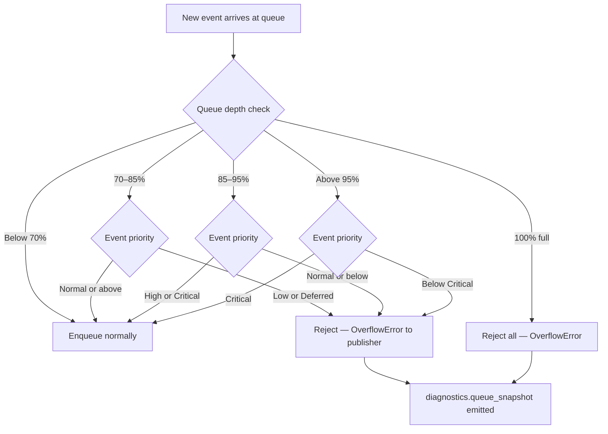
```mermaid
flowchart TD
    A[New event arrives at queue] --> B{Queue depth check}
    B -->|Below 70%| C[Enqueue normally]
    B -->|70–85%| D{Event priority}
    D -->|Low or Deferred| E[Reject — OverflowError to publisher]
    D -->|Normal or above| C
    B -->|85–95%| F{Event priority}
    F -->|Normal or below| E
    F -->|High or Critical| C
    B -->|Above 95%| G{Event priority}
    G -->|Below Critical| E
    G -->|Critical| C
    B -->|100% full| H[Reject all — OverflowError]
    E --> I[diagnostics.queue_snapshot emitted]
    H --> I
```

### 7.5 Queue Recovery

After an overflow condition, the queue enters a recovery mode:

1. The scheduler pauses acceptance of new Normal and Low events for 100 ms
2. The scheduler aggressively drains the queue by increasing delivery
   concurrency to the maximum configured value
3. Once queue depth drops below 50%, normal acceptance resumes
4. A `diagnostics.queue_snapshot` event is emitted with the recovery
   statistics

---

## 8. Event Subscription Model

The Subscription Model defines how components register interest in events,
how subscriptions are managed over their lifetime, and how the Subscriber
Registry enforces ownership and memory safety.

### 8.1 Subscription Architecture

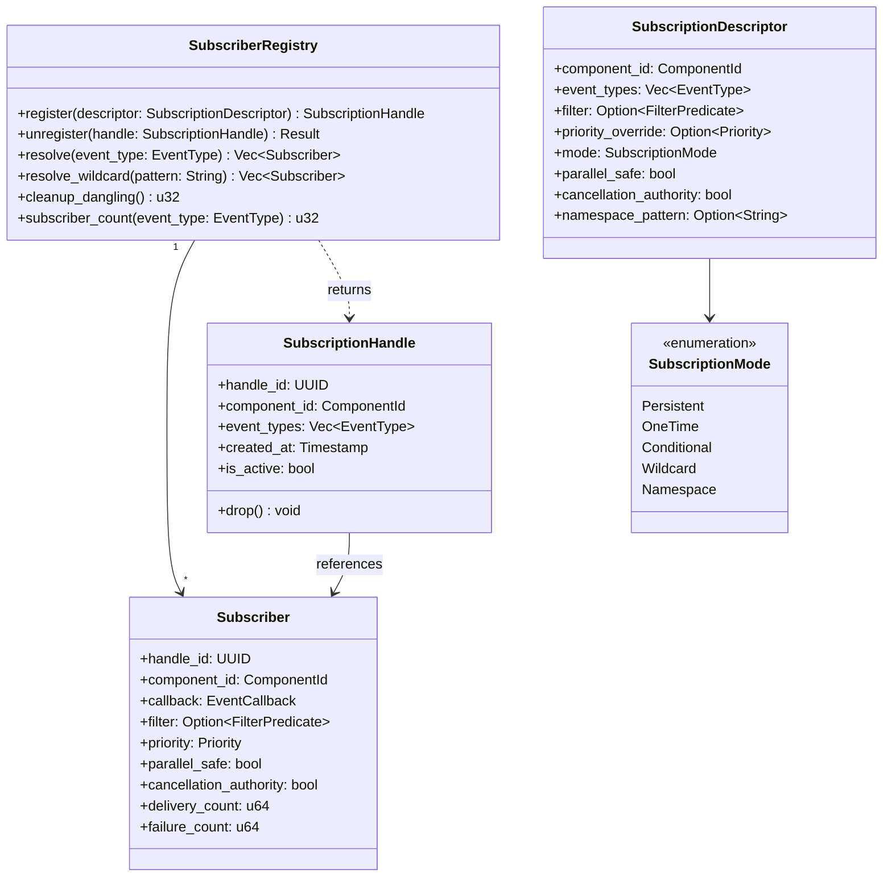
```mermaid
classDiagram
    class SubscriberRegistry {
        +register(descriptor: SubscriptionDescriptor) SubscriptionHandle
        +unregister(handle: SubscriptionHandle) Result
        +resolve(event_type: EventType) Vec~Subscriber~
        +resolve_wildcard(pattern: String) Vec~Subscriber~
        +cleanup_dangling() u32
        +subscriber_count(event_type: EventType) u32
    }

    class SubscriptionDescriptor {
        +component_id: ComponentId
        +event_types: Vec~EventType~
        +filter: Option~FilterPredicate~
        +priority_override: Option~Priority~
        +mode: SubscriptionMode
        +parallel_safe: bool
        +cancellation_authority: bool
        +namespace_pattern: Option~String~
    }

    class SubscriptionHandle {
        +handle_id: UUID
        +component_id: ComponentId
        +event_types: Vec~EventType~
        +created_at: Timestamp
        +is_active: bool
        +drop() void
    }

    class SubscriptionMode {
        <<enumeration>>
        Persistent
        OneTime
        Conditional
        Wildcard
        Namespace
    }

    class Subscriber {
        +handle_id: UUID
        +component_id: ComponentId
        +callback: EventCallback
        +filter: Option~FilterPredicate~
        +priority: Priority
        +parallel_safe: bool
        +cancellation_authority: bool
        +delivery_count: u64
        +failure_count: u64
    }

    SubscriberRegistry "1" --> "*" Subscriber
    SubscriptionDescriptor --> SubscriptionMode
    SubscriberRegistry ..> SubscriptionHandle : returns
    SubscriptionHandle --> Subscriber : references
```

### 8.2 Subscription Modes

#### 8.2.1 Persistent Subscriptions

A persistent subscription remains active until explicitly unsubscribed or
until the owning component is destroyed. This is the default subscription
mode for all internal runtime components.

**Lifecycle:**
1. Component calls `Events.subscribe(descriptor)` → receives `SubscriptionHandle`
2. Handle is stored by the component for later unsubscription
3. Events are delivered to the subscriber callback for the lifetime of the handle
4. Component calls `Events.unsubscribe(handle)` or drops the handle to deregister

**Memory management:** The Subscriber Registry holds a weak reference to
the subscriber callback. If the owning component is dropped without
explicitly unsubscribing, the Registry detects the dangling reference on
the next `cleanup_dangling()` pass (runs every 30 seconds) and removes it.

#### 8.2.2 One-Time Subscriptions

A one-time subscription is automatically deregistered after the first
successful delivery. It is used for request-response patterns and
single-event awaiting.

**Lifecycle:**
1. Component calls `Events.once(event_type, callback)` → receives `SubscriptionHandle`
2. On first delivery, the callback is invoked
3. The Dispatcher immediately deregisters the subscription after delivery
4. The `SubscriptionHandle` becomes inactive — further calls to `unsubscribe`
   are no-ops

**Use cases:**
- Waiting for `boot.resources_ready` before proceeding
- Awaiting a single `navigation.navigate_complete` after initiating navigation
- Plugin waiting for its own `plugin.ready` event

#### 8.2.3 Conditional Subscriptions

A conditional subscription is active only when a runtime condition is true.
The condition is evaluated by the Filter Engine before each delivery. If the
condition is false, the event is skipped for this subscriber but the
subscription remains registered.

**Condition types:**

| Condition | Description |
|---|---|
| `StateCondition` | Deliver only when a named state value equals a target |
| `PageCondition` | Deliver only when the current page matches a pattern |
| `SessionCondition` | Deliver only for a specific session ID |
| `PermissionCondition` | Deliver only when a permission is granted |
| `CustomPredicate` | Arbitrary predicate on the event payload |

#### 8.2.4 Wildcard Subscriptions

A wildcard subscription matches multiple event types using glob-style
patterns. The Message Router resolves wildcard patterns against the full
event type registry.

**Pattern syntax:**

| Pattern | Matches |
|---|---|
| `resource.*` | All events in the `resource` namespace |
| `*.failed` | All events ending in `.failed` across all namespaces |
| `plugin.*.crashed` | All plugin crash events regardless of plugin ID |
| `*` | All events (reserved for Logger and Diagnostics only) |

**Restrictions:**
- Plugin subscribers may not use the `*` wildcard
- Wildcard subscriptions are resolved at dispatch time, not at registration time
- A wildcard subscription counts against the per-event-type subscriber limit
  for each matched event type

#### 8.2.5 Namespace Subscriptions

A namespace subscription subscribes to an entire event namespace and all
its children. It is equivalent to a wildcard subscription on `namespace.*`
but is implemented more efficiently via the Namespace Channel (Section 6.2.4).

**Example:** A subscriber to the `security` namespace receives all
`security.*` events. A subscriber to the `resource.page` namespace receives
all `resource.page.*` events.

### 8.3 Priority Listeners

A subscriber may specify a `priority_override` in its `SubscriptionDescriptor`
to request delivery before or after other subscribers of the same event type.

| Priority Override | Delivery Position |
|---|---|
| `First` | Delivered before all other subscribers |
| `BeforePlugins` | Delivered before plugin subscribers |
| `Default` | Standard ordering (see Section 5.2.4) |
| `AfterAll` | Delivered after all other subscribers |
| `Last` | Delivered last — observer position |

**Restrictions:**
- Only internal runtime components may use `First` priority override
- Plugin subscribers may only use `Default` or `Last`
- The Logger and Diagnostics subscribers always use `Last` — they observe
  the final state of the event after all other subscribers have processed it

### 8.4 Subscription Lifecycle

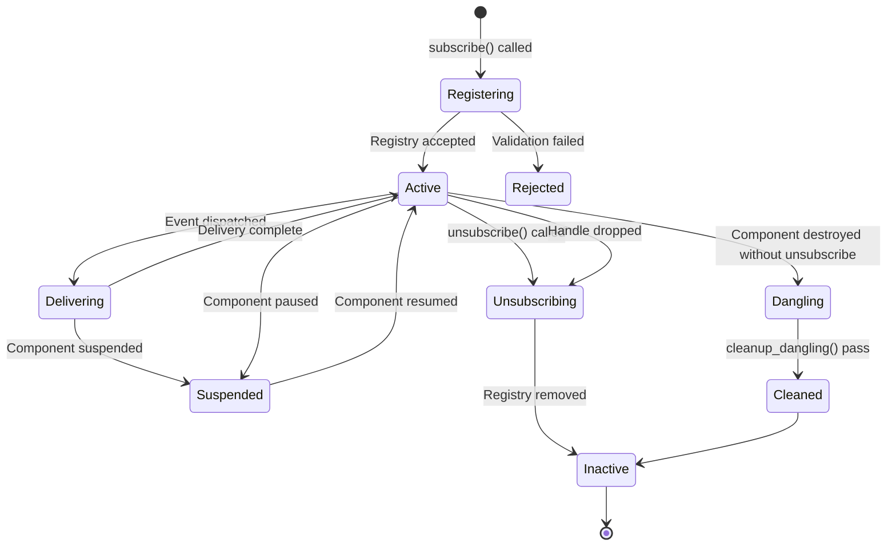
```mermaid
stateDiagram-v2
    [*] --> Registering : subscribe() called
    Registering --> Active : Registry accepted
    Registering --> Rejected : Validation failed

    Active --> Delivering : Event dispatched
    Delivering --> Active : Delivery complete
    Delivering --> Suspended : Component suspended
    Active --> Suspended : Component paused

    Suspended --> Active : Component resumed
    Active --> Unsubscribing : unsubscribe() called
    Active --> Unsubscribing : Handle dropped
    Active --> Dangling : Component destroyed without unsubscribe
    Dangling --> Cleaned : cleanup_dangling() pass
    Unsubscribing --> Inactive : Registry removed
    Cleaned --> Inactive
    Inactive --> [*]
```

### 8.5 Subscription Limits and Enforcement

| Limit | Value | Enforcement |
|---|---|---|
| Max subscribers per event type | 256 | Hard limit — registration rejected if exceeded |
| Max subscriptions per component | 128 | Hard limit — registration rejected if exceeded |
| Max wildcard subscriptions total | 64 | Hard limit — prevents wildcard flooding |
| Max plugin subscriptions total | 512 | Shared across all plugins |
| Cleanup interval for dangling refs | 30 seconds | Automatic background task |
| Max filter predicate execution time | 1 ms | Exceeded → treated as `true` + warning |

### 8.6 Subscription Memory Management

The Subscriber Registry uses a two-level ownership model:

**Level 1 — Handle ownership:** The `SubscriptionHandle` is owned by the
subscribing component. When the handle is dropped (either explicitly via
`unsubscribe()` or implicitly when the component is destroyed), the Registry
is notified via a drop callback.

**Level 2 — Weak references:** The Registry stores weak references to
subscriber callbacks. This prevents the Registry from keeping components
alive beyond their intended lifetime. Dangling weak references are detected
and cleaned up on the periodic cleanup pass.

**Plugin subscription isolation:** Plugin subscriptions are stored in a
separate partition of the Registry. When a plugin is terminated, all its
subscriptions are atomically removed in a single operation without affecting
the main Registry.

---

## 9. Event Payload Specification

Every event in the LDFX Event System carries a structured, versioned payload.
The payload is the authoritative data contract between publishers and
subscribers. Payloads are immutable after emission — no subscriber may modify
a payload.

### 9.1 Payload Structure

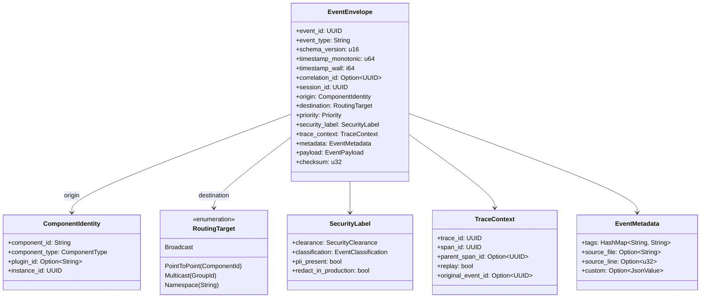
```mermaid
classDiagram
    class EventEnvelope {
        +event_id: UUID
        +event_type: String
        +schema_version: u16
        +timestamp_monotonic: u64
        +timestamp_wall: i64
        +correlation_id: Option~UUID~
        +session_id: UUID
        +origin: ComponentIdentity
        +destination: RoutingTarget
        +priority: Priority
        +security_label: SecurityLabel
        +trace_context: TraceContext
        +metadata: EventMetadata
        +payload: EventPayload
        +checksum: u32
    }

    class ComponentIdentity {
        +component_id: String
        +component_type: ComponentType
        +plugin_id: Option~String~
        +instance_id: UUID
    }

    class RoutingTarget {
        <<enumeration>>
        Broadcast
        PointToPoint(ComponentId)
        Multicast(GroupId)
        Namespace(String)
    }

    class SecurityLabel {
        +clearance: SecurityClearance
        +classification: EventClassification
        +pii_present: bool
        +redact_in_production: bool
    }

    class TraceContext {
        +trace_id: UUID
        +span_id: UUID
        +parent_span_id: Option~UUID~
        +replay: bool
        +original_event_id: Option~UUID~
    }

    class EventMetadata {
        +tags: HashMap~String, String~
        +source_file: Option~String~
        +source_line: Option~u32~
        +custom: Option~JsonValue~
    }

    EventEnvelope --> ComponentIdentity : origin
    EventEnvelope --> RoutingTarget : destination
    EventEnvelope --> SecurityLabel
    EventEnvelope --> TraceContext
    EventEnvelope --> EventMetadata
```

### 9.2 Field Definitions

#### 9.2.1 Core Identity Fields

| Field | Type | Required | Description |
|---|---|---|---|
| `event_id` | UUID v4 | Yes | Globally unique event identifier — assigned by Publisher Interface |
| `event_type` | String | Yes | Fully qualified event type (e.g., `resource.page_loaded`) |
| `schema_version` | u16 | Yes | Payload schema version — used for forward compatibility |
| `timestamp_monotonic` | u64 | Yes | Nanoseconds since runtime boot — monotonic clock |
| `timestamp_wall` | i64 | Yes | Unix timestamp milliseconds — wall clock |

#### 9.2.2 Correlation Fields

| Field | Type | Required | Description |
|---|---|---|---|
| `correlation_id` | UUID | No | Links related events in a causal chain |
| `session_id` | UUID | Yes | Runtime session identifier — from Runtime Context |
| `trace_id` | UUID | Yes | Distributed trace identifier — spans the full operation |
| `span_id` | UUID | Yes | Current span within the trace |
| `parent_span_id` | UUID | No | Parent span — absent for root events |

**Correlation chain example:**
```
boot.started          → trace_id: T1, span_id: S1, parent: none
boot.manifest_loaded  → trace_id: T1, span_id: S2, parent: S1
boot.resources_ready  → trace_id: T1, span_id: S3, parent: S1
runtime.ready         → trace_id: T1, span_id: S4, parent: S1, correlation_id: boot.started.event_id
```

#### 9.2.3 Routing Fields

| Field | Type | Required | Description |
|---|---|---|---|
| `origin` | ComponentIdentity | Yes | The component that emitted the event |
| `destination` | RoutingTarget | Yes | Routing mode and target |
| `priority` | Priority (u8) | Yes | Priority tier (0=Critical, 1=High, 2=Normal, 3=Low, 4=Deferred) |

#### 9.2.4 Security Fields

| Field | Type | Required | Description |
|---|---|---|---|
| `clearance` | SecurityClearance | Yes | Minimum clearance required to receive this event |
| `classification` | EventClassification | Yes | Internal / Document / Plugin / Public |
| `pii_present` | bool | Yes | Whether the payload contains PII — triggers redaction |
| `redact_in_production` | bool | Yes | Whether the full payload is redacted in production logs |
| `checksum` | u32 (CRC32) | Yes | CRC32 of the serialized payload — tamper detection |

**Security clearance levels:**

| Level | Value | Description |
|---|---|---|
| `Public` | 0 | Accessible to all subscribers including plugins and documents |
| `Document` | 1 | Accessible to document scripts and plugins with permission |
| `Plugin` | 2 | Accessible to plugins only — not to document scripts |
| `Internal` | 3 | Accessible to internal runtime components only |
| `Kernel` | 4 | Accessible to the Runtime Kernel only |

**Event classification:**

| Classification | Description |
|---|---|
| `Internal` | Runtime-internal — never exposed to documents or plugins |
| `Document` | Exposed to document scripts via the `events` API namespace |
| `Plugin` | Exposed to plugins via the Plugin Runtime API |
| `Public` | Exposed to the Application Layer via the Runtime API |

#### 9.2.5 Metadata Fields

| Field | Type | Required | Description |
|---|---|---|---|
| `tags` | HashMap<String, String> | No | Arbitrary key-value tags for filtering and routing |
| `source_file` | String | No | Source file that emitted the event (developer mode only) |
| `source_line` | u32 | No | Source line number (developer mode only) |
| `custom` | JsonValue | No | Publisher-defined custom metadata (max 4 KB) |

### 9.3 Payload Versioning

Every event type has a registered schema version. When a publisher emits
an event, it specifies the schema version of its payload. The Security Gate
validates the payload against the registered schema for that version.

**Forward compatibility rules:**
- Adding new optional fields to a payload is a minor version change
- Removing fields or changing field types is a major version change
- Subscribers must tolerate unknown fields in higher schema versions
- The Dispatcher delivers events to subscribers that support the event's
  schema version or any compatible version

**Schema registry:** All event schemas are registered in the Event Schema
Registry at boot time. The Registry is immutable after boot — no new schemas
may be registered at runtime (except in developer mode for testing).

### 9.4 Serialization Format

Event payloads are serialized using a two-tier strategy:

**Tier 1 — In-process delivery (primary):**
Events delivered within the same process are passed as typed Rust structs
via reference. No serialization occurs. This is the zero-copy fast path
used for all normal runtime operation.

**Tier 2 — Cross-boundary delivery:**
Events that cross a sandbox boundary (plugin events, AI events) or are
persisted to the trace log are serialized to JSON using `serde_json`.
The serialized form uses the canonical field names defined in Section 9.2.

**Serialization rules:**
- All UUID fields serialize as lowercase hyphenated strings
- All timestamp fields serialize as u64 (monotonic) or i64 (wall)
- Enum variants serialize as snake_case strings
- Optional fields serialize as `null` when absent (not omitted)
- The `payload` field serializes as a nested JSON object

### 9.5 Payload Validation

The Security Gate performs two-phase payload validation:

**Phase 1 — Structural validation:**
- All required fields are present
- All field types match the registered schema
- String fields do not exceed maximum length limits
- Numeric fields are within valid ranges
- UUID fields are valid UUID v4 format

**Phase 2 — Semantic validation:**
- The `origin.component_id` matches the registered publisher identity
- The `session_id` matches the active session
- The `priority` is within the publisher's authorized priority range
- Plugin publishers cannot set `clearance` above `Plugin`
- AI publishers cannot set `priority` above `Normal`
- The `checksum` matches the CRC32 of the serialized payload body

**Validation failure handling:**
- Structural failure → event rejected, `ValidationError` returned to publisher
- Semantic failure → event rejected, `security.violation` emitted
- Checksum mismatch on re-validation → `security.tamper_detected` emitted,
  event moved to Dead Letter Queue

### 9.6 Payload Size Limits

| Field | Maximum Size |
|---|---|
| `event_type` string | 256 bytes |
| `tags` map | 16 entries, 64 bytes per key, 256 bytes per value |
| `custom` metadata | 4 KB |
| Full payload body | 64 KB |
| Full envelope (including payload) | 128 KB |

Events exceeding size limits are rejected at the Security Gate with a
`ValidationError`. Publishers must not embed large binary data in event
payloads — large data should be stored in the Resource Manager and
referenced by ID in the event payload.

---

## 10. Event Routing

The Message Router is responsible for translating the event's `RoutingTarget`
into a concrete list of delivery targets. It sits between the Event Bus and
the Priority Queue and applies all routing rules before an event is enqueued
for delivery.

### 10.1 Routing Architecture

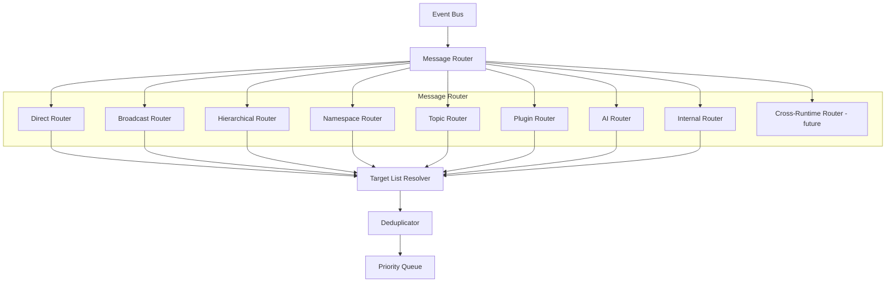
```mermaid
graph TD
    EB[Event Bus] --> MR[Message Router]

    subgraph Router["Message Router"]
        DR[Direct Router]
        BR[Broadcast Router]
        HR[Hierarchical Router]
        NR[Namespace Router]
        TR[Topic Router]
        PR[Plugin Router]
        AIR[AI Router]
        IR[Internal Router]
        XR[Cross-Runtime Router - future]
    end

    MR --> DR
    MR --> BR
    MR --> HR
    MR --> NR
    MR --> TR
    MR --> PR
    MR --> AIR
    MR --> IR
    MR --> XR

    DR & BR & HR & NR & TR & PR & AIR & IR --> TL[Target List Resolver]
    TL --> DEDUP[Deduplicator]
    DEDUP --> PQ[Priority Queue]
```

### 10.2 Routing Modes

#### 10.2.1 Direct Routing

Direct routing delivers an event to a single, explicitly named subscriber.
The `destination` field of the event envelope contains a `PointToPoint(ComponentId)`
target. The Direct Router looks up the component ID in the Subscriber Registry
and returns the single matching subscriber.

**Algorithm:**
```
function direct_route(event):
    target_id = event.destination.component_id
    subscriber = registry.get_by_component_id(target_id)
    if subscriber.is_none():
        return Err(DeadLetterReason::TargetNotFound)
    if not subscriber.accepts(event.type):
        return Err(DeadLetterReason::TargetNotSubscribed)
    return Ok([subscriber])
```

**Failure handling:** If the target component does not exist or is not
subscribed to the event type, the event is immediately moved to the Dead
Letter Queue with reason `TargetNotFound` or `TargetNotSubscribed`.

#### 10.2.2 Broadcast Routing

Broadcast routing delivers an event to every subscriber registered for the
event type, regardless of their component identity. The Broadcast Router
retrieves the full subscriber list from the Subscriber Registry.

**Algorithm:**
```
function broadcast_route(event):
    all_subscribers = registry.resolve(event.type)
    authorized = all_subscribers
        .filter(|s| security_gate.authorize_delivery(event, s))
    return Ok(authorized)
```

**Security filtering:** The Security Gate's `authorize_delivery` check
filters out subscribers that do not have the required clearance to receive
the event. A plugin subscriber cannot receive an `Internal` clearance event
even if it is subscribed to the event type.

#### 10.2.3 Hierarchical Routing

Hierarchical routing delivers an event to subscribers at multiple levels
of a namespace hierarchy. A subscriber to `resource.*` receives all
`resource.*` events. A subscriber to `resource.page.*` receives only
`resource.page.*` events. Both subscribers receive `resource.page_loaded`.

**Hierarchy resolution:**
```
function hierarchical_route(event):
    parts = event.type.split('.')
    targets = []

    // Walk up the hierarchy — most specific to least specific
    for depth in (parts.len()..=1).rev():
        prefix = parts[0..depth].join('.') + ".*"
        targets.extend(registry.resolve_namespace(prefix))

    // Also include exact-match subscribers
    targets.extend(registry.resolve(event.type))

    return Ok(deduplicate(targets))
```

**Delivery order within hierarchy:** More specific subscribers (deeper
namespace) are delivered to before less specific subscribers (shallower
namespace). This allows a `resource.page.*` subscriber to process the event
before a `resource.*` subscriber.

#### 10.2.4 Namespace Routing

Namespace routing is a direct subscription to a namespace prefix. It is
implemented via the Namespace Channel (Section 6.2.4) and is more efficient
than wildcard routing because the namespace index is pre-built at
subscription time rather than resolved at dispatch time.

**Namespace index structure:**
```
namespace_index: {
    "runtime"           → [subscriber_A, subscriber_B],
    "resource"          → [subscriber_C],
    "resource.page"     → [subscriber_D, subscriber_E],
    "security"          → [subscriber_F],
    "plugin.my_plugin"  → [subscriber_G]
}
```

The index is updated atomically on every subscription and unsubscription.
Reads from the index are lock-free using a read-copy-update (RCU) strategy.

#### 10.2.5 Topic Routing

Topic routing delivers an event to subscribers that have registered interest
in a specific topic tag. Topics are arbitrary string labels attached to
events via the `tags` metadata field. A subscriber may register a topic
filter: `tags["topic"] == "document_ready"`.

**Use cases:**
- Grouping related events from different namespaces under a single topic
- Plugin-defined event groupings
- Analytics event categorization

#### 10.2.6 Plugin Routing

Plugin routing is handled by the Plugin Router, which operates on the
isolated Plugin Channel. Plugin events are routed within the plugin
namespace and are not visible to internal runtime subscribers unless
explicitly bridged.

**Plugin routing rules:**
- A plugin may only subscribe to events in its own `custom.<plugin_id>.*`
  namespace by default
- A plugin may subscribe to `Document`-classified events if it has the
  `event.subscribe.document` permission
- A plugin may subscribe to `Public`-classified events unconditionally
- A plugin may never subscribe to `Internal` or `Kernel` events
- Inter-plugin event routing requires both plugins to have the
  `event.subscribe.plugin` permission and explicit mutual consent

**Plugin event bridge:** When a plugin emits a `custom.*` event that an
internal subscriber has registered for (via explicit bridge registration),
the Plugin Router forwards the event through the Security Gate to the
internal channel. The Security Gate re-validates the event as if it were
a new emission.

#### 10.2.7 AI Routing

AI routing is handled by the AI Router on the isolated AI Channel. AI
events are rate-limited and cannot be promoted above Normal priority.

**AI routing rules:**
- AI events are always delivered to the AI Channel first
- The AI Runtime acts as the bridge to the internal channel
- AI events that exceed the rate limit are dropped with a
  `ai.quota_exceeded` event emitted in their place
- AI inference result events are routed point-to-point to the requesting
  component

#### 10.2.8 Internal Routing

Internal routing is the default routing mode for all events that do not
specify a routing target. The Internal Router uses the event type to look
up the registered subscriber list and delivers to all matching subscribers
in priority order.

#### 10.2.9 Cross-Runtime Routing (Future)

Cross-runtime routing is reserved for future distributed LDFX runtime
support where multiple runtime instances communicate over a network or
IPC channel. The External Channel (Section 6.2.8) provides the interface.

**Reserved routing target:** `CrossRuntime(endpoint: RemoteEndpoint)`

When this routing target is used, the Message Router serializes the event
envelope to JSON, signs it with the runtime's session key, and forwards it
to the External Channel for transmission. The receiving runtime's Security
Gate verifies the signature before accepting the event.

### 10.3 Target List Resolution and Deduplication

After all applicable routers have produced their target lists, the Target
List Resolver merges and deduplicates the results:

```
function resolve_targets(event):
    raw_targets = []

    for router in applicable_routers(event):
        raw_targets.extend(router.route(event))

    // Deduplicate by subscriber handle_id
    seen = HashSet::new()
    unique_targets = raw_targets
        .filter(|t| seen.insert(t.handle_id))

    // Apply security authorization filter
    authorized = unique_targets
        .filter(|t| security_gate.authorize_delivery(event, t))

    // Sort by delivery order rules (Section 5.2.4)
    return ordering_engine.sort(authorized)
```

### 10.4 Routing Diagram

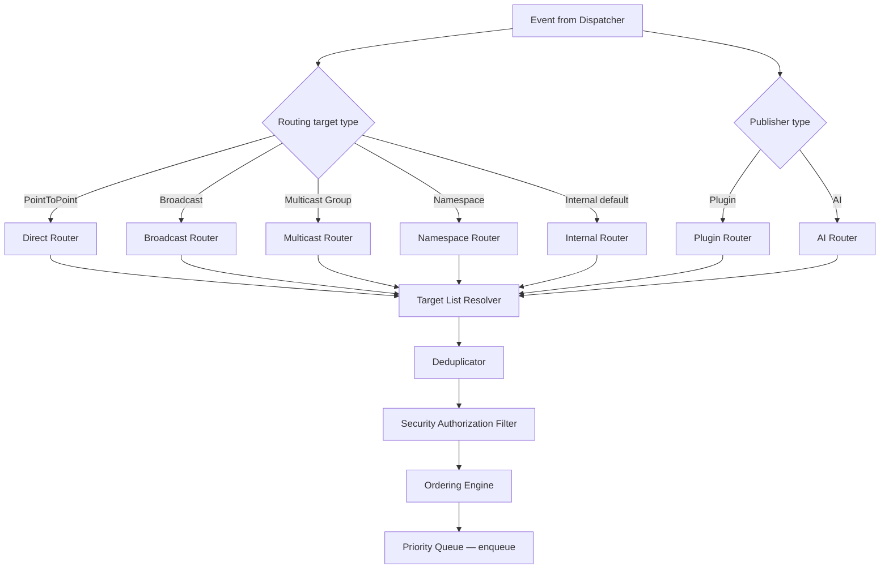
```mermaid
flowchart TD
    A[Event from Dispatcher] --> B{Routing target type}
    B -->|PointToPoint| C[Direct Router]
    B -->|Broadcast| D[Broadcast Router]
    B -->|Multicast Group| E[Multicast Router]
    B -->|Namespace| F[Namespace Router]
    B -->|Internal default| G[Internal Router]

    C & D & E & F & G --> H[Target List Resolver]

    A --> I{Publisher type}
    I -->|Plugin| J[Plugin Router]
    I -->|AI| K[AI Router]
    J & K --> H

    H --> L[Deduplicator]
    L --> M[Security Authorization Filter]
    M --> N[Ordering Engine]
    N --> O[Priority Queue — enqueue]
```

---

## 11. Security

Security is a first-class, non-optional concern of the Event System. Every
event passes through multiple security checkpoints. No security check may
be bypassed, disabled, or overridden by any component including the
Application Layer.

### 11.1 Security Architecture

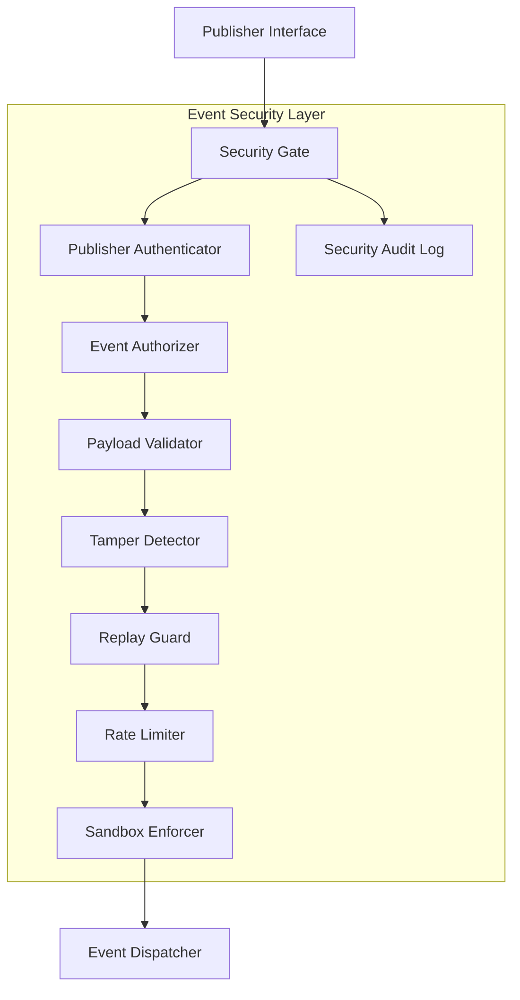
```mermaid
graph TD
    subgraph SecurityLayer["Event Security Layer"]
        SG[Security Gate]
        AUTH[Publisher Authenticator]
        AUTHZ[Event Authorizer]
        VAL[Payload Validator]
        TAMP[Tamper Detector]
        REPLAY[Replay Guard]
        RATE[Rate Limiter]
        SAND[Sandbox Enforcer]
        AUDIT[Security Audit Log]
    end

    EPI[Publisher Interface] --> SG
    SG --> AUTH
    AUTH --> AUTHZ
    AUTHZ --> VAL
    VAL --> TAMP
    TAMP --> REPLAY
    REPLAY --> RATE
    RATE --> SAND
    SAND --> ED[Event Dispatcher]
    SG --> AUDIT
```

### 11.2 Publisher Authentication

Every publisher must present a valid `ComponentIdentity` when emitting an
event. The Publisher Authenticator verifies this identity against the
Component Registry — a table of all authorized runtime components populated
at boot time.

**Authentication rules:**
- The `component_id` must exist in the Component Registry
- The `instance_id` must match the registered instance for this session
- Plugin publishers must present a valid plugin identity issued by the
  Plugin Runtime at plugin initialization time
- AI publishers must present a valid AI session token issued by the AI Runtime
- Unrecognized publishers are rejected with `SecurityError::UnknownPublisher`
- Authentication failures are always logged to the Security Audit Log

**Component Registry:** The Component Registry is populated during the boot
sequence and is immutable after `runtime.ready`. No new components may be
registered as publishers after boot (except plugins, which are registered
by the Plugin Runtime when they initialize).

### 11.3 Event Authorization

After authentication, the Event Authorizer checks whether the authenticated
publisher is permitted to emit the specific event type.

**Authorization matrix:**

| Publisher Type | Permitted Event Namespaces |
|---|---|
| Runtime Kernel | All namespaces |
| Boot Manager | `boot.*`, `runtime.*` (boot phase only) |
| Lifecycle Manager | `lifecycle.*`, `runtime.*` |
| Resource Manager | `resource.*` |
| VFS | `resource.*` (file-level only) |
| Security Runtime | `security.*`, `permission.*` |
| Plugin Runtime | `plugin.*` |
| Individual Plugin | `custom.<plugin_id>.*`, `log.*` (own logs only) |
| AI Runtime | `ai.*` |
| State Manager | `storage.*` |
| Navigation Engine | `navigation.*` |
| Platform Adapter | `system.*` |
| Developer Runtime | `developer.*`, `diagnostics.*` |
| Application Layer | None — Application Layer is a subscriber, not a publisher |

Any attempt to emit an event outside the permitted namespace is rejected
with `SecurityError::UnauthorizedEventType` and a `security.violation`
event is emitted.

### 11.4 Payload Verification

The Payload Validator performs structural and semantic validation as defined
in Section 9.5. In addition, it enforces the following security-specific
rules:

**PII handling:**
- If `pii_present: true`, the payload is flagged for redaction before
  logging
- PII-containing payloads are never written to the trace log in production
- PII-containing payloads are never delivered to plugin subscribers

**Injection prevention:**
- String fields in payloads are validated against an allowlist of safe
  characters
- JSON values in the `custom` metadata field are parsed and re-serialized
  to prevent injection via malformed JSON
- Path-like strings are validated against path traversal patterns

**Schema enforcement:**
- Unknown fields in the payload are stripped before delivery (defense
  against schema confusion attacks)
- Fields with values outside their defined range are rejected

### 11.5 Tamper Detection

The Tamper Detector verifies the `checksum` field of every event envelope
at two points:

1. **At Security Gate entry:** The checksum is computed over the serialized
   payload body and compared to the `checksum` field. A mismatch at this
   point indicates the publisher computed the checksum incorrectly — the
   event is rejected with `ValidationError`.

2. **At Dispatcher re-validation:** The checksum is re-verified after the
   event has been in the queue. A mismatch at this point indicates the
   event was mutated while in the queue — this is a `security.tamper_detected`
   event and the event is moved to the Dead Letter Queue immediately.

**Checksum algorithm:** CRC32 (using the `crc32fast` crate already present
in the project's `Cargo.lock`). CRC32 is used for tamper detection, not
cryptographic integrity — it detects accidental corruption and simple
tampering. For cryptographic integrity of the document itself, the SHA-256
hashes from Phase 1 are used.

### 11.6 Replay Attack Prevention

The Replay Guard maintains a sliding window of recently seen Event IDs.
If an event arrives with an Event ID that has already been processed within
the replay window, it is rejected as a replay attack.

**Replay window:** 60 seconds (configurable)
**Window implementation:** Bloom filter with a false positive rate of 0.01%
backed by a time-bucketed hash set for exact verification on positive hits.

**Replay detection rules:**
- An event with a duplicate Event ID within the replay window is rejected
- `security.replay_detected` is emitted with the duplicate Event ID
- The publisher that submitted the duplicate is flagged in the Rate Limiter
- Legitimate replays (developer mode, test harness) use the `replay: true`
  flag and a new Event ID — they are not subject to replay detection

### 11.7 Plugin Isolation

Plugin events are subject to the strictest isolation rules in the Event System:

**Emission isolation:**
- Plugins emit events only via the Plugin Runtime's sandboxed API
- The Plugin Runtime validates every plugin emission before forwarding to
  the Security Gate
- Plugins cannot access the Publisher Interface directly

**Subscription isolation:**
- Plugin subscriptions are stored in an isolated partition of the Subscriber Registry
- Plugin callbacks are invoked in the plugin's WASM sandbox
- The event payload is serialized to JSON before crossing the sandbox boundary
- The plugin receives a read-only copy — it cannot modify the payload

**Namespace isolation:**
- Plugin A cannot subscribe to Plugin B's `custom.*` events without explicit
  cross-plugin permission
- Plugins cannot subscribe to `Internal` or `Kernel` classified events
- Plugin subscription to `Document` events requires the `event.subscribe.document`
  permission

**Sandbox violation response:**
- If a plugin attempts to emit a reserved namespace event (e.g., `runtime.*`),
  the Plugin Runtime intercepts it and emits `plugin.sandbox_violation`
- `security.sandbox_violation` is emitted immediately
- The plugin is terminated
- The runtime enters the plugin error recovery state

### 11.8 AI Isolation

AI events are subject to rate limiting and content filtering:

**Rate limiting:**
- Maximum 100 AI events per second (sliding window)
- Maximum 10 concurrent AI inference events
- Exceeding limits triggers `ai.quota_exceeded` — the excess events are dropped

**Content filtering:**
- AI inference result payloads are passed through the content safety filter
  before delivery
- Filtered content triggers `ai.content_filtered` — the result is replaced
  with a safe placeholder
- AI events cannot carry `Internal` or `Kernel` classified payloads

### 11.9 Permission Checks

Before delivering an event to a subscriber, the Security Gate's delivery
authorization check verifies:

1. The subscriber's component has the required clearance for the event's
   `security_label.clearance`
2. If the event is `Document`-classified, the document has the
   `event.receive.document` permission
3. If the event is `Plugin`-classified, the plugin has the
   `event.receive.plugin` permission
4. If the event contains PII (`pii_present: true`), the subscriber has the
   `event.receive.pii` permission

### 11.10 Rate Limiting

The Rate Limiter enforces per-publisher emission rate limits to prevent
event flooding:

| Publisher Type | Rate Limit |
|---|---|
| Runtime Kernel | Unlimited |
| Internal runtime components | 10,000 events/second |
| Application Layer | 1,000 events/second |
| Individual Plugin | 100 events/second |
| AI Runtime | 100 events/second |
| Document scripts | 50 events/second |

Rate limit violations trigger `security.rate_limit_exceeded`. After 3
consecutive violations within 10 seconds, the publisher is temporarily
suspended for 5 seconds.

### 11.11 Security Audit Log

All security-relevant events are written to the Security Audit Log
regardless of the runtime's log level configuration. The Audit Log is
append-only and cannot be cleared by any runtime component.

**Events always written to the Audit Log:**
- All `security.*` events
- All `permission.*` events
- All `plugin.sandbox_violation` events
- All rate limit violations
- All authentication and authorization failures
- All tamper detection events
- All replay detection events

**Audit Log format:** Each entry is a JSON record with the full event
envelope (payload redacted if `redact_in_production: true`), the security
check that triggered the log entry, and the outcome (approved / rejected).

### 11.12 Security Flow Diagram

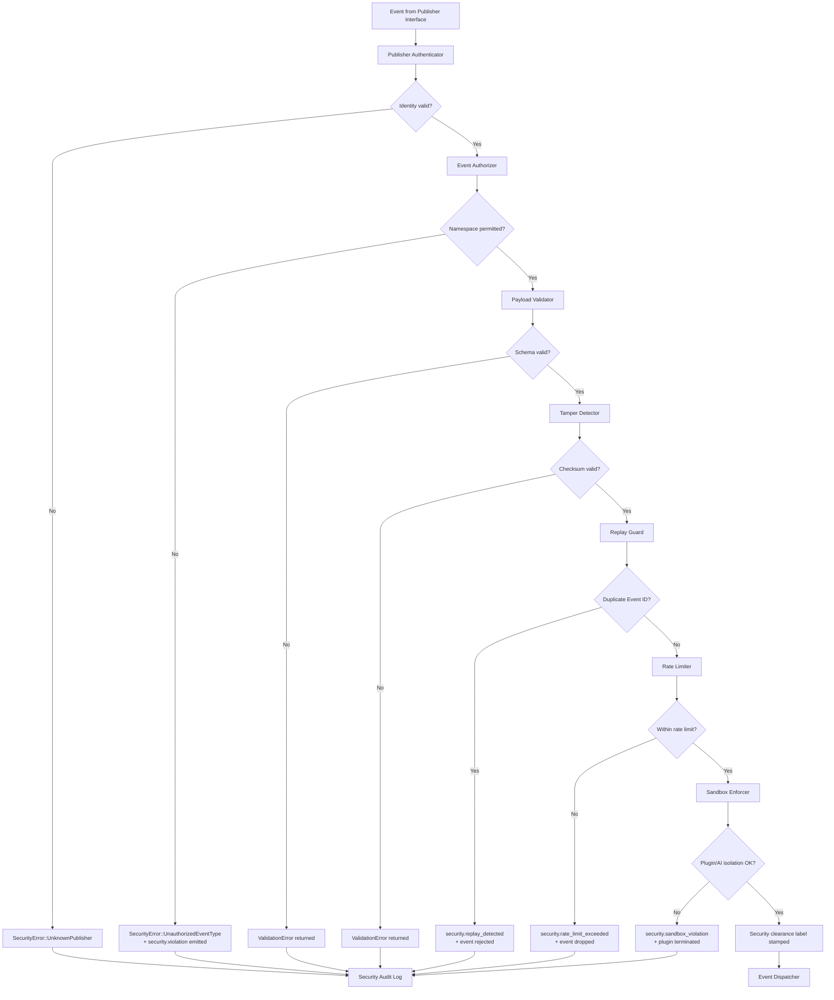
```mermaid
flowchart TD
    A[Event from Publisher Interface] --> B[Publisher Authenticator]
    B --> C{Identity valid?}
    C -->|No| D[SecurityError::UnknownPublisher]
    C -->|Yes| E[Event Authorizer]
    E --> F{Namespace permitted?}
    F -->|No| G[SecurityError::UnauthorizedEventType\n+ security.violation emitted]
    F -->|Yes| H[Payload Validator]
    H --> I{Schema valid?}
    I -->|No| J[ValidationError returned]
    I -->|Yes| K[Tamper Detector]
    K --> L{Checksum valid?}
    L -->|No| M[ValidationError returned]
    L -->|Yes| N[Replay Guard]
    N --> O{Duplicate Event ID?}
    O -->|Yes| P[security.replay_detected\n+ event rejected]
    O -->|No| Q[Rate Limiter]
    Q --> R{Within rate limit?}
    R -->|No| S[security.rate_limit_exceeded\n+ event dropped]
    R -->|Yes| T[Sandbox Enforcer]
    T --> U{Plugin/AI isolation OK?}
    U -->|No| V[security.sandbox_violation\n+ plugin terminated]
    U -->|Yes| W[Security clearance label stamped]
    W --> X[Event Dispatcher]
    D & G & J & M & P & S & V --> Y[Security Audit Log]
```

---

## 12. Runtime Integration

The Event System integrates with every subsystem in the LDFX Runtime. This
section defines the precise integration contract between the Event System
and each subsystem — what each subsystem publishes, what it subscribes to,
and how the Event System fits into its operational model.

### 12.1 Integration Overview


```mermaid
graph TD
    ES[Event System]

    subgraph Integrations
        RK[Runtime Kernel]
        RAPI[Runtime APIs]
        RE[Runtime Engine]
        VFS[Virtual File System]
        RM[Resource Manager]
        SCHED[Scheduler]
        SM[State Manager]
        SEC[Security Runtime]
        PLUG[Plugin Runtime]
        DEV[Developer Runtime]
        AI[AI Runtime]
        LOG[Logger]
        DIAG[Diagnostics]
    end

    RK <-->|publishes + subscribes| ES
    RAPI <-->|subscribes + bridges| ES
    RE <-->|publishes + subscribes| ES
    VFS -->|publishes| ES
    RM <-->|publishes + subscribes| ES
    SCHED <-->|publishes + subscribes| ES
    SM <-->|publishes + subscribes| ES
    SEC <-->|publishes + subscribes| ES
    PLUG <-->|publishes + subscribes| ES
    DEV <-->|subscribes + replays| ES
    AI <-->|publishes + subscribes| ES
    LOG -->|subscribes| ES
    DIAG -->|subscribes| ES
```

### 12.2 Runtime Kernel Integration

The Runtime Kernel is the primary publisher of lifecycle and boot events.
It owns the Event System's initialization and shutdown sequences.

**Publishes:** `runtime.*`, `boot.*`, `lifecycle.*`, `system.*`

**Subscribes to:**
- `security.violation` → triggers emergency shutdown
- `security.sandbox_violation` → triggers plugin termination + shutdown
- `system.memory_critical` → triggers memory pressure response
- `system.suspend` → triggers runtime suspension sequence
- `plugin.crashed` → triggers plugin recovery or shutdown

**Integration contract:**
- The Kernel initializes the Event System as the first action in the boot
  sequence (before any other subsystem)
- The Kernel shuts down the Event System as the last action in the shutdown
  sequence (after all other subsystems)
- The Kernel's subscription to `security.violation` uses `First` priority
  override — it is always the first subscriber to receive security violations

### 12.3 Runtime APIs Integration

The Runtime API Layer is the bridge between the Event System and the
Application Layer. It does not publish events directly — instead it
translates Application Layer API calls into runtime operations and
translates runtime events into Application Layer callbacks.

**Subscribes to:** All `Public`-classified events, all `Document`-classified
events (for forwarding to document scripts)

**Integration contract:**
- The Runtime API Layer registers a wildcard subscription for all
  `Public`-classified events at boot time
- When a `Public` event is received, the API Layer invokes the registered
  Application Layer callback
- The API Layer exposes the `Events` namespace (Section 15) to the
  Application Layer
- The API Layer enforces that the Application Layer cannot subscribe to
  `Internal` or `Kernel` events

**Event forwarding sequence:**
```mermaid
sequenceDiagram
    participant ES as Event System
    participant API as Runtime API Layer
    participant APP as Application Layer

    ES->>API: deliver(runtime.ready, payload)
    API->>API: translate to public type
    API->>APP: callback(RuntimeEvent::Ready, public_payload)
    APP-->>API: Ok
    API-->>ES: Ok
```

### 12.4 Runtime Engine Integration

The Runtime Engine is both a major publisher and a major subscriber. It
publishes UI, navigation, and lifecycle events and subscribes to resource,
theme, language, and configuration events.

**Publishes:** `ui.*`, `navigation.*`, `lifecycle.page_entered`,
`lifecycle.page_exited`, `lifecycle.focus_gained`, `lifecycle.focus_lost`

**Subscribes to:**
- `resource.page_loaded` → triggers page render pipeline
- `resource.asset_loaded` → triggers asset integration into render tree
- `theme.changed` → triggers full re-render
- `language.changed` → triggers localization refresh
- `navigation.navigate_started` → triggers navigation guard evaluation
- `window.resized` → triggers layout recalculation
- `window.dpi_changed` → triggers DPI-aware re-render

**Integration contract:**
- The Engine subscribes to `resource.page_loaded` with `BeforePlugins`
  priority — it processes the page before plugins receive the event
- The Engine's `ui.render_complete` event carries the frame timestamp for
  performance monitoring

### 12.5 Virtual File System Integration

The VFS is a publisher only — it does not subscribe to any events. It
emits resource-level events when file entries are accessed.

**Publishes:** `resource.asset_load_started`, `resource.asset_loaded`,
`resource.asset_load_failed` (file-level granularity)

**Integration contract:**
- VFS events are always `Internal` classified — not visible to plugins
- VFS events are emitted at `Normal` priority
- The Resource Manager subscribes to VFS events to update its cache state

### 12.6 Resource Manager Integration

The Resource Manager is the primary publisher of `resource.*` events and
subscribes to VFS events to maintain cache coherence.

**Publishes:** All `resource.*` events

**Subscribes to:**
- `system.memory_pressure` → triggers cache eviction
- `system.memory_critical` → triggers aggressive cache eviction
- `lifecycle.document_closing` → triggers full cache release

**Integration contract:**
- The Resource Manager emits `resource.cache_pressure` when its cache
  reaches 80% of the configured maximum
- The Resource Manager emits `resource.cache_evicted` for every eviction
  batch (not per-entry — batched for performance)
- The Resource Manager subscribes to `lifecycle.document_closing` with
  `First` priority to begin releasing resources before other components
  receive the closing event

### 12.7 Scheduler Integration

The Scheduler uses the Event System to communicate task completion and
scheduling state changes.

**Publishes:** Internal scheduling events (not exposed to Application Layer)

**Subscribes to:**
- `runtime.idle` → triggers deferred task execution
- `system.cpu_throttled` → reduces task concurrency
- `lifecycle.document_closing` → cancels all pending tasks

**Integration contract:**
- The Scheduler does not use the Event System for task dispatch — tasks
  are dispatched via direct function calls
- The Scheduler uses the Event System only for state change notifications
- The Scheduler's idle detection triggers the Idle Queue drain

### 12.8 State Manager Integration

The State Manager publishes storage events and subscribes to lifecycle
events to manage session state persistence.

**Publishes:** `storage.*`

**Subscribes to:**
- `lifecycle.page_exited` → triggers page state checkpoint
- `lifecycle.document_closing` → triggers full state persistence
- `runtime.sleeping` → triggers emergency state persistence
- `runtime.background` → triggers background state persistence

**Integration contract:**
- State persistence is triggered by events, not by timers
- The State Manager subscribes to `runtime.sleeping` with `First` priority
  to ensure state is persisted before the runtime suspends

### 12.9 Security Runtime Integration

The Security Runtime is both a publisher and a subscriber. It publishes
all `security.*` and `permission.*` events and subscribes to events that
require security enforcement.

**Publishes:** `security.*`, `permission.*`

**Subscribes to:**
- `plugin.loading` → triggers plugin signature verification
- `plugin.message` → triggers plugin message content inspection
- `ai.inference_complete` → triggers AI output content filtering
- `navigation.navigate_started` → triggers navigation target security check
- `resource.page_load_started` → triggers page content security check

**Integration contract:**
- The Security Runtime subscribes to `plugin.loading` with `First` priority
  — it must verify the plugin before the Plugin Runtime initializes it
- Security Runtime subscriptions cannot be cancelled or overridden
- The Security Runtime writes to the Security Audit Log directly — it does
  not use the Event System for audit logging (to prevent circular dependency)

### 12.10 Plugin Runtime Integration

The Plugin Runtime manages the boundary between the plugin sandbox and the
Event System. It acts as a proxy for all plugin event operations.

**Publishes:** `plugin.*` (on behalf of plugins)

**Subscribes to:**
- `lifecycle.document_closing` → triggers plugin shutdown sequence
- `runtime.sleeping` → triggers plugin suspension
- `security.sandbox_violation` → triggers immediate plugin termination

**Integration contract:**
- The Plugin Runtime intercepts all plugin emission attempts and validates
  them before forwarding to the Security Gate
- The Plugin Runtime serializes event payloads to JSON before delivering
  them to plugin WASM sandboxes
- The Plugin Runtime maintains a per-plugin subscription registry that is
  atomically cleared when a plugin terminates

### 12.11 Developer Runtime Integration

The Developer Runtime is a subscriber-only component. It observes all
events for debugging, profiling, and inspection purposes.

**Subscribes to:** All events (wildcard `*` subscription — authorized only
for Developer Runtime)

**Integration contract:**
- The Developer Runtime subscription uses `Last` priority override — it
  observes events after all other subscribers have processed them
- The Developer Runtime subscription is active only in developer mode
- The Developer Runtime can trigger event replay via the Replay Engine
- The Developer Runtime exposes the live event monitor (Section 14)

### 12.12 AI Runtime Integration

The AI Runtime publishes AI events and subscribes to document events that
trigger AI operations.

**Publishes:** `ai.*`

**Subscribes to:**
- `lifecycle.page_entered` → may trigger AI page analysis (if configured)
- `ui.selection_changed` → may trigger AI context analysis (if configured)
- `lifecycle.document_closing` → triggers AI session cleanup

**Integration contract:**
- All AI subscriptions are conditional — they only activate when the
  document has configured AI features
- AI events are always delivered via the AI Channel with rate limiting
- AI Runtime subscriptions are removed when the AI session ends

### 12.13 Logger Integration

The Logger subscribes to all events and writes structured log records.

**Subscribes to:** All events (wildcard `*` subscription — authorized)

**Integration contract:**
- Logger subscription uses `Last` priority override
- In production: only `Critical` and `High` events are logged
- In developer mode: all events are logged
- PII-containing payloads are redacted before logging
- Security events are always logged regardless of log level

### 12.14 Diagnostics Integration

The Diagnostics Service subscribes to diagnostic and performance events
and maintains the runtime health dashboard.

**Subscribes to:** `diagnostics.*`, `system.*`, `security.*`,
`plugin.crashed`, `plugin.failed`, `resource.cache_pressure`

**Integration contract:**
- Diagnostics subscription uses `Last` priority override
- Diagnostics data is aggregated in memory and exposed via the
  `Events.statistics()` API
- In developer mode, diagnostics data is also exposed via the Developer Console

---

## 13. Performance

The Event System is on the critical path of every runtime operation. Its
performance characteristics directly determine the responsiveness of the
entire LDFX Runtime. This section defines performance targets, optimization
strategies, and the mechanisms used to achieve them.

### 13.1 Performance Targets

| Metric | Target | Measurement |
|---|---|---|
| Critical event end-to-end latency | < 1 ms | Emission to first subscriber delivery |
| High event end-to-end latency | < 5 ms | Emission to first subscriber delivery |
| Normal event end-to-end latency | < 16 ms | Emission to first subscriber delivery |
| Security Gate throughput | > 50,000 events/second | Single-threaded |
| Event Bus routing throughput | > 100,000 events/second | Multi-threaded |
| Subscriber resolution time | < 100 µs | Per event type lookup |
| Wildcard resolution time | < 500 µs | Per wildcard pattern |
| Queue enqueue time | < 10 µs | Per event |
| Queue dequeue time | < 10 µs | Per event |
| Memory per event envelope | < 512 bytes | In-process (no serialization) |
| Memory per queued event | < 1 KB | Including metadata |

### 13.2 Event Batching

The Event System supports batching for high-frequency, low-priority events
to reduce per-event overhead.

**Batching rules:**
- Only `Low` and `Deferred` priority events may be batched
- Batching is opt-in — publishers must explicitly request batching
- Batch window: 16 ms (one render frame)
- Maximum batch size: 64 events
- Batched events are delivered as a `Vec<EventEnvelope>` to subscribers
  that have registered for batch delivery

**Batch-eligible event types:**
- `analytics.*` — all analytics events
- `log.trace`, `log.debug` — verbose log events
- `diagnostics.health_check` — periodic health snapshots
- `resource.cache_evicted` — cache eviction notifications
- `ui.scroll_changed` — high-frequency scroll events

### 13.3 Event Coalescing

Coalescing merges multiple identical or near-identical events into a single
delivery when the subscriber only needs the final state.

**Coalescing rules:**
- Only events with the same `event_type` and same `origin.component_id`
  may be coalesced
- Coalescing window: 8 ms
- The coalesced event carries the payload of the most recent event in the
  window
- The coalesced event's `metadata.tags["coalesced_count"]` records how many
  events were merged

**Coalescing-eligible event types:**
- `ui.scroll_changed` — only the final scroll position matters
- `window.resized` — only the final window size matters
- `ui.zoom_changed` — only the final zoom level matters
- `storage.value_set` for the same key — only the final value matters

### 13.4 Compression

Event payloads that exceed 4 KB and are destined for cross-boundary delivery
(plugin sandbox, AI sandbox, trace log) are compressed using zstd (the
`zstd` crate is present in the project's `Cargo.lock`).

**Compression rules:**
- In-process delivery: never compressed (zero-copy struct passing)
- Cross-sandbox delivery: compressed if payload > 4 KB
- Trace log archival: compressed if payload > 1 KB
- Compression level: zstd level 3 (fast compression, good ratio)

### 13.5 Queue Optimization

**Lock-free queues:** The Critical and High queues use lock-free MPSC
(multi-producer, single-consumer) ring buffers. The Normal and lower queues
use a mutex-protected VecDeque with a short critical section.

**Cache-line alignment:** Event envelope structs are aligned to 64-byte
cache lines to prevent false sharing between producer and consumer threads.

**Pre-allocation:** The Event System pre-allocates a pool of event envelope
objects at boot time to avoid heap allocation on the hot path.

| Queue | Implementation | Pre-allocated pool |
|---|---|---|
| Critical | Lock-free ring buffer | 64 envelopes |
| High | Lock-free ring buffer | 512 envelopes |
| Normal | Mutex VecDeque | 2048 envelopes |
| Background | Mutex VecDeque | 1024 envelopes |
| Idle | Mutex VecDeque | 256 envelopes |
| Retry | Mutex BinaryHeap | 512 envelopes |

### 13.6 Priority Scheduling Optimization

The Priority Scheduler uses a tiered check strategy to minimize overhead
when the Critical and High queues are empty (the common case):

```
function fast_path_schedule():
    // Atomic check — no lock required
    if critical_queue.atomic_len() > 0:
        return critical_queue.dequeue()
    if high_queue.atomic_len() > 0:
        return high_queue.dequeue()
    // Fall through to weighted round-robin for lower tiers
    return weighted_schedule()
```

The `atomic_len()` check uses an atomic counter maintained alongside the
queue — it does not require acquiring the queue lock.

### 13.7 Memory Optimization

**Event envelope pooling:** Delivered event envelopes are returned to the
pre-allocated pool rather than freed. The pool uses a thread-local free
list to avoid contention.

**Payload zero-copy:** For in-process delivery, the event payload is passed
as an `Arc<EventPayload>` — all subscribers share the same payload allocation.
No copying occurs during delivery.

**Subscriber list caching:** The resolved subscriber list for each event
type is cached in the Dispatcher. The cache is invalidated only when a
subscription changes. This eliminates repeated Registry lookups for
high-frequency events.

### 13.8 Latency Targets by Event Path

```mermaid
graph LR
    A[Publisher emit] -->|"< 5 µs"| B[Security Gate]
    B -->|"< 10 µs"| C[Queue enqueue]
    C -->|"< 10 µs"| D[Scheduler dequeue]
    D -->|"< 100 µs"| E[Subscriber resolution]
    E -->|"< 50 µs"| F[Filter + order]
    F -->|"< 50 µs"| G[Delivery to subscriber]

    style A fill:#2d5a27
    style G fill:#2d5a27
```

**Total Critical path budget:** < 1 ms (emission to first subscriber)
**Total High path budget:** < 5 ms
**Total Normal path budget:** < 16 ms (one render frame)

### 13.9 Performance Metrics

The Dispatcher Monitor (Section 5.2.10) exposes the following performance
metrics to the Diagnostics Service:

| Metric | Type | Description |
|---|---|---|
| `event_throughput_per_sec` | Gauge | Events processed per second |
| `dispatch_latency_p50_µs` | Histogram | Median dispatch latency |
| `dispatch_latency_p95_µs` | Histogram | 95th percentile dispatch latency |
| `dispatch_latency_p99_µs` | Histogram | 99th percentile dispatch latency |
| `queue_depth_critical` | Gauge | Current Critical queue depth |
| `queue_depth_high` | Gauge | Current High queue depth |
| `queue_depth_normal` | Gauge | Current Normal queue depth |
| `retry_queue_depth` | Gauge | Current Retry queue depth |
| `dead_letter_total` | Counter | Total dead-lettered events |
| `overflow_total` | Counter | Total overflow rejections |
| `coalesced_total` | Counter | Total coalesced event pairs |
| `batched_total` | Counter | Total batched event groups |
| `pool_hit_rate` | Gauge | Envelope pool hit rate (target > 95%) |

### 13.10 Backpressure Handling

When the Event System is under load, backpressure propagates upstream to
publishers:

**Level 1 — Soft backpressure (queue 70–85% full):**
- Low and Deferred publishers receive a `BackpressureWarning` alongside
  their `Ok` result
- Publishers should reduce emission rate voluntarily

**Level 2 — Hard backpressure (queue 85–95% full):**
- Low and Deferred publishers receive `Err(OverflowError)` — events dropped
- Normal publishers receive `BackpressureWarning`

**Level 3 — Critical backpressure (queue > 95% full):**
- All publishers except Critical receive `Err(OverflowError)`
- `diagnostics.queue_snapshot` is emitted every 100 ms

**Level 4 — Full overflow (queue 100% full):**
- All publishers receive `Err(OverflowError)`
- The runtime enters degraded mode
- `runtime.error` is emitted if the overflow persists for > 5 seconds

---

## 14. Diagnostics

The Diagnostics subsystem of the Event System provides complete observability
into event flow, delivery health, and system performance. It is designed
for both developer-mode interactive inspection and production-mode automated
health monitoring.

### 14.1 Live Event Monitor

The Live Event Monitor is a real-time stream of all events flowing through
the Event System. It is available exclusively in developer mode and is
exposed via the Developer Console and the `Events.inspect()` API.

**Monitor capabilities:**

| Capability | Description |
|---|---|
| Real-time stream | Events appear in the monitor within 1 ms of emission |
| Pause and resume | The stream can be paused without affecting event delivery |
| Filtering | Filter by event type, namespace, publisher, priority, or payload field |
| Search | Full-text search across event type and payload |
| Detail view | Expand any event to see the full envelope including trace context |
| Replay | Re-emit any archived event via the Replay Engine |
| Export | Export the current event stream as JSON or CSV |

**Monitor data source:** The Developer Runtime subscribes to all events
with `Last` priority and forwards them to the Live Event Monitor buffer.
The buffer holds the last 10,000 events in a ring buffer. Events older
than the buffer capacity are evicted (not lost — they are in the trace log).

### 14.2 Tracing

The Tracing subsystem provides distributed-trace-style visibility into
event causality chains. Every event carries a `trace_id` and `span_id`
(Section 9.2.2) that link related events into a causal tree.

**Trace visualization:**
```
boot.started [T1/S1] ─────────────────────────────────────────────────────┐
  ├─ boot.header_verified    [T1/S2, parent: S1]                           │
  ├─ boot.manifest_loaded    [T1/S3, parent: S1]                           │
  ├─ boot.integrity_verified [T1/S4, parent: S1]                           │
  ├─ boot.resources_loading  [T1/S5, parent: S1]                           │
  │    ├─ resource.page_load_started [T1/S6, parent: S5]                   │
  │    └─ resource.page_loaded       [T1/S7, parent: S5]                   │
  ├─ boot.plugins_ready      [T1/S8, parent: S1]                           │
  └─ runtime.ready           [T1/S9, parent: S1, corr: boot.started.id]   ─┘
```

**Trace storage:**
- In developer mode: all traces retained for the full session
- In production mode: only traces involving `Critical` or `High` events
  are retained; retained for 5 minutes
- Traces can be exported as OpenTelemetry-compatible JSON

### 14.3 Timeline Viewer

The Timeline Viewer presents event delivery as a horizontal timeline,
showing the temporal relationship between events and their delivery
durations. It is available in developer mode via the Developer Console.

**Timeline features:**
- Horizontal time axis (millisecond resolution)
- Each event shown as a horizontal bar from emission to completion
- Color-coded by priority tier
- Hover to see full event details
- Zoom in/out on time axis
- Filter by event family or publisher
- Highlight slow events (exceeding latency targets)
- Show queue depth as an overlay graph

### 14.4 Filtering

The Diagnostics subsystem supports multi-dimensional filtering for all
diagnostic views:

| Filter Dimension | Examples |
|---|---|
| Event type | `resource.page_loaded`, `security.*`, `plugin.*` |
| Publisher | `resource_manager`, `plugin:my_plugin` |
| Priority | `Critical`, `High`, `Normal` |
| Time range | Last 1s, last 10s, last 1m, custom range |
| Outcome | `Completed`, `Dead_Letter`, `Retry`, `Rejected` |
| Latency | Events exceeding N ms |
| Session | Specific session ID |
| Correlation | All events in a trace chain |

### 14.5 Statistics

The `Events.statistics()` API (Section 15.11) exposes aggregated statistics
for the current session:

```
EventStatistics {
    session_id:                UUID,
    uptime_ms:                 u64,
    total_emitted:             u64,
    total_delivered:           u64,
    total_failed:              u64,
    total_dead_lettered:       u64,
    total_rejected:            u64,
    total_coalesced:           u64,
    total_batched:             u64,
    by_namespace: {
        "runtime":    NamespaceStats { emitted, delivered, failed },
        "resource":   NamespaceStats { emitted, delivered, failed },
        "security":   NamespaceStats { emitted, delivered, failed },
        ...
    },
    queue_depths: {
        critical:    u32,
        high:        u32,
        normal:      u32,
        background:  u32,
        idle:        u32,
        retry:       u32,
        dead_letter: u32
    },
    latency_percentiles: {
        p50_µs:  u64,
        p95_µs:  u64,
        p99_µs:  u64,
        max_µs:  u64
    },
    subscriber_count:          u32,
    active_traces:             u32
}
```

### 14.6 Health Monitoring

The Event System emits periodic health snapshots via `diagnostics.health_check`
events (Idle priority, every 30 seconds in production, every 5 seconds in
developer mode).

**Health indicators:**

| Indicator | Healthy | Warning | Critical |
|---|---|---|---|
| Dead letter queue depth | 0 | 1–10 | > 10 |
| Retry queue depth | 0–10 | 11–50 | > 50 |
| Normal queue depth | 0–500 | 501–1500 | > 1500 |
| Dispatch latency p99 | < 10 ms | 10–50 ms | > 50 ms |
| Subscriber count | < 200 | 200–240 | > 240 |
| Pool hit rate | > 95% | 85–95% | < 85% |
| Security violations (session) | 0 | 1–3 | > 3 |

When any indicator reaches `Critical`, a `diagnostics.health_check` event
is emitted immediately (not waiting for the next scheduled interval) at
`High` priority.

### 14.7 Developer Console Integration

In developer mode, the Developer Console exposes the following Event System
panels:

| Panel | Description |
|---|---|
| Event Stream | Live event monitor with filtering and search |
| Event Timeline | Timeline viewer with zoom and filter |
| Subscriber Map | Visual map of all active subscriptions |
| Queue Monitor | Real-time queue depth graphs for all 7 tiers |
| Dead Letter Inspector | Browse and inspect dead-lettered events |
| Trace Explorer | Navigate event causality trees |
| Statistics Dashboard | Session-wide event statistics |
| Security Log | Security Audit Log viewer |

---

## 15. Public Event APIs

The `Events` namespace is the public interface through which the Application
Layer and document scripts interact with the Event System. It is part of
the Runtime API Layer (Part 2.5) and is exposed via the `LDF.events` global
object.

All methods in the `Events` namespace are subject to the permission model
defined in Section 11.9. Plugin access to these APIs is mediated by the
Plugin Runtime.

### 15.1 `Events.publish()`

**Purpose:** Emit a custom event from the Application Layer or a document
script. This is the Application Layer's entry point into the Publisher
Interface.

**Signature:**
```
Events.publish(
    event_type: String,
    payload:    Object,
    options?:   PublishOptions
) → Result<EventId, EventError>
```

**Parameters:**

| Parameter | Type | Required | Description |
|---|---|---|---|
| `event_type` | String | Yes | Must use `custom.<namespace>.<name>` format |
| `payload` | Object | Yes | Event payload — must conform to registered schema |
| `options.priority` | Priority | No | Default: `Normal` — cannot exceed `High` |
| `options.correlation_id` | UUID | No | Link to a parent event |
| `options.destination` | RoutingTarget | No | Default: `Broadcast` |
| `options.tags` | Object | No | Key-value metadata tags |

**Returns:** `EventId` (UUID) on success, `EventError` on failure.

**Errors:**

| Error | Condition |
|---|---|
| `InvalidEventType` | Event type does not use `custom.*` prefix |
| `SchemaViolation` | Payload does not match registered schema |
| `RateLimitExceeded` | Publisher exceeded emission rate limit |
| `PermissionDenied` | Publisher lacks `event.publish` permission |
| `QueueOverflow` | Target queue is full |

**Permissions required:** `event.publish`

**Lifecycle:** The returned `EventId` can be used with `Events.trace()` to
inspect the event's delivery progress.

---

### 15.2 `Events.emit()`

**Purpose:** Alias for `Events.publish()` with a simplified signature for
the common case of broadcasting a custom event with no options.

**Signature:**
```
Events.emit(
    event_type: String,
    payload:    Object
) → Result<EventId, EventError>
```

Equivalent to `Events.publish(event_type, payload, { priority: Normal, destination: Broadcast })`.

---

### 15.3 `Events.subscribe()`

**Purpose:** Register a persistent subscription to one or more event types.

**Signature:**
```
Events.subscribe(
    event_types: String | String[],
    callback:    (event: EventEnvelope) → void,
    options?:    SubscribeOptions
) → Result<SubscriptionHandle, EventError>
```

**Parameters:**

| Parameter | Type | Required | Description |
|---|---|---|---|
| `event_types` | String or String[] | Yes | Event type(s) or namespace patterns |
| `callback` | Function | Yes | Invoked on each matching event delivery |
| `options.filter` | Function | No | Predicate — return `true` to receive, `false` to skip |
| `options.priority` | PriorityOverride | No | Default: `Default` |
| `options.parallel_safe` | bool | No | Default: `false` |

**Returns:** `SubscriptionHandle` on success. The handle must be retained
to unsubscribe later.

**Errors:**

| Error | Condition |
|---|---|
| `SubscriberLimitExceeded` | Event type has reached max subscriber count |
| `PermissionDenied` | Subscriber lacks permission for the event classification |
| `InvalidPattern` | Namespace pattern is malformed |
| `ComponentLimitExceeded` | Component has reached max subscription count |

**Permissions required:** `event.subscribe` + classification-specific permission

**Lifecycle:** The subscription remains active until `Events.unsubscribe(handle)`
is called or the handle is garbage collected.

---

### 15.4 `Events.unsubscribe()`

**Purpose:** Deregister a subscription.

**Signature:**
```
Events.unsubscribe(
    handle: SubscriptionHandle
) → Result<void, EventError>
```

**Parameters:**

| Parameter | Type | Required | Description |
|---|---|---|---|
| `handle` | SubscriptionHandle | Yes | Handle returned by `subscribe()` or `once()` |

**Returns:** `void` on success.

**Errors:**

| Error | Condition |
|---|---|
| `InvalidHandle` | Handle is not recognized or already inactive |
| `HandleAlreadyInactive` | Subscription was already removed (idempotent — not an error in practice) |

**Lifecycle:** After unsubscription, the handle becomes inactive. Calling
`unsubscribe()` on an already-inactive handle is a no-op (returns `Ok`).

---

### 15.5 `Events.once()`

**Purpose:** Register a one-time subscription that automatically deregisters
after the first delivery.

**Signature:**
```
Events.once(
    event_type: String,
    callback:   (event: EventEnvelope) → void,
    options?:   OnceOptions
) → Result<SubscriptionHandle, EventError>
```

**Parameters:**

| Parameter | Type | Required | Description |
|---|---|---|---|
| `event_type` | String | Yes | Exact event type (no wildcards) |
| `callback` | Function | Yes | Invoked exactly once |
| `options.timeout_ms` | u64 | No | Auto-cancel if event not received within timeout |
| `options.filter` | Function | No | Predicate — if false, event is skipped and subscription remains |

**Returns:** `SubscriptionHandle` on success.

**Timeout behavior:** If `timeout_ms` is specified and the event is not
received within the timeout, the subscription is automatically removed and
the callback is invoked with `Err(TimeoutError)`.

**Permissions required:** `event.subscribe` + classification-specific permission

---

### 15.6 `Events.broadcast()`

**Purpose:** Emit a custom event with explicit broadcast routing. Equivalent
to `Events.publish()` with `destination: Broadcast`.

**Signature:**
```
Events.broadcast(
    event_type: String,
    payload:    Object
) → Result<EventId, EventError>
```

**Permissions required:** `event.publish`

---

### 15.7 `Events.trace()`

**Purpose:** Retrieve the trace record for a specific event by its Event ID.
Available in developer mode only.

**Signature:**
```
Events.trace(
    event_id: UUID
) → Result<TraceRecord, EventError>
```

**Returns:**
```
TraceRecord {
    event_id:          UUID,
    event_type:        String,
    publisher_id:      String,
    emission_ts:       u64,
    dispatch_ts:       u64,
    completion_ts:     u64,
    state:             EventState,
    subscriber_count:  u32,
    delivery_outcomes: DeliveryOutcome[],
    cancelled:         bool,
    replay:            bool,
    retry_count:       u8,
    dead_lettered:     bool,
    dead_letter_reason: Option<String>
}
```

**Errors:**

| Error | Condition |
|---|---|
| `TraceNotFound` | Event ID not in trace buffer |
| `PermissionDenied` | Not in developer mode |
| `TracingDisabled` | Tracing is not enabled |

**Permissions required:** `developer.events.trace`

---

### 15.8 `Events.inspect()`

**Purpose:** Open a live event stream for inspection. Returns an async
iterator that yields events as they are dispatched. Developer mode only.

**Signature:**
```
Events.inspect(
    options?: InspectOptions
) → Result<EventStream, EventError>
```

**Parameters:**

| Parameter | Type | Required | Description |
|---|---|---|---|
| `options.filter` | EventFilter | No | Filter events before yielding |
| `options.include_internal` | bool | No | Default: `false` — include Internal events |
| `options.buffer_size` | u32 | No | Default: 1000 — stream buffer depth |

**Returns:** `EventStream` — an async iterator. Call `stream.close()` to
stop the stream.

**Permissions required:** `developer.events.inspect`

---

### 15.9 `Events.pause()`

**Purpose:** Pause event delivery to a specific subscriber or to all
subscribers of a specific event type. Used by the Developer Runtime for
debugging.

**Signature:**
```
Events.pause(
    target: PauseTarget
) → Result<PauseHandle, EventError>
```

**PauseTarget variants:**
- `PauseTarget::Subscriber(handle)` — pause delivery to one subscriber
- `PauseTarget::EventType(event_type)` — pause all delivery for an event type
- `PauseTarget::Namespace(pattern)` — pause all delivery for a namespace

**Behavior:** While paused, events are held in a pause buffer (max 256
events). When resumed, buffered events are delivered in order. Events that
exceed the pause buffer are dropped with a `diagnostics.dead_letter` record.

**Permissions required:** `developer.events.pause`

---

### 15.10 `Events.resume()`

**Purpose:** Resume event delivery after a `Events.pause()` call.

**Signature:**
```
Events.resume(
    handle: PauseHandle
) → Result<u32, EventError>
```

**Returns:** The number of buffered events that were delivered on resume.

**Permissions required:** `developer.events.pause`

---

### 15.11 `Events.statistics()`

**Purpose:** Retrieve aggregated event statistics for the current session.

**Signature:**
```
Events.statistics(
    options?: StatisticsOptions
) → Result<EventStatistics, EventError>
```

**Parameters:**

| Parameter | Type | Required | Description |
|---|---|---|---|
| `options.namespace` | String | No | Filter statistics to a specific namespace |
| `options.since_ms` | u64 | No | Statistics since a monotonic timestamp |
| `options.reset` | bool | No | Reset counters after reading (developer mode only) |

**Returns:** `EventStatistics` object as defined in Section 14.5.

**Permissions required:** `event.statistics`

---
