# Phase 2 — Part 2.7: Security Runtime Specification
# LDFX (Living Document Format eXtended)

**Specification Version:** 2.7.0
**Status:** Canonical — Approved
**Classification:** Internal Engineering Specification
**Audience:** Security Engineers, Runtime Engineers, Systems Architects, Cryptography Engineers
**Stability:** Stable — No breaking changes without MAJOR version bump
**Phase:** 2 — Runtime
**Part:** 2.7 of 10
**Depends On:** Part 2.1 (Runtime Foundation), Part 2.2 (VFS), Part 2.3 (Resource Manager), Part 2.4 (Runtime Engine), Part 2.5 (Runtime APIs), Part 2.6 (Event System), Phase 1 (File Format, Cryptographic Manifest)
**Consumed By:** Part 2.8 (Plugin Runtime), Part 2.9 (Developer Runtime), Part 2.10 (Final Integration)

---

## Table of Contents

1. [Security Philosophy](#1-security-philosophy)
2. [Security Runtime Architecture](#2-security-runtime-architecture)
3. [Trust Model](#3-trust-model)
4. [Permission System](#4-permission-system)
5. [Sandbox Architecture](#5-sandbox-architecture)
6. [Cryptographic Security](#6-cryptographic-security)
7. [Secure Boot](#7-secure-boot)
8. [Runtime Monitoring](#8-runtime-monitoring)
9. [Threat Model](#9-threat-model)
10. [Runtime Integration](#10-runtime-integration)
11. [Security Events](#11-security-events)
12. [Security APIs](#12-security-apis)
13. [Logging and Auditing](#13-logging-and-auditing)
14. [Diagnostics](#14-diagnostics)
15. [Testing Strategy](#15-testing-strategy)
16. [Rust Module Layout](#16-rust-module-layout)
17. [Acceptance Criteria](#17-acceptance-criteria)

---

## 1. Security Philosophy

### 1.1 Zero Trust Architecture

The LDFX Security Runtime operates under a Zero Trust model. No component, document, plugin, AI module, or external resource is trusted by default — regardless of origin, signature status, or prior session history. Every access request is authenticated, authorized, and validated independently at the point of access.

Zero Trust in LDFX means:

- Every document is treated as potentially hostile until cryptographic verification passes
- Every plugin is treated as untrusted code until its signature chain is validated and its capabilities are explicitly granted
- Every API call is permission-checked regardless of the caller's identity or prior successful calls
- Every resource load is integrity-verified at the point of consumption, not only at load time
- Every inter-component message is validated before delivery
- Trust is never inherited — a trusted document does not make its plugins trusted

This model is not a performance optimization target — it is a correctness requirement. The Security Runtime is designed so that bypassing any single check does not compromise the overall security posture.

### 1.2 Defense in Depth

The Security Runtime implements multiple independent layers of protection. No single layer is assumed to be infallible. If one layer is bypassed or fails, the next layer catches the violation.

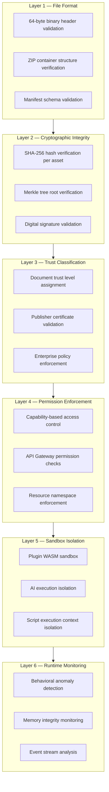

Each layer is owned by a distinct Security Runtime component. A failure in any layer triggers an immediate security event and initiates the appropriate response — from logging to full runtime termination.

### 1.3 Least Privilege

Every component in the LDFX Runtime operates with the minimum set of capabilities required to perform its function. Capabilities are:

- Declared statically in the document or plugin manifest before execution begins
- Immutable after the execution context is created — they cannot be expanded at runtime
- Scoped to the component that declared them — they do not propagate to child components
- Revocable by the Security Runtime in response to a detected violation

A plugin that declares `storage.read` cannot write to storage. A script that declares `resource.read` cannot access the database. An AI module that declares `ai.inference` cannot emit events or access the filesystem. This is not enforced by convention — it is enforced by the API Gateway and the Permission Manager at every call site.

### 1.4 Secure by Default

The LDFX Security Runtime defaults to the most restrictive posture. Features must be explicitly enabled — they are never enabled by default.

| Default State | Requires Explicit Enablement |
|---|---|
| No network access | `network.read` or `network.write` capability |
| No filesystem access | `filesystem.read` or `filesystem.write` capability |
| No clipboard access | `clipboard.read` or `clipboard.write` capability |
| No camera or microphone | `device.camera` or `device.microphone` capability |
| No background execution | `background.execute` capability |
| No plugin execution | Plugin listed in manifest `plugins` block |
| No AI inference | `ai.inference` capability |
| No external API calls | `network.external` capability |
| No cross-plugin messaging | `plugin.messaging` capability |

A document that declares no capabilities runs in a fully read-only, isolated, offline mode. This is the baseline and the safest state.

### 1.5 Offline-First Security

The Security Runtime performs all security operations without network access. Certificate validation, signature verification, integrity checking, and permission enforcement are all local operations. There is no OCSP check, no CRL download, no remote attestation, and no cloud-based policy fetch.

This design ensures:
- Security enforcement is not degraded by network unavailability
- No security metadata leaks to external servers during document opening
- Documents can be verified and executed in air-gapped environments
- The attack surface does not include any network-reachable security infrastructure

Certificate revocation is handled through embedded revocation lists in the document manifest, updated at document publish time by the document author.

### 1.6 Immutable Resources

All resources loaded from the LDFX container are treated as immutable after their integrity is verified. The Security Runtime enforces:

- No resource may be modified after it is loaded into the Resource Manager cache
- No plugin or script may write to the document's VFS namespace
- All mutations to document state go through the Content Model Manager's mutation API, which enforces write permissions
- The cryptographic manifest is read-only for the entire session lifetime

Immutability is enforced at the VFS layer (Part 2.2) and re-enforced at the Security Runtime layer. Any attempt to write to an immutable resource path triggers a `security.violation` event and is rejected.

### 1.7 Trust Boundaries

The LDFX Runtime defines four explicit trust boundaries. Communication across a trust boundary requires explicit authorization and validation.

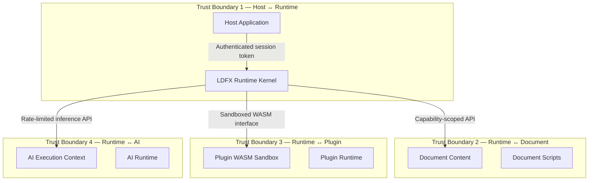

Each boundary is enforced by a dedicated Security Runtime component:
- **TB1**: Session Manager + Host Authentication
- **TB2**: API Gateway + Permission Manager
- **TB3**: Plugin Sandbox + WASM Capability Interface
- **TB4**: AI Isolation Layer + Inference Rate Limiter

### 1.8 Secure Execution Model

The LDFX secure execution model is based on three principles:

**Principle 1 — Execution contexts are isolated.** Each script, plugin, and AI module runs in its own execution context with its own capability set, memory space, and event subscription scope. Contexts cannot share memory or call each other directly.

**Principle 2 — All cross-context communication is mediated.** Scripts communicate with plugins through the Event Bus. Plugins communicate with each other through declared public APIs. AI modules communicate results through the inference result API. No direct object references cross context boundaries.

**Principle 3 — Execution is observable.** Every significant action taken by any execution context is recorded in the Security Audit Log. The Security Runtime can reconstruct the full execution history of any context from the audit log.

### 1.9 Privacy-First Principles

The Security Runtime enforces privacy at the data layer:

- PII detection runs on all event payloads before they are logged or delivered to plugin subscribers
- Analytics data is stripped of all identifying information before recording
- Session identifiers are ephemeral — they are not persisted across sessions
- No document content, user interaction data, or execution trace is transmitted externally
- The Security Runtime does not phone home, check for updates, or report telemetry

### 1.10 Future-Proof Security

The cryptographic design is built for algorithm agility. The Security Runtime supports:

- SHA-256 as the current standard hash algorithm
- SHA-512 as the high-security alternative
- Ed25519 as the current standard signature algorithm
- Post-Quantum Cryptography (PQC) extension points for CRYSTALS-Dilithium and CRYSTALS-Kyber
- Algorithm identifiers in all cryptographic structures to enable seamless migration
- Merkle tree structures that are algorithm-agnostic at the tree level

When PQC algorithms are standardized and production-ready, the Security Runtime can adopt them without changes to the document format or the trust model — only the cryptographic engine implementation changes.

---

## 2. Security Runtime Architecture

### 2.1 Architectural Position

The Security Runtime sits between every runtime component and the resources, APIs, and execution contexts they access. It is not a single module — it is a cross-cutting security layer that every component passes through.

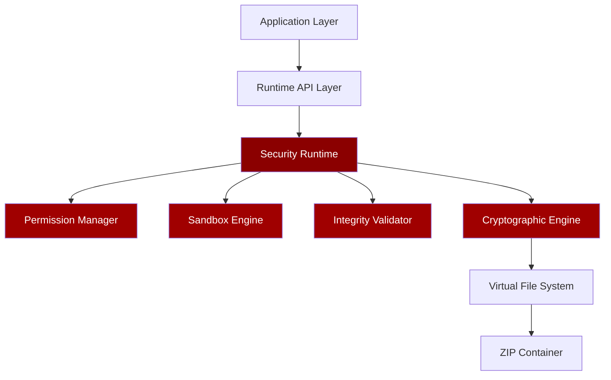

**Responsibilities by component:**

| Component | Responsibility |
|---|---|
| Security Runtime (coordinator) | Orchestrates all security subsystems; owns the Security Audit Log; emits all `security.*` events |
| Permission Manager | Evaluates capability-based access control for every API call and resource access |
| Sandbox Engine | Enforces execution isolation for plugins, AI modules, and scripts |
| Integrity Validator | Verifies SHA-256 hashes and Merkle tree integrity for all loaded resources |
| Cryptographic Engine | Performs signature verification, certificate validation, and key management |

### 2.2 Full Architecture Diagram

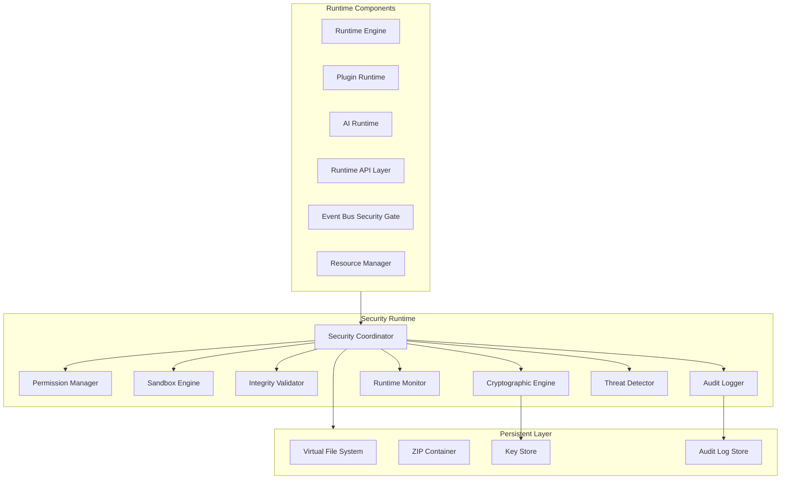

### 2.3 Security Runtime Initialization Order

The Security Runtime initializes before any other runtime component. No component may emit events, load resources, or execute code until the Security Runtime signals `SecurityStarted`.

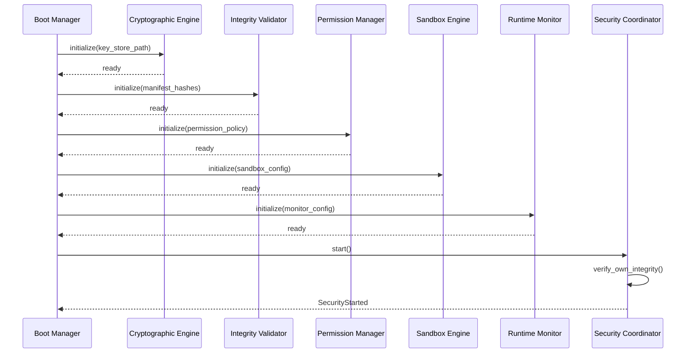

---

## 3. Trust Model

### 3.1 Trust Level Definitions

Every document, plugin, and external resource is assigned a trust level at load time. The trust level determines which capabilities may be granted and which security checks are applied.

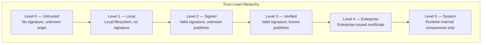

| Trust Level | Description | Allowed Capabilities | Sandbox Level |
|---|---|---|---|
| 0 — Untrusted | No signature, downloaded from unknown source | Read-only, no plugins, no AI | Maximum isolation |
| 1 — Local | Opened from local filesystem, no signature | Read-only, no network, no plugins | High isolation |
| 2 — Signed | Valid cryptographic signature, publisher not in trust store | Standard capabilities, no enterprise features | Standard isolation |
| 3 — Verified | Valid signature, publisher in user trust store | Full standard capabilities | Standard isolation |
| 4 — Enterprise | Enterprise CA-issued certificate | Full capabilities including enterprise features | Relaxed isolation |
| 5 — System | Runtime-internal (never assigned to documents) | Unrestricted | None |

### 3.2 Trust Assignment Flow

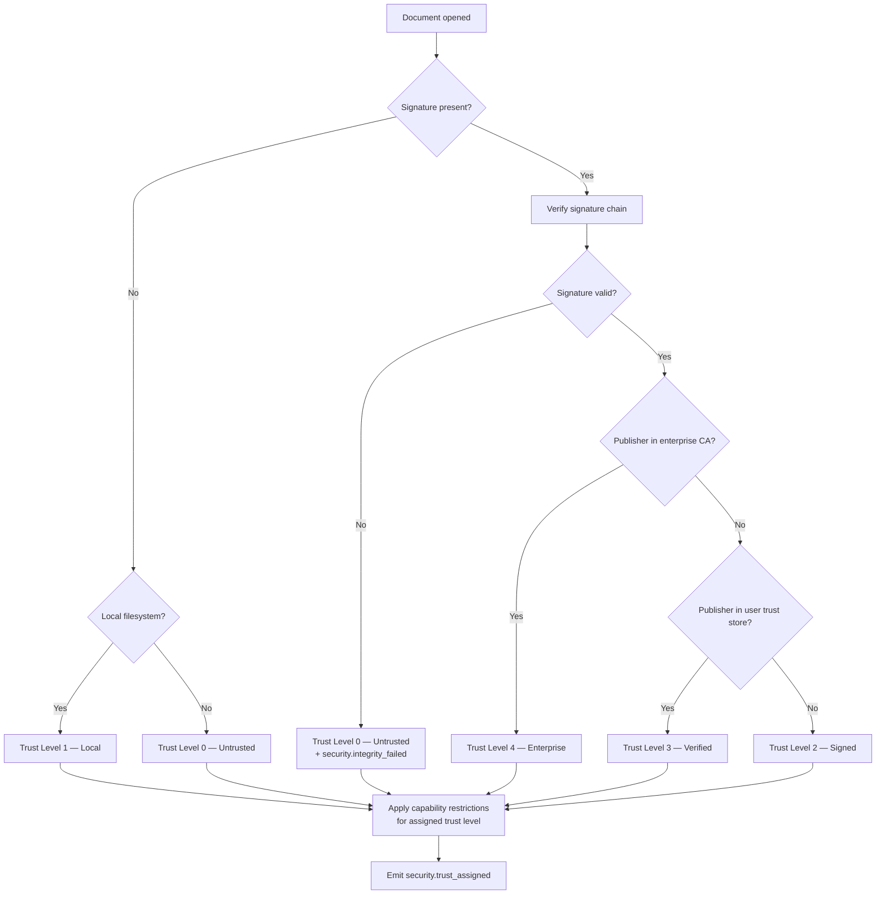

### 3.3 Plugin Trust

Plugins are evaluated independently from the document that contains them. A document at Trust Level 3 does not automatically grant Trust Level 3 to its plugins.

| Plugin State | Trust Assignment |
|---|---|
| Plugin has valid signature from same publisher as document | Trust Level 3 |
| Plugin has valid signature from different known publisher | Trust Level 2 |
| Plugin has valid signature from unknown publisher | Trust Level 2 |
| Plugin has no signature | Trust Level 0 — plugin blocked unless document policy allows unsigned plugins |
| Plugin signature is invalid | Trust Level 0 — plugin blocked unconditionally |

**Plugin trust policy in document manifest:**
```json
{
  "security": {
    "plugin_policy": {
      "allow_unsigned": false,
      "require_same_publisher": false,
      "trusted_plugin_publishers": ["publisher-cert-fingerprint-1"]
    }
  }
}
```

### 3.4 AI Module Trust

AI modules are treated as untrusted code regardless of their signature status. The AI Isolation Layer enforces strict capability restrictions on all AI modules:

- AI modules cannot access the filesystem, storage, or database
- AI modules cannot emit events or subscribe to internal events
- AI modules cannot call plugin APIs
- AI inference inputs and outputs are sanitized before crossing the trust boundary
- AI modules run in a dedicated memory-isolated execution context

### 3.5 External Resource Trust

External resources (referenced via `network.read` capability) are always treated as untrusted data:

- External content is never executed — it is treated as data only
- External images are decoded and re-encoded before rendering to strip metadata
- External fonts are subset and sanitized before use
- External JSON data is schema-validated before use
- External resources are never cached to the document's VFS namespace

### 3.6 Trust Transitions

Trust levels are immutable after assignment. A document cannot gain trust during a session. Trust can only be downgraded in response to a security violation:

| Trigger | Trust Transition |
|---|---|
| Integrity hash mismatch detected | Current level → Level 0 |
| Signature verification failure | Current level → Level 0 |
| Sandbox escape attempt | Plugin terminated, document trust unchanged |
| Replay attack detected | Session terminated |
| Tamper detection in event payload | Current level → Level 0 |

Trust downgrade always emits `security.trust_revoked` and triggers the appropriate response protocol.

### 3.7 Trust State Diagram

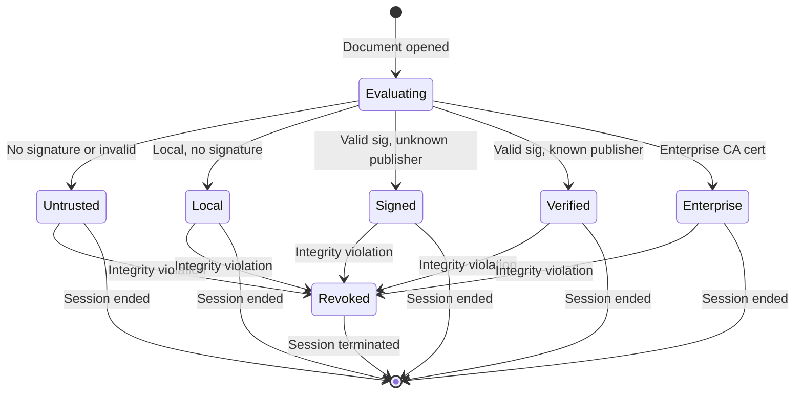

---

## 4. Permission System

### 4.1 Permission Architecture

The Permission Manager is the central authority for all capability-based access control in the LDFX Runtime. Every API call, resource access, event subscription, and cross-component message passes through the Permission Manager before execution.

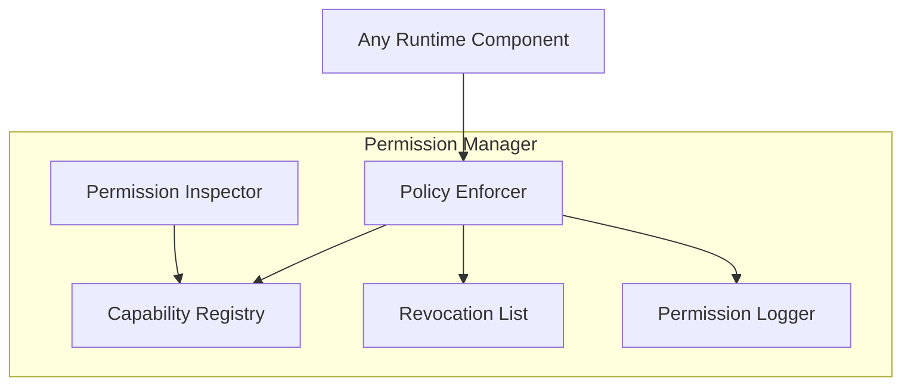

### 4.2 Permission Catalog

| Permission | Scope | Description |
|---|---|---|
| `filesystem.read` | Document VFS only | Read files from the document container |
| `filesystem.write` | Plugin-owned namespace only | Write to plugin's own VFS namespace |
| `database.read` | Document databases | Execute SELECT queries |
| `database.write` | Plugin-owned databases only | Execute INSERT/UPDATE/DELETE |
| `clipboard.read` | Host clipboard | Read clipboard contents |
| `clipboard.write` | Host clipboard | Write to clipboard |
| `notifications.show` | Host notification system | Display system notifications |
| `device.camera` | Host camera | Access camera feed |
| `device.microphone` | Host microphone | Access microphone input |
| `network.read` | External URLs declared in manifest | Fetch external resources |
| `network.write` | External endpoints declared in manifest | Send data to external endpoints |
| `plugins.call` | Other plugins' public APIs | Call declared plugin methods |
| `ai.inference` | AI models in document | Run inference against packed models |
| `storage.read` | Caller's own namespace | Read session storage |
| `storage.write` | Caller's own namespace | Write session storage |
| `background.execute` | Scheduler | Run tasks when document is not focused |
| `events.publish` | Caller's own namespace | Emit custom events |
| `events.system` | System event subscriptions | Subscribe to system-level events |
| `analytics.write` | Local analytics store | Record analytics events |
| `analytics.read` | Local analytics store | Read analytics reports |
| `theme.write` | Active theme | Switch the active theme |
| `language.write` | Active locale | Switch the active locale |
| `navigation.control` | Document navigation | Programmatic page navigation |
| `viewer.control` | Document viewer | Zoom, scroll, print, export |
| `window.ui` | Host window | Show dialogs and notifications |
| `configuration.read` | Document configuration | Read configuration values |

### 4.3 Permission Levels

Permissions are organized into three levels that determine how they are granted:

| Level | Name | Grant Mechanism | Revocable |
|---|---|---|---|
| 0 | Automatic | Granted to all callers without declaration | No |
| 1 | Declared | Declared in manifest; granted at boot | Yes — by Security Runtime |
| 2 | Sensitive | Declared in manifest; may require user confirmation at first use | Yes — by user or Security Runtime |

**Level 0 permissions** (no declaration required): `runtime.*` read methods, `document.*` read methods, `events.subscribe` for public events, `logger.*`, `performance.*`, `permissions.*`.

**Level 1 permissions** (manifest declaration required): All storage, resource, database read operations, navigation read, viewer read, theme read, language read.

**Level 2 permissions** (manifest declaration + possible user prompt): `clipboard.*`, `device.camera`, `device.microphone`, `notifications.show`, `network.*`, `background.execute`.

### 4.4 Permission Inheritance

Permissions do not inherit. A document at Trust Level 3 with `storage.write` declared does not grant `storage.write` to its plugins. Each component's permission set is derived exclusively from its own manifest declaration, filtered by its trust level.

**Inheritance rules:**
- Document scripts inherit no permissions from the document manifest — they declare their own
- Plugins inherit no permissions from the document — they declare their own in the plugin manifest
- AI modules have a fixed, hardcoded permission set — they cannot declare additional permissions
- Child execution contexts inherit a strict subset of the parent's permissions, never a superset

### 4.5 Permission Flow

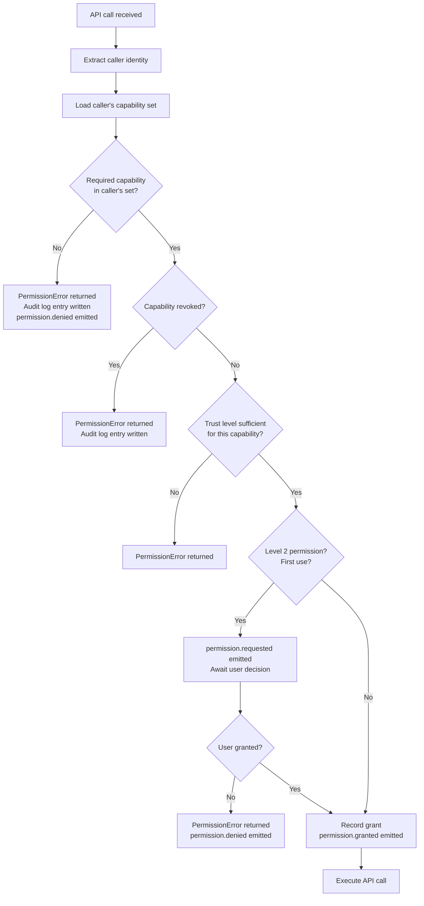

### 4.6 Permission Revocation

The Security Runtime may revoke a previously granted permission in response to a detected violation or policy change:

| Trigger | Revocation Scope |
|---|---|
| Sandbox escape attempt | All permissions for the offending plugin |
| Rate limit exceeded 3x in 10s | `events.publish` for the offending caller |
| Integrity violation detected | All Level 2 permissions for the document |
| AI prompt injection detected | `ai.inference` for the current session |
| Anomalous behavior detected | Specific permission flagged by the monitor |

Revocation is immediate and permanent for the session. Revoked permissions cannot be re-granted within the same session. `permission.revoked` is emitted for every revocation.

### 4.7 Policy Enforcement

The Permission Manager enforces the document's security policy as declared in the manifest:

```json
{
  "security": {
    "policy": {
      "sandbox_level": "standard",
      "allow_unsigned_plugins": false,
      "network_allowlist": ["https://cdn.example.com"],
      "max_storage_bytes": 10485760,
      "max_ai_requests_per_minute": 60,
      "require_user_confirmation": ["clipboard.read", "device.camera"]
    }
  }
}
```

The Security Runtime validates the policy at boot and rejects documents whose policy exceeds what their trust level permits.

---

## 5. Sandbox Architecture

### 5.1 Sandbox Design

The LDFX Sandbox Engine provides execution isolation for all untrusted code — plugins, AI modules, and document scripts. The sandbox is capability-based: code running inside the sandbox can only perform operations explicitly permitted through the sandbox's capability interface.

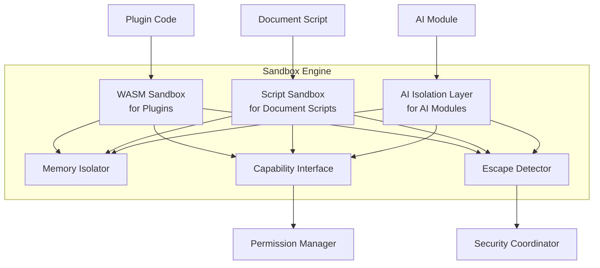

### 5.2 Plugin Sandbox (WASM)

Plugins compile to WebAssembly and execute inside the WASM sandbox. The sandbox enforces:

**Memory isolation:**
- Each plugin has its own linear memory space, separate from the runtime heap
- The plugin cannot read or write outside its allocated linear memory
- The runtime heap is never mapped into the plugin's address space
- Memory allocation for plugins is bounded by the `max_memory_bytes` policy

**Capability interface:**
- The plugin communicates with the runtime exclusively through a set of host function imports
- Host functions are the only way for the plugin to call runtime APIs
- Each host function import is permission-checked before execution
- The plugin cannot call arbitrary runtime functions — only the declared WASM API subset

**Execution isolation:**
- Each plugin runs on a dedicated WASM executor thread
- Plugin execution time is bounded by a configurable timeout
- A plugin that exceeds its CPU budget is suspended and `plugin.sandbox_violation` is emitted
- Infinite loops are detected by the execution time monitor

**Escape prevention:**
- The WASM sandbox prevents all direct memory access outside the plugin's linear memory
- The plugin cannot access host process memory, other plugins' memory, or the runtime heap
- System calls are intercepted and blocked — the plugin has no direct OS access
- File I/O, network I/O, and thread creation are all blocked at the WASM level

### 5.3 Script Sandbox

Document scripts execute in an isolated JavaScript/TypeScript context. The sandbox enforces:

- No access to browser globals (`window`, `document`, `navigator`, `fetch`, `XMLHttpRequest`)
- No access to Node.js globals (`process`, `require`, `__dirname`, `fs`, `net`)
- No access to other scripts' execution contexts or variables
- No direct DOM manipulation — all rendering goes through the Content Model Manager API
- The only global object available is `LDF` — the Runtime API
- `eval()` and `Function()` constructor are blocked
- Dynamic `import()` is blocked — all script dependencies are declared in the manifest

### 5.4 AI Isolation Layer

AI modules execute in the most restricted sandbox:

- Dedicated memory region, isolated from all other components
- No access to the Runtime API except `LDF.ai` (inference only)
- Input sanitization: all inference inputs are validated against a schema before reaching the model
- Output sanitization: all inference outputs are validated and content-filtered before delivery
- Execution time limit: inference requests that exceed the timeout are cancelled
- No persistent state between inference calls (stateless by default; stateful sessions are explicitly managed)

### 5.5 Resource Isolation

Each sandbox has its own resource quota:

| Resource | Plugin Limit | Script Limit | AI Limit |
|---|---|---|---|
| Memory | 64 MB (configurable) | 32 MB | 512 MB (model + inference) |
| CPU time per operation | 5 seconds | 2 seconds | 60 seconds |
| Storage quota | 10 MB | 5 MB | 0 (no storage access) |
| Event subscriptions | 64 | 32 | 0 |
| Concurrent async operations | 8 | 16 | 4 |
| API calls per second | 500 | 1000 | 100 |

### 5.6 Sandbox State Machine

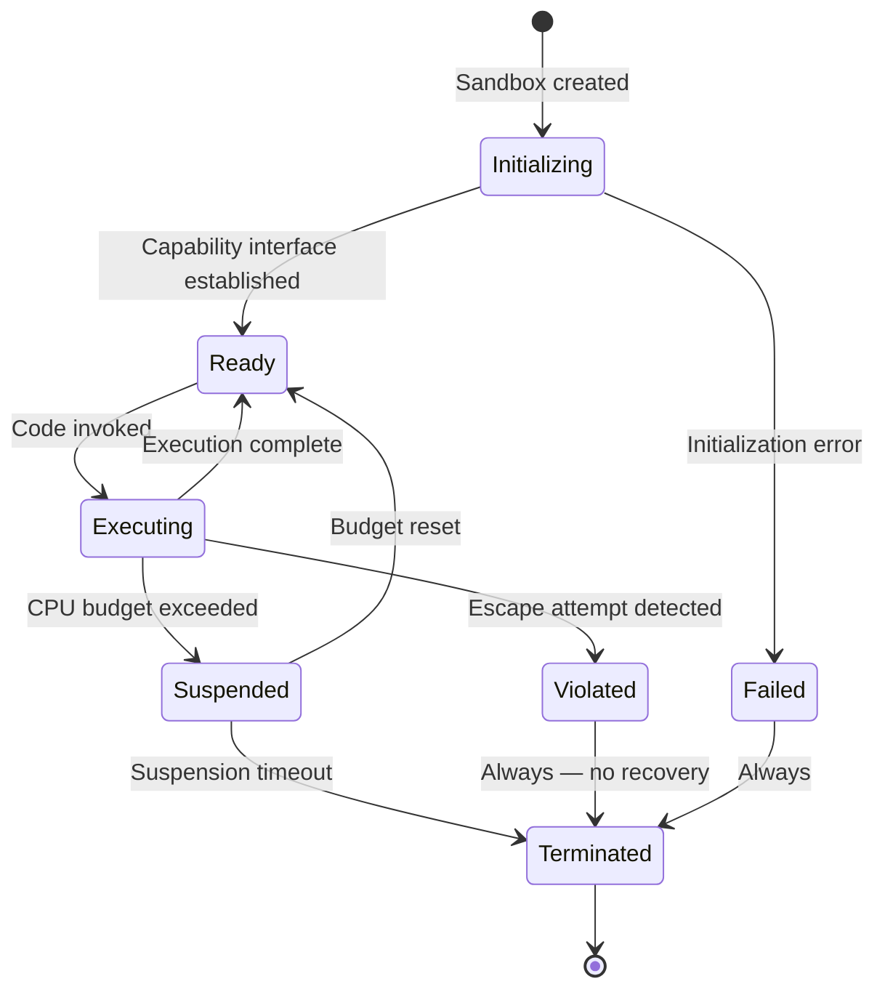

### 5.7 Escape Detection

The Escape Detector monitors all sandbox boundaries for violation attempts:

| Escape Vector | Detection Method | Response |
|---|---|---|
| Out-of-bounds memory access | WASM linear memory bounds check | WASM trap — plugin terminated |
| Unauthorized host function call | Host function import whitelist | Call blocked + `sandbox_violation` emitted |
| Reserved namespace event emission | Event Bus Security Gate | Event rejected + plugin terminated |
| Attempt to access other plugin's memory | Memory Isolator | Access blocked + `sandbox_violation` emitted |
| CPU exhaustion (infinite loop) | Execution time monitor | Plugin suspended then terminated |
| Stack overflow | WASM stack depth limit | WASM trap — plugin terminated |

---

## 6. Cryptographic Security

### 6.1 Cryptographic Architecture

The Cryptographic Engine is the lowest-level security component. It provides all cryptographic primitives used by the Security Runtime and is the only component that directly accesses cryptographic keys.

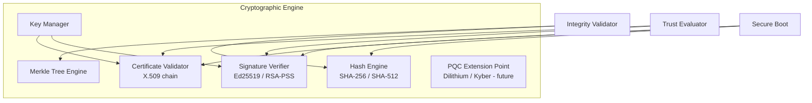

### 6.2 Hash Verification

Every asset in the LDFX container has a SHA-256 hash recorded in the cryptographic manifest (Phase 1). The Integrity Validator verifies each asset's hash at load time.

**Verification algorithm:**
```
function verify_asset(asset_bytes, expected_hash):
    computed = SHA-256(asset_bytes)
    if not constant_time_eq(computed, expected_hash):
        emit security.integrity_failed(asset_path, computed, expected_hash)
        return Err(IntegrityViolation)
    return Ok
```

Constant-time comparison is mandatory — timing side-channels on hash comparison are a known attack vector. The `subtle` crate (present in `Cargo.lock`) provides constant-time equality.

**Hash verification timing:**
- Manifest hash: verified at boot, before any other component initializes
- Entry page assets: verified during Secure Boot sequence
- All other assets: verified at first load, before delivery to the Resource Manager cache
- Re-verification: assets are re-verified on every cache miss — the cache is trusted after first verification

### 6.3 SHA-512 Support

SHA-512 is supported as a high-security alternative. Documents declare their hash algorithm in the manifest:

```json
{
  "crypto": {
    "hash_algorithm": "sha256",
    "signature_algorithm": "ed25519"
  }
}
```

SHA-512 verification uses the same algorithm as SHA-256 but with the SHA-512 digest function. The Cryptographic Engine selects the correct implementation based on the manifest declaration.

### 6.4 Digital Signatures

Document signatures are verified using Ed25519 (primary) or RSA-PSS-SHA256 (legacy compatibility). The signature covers the cryptographic manifest, which in turn covers all asset hashes — creating a chain of trust from the signature to every byte in the document.

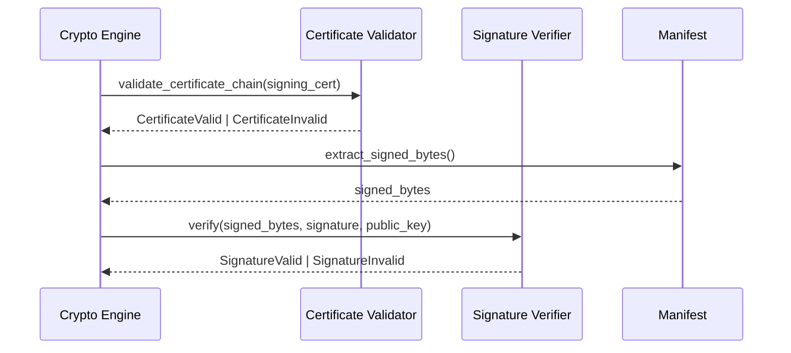

### 6.5 Certificate Validation

Certificate validation is performed entirely offline using the embedded certificate chain in the document manifest. The validation checks:

1. Certificate is not expired (wall clock check)
2. Certificate chain leads to a trusted root CA
3. Certificate key usage includes document signing
4. Certificate is not in the embedded revocation list
5. Certificate subject matches the declared publisher identity

Trusted root CAs are embedded in the runtime binary at build time. They cannot be modified at runtime. Enterprise deployments may add enterprise root CAs through the host application's configuration.

### 6.6 Merkle Tree Integrity

The LDFX cryptographic manifest uses a Merkle tree to enable efficient partial verification. The tree structure allows verifying a single asset's integrity without re-hashing the entire document.

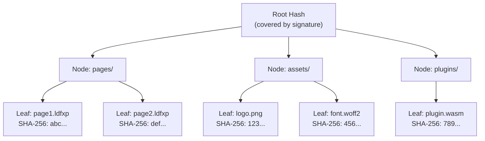

Merkle proof verification: to verify a single asset, only the sibling hashes along the path from the leaf to the root are needed — O(log n) hashes instead of O(n). This is used for incremental verification during lazy resource loading.

### 6.7 Key Rotation

The Security Runtime supports key rotation for long-lived documents. A document may include multiple signature blocks — one for the current key and one or more for rotated keys. The Cryptographic Engine verifies that at least one valid signature exists.

```json
{
  "signatures": [
    {
      "key_id": "key-2024-01",
      "algorithm": "ed25519",
      "signature": "<base64-encoded-signature>",
      "valid_from": "2024-01-01",
      "valid_until": "2025-01-01"
    },
    {
      "key_id": "key-2025-01",
      "algorithm": "ed25519",
      "signature": "<base64-encoded-signature>",
      "valid_from": "2025-01-01",
      "valid_until": "2026-01-01"
    }
  ]
}
```

### 6.8 Post-Quantum Cryptography Readiness

The Cryptographic Engine is designed for algorithm agility. PQC extension points are defined but not yet activated:

| PQC Algorithm | Role | Status |
|---|---|---|
| CRYSTALS-Dilithium3 | Digital signatures | Extension point defined — not active |
| CRYSTALS-Kyber768 | Key encapsulation | Extension point defined — not active |
| SPHINCS+-SHA256 | Hash-based signatures (fallback) | Extension point defined — not active |

When PQC algorithms are activated, the manifest `crypto.signature_algorithm` field will accept `dilithium3`, `kyber768`, and `sphincs-sha256` as values. No changes to the document format or trust model are required.

---

## 7. Secure Boot

### 7.1 Secure Boot Sequence

The Secure Boot sequence ensures the LDFX Runtime starts in a known-good state before any document content is executed. Every stage is verified before the next proceeds. A failure at any stage halts the boot and emits `boot.failed`.

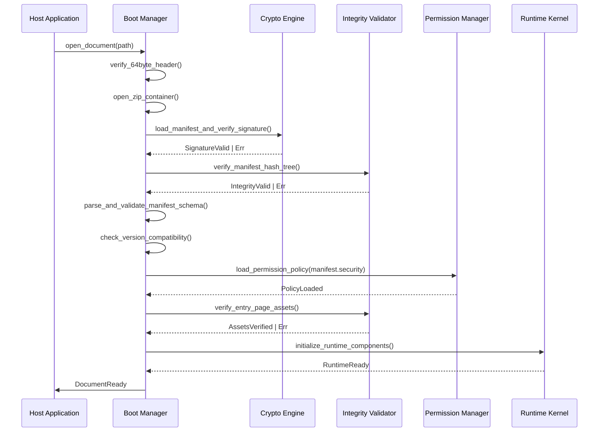

### 7.2 Boot Stage Definitions

| Stage | Action | Failure Response |
|---|---|---|
| 1 — Header | Verify 64-byte binary header magic, version, and checksum | Abort — `boot.failed` |
| 2 — Container | Open ZIP container at offset 64; verify ZIP structure | Abort — `boot.failed` |
| 3 — Manifest | Load and parse `manifest.json`; validate against schema | Abort — `boot.failed` |
| 4 — Signature | Verify document signature using Cryptographic Engine | Abort if signed; warn if unsigned |
| 5 — Integrity | Verify Merkle tree root hash against manifest | Abort — `security.integrity_failed` |
| 6 — Version | Check runtime version compatibility | Abort if incompatible |
| 7 — Policy | Load security policy; validate against trust level | Abort if policy exceeds trust level |
| 8 — Entry Assets | Verify hashes of entry page and hot assets | Abort — `security.integrity_failed` |
| 9 — Components | Initialize all runtime components in dependency order | Abort — `boot.failed` |
| 10 — Ready | Emit `SecurityStarted` then `runtime.ready` | N/A |

### 7.3 Rollback Protection

The Security Runtime prevents rollback attacks — attempts to open an older, potentially vulnerable version of a document in place of the current version.

**Rollback protection mechanism:**
- The manifest includes a monotonically increasing `sequence_number`
- The runtime stores the highest seen `sequence_number` for each `document_id` in a local tamper-resistant store
- If the opened document's `sequence_number` is lower than the stored value, the boot is aborted with `security.rollback_detected`
- The sequence number store is protected by a HMAC keyed to the host application's identity

### 7.4 Safe Mode

If the boot sequence fails at Stage 6 or later (after integrity is verified), the runtime may enter Safe Mode instead of aborting completely. Safe Mode:

- Disables all plugins, AI modules, and scripts
- Loads the document in read-only, static rendering mode
- Emits `boot.safe_mode_entered` with the failure reason
- Displays a security warning to the user

Safe Mode is only available for documents at Trust Level 2 or higher. Untrusted documents that fail boot are always aborted.

### 7.5 Recovery Mode

Recovery Mode is available for enterprise documents when the boot fails due to a recoverable error (e.g., a non-critical plugin fails to load). Recovery Mode:

- Skips the failed component and logs the failure to the Security Audit Log
- Continues boot with the remaining components
- Emits `boot.recovery_mode_entered` with the list of skipped components
- Restricts the document to capabilities that do not depend on the skipped components

Recovery Mode requires `enterprise_recovery: true` in the document's security policy and Trust Level 4.
