# Phase 2 — Part 2.8: Plugin Runtime & Extension Framework Specification
# LDFX (Living Document Format eXtended)

**Specification Version:** 2.8.0
**Status:** Canonical — Approved
**Classification:** Internal Engineering Specification
**Audience:** Plugin Systems Engineers, Runtime Engineers, SDK Authors, Security Engineers, Extension Developers
**Stability:** Stable — No breaking changes without MAJOR version bump
**Phase:** 2 — Runtime
**Part:** 2.8 of 10
**Depends On:** Part 2.1 (Runtime Foundation), Part 2.2 (VFS), Part 2.3 (Resource Manager), Part 2.4 (Runtime Engine), Part 2.5 (Runtime APIs), Part 2.6 (Event System), Part 2.7 (Security Runtime), Phase 1 (File Format)
**Consumed By:** Part 2.9 (Developer Runtime), Part 2.10 (Final Integration)

---

## Table of Contents

1. [Plugin Philosophy](#1-plugin-philosophy)
2. [Plugin Runtime Architecture](#2-plugin-runtime-architecture)
3. [Plugin Types](#3-plugin-types)
4. [Plugin Manifest](#4-plugin-manifest)
5. [Plugin Lifecycle](#5-plugin-lifecycle)
6. [Plugin Loading System](#6-plugin-loading-system)
7. [Plugin APIs](#7-plugin-apis)
8. [Plugin Communication](#8-plugin-communication)
9. [Permissions & Security](#9-permissions--security)
10. [Dependency Management](#10-dependency-management)
11. [Plugin Marketplace Readiness](#11-plugin-marketplace-readiness)
12. [Runtime Integration](#12-runtime-integration)
13. [Diagnostics & Monitoring](#13-diagnostics--monitoring)
14. [Testing Strategy](#14-testing-strategy)
15. [Rust Module Layout](#15-rust-module-layout)
16. [Acceptance Criteria](#16-acceptance-criteria)

---

## 1. Plugin Philosophy

### 1.1 Why LDFX Uses Plugins

The LDFX Runtime is a document execution platform. Its core responsibility is to faithfully render, execute, and manage living documents. But documents are not static — they embed interactive components, AI-generated content, custom visualizations, enterprise integrations, and domain-specific behaviors that no single runtime team can anticipate or implement.

The Plugin Runtime solves this by defining a stable, secure, and versioned extension boundary. The runtime team owns the core execution model. Plugin authors own the extensions. Neither side needs to know the internal implementation details of the other — only the contract between them.

This mirrors the architecture of the most successful extensible platforms in software history:
- **VS Code**: A minimal editor core with a rich extension API — the extensions make it powerful
- **Chrome**: A secure browser engine with a sandboxed extension model — the extensions make it useful
- **Linux**: A kernel with a stable ABI — the modules make it universal

LDFX adopts the same principle: the runtime is the kernel; plugins are the modules.

### 1.2 Design Goals

| Goal | Description |
|---|---|
| Secure by default | Every plugin runs in a WASM sandbox with capability-based access control |
| Offline-first | Plugins are packed inside the `.ldfx` container — no network required at runtime |
| Versioned contracts | Plugin APIs are versioned; breaking changes require a major version bump |
| Hot-loadable | Plugins can be loaded, reloaded, and unloaded without restarting the runtime |
| Dependency-aware | The Plugin Runtime resolves and validates dependency graphs before loading |
| Failure-isolated | A crashing plugin never crashes the runtime or other plugins |
| Observable | Every plugin action is traceable through the Security Audit Log and diagnostics |
| Marketplace-ready | The plugin model is designed for future signed distribution and enterprise repositories |
| Enterprise-ready | Enterprise policy can restrict, mandate, or configure plugins at deployment time |
| Developer-friendly | The Plugin SDK provides a clean, typed API surface with full IntelliSense support |

### 1.3 Extensibility Principles

**Principle 1 — Extension points, not hooks.**
The Plugin Runtime exposes defined extension points in the Runtime Engine's pipeline. Plugins register handlers at these points. They do not monkey-patch, override, or replace runtime internals. The runtime always controls execution; plugins participate at invitation.

**Principle 2 — Data in, data out.**
Plugins receive data through their API surface and return data through their API surface. They do not hold references to runtime-internal objects. All data crossing the plugin boundary is serialized, validated, and deserialized. This enforces the trust boundary and enables future cross-process plugin execution.

**Principle 3 — Declare everything upfront.**
A plugin's capabilities, permissions, dependencies, and extension points are all declared in its manifest before the plugin is loaded. The runtime never grants a capability that was not declared. There are no runtime permission escalations.

**Principle 4 — Fail gracefully.**
A plugin that fails to load, crashes during execution, or exceeds its resource budget is terminated and replaced with fallback content. The document continues to function. The user is informed. The failure is logged. Recovery is automatic where possible.

**Principle 5 — The plugin cannot see the runtime.**
A plugin running in its WASM sandbox has no visibility into the runtime's internal state, other plugins' state, or the host process's memory. It sees only what the Plugin Runtime explicitly exposes through the capability interface.

### 1.4 Security-First Design

Plugin security is not a feature — it is a structural property of the Plugin Runtime. Security is enforced at every layer:

- **At load time**: Signature verification, integrity checking, manifest validation
- **At initialization**: Capability set is fixed and immutable
- **At execution**: WASM sandbox enforces memory isolation and API restrictions
- **At communication**: All cross-boundary messages are validated and sanitized
- **At termination**: All resources are released, all subscriptions are removed

A plugin that attempts to exceed its declared capabilities is terminated immediately. There is no warning, no retry, and no recovery for security violations.

### 1.5 Offline-First Plugins

All plugins are packed inside the `.ldfx` container at document creation time. The Plugin Runtime never fetches plugins from the network at runtime. This ensures:

- Documents work identically in air-gapped environments
- Plugin behavior is deterministic — the same plugin version is always used
- No supply chain attack can inject a different plugin version at runtime
- Plugin loading latency is bounded by local I/O, not network conditions

Plugin updates are delivered by publishing a new version of the document with updated plugin bundles.

### 1.6 Backward and Forward Compatibility

**Backward compatibility**: A plugin compiled against Plugin API version 1.0 will continue to work on a runtime that implements Plugin API version 1.x. The runtime provides a compatibility shim for deprecated API methods.

**Forward compatibility**: A plugin compiled against Plugin API version 1.0 will not crash when run on a runtime that implements Plugin API version 1.1. Unknown API methods return `ApiVersionError`. Unknown event types are silently ignored.

**Plugin API versioning** follows the same semantic versioning rules as the Runtime API (Part 2.5):
- Patch: bug fixes only
- Minor: new methods and events added; existing behavior unchanged
- Major: breaking changes; migration guide published; old major supported for 24 months

### 1.7 Enterprise Readiness

Enterprise deployments require additional control over the plugin ecosystem:

- **Mandatory plugins**: Enterprise policy can require specific plugins to be present and running
- **Blocked plugins**: Enterprise policy can prevent specific plugins from loading
- **Plugin configuration**: Enterprise policy can inject configuration into plugins at load time
- **Audit requirements**: All plugin actions are logged to the Security Audit Log
- **Offline repositories**: Enterprise can host a private plugin repository for air-gapped deployments
- **Certificate pinning**: Enterprise can require plugins to be signed by a specific enterprise CA

### 1.8 Marketplace Readiness

The Plugin Runtime is designed for a future LDFX plugin marketplace:

- Every plugin has a globally unique ID in reverse-domain notation (`com.example.myplugin`)
- Every plugin is cryptographically signed by its publisher
- Plugin manifests include metadata for marketplace display (name, description, screenshots, ratings)
- The Plugin Runtime supports signed update packages
- Trust levels map directly to marketplace verification tiers

---

## 2. Plugin Runtime Architecture

### 2.1 Architectural Position

The Plugin Runtime sits between the Runtime Engine and individual plugin instances. It is the sole intermediary — no runtime component communicates with a plugin directly, and no plugin communicates with the runtime directly.

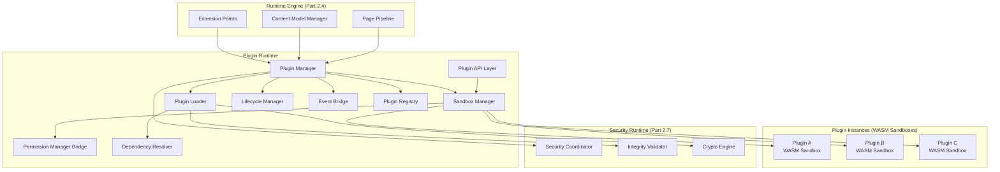

### 2.2 Component Responsibilities

| Component | Responsibility |
|---|---|
| Plugin Manager | Central coordinator; owns the plugin registry; orchestrates all other components |
| Plugin Loader | Discovers, validates, and loads plugin WASM bundles from the VFS |
| Sandbox Manager | Creates and manages WASM execution sandboxes; enforces memory and CPU limits |
| Permission Manager Bridge | Delegates permission checks to the Security Runtime's Permission Manager |
| Lifecycle Manager | Manages plugin state transitions; handles crashes and recovery |
| Event Bridge | Routes events between the Event Bus and plugin sandboxes; enforces isolation |
| Plugin API Layer | Exposes the Plugin SDK API surface to plugins via WASM host function imports |
| Dependency Resolver | Resolves and validates the plugin dependency graph before loading |
| Plugin Registry | Maintains the authoritative list of all known plugins and their current state |

### 2.3 Full Architecture Diagram

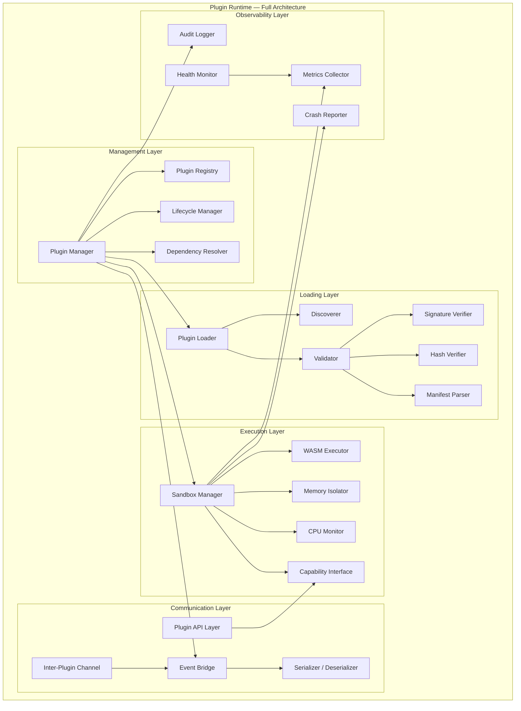

### 2.4 Plugin Runtime Initialization

The Plugin Runtime initializes during Boot Manager Phase 14, after the Security Runtime (Phase 12) and Runtime Engine (Phase 13) are ready.

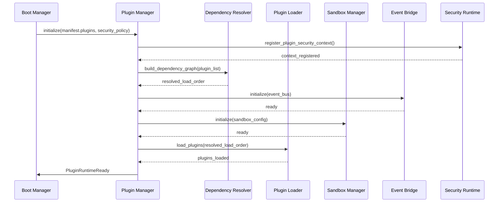

### 2.5 Communication Flow

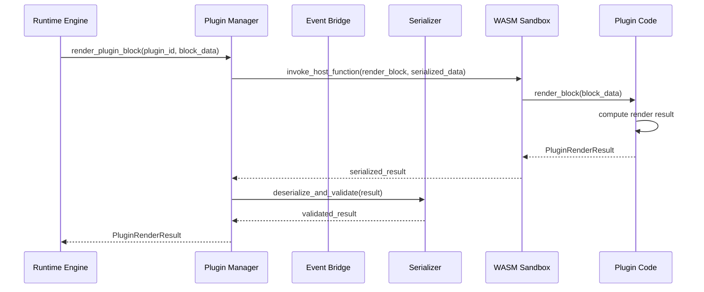

---

## 3. Plugin Types

### 3.1 Plugin Type Overview

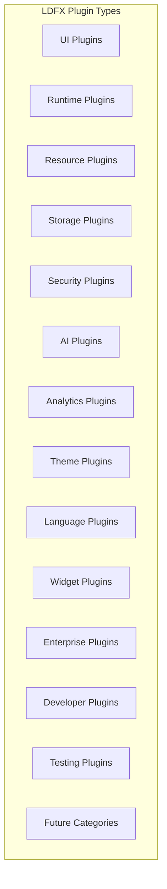

### 3.2 UI Plugins

**Purpose:** Render custom visual components inside document pages. UI plugins provide `PluginBlock` and `InteractiveLeaf` rendering.

**Capabilities:**
- Implement `render_block(block_type, data)` → draw commands
- Implement `render_interactive(component_id, props)` → draw commands
- Receive user interaction events (click, hover, keyboard) for interactive components
- Request content model mutations through the mutation API

**Restrictions:**
- Cannot access the DOM or host window directly
- Cannot render outside their allocated bounding box
- Cannot reference assets outside their declared namespace
- Draw commands are validated before insertion into the render pipeline

**Lifecycle:** Loaded at document boot; active for the full session; unloaded at session end.

**Permissions:** `resource.read` (own namespace), `events.publish` (own namespace), `storage.read/write` (own namespace).

**Example use cases:** Custom chart renderers, interactive diagrams, rich media players, form components, data tables with sorting and filtering.

### 3.3 Runtime Plugins

**Purpose:** Extend the Runtime Engine's pipeline with custom processing stages. Runtime plugins register handlers at the Page Pipeline extension points defined in Part 2.4.

**Capabilities:**
- Register handlers at `AfterParse`, `AfterValidate`, `AfterBuild`, `AfterResolve`, `BeforeLayout` extension points
- Read the content tree at their extension point
- Add synthetic nodes to the content tree (at `AfterBuild` only)
- Modify resolved references (at `AfterResolve` only)

**Restrictions:**
- Cannot modify the content tree outside their registered extension point
- Extension point handlers must complete within 10ms
- Cannot block the pipeline — handlers that exceed their time budget are skipped

**Lifecycle:** Loaded at document boot; handlers registered immediately; active for the full session.

**Permissions:** `resource.read` (own namespace), `events.publish` (own namespace).

**Example use cases:** Custom content validators, syntax highlighters for custom languages, content transformation pipelines, accessibility enhancers.

### 3.4 Resource Plugins

**Purpose:** Provide custom resource loading and decoding for file types not natively supported by the Resource Manager.

**Capabilities:**
- Register custom MIME type handlers
- Implement `decode(raw_bytes, mime_type)` → typed resource data
- Implement `encode(resource_data)` → raw bytes (for export)
- Provide resource metadata (dimensions, duration, etc.)

**Restrictions:**
- Cannot access the VFS directly — raw bytes are provided by the Resource Manager
- Decoded resources must conform to the Resource Manager's typed resource schema
- Cannot cache resources outside the Resource Manager's cache

**Lifecycle:** Loaded at document boot; MIME type handlers registered immediately.

**Permissions:** `resource.read` (own namespace).

**Example use cases:** Custom 3D model decoders, proprietary data format parsers, custom image format decoders, specialized font loaders.

### 3.5 Storage Plugins

**Purpose:** Provide custom storage backends for document data that requires specialized persistence (e.g., encrypted storage, cloud sync, custom databases).

**Capabilities:**
- Implement the `StorageBackend` interface: `get`, `set`, `delete`, `keys`, `clear`, `quota`
- Register as a named storage backend
- Provide storage quota reporting

**Restrictions:**
- Cannot access the host filesystem directly
- Storage data must be serializable to JSON
- Cannot exceed the storage quota declared in the plugin manifest
- Cannot access other plugins' storage namespaces

**Lifecycle:** Loaded at document boot; backend registered before any storage operations.

**Permissions:** `storage.read/write` (own namespace), `filesystem.write` (own namespace, if declared).

**Example use cases:** Encrypted local storage, custom serialization formats, storage backends for enterprise data systems.

### 3.6 Security Plugins

**Purpose:** Extend the Security Runtime with custom security policies, content filters, or audit integrations.

**Capabilities:**
- Register custom content security rules for the Page Pipeline
- Implement `inspect_content(node)` → `SecurityDecision`
- Implement `inspect_event(event)` → `SecurityDecision`
- Write to the Security Audit Log (append-only)

**Restrictions:**
- Cannot override or disable existing Security Runtime rules
- Cannot access cryptographic keys
- Cannot modify the trust level of any component
- Security decisions are advisory — the Security Runtime makes the final decision

**Lifecycle:** Loaded before any other plugin type; active for the full session.

**Permissions:** `events.system` (read-only), `analytics.write`.

**Example use cases:** Enterprise DLP (Data Loss Prevention) integrations, custom content filtering policies, compliance audit exporters.

### 3.7 AI Plugins

**Purpose:** Provide custom AI model integrations, inference pipelines, or AI-powered content transformations.

**Capabilities:**
- Register custom AI model handlers
- Implement `infer(model_id, input)` → `AiOutput`
- Implement `stream_infer(model_id, input)` → `AiOutputStream`
- Provide model metadata (architecture, parameter count, capabilities)

**Restrictions:**
- AI inference inputs and outputs are sanitized by the AI Isolation Layer
- Cannot access the filesystem, storage, or database
- Cannot emit events or subscribe to internal events
- Inference results must conform to the `AiOutput` schema

**Lifecycle:** Loaded at document boot; model handlers registered before any AI block processing.

**Permissions:** `ai.inference` (own models only), `resource.read` (model weights namespace).

**Example use cases:** Custom LLM integrations, specialized domain models, on-device inference engines, AI content moderation.

### 3.8 Analytics Plugins

**Purpose:** Collect, aggregate, and export document usage analytics.

**Capabilities:**
- Subscribe to `analytics.*` events
- Implement custom aggregation logic
- Export analytics data in custom formats
- Provide analytics dashboards (via UI plugin capabilities)

**Restrictions:**
- Cannot access PII — all analytics data is pre-stripped by the Security Runtime
- Cannot transmit data externally without `network.write` capability
- Cannot access other plugins' analytics data
- Analytics data is local-only unless `network.write` is declared and user-consented

**Lifecycle:** Loaded at document boot; event subscriptions registered immediately.

**Permissions:** `analytics.read/write`, `events.subscribe` (analytics namespace), `network.write` (if declared).

**Example use cases:** Custom engagement metrics, reading time tracking, content effectiveness analysis, enterprise usage reporting.

### 3.9 Theme Plugins

**Purpose:** Provide custom visual themes, design tokens, and styling systems.

**Capabilities:**
- Register named themes with a complete design token set
- Implement `apply_theme(theme_id)` → `ThemeTokens`
- Provide theme variants (light, dark, high-contrast)
- Respond to system theme change events

**Restrictions:**
- Cannot modify the Layout Engine's layout rules
- Cannot inject CSS or arbitrary styling — only design tokens are accepted
- Theme tokens must conform to the LDFX design token schema
- Cannot access document content

**Lifecycle:** Loaded at document boot; themes registered before first render.

**Permissions:** `theme.write`, `resource.read` (own namespace — for theme assets like fonts and icons).

**Example use cases:** Brand themes, accessibility themes, print themes, enterprise visual identity systems.

### 3.10 Language Plugins

**Purpose:** Provide custom localization, translation, and text processing capabilities.

**Capabilities:**
- Register custom locale string bundles
- Implement `translate(key, locale, params)` → `string`
- Implement `format(value, type, locale, options)` → `string`
- Provide custom text segmentation rules for non-Latin scripts

**Restrictions:**
- Cannot modify the Layout Engine's text layout rules directly
- Translation functions must be synchronous and complete within 1ms
- Cannot access document content outside the localization API

**Lifecycle:** Loaded at document boot; locale bundles registered before first render.

**Permissions:** `language.write`, `resource.read` (own namespace — for locale files).

**Example use cases:** Custom locale bundles, machine translation integrations, domain-specific terminology systems, right-to-left language support extensions.

### 3.11 Widget Plugins

**Purpose:** Provide reusable, self-contained interactive components that can be embedded in document pages as `InteractiveLeaf` nodes.

**Capabilities:**
- Register named widget components
- Implement `render_widget(component_id, props, state)` → draw commands
- Implement `handle_interaction(component_id, event, state)` → `(draw_commands, new_state)`
- Manage widget-local state through the storage API

**Restrictions:**
- Widgets are stateless between renders — state is managed through the storage API
- Cannot access other widgets' state
- Cannot modify the content tree outside their `InteractiveLeaf` node
- Interaction handlers must complete within 16ms (one frame budget)

**Lifecycle:** Loaded at document boot; widget components registered before page pipeline runs.

**Permissions:** `storage.read/write` (own namespace), `events.publish` (own namespace), `resource.read` (own namespace).

**Example use cases:** Interactive quizzes, calculators, data entry forms, custom navigation controls, progress trackers.

### 3.12 Enterprise Plugins

**Purpose:** Provide enterprise-specific integrations, compliance features, and organizational customizations.

**Capabilities:**
- All capabilities of other plugin types, subject to enterprise policy
- Access to enterprise-specific APIs (SSO, DRM, audit systems)
- Ability to inject enterprise configuration at document load time
- Access to enterprise certificate store for additional trust validation

**Restrictions:**
- Must be signed by an enterprise CA certificate
- Must be listed in the enterprise plugin policy
- Cannot override security policies set by the Security Runtime
- Enterprise API access requires Trust Level 4

**Lifecycle:** Loaded before standard plugins; active for the full session.

**Permissions:** Declared in enterprise policy; may include capabilities not available to standard plugins.

**Example use cases:** SSO authentication integrations, DRM enforcement, enterprise audit log exporters, corporate branding systems, compliance checkers.

### 3.13 Developer Plugins

**Purpose:** Provide development tooling, debugging capabilities, and inspection interfaces for document authors and plugin developers.

**Capabilities:**
- Subscribe to all events (wildcard subscription — developer mode only)
- Inspect any execution context's state
- Trigger event replay
- Access the full Security Audit Log
- Inject test data into the content model

**Restrictions:**
- Available only in developer mode builds
- Cannot be included in production documents
- All developer plugin actions are logged
- Cannot modify security policies

**Lifecycle:** Loaded only in developer mode; active for the full session.

**Permissions:** `developer.*` (all developer capabilities).

**Example use cases:** Plugin debuggers, content model inspectors, performance profilers, event stream monitors, test harnesses.

### 3.14 Testing Plugins

**Purpose:** Provide automated testing infrastructure for document content, plugin behavior, and runtime integration.

**Capabilities:**
- Register test suites against document content
- Mock runtime services for isolated testing
- Assert on content model state, event sequences, and render output
- Generate test reports

**Restrictions:**
- Available only in test mode builds
- Cannot be included in production documents
- Test execution is isolated from the live document session

**Lifecycle:** Loaded only in test mode; active for the duration of the test run.

**Permissions:** `developer.*` (test subset).

**Example use cases:** Document content validation suites, plugin integration tests, accessibility compliance checkers, visual regression test runners.

---

## 4. Plugin Manifest

### 4.1 Manifest Overview

Every plugin must include a `plugin.manifest.json` file at the root of its WASM bundle. The manifest is the authoritative declaration of the plugin's identity, capabilities, dependencies, and entry points. The Plugin Loader reads and validates the manifest before any plugin code is executed.

The manifest is immutable after signing. Any modification to the manifest after signing invalidates the plugin's digital signature and causes the Plugin Loader to reject the plugin.

### 4.2 Manifest Schema

```
PluginManifest {
    schema_version:       string          // "2.8"
    plugin_id:            PluginId        // reverse-domain: "com.example.myplugin"
    name:                 string          // display name
    version:              SemVer          // "1.4.2"
    author:               AuthorInfo
    description:          string
    plugin_type:          PluginType[]    // one or more from Section 3
    runtime_min:          SemVer          // minimum LDFX runtime version
    runtime_max:          SemVer          // maximum LDFX runtime version (optional)
    api_version:          SemVer          // Plugin API version this plugin targets
    entry_points:         EntryPoints
    assets:               AssetManifest
    permissions:          PermissionSet
    dependencies:         Dependency[]
    optional_deps:        Dependency[]
    localization:         LocalizationManifest
    compatibility_flags:  CompatibilityFlags
    marketplace:          MarketplaceMetadata
    signature:            DigitalSignature
    integrity:            IntegrityHashes
}
```

### 4.3 Plugin Identity Fields

**plugin_id** — Globally unique identifier in reverse-domain notation. Must match the signing certificate's subject CN. Format: `[a-z0-9]+(\.[a-z0-9]+)+`. Maximum 128 characters.

**version** — Semantic version of the plugin. Must be incremented on every published update. The Plugin Runtime rejects downgrades unless the document explicitly declares a pinned version.

**plugin_type** — Array of plugin types from Section 3. A plugin may implement multiple types (e.g., a plugin that is both a UI plugin and a Storage plugin). Each declared type activates the corresponding capability set.

### 4.4 Author Information

```
AuthorInfo {
    name:         string
    email:        string          // contact address
    organization: string          // optional
    url:          string          // optional homepage
    trust_tier:   TrustTier       // Marketplace, Enterprise, Community, Unknown
}
```

### 4.5 Entry Points

Entry points declare the WASM functions the Plugin Runtime will call. All declared entry points must be exported by the WASM module. Undeclared exports are ignored.

```
EntryPoints {
    init:           string          // required — "plugin_init"
    teardown:       string          // required — "plugin_teardown"
    render_block:   string          // required for UI plugins
    render_widget:  string          // required for Widget plugins
    handle_event:   string          // required for event-subscribing plugins
    pipeline_hook:  PipelineHook[]  // required for Runtime plugins
    storage_backend:string          // required for Storage plugins
    ai_handler:     string          // required for AI plugins
    theme_provider: string          // required for Theme plugins
    locale_provider:string          // required for Language plugins
}

PipelineHook {
    extension_point: ExtensionPoint  // AfterParse | AfterValidate | AfterBuild | AfterResolve | BeforeLayout
    handler:         string          // WASM export name
    priority:        u8              // 0–255; lower = earlier
}
```

### 4.6 Asset Manifest

```
AssetManifest {
    assets: Asset[]
}

Asset {
    path:      string      // path inside the plugin bundle
    mime_type: string
    hash:      Sha256Hash  // SHA-256 of the asset bytes
    size:      u64         // bytes
    role:      AssetRole   // Icon | Screenshot | Font | Model | Data | Other
}
```

Assets are stored inside the plugin's WASM bundle directory in the `.ldfx` container. The Plugin Loader verifies each asset's SHA-256 hash before making it available to the plugin.

### 4.7 Permission Set

```
PermissionSet {
    required:  Permission[]   // plugin will not load without these
    optional:  Permission[]   // plugin loads without these; features degrade gracefully
}

Permission {
    capability:  CapabilityId   // e.g. "storage.read", "events.publish"
    namespace:   string         // scope restriction; "*" = own namespace only
    reason:      string         // human-readable justification shown to user
}
```

The full capability taxonomy is defined in Part 2.7 (Security Runtime). The Plugin Runtime delegates all permission checks to the Security Runtime's Permission Manager.

### 4.8 Dependencies

```
Dependency {
    plugin_id:    PluginId
    version_req:  VersionRequirement   // "^1.2", ">=2.0 <3.0", "=1.4.2"
    optional:     bool
    features:     string[]             // optional feature flags
}
```

Version requirements follow the Cargo semver syntax. The Dependency Resolver (Section 6) processes this list before any plugin is loaded.

### 4.9 Localization Manifest

```
LocalizationManifest {
    default_locale: string        // BCP-47 tag: "en-US"
    supported:      string[]      // ["en-US", "fr-FR", "ja-JP"]
    bundle_path:    string        // path to locale bundles inside the plugin bundle
}
```

### 4.10 Compatibility Flags

```
CompatibilityFlags {
    requires_wasm_threads:    bool   // plugin uses WASM threads proposal
    requires_wasm_simd:       bool   // plugin uses WASM SIMD proposal
    requires_wasm_gc:         bool   // plugin uses WASM GC proposal
    offline_capable:          bool   // plugin functions without network
    hot_reload_safe:          bool   // plugin supports hot reload without state loss
    stateless:                bool   // plugin holds no persistent state
    idempotent_init:          bool   // init can be called multiple times safely
}
```

The Plugin Loader checks compatibility flags against the host runtime's WASM feature set. A plugin that requires `wasm_threads` on a runtime that does not support it is rejected with `IncompatibleFeatures`.

### 4.11 Marketplace Metadata

```
MarketplaceMetadata {
    display_name:    string
    short_desc:      string        // max 160 chars
    long_desc:       string        // Markdown
    icon_asset:      string        // asset path
    screenshots:     string[]      // asset paths
    tags:            string[]
    category:        MarketplaceCategory
    license:         string        // SPDX identifier
    homepage:        string
    repository:      string
    changelog:       string        // Markdown
    min_trust_tier:  TrustTier     // minimum trust tier for installation
}
```

### 4.12 Digital Signature

```
DigitalSignature {
    algorithm:    SignatureAlgorithm   // Ed25519 | RSA-PSS-SHA256
    public_key:   Base64Bytes
    signature:    Base64Bytes          // over canonical manifest JSON (signature field excluded)
    certificate:  Base64Bytes          // DER-encoded X.509 certificate
    chain:        Base64Bytes[]        // intermediate certificates
    timestamp:    RFC3339              // signing timestamp
    tsa_token:    Base64Bytes          // RFC 3161 timestamp authority token
}
```

The signature covers the canonical JSON serialization of the manifest with the `signature` field set to `null`. The Crypto Engine (Part 2.7) performs signature verification.

### 4.13 Integrity Hashes

```
IntegrityHashes {
    wasm_module:  Sha256Hash    // SHA-256 of the compiled WASM binary
    manifest:     Sha256Hash    // SHA-256 of the manifest JSON (before signing)
    assets:       Map<string, Sha256Hash>   // path → hash for every declared asset
    bundle:       Sha256Hash    // SHA-256 of the entire plugin bundle ZIP
}
```

### 4.14 Manifest Validation

The Plugin Loader performs validation in five passes:

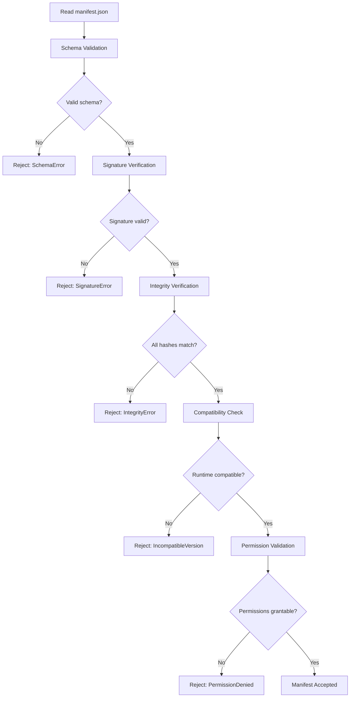

**Pass 1 — Schema Validation**: The manifest JSON is validated against the canonical manifest schema. Missing required fields, wrong types, and invalid formats are rejected.

**Pass 2 — Signature Verification**: The Crypto Engine verifies the Ed25519 or RSA-PSS signature. The certificate chain is validated against the LDFX trust store. The TSA token is verified to confirm the signing timestamp.

**Pass 3 — Integrity Verification**: Every declared hash is recomputed and compared. A single mismatch rejects the entire plugin.

**Pass 4 — Compatibility Check**: The runtime version, API version, and WASM feature flags are checked against the host runtime's capabilities.

**Pass 5 — Permission Validation**: Required permissions are checked against the Security Runtime's policy. Permissions not in the policy are rejected. Optional permissions that are not grantable are silently removed from the active permission set.

### 4.15 Version Negotiation

When a document declares a plugin dependency with a version range, the Plugin Runtime selects the highest installed version that satisfies the range. If no installed version satisfies the range, the Plugin Runtime attempts to load the bundled version from the `.ldfx` container.

Version negotiation is performed by the Dependency Resolver before any plugin is loaded. The resolved version set is locked for the duration of the document session. No version changes occur mid-session.

---

## 5. Plugin Lifecycle

### 5.1 Lifecycle Overview

Every plugin instance passes through a defined set of states from discovery to removal. The Lifecycle Manager owns all state transitions. No component outside the Lifecycle Manager may change a plugin's state directly.

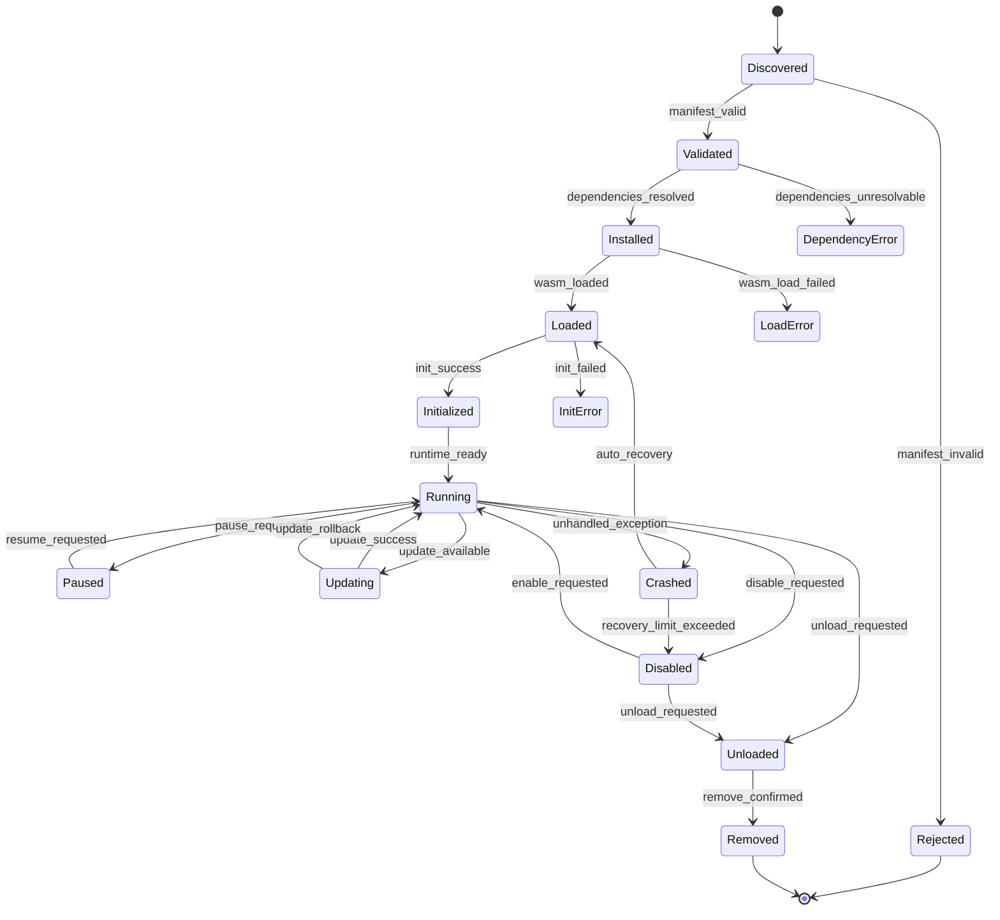

### 5.2 State Definitions

| State | Description |
|---|---|
| Discovered | Plugin bundle found in VFS; manifest not yet read |
| Validated | Manifest read, schema valid, signature verified, hashes verified |
| Rejected | Manifest validation failed; plugin will not load |
| Installed | Dependencies resolved; plugin is ready to load |
| DependencyError | One or more required dependencies could not be resolved |
| Loaded | WASM module compiled and instantiated in sandbox |
| LoadError | WASM compilation or instantiation failed |
| Initialized | Plugin's `init` entry point returned successfully |
| InitError | Plugin's `init` entry point returned an error or timed out |
| Running | Plugin is active and processing events and API calls |
| Paused | Plugin is suspended; no events delivered; API calls queued |
| Updating | Plugin update in progress; old instance still serving requests |
| Disabled | Plugin is installed but not running; can be re-enabled |
| Crashed | Plugin threw an unhandled trap or exceeded resource limits |
| Unloaded | WASM sandbox destroyed; all resources released |
| Removed | Plugin bundle deleted from VFS; registry entry purged |

### 5.3 State Transitions

#### Discovered → Validated

Triggered by the Plugin Loader during the discovery phase. The Loader reads `plugin.manifest.json`, runs all five validation passes (Section 4.14), and transitions to `Validated` on success or `Rejected` on any failure.

Failure events emitted: `plugin.rejected` with `reason: ManifestValidationError`.

#### Validated → Installed

Triggered by the Dependency Resolver. The resolver builds the full dependency graph, checks version constraints, detects circular dependencies, and confirms all required dependencies are available. On success, the plugin transitions to `Installed` with a resolved load order.

Failure events emitted: `plugin.dependency_error` with `reason: UnresolvableDependency | CircularDependency | ConflictingVersions`.

#### Installed → Loaded

Triggered by the Plugin Loader. The WASM module is compiled by the WASM executor, a sandbox is created by the Sandbox Manager, and the capability interface is configured by the Permission Manager Bridge. The plugin's declared assets are verified and made available inside the sandbox.

Failure events emitted: `plugin.load_error` with `reason: WasmCompileError | SandboxCreateError | AssetVerifyError`.

#### Loaded → Initialized

Triggered by the Lifecycle Manager. The `init` entry point is called with the plugin's configuration and capability handle. The plugin must return within the `init_timeout` (default: 2000ms). A successful return transitions to `Initialized`.

Failure events emitted: `plugin.init_error` with `reason: InitTimeout | InitException | InitReturnedError`.

#### Initialized → Running

Triggered automatically after `Initialized`. The Lifecycle Manager registers the plugin's event subscriptions with the Event Bridge and marks the plugin as active in the Plugin Registry. The plugin begins receiving events and API calls.

#### Running → Paused

Triggered by the Plugin Manager on document background, low-memory conditions, or explicit API call. The Event Bridge stops delivering events to the plugin. In-flight API calls complete. New API calls are queued with a configurable queue depth (default: 64).

#### Paused → Running

Triggered by the Plugin Manager on document foreground or explicit API call. Queued events and API calls are delivered in order.

#### Running → Updating

Triggered when a plugin update is available and the plugin declares `hot_reload_safe: true`. The old instance continues serving requests while the new WASM module is compiled and initialized in a shadow sandbox. See Section 6.7 for the full hot reload sequence.

#### Updating → Running (success)

The shadow sandbox passes all validation checks. The old sandbox is drained (all in-flight calls complete), state is migrated, and the new sandbox becomes the active instance.

#### Updating → Running (rollback)

The shadow sandbox fails validation or the state migration fails. The old sandbox continues as the active instance. The update is marked as failed. The failure is logged.

#### Running → Crashed

Triggered when the WASM executor reports an unhandled trap (e.g., out-of-bounds memory access, integer divide by zero, unreachable instruction) or when the CPU monitor reports a budget exceeded condition. The sandbox is immediately terminated.

The Lifecycle Manager attempts automatic recovery: the plugin is reloaded from `Installed` state. Recovery is attempted up to `max_recovery_attempts` (default: 3) within a `recovery_window` (default: 60 seconds). If the limit is exceeded, the plugin transitions to `Disabled`.

Failure events emitted: `plugin.crashed` with `reason: WasmTrap | CpuBudgetExceeded | MemoryLimitExceeded`.

#### Running → Disabled

Triggered by explicit API call, enterprise policy, or recovery limit exceeded. The plugin's event subscriptions are removed. In-flight calls are cancelled. The sandbox is destroyed. The plugin remains in the registry as `Disabled`.

#### Disabled → Running

Triggered by explicit API call (if enterprise policy permits). The plugin is reloaded from `Installed` state and re-initialized.

#### Running / Disabled → Unloaded

Triggered by the Plugin Manager during document session teardown or explicit unload request. The plugin's `teardown` entry point is called (timeout: 1000ms). All resources, subscriptions, and sandbox memory are released.

#### Unloaded → Removed

Triggered by explicit remove request. The plugin bundle is deleted from the VFS. The registry entry is purged. This is irreversible within the current session.

### 5.4 Lifecycle Sequence — Normal Boot

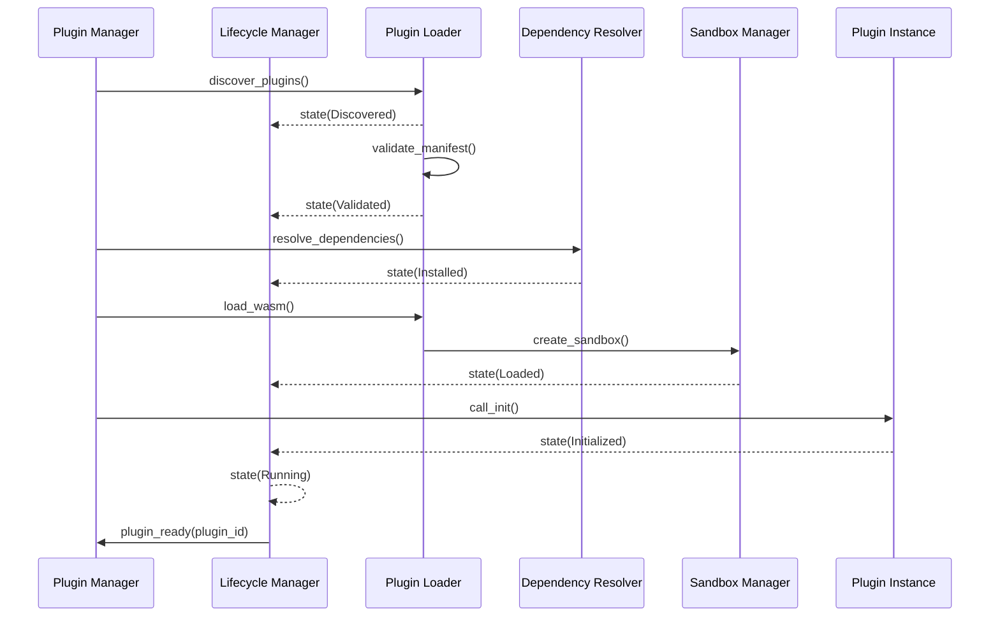

### 5.5 Lifecycle Sequence — Crash and Recovery

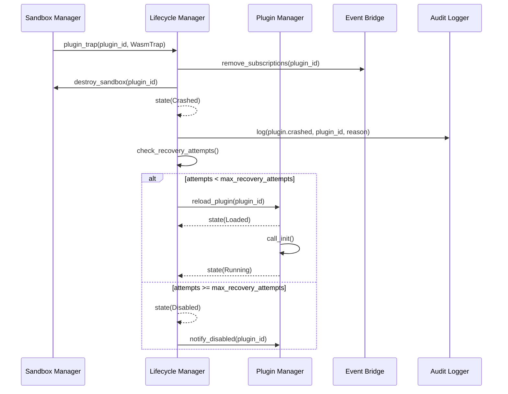

### 5.6 Lifecycle Sequence — Graceful Shutdown

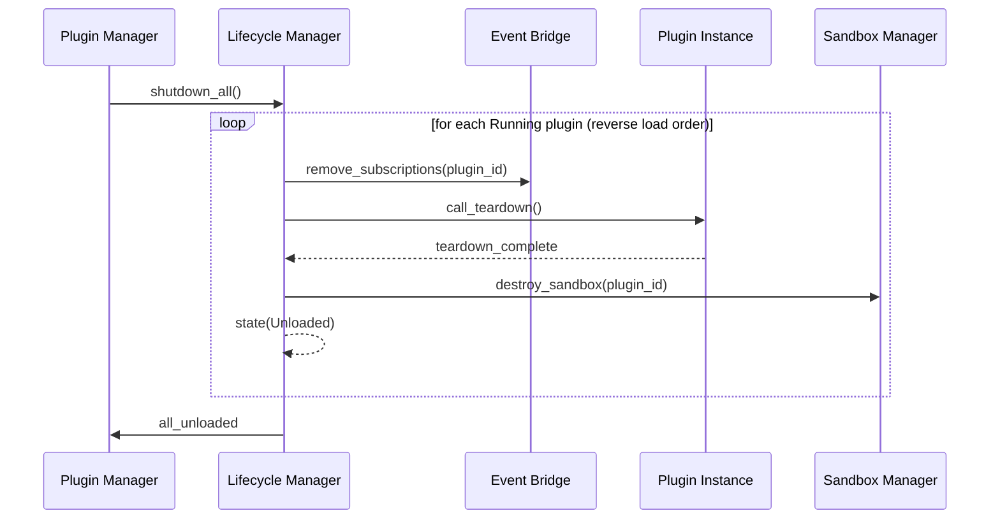

### 5.7 Failure States and Recovery Paths

| Failure State | Cause | Recovery Path |
|---|---|---|
| Rejected | Manifest validation failed | No recovery; plugin cannot load |
| DependencyError | Missing or conflicting dependency | Resolve dependency, retry from Validated |
| LoadError | WASM compile or sandbox error | Retry load up to 2 times; then Disabled |
| InitError | Init timeout or exception | Retry init once; then Disabled |
| Crashed | WASM trap or resource exceeded | Auto-reload up to 3 times; then Disabled |

All failure events are emitted to the Event Bus on the `plugin.lifecycle` channel and written to the Security Audit Log.

---

## 6. Plugin Loading System

### 6.1 Loading System Overview

The Plugin Loading System is responsible for the complete pipeline from plugin bundle discovery inside the `.ldfx` container to a fully sandboxed, initialized plugin instance ready to serve requests. The Plugin Loader owns this pipeline and coordinates with the Dependency Resolver, Sandbox Manager, and Security Runtime at each stage.

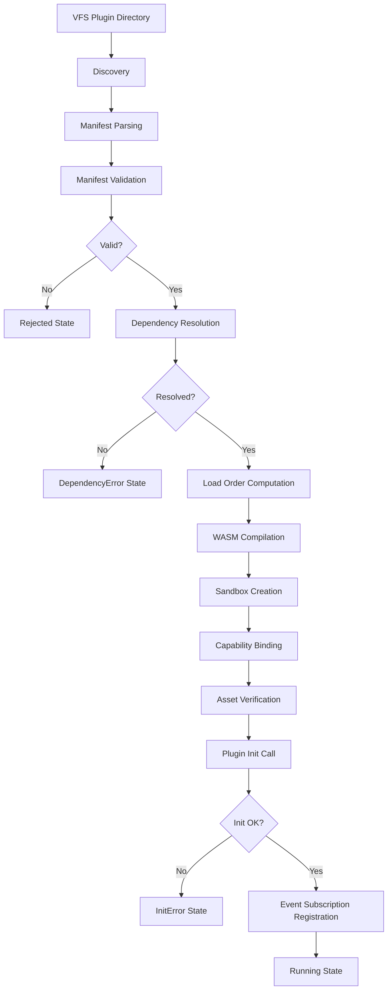

### 6.2 Discovery

The Plugin Loader discovers plugins by scanning the `plugins/` directory inside the `.ldfx` VFS container. Each subdirectory that contains a `plugin.manifest.json` file is treated as a plugin bundle candidate.

Discovery rules:
- Plugin bundle directories are named by `plugin_id` (e.g., `plugins/com.example.myplugin/`)
- Each bundle must contain `plugin.manifest.json` at its root
- Each bundle must contain the WASM module at the path declared in the manifest entry points
- Bundles missing either file are skipped with a `plugin.discovery_skipped` warning event
- Discovery is non-recursive — only top-level subdirectories of `plugins/` are scanned

The Discoverer produces an ordered list of plugin bundle paths. This list is passed to the Manifest Parser.

### 6.3 Manifest Parsing and Validation

The Manifest Parser reads each `plugin.manifest.json` and deserializes it into a `PluginManifest` struct. Parsing failures (malformed JSON, unknown schema version) immediately transition the plugin to `Rejected`.

After parsing, the five-pass validation sequence from Section 4.14 runs:

1. Schema validation — all required fields present and correctly typed
2. Signature verification — Ed25519 or RSA-PSS signature valid against trust store
3. Integrity verification — all declared SHA-256 hashes recomputed and matched
4. Compatibility check — runtime version and WASM feature flags compatible
5. Permission validation — required permissions grantable under current security policy

Any pass failure transitions the plugin to `Rejected` and emits `plugin.rejected` with the specific failure reason.

### 6.4 Dependency Resolution

The Dependency Resolver builds a directed acyclic graph (DAG) of all validated plugins and their declared dependencies. Resolution runs after all manifests are validated, so the full plugin set is known before any WASM module is loaded.

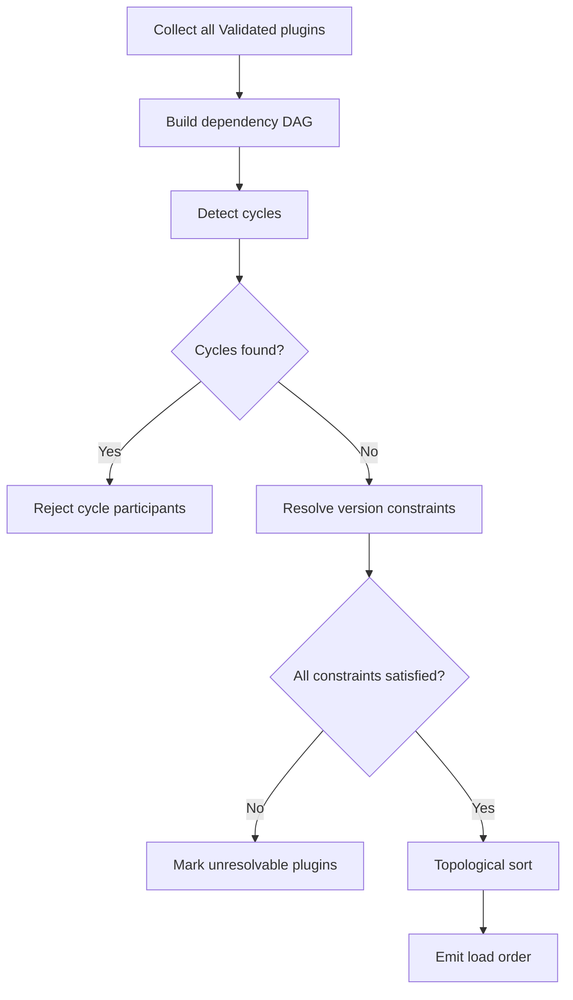

**Cycle detection**: The resolver performs a depth-first search on the dependency DAG. Any back edge indicates a circular dependency. All plugins in the cycle are transitioned to `DependencyError`. Plugins that depend on a cycle participant are also transitioned to `DependencyError`.

**Version constraint resolution**: For each dependency, the resolver finds the highest installed version satisfying the declared version requirement. If no installed version satisfies the requirement, the resolver checks the bundled version in the `.ldfx` container. If neither is available, the dependent plugin transitions to `DependencyError`.

**Conflict resolution**: If two plugins require incompatible versions of the same dependency, the resolver applies the following strategy:
1. If one requirement is a subset of the other, the stricter requirement wins
2. If the requirements are disjoint, both dependent plugins transition to `DependencyError`
3. The conflict is logged with full version constraint details

**Topological sort**: The resolver produces a load order where every plugin is loaded after all its dependencies. This is the order in which the Plugin Loader will instantiate WASM modules.

**Optional dependencies**: Optional dependencies that cannot be resolved are silently removed from the plugin's active dependency set. The plugin loads without them. The plugin is responsible for gracefully degrading when optional dependencies are absent.

### 6.5 WASM Compilation and Sandbox Creation

After the load order is established, the Plugin Loader processes each plugin in order:

**Step 1 — WASM Compilation**: The WASM module bytes are read from the VFS and compiled by the WASM Executor. Compilation is ahead-of-time (AOT) where the host supports it, falling back to just-in-time (JIT) compilation. Compilation failures transition the plugin to `LoadError`.

**Step 2 — Sandbox Creation**: The Sandbox Manager creates an isolated WASM linear memory space for the plugin. Memory limits are set from the manifest's declared resource budget (default: 64 MiB). CPU time limits are configured in the CPU Monitor.

**Step 3 — Capability Binding**: The Permission Manager Bridge configures the capability interface for the sandbox. Only capabilities declared in the manifest's `permissions.required` set (plus any granted optional permissions) are bound. The capability interface is immutable after this point — no capability can be added to a running plugin.

**Step 4 — Asset Verification**: Every asset declared in the manifest's `AssetManifest` is read from the VFS, its SHA-256 hash is recomputed, and the result is compared against the declared hash. A mismatch transitions the plugin to `LoadError` with `reason: AssetIntegrityError`.

### 6.6 Plugin Initialization

After sandbox creation, the Lifecycle Manager calls the plugin's `init` entry point via the WASM host function interface. The init call receives:

```
InitContext {
    plugin_id:       PluginId
    version:         SemVer
    capabilities:    CapabilityHandle
    config:          PluginConfig        // enterprise-injected or document-declared config
    runtime_version: SemVer
    api_version:     SemVer
    locale:          string
    dependencies:    Map<PluginId, CapabilityHandle>  // resolved dependency handles
}
```

The init call must complete within `init_timeout` (default: 2000ms). A timeout transitions the plugin to `InitError`. The plugin's `init` function must return `InitResult::Ok` or `InitResult::Err(reason)`. An error return transitions the plugin to `InitError`.

After a successful init, the Lifecycle Manager registers the plugin's declared event subscriptions with the Event Bridge and transitions the plugin to `Running`.

### 6.7 Hot Loading

Hot loading refers to loading a new plugin into a running document session without restarting the runtime. Hot loading is supported for plugins that are added to the document after initial boot (e.g., via the Plugin Manager API).

Hot loading sequence:
1. Plugin bundle is added to the VFS `plugins/` directory
2. Plugin Loader detects the new bundle (via VFS change notification)
3. Full discovery, validation, and dependency resolution runs for the new plugin
4. If the new plugin's dependencies are already loaded, proceed to WASM compilation
5. If new dependencies are required, they are loaded first (recursive hot load)
6. Plugin is initialized and transitioned to `Running`
7. `plugin.loaded` event emitted on the Event Bus

Hot loading is subject to the same security validation as initial loading. A hot-loaded plugin that fails any validation pass is rejected and the VFS entry is quarantined.

### 6.8 Hot Reloading

Hot reloading refers to updating a running plugin to a new version without interrupting document operation. Hot reloading is only available for plugins that declare `hot_reload_safe: true` in their compatibility flags.

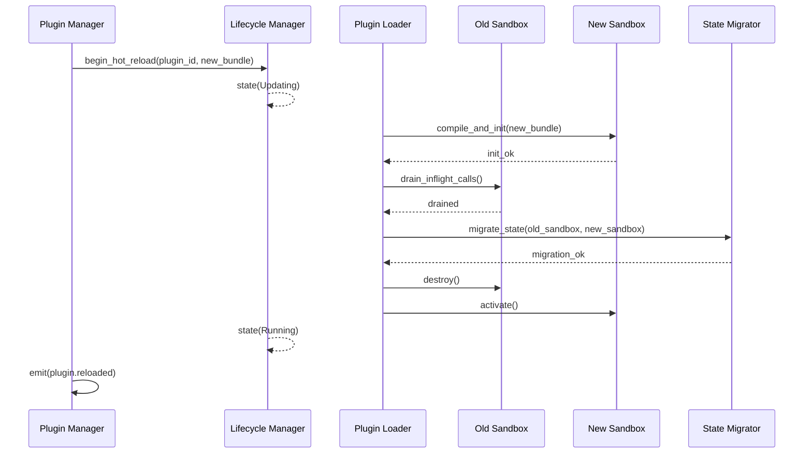

State migration transfers the plugin's storage namespace contents from the old sandbox to the new sandbox. The new plugin version is responsible for declaring a `migrate_state(old_version, state)` entry point if its storage schema has changed.

If any step fails, the old sandbox is retained and the new sandbox is destroyed. The plugin remains `Running` on the old version. The failure is logged as `plugin.reload_failed`.

### 6.9 Safe Loading

Safe loading is a loading mode that adds additional validation steps for plugins from untrusted sources (Trust Level 0 or 1). Safe loading is automatically applied when:

- The plugin's signing certificate is not in the LDFX trust store
- The plugin's trust tier is `Community` or `Unknown`
- Enterprise policy mandates safe loading for all third-party plugins

Additional safe loading steps:
- WASM module is statically analyzed for suspicious import patterns before compilation
- Memory limit is reduced to 32 MiB (half the default)
- CPU time budget is reduced to 50% of the default
- Network capability is denied regardless of manifest declaration
- All API calls are logged at `Debug` level for the first 60 seconds of operation

### 6.10 Lazy Loading

Lazy loading defers WASM compilation and sandbox creation until the plugin is first needed. A plugin is eligible for lazy loading if:

- It is not declared as a dependency of any eagerly-loaded plugin
- It does not register pipeline hooks (Runtime plugins must be loaded before the pipeline runs)
- It does not provide a storage backend (Storage plugins must be loaded before any storage operation)
- Its manifest declares `lazy_load: true` (optional hint; the runtime may override)

Lazy-loaded plugins remain in `Installed` state until their first invocation. On first invocation, the Plugin Loader runs the WASM compilation and initialization sequence synchronously. The first invocation incurs the full load latency. Subsequent invocations are served from the running sandbox.

### 6.11 Background Loading

Background loading compiles WASM modules on a background thread pool to avoid blocking the main rendering pipeline. Background loading is the default for all plugins that are not on the critical path (i.e., not required before the first page render).

The Plugin Loader maintains a priority queue for background loading:

| Priority | Plugin Types |
|---|---|
| Critical | Security plugins, Storage plugins, Language plugins |
| High | Runtime plugins, Theme plugins |
| Normal | UI plugins, Widget plugins, AI plugins |
| Low | Analytics plugins, Developer plugins, Testing plugins |

Critical and High priority plugins are loaded before the first page render. Normal and Low priority plugins are loaded in the background after the first render completes.

### 6.12 Rollback

If a plugin update fails at any stage (compilation, initialization, state migration), the Plugin Runtime performs an automatic rollback:

1. The new sandbox is destroyed
2. The old sandbox (if still alive) is reactivated
3. If the old sandbox was already destroyed (sequential update), the plugin is reloaded from the previous version bundle stored in the VFS rollback cache
4. The rollback is logged as `plugin.rollback` with the failure reason
5. The failed update bundle is quarantined in the VFS to prevent retry loops

The VFS rollback cache retains the previous version bundle for each plugin for the duration of the document session. On session end, rollback caches are cleared.

---

## 7. Plugin APIs

### 7.1 API Surface Overview

The Plugin API Layer exposes a typed, versioned API surface to plugin code via WASM host function imports. Every API method is a host function — the plugin calls it as a normal function, but execution crosses the sandbox boundary into the Plugin Runtime. All parameters and return values are serialized through the capability interface.

The Plugin API is organized into namespaces that mirror the permission system:

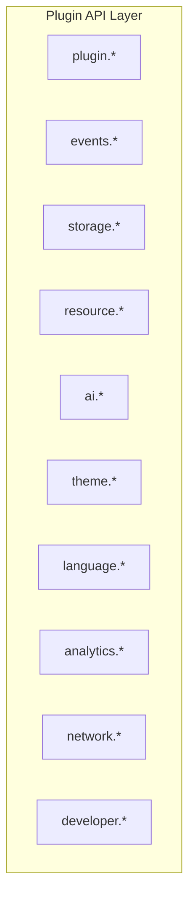

### 7.2 plugin.install()

**Purpose:** Register the plugin with the Plugin Manager and declare its extension points. Called internally by the Plugin Runtime during initialization — not callable by plugin code directly.

**Parameters:**
```
manifest:     PluginManifest
capabilities: CapabilityHandle
```

**Return:** `InstallResult::Ok(PluginHandle)` | `InstallResult::Err(InstallError)`

**Errors:** `AlreadyInstalled` | `ManifestInvalid` | `CapabilityDenied`

**Events emitted:** `plugin.installed`

**Permissions:** System-internal — not callable from plugin code.

---

### 7.3 plugin.uninstall()

**Purpose:** Remove the plugin from the Plugin Manager, destroy its sandbox, and delete its bundle from the VFS.

**Parameters:**
```
plugin_id:  PluginId
force:      bool    // if true, skip graceful teardown
```

**Return:** `UninstallResult::Ok` | `UninstallResult::Err(UninstallError)`

**Errors:** `PluginNotFound` | `PluginRunning` (if force=false and plugin has active calls) | `PermissionDenied`

**Events emitted:** `plugin.uninstalled`

**Permissions:** `plugin.manage` (Trust Level ≥ 3 or enterprise policy)

---

### 7.4 plugin.enable()

**Purpose:** Transition a `Disabled` plugin back to `Running` state. Triggers the full load and init sequence from `Installed` state.

**Parameters:**
```
plugin_id:  PluginId
config:     PluginConfig    // optional override config
```

**Return:** `EnableResult::Ok` | `EnableResult::Err(EnableError)`

**Errors:** `PluginNotFound` | `AlreadyRunning` | `DependencyError` | `InitError`

**Events emitted:** `plugin.enabled` | `plugin.running`

**Permissions:** `plugin.manage`

---

### 7.5 plugin.disable()

**Purpose:** Transition a `Running` plugin to `Disabled` state. Gracefully drains in-flight calls, calls `teardown`, and destroys the sandbox.

**Parameters:**
```
plugin_id:  PluginId
reason:     string      // human-readable reason for audit log
```

**Return:** `DisableResult::Ok` | `DisableResult::Err(DisableError)`

**Errors:** `PluginNotFound` | `AlreadyDisabled` | `PermissionDenied`

**Events emitted:** `plugin.disabled`

**Permissions:** `plugin.manage`

---

### 7.6 plugin.reload()

**Purpose:** Reload a running plugin. If `hot_reload_safe: true`, performs a hot reload (Section 6.8). Otherwise, performs a cold reload (disable then enable).

**Parameters:**
```
plugin_id:      PluginId
preserve_state: bool    // only honored if hot_reload_safe: true
```

**Return:** `ReloadResult::Ok` | `ReloadResult::Err(ReloadError)`

**Errors:** `PluginNotFound` | `ReloadFailed` | `StateMigrationFailed`

**Events emitted:** `plugin.reloaded` | `plugin.reload_failed`

**Permissions:** `plugin.manage`

---

### 7.7 plugin.update()

**Purpose:** Update a plugin to a new version. The new bundle must already be present in the VFS update staging area. Performs hot reload if eligible, cold reload otherwise.

**Parameters:**
```
plugin_id:   PluginId
new_version: SemVer
bundle_path: VfsPath    // path to new bundle in VFS staging area
```

**Return:** `UpdateResult::Ok(previous_version)` | `UpdateResult::Err(UpdateError)`

**Errors:** `PluginNotFound` | `VersionDowngrade` | `SignatureInvalid` | `IntegrityError` | `IncompatibleVersion`

**Events emitted:** `plugin.updated` | `plugin.update_failed` | `plugin.rollback`

**Permissions:** `plugin.manage`

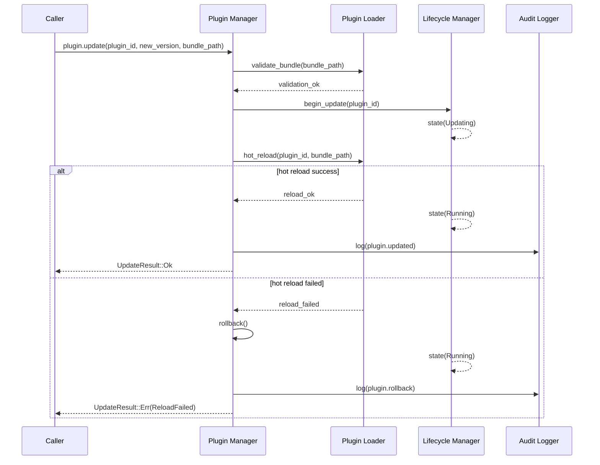

---

### 7.8 plugin.permissions()

**Purpose:** Query the active permission set of a plugin. Returns the intersection of declared permissions and granted permissions.

**Parameters:**
```
plugin_id:  PluginId
```

**Return:** `PermissionsResult::Ok(ActivePermissionSet)` | `PermissionsResult::Err(PluginNotFound)`

**ActivePermissionSet:**
```
ActivePermissionSet {
    granted:  Permission[]    // currently active permissions
    denied:   Permission[]    // declared but denied permissions
    pending:  Permission[]    // optional permissions awaiting user consent
}
```

**Events emitted:** none

**Permissions:** `plugin.inspect` (own plugin always permitted)

---

### 7.9 plugin.events()

**Purpose:** Query the event subscriptions of a plugin. Returns all active subscriptions and their filter configurations.

**Parameters:**
```
plugin_id:  PluginId
```

**Return:** `EventsResult::Ok(EventSubscriptionList)` | `EventsResult::Err(PluginNotFound)`

**EventSubscriptionList:**
```
EventSubscriptionList {
    subscriptions: EventSubscription[]
}

EventSubscription {
    channel:   EventChannel
    filter:    EventFilter
    priority:  SubscriptionPriority
    handler:   string           // WASM export name
}
```

**Events emitted:** none

**Permissions:** `plugin.inspect`

---

### 7.10 plugin.storage()

**Purpose:** Access the plugin's isolated storage namespace. Provides key-value storage scoped to the plugin's `plugin_id`.

**Parameters (get):**
```
key:  string
```
**Return:** `StorageResult::Ok(Option<JsonValue>)` | `StorageResult::Err(StorageError)`

**Parameters (set):**
```
key:    string
value:  JsonValue
ttl:    Option<Duration>    // optional expiry
```
**Return:** `StorageResult::Ok` | `StorageResult::Err(StorageError)`

**Parameters (delete):**
```
key:  string
```
**Return:** `StorageResult::Ok` | `StorageResult::Err(StorageError)`

**Errors:** `QuotaExceeded` | `KeyNotFound` | `SerializationError` | `PermissionDenied`

**Events emitted:** none (storage operations are not broadcast)

**Permissions:** `storage.read` (for get) | `storage.write` (for set/delete)

---

### 7.11 plugin.resources()

**Purpose:** Access resources from the plugin's declared asset namespace. Plugins cannot access resources outside their own namespace.

**Parameters:**
```
asset_path:  string     // relative to plugin bundle root
```

**Return:** `ResourceResult::Ok(ResourceHandle)` | `ResourceResult::Err(ResourceError)`

**ResourceHandle:**
```
ResourceHandle {
    mime_type:  string
    size:       u64
    hash:       Sha256Hash
    data:       Bytes       // raw bytes, validated against declared hash
}
```

**Errors:** `AssetNotFound` | `IntegrityError` | `PermissionDenied`

**Events emitted:** none

**Permissions:** `resource.read` (own namespace)

---

### 7.12 plugin.statistics()

**Purpose:** Query runtime statistics for a plugin instance. Used by the diagnostics dashboard and developer tools.

**Parameters:**
```
plugin_id:  PluginId
```

**Return:** `StatisticsResult::Ok(PluginStatistics)` | `StatisticsResult::Err(PluginNotFound)`

**PluginStatistics:**
```
PluginStatistics {
    state:              PluginState
    uptime:             Duration
    memory_used:        u64         // bytes
    memory_limit:       u64         // bytes
    cpu_time_used:      Duration
    cpu_budget:         Duration
    api_calls_total:    u64
    api_calls_failed:   u64
    events_received:    u64
    events_published:   u64
    crash_count:        u32
    last_crash:         Option<RFC3339>
    load_time:          Duration
    init_time:          Duration
}
```

**Events emitted:** none

**Permissions:** `plugin.inspect`

---

### 7.13 events.subscribe()

**Purpose:** Register an event subscription for the calling plugin. The plugin will receive matching events via its declared `handle_event` entry point.

**Parameters:**
```
channel:   EventChannel
filter:    EventFilter
priority:  SubscriptionPriority
handler:   string           // WASM export name
```

**Return:** `SubscribeResult::Ok(SubscriptionId)` | `SubscribeResult::Err(SubscribeError)`

**Errors:** `ChannelNotPermitted` | `HandlerNotExported` | `SubscriptionLimitExceeded`

**Events emitted:** none

**Permissions:** `events.subscribe` (channel-specific)

---

### 7.14 events.publish()

**Purpose:** Publish an event from the calling plugin to the Event Bus. The event is routed through the Event Bridge's security gate before delivery.

**Parameters:**
```
channel:  EventChannel
event:    PluginEvent
```

**Return:** `PublishResult::Ok` | `PublishResult::Err(PublishError)`

**Errors:** `ChannelNotPermitted` | `EventValidationFailed` | `RateLimitExceeded`

**Events emitted:** the published event (if it passes the security gate)

**Permissions:** `events.publish` (channel-specific)

---

### 7.15 API Versioning and Deprecation

Every API method carries a version annotation:

```
ApiMethod {
    introduced:  SemVer     // version when method was added
    deprecated:  SemVer     // version when method was deprecated (optional)
    removed:     SemVer     // version when method was removed (optional)
    replacement: string     // replacement method name (if deprecated)
}
```

A plugin calling a deprecated method receives a `DeprecationWarning` in its diagnostic log. A plugin calling a removed method receives `ApiVersionError::MethodRemoved`. The Plugin Runtime never silently ignores a removed method call — it always returns an explicit error.

---

## 8. Plugin Communication

### 8.1 Communication Architecture

Plugins are isolated by design — no plugin holds a direct reference to another plugin or to any runtime-internal object. All communication is mediated by the Plugin Runtime through defined channels. This ensures that every message crossing a plugin boundary is validated, logged, and subject to permission checks.

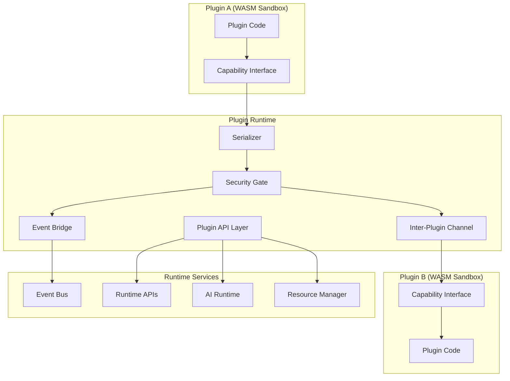

### 8.2 Event-Based Communication

The primary communication mechanism between plugins and the rest of the system is the Event Bus (Part 2.6). Plugins publish and subscribe to events through the Event Bridge, which acts as a security-enforcing proxy between the plugin sandbox and the Event Bus.

**Publishing flow:**
1. Plugin calls `events.publish(channel, event)` via the capability interface
2. The Event Bridge validates the plugin has `events.publish` permission for the target channel
3. The event payload is deserialized from WASM linear memory and validated against the channel's event schema
4. The Security Gate inspects the event for policy violations
5. If all checks pass, the event is forwarded to the Event Bus
6. The Event Bus routes the event to all subscribers according to Part 2.6 routing rules

**Subscribing flow:**
1. Plugin calls `events.subscribe(channel, filter, handler)` via the capability interface
2. The Event Bridge validates the plugin has `events.subscribe` permission for the target channel
3. The subscription is registered in the Event Bridge's subscription table
4. When a matching event arrives, the Event Bridge serializes the event payload into WASM linear memory and calls the plugin's declared handler function

**Channel access matrix:**

| Channel | Subscribe | Publish |
|---|---|---|
| `document.*` | UI, Runtime, Widget plugins | Runtime plugins only |
| `plugin.*` | All plugins (own events only) | Plugin Manager only |
| `analytics.*` | Analytics plugins | All plugins |
| `security.*` | Security plugins (read-only) | Security Runtime only |
| `ai.*` | AI plugins | AI Runtime only |
| `theme.*` | Theme plugins | Theme plugins |
| `language.*` | Language plugins | Language plugins |
| `developer.*` | Developer plugins (dev mode only) | Developer plugins |

### 8.3 Runtime API Access

Plugins access Runtime APIs (Part 2.5) through the Plugin API Layer. The Plugin API Layer translates plugin API calls into Runtime API calls, enforcing the plugin's capability set at the boundary.

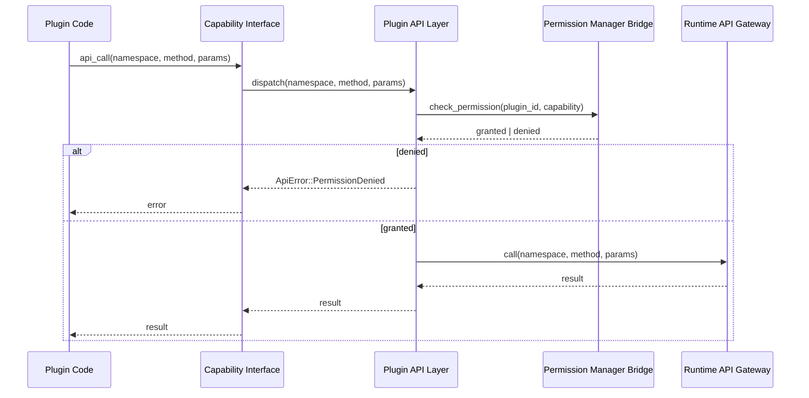

The Plugin API Layer enforces namespace isolation — a plugin can only call Runtime API methods in namespaces covered by its declared permissions. Attempts to call methods in unpermitted namespaces return `ApiError::PermissionDenied` without forwarding the call to the Runtime API Gateway.

### 8.4 Inter-Plugin Messaging

Plugins may communicate with each other through the Inter-Plugin Channel (IPC). IPC is not a direct channel — all messages are routed through the Event Bridge and subject to the same security checks as event publishing.

**IPC rules:**
- A plugin must declare `ipc.send` permission targeting the recipient plugin's ID
- The recipient plugin must declare `ipc.receive` permission from the sender plugin's ID
- Both permissions must be declared in the respective manifests — there is no runtime consent prompt
- IPC messages are typed — the sender and receiver must agree on a message schema declared in their manifests
- IPC message payloads are limited to 1 MiB per message
- IPC is asynchronous — the sender does not block waiting for a response

**IPC request-response pattern:**
```
IpcMessage {
    sender_id:      PluginId
    recipient_id:   PluginId
    message_type:   string          // agreed schema type
    correlation_id: Uuid            // for matching responses
    payload:        JsonValue
    timestamp:      RFC3339
}
```

The recipient plugin receives the message via its `handle_event` entry point with channel `ipc.{sender_id}`. The recipient may respond by publishing an IPC message back to the sender using the `correlation_id` to match the request.

### 8.5 Plugin-to-Runtime Communication

Plugins communicate with the Runtime Engine through the Plugin API Layer's `document.*` namespace. This covers:

- Reading content model nodes (read-only, scoped to the plugin's registered blocks)
- Requesting content model mutations (queued and applied by the Runtime Engine)
- Registering pipeline extension point handlers
- Requesting page navigation

All content model mutations requested by plugins are queued in the Runtime Engine's mutation queue and applied atomically at the end of the current pipeline stage. Plugins cannot apply mutations synchronously — this prevents mid-pipeline state corruption.

### 8.6 Plugin-to-AI Communication

Plugins communicate with the AI Runtime through the `ai.*` API namespace. AI plugins register model handlers; other plugin types invoke AI inference through the `ai.infer()` API call.

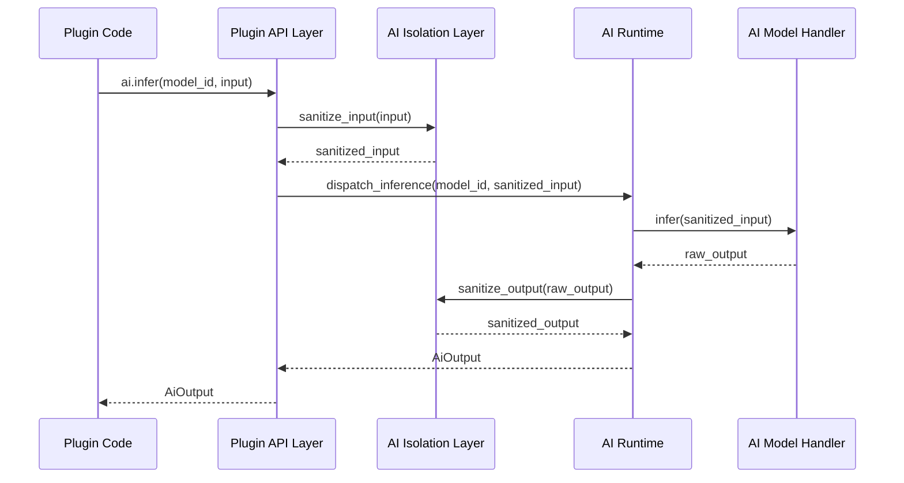

The AI Isolation Layer sanitizes both inputs and outputs to prevent prompt injection, data exfiltration, and model output manipulation. Plugins cannot bypass the AI Isolation Layer.

### 8.7 Plugin-to-Resource Communication

Plugins access resources through the `resource.*` API namespace. Plugins are restricted to their own asset namespace — they cannot request resources from other plugins' namespaces or from the document's resource tree directly.

Resource access is mediated by the Resource Manager (Part 2.3). The Plugin API Layer translates plugin resource requests into Resource Manager API calls, adding the plugin's namespace prefix to all paths before forwarding.

### 8.8 Communication Security

All communication crossing a plugin boundary is subject to the following security controls:

| Control | Description |
|---|---|
| Serialization boundary | All data is serialized to JSON at the boundary; no raw pointers cross |
| Schema validation | All messages are validated against their declared schema |
| Size limits | All messages are subject to size limits (default: 1 MiB payload) |
| Rate limiting | All API calls and event publications are rate-limited per plugin |
| Audit logging | All cross-boundary calls are logged at `Trace` level; security-relevant calls at `Info` |
| Permission check | Every call is checked against the plugin's active permission set |

A plugin that exceeds its rate limit receives `ApiError::RateLimitExceeded`. The rate limit counter resets every second. Persistent rate limit violations are escalated to the Security Runtime as a potential abuse signal.

---

## 9. Permissions & Security

### 9.1 Permission Model

The Plugin Runtime uses a capability-based permission model inherited from the Security Runtime (Part 2.7). Every capability a plugin may exercise must be declared in its manifest before the plugin is loaded. No capability can be acquired at runtime. No capability can be escalated beyond what was declared.

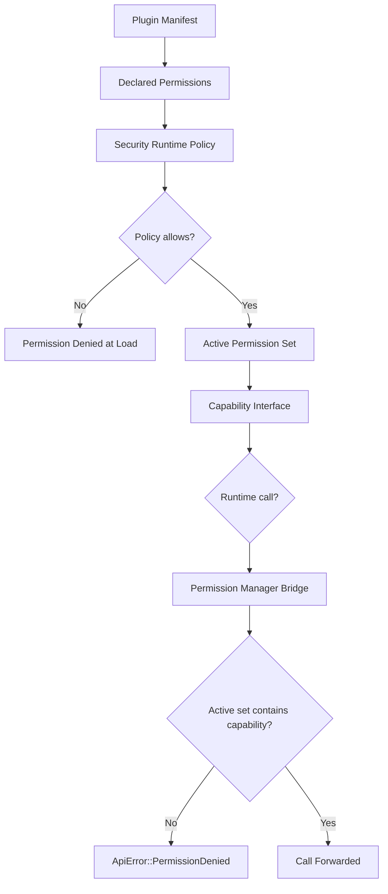

### 9.2 Capability Taxonomy

Capabilities are organized in a dot-notation hierarchy. A permission grant at a parent level does not imply grants at child levels — each capability must be declared explicitly.

| Capability | Description | Trust Level Required |
|---|---|---|
| `storage.read` | Read from own storage namespace | 0 |
| `storage.write` | Write to own storage namespace | 0 |
| `resource.read` | Read own declared assets | 0 |
| `events.subscribe` | Subscribe to permitted channels | 0 |
| `events.publish` | Publish to permitted channels | 0 |
| `theme.write` | Register theme tokens | 1 |
| `language.write` | Register locale bundles | 1 |
| `analytics.read` | Read analytics data | 1 |
| `analytics.write` | Write analytics events | 1 |
| `ai.inference` | Invoke AI inference | 2 |
| `ipc.send` | Send IPC messages | 2 |
| `ipc.receive` | Receive IPC messages | 2 |
| `document.read` | Read content model nodes | 2 |
| `document.mutate` | Request content model mutations | 2 |
| `network.read` | Make outbound HTTP GET requests | 3 |
| `network.write` | Make outbound HTTP POST/PUT requests | 3 |
| `filesystem.read` | Read from declared VFS paths | 3 |
| `filesystem.write` | Write to declared VFS paths | 3 |
| `plugin.manage` | Install/uninstall/enable/disable plugins | 4 |
| `plugin.inspect` | Query plugin state and statistics | 2 |
| `security.audit` | Append to Security Audit Log | 3 |
| `enterprise.*` | Enterprise-specific capabilities | 4 |
| `developer.*` | Developer mode capabilities | Dev mode only |

### 9.3 Capability-Based Access Control

The Permission Manager Bridge enforces capability-based access at every API call. The enforcement model is:

1. **Compile-time**: The capability interface is configured at sandbox creation. Host functions for unpermitted capabilities are not imported into the WASM module. A plugin that attempts to call an unimported host function receives a WASM trap — not a runtime error.

2. **Runtime**: For capabilities that are conditionally granted (e.g., optional permissions), the Permission Manager Bridge checks the active permission set on every call. This is a fast in-memory lookup against a bitset.

3. **Namespace scoping**: Capabilities are scoped to the plugin's declared namespace. A `storage.read` grant does not allow reading another plugin's storage. The namespace prefix is enforced by the Plugin API Layer before forwarding to the underlying service.

### 9.4 Sandboxing Architecture

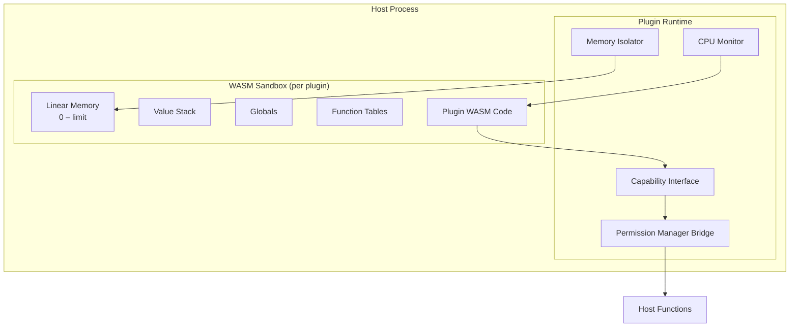

Each plugin runs in its own WASM linear memory space. The WASM specification guarantees that:
- A plugin cannot read or write memory outside its linear memory bounds
- A plugin cannot call functions outside its imported function table
- A plugin cannot access host process memory directly

The Memory Isolator enforces the per-plugin memory limit. If a plugin's linear memory growth request would exceed its declared limit, the growth is denied and the plugin receives a WASM memory allocation failure.

The CPU Monitor tracks wall-clock time and instruction counts per plugin invocation. If a plugin exceeds its per-call CPU budget (default: 100ms), the invocation is terminated with `CpuBudgetExceeded` and the plugin transitions to `Crashed`.

### 9.5 API Restrictions

Beyond capability checks, the Plugin API Layer enforces additional restrictions:

**Filesystem restrictions:**
- Plugins may only access VFS paths explicitly declared in their manifest
- Path traversal attempts (`../`) are rejected at the API layer before reaching the VFS
- Plugins cannot create, delete, or rename VFS directories — only read/write declared files

**Resource restrictions:**
- Plugins may only access assets declared in their `AssetManifest`
- Asset access is validated against the declared SHA-256 hash on every read
- Plugins cannot access the document's resource tree outside their namespace

**AI restrictions:**
- Plugins may only invoke AI models they have declared in their manifest
- AI input size is limited to 512 KiB per inference call
- AI output size is limited to 1 MiB per inference result
- Streaming inference is subject to a 30-second timeout

**Network restrictions:**
- Network access requires explicit `network.read` or `network.write` capability
- Allowed domains must be declared in the manifest's network policy
- All network requests are proxied through the Runtime's network layer — plugins cannot open raw sockets
- Network access is disabled entirely in offline mode

### 9.6 Runtime Monitoring

The Security Runtime (Part 2.7) monitors all plugin activity through the Audit Logger and the Metrics Collector. Monitoring is continuous and cannot be disabled by plugins.

Monitored signals:

| Signal | Threshold | Action |
|---|---|---|
| API call rate | > 1000 calls/sec | Rate limit + warning event |
| Memory growth rate | > 10 MiB/sec | Throttle + warning event |
| CPU usage | > 80% of budget sustained 5s | Throttle |
| CPU budget exceeded | Single call > 100ms | Terminate call + Crashed state |
| IPC message rate | > 100 messages/sec | Rate limit |
| Event publish rate | > 500 events/sec | Rate limit |
| Storage write rate | > 1 MiB/sec | Throttle |
| Repeated crashes | ≥ 3 in 60s | Disabled state |

All threshold violations are emitted as `security.plugin_anomaly` events and written to the Security Audit Log.

### 9.7 Signature Verification

Plugin signature verification is performed by the Crypto Engine (Part 2.7) during manifest validation. The verification chain:

```mermaid
flowchart TD
    A[Plugin Bundle] --> B[Extract manifest.json]
    B --> C[Extract signature block]
    C --> D[Verify TSA token]
    D --> E{TSA valid?}
    E -- No --> FAIL1[Reject: InvalidTimestamp]
    E -- Yes --> F[Build certificate chain]
    F --> G[Validate chain to trust anchor]
    G --> H{Chain valid?}
    H -- No --> FAIL2[Reject: UntrustedCertificate]
    H -- Yes --> I[Verify Ed25519 signature]
    I --> J{Signature valid?}
    J -- No --> FAIL3[Reject: SignatureInvalid]
    J -- Yes --> K[Check certificate revocation]
    K --> L{Revoked?}
    L -- Yes --> FAIL4[Reject: CertificateRevoked]
    L -- No --> M[Signature Verified]
```

The LDFX trust store contains:
- The LDFX Marketplace root CA certificate
- Enterprise CA certificates (injected by enterprise policy)
- Pinned developer certificates (dev mode only)

A plugin signed by a certificate not in the trust store is assigned Trust Level 0 (Untrusted) and subject to safe loading restrictions (Section 6.9).

### 9.8 Trust Levels

Plugin trust levels map directly to the Security Runtime's trust model (Part 2.7):

| Trust Level | Name | Source | Capabilities |
|---|---|---|---|
| 0 | Untrusted | Unsigned or unknown signer | Minimal — safe loading restrictions apply |
| 1 | Local | Locally installed, unverified | Basic capabilities |
| 2 | Signed | Valid signature, community CA | Standard capabilities |
| 3 | Verified | LDFX Marketplace verified | Extended capabilities including network |
| 4 | Enterprise | Enterprise CA signed | Full capabilities per enterprise policy |
| 5 | System | LDFX first-party | All capabilities |

Trust levels are assigned at load time and are immutable for the duration of the session. A trust level can only be downgraded — never upgraded — in response to a security violation.

---

## 10. Dependency Management

### 10.1 Dependency System Overview

The Dependency Resolver manages the complete lifecycle of plugin dependencies — from graph construction through version negotiation, conflict resolution, and shared library management. It runs before any WASM module is loaded and produces a validated, ordered load plan.

```mermaid
graph TD
    subgraph DependencyResolver["Dependency Resolver"]
        COLLECT[Collect Manifests]
        BUILD[Build DAG]
        CYCLE[Cycle Detector]
        VERSION[Version Negotiator]
        CONFLICT[Conflict Resolver]
        SHARED[Shared Library Manager]
        TOPO[Topological Sorter]
        PLAN[Load Plan Emitter]
    end

    COLLECT --> BUILD
    BUILD --> CYCLE
    CYCLE --> VERSION
    VERSION --> CONFLICT
    CONFLICT --> SHARED
    SHARED --> TOPO
    TOPO --> PLAN
```

### 10.2 Dependency Graph

The dependency graph is a directed acyclic graph (DAG) where:
- Each node represents a plugin at a specific version
- Each directed edge represents a `depends_on` relationship
- Edge weight carries the version constraint

```mermaid
graph LR
    A["com.example.charts\nv2.1.0"] --> B["com.ldfx.ui-base\nv1.4.0"]
    A --> C["com.example.math\n>=1.0 <2.0"]
    D["com.example.dashboard\nv1.0.0"] --> A
    D --> E["com.example.analytics\n^2.0"]
    E --> B
    F["com.example.export\nv3.0.0"] --> C
    F --> G["com.ldfx.storage\nv1.0.0"]
```

The graph is constructed by the Dependency Resolver after all manifests are validated. Each plugin's `dependencies` and `optional_deps` arrays are processed to build the edge set.

### 10.3 Version Constraints

Version constraints follow Cargo semver syntax:

| Syntax | Meaning |
|---|---|
| `=1.2.3` | Exactly version 1.2.3 |
| `^1.2.3` | Compatible with 1.2.3 — allows 1.x.x where x ≥ 2.3 |
| `~1.2.3` | Patch-compatible — allows 1.2.x where x ≥ 3 |
| `>=1.2 <2.0` | Range — any version from 1.2.0 up to but not including 2.0.0 |
| `*` | Any version (not recommended; logged as a warning) |

The Version Negotiator selects the highest available version satisfying each constraint. "Available" means either installed in the runtime's plugin cache or bundled in the `.ldfx` container.

### 10.4 Optional Dependencies

Optional dependencies are declared in the manifest's `optional_deps` array. They follow the same version constraint syntax as required dependencies but do not block plugin loading if unresolvable.

When an optional dependency is absent:
- The dependency's `CapabilityHandle` in the `InitContext.dependencies` map is `None`
- The plugin is responsible for checking for `None` and degrading gracefully
- A `plugin.optional_dep_absent` warning event is emitted
- The plugin's statistics record which optional dependencies are absent

### 10.5 Circular Dependency Detection

The Cycle Detector performs a depth-first search on the dependency DAG. A cycle is detected when a back edge is found — i.e., when the DFS encounters a node already on the current path.

```mermaid
flowchart TD
    A[Start DFS from each unvisited node] --> B[Mark node as In-Progress]
    B --> C[Visit each dependency]
    C --> D{Dependency In-Progress?}
    D -- Yes --> CYCLE[Record cycle]
    D -- No --> E{Dependency visited?}
    E -- Yes --> F[Skip]
    E -- No --> B
    F --> G[Mark node as Done]
    CYCLE --> H[Transition cycle participants to DependencyError]
```

When a cycle is detected:
1. All plugins in the cycle are transitioned to `DependencyError`
2. All plugins that depend on any cycle participant are also transitioned to `DependencyError`
3. A `plugin.circular_dependency` error event is emitted listing all cycle participants
4. The cycle is written to the Security Audit Log

### 10.6 Conflict Resolution

A conflict occurs when two plugins require incompatible versions of the same dependency. The Conflict Resolver applies the following strategy in order:

**Strategy 1 — Subset resolution**: If one version constraint is a strict subset of the other (e.g., `^1.2` and `>=1.3 <2.0`), the stricter constraint wins. Both plugins receive the version satisfying the stricter constraint.

**Strategy 2 — Highest compatible**: If both constraints overlap (e.g., `^1.0` and `^1.2`), the highest version satisfying both is selected.

**Strategy 3 — Conflict error**: If the constraints are disjoint (e.g., `^1.0` and `^2.0`), both dependent plugins transition to `DependencyError`. The conflict is logged with full details.

The Conflict Resolver never silently selects a version that violates a declared constraint. A plugin that declares `=1.4.2` will never receive version 1.4.3, even if that would resolve a conflict.

### 10.7 Shared Libraries

Some plugins provide shared library functionality — they are dependencies of many other plugins and provide common utilities (e.g., `com.ldfx.ui-base`, `com.ldfx.storage`). The Shared Library Manager handles these specially:

- Shared libraries are loaded once and their `CapabilityHandle` is shared across all dependent plugins
- Shared library WASM modules are compiled once and the compiled artifact is cached
- Shared libraries must declare `shared_library: true` in their compatibility flags
- Shared libraries must be stateless — they cannot hold mutable state between calls
- Shared library API surface is versioned independently of the plugin that bundles them

Shared library memory is not shared — each dependent plugin receives its own linear memory space. The shared library's code is shared (read-only), but each invocation operates on the calling plugin's memory.

### 10.8 Plugin Compatibility Matrix

The Plugin Runtime maintains a compatibility matrix that records known incompatibilities between plugin versions. This matrix is bundled with the runtime and updated with each runtime release.

```
CompatibilityEntry {
    plugin_a:    PluginId
    version_a:   VersionRange
    plugin_b:    PluginId
    version_b:   VersionRange
    reason:      string
    severity:    Incompatible | Warning | Advisory
}
```

Before finalizing the load plan, the Dependency Resolver checks all plugin pairs against the compatibility matrix. `Incompatible` entries block loading. `Warning` entries emit a `plugin.compatibility_warning` event. `Advisory` entries are logged silently.

### 10.9 Dependency Visualization

The Plugin Runtime exposes the resolved dependency graph through the `plugin.dependencies()` API for use by developer tools and the diagnostics dashboard. The graph is serialized as a JSON adjacency list with version and status annotations for each node and edge.

---

## 11. Plugin Marketplace Readiness

### 11.1 Marketplace Architecture

The Plugin Runtime is designed to support a future LDFX plugin marketplace without requiring architectural changes. The marketplace integration points are defined now and implemented as no-ops until the marketplace is live.

```mermaid
graph TD
    subgraph Marketplace["LDFX Plugin Marketplace (Future)"]
        PORTAL[Publisher Portal]
        REGISTRY[Package Registry]
        SIGN_SVC[Signing Service]
        TRUST_SVC[Trust Verification Service]
        UPDATE_SVC[Update Distribution Service]
        RATING[Ratings & Reviews Service]
    end

    subgraph EnterpriseRepo["Enterprise Repository (Optional)"]
        ENT_REG[Private Registry]
        ENT_SIGN[Enterprise Signing Service]
        ENT_POLICY[Policy Server]
    end

    subgraph PluginRuntime["Plugin Runtime"]
        LOADER[Plugin Loader]
        TRUST[Trust Store]
        UPDATE[Update Manager]
        OFFLINE[Offline Cache]
    end

    PORTAL --> SIGN_SVC
    SIGN_SVC --> REGISTRY
    REGISTRY --> UPDATE_SVC
    UPDATE_SVC --> LOADER
    TRUST_SVC --> TRUST
    ENT_REG --> LOADER
    ENT_SIGN --> TRUST
    ENT_POLICY --> LOADER
    LOADER --> OFFLINE
```

### 11.2 Plugin Signing for Distribution

Every plugin distributed through the marketplace must be signed by the LDFX Marketplace Signing Service. The signing process:

1. Publisher submits plugin bundle to the Publisher Portal
2. The Signing Service performs automated security scanning (WASM static analysis, manifest validation, dependency audit)
3. On passing all checks, the Signing Service signs the bundle with the LDFX Marketplace CA
4. The signed bundle is published to the Package Registry with a unique content-addressed identifier
5. The TSA token is attached to the signature to establish a verifiable signing timestamp

Publishers must hold a valid LDFX Publisher Certificate issued by the LDFX Certificate Authority. Publisher certificates are tied to a verified identity (individual or organization).

### 11.3 Package Distribution

Plugins are distributed as signed ZIP bundles containing:
- `plugin.manifest.json` (signed)
- The WASM module binary
- Declared asset files
- Locale bundles

The Package Registry stores bundles content-addressed by their `IntegrityHashes.bundle` SHA-256 hash. This ensures that the same bundle hash always refers to the same bytes — the registry cannot silently substitute a different bundle.

Distribution to end users happens at document creation time — the document author embeds the plugin bundle inside the `.ldfx` container. The Plugin Runtime never fetches plugins from the marketplace at runtime.

### 11.4 Update Distribution

Plugin updates are distributed as new signed bundles. The Update Distribution Service notifies document authoring tools when a newer version of a bundled plugin is available. The authoring tool may then re-bundle the document with the updated plugin.

The Plugin Runtime's `plugin.update()` API (Section 7.7) accepts update bundles from the VFS staging area. The staging area is populated by the authoring tool or enterprise management system — not by the Plugin Runtime itself.

### 11.5 Trust Verification

The Trust Verification Service maintains the LDFX trust store and provides certificate revocation information. The Plugin Runtime queries the trust store at load time. In offline mode, the trust store is cached locally and updated when connectivity is available.

Trust tiers in the marketplace context:

| Tier | Verification | Badge |
|---|---|---|
| Community | Valid signature, no additional verification | Community |
| Verified | Publisher identity verified, security scan passed | Verified |
| Featured | Manually reviewed by LDFX team | Featured |
| Enterprise | Enterprise CA signed, private distribution | Enterprise |
| First-Party | LDFX team authored | Official |

### 11.6 Ratings Metadata

The marketplace metadata schema (Section 4.11) includes fields for ratings display. The Plugin Runtime does not enforce ratings — it only stores and exposes the metadata. Ratings are advisory information for document authors and end users.

```
RatingsMetadata {
    average_rating:   f32           // 0.0 – 5.0
    rating_count:     u64
    download_count:   u64
    last_updated:     RFC3339
    verified_reviews: u32
}
```

This metadata is embedded in the plugin manifest at bundle time by the authoring tool. It is not updated at runtime.

### 11.7 Enterprise Repositories

Enterprise deployments may host a private plugin repository for air-gapped or controlled environments. The enterprise repository mirrors the marketplace API surface and is configured in the enterprise policy:

```
EnterpriseRepositoryConfig {
    base_url:          string
    ca_certificate:    Base64Bytes     // enterprise CA for repository TLS
    signing_ca:        Base64Bytes     // enterprise CA for plugin signing
    policy_server:     string          // URL for enterprise plugin policy
    offline_cache_ttl: Duration        // how long to cache repository metadata
    allowed_plugins:   PluginId[]      // allowlist (empty = all allowed)
    blocked_plugins:   PluginId[]      // blocklist
    mandatory_plugins: PluginId[]      // must be present and running
}
```

Enterprise repositories use the same bundle format and signing protocol as the public marketplace. The only difference is the signing CA — enterprise plugins are signed by the enterprise CA rather than the LDFX Marketplace CA.

### 11.8 Offline Repositories

For fully air-gapped deployments, the Plugin Runtime supports a local filesystem repository. The local repository is a directory containing signed plugin bundles. The Plugin Loader scans this directory in addition to the `.ldfx` container's `plugins/` directory.

Local repository configuration:
```
LocalRepositoryConfig {
    path:           VfsPath
    signing_ca:     Base64Bytes     // CA for verifying locally-stored plugins
    scan_interval:  Duration        // how often to rescan for new bundles
}
```

---

## 12. Runtime Integration

### 12.1 Integration with the LDFX Runtime Engine (Part 2.4)

The Plugin Runtime is a first-class subsystem of the LDFX Runtime Engine. It is initialised during the engine boot sequence, after the Virtual Filesystem (VFS) and Memory Manager are ready but before the Document Executor begins processing pages.

Boot integration sequence:
```
RuntimeEngine::boot()
  │
  ├─ 1. VirtualFilesystem::mount(container)
  ├─ 2. MemoryManager::init()
  ├─ 3. PluginRuntime::init(config)          ← Phase 2.8 entry point
  │       ├─ PluginLoader::discover()
  │       ├─ PluginLoader::validate_all()
  │       ├─ DependencyResolver::resolve()
  │       ├─ PluginLoader::load_eager()      ← trust_level >= 3 plugins
  │       └─ PluginLoader::schedule_lazy()   ← trust_level < 3 plugins
  ├─ 4. DocumentExecutor::init()
  └─ 5. RuntimeEngine::run()
```

The Runtime Engine holds a single `Arc<PluginRuntime>` instance. All subsystems that need plugin services receive a clone of this Arc — they never construct their own Plugin Runtime.

Shutdown integration sequence:
```
RuntimeEngine::shutdown()
  │
  ├─ 1. DocumentExecutor::shutdown()
  ├─ 2. PluginRuntime::shutdown()            ← ordered teardown
  │       ├─ broadcast Event::RuntimeShutdown
  │       ├─ PluginLifecycle::pause_all()
  │       ├─ PluginLifecycle::unload_all()   ← reverse dependency order
  │       └─ SandboxManager::destroy_all()
  ├─ 3. MemoryManager::shutdown()
  └─ 4. VirtualFilesystem::unmount()
```

The Plugin Runtime must complete its shutdown within the `plugin_shutdown_timeout` (default 5 s). Any plugin that does not respond to the unload signal within this window is forcibly terminated by the Sandbox Manager.

### 12.2 Integration with the Event System (Part 2.6)

The Plugin Runtime is both a producer and a consumer of the LDFX Event Bus.

**Events produced by the Plugin Runtime:**

| Event | Payload | Description |
|---|---|---|
| `plugin.discovered` | `PluginId, PluginManifest` | Plugin bundle found during discovery |
| `plugin.validated` | `PluginId, ValidationResult` | Manifest and signature verified |
| `plugin.installed` | `PluginId, semver::Version` | Plugin written to install store |
| `plugin.loaded` | `PluginId, LoadDuration` | WASM module compiled and sandbox ready |
| `plugin.initialized` | `PluginId` | Plugin's `on_init` hook returned Ok |
| `plugin.running` | `PluginId` | Plugin entered Running state |
| `plugin.paused` | `PluginId, PauseReason` | Plugin suspended |
| `plugin.crashed` | `PluginId, CrashReport` | Plugin panicked or violated sandbox |
| `plugin.unloaded` | `PluginId` | Plugin WASM instance destroyed |
| `plugin.removed` | `PluginId` | Plugin bundle deleted from install store |
| `plugin.update_available` | `PluginId, semver::Version` | Marketplace reports newer version |
| `plugin.permission_denied` | `PluginId, Permission` | Plugin attempted unauthorised capability |

**Events consumed by the Plugin Runtime:**

| Event | Handler | Description |
|---|---|---|
| `runtime.document_opened` | `PluginRuntime::on_document_opened` | Trigger lazy-load for document-scoped plugins |
| `runtime.document_closed` | `PluginRuntime::on_document_closed` | Unload document-scoped plugins |
| `runtime.page_activated` | `PluginRuntime::on_page_activated` | Wake paused UI plugins for the active page |
| `security.trust_revoked` | `PluginRuntime::on_trust_revoked` | Immediately disable affected plugins |
| `marketplace.policy_updated` | `PluginRuntime::on_policy_updated` | Re-evaluate mandatory/blocked plugin lists |

Event routing rules:
- Plugin-to-plugin events are routed through the Event Bus; the Plugin Runtime never delivers them directly.
- Events with `scope: PluginId` are delivered only to the named plugin's sandbox.
- Events with `scope: Broadcast` are delivered to all Running plugins that have subscribed to the event type.
- A plugin that is Paused or Crashed does not receive events. Events targeting a Paused plugin are queued (up to `event_queue_depth`, default 256) and delivered on resume.

### 12.3 Integration with the Security Runtime (Part 2.7)

The Plugin Runtime delegates all cryptographic operations to the Security Runtime. It never performs signature verification or key management itself.

Integration points:

```
PluginValidator::verify_signature(bundle) {
    let cert_chain = bundle.manifest.signature.certificate_chain;
    SecurityRuntime::verify_certificate_chain(cert_chain, trust_anchors)?;
    let payload = bundle.manifest_bytes_canonical();
    SecurityRuntime::verify_signature(payload, bundle.manifest.signature.value, cert_chain[0])?;
}

PluginValidator::verify_integrity(bundle) {
    for (path, expected_hash) in bundle.manifest.integrity.files {
        let actual = SecurityRuntime::sha256(bundle.read_file(path)?);
        ensure!(actual == expected_hash, IntegrityError { path });
    }
}
```

The Security Runtime also enforces the runtime permission model. When a plugin calls a host API that requires a capability, the Plugin Runtime calls:

```
SecurityRuntime::check_capability(plugin_id, capability) -> Result<(), PermissionDenied>
```

This check is performed on every API call — it is not cached. The Security Runtime may revoke a capability at any time (e.g. after a policy update), and the next API call will immediately return `PermissionDenied`.

Trust level assignment is performed by the Security Runtime based on the certificate chain presented in the plugin manifest. The Plugin Runtime reads the assigned trust level from the Security Runtime's trust store and uses it to determine sandbox policy.

### 12.4 Integration with the Virtual Filesystem (VFS)

Plugins access the document's virtual filesystem through a scoped VFS handle. The Plugin Runtime creates a `PluginVfsHandle` for each plugin during sandbox initialisation. This handle enforces path-based access control derived from the plugin's declared permissions.

```
PluginVfsHandle {
    plugin_id:    PluginId,
    allowed_read: Vec<VfsGlob>,   // from manifest permissions
    allowed_write: Vec<VfsGlob>,  // from manifest permissions
    vfs:          Arc<VirtualFilesystem>,
}

impl PluginVfsHandle {
    fn read(&self, path: VfsPath) -> Result<Bytes> {
        self.check_read_permission(&path)?;
        self.vfs.read(path)
    }
    fn write(&self, path: VfsPath, data: Bytes) -> Result<()> {
        self.check_write_permission(&path)?;
        self.vfs.write(path, data)
    }
}
```

Plugins declared with `permissions.storage: ["vfs:read:assets/**"]` receive a handle whose `allowed_read` contains `assets/**`. Any attempt to read outside the allowed globs returns `PermissionDenied` without touching the VFS.

### 12.5 Integration with the Memory Manager

Each plugin sandbox has a dedicated memory budget enforced by the Memory Manager. The budget is derived from the plugin's trust level and declared resource hints:

| Trust Level | Default WASM Heap | Max WASM Heap |
|---|---|---|
| 0 (Untrusted) | 4 MiB | 8 MiB |
| 1 (Community) | 8 MiB | 32 MiB |
| 2 (Verified) | 16 MiB | 64 MiB |
| 3 (Trusted) | 32 MiB | 128 MiB |
| 4 (Privileged) | 64 MiB | 256 MiB |
| 5 (System) | 128 MiB | 512 MiB |

The Memory Manager tracks per-plugin allocation. If a plugin's WASM heap exceeds its budget, the allocation fails and the plugin receives an `OutOfMemory` error from the WASM runtime. The plugin is not immediately crashed — it may handle the error and free memory. If the plugin exceeds 110% of its max heap, the Sandbox Manager forcibly terminates it and transitions it to the Crashed state.

Host-side memory (Rust heap) used by plugin host objects (event queues, IPC buffers, VFS handles) is also tracked per plugin and counted against the plugin's budget.

---

## 13. Diagnostics & Monitoring

### 13.1 Plugin Health Metrics

The Plugin Runtime exposes a structured metrics endpoint consumed by the LDFX diagnostics subsystem. Metrics are updated in real time and snapshotted every 1 second.

Per-plugin metrics:

```
PluginMetrics {
    plugin_id:          PluginId,
    state:              PluginState,
    uptime_ms:          u64,
    cpu_time_ms:        u64,           // cumulative WASM execution time
    memory_heap_bytes:  u64,           // current WASM heap usage
    memory_host_bytes:  u64,           // host-side objects for this plugin
    events_received:    u64,
    events_sent:        u64,
    api_calls_total:    u64,
    api_calls_denied:   u64,           // permission denied count
    ipc_messages_sent:  u64,
    ipc_messages_recv:  u64,
    crash_count:        u32,
    last_crash_at:      Option<Timestamp>,
    last_crash_reason:  Option<String>,
}
```

Runtime-wide metrics:

```
PluginRuntimeMetrics {
    total_plugins:      u32,
    running_plugins:    u32,
    paused_plugins:     u32,
    crashed_plugins:    u32,
    total_wasm_heap:    u64,
    total_host_memory:  u64,
    events_routed:      u64,
    ipc_messages_total: u64,
    load_queue_depth:   u32,
    plugins:            Vec<PluginMetrics>,
}
```

### 13.2 Structured Logging

All Plugin Runtime operations emit structured log events. Log levels follow the LDFX standard (TRACE, DEBUG, INFO, WARN, ERROR, FATAL).

Log event schema:
```
PluginLogEvent {
    timestamp:   Timestamp,
    level:       LogLevel,
    plugin_id:   Option<PluginId>,   // None for runtime-wide events
    subsystem:   String,             // e.g. "loader", "sandbox", "ipc"
    message:     String,
    fields:      Map<String, Value>, // structured key-value context
}
```

Mandatory log events:

| Event | Level | Subsystem | Description |
|---|---|---|---|
| Plugin discovered | INFO | loader | Bundle path, plugin_id, version |
| Validation failed | WARN | loader | plugin_id, failure reason |
| Signature invalid | ERROR | loader | plugin_id, cert subject, error |
| Plugin loaded | INFO | loader | plugin_id, compile_time_ms |
| Plugin crashed | ERROR | sandbox | plugin_id, crash reason, backtrace if available |
| Permission denied | WARN | sandbox | plugin_id, capability requested |
| IPC message dropped | WARN | ipc | sender, receiver, reason |
| Memory budget exceeded | ERROR | sandbox | plugin_id, heap_bytes, budget_bytes |
| Hot reload triggered | INFO | loader | plugin_id, old_version, new_version |
| Dependency conflict | ERROR | resolver | plugin_id, conflicting_dep, versions |

Plugins may emit their own log events via the host API `host_log(level, message, fields)`. These are tagged with the plugin's `plugin_id` and routed through the same structured log pipeline.

### 13.3 Crash Reporting

When a plugin crashes (WASM trap, sandbox violation, or unhandled panic), the Sandbox Manager captures a crash report:

```
CrashReport {
    plugin_id:      PluginId,
    plugin_version: semver::Version,
    timestamp:      Timestamp,
    reason:         CrashReason,
    wasm_trap:      Option<WasmTrap>,      // WASM-level trap info
    host_backtrace: Option<String>,        // host-side stack if available
    last_api_call:  Option<HostApiCall>,   // last host API invoked before crash
    memory_at_crash: u64,                  // heap bytes at time of crash
    event_at_crash: Option<EventId>,       // event being processed, if any
}

enum CrashReason {
    WasmTrap(WasmTrapCode),
    SandboxViolation(ViolationType),
    MemoryBudgetExceeded,
    Timeout,
    HostApiPanic,
    ExplicitAbort,
}
```

Crash reports are:
1. Emitted as a `plugin.crashed` event on the Event Bus.
2. Written to the plugin's log stream at ERROR level.
3. Stored in the plugin's persistent state directory (if the plugin has storage permission) for developer inspection.
4. Reported to the marketplace telemetry endpoint if the plugin's manifest opts in to crash reporting (`telemetry.crash_reports: true`).

### 13.4 Performance Tracing

The Plugin Runtime integrates with the LDFX distributed tracing system. Each plugin API call, IPC message, and event delivery is wrapped in a trace span:

```
Span: plugin_api_call
  plugin_id:   <id>
  api:         <host_api_name>
  duration_us: <microseconds>
  result:      Ok | Err(<code>)

Span: plugin_event_delivery
  plugin_id:   <id>
  event_type:  <type>
  queue_wait_us: <microseconds>
  handler_us:  <microseconds>

Span: plugin_ipc_message
  sender:      <plugin_id>
  receiver:    <plugin_id>
  message_type: <type>
  duration_us: <microseconds>
```

Traces are sampled at a configurable rate (default 1% in production, 100% in development mode). The trace data is exported to the LDFX diagnostics collector via the OpenTelemetry protocol.

### 13.5 Developer Diagnostics API

The Plugin Runtime exposes a diagnostics API for use by developer tools and the LDFX IDE plugin:

```
PluginDiagnosticsApi {
    // Snapshot of all plugin metrics
    fn metrics() -> PluginRuntimeMetrics;

    // Full log stream for a specific plugin (last N entries)
    fn plugin_logs(plugin_id: PluginId, limit: u32) -> Vec<PluginLogEvent>;

    // Crash reports for a specific plugin
    fn crash_reports(plugin_id: PluginId) -> Vec<CrashReport>;

    // Force a plugin into Paused state for debugging
    fn debug_pause(plugin_id: PluginId) -> Result<()>;

    // Resume a debug-paused plugin
    fn debug_resume(plugin_id: PluginId) -> Result<()>;

    // Inspect plugin sandbox memory (read-only, requires developer trust level)
    fn inspect_memory(plugin_id: PluginId, offset: u32, len: u32) -> Result<Bytes>;

    // List all active IPC channels
    fn ipc_channels() -> Vec<IpcChannelInfo>;

    // Dump current permission grants for a plugin
    fn permission_grants(plugin_id: PluginId) -> Vec<PermissionGrant>;
}
```

This API is only available when the runtime is started in `developer_mode: true`. In production mode, all calls return `DiagnosticsUnavailable`.

---

## 14. Testing Strategy

### 14.1 Unit Tests

Each module in the Plugin Runtime has a corresponding unit test suite. Unit tests use no external dependencies — all I/O is mocked.

**PluginManifest parsing (`manifest.rs`)**
- Valid manifest round-trips through serialise/deserialise without loss.
- Missing required fields produce `ManifestParseError` with the field name.
- Unknown fields are ignored (forward compatibility).
- Version strings that violate semver produce `InvalidVersion`.
- Permission strings that are not in the capability taxonomy produce `UnknownPermission`.

**PluginValidator (`validator.rs`)**
- Valid signature + valid integrity → `ValidationResult::Ok`.
- Tampered file hash → `ValidationResult::IntegrityFailed { path }`.
- Expired certificate → `ValidationResult::CertificateExpired`.
- Revoked certificate → `ValidationResult::CertificateRevoked`.
- Unknown signing CA → `ValidationResult::UntrustedIssuer`.
- Manifest schema version mismatch → `ValidationResult::SchemaVersionMismatch`.

**DependencyResolver (`dependency.rs`)**
- Linear chain A→B→C resolves to load order [C, B, A].
- Diamond dependency A→B, A→C, B→D, C→D resolves without duplication.
- Cycle A→B→A produces `DependencyError::Cycle { path: [A, B, A] }`.
- Version conflict (A requires D@^1.0, B requires D@^2.0) produces `DependencyError::VersionConflict`.
- Optional dependency that is absent does not block resolution.
- Incompatible platform constraint produces `DependencyError::PlatformIncompatible`.

**PluginLifecycle (`lifecycle.rs`)**
- State machine transitions: all valid transitions succeed.
- Invalid transitions (e.g. Running → Installed) return `LifecycleError::InvalidTransition`.
- Crash from Running transitions to Crashed, not Unloaded.
- Pause from Running transitions to Paused; resume transitions back to Running.

**PermissionChecker (`permissions.rs`)**
- Plugin with declared permission passes capability check.
- Plugin without declared permission fails capability check with `PermissionDenied`.
- Runtime permission grant (user-approved) overrides manifest absence.
- Revoked permission fails even if declared in manifest.

### 14.2 Integration Tests

Integration tests run the full Plugin Runtime against real (but minimal) WASM plugin fixtures. Fixtures are compiled from a `test-plugins/` workspace in the repository.

**Test plugin fixtures:**

| Fixture | Purpose |
|---|---|
| `noop_plugin` | Minimal valid plugin — passes all lifecycle hooks with Ok |
| `crash_plugin` | Calls `unreachable!()` in `on_init` — tests crash handling |
| `permission_probe` | Attempts every host API — tests permission enforcement |
| `event_echo` | Subscribes to `test.ping`, emits `test.pong` — tests event routing |
| `ipc_pair` | Two plugins that exchange IPC messages — tests IPC channel lifecycle |
| `storage_plugin` | Reads and writes plugin-scoped storage — tests storage isolation |
| `hot_reload_plugin` | Exports a counter; hot reload resets it — tests state isolation on reload |
| `dep_chain` | Three plugins with A→B→C dependency — tests load order |
| `slow_init_plugin` | Sleeps 10 s in `on_init` — tests init timeout enforcement |
| `memory_hog` | Allocates until OOM — tests memory budget enforcement |

Integration test scenarios:

1. **Full lifecycle**: discover → validate → install → load → init → run → pause → resume → unload → remove. Assert state transitions and events emitted at each step.
2. **Crash recovery**: load `crash_plugin`, assert state = Crashed, assert `plugin.crashed` event, assert crash report written, assert other plugins unaffected.
3. **Permission enforcement**: load `permission_probe`, assert every unauthorised API call returns `PermissionDenied`, assert `plugin.permission_denied` event emitted for each.
4. **Event routing**: load `event_echo`, emit `test.ping`, assert `test.pong` received within 100 ms.
5. **IPC**: load `ipc_pair`, assert messages exchanged, assert channel closed on unload.
6. **Hot reload**: load `hot_reload_plugin`, call counter API (returns 1), trigger hot reload, call counter API again (returns 1 — state reset), assert no downtime gap > 50 ms.
7. **Dependency load order**: load `dep_chain`, assert C loaded before B, B before A.
8. **Init timeout**: load `slow_init_plugin` with `init_timeout: 1s`, assert plugin transitions to Crashed after 1 s with `CrashReason::Timeout`.
9. **Memory budget**: load `memory_hog`, assert plugin transitions to Crashed with `CrashReason::MemoryBudgetExceeded` before exceeding 110% of budget.
10. **Concurrent load**: load 20 plugins simultaneously, assert all reach Running state, assert no deadlocks (timeout: 30 s).

### 14.3 Fuzz Tests

Fuzz targets are defined using `cargo-fuzz` (libFuzzer backend).

| Fuzz Target | Input | Goal |
|---|---|---|
| `fuzz_manifest_parse` | Arbitrary bytes | No panic, no UB in manifest parser |
| `fuzz_bundle_load` | Arbitrary ZIP bytes | No panic in bundle reader |
| `fuzz_ipc_message` | Arbitrary bytes | No panic in IPC deserialiser |
| `fuzz_event_payload` | Arbitrary bytes | No panic in event payload deserialiser |
| `fuzz_permission_string` | Arbitrary UTF-8 | No panic in permission parser |

Fuzz tests run in CI for a minimum of 60 seconds per target on every pull request. Any crash found by a fuzz target is treated as a P0 bug.

### 14.4 Property-Based Tests

Property-based tests use the `proptest` crate.

| Property | Description |
|---|---|
| Manifest round-trip | `∀ m: PluginManifest. deserialise(serialise(m)) == m` |
| Dependency sort idempotent | `∀ graph. sort(sort(graph)) == sort(graph)` |
| State machine reachability | `∀ valid transition sequence. final state is reachable from initial state` |
| Permission check consistency | `∀ plugin, capability. check(plugin, capability) is deterministic` |
| Event queue ordering | `∀ events enqueued in order. delivered in FIFO order per plugin` |

### 14.5 Benchmark Tests

Benchmarks use the `criterion` crate.

| Benchmark | Target | Acceptance Threshold |
|---|---|---|
| Plugin load time (WASM compile) | `noop_plugin` | < 50 ms p99 |
| Plugin load time (WASM compile) | 100 KiB WASM module | < 500 ms p99 |
| Event delivery latency | Single subscriber | < 1 ms p99 |
| IPC message round-trip | Same-process | < 2 ms p99 |
| Permission check | Single capability | < 1 µs p99 |
| Manifest parse | Typical manifest (2 KiB JSON) | < 100 µs p99 |
| Dependency resolution | 50-plugin graph | < 10 ms p99 |
| Hot reload | `noop_plugin` | < 100 ms p99 |

Benchmarks run on every release branch commit. A regression of > 20% on any benchmark blocks the release.

---

## 15. Rust Module Layout

### 15.1 Directory Structure

The Plugin Runtime lives entirely inside `ldfx-core/src/plugin_runtime/`. It is exposed as a public module from `ldfx-core/src/lib.rs` via `pub mod plugin_runtime;`.

```
ldfx-core/src/plugin_runtime/
│
├── mod.rs                  # Public re-exports, PluginRuntime struct, init/shutdown
│
├── manifest.rs             # PluginManifest, PluginAuthor, PluginPermissions,
│                           # PluginDependency, PluginEntryPoints, PluginAssets,
│                           # PluginSignature, PluginIntegrity — serde types
│
├── types.rs                # PluginId, PluginState, TrustLevel, PluginType,
│                           # LoadStrategy, PauseReason, CrashReason, CrashReport,
│                           # PluginMetrics, PluginRuntimeMetrics — shared value types
│
├── error.rs                # PluginRuntimeError enum (thiserror), all error variants
│                           # for every subsystem
│
├── lifecycle.rs            # PluginLifecycle — state machine, transition guards,
│                           # on_init / on_pause / on_resume / on_unload dispatch
│
├── loader.rs               # PluginLoader — discover, validate_all, load_eager,
│                           # schedule_lazy, load_one, unload_one, hot_reload
│
├── validator.rs            # PluginValidator — manifest parse, signature verify,
│                           # integrity check, schema version check
│
├── dependency.rs           # DependencyResolver — DAG build, topological sort,
│                           # cycle detection, version conflict resolution
│
├── sandbox.rs              # SandboxManager — WASM instance creation, memory limits,
│                           # capability enforcement, forcible termination
│
├── permissions.rs          # PermissionChecker — capability taxonomy constants,
│                           # grant/revoke, runtime override, check_capability
│
├── api.rs                  # PluginApi — install, uninstall, enable, disable,
│                           # reload, update, query_state, list_plugins
│
├── events.rs               # PluginEventBridge — subscribe, unsubscribe, emit,
│                           # event queue per plugin, delivery with backpressure
│
├── ipc.rs                  # IpcManager — channel create/destroy, send, recv,
│                           # IpcChannelInfo, message serialisation
│
├── storage.rs              # PluginStorage — scoped key-value store per plugin,
│                           # get, set, delete, list_keys, clear
│
├── resources.rs            # ResourceManager — plugin resource handle allocation,
│                           # budget tracking, release on unload
│
├── metrics.rs              # MetricsCollector — per-plugin counters, snapshots,
│                           # PluginMetrics, PluginRuntimeMetrics construction
│
├── diagnostics.rs          # PluginDiagnosticsApi — developer-mode only,
│                           # metrics, logs, crash_reports, debug_pause/resume,
│                           # inspect_memory, ipc_channels, permission_grants
│
└── marketplace.rs          # MarketplaceClient — check_updates, fetch_bundle,
                            # verify_marketplace_signature, trust tier resolution
```

### 15.2 Module Dependency Graph

Modules may only import from modules listed below them in this graph. No upward or circular imports are permitted.

```
mod.rs
  └─ api.rs
       ├─ lifecycle.rs
       │    ├─ sandbox.rs
       │    │    ├─ permissions.rs
       │    │    │    └─ types.rs
       │    │    └─ types.rs
       │    └─ types.rs
       ├─ loader.rs
       │    ├─ validator.rs
       │    │    ├─ manifest.rs
       │    │    └─ types.rs
       │    ├─ dependency.rs
       │    │    ├─ manifest.rs
       │    │    └─ types.rs
       │    └─ types.rs
       ├─ events.rs
       │    └─ types.rs
       ├─ ipc.rs
       │    └─ types.rs
       ├─ storage.rs
       │    └─ types.rs
       ├─ resources.rs
       │    └─ types.rs
       ├─ metrics.rs
       │    └─ types.rs
       └─ error.rs
            └─ types.rs

diagnostics.rs          (imports: metrics, events, ipc, permissions, types, error)
marketplace.rs          (imports: manifest, validator, types, error)
```

`types.rs` and `error.rs` are leaf modules — they import nothing from within `plugin_runtime/`.
`manifest.rs` imports only `types.rs`.
All other modules import `error.rs` and `types.rs` freely.

### 15.3 Public API Surface

Only the following items are re-exported from `plugin_runtime/mod.rs`. Everything else is `pub(crate)` or private.

```rust
// Core runtime handle
pub use crate::plugin_runtime::api::PluginApi;

// Configuration
pub use crate::plugin_runtime::mod::PluginRuntimeConfig;

// Manifest types (needed by container builder and validator tools)
pub use crate::plugin_runtime::manifest::{
    PluginManifest,
    PluginAuthor,
    PluginPermissions,
    PluginDependency,
    PluginEntryPoints,
    PluginSignature,
    PluginIntegrity,
};

// Value types needed by callers
pub use crate::plugin_runtime::types::{
    PluginId,
    PluginState,
    PluginType,
    TrustLevel,
    LoadStrategy,
    CrashReport,
    PluginMetrics,
    PluginRuntimeMetrics,
};

// Error type
pub use crate::plugin_runtime::error::PluginRuntimeError;

// Diagnostics (gated — only constructed when developer_mode = true)
pub use crate::plugin_runtime::diagnostics::PluginDiagnosticsApi;
```

All internal types (`SandboxManager`, `PermissionChecker`, `DependencyResolver`, etc.) remain `pub(crate)` and are never exposed outside `ldfx-core`.

### 15.4 Feature Flags

The Plugin Runtime uses Cargo feature flags to control optional subsystems:

```toml
[features]
default         = ["plugin-runtime"]
plugin-runtime  = []                        # enables plugin_runtime module
plugin-wasm     = ["plugin-runtime", "wasmtime"]  # enables WASM sandbox
plugin-marketplace = ["plugin-runtime"]     # enables marketplace client
plugin-diagnostics = ["plugin-runtime"]     # enables diagnostics API
```

When `plugin-wasm` is not enabled, `SandboxManager` uses a no-op stub that rejects all plugin loads with `SandboxUnavailable`. This allows the crate to compile on platforms where WASM is not supported without breaking the API surface.

When `plugin-diagnostics` is not enabled, `PluginDiagnosticsApi` is a zero-sized type whose every method returns `DiagnosticsUnavailable`.

### 15.5 Threading Model

The Plugin Runtime is designed for use in a multi-threaded async runtime (Tokio). Threading rules:

| Component | Thread model |
|---|---|
| `PluginRuntime` (mod.rs) | `Arc<RwLock<_>>` — shared across threads |
| `PluginLoader` | Runs on Tokio blocking thread pool (WASM compile is CPU-bound) |
| `SandboxManager` | Each WASM instance runs on its own dedicated OS thread |
| `PluginEventBridge` | Lock-free MPSC queue per plugin; delivery on Tokio task |
| `IpcManager` | Tokio async channels; no blocking |
| `PluginStorage` | `Arc<Mutex<_>>` per plugin — low contention |
| `MetricsCollector` | Atomic counters; snapshot under `RwLock` |
| `PluginDiagnosticsApi` | Read-only; takes `RwLock` read guard |

WASM instances must never be sent across threads (they are `!Send` in wasmtime by default). The dedicated OS thread per sandbox owns the WASM instance for its entire lifetime. All communication with the sandbox goes through the MPSC channels managed by `SandboxManager`.

### 15.6 Error Handling Strategy

All fallible functions in the Plugin Runtime return `Result<T, PluginRuntimeError>`. The `PluginRuntimeError` enum (defined in `error.rs`) covers every failure mode across all subsystems.

Panics are forbidden in all Plugin Runtime code. Any condition that would previously be a `panic!` or `unwrap()` must be converted to a `PluginRuntimeError` variant and propagated. The only exception is `unreachable!()` in exhaustive match arms over enums that are fully controlled within the crate.

`?` propagation is used throughout. No `.unwrap()` or `.expect()` calls appear in non-test code.

Error context is added using the pattern:
```rust
some_operation()
    .map_err(|e| PluginRuntimeError::LoadFailed {
        plugin_id: id.clone(),
        source: Box::new(e),
    })?;
```

---

## 16. Acceptance Criteria

### 16.1 Functional Acceptance Criteria

The Plugin Runtime implementation is considered functionally complete when all of the following criteria are met without exception.

**AC-F-01 — Plugin Discovery**
- The loader discovers all `.ldfxplugin` bundles present in the container's `plugins/` directory and all configured external repository paths.
- Discovery completes within 500 ms for up to 200 plugins on reference hardware.
- Bundles that cannot be read (corrupt ZIP, missing manifest) are skipped with a WARN log; they do not abort discovery of remaining bundles.

**AC-F-02 — Manifest Validation**
- Every discovered bundle has its manifest parsed and validated against the schema defined in Section 3.
- A bundle with a missing required field, invalid semver version, unknown permission string, or schema version mismatch is rejected with a structured `ValidationResult` error.
- A valid manifest with unknown optional fields is accepted (forward compatibility).

**AC-F-03 — Signature Verification**
- Every bundle's manifest signature is verified against the declared certificate chain before installation.
- A bundle with an invalid signature, expired certificate, revoked certificate, or untrusted issuer is rejected and never installed.
- Signature verification uses only the Security Runtime (Part 2.7) — no direct cryptographic operations in the Plugin Runtime.

**AC-F-04 — Integrity Verification**
- Every file listed in `manifest.integrity.files` is hashed and compared to the declared SHA-256 value after extraction.
- A single hash mismatch causes the entire bundle to be rejected with `IntegrityFailed { path }`.

**AC-F-05 — Dependency Resolution**
- The dependency resolver produces a valid topological load order for any acyclic dependency graph.
- A cyclic dependency is detected and reported as `DependencyError::Cycle` with the full cycle path; no plugin in the cycle is loaded.
- A version conflict is reported as `DependencyError::VersionConflict` with both conflicting version requirements; no plugin in the conflict group is loaded.
- Optional dependencies that are absent do not block resolution.

**AC-F-06 — Plugin Loading**
- A plugin with trust level ≥ 3 is loaded eagerly during runtime boot.
- A plugin with trust level < 3 is loaded lazily on first use.
- A plugin declared with `load_strategy: Background` is loaded on a background thread without blocking the boot sequence.
- WASM compilation completes within the `compile_timeout` (default 30 s); a plugin that exceeds this limit transitions to Crashed with `CrashReason::Timeout`.

**AC-F-07 — Lifecycle State Machine**
- Every plugin transitions through states strictly according to the state machine defined in Section 4.
- No invalid transition is permitted; any attempt returns `LifecycleError::InvalidTransition`.
- The `on_init`, `on_pause`, `on_resume`, and `on_unload` hooks are called exactly once per corresponding transition.
- A hook that returns an error causes the transition to fail and the plugin to transition to Crashed.

**AC-F-08 — Sandbox Enforcement**
- A plugin running in a WASM sandbox cannot access host memory outside its allocated heap.
- A plugin that attempts a host API call for a capability not declared in its manifest receives `PermissionDenied` and the call is not executed.
- A plugin that exceeds its memory budget (110% of max heap) is forcibly terminated and transitions to Crashed.
- A plugin that executes for longer than `execution_timeout` without yielding is forcibly terminated and transitions to Crashed with `CrashReason::Timeout`.

**AC-F-09 — Event Routing**
- A plugin that subscribes to an event type receives all matching events while in Running state.
- A plugin in Paused state has events queued up to `event_queue_depth` (default 256); events beyond this limit are dropped with a WARN log.
- A plugin in Crashed or Unloaded state receives no events; queued events are discarded.
- Event delivery latency from emit to handler entry is < 1 ms p99 under normal load.

**AC-F-10 — IPC**
- Two plugins can establish a named IPC channel and exchange messages bidirectionally.
- An IPC channel is automatically destroyed when either endpoint plugin is unloaded.
- A plugin cannot open an IPC channel to a plugin it has not declared as a dependency or been granted explicit IPC permission for.
- IPC message round-trip latency is < 2 ms p99 for same-process plugins.

**AC-F-11 — Plugin Storage**
- Each plugin has an isolated key-value storage namespace; it cannot read or write another plugin's storage.
- Storage persists across plugin reload and runtime restart.
- A plugin without `permissions.storage` declared cannot access storage; all calls return `PermissionDenied`.

**AC-F-12 — Hot Reload**
- A plugin can be hot-reloaded without restarting the runtime.
- The old WASM instance is fully unloaded before the new instance is initialised.
- Hot reload completes within 100 ms p99 for a minimal plugin.
- Events targeting the plugin are queued during the reload window and delivered to the new instance on completion.
- If the new version fails validation or initialisation, the runtime rolls back to the previous version and emits `plugin.reload_failed`.

**AC-F-13 — Plugin API**
- All methods of `PluginApi` (install, uninstall, enable, disable, reload, update, query_state, list_plugins) function correctly and return structured results.
- `install` is idempotent — installing an already-installed plugin at the same version returns `AlreadyInstalled` without side effects.
- `uninstall` removes all plugin files and storage; it cannot be called on a Running plugin without first calling `disable`.

**AC-F-14 — Marketplace Integration**
- `MarketplaceClient::check_updates` returns the latest available version for each installed plugin.
- `MarketplaceClient::fetch_bundle` downloads, verifies signature, and verifies integrity before returning the bundle to the loader.
- Marketplace operations do not block the plugin runtime event loop.

**AC-F-15 — Diagnostics**
- In `developer_mode: true`, all `PluginDiagnosticsApi` methods return correct data.
- In `developer_mode: false`, all `PluginDiagnosticsApi` methods return `DiagnosticsUnavailable`.
- Metrics are updated within 1 s of the event that caused the change.

### 16.2 Non-Functional Acceptance Criteria

**AC-NF-01 — Performance**
- Runtime boot with 50 eager-loaded plugins completes within 10 s on reference hardware (4-core, 8 GiB RAM).
- Plugin load time (WASM compile) for a 100 KiB module is < 500 ms p99.
- Permission check latency is < 1 µs p99.
- Manifest parse time for a 2 KiB JSON manifest is < 100 µs p99.

**AC-NF-02 — Memory**
- The Plugin Runtime host-side overhead (excluding WASM heaps) is < 10 MiB for 50 loaded plugins.
- No memory leak is detectable after 1000 load/unload cycles of the same plugin (measured with Valgrind or AddressSanitizer).

**AC-NF-03 — Reliability**
- The Plugin Runtime continues operating normally when any single plugin crashes.
- A plugin crash does not corrupt the state of any other plugin.
- The runtime correctly handles 100 simultaneous plugin crashes without deadlock or panic.

**AC-NF-04 — Security**
- No plugin can escalate its trust level at runtime.
- No plugin can read or write another plugin's storage namespace.
- No plugin can forge events with a source `plugin_id` other than its own.
- No plugin can access host memory outside its WASM sandbox.
- All of the above are verified by the `permission_probe` integration test fixture.

**AC-NF-05 — Correctness**
- All unit tests pass with zero failures.
- All integration tests pass with zero failures.
- All fuzz targets run for 60 s with zero crashes.
- All property-based tests pass with 10 000 generated cases per property.
- Zero `unwrap()` or `expect()` calls in non-test plugin runtime code (enforced by `clippy::unwrap_used` and `clippy::expect_used` lint rules).

**AC-NF-06 — Compatibility**
- The Plugin Runtime compiles and passes all tests on: Linux x86_64, Linux aarch64, macOS aarch64, Windows x86_64.
- When the `plugin-wasm` feature is disabled, the crate compiles without errors and all non-WASM tests pass.
- The `PluginManifest` schema is forward-compatible: a manifest written for schema version N is accepted by a runtime implementing schema version N+1 with unknown fields ignored.

**AC-NF-07 — Observability**
- Every state transition emits the corresponding event on the Event Bus (verified by integration tests that assert event sequences).
- Every error path emits a structured log event at the appropriate level.
- Crash reports are written within 100 ms of the crash event.

### 16.3 Definition of Done

The Part 2.8 Plugin Runtime implementation is considered Done when:

1. All files listed in Section 15.1 exist and compile without warnings under `cargo build --all-features`.
2. `cargo test --all-features` passes with zero failures.
3. `cargo clippy --all-features -- -D warnings` produces zero diagnostics.
4. All functional acceptance criteria (AC-F-01 through AC-F-15) are verified by automated tests.
5. All non-functional acceptance criteria (AC-NF-01 through AC-NF-07) are verified by automated tests or static analysis.
6. The spec file (`phase-2-plugin-runtime-specification.md`) is complete (sections 1–16) and matches the implementation.
7. `pub mod plugin_runtime;` is present and correctly wired in `ldfx-core/src/lib.rs`.
8. No Phase 1 code (`plugins/mod.rs`, `error.rs`, `security/mod.rs`) has been modified.
9. The `plugin_runtime/` module is fully documented with `///` doc comments on all public items.
10. A `CHANGELOG` entry for Part 2.8 is present in the repository root.

---

*End of Phase 2 Part 2.8 — Plugin Runtime & Extension Framework Specification*
