# Phase 2 — Part 2.9: LDFX Developer Runtime, SDK & Diagnostics Specification

**Version**: 1.0.0
**Status**: Draft
**Part**: 2.9 of Phase 2
**Depends On**: Parts 2.1, 2.2, 2.3, 2.4, 2.5, 2.6, 2.7, 2.8

---

## Table of Contents

1. [Developer Experience Philosophy](#1-developer-experience-philosophy)
2. [Developer Runtime Architecture](#2-developer-runtime-architecture)
3. [SDK Architecture](#3-sdk-architecture)
4. [CLI Architecture](#4-cli-architecture)
5. [Runtime Inspector](#5-runtime-inspector)
6. [Debugger](#6-debugger)
7. [Performance Profiler](#7-performance-profiler)
8. [Logging System](#8-logging-system)
9. [Diagnostics Engine](#9-diagnostics-engine)
10. [Testing Framework](#10-testing-framework)
11. [IDE Integration](#11-ide-integration)
12. [CI/CD Integration](#12-cicd-integration)
13. [Package Management](#13-package-management)
14. [Developer APIs](#14-developer-apis)
15. [Runtime Integration](#15-runtime-integration)
16. [Rust Module Layout](#16-rust-module-layout)
17. [Acceptance Criteria](#17-acceptance-criteria)

---

## 1. Developer Experience Philosophy

### 1.1 Why the Developer Runtime Exists

LDFX began as a document format. Phase 1 defined the container, manifest, metadata, security model, versioning, and folder layout — the static structure of a Living Document. Phase 2 built the runtime: the Virtual Filesystem, Resource Manager, Runtime Engine, APIs, Event System, Security Runtime, and Plugin Runtime — the dynamic execution environment.

Neither of these layers, however, makes LDFX a platform that developers want to build on. A format without tooling is a specification. A runtime without observability is a black box. A plugin system without a debugger is a source of frustration. The Developer Runtime exists to close this gap permanently.

The Developer Runtime is the layer that transforms LDFX from a capable runtime into a complete developer platform. It provides every tool a developer needs to build, inspect, debug, profile, test, package, and publish LDFX documents and plugins — from a single developer working offline to an enterprise team running automated CI/CD pipelines.

### 1.2 Goals

The Developer Runtime has seven primary goals:

**G-1 — Zero-friction onboarding**: A developer with no prior LDFX experience must be able to create, build, and run a working LDFX document in under five minutes using only the CLI.

**G-2 — Full observability**: Every runtime subsystem — VFS, Resource Manager, Runtime Engine, Event System, Security Runtime, Plugin Runtime — must be inspectable in real time without modifying the document or plugin under development.

**G-3 — Precise debugging**: Developers must be able to set breakpoints, inspect state, step through execution, and watch variables in both document logic and plugin WASM code, with the same fidelity as a native debugger.

**G-4 — Actionable diagnostics**: When something goes wrong, the Developer Runtime must tell the developer exactly what failed, why it failed, and how to fix it — not just that an error occurred.

**G-5 — SDK-first**: Every capability of the LDFX runtime must be accessible through a typed, versioned, documented SDK in the developer's language of choice. No capability should require raw binary manipulation or undocumented internal APIs.

**G-6 — Offline-first**: All development, debugging, profiling, testing, and packaging workflows must work completely offline. Network access is optional, never required.

**G-7 — Enterprise-ready**: The Developer Runtime must support air-gapped environments, private package registries, enterprise signing authorities, and CI/CD integration with all major pipeline systems.

### 1.3 Design Philosophy

The Developer Runtime is designed around four principles:

**Principle 1 — Instruments, not wrappers**: The Developer Runtime instruments the actual runtime subsystems. It does not wrap them in a separate simulation layer. When you inspect a plugin in the Runtime Inspector, you are seeing the real plugin state, not a copy. When you profile a document, you are profiling the real execution, not a synthetic benchmark.

**Principle 2 — Non-intrusive by default**: Developer Runtime instrumentation is compiled into the runtime but dormant in production mode. Activating developer mode costs zero performance in production builds. In development mode, instrumentation overhead is bounded and documented.

**Principle 3 — Protocol-based integration**: The Developer Runtime exposes all its capabilities through a versioned wire protocol (the LDFX Developer Protocol, LDP). IDEs, CLI tools, browser DevTools panels, and CI systems all speak LDP. No tool is hardcoded to a specific IDE or platform.

**Principle 4 — Composable tooling**: Every tool in the Developer Runtime is independently usable. The CLI does not require the IDE. The profiler does not require the debugger. The diagnostics engine does not require the inspector. Tools compose when needed but never depend on each other.

### 1.4 Developer Productivity

The Developer Runtime is designed to eliminate the most common sources of developer friction when building LDFX documents and plugins:

| Friction Source | Developer Runtime Solution |
|---|---|
| "Why did my plugin crash?" | Crash reports with full context, last API call, memory state |
| "Why is my document slow?" | Performance Profiler with per-subsystem flame graphs |
| "What events is my plugin receiving?" | Event Inspector with live event stream and filtering |
| "Why was my permission denied?" | Security Inspector with capability audit trail |
| "What is consuming all the memory?" | Memory Inspector with per-plugin heap breakdown |
| "Why did my dependency fail to load?" | Dependency Viewer with resolution trace |
| "How do I know my plugin is correct?" | Testing Framework with snapshot, integration, and fuzz tests |
| "How do I publish to the marketplace?" | CLI `ldfx publish` with signing, validation, and upload |

### 1.5 Offline-First Development

All Developer Runtime capabilities operate without network access:

- The CLI builds, validates, packages, and signs documents locally.
- The Runtime Inspector connects to a local runtime process via Unix socket or named pipe.
- The Debugger communicates with the local WASM sandbox via the LDP protocol over localhost.
- The Profiler writes profiles to local files in a documented format.
- The Testing Framework runs all test types locally.
- The Package Manager supports local filesystem repositories and offline caches.
- The Diagnostics Engine analyses local runtime state without telemetry.

Network access is used only for: marketplace publishing, update checks, and remote debugging (future). All network operations are opt-in and clearly documented.

### 1.6 Cross-Platform Development

The Developer Runtime targets the same four platforms as the LDFX runtime:

- Linux x86_64
- Linux aarch64
- macOS aarch64
- Windows x86_64

All CLI commands, SDK packages, and protocol implementations produce identical results on all four platforms. Platform-specific behaviour is documented explicitly and kept to an absolute minimum.

### 1.7 SDK-First Architecture

Every runtime capability is exposed through a typed SDK before it is exposed through any other interface. The CLI is built on top of the SDK. The IDE integration is built on top of the SDK. The CI/CD integration is built on top of the SDK. This ensures that anything the CLI can do, a developer can also do programmatically from their own tooling.

The SDK is the single source of truth for the LDFX developer API surface. If a capability is not in the SDK, it does not exist as a supported developer interface.

### 1.8 Enterprise Development

Enterprise environments have requirements beyond those of individual developers:

- **Air-gapped operation**: All tools work without internet access. Package registries can be mirrored locally.
- **Private signing**: Enterprise teams use their own certificate authorities. The CLI and SDK support custom trust anchors.
- **Policy enforcement**: Enterprise administrators can define mandatory validation rules that the CLI enforces before packaging or publishing.
- **Audit logging**: All developer operations (build, sign, publish, install) are logged to a structured audit trail.
- **SSO integration**: The package registry client supports OAuth 2.0 and SAML 2.0 for enterprise authentication.

### 1.9 Future Extensibility

The Developer Runtime is designed to accommodate capabilities that do not yet exist:

- **Remote debugging**: The LDP protocol is designed for both local and remote transport. Remote debugging over TLS is reserved for a future release.
- **Time-travel debugging**: The event system's append-only log is designed to support replay-based debugging in a future release.
- **AI-assisted diagnostics**: The Diagnostics Engine's recommendation system is designed to accept pluggable analysis backends, including AI models.
- **Additional SDK languages**: The SDK architecture supports adding new language bindings without modifying the core runtime.

---

## 2. Developer Runtime Architecture

### 2.1 Architectural Overview

The Developer Runtime is a layered system that sits alongside the production runtime, instrumenting it without replacing any component.

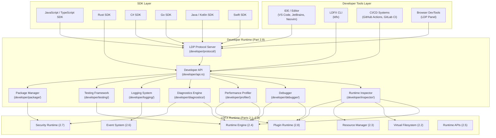

### 2.2 Component Responsibilities

**Developer API (`developer/api.rs`)**
The single entry point for all developer operations. Owns the `DeveloperRuntime` struct. Receives requests from the LDP protocol server and from direct Rust callers (CLI, tests). Dispatches to the appropriate subsystem. Enforces developer-mode gating — all operations return `DeveloperModeDisabled` when the runtime is not in developer mode.

**LDP Protocol Server (`developer/protocol/`)**
Implements the LDFX Developer Protocol. Listens on a Unix domain socket (Linux/macOS) or named pipe (Windows). Accepts connections from IDEs, browser DevTools panels, and SDK clients. Serialises/deserialises LDP messages (JSON over a length-prefixed framing). Multiplexes multiple concurrent client connections. Handles client authentication (developer token, configurable).

**Runtime Inspector (`developer/inspector/`)**
Provides read-only views into every runtime subsystem. Queries subsystem state on demand and streams live updates via subscriptions. Never modifies runtime state. Subsystem-specific viewers are implemented as sub-modules.

**Debugger (`developer/debugger/`)**
Implements breakpoint management, execution stepping, variable inspection, and call stack capture for both document logic and plugin WASM code. Communicates with the WASM sandbox via the wasmtime debugging interface. Pauses and resumes plugin execution without affecting other plugins.

**Performance Profiler (`developer/profiler/`)**
Instruments runtime subsystems with sampling and tracing probes. Collects CPU time, memory allocations, I/O operations, and event latencies. Produces profiles in the LDFX Profile Format (LPF), which is compatible with the Chromium trace format for visualisation in existing tools.

**Diagnostics Engine (`developer/diagnostics/`)**
Continuously monitors runtime health. Detects anomalies, validates invariants, and generates structured recommendations. Integrates with the crash reporting system from Part 2.8. Produces a `DiagnosticsReport` on demand.

**Logging System (`developer/logging/`)**
Aggregates structured log events from all runtime subsystems. Provides filtering, search, rotation, and export. Exposes a live log stream to connected clients. Implements the `host_log` API used by plugins (Part 2.8 Section 13.2).

**Testing Framework (`developer/testing/`)**
Provides a test runner, test fixture management, assertion library, snapshot engine, and coverage collector. Integrates with `cargo test` and external CI systems. Supports all test types defined in Section 10.

**Package Manager (`developer/package/`)**
Manages SDK distribution, plugin packaging, signing, registry interaction, and dependency resolution for developer workflows. Distinct from the Plugin Runtime's install-time package management — this is the authoring-time package manager.

### 2.3 Lifecycle

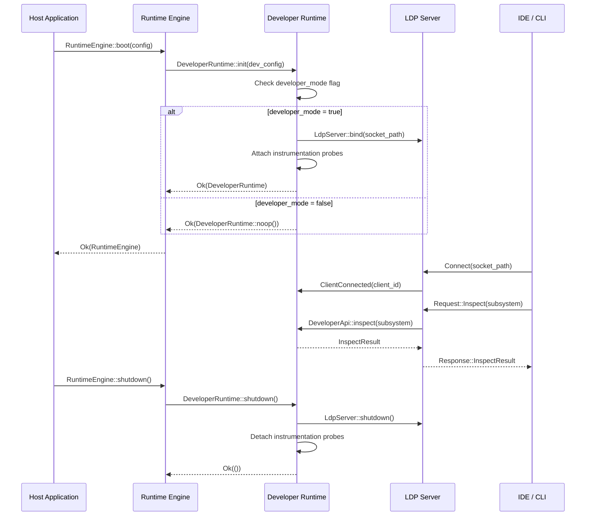

### 2.4 Communication Model

All inter-component communication within the Developer Runtime uses Rust async channels (Tokio). No component blocks on another. The LDP protocol server is the only component that communicates with external processes.

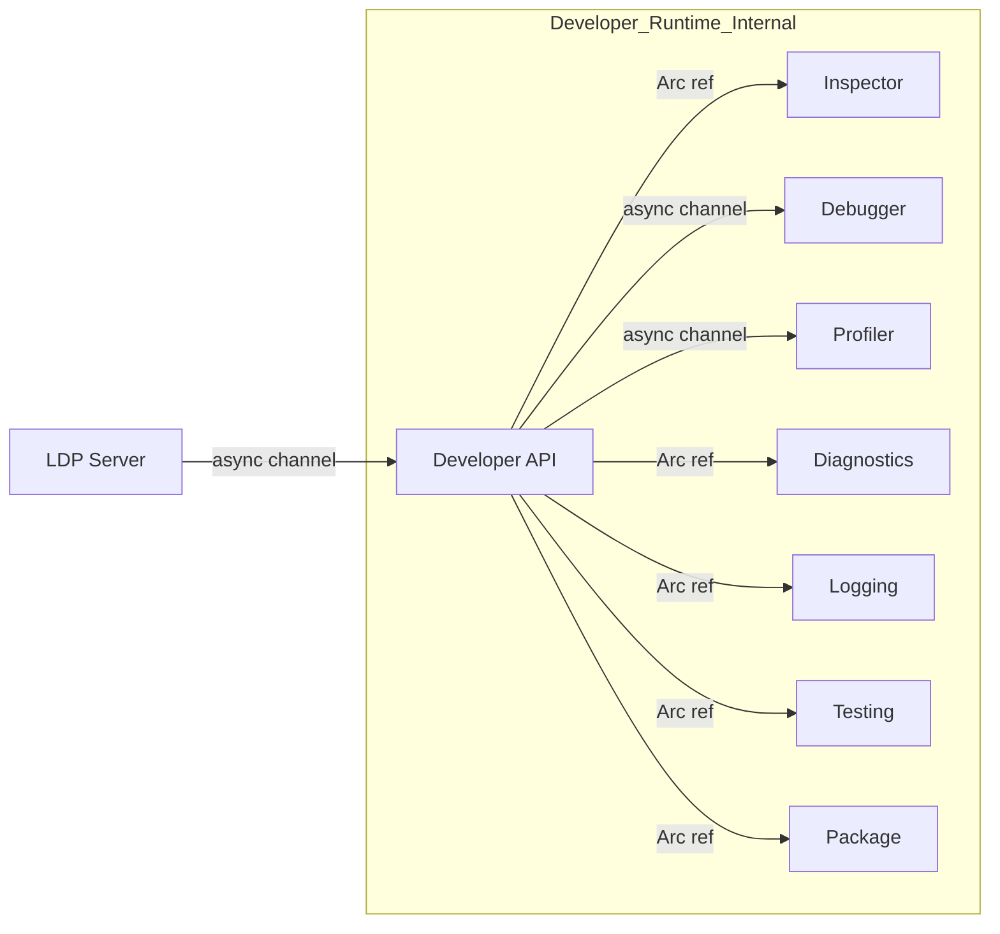

### 2.5 Developer Mode Gating

The Developer Runtime has two operating modes:

**Production mode** (`developer_mode: false`): The `DeveloperRuntime` struct is a zero-cost no-op. All method calls return immediately. No instrumentation probes are attached. No LDP server is started. Binary size impact is zero when the `developer` Cargo feature is disabled.

**Developer mode** (`developer_mode: true`): Full instrumentation is active. The LDP server listens for connections. All subsystems emit structured events to the Developer Runtime. Performance overhead is bounded: < 2% CPU overhead for instrumentation probes, < 50 MiB additional memory for the full Developer Runtime with all subsystems active.

### 2.6 Ownership and Dependencies

| Component | Owns | Depends On |
|---|---|---|
| `DeveloperRuntime` | All developer subsystems | `Arc<RuntimeEngine>` |
| `LdpServer` | Client connections, message framing | `DeveloperApi` |
| `RuntimeInspector` | Subsystem view cache | `Arc<RuntimeEngine>`, `Arc<PluginRuntime>`, `Arc<VirtualFilesystem>` |
| `Debugger` | Breakpoint registry, execution state | `Arc<PluginRuntime>`, wasmtime debug interface |
| `Profiler` | Probe registry, profile buffers | `Arc<RuntimeEngine>`, `Arc<PluginRuntime>` |
| `DiagnosticsEngine` | Health state, recommendation queue | All runtime `Arc` refs |
| `LoggingSystem` | Log ring buffer, rotation state | `Arc<EventBus>` |
| `TestingFramework` | Test registry, fixture store | `Arc<RuntimeEngine>` |
| `PackageManager` | Registry cache, signing state | `Arc<SecurityRuntime>` |

---

## 3. SDK Architecture

### 3.1 SDK Design Principles

The LDFX SDK is the primary interface through which developers interact with the LDFX platform. Every SDK, regardless of language, exposes the same capability surface. The following principles govern all SDK implementations:

**Principle 1 — Parity**: Every capability available in the Rust SDK is available in every other SDK. No language binding is a second-class citizen.

**Principle 2 — Idiomatic**: Each SDK uses the conventions, patterns, and tooling of its target language. The TypeScript SDK uses Promises and decorators. The Rust SDK uses async/await and Result. The Go SDK uses goroutines and error returns. No SDK forces foreign idioms onto its users.

**Principle 3 — Versioned independently**: Each SDK has its own semantic version. SDK versions are aligned to LDFX runtime versions via a compatibility matrix. A developer can pin their SDK version independently of the runtime version.

**Principle 4 — Generated from a single source**: All SDK types, method signatures, and documentation are generated from the LDFX Interface Definition Language (LIDL) schema. LIDL is a subset of Protocol Buffers IDL extended with LDFX-specific annotations. This guarantees that all SDKs are always in sync with the runtime API surface.

**Principle 5 — Offline-capable**: All SDK packages are self-contained. They do not require network access at runtime. Type definitions, documentation, and examples are bundled with the package.

### 3.2 SDK Architecture Overview

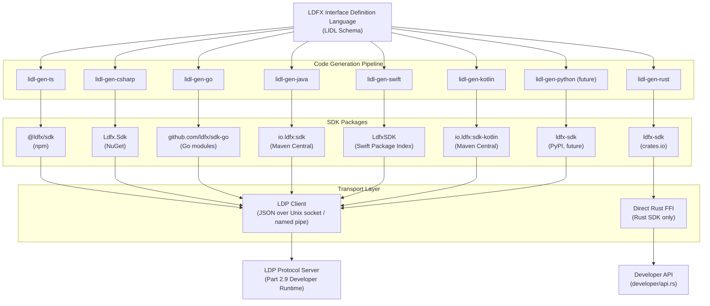

### 3.3 JavaScript / TypeScript SDK

**Package**: `@ldfx/sdk` (npm)
**Runtime targets**: Node.js ≥ 18, Deno ≥ 1.38, Bun ≥ 1.0, Browser (via WebSocket transport)

**Module organisation**:
```
@ldfx/sdk/
├── index.ts              # Top-level re-exports
├── client.ts             # LdfxClient — connection management
├── document.ts           # DocumentHandle — open, close, inspect
├── plugin.ts             # PluginHandle — install, enable, inspect
├── inspector.ts          # RuntimeInspector — all viewer types
├── debugger.ts           # Debugger — breakpoints, stepping
├── profiler.ts           # Profiler — start, stop, export
├── diagnostics.ts        # DiagnosticsEngine — report, watch
├── logging.ts            # LogStream — subscribe, filter, export
├── testing.ts            # TestRunner — define, run, assert
├── package.ts            # PackageManager — build, sign, publish
├── events.ts             # EventInspector — subscribe, replay
├── types/                # All generated LIDL types
│   ├── manifest.ts
│   ├── plugin.ts
│   ├── metrics.ts
│   └── errors.ts
└── transport/
    ├── unix-socket.ts    # Node.js / Deno transport
    ├── named-pipe.ts     # Windows transport
    └── websocket.ts      # Browser transport (future)
```

**Connection example (pseudocode)**:
```typescript
const client = await LdfxClient.connect({ socketPath: '/tmp/ldfx-dev.sock' });
const inspector = client.inspector();
const plugins = await inspector.plugins.list();
await client.disconnect();
```

**TypeScript-specific features**:
- Full generic type inference on all API responses
- Discriminated union types for all error variants
- AsyncIterator support for all streaming APIs (log streams, event streams, metric streams)
- Decorator-based test definition (`@LdfxTest`, `@LdfxBenchmark`)
- ESM-first with CommonJS compatibility shim

### 3.4 Rust SDK

**Package**: `ldfx-sdk` (crates.io)
**Minimum Rust version**: 1.75.0 (MSRV)

The Rust SDK is the only SDK that communicates with the Developer Runtime via direct function calls rather than the LDP protocol. It links directly against `ldfx-core` and calls `DeveloperApi` methods without serialisation overhead.

**Crate organisation**:
```
ldfx-sdk/
├── src/
│   ├── lib.rs            # Re-exports, feature flags
│   ├── client.rs         # LdfxDevClient — wraps Arc<DeveloperRuntime>
│   ├── document.rs       # DocumentHandle
│   ├── plugin.rs         # PluginHandle
│   ├── inspector.rs      # RuntimeInspector
│   ├── debugger.rs       # Debugger
│   ├── profiler.rs       # Profiler
│   ├── diagnostics.rs    # DiagnosticsEngine
│   ├── logging.rs        # LogStream
│   ├── testing.rs        # TestRunner, assert macros
│   ├── package.rs        # PackageManager
│   └── error.rs          # LdfxSdkError
├── Cargo.toml
└── examples/
    ├── inspect_plugins.rs
    ├── run_tests.rs
    └── profile_document.rs
```

**Rust-specific features**:
- Zero-copy access to runtime state via `Arc` references
- `async_trait`-based extension points for custom test runners
- `#[ldfx_test]` proc-macro for test definition
- `#[ldfx_benchmark]` proc-macro for benchmark definition
- `tracing` integration — all SDK operations emit `tracing` spans

### 3.5 C# SDK

**Package**: `Ldfx.Sdk` (NuGet)
**Target frameworks**: .NET 8+, .NET Standard 2.1

**Namespace organisation**:
```
Ldfx.Sdk/
├── LdfxClient.cs           # Connection management
├── Document/
│   └── DocumentHandle.cs
├── Plugin/
│   └── PluginHandle.cs
├── Inspector/
│   ├── RuntimeInspector.cs
│   └── PluginInspector.cs
├── Debugger/
│   └── LdfxDebugger.cs
├── Profiler/
│   └── LdfxProfiler.cs
├── Diagnostics/
│   └── DiagnosticsEngine.cs
├── Logging/
│   └── LogStream.cs
├── Testing/
│   ├── LdfxTestRunner.cs
│   └── LdfxAssert.cs
├── Package/
│   └── PackageManager.cs
└── Types/
    ├── PluginManifest.cs
    ├── PluginMetrics.cs
    └── LdfxError.cs
```

**C#-specific features**:
- `IAsyncEnumerable<T>` for all streaming APIs
- `CancellationToken` support on all async methods
- NUnit and xUnit test adapter for `LdfxTestRunner`
- Source generator for manifest validation at compile time

### 3.6 Go SDK

**Package**: `github.com/ldfx/sdk-go` (Go modules)
**Minimum Go version**: 1.21

**Package organisation**:
```
sdk-go/
├── client.go           # LdfxClient
├── document.go         # DocumentHandle
├── plugin.go           # PluginHandle
├── inspector.go        # RuntimeInspector
├── debugger.go         # Debugger
├── profiler.go         # Profiler
├── diagnostics.go      # DiagnosticsEngine
├── logging.go          # LogStream
├── testing.go          # TestRunner
├── package.go          # PackageManager
├── types/
│   ├── manifest.go
│   ├── metrics.go
│   └── errors.go
└── transport/
    ├── unix.go
    └── pipe.go
```

**Go-specific features**:
- Context-based cancellation on all blocking calls
- `iter.Seq` (Go 1.23+) for streaming APIs
- `testing.T` integration for `TestRunner`
- Structured errors implementing the `error` interface with `Unwrap()`

### 3.7 Java SDK

**Package**: `io.ldfx:sdk` (Maven Central)
**Minimum Java version**: 17

**Module organisation**:
```
io.ldfx.sdk/
├── LdfxClient.java
├── document/DocumentHandle.java
├── plugin/PluginHandle.java
├── inspector/RuntimeInspector.java
├── debugger/LdfxDebugger.java
├── profiler/LdfxProfiler.java
├── diagnostics/DiagnosticsEngine.java
├── logging/LogStream.java
├── testing/LdfxTestRunner.java
├── package_/PackageManager.java
└── types/
    ├── PluginManifest.java
    ├── PluginMetrics.java
    └── LdfxException.java
```

**Java-specific features**:
- `CompletableFuture<T>` for all async operations
- `Flow.Publisher<T>` for streaming APIs
- JUnit 5 extension (`LdfxExtension`) for test integration
- Gradle and Maven plugin for CLI integration

### 3.8 Kotlin SDK

**Package**: `io.ldfx:sdk-kotlin` (Maven Central)
**Minimum Kotlin version**: 1.9

The Kotlin SDK wraps the Java SDK with idiomatic Kotlin extensions:
- Coroutine-based async (`suspend fun`)
- `Flow<T>` for streaming APIs
- Extension functions on all Java SDK types
- `@LdfxTest` annotation for Kotlin test DSL

### 3.9 Swift SDK

**Package**: `LdfxSDK` (Swift Package Index)
**Minimum Swift version**: 5.9
**Platforms**: macOS 13+, iOS 16+ (future)

**Module organisation**:
```
LdfxSDK/
├── Sources/LdfxSDK/
│   ├── LdfxClient.swift
│   ├── Document/DocumentHandle.swift
│   ├── Plugin/PluginHandle.swift
│   ├── Inspector/RuntimeInspector.swift
│   ├── Debugger/LdfxDebugger.swift
│   ├── Profiler/LdfxProfiler.swift
│   ├── Diagnostics/DiagnosticsEngine.swift
│   ├── Logging/LogStream.swift
│   ├── Testing/LdfxTestRunner.swift
│   ├── Package/PackageManager.swift
│   └── Types/
│       ├── PluginManifest.swift
│       └── LdfxError.swift
└── Package.swift
```

**Swift-specific features**:
- `async/await` and `AsyncStream<T>` for streaming APIs
- `@LdfxTest` macro for Swift Testing framework integration
- `Codable` conformance on all manifest and metrics types

### 3.10 SDK Versioning and Compatibility Matrix

SDK versions follow semantic versioning. The compatibility matrix defines which SDK versions are compatible with which runtime versions:

| Runtime Version | Min SDK Version | Max SDK Version | Notes |
|---|---|---|---|
| 2.x.x | 2.0.0 | 2.x.x | Full compatibility |
| 2.9.x | 2.9.0 | 2.x.x | Part 2.9 APIs available |
| 3.x.x (future) | 3.0.0 | 3.x.x | Breaking changes allowed |

SDK minor versions add new APIs without breaking existing ones. SDK patch versions fix bugs without changing the API surface. SDK major versions may introduce breaking changes and are always accompanied by a migration guide.

### 3.11 SDK Distribution

| SDK | Registry | Install Command |
|---|---|---|
| TypeScript | npm | `npm install @ldfx/sdk` |
| Rust | crates.io | `cargo add ldfx-sdk` |
| C# | NuGet | `dotnet add package Ldfx.Sdk` |
| Go | Go modules | `go get github.com/ldfx/sdk-go` |
| Java | Maven Central | `<dependency>io.ldfx:sdk</dependency>` |
| Kotlin | Maven Central | `implementation("io.ldfx:sdk-kotlin")` |
| Swift | SPM | `.package(url: "https://github.com/ldfx/sdk-swift")` |
| Python | PyPI (future) | `pip install ldfx-sdk` |

All SDKs are also available as offline archives from the LDFX release page for air-gapped environments.

---

## 4. CLI Architecture

### 4.1 CLI Design

The LDFX CLI (`ldfx`) is the primary command-line interface for all developer workflows. It is a single statically-linked binary with no runtime dependencies. It is built on top of the Rust SDK and communicates with a running LDFX runtime via the LDP protocol when needed, or operates entirely offline for build and packaging operations.

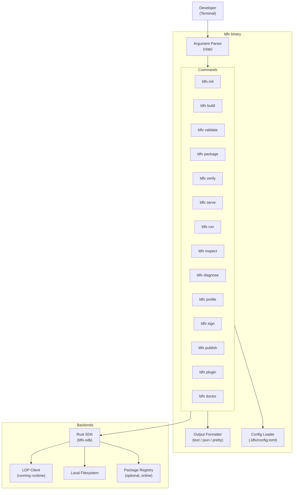

### 4.2 Global Flags

All commands accept the following global flags:

| Flag | Type | Default | Description |
|---|---|---|---|
| `--output` | `text\|json\|pretty` | `pretty` | Output format |
| `--config` | path | `.ldfx/config.toml` | Config file path |
| `--runtime-socket` | path | `/tmp/ldfx-dev.sock` | LDP socket path |
| `--no-color` | bool | false | Disable ANSI colour output |
| `--quiet` | bool | false | Suppress non-error output |
| `--verbose` | bool | false | Enable verbose logging |
| `--version` | — | — | Print CLI version and exit |

### 4.3 `ldfx init`

**Purpose**: Scaffold a new LDFX document or plugin project.

**Usage**: `ldfx init [OPTIONS] <NAME>`

**Arguments**:

| Argument | Type | Required | Description |
|---|---|---|---|
| `NAME` | string | yes | Project name (used as directory name and plugin ID base) |
| `--type` | `document\|plugin\|sdk-plugin` | no | Project type (default: `document`) |
| `--template` | string | no | Template name or path (default: `minimal`) |
| `--author` | string | no | Author name (pre-fills manifest) |
| `--id` | string | no | Explicit plugin/document ID (default: derived from NAME) |
| `--no-git` | bool | no | Skip `git init` |

**Output**: Creates project directory with:
- `manifest.json` — pre-filled manifest
- `src/` — source directory with entry point
- `.ldfx/config.toml` — project configuration
- `README.md` — project readme
- `.gitignore` — standard LDFX gitignore

**Errors**:
- `DirectoryExists` — target directory already exists
- `InvalidName` — name contains invalid characters
- `TemplateNotFound` — specified template does not exist

**Example**:
```
ldfx init my-plugin --type plugin --author "Jane Smith"
✓ Created my-plugin/
✓ Manifest: my-plugin/manifest.json
✓ Entry point: my-plugin/src/lib.rs
✓ Config: my-plugin/.ldfx/config.toml
✓ Git repository initialised
```

### 4.4 `ldfx build`

**Purpose**: Compile the project's source code and produce a build artifact.

**Usage**: `ldfx build [OPTIONS]`

**Arguments**:

| Argument | Type | Default | Description |
|---|---|---|---|
| `--release` | bool | false | Build in release mode (optimised) |
| `--target` | string | host | Target triple (e.g. `wasm32-wasi`) |
| `--manifest` | path | `manifest.json` | Manifest file path |
| `--out-dir` | path | `build/` | Output directory |
| `--features` | string[] | [] | Cargo features to enable |

**Output**: Compiled WASM module (for plugins) or processed document bundle in `build/`.

**Errors**:
- `CompilationFailed` — compiler errors with full output
- `ManifestInvalid` — manifest validation failed before build
- `MissingToolchain` — required compiler not found (with install instructions)

**Permissions**: Reads source files, writes to `--out-dir`. No network access unless dependencies need fetching.

### 4.5 `ldfx validate`

**Purpose**: Validate a manifest, bundle, or document against the LDFX specification.

**Usage**: `ldfx validate [OPTIONS] <PATH>`

**Arguments**:

| Argument | Type | Required | Description |
|---|---|---|---|
| `PATH` | path | yes | Path to manifest, bundle, or document |
| `--strict` | bool | no | Treat warnings as errors |
| `--schema-version` | string | no | Validate against specific schema version |
| `--check-signatures` | bool | no | Verify cryptographic signatures |
| `--check-integrity` | bool | no | Verify file integrity hashes |

**Output**: Structured validation report listing all errors and warnings with line numbers and fix suggestions.

**Errors**:
- `ValidationFailed` — one or more validation errors found
- `FileNotFound` — specified path does not exist
- `UnsupportedFormat` — file format not recognised

### 4.6 `ldfx package`

**Purpose**: Package a built artifact into a distributable `.ldfxplugin` or `.ldfx` bundle.

**Usage**: `ldfx package [OPTIONS]`

**Arguments**:

| Argument | Type | Default | Description |
|---|---|---|---|
| `--manifest` | path | `manifest.json` | Manifest file |
| `--build-dir` | path | `build/` | Directory containing build artifacts |
| `--out` | path | `dist/` | Output directory |
| `--sign` | bool | false | Sign the bundle after packaging |
| `--key` | path | — | Signing key path (required if `--sign`) |
| `--cert` | path | — | Certificate path (required if `--sign`) |
| `--compress` | `none\|zstd\|deflate` | `zstd` | Compression algorithm |

**Output**: `.ldfxplugin` or `.ldfx` bundle in `--out` directory.

**Errors**:
- `BuildArtifactMissing` — `--build-dir` does not contain expected artifacts
- `SigningFailed` — key/cert invalid or signing operation failed
- `ManifestInvalid` — manifest fails validation before packaging

### 4.7 `ldfx verify`

**Purpose**: Verify the signature and integrity of a packaged bundle.

**Usage**: `ldfx verify [OPTIONS] <BUNDLE>`

**Arguments**:

| Argument | Type | Required | Description |
|---|---|---|---|
| `BUNDLE` | path | yes | Path to `.ldfxplugin` or `.ldfx` bundle |
| `--trust-anchor` | path | no | Custom CA certificate for verification |
| `--check-revocation` | bool | no | Check certificate revocation (requires network) |

**Output**: Verification report — signature status, certificate chain, integrity results per file.

**Errors**:
- `SignatureInvalid` — signature does not match manifest
- `IntegrityFailed` — one or more file hashes do not match
- `CertificateExpired` — signing certificate has expired
- `UntrustedIssuer` — certificate chain does not lead to a trusted anchor

### 4.8 `ldfx serve`

**Purpose**: Start a local development server that serves a document and enables live reload.

**Usage**: `ldfx serve [OPTIONS] <DOCUMENT>`

**Arguments**:

| Argument | Type | Default | Description |
|---|---|---|---|
| `DOCUMENT` | path | yes | Path to `.ldfx` document |
| `--port` | u16 | 7400 | HTTP port for the development server |
| `--dev-socket` | path | `/tmp/ldfx-dev.sock` | LDP socket path |
| `--watch` | bool | true | Watch for file changes and reload |
| `--open` | bool | false | Open in default browser on start |

**Output**: Development server running at `http://localhost:<port>`. LDP server listening at `--dev-socket`.

**Errors**:
- `PortInUse` — specified port is already bound
- `DocumentInvalid` — document fails validation before serving

### 4.9 `ldfx run`

**Purpose**: Execute a document in the LDFX runtime without a development server.

**Usage**: `ldfx run [OPTIONS] <DOCUMENT>`

**Arguments**:

| Argument | Type | Default | Description |
|---|---|---|---|
| `DOCUMENT` | path | yes | Path to `.ldfx` document |
| `--dev` | bool | false | Enable developer mode (starts LDP server) |
| `--dev-socket` | path | `/tmp/ldfx-dev.sock` | LDP socket path |
| `--timeout` | duration | none | Maximum run duration |
| `--env` | key=value[] | [] | Environment variables passed to the runtime |

### 4.10 `ldfx inspect`

**Purpose**: Connect to a running LDFX runtime and inspect its state.

**Usage**: `ldfx inspect [OPTIONS] <SUBSYSTEM>`

**Arguments**:

| Argument | Type | Required | Description |
|---|---|---|---|
| `SUBSYSTEM` | `runtime\|plugins\|events\|memory\|storage\|security\|resources\|vfs` | yes | Subsystem to inspect |
| `--plugin` | PluginId | no | Filter to a specific plugin |
| `--watch` | bool | no | Stream live updates |
| `--format` | `table\|json\|tree` | no | Output format override |

**Output**: Structured view of the requested subsystem state. With `--watch`, streams updates until Ctrl+C.

**Errors**:
- `RuntimeNotRunning` — no LDP server found at socket path
- `SubsystemUnavailable` — requested subsystem not active

### 4.11 `ldfx diagnose`

**Purpose**: Run the Diagnostics Engine against a running or stopped runtime and produce a report.

**Usage**: `ldfx diagnose [OPTIONS]`

**Arguments**:

| Argument | Type | Default | Description |
|---|---|---|---|
| `--runtime-socket` | path | `/tmp/ldfx-dev.sock` | LDP socket (live runtime) |
| `--crash-dir` | path | — | Directory of crash reports (offline analysis) |
| `--out` | path | `diagnostics-report.json` | Output report path |
| `--severity` | `info\|warn\|error` | `warn` | Minimum severity to include |

**Output**: `DiagnosticsReport` JSON file with all findings, recommendations, and severity ratings.

### 4.12 `ldfx profile`

**Purpose**: Start or stop profiling a running LDFX runtime and export the profile.

**Usage**: `ldfx profile <SUBCOMMAND>`

**Subcommands**:

| Subcommand | Description |
|---|---|
| `start` | Begin profiling the connected runtime |
| `stop` | Stop profiling and export the profile |
| `report` | Generate a human-readable report from a profile file |
| `flamegraph` | Generate an SVG flamegraph from a profile file |

**Arguments for `start`**:

| Argument | Type | Default | Description |
|---|---|---|---|
| `--mode` | `cpu\|memory\|io\|all` | `all` | Profiling mode |
| `--sample-rate` | u32 | 1000 | Samples per second (CPU profiling) |
| `--plugin` | PluginId | — | Profile a specific plugin only |

**Output**: Profile file in LDFX Profile Format (LPF), compatible with Chromium trace viewer.

### 4.13 `ldfx sign`

**Purpose**: Sign a bundle with a developer or enterprise certificate.

**Usage**: `ldfx sign [OPTIONS] <BUNDLE>`

**Arguments**:

| Argument | Type | Required | Description |
|---|---|---|---|
| `BUNDLE` | path | yes | Bundle to sign |
| `--key` | path | yes | Private key (PEM) |
| `--cert` | path | yes | Certificate (PEM) |
| `--chain` | path | no | Intermediate certificate chain (PEM) |
| `--out` | path | no | Output path (default: overwrite input) |
| `--timestamp` | bool | true | Include RFC 3161 timestamp |

**Errors**:
- `KeyNotFound` — key file does not exist
- `CertNotFound` — certificate file does not exist
- `KeyCertMismatch` — key and certificate do not correspond
- `BundleAlreadySigned` — bundle already has a valid signature (use `--force` to re-sign)

### 4.14 `ldfx publish`

**Purpose**: Publish a signed bundle to the LDFX marketplace or a private registry.

**Usage**: `ldfx publish [OPTIONS] <BUNDLE>`

**Arguments**:

| Argument | Type | Default | Description |
|---|---|---|---|
| `BUNDLE` | path | yes | Signed bundle to publish |
| `--registry` | URL | marketplace URL | Target registry |
| `--token` | string | `$LDFX_TOKEN` | Authentication token |
| `--dry-run` | bool | false | Validate without uploading |
| `--visibility` | `public\|private\|unlisted` | `public` | Visibility setting |

**Errors**:
- `NotSigned` — bundle is not signed
- `AuthenticationFailed` — invalid or expired token
- `VersionAlreadyExists` — this version is already published
- `PolicyViolation` — bundle fails registry policy checks

### 4.15 `ldfx plugin`

**Purpose**: Manage plugins in a running LDFX runtime.

**Usage**: `ldfx plugin <SUBCOMMAND>`

**Subcommands**:

| Subcommand | Description |
|---|---|
| `list` | List all installed plugins and their states |
| `install <BUNDLE>` | Install a plugin bundle |
| `uninstall <ID>` | Uninstall a plugin |
| `enable <ID>` | Enable a disabled plugin |
| `disable <ID>` | Disable a running plugin |
| `reload <ID>` | Hot-reload a plugin |
| `info <ID>` | Show full plugin details |
| `logs <ID>` | Stream plugin logs |
| `permissions <ID>` | Show plugin permission grants |

### 4.16 `ldfx doctor`

**Purpose**: Check the developer environment for common configuration problems and missing dependencies.

**Usage**: `ldfx doctor [OPTIONS]`

**Checks performed**:

| Check | Pass Condition |
|---|---|
| Rust toolchain | `rustc` ≥ MSRV present |
| WASM target | `wasm32-wasi` target installed |
| `wasm-opt` | Present in PATH |
| Signing tools | `openssl` or platform keychain accessible |
| LDP socket | Writable socket path available |
| Config file | `.ldfx/config.toml` valid if present |
| Registry connectivity | Registry reachable (skipped if `--offline`) |
| Certificate validity | Developer certificate not expired |

**Output**: Colour-coded checklist. Each failing check includes a specific fix command.

```
ldfx doctor
✓ Rust toolchain: rustc 1.78.0
✓ WASM target: wasm32-wasi installed
✗ wasm-opt: not found
  Fix: cargo install wasm-opt
✓ LDP socket path: /tmp/ldfx-dev.sock (writable)
✓ Config: .ldfx/config.toml valid
⚠ Registry: unreachable (offline mode active)
✓ Certificate: valid until 2026-01-01
```

---

## 5. Runtime Inspector

### 5.1 Overview

The Runtime Inspector provides real-time, read-only visibility into every subsystem of the LDFX runtime. It is the primary tool for understanding what a running document or plugin is doing at any given moment. The Inspector never modifies runtime state — it is a pure observation layer.

```mermaid
graph TD
    subgraph Runtime_Inspector["Runtime Inspector"]
        InspectorAPI["InspectorApi\n(inspector/mod.rs)"]

        subgraph Viewers["Subsystem Viewers"]
            DocViewer["Document Inspector"]
            ManifestViewer["Manifest Viewer"]
            ResourceViewer["Resource Viewer"]
            PluginViewer["Plugin Viewer"]
            MemoryViewer["Memory Viewer"]
            StorageViewer["Storage Viewer"]
            SecurityViewer["Security Viewer"]
            PerfViewer["Performance Viewer"]
            EventViewer["Event Viewer"]
            ApiExplorer["API Explorer"]
            StateViewer["State Viewer"]
            DepViewer["Dependency Viewer"]
            VfsViewer["VFS Viewer"]
        end
    end

    subgraph Runtime_Subsystems["Runtime Subsystems"]
        RE["Runtime Engine"]
        VFS["Virtual Filesystem"]
        RM["Resource Manager"]
        ES["Event System"]
        SR["Security Runtime"]
        PR["Plugin Runtime"]
    end

    InspectorAPI --> DocViewer
    InspectorAPI --> ManifestViewer
    InspectorAPI --> ResourceViewer
    InspectorAPI --> PluginViewer
    InspectorAPI --> MemoryViewer
    InspectorAPI --> StorageViewer
    InspectorAPI --> SecurityViewer
    InspectorAPI --> PerfViewer
    InspectorAPI --> EventViewer
    InspectorAPI --> ApiExplorer
    InspectorAPI --> StateViewer
    InspectorAPI --> DepViewer
    InspectorAPI --> VfsViewer

    DocViewer --> RE
    ManifestViewer --> RE
    ResourceViewer --> RM
    PluginViewer --> PR
    MemoryViewer --> PR
    MemoryViewer --> RM
    StorageViewer --> PR
    SecurityViewer --> SR
    PerfViewer --> RE
    PerfViewer --> PR
    EventViewer --> ES
    ApiExplorer --> RE
    StateViewer --> RE
    DepViewer --> PR
    VfsViewer --> VFS
```

### 5.2 Document Inspector

The Document Inspector provides a live view of the currently loaded document's structure and execution state.

**Data exposed**:
- Document ID, title, schema version, manifest summary
- Current execution state (Idle, Running, Paused, Error)
- Active page index and page count
- Document-level resource usage (memory, open file handles)
- Loaded plugin list with states
- Document-scoped event subscriptions
- Last 100 runtime errors with timestamps

**Subscription model**: Clients may subscribe to `document.state_changed` events to receive push updates whenever the document state changes, without polling.

### 5.3 Manifest Viewer

The Manifest Viewer renders the full parsed `PluginManifest` or document manifest in a structured, navigable format.

**Data exposed**:
- All manifest fields with their parsed types (not raw JSON)
- Validation status of each field
- Computed values (e.g. resolved dependency versions)
- Schema version and compatibility status
- Signature status (valid / invalid / unsigned)
- Integrity status per file

**Diff mode**: When a plugin is hot-reloaded, the Manifest Viewer can show a diff between the old and new manifest, highlighting changed fields.

### 5.4 Resource Viewer

The Resource Viewer exposes the Resource Manager's (Part 2.3) current allocation state.

**Data exposed**:
- All loaded resources with type, path, size, and reference count
- Resource loading state (Pending, Loading, Loaded, Failed, Evicted)
- Cache hit/miss ratio
- Total resource memory usage
- Per-plugin resource usage breakdown
- Resource dependency graph (which resources depend on which)
- Eviction history (last 50 evictions with reason)

**Live updates**: Resource load and eviction events are streamed in real time.

### 5.5 Plugin Viewer

The Plugin Viewer is the most detailed subsystem viewer. It exposes the full state of every plugin managed by the Plugin Runtime (Part 2.8).

**Data exposed per plugin**:
- Plugin ID, version, type, trust level
- Current lifecycle state with transition history
- WASM heap usage vs budget
- Host-side memory usage
- CPU time (cumulative and per-second)
- Event queue depth
- Active IPC channels
- Permission grants and denials
- Crash history with crash reports
- Load strategy and load time

**Plugin detail view**: Selecting a plugin shows its full `PluginManifest`, current `PluginMetrics`, and a timeline of state transitions since load.

### 5.6 Memory Viewer

The Memory Viewer provides a breakdown of all memory usage within the LDFX runtime process.

**Data exposed**:
- Total process memory (RSS, virtual)
- Runtime Engine heap usage
- Per-plugin WASM heap usage (bar chart)
- Per-plugin host-side memory usage
- Resource Manager cache size
- Event Bus queue memory
- Developer Runtime overhead
- Memory budget utilisation per plugin (used / default / max)

**Allocation timeline**: A rolling 60-second timeline of total memory usage, updated every 1 second.

**Memory pressure events**: When any plugin exceeds 80% of its memory budget, the Memory Viewer highlights it in amber. At 100%, it highlights in red.

### 5.7 Storage Viewer

The Storage Viewer exposes the plugin-scoped key-value storage managed by the Plugin Runtime.

**Data exposed**:
- Per-plugin storage namespace listing
- Key count and total storage size per plugin
- Individual key-value pairs (values shown as JSON or hex for binary data)
- Storage access log (last 100 reads/writes per plugin)

**Security note**: The Storage Viewer requires `developer_mode: true` and the connecting client must present a valid developer token. Storage contents are never exposed in production mode.

### 5.8 Security Viewer

The Security Viewer exposes the Security Runtime's (Part 2.7) current state.

**Data exposed**:
- Trust store contents (trusted CAs, their subjects and expiry dates)
- Per-plugin trust level assignments
- Permission grant/deny audit log (last 1000 entries)
- Certificate revocation list status
- Active security policies
- Recent security events (permission denials, trust revocations, signature failures)

**Audit log format**:
```
[2024-01-15 10:23:45.123] DENY  com.example.plugin  capability=vfs:write:documents/**
[2024-01-15 10:23:46.001] GRANT com.example.plugin  capability=events:subscribe:document.*
```

### 5.9 Performance Viewer

The Performance Viewer provides a live performance dashboard without requiring the full Profiler to be active.

**Data exposed**:
- Runtime Engine tick rate (ticks/second)
- Event Bus throughput (events/second)
- Per-plugin CPU time percentage
- API call rate (calls/second, per API)
- IPC message rate
- Resource load queue depth
- Top 10 slowest API calls (rolling 60 seconds)
- Top 10 most CPU-intensive plugins (rolling 60 seconds)

### 5.10 Event Viewer

The Event Viewer provides a live stream of all events flowing through the Event Bus (Part 2.6).

**Data exposed**:
- Live event stream with event type, source, target, payload size, and delivery latency
- Event subscription map (which plugins subscribe to which event types)
- Event queue depths per plugin
- Dropped event count and reasons
- Event throughput timeline

**Filtering**: Events can be filtered by type, source plugin, target plugin, or payload content (JSONPath expression).

**Replay**: The Event Viewer can replay the last N events from the Event Bus's append-only log, allowing developers to reconstruct the sequence of events that led to a bug.

### 5.11 API Explorer

The API Explorer provides a live view of all Runtime API (Part 2.5) calls being made.

**Data exposed**:
- Live API call stream with caller plugin, API name, arguments (redacted if sensitive), result, and duration
- Per-API call rate and error rate
- Slowest API calls (p50, p95, p99 latencies)
- API call history per plugin (last 500 calls)

**Interactive mode**: In interactive mode, the API Explorer allows the developer to manually invoke any Runtime API with custom arguments and inspect the result. This is gated behind `developer_mode: true` and requires explicit confirmation for state-mutating APIs.

### 5.12 State Viewer

The State Viewer provides a snapshot of the Runtime Engine's (Part 2.4) internal state machine.

**Data exposed**:
- Current runtime state (Booting, Running, Paused, ShuttingDown, Error)
- State transition history with timestamps
- Active document execution context
- Pending operations queue
- Scheduled tasks (lazy plugin loads, background operations)

### 5.13 Dependency Viewer

The Dependency Viewer renders the plugin dependency graph resolved by the Dependency Resolver (Part 2.8 Section 7).

**Data exposed**:
- Full dependency DAG as an interactive graph
- Load order (topological sort result)
- Version constraints per dependency edge
- Shared library instances
- Unresolved or conflicting dependencies (highlighted)

**Mermaid output**: The Dependency Viewer can export the current dependency graph as a Mermaid `graph TD` diagram for inclusion in documentation.

### 5.14 VFS Viewer

The VFS Viewer exposes the Virtual Filesystem's (Part 2.2) current mount state.

**Data exposed**:
- Full VFS tree (directories and files)
- Per-file metadata (size, content type, last modified)
- Open file handles with owning plugin
- VFS access log (last 200 operations)
- Per-plugin VFS access permissions (allowed read/write globs)

---

## 6. Debugger

### 6.1 Debugger Architecture

The LDFX Debugger provides source-level debugging for plugin WASM code and document logic. It integrates with the wasmtime debugging interface and exposes a DAP-compatible (Debug Adapter Protocol) interface for IDE integration.

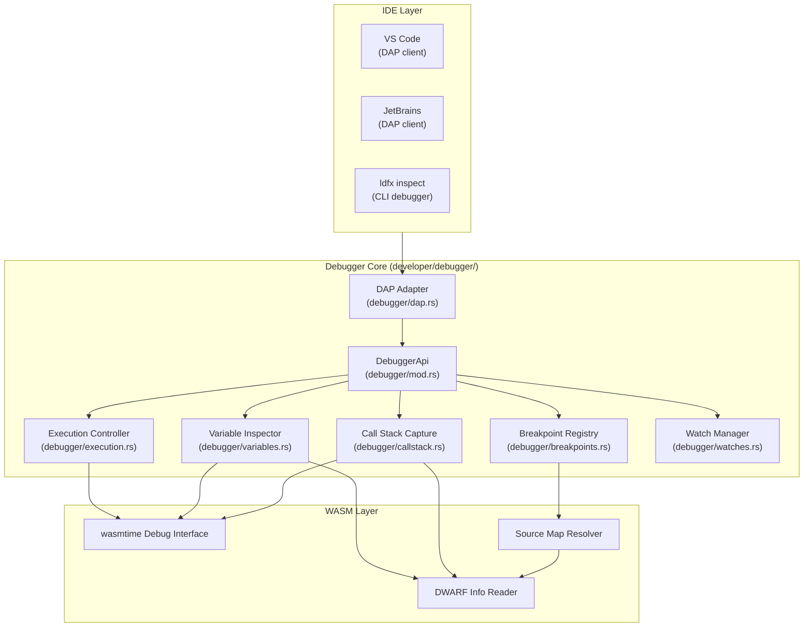

### 6.2 Breakpoints

The Debugger supports four types of breakpoints:

**Line breakpoints**: Pause execution when a specific source line is reached. Requires DWARF debug information in the WASM module (present in debug builds, stripped in release builds).

```
BreakpointSpec::Line {
    plugin_id:   PluginId,
    source_file: String,      // relative path within plugin source
    line:        u32,
    column:      Option<u32>,
}
```

**Function breakpoints**: Pause execution at the entry of a named function.

```
BreakpointSpec::Function {
    plugin_id:     PluginId,
    function_name: String,    // demangled Rust/C function name
}
```

**Conditional breakpoints**: Pause execution only when a boolean expression evaluates to true. The expression is evaluated in the context of the paused WASM frame.

```
BreakpointSpec::Conditional {
    base:       Box<BreakpointSpec>,   // Line or Function
    condition:  String,                // expression, e.g. "x > 10 && y == 0"
}
```

**Exception breakpoints**: Pause execution when a WASM trap or Rust panic occurs, before the crash handler runs.

```
BreakpointSpec::Exception {
    plugin_id:  Option<PluginId>,  // None = all plugins
    trap_types: Vec<WasmTrapCode>, // empty = all traps
}
```

### 6.3 Breakpoint Lifecycle

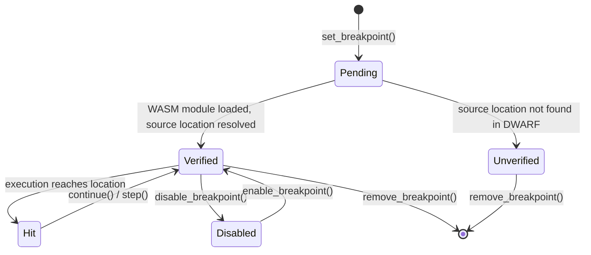

### 6.4 Execution Control

When a breakpoint is hit, the plugin's WASM execution is paused. The Execution Controller provides the following stepping operations:

| Operation | Description | Behaviour |
|---|---|---|
| `continue()` | Resume execution until next breakpoint | Resumes WASM execution |
| `step_over()` | Execute current line, pause at next line | Steps over function calls |
| `step_into()` | Step into the next function call | Descends into callees |
| `step_out()` | Run until current function returns | Ascends to caller |
| `run_to_cursor(line)` | Run until a specific line | Temporary breakpoint at target |
| `pause()` | Pause a running plugin | Interrupts at next safe point |

While a plugin is paused, all other plugins continue running normally. The paused plugin's event queue continues to accumulate events (up to `event_queue_depth`).

### 6.5 Variable Inspection

When execution is paused, the Variable Inspector reads the WASM linear memory and DWARF debug information to reconstruct local variables, function arguments, and global state.

**Supported types**:
- Primitive types: `i32`, `i64`, `f32`, `f64`, `bool`, `u8`–`u64`
- Rust types (via DWARF): `String`, `Vec<T>`, `HashMap<K,V>`, `Option<T>`, `Result<T,E>`, structs, enums
- Pointer types: shown as address + dereferenced value

**Variable scopes**:
- Local variables in the current stack frame
- Function arguments
- Captured variables (closures)
- Global WASM globals
- Plugin-scoped storage (read-only view)

### 6.6 Call Stack

The Call Stack Capture reads the WASM call stack and resolves each frame to a source location using DWARF information.

**Frame information**:
```
CallFrame {
    frame_index:   u32,
    function_name: String,       // demangled
    source_file:   String,
    line:          u32,
    column:        u32,
    locals:        Vec<Variable>,
    arguments:     Vec<Variable>,
}
```

The call stack is displayed from innermost (top) to outermost (bottom) frame. Frames without DWARF information are shown with their WASM function index and offset.

### 6.7 Watch Expressions

The Watch Manager evaluates expressions in the context of the paused WASM frame and returns their current values. Watches are re-evaluated automatically after each step.

**Expression syntax**: A subset of Rust expression syntax, evaluated against the current frame's variable scope:
- Variable references: `my_var`
- Field access: `my_struct.field`
- Index access: `my_vec[0]`
- Arithmetic: `x + y * 2`
- Comparison: `x > 10`
- Boolean: `a && b`

### 6.8 Thread Inspection

Each plugin WASM instance runs on a dedicated OS thread (Part 2.8 Section 15.5). The Thread Inspector shows:

- Thread ID and name per plugin
- Thread state (Running, Paused at breakpoint, Waiting for IPC, Waiting for event)
- Thread CPU time
- Stack size and usage

### 6.9 Plugin Debugging

Plugin debugging has additional capabilities beyond standard WASM debugging:

- **Host API call interception**: The debugger can pause execution immediately before or after any host API call, showing the arguments and return value.
- **Event delivery inspection**: When an event is delivered to a paused plugin, the debugger shows the full event payload before the handler is invoked.
- **IPC message inspection**: IPC messages sent or received by a paused plugin are shown with their full serialised content.
- **Permission check tracing**: Every permission check is logged with the capability requested and the result.

### 6.10 DAP Protocol Adapter

The Debugger exposes a Debug Adapter Protocol (DAP) server. IDEs that support DAP (VS Code, JetBrains, Neovim with nvim-dap) connect to this server and use their native debugging UI to debug LDFX plugins.

**DAP capabilities supported**:
- `setBreakpoints`, `setFunctionBreakpoints`, `setExceptionBreakpoints`
- `continue`, `next` (step over), `stepIn`, `stepOut`
- `stackTrace`, `scopes`, `variables`
- `evaluate` (watch expressions)
- `pause`, `threads`
- `configurationDone`, `disconnect`

**DAP server address**: `localhost:<dap_port>` (default port: 7401). Configured in `.ldfx/config.toml`.

---

## 7. Performance Profiler

### 7.1 Profiler Architecture

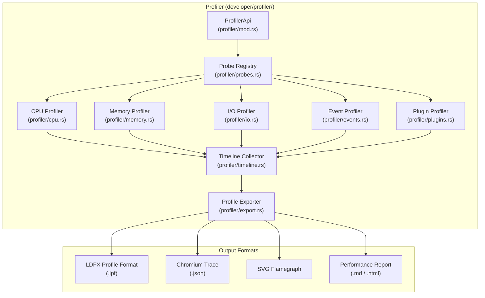

### 7.2 CPU Profiling

The CPU Profiler uses sampling-based profiling. At a configurable sample rate (default 1000 Hz), it captures the current call stack of each plugin's WASM execution thread and the runtime's Tokio thread pool.

**Sample data per capture**:
```
CpuSample {
    timestamp_ns:  u64,
    thread_id:     u64,
    plugin_id:     Option<PluginId>,
    call_stack:    Vec<FrameAddress>,   // resolved to symbols via DWARF
    cpu_time_ns:   u64,
}
```

**Flame graph generation**: CPU samples are aggregated into a call tree. The call tree is rendered as an SVG flame graph using the standard Brendan Gregg format. Each frame is coloured by subsystem (plugin code, runtime engine, event system, etc.).

**Startup profiling**: A special startup profile mode captures the full boot sequence from `RuntimeEngine::boot()` to the first `Running` state, showing exactly where boot time is spent.

### 7.3 Memory Profiling

The Memory Profiler tracks allocations and deallocations in both the WASM heap and the Rust host heap.

**WASM heap tracking**: Instruments the WASM `memory.grow` instruction to track heap growth events. Tracks the high-water mark per plugin.

**Host heap tracking**: Uses a custom Rust global allocator wrapper that records allocation site (via backtrace), size, and lifetime. Allocations are attributed to the plugin that caused them via thread-local context.

**Memory profile output**:
- Allocation timeline (heap size over time per plugin)
- Top 20 allocation sites by total bytes
- Memory leak candidates (allocations not freed after plugin unload)
- Heap fragmentation estimate

### 7.4 I/O Profiling

The I/O Profiler instruments all VFS operations and resource loads.

**Data captured per I/O operation**:
```
IoSample {
    timestamp_ns:  u64,
    plugin_id:     Option<PluginId>,
    operation:     IoOperation,   // Read, Write, Open, Close, Stat
    path:          VfsPath,
    bytes:         u64,
    duration_ns:   u64,
    result:        IoResult,
}
```

**I/O report**: Total bytes read/written per plugin, slowest I/O operations, I/O wait time as percentage of total execution time.

### 7.5 Event Profiling

The Event Profiler instruments the Event Bus to measure event delivery latency and throughput.

**Data captured**:
- Emit-to-delivery latency per event type (p50, p95, p99)
- Queue wait time per plugin
- Handler execution time per event type per plugin
- Dropped event count and reasons
- Event throughput (events/second) over time

### 7.6 Plugin Profiling

The Plugin Profiler aggregates all profiling data per plugin and produces a per-plugin performance summary:

```
PluginProfile {
    plugin_id:          PluginId,
    total_cpu_time_ms:  u64,
    cpu_percent:        f32,        // % of total runtime CPU
    peak_heap_bytes:    u64,
    avg_heap_bytes:     u64,
    total_io_bytes:     u64,
    total_io_ops:       u64,
    events_handled:     u64,
    avg_event_handler_us: u64,
    api_calls:          u64,
    avg_api_call_us:    u64,
    hottest_functions:  Vec<FunctionProfile>,
}
```

### 7.7 Timeline

The Timeline Collector assembles all profiling data into a unified timeline. The timeline uses the Chromium Trace Event Format, making it directly viewable in `chrome://tracing` or Perfetto UI.

**Timeline tracks**:
- Runtime Engine (boot, tick, shutdown)
- Per-plugin execution (running, paused, waiting)
- Event Bus (emit, queue, deliver)
- VFS (open, read, write, close)
- Resource Manager (load, cache hit, evict)
- Memory (heap growth events)

### 7.8 Performance Reports

The Profile Exporter generates human-readable performance reports in Markdown or HTML format. Reports include:

- Executive summary (total runtime, peak memory, top CPU consumers)
- Per-subsystem performance table
- Flame graph (embedded SVG)
- Top 10 performance recommendations (generated by the Diagnostics Engine)
- Comparison to previous profile (if a baseline profile is provided)

---

## 8. Logging System

### 8.1 Logging Architecture

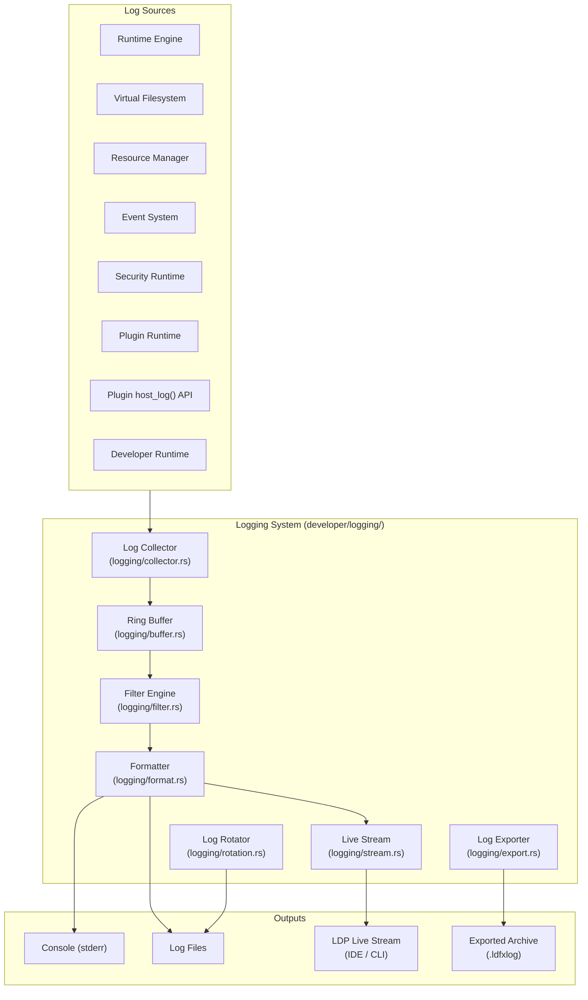

### 8.2 Log Levels

| Level | Value | Usage |
|---|---|---|
| `TRACE` | 0 | Extremely verbose internal state (disabled in production) |
| `DEBUG` | 1 | Detailed diagnostic information for developers |
| `INFO` | 2 | Normal operational events (plugin loaded, document opened) |
| `WARN` | 3 | Recoverable anomalies (permission denied, event dropped) |
| `ERROR` | 4 | Non-fatal errors (plugin crashed, resource load failed) |
| `FATAL` | 5 | Unrecoverable errors that will terminate the runtime |

The minimum log level is configurable per subsystem. Default in production: `INFO`. Default in developer mode: `DEBUG`.

### 8.3 Structured Log Event Schema

All log events are structured. Free-text messages are supplemented with typed key-value fields.

```
LogEvent {
    id:          u64,              // monotonically increasing
    timestamp:   Timestamp,        // nanosecond precision
    level:       LogLevel,
    subsystem:   String,           // e.g. "plugin_runtime.loader"
    plugin_id:   Option<PluginId>, // present for plugin-originated events
    message:     String,
    fields:      Map<String, LogValue>,
    trace_id:    Option<TraceId>,  // links to distributed trace span
    span_id:     Option<SpanId>,
}

enum LogValue {
    String(String),
    Int(i64),
    Float(f64),
    Bool(bool),
    Bytes(Vec<u8>),
    Json(serde_json::Value),
}
```

### 8.4 Runtime Logs

The Runtime Engine emits structured log events for all significant operations:

| Event | Level | Fields |
|---|---|---|
| Runtime boot started | INFO | `config_path`, `developer_mode` |
| Runtime boot completed | INFO | `boot_duration_ms`, `plugins_loaded` |
| Document opened | INFO | `document_id`, `page_count` |
| Document closed | INFO | `document_id`, `run_duration_ms` |
| Runtime shutdown | INFO | `shutdown_reason` |
| Tick rate degraded | WARN | `current_tps`, `target_tps` |
| Out of memory | ERROR | `subsystem`, `requested_bytes`, `available_bytes` |

### 8.5 Plugin Logs

Plugins emit log events via the `host_log(level, message, fields)` host API. These events are tagged with the plugin's `plugin_id` and routed through the same logging pipeline as runtime logs.

Plugin log events are subject to rate limiting: a plugin may emit at most 1000 log events per second. Events beyond this limit are dropped with a WARN log from the logging system itself.

### 8.6 Security Logs

The Security Runtime emits a dedicated security log stream. Security log events are always written to a separate security log file in addition to the main log, regardless of the configured log level.

| Event | Level | Fields |
|---|---|---|
| Signature verified | INFO | `plugin_id`, `cert_subject` |
| Signature invalid | ERROR | `plugin_id`, `error` |
| Permission denied | WARN | `plugin_id`, `capability` |
| Trust level assigned | INFO | `plugin_id`, `trust_level` |
| Certificate revoked | ERROR | `plugin_id`, `cert_serial` |
| Trust revoked | ERROR | `plugin_id`, `reason` |

### 8.7 Log Ring Buffer

The in-memory log ring buffer holds the last N log events (default: 100,000 events). When the buffer is full, the oldest events are overwritten. The ring buffer is lock-free for writes (using an atomic head pointer) and takes a read lock only for snapshot operations.

### 8.8 Log Filtering

The Filter Engine supports the following filter predicates, composable with AND/OR/NOT:

| Predicate | Example |
|---|---|
| Level minimum | `level >= WARN` |
| Subsystem prefix | `subsystem starts_with "plugin_runtime"` |
| Plugin ID | `plugin_id == "com.example.plugin"` |
| Message contains | `message contains "timeout"` |
| Field value | `fields.heap_bytes > 1048576` |
| Time range | `timestamp between T1 and T2` |

Filters are applied before formatting, reducing I/O for high-volume log streams.

### 8.9 Log Rotation

Log files are rotated based on configurable policies:

| Policy | Configuration | Default |
|---|---|---|
| Size-based | `max_file_size` | 100 MiB |
| Time-based | `rotation_interval` | Daily |
| Count-based | `max_files` | 10 files retained |

Rotated files are compressed with zstd. The current log file is never compressed.

### 8.10 Log Export

The Log Exporter produces a `.ldfxlog` archive containing:
- All log files (current and rotated) in the selected time range
- A manifest listing the time range, log level, and subsystem filters applied
- The runtime configuration at the time of export (sensitive fields redacted)

Export is triggered via `ldfx diagnose --export-logs` or the `DeveloperApi::export_logs()` method.

### 8.11 Live Log Stream

The Live Stream component pushes new log events to all connected LDP clients that have subscribed to the log stream. Clients specify a filter at subscription time. The stream uses a non-blocking channel — if a client's receive buffer is full, events are dropped for that client (not for other clients or the ring buffer).

---

## 9. Diagnostics Engine

### 9.1 Diagnostics Architecture

```mermaid
graph TD
    subgraph Diagnostics_Engine["Diagnostics Engine (developer/diagnostics/)"]
        DiagAPI["DiagnosticsApi\n(diagnostics/mod.rs)"]
        HealthMonitor["Health Monitor\n(diagnostics/health.rs)"]
        Validators["Validators\n(diagnostics/validators/)"]
        Analyzers["Analyzers\n(diagnostics/analyzers/)"]
        RecommendEngine["Recommendation Engine\n(diagnostics/recommendations.rs)"]
        CrashAnalyzer["Crash Analyzer\n(diagnostics/crash.rs)"]
        ReportBuilder["Report Builder\n(diagnostics/report.rs)"]
    end

    subgraph Validator_Types["Validators"]
        RuntimeVal["Runtime Validator"]
        ResourceVal["Resource Validator"]
        PluginVal["Plugin Validator"]
        SecurityVal["Security Validator"]
        PerfVal["Performance Validator"]
    end

    subgraph Analyzer_Types["Analyzers"]
        MemAnalyzer["Memory Analyzer"]
        PerfAnalyzer["Performance Analyzer"]
        EventAnalyzer["Event Analyzer"]
        DepAnalyzer["Dependency Analyzer"]
    end

    DiagAPI --> HealthMonitor
    DiagAPI --> Validators
    DiagAPI --> Analyzers
    DiagAPI --> CrashAnalyzer
    DiagAPI --> RecommendEngine
    DiagAPI --> ReportBuilder

    Validators --> RuntimeVal
    Validators --> ResourceVal
    Validators --> PluginVal
    Validators --> SecurityVal
    Validators --> PerfVal

    Analyzers --> MemAnalyzer
    Analyzers --> PerfAnalyzer
    Analyzers --> EventAnalyzer
    Analyzers --> DepAnalyzer

    RecommendEngine --> ReportBuilder
    CrashAnalyzer --> ReportBuilder
    HealthMonitor --> ReportBuilder
```

### 9.2 Health Monitoring

The Health Monitor continuously evaluates a set of health checks against the live runtime state. Health checks run every 5 seconds by default.

**Health check categories**:

| Category | Checks |
|---|---|
| Runtime | Tick rate within bounds, no stuck operations, event bus not saturated |
| Plugins | No plugins in Crashed state, no plugins exceeding memory budget |
| Resources | No resource load failures, cache hit rate above threshold |
| Security | No expired certificates, no revoked trust levels |
| Storage | No storage quota violations |
| IPC | No IPC channels with full queues |

**Health status levels**:
- `Healthy` — all checks pass
- `Degraded` — one or more non-critical checks failing
- `Unhealthy` — one or more critical checks failing
- `Unknown` — health checks cannot run (runtime not accessible)

### 9.3 Runtime Validation

The Runtime Validator checks that the runtime configuration and state conform to the LDFX specification:

- All required runtime configuration fields are present and valid
- The runtime version is compatible with all loaded plugin manifest schema versions
- The Event Bus configuration does not exceed documented limits
- The VFS mount configuration is consistent (no overlapping mounts, no missing required paths)
- The Security Runtime trust store contains at least one valid trust anchor

### 9.4 Resource Validation

The Resource Validator checks the Resource Manager's state:

- No resource has been in `Loading` state for longer than `resource_load_timeout`
- No resource has a reference count of zero but is still allocated (memory leak candidate)
- Total resource cache size does not exceed the configured maximum
- No resource has failed to load more than `max_load_retries` times

### 9.5 Plugin Diagnostics

The Plugin Validator checks each plugin's state:

- Plugin manifest is valid against the current schema version
- Plugin's declared permissions are all in the capability taxonomy
- Plugin's dependencies are all present and at compatible versions
- Plugin's WASM module size is within the trust-level limit
- Plugin has not crashed more than `max_crash_count` times in the last hour
- Plugin's memory usage trend is not monotonically increasing (memory leak detection)

### 9.6 Security Diagnostics

The Security Validator checks the Security Runtime's state:

- All plugin certificates expire more than 30 days from now (warning at 90 days)
- No plugin has a trust level higher than its certificate chain justifies
- The permission audit log shows no unusual permission denial spikes
- No plugin has been granted permissions beyond its manifest declaration

### 9.7 Performance Diagnostics

The Performance Analyzer identifies performance issues:

- Plugins consuming more than 20% of total CPU time (flagged for review)
- Event handlers with p99 latency > 10 ms (flagged as slow)
- API calls with p99 latency > 5 ms (flagged as slow)
- Memory usage growing faster than 1 MiB/minute (flagged as potential leak)
- Event queue depth > 50% of `event_queue_depth` for more than 10 seconds (flagged as backpressure)

### 9.8 Crash Diagnostics

The Crash Analyzer processes crash reports from the Plugin Runtime and produces structured analysis:

- Identifies the crash reason and maps it to a known issue category
- Checks if the crash is reproducible (same crash reason in multiple reports)
- Identifies the last host API call before the crash
- Checks if the crash correlates with a specific event type
- Generates a recommended fix based on the crash reason

**Known crash categories and recommendations**:

| Crash Reason | Category | Recommendation |
|---|---|---|
| `WasmTrap(unreachable)` | Logic error | Check for `unwrap()` / `expect()` in plugin code |
| `WasmTrap(out_of_bounds_memory)` | Memory safety | Check slice indexing and pointer arithmetic |
| `MemoryBudgetExceeded` | Resource leak | Profile memory usage; check for unbounded collections |
| `Timeout` | Performance | Profile CPU usage; check for blocking operations in async context |
| `SandboxViolation` | Security | Plugin attempted forbidden operation; review permission declarations |

### 9.9 Automatic Issue Detection

The Diagnostics Engine runs a set of automatic issue detectors that do not require explicit invocation:

- **Dependency cycle detection**: Runs after every plugin install; reports cycles immediately.
- **Version conflict detection**: Runs after every plugin install; reports conflicts immediately.
- **Certificate expiry warning**: Runs daily; warns 90 days before expiry, errors 30 days before.
- **Memory leak detection**: Runs every 60 seconds; flags plugins with monotonically increasing heap usage.
- **Event storm detection**: Runs continuously; flags when any event type exceeds 10,000 events/second.

### 9.10 Recommendations

The Recommendation Engine generates actionable recommendations based on diagnostics findings. Each recommendation has:

```
Recommendation {
    id:          String,           // e.g. "PERF-001"
    severity:    Severity,         // Info, Warning, Error, Critical
    category:    Category,         // Performance, Security, Reliability, Correctness
    title:       String,
    description: String,
    affected:    Vec<PluginId>,
    fix:         Option<String>,   // specific fix command or code change
    docs_url:    Option<String>,   // link to documentation
}
```

### 9.11 Diagnostics Report

The `DiagnosticsReport` is the primary output of the Diagnostics Engine. It is produced on demand via `ldfx diagnose` or `DeveloperApi::diagnostics()`.

```
DiagnosticsReport {
    generated_at:      Timestamp,
    runtime_version:   String,
    health_status:     HealthStatus,
    findings:          Vec<DiagnosticFinding>,
    recommendations:   Vec<Recommendation>,
    crash_analyses:    Vec<CrashAnalysis>,
    metrics_snapshot:  PluginRuntimeMetrics,
    log_summary:       LogSummary,
}
```

---

## 10. Testing Framework

### 10.1 Testing Architecture

```mermaid
graph TD
    subgraph Testing_Framework["Testing Framework (developer/testing/)"]
        TestAPI["TestApi\n(testing/mod.rs)"]
        TestRegistry["Test Registry\n(testing/registry.rs)"]
        TestRunner["Test Runner\n(testing/runner.rs)"]
        FixtureMgr["Fixture Manager\n(testing/fixtures.rs)"]
        AssertLib["Assertion Library\n(testing/assert.rs)"]
        SnapshotEngine["Snapshot Engine\n(testing/snapshot.rs)"]
        CoverageCollector["Coverage Collector\n(testing/coverage.rs)"]
        ReportGen["Report Generator\n(testing/report.rs)"]
    end

    subgraph Test_Types["Test Types"]
        UnitTests["Unit Tests"]
        IntegTests["Integration Tests"]
        PerfTests["Performance Tests"]
        SecTests["Security Tests"]
        SnapTests["Snapshot Tests"]
        PluginTests["Plugin Tests"]
        CompatTests["Compatibility Tests"]
        StressTests["Stress Tests"]
    end

    subgraph CI_Integration["CI Integration"]
        CargoTest["cargo test"]
        JUnit["JUnit XML Output"]
        LCOV["LCOV Coverage"]
        GHActions["GitHub Actions"]
    end

    TestAPI --> TestRegistry
    TestAPI --> TestRunner
    TestRunner --> FixtureMgr
    TestRunner --> AssertLib
    TestRunner --> SnapshotEngine
    TestRunner --> CoverageCollector
    TestRunner --> ReportGen

    TestRegistry --> UnitTests
    TestRegistry --> IntegTests
    TestRegistry --> PerfTests
    TestRegistry --> SecTests
    TestRegistry --> SnapTests
    TestRegistry --> PluginTests
    TestRegistry --> CompatTests
    TestRegistry --> StressTests

    ReportGen --> CargoTest
    ReportGen --> JUnit
    CoverageCollector --> LCOV
    ReportGen --> GHActions
```

### 10.2 Unit Tests

Unit tests in LDFX test individual functions and modules in isolation. The Testing Framework provides:

- A `MockRuntime` that implements all runtime interfaces with configurable behaviour
- A `MockVfs` with an in-memory filesystem
- A `MockEventBus` that records all emitted events
- A `MockSecurityRuntime` with configurable trust levels and permission results
- A `MockPluginRuntime` with controllable plugin states

**Test definition (Rust)**:
```rust
#[ldfx_test]
async fn test_plugin_load_succeeds() {
    let runtime = MockRuntime::new();
    let plugin = runtime.plugins().load("test-fixtures/noop_plugin.ldfxplugin").await;
    assert_plugin_state!(plugin, PluginState::Running);
}
```

### 10.3 Integration Tests

Integration tests run the full LDFX runtime with real subsystems against test fixture documents and plugins. The Testing Framework provides:

- `TestRuntime::new()` — a fully initialised runtime in developer mode
- `TestRuntime::with_config(config)` — runtime with custom configuration
- `TestRuntime::load_fixture(name)` — loads a named test fixture from `test-fixtures/`
- Automatic cleanup after each test (all plugins unloaded, VFS unmounted)

**Integration test lifecycle**:
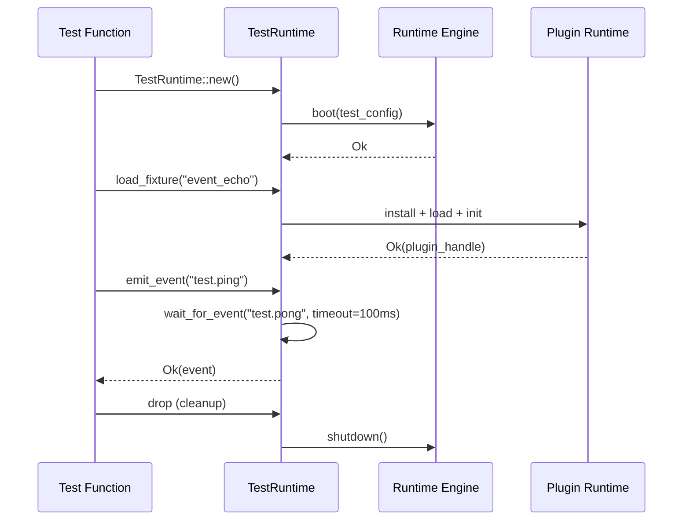

### 10.4 Performance Tests

Performance tests verify that runtime operations meet the latency and throughput thresholds defined in the acceptance criteria. The Testing Framework integrates with `criterion` for benchmark execution.

**Performance test definition**:
```rust
#[ldfx_benchmark]
fn bench_event_delivery(b: &mut Criterion) {
    b.bench_function("event_delivery_latency", |bencher| {
        bencher.iter(|| {
            // emit event, measure time to handler entry
        });
    });
}
```

**Acceptance threshold enforcement**: Performance tests can declare acceptance thresholds. If a threshold is exceeded, the test fails:
```rust
#[ldfx_benchmark(p99_max_us = 1000)]
fn bench_permission_check(b: &mut Criterion) { ... }
```

### 10.5 Security Tests

Security tests verify that the sandbox and permission system enforce their invariants. The Testing Framework provides:

- `SecurityTestHarness` — loads a plugin with a specific trust level and permission set
- `attempt_capability(capability)` — attempts a host API call requiring the given capability
- `assert_permission_denied!(result)` — asserts the call was denied
- `assert_no_sandbox_escape!()` — verifies the plugin cannot access host memory outside its sandbox

### 10.6 Snapshot Tests

Snapshot tests capture the output of a deterministic operation and compare it to a stored baseline. If the output changes, the test fails until the snapshot is explicitly updated.

**Snapshot targets**:
- Manifest serialisation output
- Diagnostics report structure
- Dependency resolution order
- Event sequence for a given document execution
- Plugin metrics after a fixed sequence of operations

**Snapshot update**: `ldfx test --update-snapshots` regenerates all snapshot baselines.

### 10.7 Plugin Tests

Plugin tests run inside the WASM sandbox, testing plugin code in its actual execution environment. The Testing Framework provides a `PluginTestHarness` that:

- Loads the plugin under test into a real WASM sandbox
- Provides mock implementations of all host APIs
- Allows the test to inject events and inspect the plugin's responses
- Captures all host API calls made during the test

### 10.8 Compatibility Tests

Compatibility tests verify that a plugin or document is compatible with multiple runtime versions. The Testing Framework maintains a matrix of runtime versions and runs the test suite against each:

```
CompatibilityMatrix {
    runtime_versions: ["2.8.0", "2.9.0", "2.9.1"],
    test_suite:       "tests/compat/",
}
```

### 10.9 Stress Tests

Stress tests verify runtime stability under extreme conditions:

- **Concurrent load**: Load N plugins simultaneously (N configurable, default 50)
- **Event storm**: Emit M events per second for T seconds (M=10,000, T=60)
- **Memory pressure**: Load plugins until total memory reaches 80% of system RAM
- **Crash recovery**: Crash K plugins simultaneously and verify runtime stability (K=10)
- **Hot reload storm**: Hot-reload a plugin N times per second for T seconds (N=10, T=30)

### 10.10 Test Automation and CI Integration

The Testing Framework integrates with `cargo test` as a custom test harness. All test types are runnable via:

```
cargo test                          # all tests
cargo test --test integration       # integration tests only
cargo test --bench                  # benchmarks
ldfx test --type security           # security tests via CLI
ldfx test --type stress             # stress tests via CLI
```

**CI output formats**:
- JUnit XML (`--format junit`) for GitHub Actions, GitLab CI, Jenkins
- LCOV coverage report (`--coverage`) for Codecov, Coveralls
- Markdown summary (`--format markdown`) for GitHub PR comments

---

## 11. IDE Integration

### 11.1 Integration Architecture

LDFX IDE integration is built on two open protocols: the Language Server Protocol (LSP) for editor features and the Debug Adapter Protocol (DAP) for debugging. This ensures that any editor supporting these protocols gains full LDFX support without custom plugins.

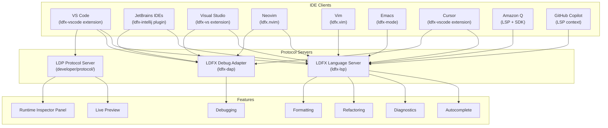

### 11.2 Language Server (ldfx-lsp)

The LDFX Language Server is a standalone binary (`ldfx-lsp`) that implements the Language Server Protocol. It provides editor features for LDFX manifest files (`.json`), LDFX configuration files (`.toml`), and LDFX plugin source code (`.rs`, `.ts`, `.go`, etc.).

**LSP capabilities**:

| Capability | Description |
|---|---|
| `textDocument/completion` | Autocomplete for manifest fields, permission strings, plugin IDs, event types |
| `textDocument/hover` | Documentation on hover for manifest fields and API names |
| `textDocument/definition` | Go-to-definition for plugin IDs, event types, permission strings |
| `textDocument/references` | Find all references to a plugin ID or event type |
| `textDocument/diagnostics` | Real-time manifest validation errors and warnings |
| `textDocument/formatting` | Format manifest JSON with canonical field ordering |
| `textDocument/rename` | Rename a plugin ID across all references |
| `textDocument/codeAction` | Quick fixes for common manifest errors |
| `textDocument/inlayHint` | Inline type hints for manifest fields |
| `workspace/symbol` | Search for plugin IDs and event types across the workspace |

**Manifest autocomplete**: When editing `manifest.json`, the language server provides:
- Field name completion with documentation
- Permission string completion from the full capability taxonomy
- Plugin ID completion from installed plugins
- Event type completion from the event registry
- Semver version completion with latest available versions

**Real-time diagnostics**: The language server validates the manifest on every keystroke and reports errors with precise character positions and fix suggestions.

### 11.3 Debug Adapter (ldfx-dap)

The LDFX Debug Adapter is a standalone binary (`ldfx-dap`) that implements the Debug Adapter Protocol. It bridges IDE debugging UIs to the LDFX Debugger (Section 6).

**Launch configuration (VS Code `launch.json`)**:
```json
{
    "type": "ldfx",
    "request": "launch",
    "name": "Debug LDFX Plugin",
    "document": "${workspaceFolder}/my-document.ldfx",
    "pluginId": "com.example.my-plugin",
    "developerMode": true,
    "stopOnEntry": false
}
```

**Attach configuration**:
```json
{
    "type": "ldfx",
    "request": "attach",
    "name": "Attach to Running LDFX",
    "runtimeSocket": "/tmp/ldfx-dev.sock",
    "pluginId": "com.example.my-plugin"
}
```

### 11.4 VS Code Extension

The `ldfx-vscode` extension provides the richest IDE integration. In addition to LSP and DAP support, it includes:

**Runtime Inspector Panel**: A VS Code WebView panel that embeds the Runtime Inspector. Shows live plugin states, metrics, event streams, and logs without leaving the editor.

**Live Preview**: A side-by-side preview of the LDFX document that updates in real time as the developer edits source files.

**Plugin Explorer**: A tree view in the VS Code sidebar showing all installed plugins, their states, and quick actions (enable, disable, reload, inspect).

**Log Panel**: A dedicated output channel for LDFX runtime logs with filtering and search.

**Status Bar**: Shows the current runtime health status (Healthy / Degraded / Unhealthy) and the count of running plugins.

### 11.5 JetBrains Plugin

The `ldfx-intellij` plugin provides LSP and DAP integration for all JetBrains IDEs (IntelliJ IDEA, CLion, GoLand, WebStorm, Rider). It uses the JetBrains LSP client API introduced in 2023.2.

**Additional JetBrains features**:
- Run configuration for `ldfx run` and `ldfx serve`
- Gutter icons for breakpoints in WASM-compiled Rust code
- Integrated terminal with `ldfx` CLI autocompletion

### 11.6 Neovim Integration

The `ldfx.nvim` plugin provides LSP and DAP integration for Neovim via `nvim-lspconfig` and `nvim-dap`.

**Setup**:
```lua
require('lspconfig').ldfx_lsp.setup({
    cmd = { 'ldfx-lsp' },
    filetypes = { 'json', 'toml', 'rust' },
    root_dir = require('lspconfig.util').root_pattern('.ldfx'),
})

require('dap').adapters.ldfx = {
    type = 'server',
    host = '127.0.0.1',
    port = 7401,
}
```

### 11.7 Amazon Q Integration

Amazon Q Developer uses the LDFX Language Server for context-aware code suggestions in LDFX projects. The LSP provides Amazon Q with:

- Full manifest schema for accurate field suggestions
- Plugin API signatures for accurate SDK usage suggestions
- Event type registry for accurate event subscription suggestions
- Permission taxonomy for accurate capability declarations

### 11.8 GitHub Copilot Integration

GitHub Copilot uses the LSP workspace context to provide accurate LDFX-specific suggestions. The language server exposes workspace symbols and type information that Copilot uses to generate contextually correct manifest fields, plugin API calls, and event subscriptions.

### 11.9 Autocomplete Details

The language server provides autocomplete in the following contexts:

| Context | Completions |
|---|---|
| `manifest.json` field names | All schema fields with types and documentation |
| `permissions` array values | Full capability taxonomy (200+ capabilities) |
| `dependencies` plugin IDs | All plugins in the local registry and marketplace |
| `entry_points.wasm` | WASM files in the project build directory |
| `events` subscriptions | All registered event types |
| SDK API calls (Rust) | All `DeveloperApi` methods with signatures |
| SDK API calls (TypeScript) | All `LdfxClient` methods with JSDoc |

### 11.10 Formatting

The language server formats `manifest.json` files with:
- Canonical field ordering (schema_version first, plugin_id second, etc.)
- Consistent indentation (2 spaces)
- Sorted arrays where order is not significant (permissions, dependencies)
- Trailing newline

---

## 12. CI/CD Integration

### 12.1 CI/CD Architecture

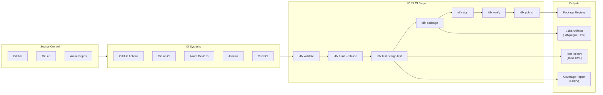

### 12.2 GitHub Actions

The LDFX project provides official GitHub Actions for all CI steps:

**`ldfx/actions/setup@v1`**: Installs the LDFX CLI and Rust toolchain.
```yaml
- uses: ldfx/actions/setup@v1
  with:
    ldfx-version: '2.9.0'
    rust-version: '1.78.0'
```

**`ldfx/actions/validate@v1`**: Validates a manifest or bundle.
```yaml
- uses: ldfx/actions/validate@v1
  with:
    path: 'manifest.json'
    strict: true
```

**`ldfx/actions/build@v1`**: Builds the project.
```yaml
- uses: ldfx/actions/build@v1
  with:
    release: true
    target: 'wasm32-wasi'
```

**`ldfx/actions/test@v1`**: Runs the test suite.
```yaml
- uses: ldfx/actions/test@v1
  with:
    types: 'unit,integration,security'
    junit-output: 'test-results.xml'
    coverage-output: 'coverage.lcov'
```

**`ldfx/actions/publish@v1`**: Signs and publishes a bundle.
```yaml
- uses: ldfx/actions/publish@v1
  with:
    bundle: 'dist/my-plugin.ldfxplugin'
    token: ${{ secrets.LDFX_TOKEN }}
    signing-key: ${{ secrets.SIGNING_KEY }}
    signing-cert: ${{ secrets.SIGNING_CERT }}
```

**Complete workflow example**:
```yaml
name: LDFX Plugin CI
on: [push, pull_request]
jobs:
  build-and-publish:
    runs-on: ubuntu-latest
    steps:
      - uses: actions/checkout@v4
      - uses: ldfx/actions/setup@v1
      - uses: ldfx/actions/validate@v1
        with: { path: manifest.json, strict: true }
      - uses: ldfx/actions/build@v1
        with: { release: true }
      - uses: ldfx/actions/test@v1
        with: { types: 'unit,integration', junit-output: results.xml }
      - uses: ldfx/actions/publish@v1
        if: github.ref == 'refs/heads/main'
        with:
          bundle: dist/my-plugin.ldfxplugin
          token: ${{ secrets.LDFX_TOKEN }}
```

### 12.3 GitLab CI

```yaml
# .gitlab-ci.yml
stages: [validate, build, test, package, publish]

validate:
  stage: validate
  image: ldfx/ci:2.9.0
  script: ldfx validate manifest.json --strict

build:
  stage: build
  image: ldfx/ci:2.9.0
  script: ldfx build --release
  artifacts:
    paths: [build/]

test:
  stage: test
  image: ldfx/ci:2.9.0
  script: ldfx test --format junit --output results.xml
  artifacts:
    reports:
      junit: results.xml

package:
  stage: package
  image: ldfx/ci:2.9.0
  script: ldfx package --sign --key $SIGNING_KEY --cert $SIGNING_CERT
  artifacts:
    paths: [dist/]

publish:
  stage: publish
  image: ldfx/ci:2.9.0
  script: ldfx publish dist/*.ldfxplugin --token $LDFX_TOKEN
  only: [main]
```

### 12.4 Azure DevOps

The LDFX Azure DevOps extension provides pipeline tasks equivalent to the GitHub Actions. Tasks are available in the Azure DevOps Marketplace as `LDFX.ldfx-tasks`.

```yaml
# azure-pipelines.yml
steps:
  - task: LdfxSetup@1
    inputs: { ldfxVersion: '2.9.0' }
  - task: LdfxValidate@1
    inputs: { path: 'manifest.json', strict: true }
  - task: LdfxBuild@1
    inputs: { release: true }
  - task: LdfxTest@1
    inputs: { junitOutput: '$(Agent.TempDirectory)/results.xml' }
  - task: PublishTestResults@2
    inputs: { testResultsFiles: '$(Agent.TempDirectory)/results.xml' }
  - task: LdfxPublish@1
    inputs:
      bundle: 'dist/my-plugin.ldfxplugin'
      token: '$(LDFX_TOKEN)'
```

### 12.5 Jenkins

The LDFX Jenkins plugin provides a Groovy DSL for pipeline steps:

```groovy
pipeline {
    agent any
    stages {
        stage('Validate') { steps { ldfxValidate manifest: 'manifest.json' } }
        stage('Build')    { steps { ldfxBuild release: true } }
        stage('Test')     { steps { ldfxTest junitOutput: 'results.xml' } }
        stage('Package')  { steps { ldfxPackage sign: true } }
        stage('Publish')  {
            when { branch 'main' }
            steps { ldfxPublish token: env.LDFX_TOKEN }
        }
    }
    post { always { junit 'results.xml' } }
}
```

### 12.6 Build Validation

All CI pipelines enforce the following validation gates before packaging:

1. `ldfx validate` passes with zero errors (warnings allowed unless `--strict`)
2. All unit tests pass
3. All integration tests pass
4. No security test failures
5. Bundle signature verifies against the CI signing certificate
6. Bundle integrity check passes

A pipeline that fails any gate does not proceed to the publish step.

---

## 13. Package Management

### 13.1 Package Management Architecture

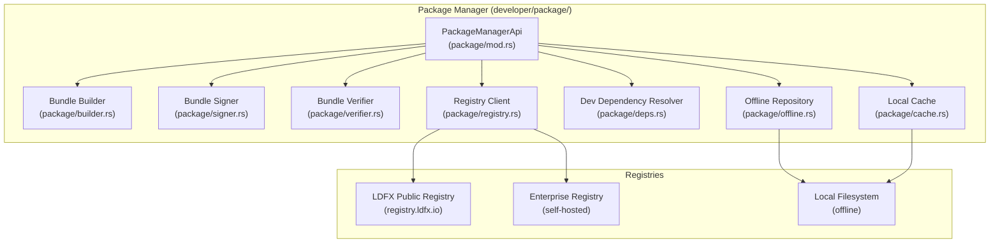

### 13.2 Package Registry

The LDFX Package Registry (`registry.ldfx.io`) is the central distribution point for LDFX plugins and SDK packages. It stores signed plugin bundles and exposes a REST API for search, download, and publish operations.

**Registry API endpoints**:

| Method | Path | Description |
|---|---|---|
| `GET` | `/v1/plugins` | Search plugins |
| `GET` | `/v1/plugins/{id}` | Get plugin metadata |
| `GET` | `/v1/plugins/{id}/{version}` | Get specific version metadata |
| `GET` | `/v1/plugins/{id}/{version}/bundle` | Download plugin bundle |
| `POST` | `/v1/plugins` | Publish a new plugin version |
| `GET` | `/v1/plugins/{id}/versions` | List all versions |
| `DELETE` | `/v1/plugins/{id}/{version}` | Yank a version (owner only) |
| `GET` | `/v1/sdk/{language}/{version}` | Download SDK package |

### 13.3 SDK Distribution

SDK packages are distributed through language-native registries (npm, crates.io, NuGet, etc.) as described in Section 3.11. The LDFX Package Registry also hosts SDK packages for air-gapped environments.

**SDK versioning**: SDK packages are versioned independently of the runtime. The compatibility matrix (Section 3.10) is published as a machine-readable JSON file at `registry.ldfx.io/v1/compatibility-matrix`.

### 13.4 Plugin Registry

The plugin registry stores plugin bundles with the following metadata:

```
PluginRegistryEntry {
    plugin_id:       PluginId,
    name:            String,
    description:     String,
    author:          PluginAuthor,
    versions:        Vec<VersionEntry>,
    latest_version:  semver::Version,
    downloads:       u64,
    trust_tier:      TrustTier,
    categories:      Vec<String>,
    tags:            Vec<String>,
    homepage:        Option<String>,
    repository:      Option<String>,
    license:         String,
}
```

### 13.5 Version Management

The Package Manager enforces semantic versioning for all published plugins. Version constraints follow the same semver rules as Cargo:

| Constraint | Meaning |
|---|---|
| `^1.2.3` | `>=1.2.3, <2.0.0` |
| `~1.2.3` | `>=1.2.3, <1.3.0` |
| `=1.2.3` | Exactly `1.2.3` |
| `>=1.2.3` | Any version ≥ 1.2.3 |
| `*` | Any version |

**Yanking**: A plugin version can be yanked (marked as do-not-use) without being deleted. Yanked versions are not returned in search results and are not installed by the dependency resolver unless explicitly pinned.

### 13.6 Dependency Management

The Package Manager's development-time dependency resolver handles SDK dependencies and plugin build dependencies. It is distinct from the Plugin Runtime's install-time resolver (Part 2.8 Section 7).

**Dependency resolution algorithm**:
1. Parse all `manifest.json` dependency declarations
2. Fetch version metadata from the registry (or local cache)
3. Run the PubGrub algorithm to find a compatible version set
4. Download and verify all resolved packages
5. Write the resolved versions to `ldfx.lock`

**Lock file**: `ldfx.lock` records the exact resolved version of every dependency. It is committed to source control to ensure reproducible builds.

### 13.7 Offline Repositories

For air-gapped environments, the Package Manager supports local filesystem repositories. A local repository is a directory containing signed plugin bundles and an index file.

**Local repository structure**:
```
local-repo/
├── index.json              # Registry index (same format as registry API)
├── plugins/
│   ├── com.example.plugin/
│   │   ├── 1.0.0.ldfxplugin
│   │   └── 1.1.0.ldfxplugin
│   └── com.other.plugin/
│       └── 2.0.0.ldfxplugin
└── sdk/
    ├── typescript/
    │   └── 2.9.0.tgz
    └── rust/
        └── 2.9.0.crate
```

**Mirror command**: `ldfx registry mirror --source registry.ldfx.io --dest ./local-repo` downloads all packages matching a filter to a local directory.

### 13.8 Enterprise Repositories

Enterprise repositories extend the local repository with:

- **Authentication**: OAuth 2.0 / SAML 2.0 for access control
- **Private plugins**: Plugins not published to the public registry
- **Policy enforcement**: Allowlist/blocklist of permitted plugins
- **Audit logging**: All download and publish operations logged
- **Custom signing CA**: Enterprise plugins signed by the enterprise CA

Enterprise repository configuration in `.ldfx/config.toml`:
```toml
[registry]
url = "https://registry.internal.example.com"
auth_method = "oauth2"
token_url = "https://auth.internal.example.com/token"
ca_certificate = "certs/enterprise-ca.pem"
signing_ca = "certs/enterprise-signing-ca.pem"
```

---
